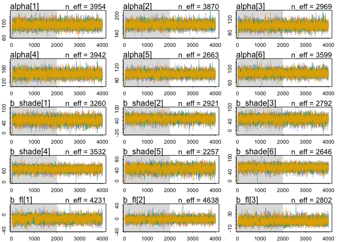
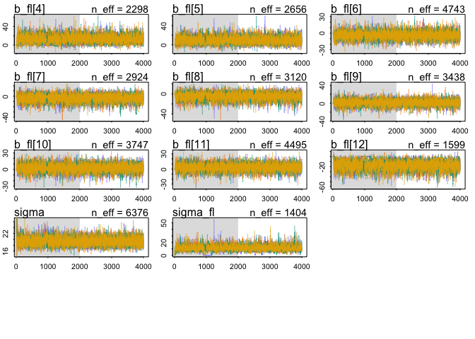
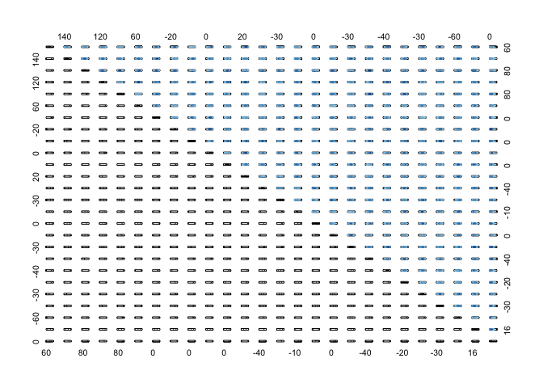
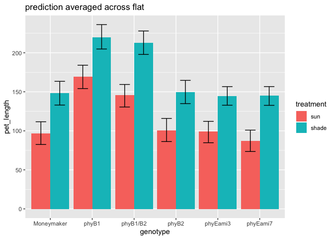
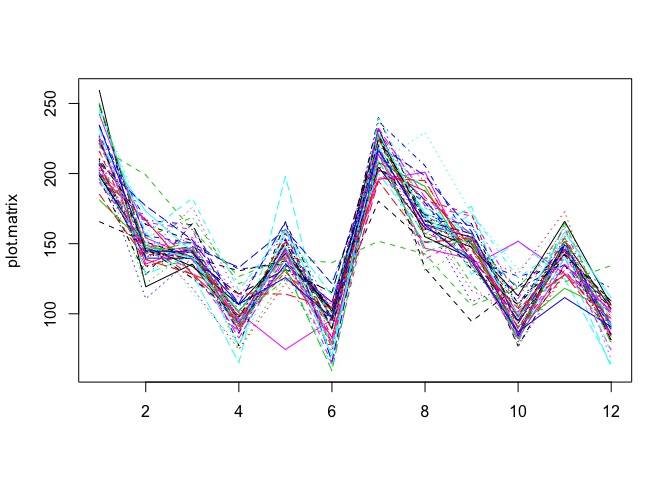

```r
library(tidyverse)
```

```
## ── Attaching packages ───────────────────────────────────── tidyverse 1.3.0 ──
```

```
## ✓ ggplot2 3.2.1     ✓ purrr   0.3.3
## ✓ tibble  2.1.3     ✓ dplyr   0.8.3
## ✓ tidyr   1.0.0     ✓ stringr 1.4.0
## ✓ readr   1.3.1     ✓ forcats 0.4.0
```

```
## ── Conflicts ──────────────────────────────────────── tidyverse_conflicts() ──
## x dplyr::filter() masks stats::filter()
## x dplyr::lag()    masks stats::lag()
```

```r
library(rethinking)
```

```
## Loading required package: rstan
```

```
## Loading required package: StanHeaders
```

```
## rstan (Version 2.19.2, GitRev: 2e1f913d3ca3)
```

```
## For execution on a local, multicore CPU with excess RAM we recommend calling
## options(mc.cores = parallel::detectCores()).
## To avoid recompilation of unchanged Stan programs, we recommend calling
## rstan_options(auto_write = TRUE)
```

```
## 
## Attaching package: 'rstan'
```

```
## The following object is masked from 'package:tidyr':
## 
##     extract
```

```
## Loading required package: parallel
```

```
## Loading required package: dagitty
```

```
## rethinking (Version 1.93)
```

```
## 
## Attaching package: 'rethinking'
```

```
## The following object is masked from 'package:purrr':
## 
##     map
```

```
## The following object is masked from 'package:stats':
## 
##     rstudent
```

## Q1)
a) subset the data for day 35
b) create a new column "stem_length" that is the sum of epi, int1, int2, and int3
c) although flats are listed as 1-6, flats in sun and shade are separate. Create a new column "flat2" that corrects for this.


```r
data <- read_csv("figure4phyE.csv")
```

```
## Parsed with column specification:
## cols(
##   genotype = col_character(),
##   treatment = col_character(),
##   flat = col_double(),
##   day = col_double(),
##   epi = col_double(),
##   int1 = col_double(),
##   int2 = col_double(),
##   int3 = col_double(),
##   pet1 = col_double(),
##   pet2 = col_double(),
##   pet3 = col_double(),
##   pet4 = col_double()
## )
```

```r
head(data)
```

```
## # A tibble: 6 x 12
##   genotype treatment  flat   day   epi  int1  int2  int3  pet1  pet2  pet3  pet4
##   <chr>    <chr>     <dbl> <dbl> <dbl> <dbl> <dbl> <dbl> <dbl> <dbl> <dbl> <dbl>
## 1 phyB1/B2 shade         1    21  24.0  3.18  0     0     14.1  4.88   0    0   
## 2 phyB1/B2 shade         1    28  47.4 21.7  11.3   3.13  31.0 26.8   11.1  2.61
## 3 phyB1/B2 shade         1    35  58.8 40.6  72.3  52.7   42.2 49.6   49.6 30.5 
## 4 phyB1/B2 shade         1    21  29.8  2.39  2.41  0     14.4 11.6    0    0   
## 5 phyB1/B2 shade         1    28  59.7  3.36 25.5   6.62  35.1 29.2   20.0  9.39
## 6 phyB1/B2 shade         1    35  69.6  4.91 56.6  35.5   49.8 34.6   47.6 40.5
```


```r
data35 <- data %>%
  filter(day==35) %>%
  mutate(stem_length=epi + int1 + int2 + int3,
         flat2=as.integer(as.factor(str_c(treatment, flat))),
         shade_i=ifelse(treatment=="sun", 0L, 1L),
         g_i= as.integer(factor(genotype,
                                   levels=c("Moneymaker", 
                                            "phyB1", 
                                            "phyB2", 
                                            "phyB1/B2", 
                                            "phyEami3", 
                                            "phyEami7")))) %>%
  select(genotype, treatment, g_i, shade_i, flat2, stem_length)
data35
```

```
## # A tibble: 88 x 6
##    genotype treatment   g_i shade_i flat2 stem_length
##    <chr>    <chr>     <int>   <int> <int>       <dbl>
##  1 phyB1/B2 shade         4       1     1       224. 
##  2 phyB1/B2 shade         4       1     1       167. 
##  3 phyB1/B2 shade         4       1     2       224. 
##  4 phyB1/B2 shade         4       1     3       196. 
##  5 phyB1/B2 shade         4       1     3       258. 
##  6 phyB1/B2 shade         4       1     5       227. 
##  7 phyB1/B2 sun           4       0     7       113. 
##  8 phyB1/B2 sun           4       0     7       148. 
##  9 phyB1/B2 sun           4       0     8        96.2
## 10 phyB1/B2 sun           4       0     9       160. 
## # … with 78 more rows
```

note that this is not a balanced design:


```r
with(data35, table(genotype, flat2))
```

```
##             flat2
## genotype     1 2 3 4 5 6 7 8 9 10 11 12
##   Moneymaker 1 2 2 1 0 0 1 2 2  1  0  0
##   phyB1      0 1 0 3 1 1 0 1 0  3  1  1
##   phyB1/B2   2 1 2 0 1 0 2 1 2  0  1  0
##   phyB2      1 0 1 1 1 2 1 0 1  1  1  2
##   phyEami3   3 1 0 1 4 3 3 1 0  0  2  3
##   phyEami7   1 3 3 2 1 2 1 1 2  2  0  1
```


Ultimately you want to know if any of the mutants have a different length from Moneymaker, in sun or in shade, or if the response to shade differs.

## Q2) Fit some models to explore treatment, genotype, and flat.

### a) don't include flat.  Determine whether genotype, treatment, and their interaction are important predictors of stem_length


```r
mean(data35$stem_length)
```

```
## [1] 141.2442
```

```r
sd(data35$stem_length)
```

```
## [1] 48.50967
```


```r
datsmall <- data35 %>% select(stem_length, g_i, shade_i)
mq2a1 <- ulam(alist(stem_length ~ dnorm(mu,sigma),
                  mu <- alpha[g_i] + b_shade*shade_i + b_i[g_i]*shade_i,
                  alpha[g_i] ~ dnorm(125,50),
                  b_shade ~ dnorm(0, 50),
                  b_i[g_i] ~  dnorm(0, 50),
                  sigma ~ dexp(1)),
            data=datsmall,
            chains=4,
            cores=4,
            log_lik = TRUE)
```


```r
precis(mq2a1, depth=2)
```

```
##                mean        sd      5.5%     94.5%     n_eff      Rhat
## alpha[1]  94.066584  8.415193  80.88481 107.71699 1771.8189 1.0026243
## alpha[2] 166.260330  8.249474 153.26199 179.70113 2354.2514 1.0008282
## alpha[3]  94.237352  8.414410  81.12079 108.18312 2546.7337 0.9987549
## alpha[4] 142.988345  8.592735 129.38673 156.57394 1955.1089 0.9994093
## alpha[5]  91.172462  7.461330  79.44534 102.79254 2039.1988 0.9986303
## alpha[6]  83.770414  7.857382  71.57971  96.49051 1983.6425 0.9985684
## b_shade   52.409104 19.151177  21.83426  83.84441  525.5293 1.0029062
## b_i[1]     6.056723 22.072214 -28.56506  41.69669  628.3285 1.0014970
## b_i[2]    10.181142 21.515371 -23.98310  44.88482  618.8948 1.0024684
## b_i[3]     7.164735 20.868889 -26.40429  39.76549  632.7844 1.0013023
## b_i[4]    20.090053 20.874398 -13.15738  53.38731  669.5842 1.0012070
## b_i[5]     2.500963 20.653090 -30.76956  35.49025  584.0820 1.0036630
## b_i[6]    13.205539 21.075952 -21.11450  45.17554  629.0802 1.0027621
## sigma     21.256925  1.486741  19.05447  23.75065 1978.9131 0.9992634
```

```r
traceplot(mq2a1)
pairs(mq2a1)
```

<!-- --><!-- -->

```r
extract.samples(mq2a1) %>%
  as.data.frame() %>%
  cor() %>%
  round(2)
```

```
##         alpha.1 alpha.2 alpha.3 alpha.4 alpha.5 alpha.6 b_shade b_i.1 b_i.2
## alpha.1    1.00    0.01    0.01    0.01   -0.03    0.02   -0.04 -0.34  0.02
## alpha.2    0.01    1.00    0.02    0.00    0.01   -0.05   -0.08  0.07 -0.29
## alpha.3    0.01    0.02    1.00    0.05   -0.04    0.01   -0.12  0.10  0.09
## alpha.4    0.01    0.00    0.05    1.00   -0.05    0.00   -0.12  0.09  0.11
## alpha.5   -0.03    0.01   -0.04   -0.05    1.00   -0.02   -0.06  0.06  0.04
## alpha.6    0.02   -0.05    0.01    0.00   -0.02    1.00   -0.03  0.00  0.05
## b_shade   -0.04   -0.08   -0.12   -0.12   -0.06   -0.03    1.00 -0.85 -0.84
## b_i.1     -0.34    0.07    0.10    0.09    0.06    0.00   -0.85  1.00  0.71
## b_i.2      0.02   -0.29    0.09    0.11    0.04    0.05   -0.84  0.71  1.00
## b_i.3      0.03    0.07   -0.28    0.08    0.07    0.03   -0.84  0.71  0.70
## b_i.4      0.01    0.08    0.09   -0.28    0.09    0.02   -0.83  0.72  0.68
## b_i.5      0.05    0.07    0.12    0.12   -0.30    0.05   -0.89  0.74  0.75
## b_i.6      0.04    0.09    0.09    0.11    0.05   -0.34   -0.88  0.76  0.73
## sigma      0.09   -0.02    0.03   -0.02   -0.02    0.01    0.00 -0.04  0.01
##         b_i.3 b_i.4 b_i.5 b_i.6 sigma
## alpha.1  0.03  0.01  0.05  0.04  0.09
## alpha.2  0.07  0.08  0.07  0.09 -0.02
## alpha.3 -0.28  0.09  0.12  0.09  0.03
## alpha.4  0.08 -0.28  0.12  0.11 -0.02
## alpha.5  0.07  0.09 -0.30  0.05 -0.02
## alpha.6  0.03  0.02  0.05 -0.34  0.01
## b_shade -0.84 -0.83 -0.89 -0.88  0.00
## b_i.1    0.71  0.72  0.74  0.76 -0.04
## b_i.2    0.70  0.68  0.75  0.73  0.01
## b_i.3    1.00  0.71  0.73  0.74 -0.02
## b_i.4    0.71  1.00  0.73  0.73  0.00
## b_i.5    0.73  0.73  1.00  0.78  0.01
## b_i.6    0.74  0.73  0.78  1.00 -0.01
## sigma   -0.02  0.00  0.01 -0.01  1.00
```

Right, to have beta_shade and separate betas for each shade for each species is redundant


```r
datsmall <- data35 %>% select(stem_length, g_i, shade_i)
mq2a2 <- ulam(alist(stem_length ~ dnorm(mu,sigma),
                  mu <- alpha[g_i] + b_shade[g_i]*shade_i,
                  alpha[g_i] ~ dnorm(125,50),
                  b_shade[g_i] ~  dnorm(0, 50),
                  sigma ~ dexp(1)),
            data=datsmall,
            chains=4,
            cores=4,
            log_lik = TRUE)
```


```r
precis(mq2a2, depth = 2)
```

```
##                 mean        sd      5.5%     94.5%    n_eff      Rhat
## alpha[1]    95.67258  8.633241  81.78694 109.55291 1771.727 1.0008486
## alpha[2]   167.60561  8.518496 154.00381 181.33443 1742.773 1.0006170
## alpha[3]    96.10441  8.295770  82.71760 109.05703 1836.550 1.0019901
## alpha[4]   144.46350  8.290473 131.17130 157.51975 2070.570 1.0006093
## alpha[5]    92.53620  6.943582  81.25586 103.48194 1899.789 1.0022644
## alpha[6]    85.04310  7.788836  72.46881  97.28469 1756.974 1.0002363
## b_shade[1]  54.90216 12.016214  36.27904  73.87369 1818.243 1.0003210
## b_shade[2]  59.79284 11.947532  40.61161  79.35551 1786.432 0.9992940
## b_shade[3]  56.03829 11.711397  36.79257  74.44336 1967.775 1.0029041
## b_shade[4]  69.07972 11.604510  50.77922  87.82614 1926.998 1.0012904
## b_shade[5]  52.76716  9.151526  38.23423  67.54851 1956.691 1.0008495
## b_shade[6]  63.77220  9.602661  48.40417  79.48668 1823.639 1.0013206
## sigma       21.27394  1.545925  19.04233  23.92472 1862.090 0.9994048
```

```r
traceplot(mq2a2)
pairs(mq2a2)
```

<!-- --><!-- -->

```r
extract.samples(mq2a2) %>%
  as.data.frame() %>%
  cor() %>%
  round(2)
```

```
##           alpha.1 alpha.2 alpha.3 alpha.4 alpha.5 alpha.6 b_shade.1 b_shade.2
## alpha.1      1.00    0.00    0.01    0.03   -0.01   -0.01     -0.71      0.01
## alpha.2      0.00    1.00    0.01   -0.08    0.05    0.01      0.00     -0.71
## alpha.3      0.01    0.01    1.00   -0.04   -0.06   -0.04     -0.02     -0.01
## alpha.4      0.03   -0.08   -0.04    1.00    0.01    0.03     -0.02      0.07
## alpha.5     -0.01    0.05   -0.06    0.01    1.00    0.02      0.00     -0.08
## alpha.6     -0.01    0.01   -0.04    0.03    0.02    1.00      0.00     -0.02
## b_shade.1   -0.71    0.00   -0.02   -0.02    0.00    0.00      1.00     -0.02
## b_shade.2    0.01   -0.71   -0.01    0.07   -0.08   -0.02     -0.02      1.00
## b_shade.3   -0.03   -0.01   -0.68    0.03    0.04    0.02      0.01      0.02
## b_shade.4   -0.03    0.04    0.00   -0.67   -0.04   -0.05      0.05     -0.07
## b_shade.5    0.01   -0.04    0.04   -0.01   -0.74   -0.03     -0.01      0.06
## b_shade.6    0.00   -0.02    0.04   -0.03   -0.01   -0.77     -0.01      0.03
## sigma        0.03   -0.03    0.10    0.04    0.04    0.00     -0.06      0.00
##           b_shade.3 b_shade.4 b_shade.5 b_shade.6 sigma
## alpha.1       -0.03     -0.03      0.01      0.00  0.03
## alpha.2       -0.01      0.04     -0.04     -0.02 -0.03
## alpha.3       -0.68      0.00      0.04      0.04  0.10
## alpha.4        0.03     -0.67     -0.01     -0.03  0.04
## alpha.5        0.04     -0.04     -0.74     -0.01  0.04
## alpha.6        0.02     -0.05     -0.03     -0.77  0.00
## b_shade.1      0.01      0.05     -0.01     -0.01 -0.06
## b_shade.2      0.02     -0.07      0.06      0.03  0.00
## b_shade.3      1.00     -0.07     -0.03     -0.02 -0.08
## b_shade.4     -0.07      1.00      0.03      0.05 -0.03
## b_shade.5     -0.03      0.03      1.00      0.00 -0.04
## b_shade.6     -0.02      0.05      0.00      1.00 -0.01
## sigma         -0.08     -0.03     -0.04     -0.01  1.00
```

This is sampled much better.

let's compare to some simpler models

Same shade response per genotype


```r
datsmall <- data35 %>% select(stem_length, shade_i, g_i)
mq2a3 <- ulam(alist(stem_length ~ dnorm(mu,sigma),
                  mu <- alpha[g_i] + b_shade*shade_i,
                  alpha[g_i] ~ dnorm(125,50),
                  b_shade ~ dnorm(0, 50),
                  sigma ~ dexp(1)),
            data=datsmall,
            chains=4,
            cores=4,
            log_lik = TRUE)
```


```r
precis(mq2a3)
```

```
## 6 vector or matrix parameters hidden. Use depth=2 to show them.
```

```
##             mean       sd     5.5%    94.5%    n_eff      Rhat
## b_shade 61.59714 4.304959 54.90093 68.44637 1199.168 1.0019049
## sigma   20.94462 1.434794 18.82225 23.40728 1772.329 0.9997481
```

```r
traceplot(mq2a3)
pairs(mq2a3)
```

<!-- --><!-- -->

```r
extract.samples(mq2a3) %>%
  as.data.frame() %>%
  cor() %>%
  round(2)
```

```
##         alpha.1 alpha.2 alpha.3 alpha.4 alpha.5 alpha.6 b_shade sigma
## alpha.1    1.00    0.13    0.11    0.08    0.15    0.16   -0.32  0.04
## alpha.2    0.13    1.00    0.08    0.08    0.14    0.15   -0.30 -0.05
## alpha.3    0.11    0.08    1.00    0.09    0.14    0.17   -0.33  0.02
## alpha.4    0.08    0.08    0.09    1.00    0.13    0.14   -0.33  0.00
## alpha.5    0.15    0.14    0.14    0.13    1.00    0.19   -0.48  0.01
## alpha.6    0.16    0.15    0.17    0.14    0.19    1.00   -0.48  0.05
## b_shade   -0.32   -0.30   -0.33   -0.33   -0.48   -0.48    1.00 -0.03
## sigma      0.04   -0.05    0.02    0.00    0.01    0.05   -0.03  1.00
```


```r
compare(mq2a2, mq2a3)
```

```
##           WAIC       SE    dWAIC      dSE     pWAIC      weight
## mq2a3 814.9346 17.74958 0.000000       NA  9.503643 0.991265502
## mq2a2 824.3980 17.27912 9.463404 3.264685 14.588125 0.008734498
```

Interesting...that would argue for the simple model (no difference in shade response between genotypes).

Any difference in genotypes at all?


```r
datsmall <- data35 %>% select(stem_length, shade_i)
mq2a4 <- ulam(alist(stem_length ~ dnorm(mu,sigma),
                  mu <- alpha + b_shade*shade_i,
                  alpha ~ dnorm(125,50),
                  b_shade ~ dnorm(0, 50),
                  sigma ~ dexp(1)),
            data=datsmall,
            chains=4,
            cores=4,
            log_lik = TRUE)
```


```r
precis(mq2a4)
```

```
##              mean       sd      5.5%     94.5%    n_eff      Rhat
## alpha   109.71133 5.142379 101.63741 118.07995 1045.695 1.0000261
## b_shade  57.82505 6.824160  47.12175  68.67071 1033.233 0.9988555
## sigma    33.36385 2.072166  30.24151  36.80737 1223.681 1.0018717
```

```r
traceplot(mq2a4)
```

<!-- -->

```r
pairs(mq2a4)
```

<!-- -->

```r
extract.samples(mq2a4) %>%
  as.data.frame() %>%
  cor() %>%
  round(2)
```

```
##         alpha b_shade sigma
## alpha    1.00   -0.73  0.03
## b_shade -0.73    1.00 -0.02
## sigma    0.03   -0.02  1.00
```


```r
compare(mq2a2, mq2a3, mq2a4)
```

```
##           WAIC       SE     dWAIC       dSE     pWAIC       weight
## mq2a3 814.9346 17.74958  0.000000        NA  9.503643 9.912655e-01
## mq2a2 824.3980 17.27912  9.463404  3.264685 14.588125 8.734498e-03
## mq2a4 902.3481 18.35826 87.413531 18.999178  3.779848 1.034149e-19
```

OK genotype impt

b) starting with your best model from a), include flat without pooling


```r
datsmall <- data35 %>% select(stem_length, shade_i, g_i, flat2)
mq2b1 <- ulam(alist(stem_length ~ dnorm(mu,sigma),
                  mu <- alpha[g_i] + b_shade*shade_i + b_fl[flat2],
                  alpha[g_i] ~ dnorm(125,50),
                  b_shade ~ dnorm(0, 50),
                  b_fl[flat2] ~ dnorm(0,10),
                  sigma ~ dexp(1)),
            data=datsmall,
            chains=4,
            cores=4,
            log_lik = TRUE)
```


```r
precis(mq2b1, depth=2)
```

```
##                mean       sd        5.5%      94.5%     n_eff      Rhat
## alpha[1]  92.308395 7.304765  80.7907339 104.266396  902.0325 1.0009239
## alpha[2] 164.650497 7.130302 153.2734955 175.579628  919.9686 1.0028048
## alpha[3]  95.306587 7.090185  84.3185409 106.319950  886.2890 1.0017037
## alpha[4] 148.923500 7.297195 137.3042090 160.566751  913.2374 1.0011225
## alpha[5]  91.178438 6.318912  81.2515091 101.360846  785.2805 1.0010010
## alpha[6]  86.534442 6.389502  76.0293777  96.436487  737.7469 1.0026237
## b_shade   60.377584 7.099595  48.9890263  71.773167  524.1489 1.0035656
## b_fl[1]  -12.681123 6.482534 -23.4514816  -2.643422 1649.8520 0.9995139
## b_fl[2]   -4.086618 6.608630 -14.4570907   6.749815 1488.7360 0.9994233
## b_fl[3]    8.560701 6.530887  -2.1439658  18.923507 1607.7937 1.0010237
## b_fl[4]   10.879183 6.570205   0.4947236  21.419654 1424.8646 1.0011631
## b_fl[5]    6.971708 6.700089  -3.7296858  17.461551 1665.7991 1.0017386
## b_fl[6]   -7.323726 6.514008 -17.5125178   3.130171 1676.6436 1.0001782
## b_fl[7]   -1.366679 6.907874 -12.5318332   9.538076 1207.6973 1.0002615
## b_fl[8]   -3.069754 7.187105 -14.4349243   8.126412 1253.9230 1.0004118
## b_fl[9]    2.188515 6.617982  -8.2995895  12.944910 1120.2004 1.0004813
## b_fl[10]   5.244643 6.567179  -4.9886594  15.550796 1272.0468 1.0013084
## b_fl[11]   5.741460 7.059038  -5.0380049  17.073778 1326.7051 0.9995435
## b_fl[12] -13.961681 6.873965 -24.9367836  -2.632316 1398.5047 1.0005533
## sigma     19.058822 1.396316  16.9966476  21.396342 2275.6464 1.0009907
```

```r
traceplot(mq2b1, ask=FALSE)
```

```
## Waiting to draw page 2 of 2
```

<!-- -->

```r
pairs(mq2b1)
```

<!-- --><!-- -->

```r
extract.samples(mq2b1) %>%
  as.data.frame() %>%
  cor() %>%
  round(2)
```

```
##         alpha.1 alpha.2 alpha.3 alpha.4 alpha.5 alpha.6 b_shade b_fl.1 b_fl.2
## alpha.1    1.00    0.35    0.36    0.39    0.42    0.47   -0.48   0.02  -0.04
## alpha.2    0.35    1.00    0.40    0.33    0.43    0.45   -0.50   0.10   0.01
## alpha.3    0.36    0.40    1.00    0.43    0.46    0.47   -0.52   0.06   0.07
## alpha.4    0.39    0.33    0.43    1.00    0.48    0.44   -0.48   0.01  -0.03
## alpha.5    0.42    0.43    0.46    0.48    1.00    0.49   -0.56  -0.06   0.01
## alpha.6    0.47    0.45    0.47    0.44    0.49    1.00   -0.60   0.11   0.01
## b_shade   -0.48   -0.50   -0.52   -0.48   -0.56   -0.60    1.00  -0.37  -0.38
## b_fl.1     0.02    0.10    0.06    0.01   -0.06    0.11   -0.37   1.00   0.24
## b_fl.2    -0.04    0.01    0.07   -0.03    0.01    0.01   -0.38   0.24   1.00
## b_fl.3    -0.08    0.10    0.04   -0.04    0.08   -0.05   -0.34   0.27   0.27
## b_fl.4     0.03   -0.10    0.04    0.06    0.05    0.05   -0.37   0.22   0.30
## b_fl.5     0.09    0.06   -0.01   -0.05   -0.06    0.09   -0.38   0.29   0.29
## b_fl.6     0.06    0.05   -0.04    0.07   -0.03    0.02   -0.38   0.25   0.29
## b_fl.7    -0.29   -0.31   -0.33   -0.41   -0.47   -0.40    0.37   0.01   0.01
## b_fl.8    -0.39   -0.31   -0.26   -0.32   -0.35   -0.35    0.35  -0.08  -0.05
## b_fl.9    -0.40   -0.26   -0.34   -0.39   -0.31   -0.42    0.34  -0.03   0.00
## b_fl.10   -0.34   -0.41   -0.35   -0.27   -0.32   -0.41    0.36  -0.10  -0.03
## b_fl.11   -0.22   -0.33   -0.29   -0.26   -0.38   -0.26    0.30  -0.02  -0.02
## b_fl.12   -0.25   -0.35   -0.40   -0.26   -0.42   -0.38    0.36   0.01  -0.03
## sigma     -0.02    0.06    0.02    0.02   -0.02    0.01    0.00   0.09   0.02
##         b_fl.3 b_fl.4 b_fl.5 b_fl.6 b_fl.7 b_fl.8 b_fl.9 b_fl.10 b_fl.11
## alpha.1  -0.08   0.03   0.09   0.06  -0.29  -0.39  -0.40   -0.34   -0.22
## alpha.2   0.10  -0.10   0.06   0.05  -0.31  -0.31  -0.26   -0.41   -0.33
## alpha.3   0.04   0.04  -0.01  -0.04  -0.33  -0.26  -0.34   -0.35   -0.29
## alpha.4  -0.04   0.06  -0.05   0.07  -0.41  -0.32  -0.39   -0.27   -0.26
## alpha.5   0.08   0.05  -0.06  -0.03  -0.47  -0.35  -0.31   -0.32   -0.38
## alpha.6  -0.05   0.05   0.09   0.02  -0.40  -0.35  -0.42   -0.41   -0.26
## b_shade  -0.34  -0.37  -0.38  -0.38   0.37   0.35   0.34    0.36    0.30
## b_fl.1    0.27   0.22   0.29   0.25   0.01  -0.08  -0.03   -0.10   -0.02
## b_fl.2    0.27   0.30   0.29   0.29   0.01  -0.05   0.00   -0.03   -0.02
## b_fl.3    1.00   0.23   0.24   0.27  -0.02  -0.01   0.04    0.07   -0.05
## b_fl.4    0.23   1.00   0.27   0.23   0.03  -0.08   0.02   -0.01    0.03
## b_fl.5    0.24   0.27   1.00   0.29   0.02  -0.02   0.01   -0.02    0.00
## b_fl.6    0.27   0.23   0.29   1.00  -0.02  -0.02   0.00    0.01    0.00
## b_fl.7   -0.02   0.03   0.02  -0.02   1.00   0.26   0.27    0.20    0.21
## b_fl.8   -0.01  -0.08  -0.02  -0.02   0.26   1.00   0.25    0.22    0.17
## b_fl.9    0.04   0.02   0.01   0.00   0.27   0.25   1.00    0.27    0.19
## b_fl.10   0.07  -0.01  -0.02   0.01   0.20   0.22   0.27    1.00    0.19
## b_fl.11  -0.05   0.03   0.00   0.00   0.21   0.17   0.19    0.19    1.00
## b_fl.12  -0.03  -0.05  -0.01   0.03   0.23   0.19   0.25    0.24    0.22
## sigma    -0.07  -0.05  -0.04   0.04  -0.03   0.05   0.03   -0.07   -0.05
##         b_fl.12 sigma
## alpha.1   -0.25 -0.02
## alpha.2   -0.35  0.06
## alpha.3   -0.40  0.02
## alpha.4   -0.26  0.02
## alpha.5   -0.42 -0.02
## alpha.6   -0.38  0.01
## b_shade    0.36  0.00
## b_fl.1     0.01  0.09
## b_fl.2    -0.03  0.02
## b_fl.3    -0.03 -0.07
## b_fl.4    -0.05 -0.05
## b_fl.5    -0.01 -0.04
## b_fl.6     0.03  0.04
## b_fl.7     0.23 -0.03
## b_fl.8     0.19  0.05
## b_fl.9     0.25  0.03
## b_fl.10    0.24 -0.07
## b_fl.11    0.22 -0.05
## b_fl.12    1.00  0.07
## sigma      0.07  1.00
```

c) starting with your best model from a), use a hierarchical model that allows partial pooling across flats


```r
datsmall <- data35 %>% select(stem_length, shade_i, g_i, flat2)
mq2c1 <- ulam(alist(stem_length ~ dnorm(mu,sigma),
                  mu <- alpha[g_i] + b_shade*shade_i + b_fl[flat2],
                  alpha[g_i] ~ dnorm(125,50),
                  b_shade ~ dnorm(0, 50),
                  b_fl[flat2] ~ dnorm(0,sigma_fl),
                  sigma ~ dexp(1),
                  sigma_fl ~ dcauchy(0,3)),
            data=datsmall,
            chains=4,
            cores=4,
            iter=4000,
            log_lik = TRUE)
```


```r
precis(mq2c1, depth=2)
```

```
##                mean       sd        5.5%       94.5%    n_eff      Rhat
## alpha[1]  92.484281 7.255863  81.1250217 103.9095244 2858.853 1.0017707
## alpha[2] 165.283775 7.346099 153.4594242 177.3336145 2910.655 1.0009087
## alpha[3]  95.457548 7.302103  83.8819652 107.4687058 2615.716 1.0016166
## alpha[4] 149.249246 7.313914 137.7064933 161.0085498 2791.959 1.0014647
## alpha[5]  91.055002 6.559864  80.8892731 101.6137693 2167.884 1.0021911
## alpha[6]  86.788258 6.696724  76.2419063  97.7515217 2459.058 1.0021087
## b_shade   59.889814 7.148348  48.5807870  70.8847407 1778.541 1.0022548
## b_fl[1]  -11.074725 7.335145 -23.2938061  -0.0546655 2383.229 1.0011472
## b_fl[2]   -3.558674 6.643494 -14.5565107   6.5466424 4073.619 0.9998739
## b_fl[3]    7.907874 7.070012  -2.2877906  19.8710172 2119.811 1.0012911
## b_fl[4]    9.892464 7.335303  -0.7127114  22.2879310 2109.140 1.0008902
## b_fl[5]    6.553065 6.889362  -3.5362942  18.0675847 2597.166 1.0003270
## b_fl[6]   -6.308330 6.745414 -17.5524797   3.5377625 3290.690 1.0001791
## b_fl[7]   -1.453261 6.496723 -12.2218559   8.4057292 2915.570 1.0006037
## b_fl[8]   -2.903988 6.827699 -14.2751716   7.5044252 3331.229 1.0011184
## b_fl[9]    1.684000 6.688436  -8.7621952  12.4067910 3115.299 1.0005096
## b_fl[10]   4.559650 6.896267  -5.7024077  15.9397679 3451.404 1.0010270
## b_fl[11]   5.003323 7.104471  -5.5729379  16.6533887 3558.607 1.0002924
## b_fl[12] -12.718161 8.068032 -26.0688897  -0.5379296 1808.862 1.0036441
## sigma     19.266641 1.425956  17.0799289  21.6567620 3982.832 0.9998721
## sigma_fl   9.755348 4.014662   3.7970854  16.4947094 1257.928 1.0033562
```

```r
traceplot(mq2c1, ask=FALSE)
```

```
## Waiting to draw page 2 of 2
```

<!-- -->

```r
pairs(mq2c1)
```

<!-- --><!-- -->

```r
extract.samples(mq2c1) %>%
  as.data.frame() %>%
  cor() %>%
  round(2)
```

```
##          alpha.1 alpha.2 alpha.3 alpha.4 alpha.5 alpha.6 b_shade b_fl.1 b_fl.2
## alpha.1     1.00    0.37    0.38    0.41    0.44    0.48   -0.49  -0.03  -0.06
## alpha.2     0.37    1.00    0.40    0.34    0.41    0.44   -0.45   0.06   0.00
## alpha.3     0.38    0.40    1.00    0.41    0.50    0.46   -0.50  -0.09   0.02
## alpha.4     0.41    0.34    0.41    1.00    0.46    0.45   -0.49  -0.09  -0.03
## alpha.5     0.44    0.41    0.50    0.46    1.00    0.51   -0.58  -0.13   0.00
## alpha.6     0.48    0.44    0.46    0.45    0.51    1.00   -0.58   0.02  -0.05
## b_shade    -0.49   -0.45   -0.50   -0.49   -0.58   -0.58    1.00  -0.26  -0.34
## b_fl.1     -0.03    0.06   -0.09   -0.09   -0.13    0.02   -0.26   1.00   0.33
## b_fl.2     -0.06    0.00    0.02   -0.03    0.00   -0.05   -0.34   0.33   1.00
## b_fl.3     -0.05    0.00    0.04   -0.03    0.13   -0.04   -0.37   0.05   0.22
## b_fl.4      0.03   -0.14    0.06    0.09    0.13    0.03   -0.38   0.00   0.20
## b_fl.5      0.08   -0.02    0.03    0.05    0.00    0.05   -0.40   0.10   0.22
## b_fl.6      0.04    0.01   -0.09    0.05   -0.11   -0.02   -0.33   0.39   0.33
## b_fl.7     -0.37   -0.29   -0.40   -0.44   -0.49   -0.38    0.40   0.07   0.00
## b_fl.8     -0.41   -0.32   -0.30   -0.35   -0.40   -0.38    0.37   0.07   0.02
## b_fl.9     -0.41   -0.29   -0.37   -0.40   -0.34   -0.44    0.37  -0.03  -0.01
## b_fl.10    -0.33   -0.48   -0.33   -0.26   -0.28   -0.41    0.32  -0.11   0.00
## b_fl.11    -0.22   -0.31   -0.28   -0.30   -0.30   -0.24    0.25  -0.09  -0.05
## b_fl.12    -0.27   -0.25   -0.43   -0.28   -0.49   -0.32    0.36   0.29   0.08
## sigma       0.00    0.03   -0.02   -0.02   -0.06    0.01    0.02   0.19   0.07
## sigma_fl    0.08   -0.03    0.16    0.11    0.24    0.08   -0.15  -0.43  -0.12
##          b_fl.3 b_fl.4 b_fl.5 b_fl.6 b_fl.7 b_fl.8 b_fl.9 b_fl.10 b_fl.11
## alpha.1   -0.05   0.03   0.08   0.04  -0.37  -0.41  -0.41   -0.33   -0.22
## alpha.2    0.00  -0.14  -0.02   0.01  -0.29  -0.32  -0.29   -0.48   -0.31
## alpha.3    0.04   0.06   0.03  -0.09  -0.40  -0.30  -0.37   -0.33   -0.28
## alpha.4   -0.03   0.09   0.05   0.05  -0.44  -0.35  -0.40   -0.26   -0.30
## alpha.5    0.13   0.13   0.00  -0.11  -0.49  -0.40  -0.34   -0.28   -0.30
## alpha.6   -0.04   0.03   0.05  -0.02  -0.38  -0.38  -0.44   -0.41   -0.24
## b_shade   -0.37  -0.38  -0.40  -0.33   0.40   0.37   0.37    0.32    0.25
## b_fl.1     0.05   0.00   0.10   0.39   0.07   0.07  -0.03   -0.11   -0.09
## b_fl.2     0.22   0.20   0.22   0.33   0.00   0.02  -0.01    0.00   -0.05
## b_fl.3     1.00   0.40   0.36   0.14  -0.03  -0.06   0.06    0.10    0.09
## b_fl.4     0.40   1.00   0.40   0.13  -0.07  -0.09   0.00    0.13    0.11
## b_fl.5     0.36   0.40   1.00   0.19  -0.03  -0.06   0.00    0.06    0.08
## b_fl.6     0.14   0.13   0.19   1.00   0.06   0.04  -0.03   -0.04   -0.07
## b_fl.7    -0.03  -0.07  -0.03   0.06   1.00   0.30   0.29    0.23    0.21
## b_fl.8    -0.06  -0.09  -0.06   0.04   0.30   1.00   0.27    0.22    0.17
## b_fl.9     0.06   0.00   0.00  -0.03   0.29   0.27   1.00    0.28    0.24
## b_fl.10    0.10   0.13   0.06  -0.04   0.23   0.22   0.28    1.00    0.27
## b_fl.11    0.09   0.11   0.08  -0.07   0.21   0.17   0.24    0.27    1.00
## b_fl.12   -0.22  -0.26  -0.17   0.18   0.32   0.28   0.19    0.09    0.06
## sigma     -0.14  -0.17  -0.12   0.12   0.02   0.06  -0.04   -0.10   -0.11
## sigma_fl   0.36   0.43   0.30  -0.25  -0.14  -0.19   0.02    0.16    0.19
##          b_fl.12 sigma sigma_fl
## alpha.1    -0.27  0.00     0.08
## alpha.2    -0.25  0.03    -0.03
## alpha.3    -0.43 -0.02     0.16
## alpha.4    -0.28 -0.02     0.11
## alpha.5    -0.49 -0.06     0.24
## alpha.6    -0.32  0.01     0.08
## b_shade     0.36  0.02    -0.15
## b_fl.1      0.29  0.19    -0.43
## b_fl.2      0.08  0.07    -0.12
## b_fl.3     -0.22 -0.14     0.36
## b_fl.4     -0.26 -0.17     0.43
## b_fl.5     -0.17 -0.12     0.30
## b_fl.6      0.18  0.12    -0.25
## b_fl.7      0.32  0.02    -0.14
## b_fl.8      0.28  0.06    -0.19
## b_fl.9      0.19 -0.04     0.02
## b_fl.10     0.09 -0.10     0.16
## b_fl.11     0.06 -0.11     0.19
## b_fl.12     1.00  0.22    -0.54
## sigma       0.22  1.00    -0.22
## sigma_fl   -0.54 -0.22     1.00
```

Q3) Compare the models, which is preferred?


```r
compare(mq2a3, mq2b1, mq2c1)
```

```
##           WAIC       SE     dWAIC       dSE     pWAIC      weight
## mq2b1 804.4193 16.88087  0.000000        NA 15.954019 0.780447845
## mq2c1 806.9933 16.99178  2.573927 0.9968932 16.449504 0.215487854
## mq2a3 814.9346 17.74958 10.515252 7.2371534  9.503643 0.004064301
```

So we aren't really gaining anything by pooling (or even by adding flat) but not hurting much either.  keep it in.

how about model2 with genotype shade interaction?


```r
datsmall <- data35 %>% select(stem_length, shade_i, g_i, flat2)
mq2c2 <- ulam(alist(stem_length ~ dnorm(mu,sigma),
                  mu <- alpha[g_i] + b_shade[g_i]*shade_i + b_fl[flat2],
                  alpha[g_i] ~ dnorm(125,50),
                  b_shade[g_i] ~ dnorm(0, 50),
                  b_fl[flat2] ~ dnorm(0,sigma_fl),
                  sigma ~ dexp(1),
                  sigma_fl ~ dcauchy(0,3)),
            data=datsmall,
            chains=4,
            cores=4,
            iter=4000,
            log_lik = TRUE)
```

```
## Warning: There were 1 divergent transitions after warmup. Increasing adapt_delta above 0.95 may help. See
## http://mc-stan.org/misc/warnings.html#divergent-transitions-after-warmup
```

```
## Warning: Examine the pairs() plot to diagnose sampling problems
```


```r
precis(mq2c2, depth=2)
```

```
##                  mean        sd       5.5%       94.5%    n_eff      Rhat
## alpha[1]    96.455803  9.152467  81.906837 111.1050148 3953.603 1.0000787
## alpha[2]   169.415755  9.415836 154.488786 184.5894859 3870.388 1.0009306
## alpha[3]   100.756380  9.402214  86.312671 116.0067717 2969.036 1.0000311
## alpha[4]   145.526798  9.120040 131.175704 160.3482503 3942.150 0.9999123
## alpha[5]    99.292339  8.564195  85.828449 113.4795101 2662.867 1.0005565
## alpha[6]    87.338431  8.633245  74.001508 101.4197920 3599.375 0.9997922
## b_shade[1]  51.654364 13.167896  30.495603  72.1842469 3260.013 0.9997379
## b_shade[2]  50.580861 13.726359  28.391162  71.9913281 2921.213 1.0000262
## b_shade[3]  49.155127 13.305882  27.632279  69.6679863 2792.367 1.0002086
## b_shade[4]  67.477554 12.947120  46.560606  88.0503684 3531.970 1.0002353
## b_shade[5]  45.355595 11.595060  26.058903  62.8577672 2257.035 0.9997501
## b_shade[6]  57.930251 11.614254  38.658654  75.5704399 2645.544 0.9997379
## b_fl[1]    -10.124763  7.355589 -22.434980   0.8300024 4231.491 1.0004345
## b_fl[2]     -1.985313  7.202662 -13.018914   9.7565038 4637.942 0.9999522
## b_fl[3]      9.697457  7.941401  -1.630881  23.3103179 2802.293 0.9995800
## b_fl[4]     13.949366  8.714726   1.111527  28.5818891 2298.198 0.9997049
## b_fl[5]     10.258833  7.978664  -1.067005  23.6980071 2656.425 0.9998236
## b_fl[6]     -3.531818  7.291108 -14.972274   8.1725219 4742.975 1.0004405
## b_fl[7]     -4.051680  7.502686 -17.129529   6.9306228 2924.260 1.0001926
## b_fl[8]     -5.320600  7.783756 -18.567553   6.0805585 3120.398 0.9998145
## b_fl[9]      1.032172  7.302922 -10.650846  12.3611180 3437.805 0.9998241
## b_fl[10]     2.640176  7.488769  -9.335206  14.2194716 3747.079 1.0005184
## b_fl[11]     2.872390  7.749721  -9.582248  15.1450881 4495.307 1.0000515
## b_fl[12]   -18.118885  9.653612 -34.049377  -3.2379842 1598.806 1.0005536
## sigma       19.322667  1.446206  17.160009  21.7716039 6375.995 0.9997548
## sigma_fl    11.393988  4.637597   5.027363  19.2597121 1404.230 1.0008090
```

```r
traceplot(mq2c2, ask=FALSE)
```

```
## Waiting to draw page 2 of 2
```

<!-- -->

```r
pairs(mq2c2)
```

<!-- --><!-- -->

```r
extract.samples(mq2c2) %>%
  as.data.frame() %>%
  cor() %>%
  round(2)
```

```
##           alpha.1 alpha.2 alpha.3 alpha.4 alpha.5 alpha.6 b_shade.1 b_shade.2
## alpha.1      1.00    0.23    0.25    0.26    0.27    0.30     -0.69     -0.18
## alpha.2      0.23    1.00    0.28    0.23    0.27    0.25     -0.18     -0.69
## alpha.3      0.25    0.28    1.00    0.27    0.38    0.30     -0.19     -0.23
## alpha.4      0.26    0.23    0.27    1.00    0.29    0.25     -0.19     -0.17
## alpha.5      0.27    0.27    0.38    0.29    1.00    0.30     -0.23     -0.25
## alpha.6      0.30    0.25    0.30    0.25    0.30    1.00     -0.22     -0.20
## b_shade.1   -0.69   -0.18   -0.19   -0.19   -0.23   -0.22      1.00      0.27
## b_shade.2   -0.18   -0.69   -0.23   -0.17   -0.25   -0.20      0.27      1.00
## b_shade.3   -0.19   -0.20   -0.71   -0.20   -0.29   -0.23      0.28      0.30
## b_shade.4   -0.18   -0.17   -0.20   -0.68   -0.23   -0.18      0.29      0.26
## b_shade.5   -0.21   -0.20   -0.29   -0.22   -0.75   -0.23      0.32      0.34
## b_shade.6   -0.22   -0.19   -0.25   -0.20   -0.26   -0.76      0.35      0.33
## b_fl.1      -0.05   -0.04   -0.07   -0.04   -0.10   -0.04     -0.18     -0.08
## b_fl.2      -0.01    0.00   -0.01   -0.01    0.00    0.00     -0.31     -0.25
## b_fl.3       0.03    0.04    0.08    0.03    0.14    0.05     -0.34     -0.27
## b_fl.4       0.06    0.07    0.11    0.06    0.18    0.08     -0.31     -0.45
## b_fl.5       0.04    0.05    0.08    0.05    0.13    0.05     -0.24     -0.34
## b_fl.6       0.02   -0.02   -0.01    0.00   -0.02   -0.01     -0.18     -0.22
## b_fl.7      -0.34   -0.26   -0.40   -0.43   -0.53   -0.37      0.27      0.23
## b_fl.8      -0.42   -0.34   -0.28   -0.33   -0.38   -0.33      0.32      0.30
## b_fl.9      -0.43   -0.21   -0.34   -0.38   -0.26   -0.41      0.31      0.15
## b_fl.10     -0.30   -0.50   -0.31   -0.21   -0.25   -0.39      0.21      0.34
## b_fl.11     -0.21   -0.30   -0.32   -0.30   -0.37   -0.21      0.15      0.19
## b_fl.12     -0.23   -0.33   -0.47   -0.26   -0.55   -0.34      0.23      0.35
## sigma       -0.01   -0.05   -0.02    0.02   -0.06    0.03      0.00      0.08
## sigma_fl     0.16    0.18    0.28    0.18    0.37    0.21     -0.25     -0.35
##           b_shade.3 b_shade.4 b_shade.5 b_shade.6 b_fl.1 b_fl.2 b_fl.3 b_fl.4
## alpha.1       -0.19     -0.18     -0.21     -0.22  -0.05  -0.01   0.03   0.06
## alpha.2       -0.20     -0.17     -0.20     -0.19  -0.04   0.00   0.04   0.07
## alpha.3       -0.71     -0.20     -0.29     -0.25  -0.07  -0.01   0.08   0.11
## alpha.4       -0.20     -0.68     -0.22     -0.20  -0.04  -0.01   0.03   0.06
## alpha.5       -0.29     -0.23     -0.75     -0.26  -0.10   0.00   0.14   0.18
## alpha.6       -0.23     -0.18     -0.23     -0.76  -0.04   0.00   0.05   0.08
## b_shade.1      0.28      0.29      0.32      0.35  -0.18  -0.31  -0.34  -0.31
## b_shade.2      0.30      0.26      0.34      0.33  -0.08  -0.25  -0.27  -0.45
## b_shade.3      1.00      0.28      0.40      0.35  -0.17  -0.19  -0.32  -0.34
## b_shade.4      0.28      1.00      0.33      0.31  -0.25  -0.25  -0.33  -0.24
## b_shade.5      0.40      0.33      1.00      0.38  -0.20  -0.26  -0.33  -0.39
## b_shade.6      0.35      0.31      0.38      1.00  -0.18  -0.34  -0.39  -0.38
## b_fl.1        -0.17     -0.25     -0.20     -0.18   1.00   0.34   0.20   0.11
## b_fl.2        -0.19     -0.25     -0.26     -0.34   0.34   1.00   0.38   0.34
## b_fl.3        -0.32     -0.33     -0.33     -0.39   0.20   0.38   1.00   0.48
## b_fl.4        -0.34     -0.24     -0.39     -0.38   0.11   0.34   0.48   1.00
## b_fl.5        -0.33     -0.29     -0.45     -0.33   0.20   0.34   0.44   0.51
## b_fl.6        -0.30     -0.19     -0.31     -0.26   0.35   0.33   0.28   0.29
## b_fl.7         0.31      0.31      0.43      0.31   0.08   0.00  -0.12  -0.15
## b_fl.8         0.22      0.25      0.31      0.29   0.08  -0.01  -0.12  -0.17
## b_fl.9         0.25      0.25      0.20      0.31   0.02   0.00  -0.02  -0.03
## b_fl.10        0.21      0.14      0.19      0.29   0.00   0.00  -0.01  -0.01
## b_fl.11        0.21      0.20      0.26      0.14  -0.01   0.01   0.01   0.02
## b_fl.12        0.39      0.22      0.47      0.35   0.16  -0.04  -0.27  -0.36
## sigma          0.01     -0.02      0.04      0.00   0.15   0.05  -0.12  -0.16
## sigma_fl      -0.33     -0.23     -0.41     -0.34  -0.16   0.13   0.45   0.56
##           b_fl.5 b_fl.6 b_fl.7 b_fl.8 b_fl.9 b_fl.10 b_fl.11 b_fl.12 sigma
## alpha.1     0.04   0.02  -0.34  -0.42  -0.43   -0.30   -0.21   -0.23 -0.01
## alpha.2     0.05  -0.02  -0.26  -0.34  -0.21   -0.50   -0.30   -0.33 -0.05
## alpha.3     0.08  -0.01  -0.40  -0.28  -0.34   -0.31   -0.32   -0.47 -0.02
## alpha.4     0.05   0.00  -0.43  -0.33  -0.38   -0.21   -0.30   -0.26  0.02
## alpha.5     0.13  -0.02  -0.53  -0.38  -0.26   -0.25   -0.37   -0.55 -0.06
## alpha.6     0.05  -0.01  -0.37  -0.33  -0.41   -0.39   -0.21   -0.34  0.03
## b_shade.1  -0.24  -0.18   0.27   0.32   0.31    0.21    0.15    0.23  0.00
## b_shade.2  -0.34  -0.22   0.23   0.30   0.15    0.34    0.19    0.35  0.08
## b_shade.3  -0.33  -0.30   0.31   0.22   0.25    0.21    0.21    0.39  0.01
## b_shade.4  -0.29  -0.19   0.31   0.25   0.25    0.14    0.20    0.22 -0.02
## b_shade.5  -0.45  -0.31   0.43   0.31   0.20    0.19    0.26    0.47  0.04
## b_shade.6  -0.33  -0.26   0.31   0.29   0.31    0.29    0.14    0.35  0.00
## b_fl.1      0.20   0.35   0.08   0.08   0.02    0.00   -0.01    0.16  0.15
## b_fl.2      0.34   0.33   0.00  -0.01   0.00    0.00    0.01   -0.04  0.05
## b_fl.3      0.44   0.28  -0.12  -0.12  -0.02   -0.01    0.01   -0.27 -0.12
## b_fl.4      0.51   0.29  -0.15  -0.17  -0.03   -0.01    0.02   -0.36 -0.16
## b_fl.5      1.00   0.33  -0.14  -0.13  -0.03    0.00    0.02   -0.28 -0.12
## b_fl.6      0.33   1.00   0.00   0.01  -0.01   -0.01    0.01    0.00  0.05
## b_fl.7     -0.14   0.00   1.00   0.35   0.35    0.27    0.30    0.44  0.05
## b_fl.8     -0.13   0.01   0.35   1.00   0.32    0.29    0.25    0.39  0.08
## b_fl.9     -0.03  -0.01   0.35   0.32   1.00    0.29    0.24    0.26 -0.02
## b_fl.10     0.00  -0.01   0.27   0.29   0.29    1.00    0.27    0.24 -0.02
## b_fl.11     0.02   0.01   0.30   0.25   0.24    0.27    1.00    0.23 -0.03
## b_fl.12    -0.28   0.00   0.44   0.39   0.26    0.24    0.23    1.00  0.22
## sigma      -0.12   0.05   0.05   0.08  -0.02   -0.02   -0.03    0.22  1.00
## sigma_fl    0.45   0.07  -0.35  -0.34  -0.14   -0.09   -0.06   -0.64 -0.16
##           sigma_fl
## alpha.1       0.16
## alpha.2       0.18
## alpha.3       0.28
## alpha.4       0.18
## alpha.5       0.37
## alpha.6       0.21
## b_shade.1    -0.25
## b_shade.2    -0.35
## b_shade.3    -0.33
## b_shade.4    -0.23
## b_shade.5    -0.41
## b_shade.6    -0.34
## b_fl.1       -0.16
## b_fl.2        0.13
## b_fl.3        0.45
## b_fl.4        0.56
## b_fl.5        0.45
## b_fl.6        0.07
## b_fl.7       -0.35
## b_fl.8       -0.34
## b_fl.9       -0.14
## b_fl.10      -0.09
## b_fl.11      -0.06
## b_fl.12      -0.64
## sigma        -0.16
## sigma_fl      1.00
```


```r
compare(mq2c1, mq2c2)
```

```
##           WAIC       SE    dWAIC      dSE    pWAIC     weight
## mq2c1 806.9933 16.99178 0.000000       NA 16.44950 0.96605939
## mq2c2 813.6905 15.85832 6.697226 4.515773 21.26676 0.03394061
```

Q4) Using the hierarchical model, make posterior predictions

a) for average cluster


```r
post <- extract.samples(mq2c2)
names(post)
```

```
## [1] "alpha"    "b_shade"  "b_fl"     "sigma"    "sigma_fl"
```

```r
str(post)
```

```
## List of 5
##  $ alpha   : num [1:8000, 1:6] 103.5 94.6 90.5 100.4 108.4 ...
##  $ b_shade : num [1:8000, 1:6] 35.3 53.5 43.5 48.1 30.1 ...
##  $ b_fl    : num [1:8000, 1:12] -1.17 -17.12 -4.07 -18.86 -5.06 ...
##  $ sigma   : num [1:8000(1d)] 21.2 20.8 20.2 20.1 15.5 ...
##  $ sigma_fl: num [1:8000(1d)] 22.72 7.83 13.65 15.05 23.24 ...
##  - attr(*, "source")= chr "ulam posterior: 8000 samples from mq2c2"
```


```r
link_avg <- function(genotype, shade) {
  with(post, alpha[,genotype] + shade*b_shade[,genotype])
}
```

create a data frame to hold the results

```r
pred.df <- data35 %>% 
  select(-stem_length, -flat2) %>% 
  unique() %>%
  mutate(treatment=factor(treatment, levels = c("sun", "shade")) ) # so the plot order is correct
pred.df
```

```
## # A tibble: 12 x 4
##    genotype   treatment   g_i shade_i
##    <chr>      <fct>     <int>   <int>
##  1 phyB1/B2   shade         4       1
##  2 phyB1/B2   sun           4       0
##  3 phyEami3   shade         5       1
##  4 phyEami3   sun           5       0
##  5 phyEami7   shade         6       1
##  6 phyEami7   sun           6       0
##  7 phyB1      shade         2       1
##  8 phyB1      sun           2       0
##  9 phyB2      shade         3       1
## 10 phyB2      sun           3       0
## 11 Moneymaker shade         1       1
## 12 Moneymaker sun           1       0
```

get predictions from posterior for each genotype, shade combo, for the average flat

```r
pred.df.avg <- pred.df %>%
  mutate(average_response=map2(g_i, shade_i, link_avg),
         pet_length=map_dbl(average_response, mean),
         low.89=map_dbl(average_response, ~ HPDI(.)[1]),
         high.89=map_dbl(average_response, ~ HPDI(.)[2]))
pred.df.avg
```

```
## # A tibble: 12 x 8
##    genotype   treatment   g_i shade_i average_response pet_length low.89 high.89
##    <chr>      <fct>     <int>   <int> <list>                <dbl>  <dbl>   <dbl>
##  1 phyB1/B2   shade         4       1 <dbl [8,000]>         213.   198.     228.
##  2 phyB1/B2   sun           4       0 <dbl [8,000]>         146.   131.     159.
##  3 phyEami3   shade         5       1 <dbl [8,000]>         145.   133.     157.
##  4 phyEami3   sun           5       0 <dbl [8,000]>          99.3   84.8    112.
##  5 phyEami7   shade         6       1 <dbl [8,000]>         145.   133.     157.
##  6 phyEami7   sun           6       0 <dbl [8,000]>          87.3   73.5    101.
##  7 phyB1      shade         2       1 <dbl [8,000]>         220.   205.     236.
##  8 phyB1      sun           2       0 <dbl [8,000]>         169.   154.     184.
##  9 phyB2      shade         3       1 <dbl [8,000]>         150.   135.     165.
## 10 phyB2      sun           3       0 <dbl [8,000]>         101.    86.3    116.
## 11 Moneymaker shade         1       1 <dbl [8,000]>         148.   133.     163.
## 12 Moneymaker sun           1       0 <dbl [8,000]>          96.5   82.5    112.
```

plot it

```r
pred.df.avg %>%
  ggplot(aes(x=genotype, y=pet_length, ymin=low.89, ymax=high.89, fill=treatment)) +
  geom_col(position = "dodge") +
  geom_errorbar(width = .5, position = position_dodge(width=.9)) +
  ggtitle("prediction averaged across flat")
```

<!-- -->


b) for same clusters.

_come back to this one later, but it seems we could just use link_

c) showing the "marginal" from cluster

McElreath uses the mean estimated sigma but wouldn't it make more sense to sample that from the posterior?  OTOH wouldn't it make the most since to simulate a certain # of flats? (I am not doing that yet).

```r
link_marg <- function(genotype, shade) {
  with(post, alpha[,genotype] + shade*b_shade[,genotype] + rnorm(length(sigma_fl), 0, sigma_fl))
}
```

get predictions from posterior for each genotype, shade combo, for a new set of flats

```r
pred.df.marg <- pred.df %>%
  mutate(average_response=map2(g_i, shade_i, link_marg),
         pet_length=map_dbl(average_response, mean),
         low.89=map_dbl(average_response, ~ HPDI(.)[1]),
         high.89=map_dbl(average_response, ~ HPDI(.)[2]))
pred.df.marg
```

```
## # A tibble: 12 x 8
##    genotype   treatment   g_i shade_i average_response pet_length low.89 high.89
##    <chr>      <fct>     <int>   <int> <list>                <dbl>  <dbl>   <dbl>
##  1 phyB1/B2   shade         4       1 <dbl [8,000]>         213.   190.     237.
##  2 phyB1/B2   sun           4       0 <dbl [8,000]>         145.   121.     169.
##  3 phyEami3   shade         5       1 <dbl [8,000]>         145.   121.     166.
##  4 phyEami3   sun           5       0 <dbl [8,000]>          99.2   74.6    121.
##  5 phyEami7   shade         6       1 <dbl [8,000]>         145.   124.     169.
##  6 phyEami7   sun           6       0 <dbl [8,000]>          87.4   64.2    111.
##  7 phyB1      shade         2       1 <dbl [8,000]>         220.   195.     244.
##  8 phyB1      sun           2       0 <dbl [8,000]>         169.   146.     194.
##  9 phyB2      shade         3       1 <dbl [8,000]>         150.   126.     174.
## 10 phyB2      sun           3       0 <dbl [8,000]>         101.    77.4    126.
## 11 Moneymaker shade         1       1 <dbl [8,000]>         148.   122.     171.
## 12 Moneymaker sun           1       0 <dbl [8,000]>          96.2   71.5    119.
```

plot it

```r
pred.df.marg %>%
  ggplot(aes(x=genotype, y=pet_length, ymin=low.89, ymax=high.89, fill=treatment)) +
  geom_col(position = "dodge") +
  geom_errorbar(width = .5, position = position_dodge(width=.9)) +
  ggtitle("prediction marginal to flat")
```

<!-- -->

d) showing new clusters.

Here we should be able to plot individual plants from `pred.df.marg`

50 pulls from the posterior

```r
plot.matrix <- sapply(pred.df.marg$average_response, function(x) x[1:50])
colnames(plot.matrix) <- str_c(pred.df.marg$genotype, "_", pred.df.marg$treatment)
plot.matrix <- t(plot.matrix)
plot.matrix[,1:10]
```

```
##                       [,1]      [,2]      [,3]     [,4]      [,5]      [,6]
## phyB1/B2_shade   259.62420 221.78781 207.64428 226.9121 246.49184 242.48135
## phyB1/B2_sun     119.24216 147.48345 121.60237 166.7936 157.17781 154.08123
## phyEami3_shade   135.49306 127.63373 146.11466 163.4217 128.34895 140.38397
## phyEami3_sun      92.28121  92.71429  74.63172 101.8962  65.11862 100.83917
## phyEami7_shade   146.62139 146.88396 127.57022 145.6205 198.26231  74.51432
## phyEami7_sun      97.58174  76.02107  90.39163 102.3036  64.84606  95.95780
## phyB1_shade      232.38409 225.67312 221.38722 237.1384 222.86922 195.68666
## phyB1_sun        154.87975 169.84163 130.45769 205.5746 188.74835 200.99663
## phyB2_shade      139.34540 152.52181 147.26966 148.2836 128.12523 133.83591
## phyB2_sun         85.76456 104.52857  78.11434 118.2218 152.01955 151.66141
## Moneymaker_shade 151.82563 151.58406 129.08638 135.0685 124.83065 128.61893
## Moneymaker_sun   103.39062  83.46169  98.27749 118.3394  64.23649 102.72360
##                       [,7]      [,8]      [,9]     [,10]
## phyB1/B2_shade   196.40222 215.62785 210.00062 206.35780
## phyB1/B2_sun     127.82088 153.59947 138.60884 143.22944
## phyEami3_shade   164.26448 118.30010 134.10321 147.90730
## phyEami3_sun      91.85308  74.42894  97.83402 133.04479
## phyEami7_shade   152.27580 121.93512 124.50267 160.01298
## phyEami7_sun     101.34903  75.52887  98.42994 121.37203
## phyB1_shade      180.34259 226.98189 221.13031 212.60164
## phyB1_sun        151.07550 194.03384 172.12397 181.19333
## phyB2_shade      151.85363 141.81411 121.08989 140.88859
## phyB2_sun         76.85034 128.47408  89.67772  95.23620
## Moneymaker_shade 134.67116 172.87837 142.50167 149.95249
## Moneymaker_sun    94.47624  79.34932 107.19908  90.71353
```


```r
matplot(plot.matrix, type="l", xlab = colnames(plot.matrix))
```

<!-- -->


Q5) Reparameterize the model to help with divergent transitions (even if there aren't any)

Q6--optional)
a) Which genotypes differ from MoneyMaker in Sun conditions?
b) Which genotypes differ from MoneyMaker in Shade conditions?
c) Which genotypes differ from MoneyMaker in their response to shade (difference in sun vs shade)?
