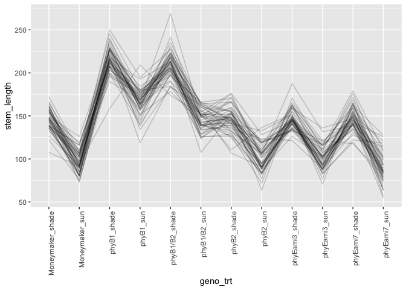

```r
library(tidyverse)
```

```
## ── Attaching packages ───────────────────────────────────── tidyverse 1.3.0 ──
```

```
## ✓ ggplot2 3.2.1     ✓ purrr   0.3.3
## ✓ tibble  2.1.3     ✓ dplyr   0.8.3
## ✓ tidyr   1.0.0     ✓ stringr 1.4.0
## ✓ readr   1.3.1     ✓ forcats 0.4.0
```

```
## ── Conflicts ──────────────────────────────────────── tidyverse_conflicts() ──
## x dplyr::filter() masks stats::filter()
## x dplyr::lag()    masks stats::lag()
```

```r
library(rethinking)
```

```
## Loading required package: rstan
```

```
## Loading required package: StanHeaders
```

```
## rstan (Version 2.19.2, GitRev: 2e1f913d3ca3)
```

```
## For execution on a local, multicore CPU with excess RAM we recommend calling
## options(mc.cores = parallel::detectCores()).
## To avoid recompilation of unchanged Stan programs, we recommend calling
## rstan_options(auto_write = TRUE)
```

```
## 
## Attaching package: 'rstan'
```

```
## The following object is masked from 'package:tidyr':
## 
##     extract
```

```
## Loading required package: parallel
```

```
## Loading required package: dagitty
```

```
## rethinking (Version 1.93)
```

```
## 
## Attaching package: 'rethinking'
```

```
## The following object is masked from 'package:purrr':
## 
##     map
```

```
## The following object is masked from 'package:stats':
## 
##     rstudent
```

## Q1)
a) subset the data for day 35
b) create a new column "stem_length" that is the sum of epi, int1, int2, and int3
c) although flats are listed as 1-6, flats in sun and shade are separate. Create a new column "flat2" that corrects for this.


```r
data <- read_csv("figure4phyE.csv")
```

```
## Parsed with column specification:
## cols(
##   genotype = col_character(),
##   treatment = col_character(),
##   flat = col_double(),
##   day = col_double(),
##   epi = col_double(),
##   int1 = col_double(),
##   int2 = col_double(),
##   int3 = col_double(),
##   pet1 = col_double(),
##   pet2 = col_double(),
##   pet3 = col_double(),
##   pet4 = col_double()
## )
```

```r
head(data)
```

```
## # A tibble: 6 x 12
##   genotype treatment  flat   day   epi  int1  int2  int3  pet1  pet2  pet3  pet4
##   <chr>    <chr>     <dbl> <dbl> <dbl> <dbl> <dbl> <dbl> <dbl> <dbl> <dbl> <dbl>
## 1 phyB1/B2 shade         1    21  24.0  3.18  0     0     14.1  4.88   0    0   
## 2 phyB1/B2 shade         1    28  47.4 21.7  11.3   3.13  31.0 26.8   11.1  2.61
## 3 phyB1/B2 shade         1    35  58.8 40.6  72.3  52.7   42.2 49.6   49.6 30.5 
## 4 phyB1/B2 shade         1    21  29.8  2.39  2.41  0     14.4 11.6    0    0   
## 5 phyB1/B2 shade         1    28  59.7  3.36 25.5   6.62  35.1 29.2   20.0  9.39
## 6 phyB1/B2 shade         1    35  69.6  4.91 56.6  35.5   49.8 34.6   47.6 40.5
```


```r
data35 <- data %>%
  filter(day==35) %>%
  mutate(stem_length=epi + int1 + int2 + int3,
         flat2=as.integer(as.factor(str_c(treatment, flat))),
         shade_i=ifelse(treatment=="sun", 0L, 1L),
         g_i= as.integer(factor(genotype,
                                   levels=c("Moneymaker", 
                                            "phyB1", 
                                            "phyB2", 
                                            "phyB1/B2", 
                                            "phyEami3", 
                                            "phyEami7")))) %>%
  select(genotype, treatment, g_i, shade_i, flat2, stem_length)
data35
```

```
## # A tibble: 88 x 6
##    genotype treatment   g_i shade_i flat2 stem_length
##    <chr>    <chr>     <int>   <int> <int>       <dbl>
##  1 phyB1/B2 shade         4       1     1       224. 
##  2 phyB1/B2 shade         4       1     1       167. 
##  3 phyB1/B2 shade         4       1     2       224. 
##  4 phyB1/B2 shade         4       1     3       196. 
##  5 phyB1/B2 shade         4       1     3       258. 
##  6 phyB1/B2 shade         4       1     5       227. 
##  7 phyB1/B2 sun           4       0     7       113. 
##  8 phyB1/B2 sun           4       0     7       148. 
##  9 phyB1/B2 sun           4       0     8        96.2
## 10 phyB1/B2 sun           4       0     9       160. 
## # … with 78 more rows
```

note that this is not a balanced design:


```r
with(data35, table(genotype, flat2))
```

```
##             flat2
## genotype     1 2 3 4 5 6 7 8 9 10 11 12
##   Moneymaker 1 2 2 1 0 0 1 2 2  1  0  0
##   phyB1      0 1 0 3 1 1 0 1 0  3  1  1
##   phyB1/B2   2 1 2 0 1 0 2 1 2  0  1  0
##   phyB2      1 0 1 1 1 2 1 0 1  1  1  2
##   phyEami3   3 1 0 1 4 3 3 1 0  0  2  3
##   phyEami7   1 3 3 2 1 2 1 1 2  2  0  1
```


Ultimately you want to know if any of the mutants have a different length from Moneymaker, in sun or in shade, or if the response to shade differs.

## Q2) Fit some models to explore treatment, genotype, and flat.

### a) don't include flat.  Determine whether genotype, treatment, and their interaction are important predictors of stem_length


```r
mean(data35$stem_length)
```

```
## [1] 141.2442
```

```r
sd(data35$stem_length)
```

```
## [1] 48.50967
```


```r
datsmall <- data35 %>% select(stem_length, g_i, shade_i)
mq2a1 <- ulam(alist(stem_length ~ dnorm(mu,sigma),
                  mu <- alpha[g_i] + b_shade*shade_i + b_i[g_i]*shade_i,
                  alpha[g_i] ~ dnorm(125,50),
                  b_shade ~ dnorm(0, 50),
                  b_i[g_i] ~  dnorm(0, 50),
                  sigma ~ dexp(1)),
            data=datsmall,
            chains=4,
            cores=4,
            log_lik = TRUE)
```


```r
precis(mq2a1, depth=2)
```

```
##                mean        sd      5.5%     94.5%     n_eff      Rhat
## alpha[1]  94.066584  8.415193  80.88481 107.71699 1771.8189 1.0026243
## alpha[2] 166.260330  8.249474 153.26199 179.70113 2354.2514 1.0008282
## alpha[3]  94.237352  8.414410  81.12079 108.18312 2546.7337 0.9987549
## alpha[4] 142.988345  8.592735 129.38673 156.57394 1955.1089 0.9994093
## alpha[5]  91.172462  7.461330  79.44534 102.79254 2039.1988 0.9986303
## alpha[6]  83.770414  7.857382  71.57971  96.49051 1983.6425 0.9985684
## b_shade   52.409104 19.151177  21.83426  83.84441  525.5293 1.0029062
## b_i[1]     6.056723 22.072214 -28.56506  41.69669  628.3285 1.0014970
## b_i[2]    10.181142 21.515371 -23.98310  44.88482  618.8948 1.0024684
## b_i[3]     7.164735 20.868889 -26.40429  39.76549  632.7844 1.0013023
## b_i[4]    20.090053 20.874398 -13.15738  53.38731  669.5842 1.0012070
## b_i[5]     2.500963 20.653090 -30.76956  35.49025  584.0820 1.0036630
## b_i[6]    13.205539 21.075952 -21.11450  45.17554  629.0802 1.0027621
## sigma     21.256925  1.486741  19.05447  23.75065 1978.9131 0.9992634
```

```r
traceplot(mq2a1)
pairs(mq2a1)
```

<!-- --><!-- -->

```r
extract.samples(mq2a1) %>%
  as.data.frame() %>%
  cor() %>%
  round(2)
```

```
##         alpha.1 alpha.2 alpha.3 alpha.4 alpha.5 alpha.6 b_shade b_i.1 b_i.2
## alpha.1    1.00    0.01    0.01    0.01   -0.03    0.02   -0.04 -0.34  0.02
## alpha.2    0.01    1.00    0.02    0.00    0.01   -0.05   -0.08  0.07 -0.29
## alpha.3    0.01    0.02    1.00    0.05   -0.04    0.01   -0.12  0.10  0.09
## alpha.4    0.01    0.00    0.05    1.00   -0.05    0.00   -0.12  0.09  0.11
## alpha.5   -0.03    0.01   -0.04   -0.05    1.00   -0.02   -0.06  0.06  0.04
## alpha.6    0.02   -0.05    0.01    0.00   -0.02    1.00   -0.03  0.00  0.05
## b_shade   -0.04   -0.08   -0.12   -0.12   -0.06   -0.03    1.00 -0.85 -0.84
## b_i.1     -0.34    0.07    0.10    0.09    0.06    0.00   -0.85  1.00  0.71
## b_i.2      0.02   -0.29    0.09    0.11    0.04    0.05   -0.84  0.71  1.00
## b_i.3      0.03    0.07   -0.28    0.08    0.07    0.03   -0.84  0.71  0.70
## b_i.4      0.01    0.08    0.09   -0.28    0.09    0.02   -0.83  0.72  0.68
## b_i.5      0.05    0.07    0.12    0.12   -0.30    0.05   -0.89  0.74  0.75
## b_i.6      0.04    0.09    0.09    0.11    0.05   -0.34   -0.88  0.76  0.73
## sigma      0.09   -0.02    0.03   -0.02   -0.02    0.01    0.00 -0.04  0.01
##         b_i.3 b_i.4 b_i.5 b_i.6 sigma
## alpha.1  0.03  0.01  0.05  0.04  0.09
## alpha.2  0.07  0.08  0.07  0.09 -0.02
## alpha.3 -0.28  0.09  0.12  0.09  0.03
## alpha.4  0.08 -0.28  0.12  0.11 -0.02
## alpha.5  0.07  0.09 -0.30  0.05 -0.02
## alpha.6  0.03  0.02  0.05 -0.34  0.01
## b_shade -0.84 -0.83 -0.89 -0.88  0.00
## b_i.1    0.71  0.72  0.74  0.76 -0.04
## b_i.2    0.70  0.68  0.75  0.73  0.01
## b_i.3    1.00  0.71  0.73  0.74 -0.02
## b_i.4    0.71  1.00  0.73  0.73  0.00
## b_i.5    0.73  0.73  1.00  0.78  0.01
## b_i.6    0.74  0.73  0.78  1.00 -0.01
## sigma   -0.02  0.00  0.01 -0.01  1.00
```

Right, to have beta_shade and separate betas for each shade for each species is redundant


```r
datsmall <- data35 %>% select(stem_length, g_i, shade_i)
mq2a2 <- ulam(alist(stem_length ~ dnorm(mu,sigma),
                  mu <- alpha[g_i] + b_shade[g_i]*shade_i,
                  alpha[g_i] ~ dnorm(125,50),
                  b_shade[g_i] ~  dnorm(0, 50),
                  sigma ~ dexp(1)),
            data=datsmall,
            chains=4,
            cores=4,
            log_lik = TRUE)
```


```r
precis(mq2a2, depth = 2)
```

```
##                 mean        sd      5.5%     94.5%    n_eff      Rhat
## alpha[1]    95.67258  8.633241  81.78694 109.55291 1771.727 1.0008486
## alpha[2]   167.60561  8.518496 154.00381 181.33443 1742.773 1.0006170
## alpha[3]    96.10441  8.295770  82.71760 109.05703 1836.550 1.0019901
## alpha[4]   144.46350  8.290473 131.17130 157.51975 2070.570 1.0006093
## alpha[5]    92.53620  6.943582  81.25586 103.48194 1899.789 1.0022644
## alpha[6]    85.04310  7.788836  72.46881  97.28469 1756.974 1.0002363
## b_shade[1]  54.90216 12.016214  36.27904  73.87369 1818.243 1.0003210
## b_shade[2]  59.79284 11.947532  40.61161  79.35551 1786.432 0.9992940
## b_shade[3]  56.03829 11.711397  36.79257  74.44336 1967.775 1.0029041
## b_shade[4]  69.07972 11.604510  50.77922  87.82614 1926.998 1.0012904
## b_shade[5]  52.76716  9.151526  38.23423  67.54851 1956.691 1.0008495
## b_shade[6]  63.77220  9.602661  48.40417  79.48668 1823.639 1.0013206
## sigma       21.27394  1.545925  19.04233  23.92472 1862.090 0.9994048
```

```r
traceplot(mq2a2)
pairs(mq2a2)
```

<!-- --><!-- -->

```r
extract.samples(mq2a2) %>%
  as.data.frame() %>%
  cor() %>%
  round(2)
```

```
##           alpha.1 alpha.2 alpha.3 alpha.4 alpha.5 alpha.6 b_shade.1 b_shade.2
## alpha.1      1.00    0.00    0.01    0.03   -0.01   -0.01     -0.71      0.01
## alpha.2      0.00    1.00    0.01   -0.08    0.05    0.01      0.00     -0.71
## alpha.3      0.01    0.01    1.00   -0.04   -0.06   -0.04     -0.02     -0.01
## alpha.4      0.03   -0.08   -0.04    1.00    0.01    0.03     -0.02      0.07
## alpha.5     -0.01    0.05   -0.06    0.01    1.00    0.02      0.00     -0.08
## alpha.6     -0.01    0.01   -0.04    0.03    0.02    1.00      0.00     -0.02
## b_shade.1   -0.71    0.00   -0.02   -0.02    0.00    0.00      1.00     -0.02
## b_shade.2    0.01   -0.71   -0.01    0.07   -0.08   -0.02     -0.02      1.00
## b_shade.3   -0.03   -0.01   -0.68    0.03    0.04    0.02      0.01      0.02
## b_shade.4   -0.03    0.04    0.00   -0.67   -0.04   -0.05      0.05     -0.07
## b_shade.5    0.01   -0.04    0.04   -0.01   -0.74   -0.03     -0.01      0.06
## b_shade.6    0.00   -0.02    0.04   -0.03   -0.01   -0.77     -0.01      0.03
## sigma        0.03   -0.03    0.10    0.04    0.04    0.00     -0.06      0.00
##           b_shade.3 b_shade.4 b_shade.5 b_shade.6 sigma
## alpha.1       -0.03     -0.03      0.01      0.00  0.03
## alpha.2       -0.01      0.04     -0.04     -0.02 -0.03
## alpha.3       -0.68      0.00      0.04      0.04  0.10
## alpha.4        0.03     -0.67     -0.01     -0.03  0.04
## alpha.5        0.04     -0.04     -0.74     -0.01  0.04
## alpha.6        0.02     -0.05     -0.03     -0.77  0.00
## b_shade.1      0.01      0.05     -0.01     -0.01 -0.06
## b_shade.2      0.02     -0.07      0.06      0.03  0.00
## b_shade.3      1.00     -0.07     -0.03     -0.02 -0.08
## b_shade.4     -0.07      1.00      0.03      0.05 -0.03
## b_shade.5     -0.03      0.03      1.00      0.00 -0.04
## b_shade.6     -0.02      0.05      0.00      1.00 -0.01
## sigma         -0.08     -0.03     -0.04     -0.01  1.00
```

This is sampled much better.

let's compare to some simpler models

Same shade response per genotype


```r
datsmall <- data35 %>% select(stem_length, shade_i, g_i)
mq2a3 <- ulam(alist(stem_length ~ dnorm(mu,sigma),
                  mu <- alpha[g_i] + b_shade*shade_i,
                  alpha[g_i] ~ dnorm(125,50),
                  b_shade ~ dnorm(0, 50),
                  sigma ~ dexp(1)),
            data=datsmall,
            chains=4,
            cores=4,
            log_lik = TRUE)
```


```r
precis(mq2a3)
```

```
## 6 vector or matrix parameters hidden. Use depth=2 to show them.
```

```
##             mean       sd     5.5%    94.5%    n_eff      Rhat
## b_shade 61.59714 4.304959 54.90093 68.44637 1199.168 1.0019049
## sigma   20.94462 1.434794 18.82225 23.40728 1772.329 0.9997481
```

```r
traceplot(mq2a3)
pairs(mq2a3)
```

<!-- --><!-- -->

```r
extract.samples(mq2a3) %>%
  as.data.frame() %>%
  cor() %>%
  round(2)
```

```
##         alpha.1 alpha.2 alpha.3 alpha.4 alpha.5 alpha.6 b_shade sigma
## alpha.1    1.00    0.13    0.11    0.08    0.15    0.16   -0.32  0.04
## alpha.2    0.13    1.00    0.08    0.08    0.14    0.15   -0.30 -0.05
## alpha.3    0.11    0.08    1.00    0.09    0.14    0.17   -0.33  0.02
## alpha.4    0.08    0.08    0.09    1.00    0.13    0.14   -0.33  0.00
## alpha.5    0.15    0.14    0.14    0.13    1.00    0.19   -0.48  0.01
## alpha.6    0.16    0.15    0.17    0.14    0.19    1.00   -0.48  0.05
## b_shade   -0.32   -0.30   -0.33   -0.33   -0.48   -0.48    1.00 -0.03
## sigma      0.04   -0.05    0.02    0.00    0.01    0.05   -0.03  1.00
```


```r
compare(mq2a2, mq2a3)
```

```
##           WAIC       SE    dWAIC      dSE     pWAIC      weight
## mq2a3 814.9346 17.74958 0.000000       NA  9.503643 0.991265502
## mq2a2 824.3980 17.27912 9.463404 3.264685 14.588125 0.008734498
```

Interesting...that would argue for the simple model (no difference in shade response between genotypes).

Any difference in genotypes at all?


```r
datsmall <- data35 %>% select(stem_length, shade_i)
mq2a4 <- ulam(alist(stem_length ~ dnorm(mu,sigma),
                  mu <- alpha + b_shade*shade_i,
                  alpha ~ dnorm(125,50),
                  b_shade ~ dnorm(0, 50),
                  sigma ~ dexp(1)),
            data=datsmall,
            chains=4,
            cores=4,
            log_lik = TRUE)
```


```r
precis(mq2a4)
```

```
##              mean       sd      5.5%     94.5%    n_eff      Rhat
## alpha   109.71133 5.142379 101.63741 118.07995 1045.695 1.0000261
## b_shade  57.82505 6.824160  47.12175  68.67071 1033.233 0.9988555
## sigma    33.36385 2.072166  30.24151  36.80737 1223.681 1.0018717
```

```r
traceplot(mq2a4)
```

<!-- -->

```r
pairs(mq2a4)
```

<!-- -->

```r
extract.samples(mq2a4) %>%
  as.data.frame() %>%
  cor() %>%
  round(2)
```

```
##         alpha b_shade sigma
## alpha    1.00   -0.73  0.03
## b_shade -0.73    1.00 -0.02
## sigma    0.03   -0.02  1.00
```


```r
compare(mq2a2, mq2a3, mq2a4)
```

```
##           WAIC       SE     dWAIC       dSE     pWAIC       weight
## mq2a3 814.9346 17.74958  0.000000        NA  9.503643 9.912655e-01
## mq2a2 824.3980 17.27912  9.463404  3.264685 14.588125 8.734498e-03
## mq2a4 902.3481 18.35826 87.413531 18.999178  3.779848 1.034149e-19
```

OK genotype impt

b) starting with your best model from a), include flat without pooling


```r
datsmall <- data35 %>% select(stem_length, shade_i, g_i, flat2)
mq2b1 <- ulam(alist(stem_length ~ dnorm(mu,sigma),
                  mu <- alpha[g_i] + b_shade*shade_i + b_fl[flat2],
                  alpha[g_i] ~ dnorm(125,50),
                  b_shade ~ dnorm(0, 50),
                  b_fl[flat2] ~ dnorm(0,10),
                  sigma ~ dexp(1)),
            data=datsmall,
            chains=4,
            cores=4,
            log_lik = TRUE)
```


```r
precis(mq2b1, depth=2)
```

```
##                mean       sd        5.5%      94.5%     n_eff      Rhat
## alpha[1]  92.308395 7.304765  80.7907339 104.266396  902.0325 1.0009239
## alpha[2] 164.650497 7.130302 153.2734955 175.579628  919.9686 1.0028048
## alpha[3]  95.306587 7.090185  84.3185409 106.319950  886.2890 1.0017037
## alpha[4] 148.923500 7.297195 137.3042090 160.566751  913.2374 1.0011225
## alpha[5]  91.178438 6.318912  81.2515091 101.360846  785.2805 1.0010010
## alpha[6]  86.534442 6.389502  76.0293777  96.436487  737.7469 1.0026237
## b_shade   60.377584 7.099595  48.9890263  71.773167  524.1489 1.0035656
## b_fl[1]  -12.681123 6.482534 -23.4514816  -2.643422 1649.8520 0.9995139
## b_fl[2]   -4.086618 6.608630 -14.4570907   6.749815 1488.7360 0.9994233
## b_fl[3]    8.560701 6.530887  -2.1439658  18.923507 1607.7937 1.0010237
## b_fl[4]   10.879183 6.570205   0.4947236  21.419654 1424.8646 1.0011631
## b_fl[5]    6.971708 6.700089  -3.7296858  17.461551 1665.7991 1.0017386
## b_fl[6]   -7.323726 6.514008 -17.5125178   3.130171 1676.6436 1.0001782
## b_fl[7]   -1.366679 6.907874 -12.5318332   9.538076 1207.6973 1.0002615
## b_fl[8]   -3.069754 7.187105 -14.4349243   8.126412 1253.9230 1.0004118
## b_fl[9]    2.188515 6.617982  -8.2995895  12.944910 1120.2004 1.0004813
## b_fl[10]   5.244643 6.567179  -4.9886594  15.550796 1272.0468 1.0013084
## b_fl[11]   5.741460 7.059038  -5.0380049  17.073778 1326.7051 0.9995435
## b_fl[12] -13.961681 6.873965 -24.9367836  -2.632316 1398.5047 1.0005533
## sigma     19.058822 1.396316  16.9966476  21.396342 2275.6464 1.0009907
```

```r
traceplot(mq2b1, ask=FALSE)
```

```
## Waiting to draw page 2 of 2
```

<!-- -->

```r
pairs(mq2b1)
```

<!-- --><!-- -->

```r
extract.samples(mq2b1) %>%
  as.data.frame() %>%
  cor() %>%
  round(2)
```

```
##         alpha.1 alpha.2 alpha.3 alpha.4 alpha.5 alpha.6 b_shade b_fl.1 b_fl.2
## alpha.1    1.00    0.35    0.36    0.39    0.42    0.47   -0.48   0.02  -0.04
## alpha.2    0.35    1.00    0.40    0.33    0.43    0.45   -0.50   0.10   0.01
## alpha.3    0.36    0.40    1.00    0.43    0.46    0.47   -0.52   0.06   0.07
## alpha.4    0.39    0.33    0.43    1.00    0.48    0.44   -0.48   0.01  -0.03
## alpha.5    0.42    0.43    0.46    0.48    1.00    0.49   -0.56  -0.06   0.01
## alpha.6    0.47    0.45    0.47    0.44    0.49    1.00   -0.60   0.11   0.01
## b_shade   -0.48   -0.50   -0.52   -0.48   -0.56   -0.60    1.00  -0.37  -0.38
## b_fl.1     0.02    0.10    0.06    0.01   -0.06    0.11   -0.37   1.00   0.24
## b_fl.2    -0.04    0.01    0.07   -0.03    0.01    0.01   -0.38   0.24   1.00
## b_fl.3    -0.08    0.10    0.04   -0.04    0.08   -0.05   -0.34   0.27   0.27
## b_fl.4     0.03   -0.10    0.04    0.06    0.05    0.05   -0.37   0.22   0.30
## b_fl.5     0.09    0.06   -0.01   -0.05   -0.06    0.09   -0.38   0.29   0.29
## b_fl.6     0.06    0.05   -0.04    0.07   -0.03    0.02   -0.38   0.25   0.29
## b_fl.7    -0.29   -0.31   -0.33   -0.41   -0.47   -0.40    0.37   0.01   0.01
## b_fl.8    -0.39   -0.31   -0.26   -0.32   -0.35   -0.35    0.35  -0.08  -0.05
## b_fl.9    -0.40   -0.26   -0.34   -0.39   -0.31   -0.42    0.34  -0.03   0.00
## b_fl.10   -0.34   -0.41   -0.35   -0.27   -0.32   -0.41    0.36  -0.10  -0.03
## b_fl.11   -0.22   -0.33   -0.29   -0.26   -0.38   -0.26    0.30  -0.02  -0.02
## b_fl.12   -0.25   -0.35   -0.40   -0.26   -0.42   -0.38    0.36   0.01  -0.03
## sigma     -0.02    0.06    0.02    0.02   -0.02    0.01    0.00   0.09   0.02
##         b_fl.3 b_fl.4 b_fl.5 b_fl.6 b_fl.7 b_fl.8 b_fl.9 b_fl.10 b_fl.11
## alpha.1  -0.08   0.03   0.09   0.06  -0.29  -0.39  -0.40   -0.34   -0.22
## alpha.2   0.10  -0.10   0.06   0.05  -0.31  -0.31  -0.26   -0.41   -0.33
## alpha.3   0.04   0.04  -0.01  -0.04  -0.33  -0.26  -0.34   -0.35   -0.29
## alpha.4  -0.04   0.06  -0.05   0.07  -0.41  -0.32  -0.39   -0.27   -0.26
## alpha.5   0.08   0.05  -0.06  -0.03  -0.47  -0.35  -0.31   -0.32   -0.38
## alpha.6  -0.05   0.05   0.09   0.02  -0.40  -0.35  -0.42   -0.41   -0.26
## b_shade  -0.34  -0.37  -0.38  -0.38   0.37   0.35   0.34    0.36    0.30
## b_fl.1    0.27   0.22   0.29   0.25   0.01  -0.08  -0.03   -0.10   -0.02
## b_fl.2    0.27   0.30   0.29   0.29   0.01  -0.05   0.00   -0.03   -0.02
## b_fl.3    1.00   0.23   0.24   0.27  -0.02  -0.01   0.04    0.07   -0.05
## b_fl.4    0.23   1.00   0.27   0.23   0.03  -0.08   0.02   -0.01    0.03
## b_fl.5    0.24   0.27   1.00   0.29   0.02  -0.02   0.01   -0.02    0.00
## b_fl.6    0.27   0.23   0.29   1.00  -0.02  -0.02   0.00    0.01    0.00
## b_fl.7   -0.02   0.03   0.02  -0.02   1.00   0.26   0.27    0.20    0.21
## b_fl.8   -0.01  -0.08  -0.02  -0.02   0.26   1.00   0.25    0.22    0.17
## b_fl.9    0.04   0.02   0.01   0.00   0.27   0.25   1.00    0.27    0.19
## b_fl.10   0.07  -0.01  -0.02   0.01   0.20   0.22   0.27    1.00    0.19
## b_fl.11  -0.05   0.03   0.00   0.00   0.21   0.17   0.19    0.19    1.00
## b_fl.12  -0.03  -0.05  -0.01   0.03   0.23   0.19   0.25    0.24    0.22
## sigma    -0.07  -0.05  -0.04   0.04  -0.03   0.05   0.03   -0.07   -0.05
##         b_fl.12 sigma
## alpha.1   -0.25 -0.02
## alpha.2   -0.35  0.06
## alpha.3   -0.40  0.02
## alpha.4   -0.26  0.02
## alpha.5   -0.42 -0.02
## alpha.6   -0.38  0.01
## b_shade    0.36  0.00
## b_fl.1     0.01  0.09
## b_fl.2    -0.03  0.02
## b_fl.3    -0.03 -0.07
## b_fl.4    -0.05 -0.05
## b_fl.5    -0.01 -0.04
## b_fl.6     0.03  0.04
## b_fl.7     0.23 -0.03
## b_fl.8     0.19  0.05
## b_fl.9     0.25  0.03
## b_fl.10    0.24 -0.07
## b_fl.11    0.22 -0.05
## b_fl.12    1.00  0.07
## sigma      0.07  1.00
```

c) starting with your best model from a), use a hierarchical model that allows partial pooling across flats


```r
datsmall <- data35 %>% select(stem_length, shade_i, g_i, flat2)
mq2c1 <- ulam(alist(stem_length ~ dnorm(mu,sigma),
                  mu <- alpha[g_i] + b_shade*shade_i + b_fl[flat2],
                  alpha[g_i] ~ dnorm(125,50),
                  b_shade ~ dnorm(0, 50),
                  b_fl[flat2] ~ dnorm(0,sigma_fl),
                  sigma ~ dexp(1),
                  sigma_fl ~ dcauchy(0,3)),
            data=datsmall,
            chains=4,
            cores=4,
            iter=4000,
            log_lik = TRUE)
```


```r
precis(mq2c1, depth=2)
```

```
##                mean       sd        5.5%       94.5%    n_eff      Rhat
## alpha[1]  92.484281 7.255863  81.1250217 103.9095244 2858.853 1.0017707
## alpha[2] 165.283775 7.346099 153.4594242 177.3336145 2910.655 1.0009087
## alpha[3]  95.457548 7.302103  83.8819652 107.4687058 2615.716 1.0016166
## alpha[4] 149.249246 7.313914 137.7064933 161.0085498 2791.959 1.0014647
## alpha[5]  91.055002 6.559864  80.8892731 101.6137693 2167.884 1.0021911
## alpha[6]  86.788258 6.696724  76.2419063  97.7515217 2459.058 1.0021087
## b_shade   59.889814 7.148348  48.5807870  70.8847407 1778.541 1.0022548
## b_fl[1]  -11.074725 7.335145 -23.2938061  -0.0546655 2383.229 1.0011472
## b_fl[2]   -3.558674 6.643494 -14.5565107   6.5466424 4073.619 0.9998739
## b_fl[3]    7.907874 7.070012  -2.2877906  19.8710172 2119.811 1.0012911
## b_fl[4]    9.892464 7.335303  -0.7127114  22.2879310 2109.140 1.0008902
## b_fl[5]    6.553065 6.889362  -3.5362942  18.0675847 2597.166 1.0003270
## b_fl[6]   -6.308330 6.745414 -17.5524797   3.5377625 3290.690 1.0001791
## b_fl[7]   -1.453261 6.496723 -12.2218559   8.4057292 2915.570 1.0006037
## b_fl[8]   -2.903988 6.827699 -14.2751716   7.5044252 3331.229 1.0011184
## b_fl[9]    1.684000 6.688436  -8.7621952  12.4067910 3115.299 1.0005096
## b_fl[10]   4.559650 6.896267  -5.7024077  15.9397679 3451.404 1.0010270
## b_fl[11]   5.003323 7.104471  -5.5729379  16.6533887 3558.607 1.0002924
## b_fl[12] -12.718161 8.068032 -26.0688897  -0.5379296 1808.862 1.0036441
## sigma     19.266641 1.425956  17.0799289  21.6567620 3982.832 0.9998721
## sigma_fl   9.755348 4.014662   3.7970854  16.4947094 1257.928 1.0033562
```

```r
traceplot(mq2c1, ask=FALSE)
```

```
## Waiting to draw page 2 of 2
```

<!-- -->

```r
pairs(mq2c1)
```

<!-- --><!-- -->

```r
extract.samples(mq2c1) %>%
  as.data.frame() %>%
  cor() %>%
  round(2)
```

```
##          alpha.1 alpha.2 alpha.3 alpha.4 alpha.5 alpha.6 b_shade b_fl.1 b_fl.2
## alpha.1     1.00    0.37    0.38    0.41    0.44    0.48   -0.49  -0.03  -0.06
## alpha.2     0.37    1.00    0.40    0.34    0.41    0.44   -0.45   0.06   0.00
## alpha.3     0.38    0.40    1.00    0.41    0.50    0.46   -0.50  -0.09   0.02
## alpha.4     0.41    0.34    0.41    1.00    0.46    0.45   -0.49  -0.09  -0.03
## alpha.5     0.44    0.41    0.50    0.46    1.00    0.51   -0.58  -0.13   0.00
## alpha.6     0.48    0.44    0.46    0.45    0.51    1.00   -0.58   0.02  -0.05
## b_shade    -0.49   -0.45   -0.50   -0.49   -0.58   -0.58    1.00  -0.26  -0.34
## b_fl.1     -0.03    0.06   -0.09   -0.09   -0.13    0.02   -0.26   1.00   0.33
## b_fl.2     -0.06    0.00    0.02   -0.03    0.00   -0.05   -0.34   0.33   1.00
## b_fl.3     -0.05    0.00    0.04   -0.03    0.13   -0.04   -0.37   0.05   0.22
## b_fl.4      0.03   -0.14    0.06    0.09    0.13    0.03   -0.38   0.00   0.20
## b_fl.5      0.08   -0.02    0.03    0.05    0.00    0.05   -0.40   0.10   0.22
## b_fl.6      0.04    0.01   -0.09    0.05   -0.11   -0.02   -0.33   0.39   0.33
## b_fl.7     -0.37   -0.29   -0.40   -0.44   -0.49   -0.38    0.40   0.07   0.00
## b_fl.8     -0.41   -0.32   -0.30   -0.35   -0.40   -0.38    0.37   0.07   0.02
## b_fl.9     -0.41   -0.29   -0.37   -0.40   -0.34   -0.44    0.37  -0.03  -0.01
## b_fl.10    -0.33   -0.48   -0.33   -0.26   -0.28   -0.41    0.32  -0.11   0.00
## b_fl.11    -0.22   -0.31   -0.28   -0.30   -0.30   -0.24    0.25  -0.09  -0.05
## b_fl.12    -0.27   -0.25   -0.43   -0.28   -0.49   -0.32    0.36   0.29   0.08
## sigma       0.00    0.03   -0.02   -0.02   -0.06    0.01    0.02   0.19   0.07
## sigma_fl    0.08   -0.03    0.16    0.11    0.24    0.08   -0.15  -0.43  -0.12
##          b_fl.3 b_fl.4 b_fl.5 b_fl.6 b_fl.7 b_fl.8 b_fl.9 b_fl.10 b_fl.11
## alpha.1   -0.05   0.03   0.08   0.04  -0.37  -0.41  -0.41   -0.33   -0.22
## alpha.2    0.00  -0.14  -0.02   0.01  -0.29  -0.32  -0.29   -0.48   -0.31
## alpha.3    0.04   0.06   0.03  -0.09  -0.40  -0.30  -0.37   -0.33   -0.28
## alpha.4   -0.03   0.09   0.05   0.05  -0.44  -0.35  -0.40   -0.26   -0.30
## alpha.5    0.13   0.13   0.00  -0.11  -0.49  -0.40  -0.34   -0.28   -0.30
## alpha.6   -0.04   0.03   0.05  -0.02  -0.38  -0.38  -0.44   -0.41   -0.24
## b_shade   -0.37  -0.38  -0.40  -0.33   0.40   0.37   0.37    0.32    0.25
## b_fl.1     0.05   0.00   0.10   0.39   0.07   0.07  -0.03   -0.11   -0.09
## b_fl.2     0.22   0.20   0.22   0.33   0.00   0.02  -0.01    0.00   -0.05
## b_fl.3     1.00   0.40   0.36   0.14  -0.03  -0.06   0.06    0.10    0.09
## b_fl.4     0.40   1.00   0.40   0.13  -0.07  -0.09   0.00    0.13    0.11
## b_fl.5     0.36   0.40   1.00   0.19  -0.03  -0.06   0.00    0.06    0.08
## b_fl.6     0.14   0.13   0.19   1.00   0.06   0.04  -0.03   -0.04   -0.07
## b_fl.7    -0.03  -0.07  -0.03   0.06   1.00   0.30   0.29    0.23    0.21
## b_fl.8    -0.06  -0.09  -0.06   0.04   0.30   1.00   0.27    0.22    0.17
## b_fl.9     0.06   0.00   0.00  -0.03   0.29   0.27   1.00    0.28    0.24
## b_fl.10    0.10   0.13   0.06  -0.04   0.23   0.22   0.28    1.00    0.27
## b_fl.11    0.09   0.11   0.08  -0.07   0.21   0.17   0.24    0.27    1.00
## b_fl.12   -0.22  -0.26  -0.17   0.18   0.32   0.28   0.19    0.09    0.06
## sigma     -0.14  -0.17  -0.12   0.12   0.02   0.06  -0.04   -0.10   -0.11
## sigma_fl   0.36   0.43   0.30  -0.25  -0.14  -0.19   0.02    0.16    0.19
##          b_fl.12 sigma sigma_fl
## alpha.1    -0.27  0.00     0.08
## alpha.2    -0.25  0.03    -0.03
## alpha.3    -0.43 -0.02     0.16
## alpha.4    -0.28 -0.02     0.11
## alpha.5    -0.49 -0.06     0.24
## alpha.6    -0.32  0.01     0.08
## b_shade     0.36  0.02    -0.15
## b_fl.1      0.29  0.19    -0.43
## b_fl.2      0.08  0.07    -0.12
## b_fl.3     -0.22 -0.14     0.36
## b_fl.4     -0.26 -0.17     0.43
## b_fl.5     -0.17 -0.12     0.30
## b_fl.6      0.18  0.12    -0.25
## b_fl.7      0.32  0.02    -0.14
## b_fl.8      0.28  0.06    -0.19
## b_fl.9      0.19 -0.04     0.02
## b_fl.10     0.09 -0.10     0.16
## b_fl.11     0.06 -0.11     0.19
## b_fl.12     1.00  0.22    -0.54
## sigma       0.22  1.00    -0.22
## sigma_fl   -0.54 -0.22     1.00
```

what is happening with flat in these models?  Are shade flats estimated to have a positive effect and sun flats negative?

First which flats are which?

```r
data35 %>%
  select(treatment, flat2) %>%
  unique() %>%
  arrange(flat2)
```

```
## # A tibble: 12 x 2
##    treatment flat2
##    <chr>     <int>
##  1 shade         1
##  2 shade         2
##  3 shade         3
##  4 shade         4
##  5 shade         5
##  6 shade         6
##  7 sun           7
##  8 sun           8
##  9 sun           9
## 10 sun          10
## 11 sun          11
## 12 sun          12
```


```r
flat.effs.b1 <- tibble(estimate=coef(mq2b1),
                       coef=names(coef(mq2b1))) %>%
  filter(str_detect(coef,"b_fl")) %>%
  mutate(treatment=rep(c("shade","sun"), each=6))
flat.effs.b1
```

```
## # A tibble: 12 x 3
##    estimate coef     treatment
##       <dbl> <chr>    <chr>    
##  1   -12.7  b_fl[1]  shade    
##  2    -4.09 b_fl[2]  shade    
##  3     8.56 b_fl[3]  shade    
##  4    10.9  b_fl[4]  shade    
##  5     6.97 b_fl[5]  shade    
##  6    -7.32 b_fl[6]  shade    
##  7    -1.37 b_fl[7]  sun      
##  8    -3.07 b_fl[8]  sun      
##  9     2.19 b_fl[9]  sun      
## 10     5.24 b_fl[10] sun      
## 11     5.74 b_fl[11] sun      
## 12   -14.0  b_fl[12] sun
```

```r
flat.effs.b1 %>% group_by(treatment) %>%
  summarize(mean=mean(estimate), sem=sd(estimate)/sqrt(6))
```

```
## # A tibble: 2 x 3
##   treatment   mean   sem
##   <chr>      <dbl> <dbl>
## 1 shade      0.387  3.96
## 2 sun       -0.871  2.98
```


```r
flat.effs.c1 <- tibble(estimate=coef(mq2c1),
                       coef=names(coef(mq2c1))) %>%
  filter(str_detect(coef,"b_fl")) %>%
  mutate(treatment=rep(c("shade","sun"), each=6))
flat.effs.c1
```

```
## # A tibble: 12 x 3
##    estimate coef     treatment
##       <dbl> <chr>    <chr>    
##  1   -11.1  b_fl[1]  shade    
##  2    -3.56 b_fl[2]  shade    
##  3     7.91 b_fl[3]  shade    
##  4     9.89 b_fl[4]  shade    
##  5     6.55 b_fl[5]  shade    
##  6    -6.31 b_fl[6]  shade    
##  7    -1.45 b_fl[7]  sun      
##  8    -2.90 b_fl[8]  sun      
##  9     1.68 b_fl[9]  sun      
## 10     4.56 b_fl[10] sun      
## 11     5.00 b_fl[11] sun      
## 12   -12.7  b_fl[12] sun
```

```r
flat.effs.c1 %>% group_by(treatment) %>%
  summarize(mean=mean(estimate), sem=sd(estimate)/sqrt(6))
```

```
## # A tibble: 2 x 3
##   treatment   mean   sem
##   <chr>      <dbl> <dbl>
## 1 shade      0.569  3.54
## 2 sun       -0.971  2.68
```


Q3) Compare the models, which is preferred?


```r
compare(mq2a3, mq2b1, mq2c1)
```

```
##           WAIC       SE     dWAIC       dSE     pWAIC      weight
## mq2b1 804.4193 16.88087  0.000000        NA 15.954019 0.780447845
## mq2c1 806.9933 16.99178  2.573927 0.9968932 16.449504 0.215487854
## mq2a3 814.9346 17.74958 10.515252 7.2371534  9.503643 0.004064301
```

So we aren't really gaining anything by pooling (or even by adding flat) but not hurting much either.  keep it in.

how about model2 with genotype shade interaction?


```r
datsmall <- data35 %>% select(stem_length, shade_i, g_i, flat2)
mq2c2 <- ulam(alist(stem_length ~ dnorm(mu,sigma),
                  mu <- alpha[g_i] + b_shade[g_i]*shade_i + b_fl[flat2],
                  alpha[g_i] ~ dnorm(125,50),
                  b_shade[g_i] ~ dnorm(0, 50),
                  b_fl[flat2] ~ dnorm(0,sigma_fl),
                  sigma ~ dexp(1),
                  sigma_fl ~ dcauchy(0,3)),
            data=datsmall,
            chains=4,
            cores=4,
            iter=4000,
            log_lik = TRUE)
```


```r
precis(mq2c2, depth=2)
```

```
##                  mean        sd       5.5%      94.5%    n_eff      Rhat
## alpha[1]    96.315953  9.310846  81.690305 111.346206 3882.070 1.0000484
## alpha[2]   169.392910  9.399726 154.542743 184.478116 4405.016 1.0010148
## alpha[3]   100.917230  9.493855  86.077315 116.438603 3163.057 1.0005126
## alpha[4]   145.369233  9.332406 130.779425 160.719418 4280.849 1.0010958
## alpha[5]    99.240398  8.715502  85.770473 113.560350 3040.183 1.0011413
## alpha[6]    87.398254  8.875402  73.564357 101.652405 3835.942 1.0005119
## b_shade[1]  51.709699 13.369710  30.287043  72.554193 3164.196 0.9999445
## b_shade[2]  50.396289 13.521534  28.153908  71.107623 2718.641 1.0010635
## b_shade[3]  48.816438 13.493365  26.872011  70.031283 3054.660 1.0000967
## b_shade[4]  67.341250 13.254386  45.764228  87.721684 3830.521 1.0004855
## b_shade[5]  45.248060 11.843544  25.682980  63.475833 2864.027 1.0004657
## b_shade[6]  57.601800 11.901601  37.868101  75.809755 2793.496 1.0003932
## b_fl[1]    -10.149571  7.558566 -22.316892   1.223216 5460.307 1.0000540
## b_fl[2]     -1.981636  7.341973 -13.104470   9.982426 4643.316 0.9999064
## b_fl[3]     10.094819  8.184548  -1.773313  24.033283 3343.803 0.9997712
## b_fl[4]     14.463207  8.757411   1.575465  29.210288 2690.580 1.0005015
## b_fl[5]     10.631253  8.159540  -1.268705  24.307126 3355.719 1.0002244
## b_fl[6]     -3.469684  7.302188 -15.054985   8.263944 5044.111 1.0003008
## b_fl[7]     -4.169337  7.633160 -17.038437   7.265652 3538.278 1.0000756
## b_fl[8]     -5.339690  7.872957 -18.560353   6.213496 3570.048 1.0005156
## b_fl[9]      1.208776  7.634313 -11.127965  13.274688 4198.374 1.0001541
## b_fl[10]     2.694786  7.769298  -9.575083  14.890639 4820.327 1.0003148
## b_fl[11]     3.037718  7.832733  -9.451236  15.592009 4908.564 1.0005623
## b_fl[12]   -18.403066  9.579123 -34.353969  -3.834509 2162.721 1.0008732
## sigma       19.307246  1.458963  17.130433  21.750039 5892.243 1.0003984
## sigma_fl    11.616713  4.498348   5.458681  19.321272 1800.016 1.0001382
```

```r
traceplot(mq2c2, ask=FALSE)
```

```
## Waiting to draw page 2 of 2
```

<!-- -->

```r
pairs(mq2c2)
```

<!-- --><!-- -->

```r
extract.samples(mq2c2) %>%
  as.data.frame() %>%
  cor() %>%
  round(2)
```

```
##           alpha.1 alpha.2 alpha.3 alpha.4 alpha.5 alpha.6 b_shade.1 b_shade.2
## alpha.1      1.00    0.26    0.27    0.29    0.28    0.31     -0.69     -0.21
## alpha.2      0.26    1.00    0.28    0.22    0.28    0.31     -0.19     -0.69
## alpha.3      0.27    0.28    1.00    0.28    0.36    0.31     -0.22     -0.24
## alpha.4      0.29    0.22    0.28    1.00    0.31    0.30     -0.21     -0.19
## alpha.5      0.28    0.28    0.36    0.31    1.00    0.34     -0.24     -0.26
## alpha.6      0.31    0.31    0.31    0.30    0.34    1.00     -0.23     -0.24
## b_shade.1   -0.69   -0.19   -0.22   -0.21   -0.24   -0.23      1.00      0.30
## b_shade.2   -0.21   -0.69   -0.24   -0.19   -0.26   -0.24      0.30      1.00
## b_shade.3   -0.21   -0.20   -0.70   -0.21   -0.28   -0.23      0.30      0.33
## b_shade.4   -0.19   -0.13   -0.20   -0.69   -0.23   -0.21      0.30      0.24
## b_shade.5   -0.23   -0.22   -0.29   -0.24   -0.76   -0.26      0.34      0.37
## b_shade.6   -0.25   -0.24   -0.26   -0.24   -0.30   -0.76      0.37      0.37
## b_fl.1      -0.05   -0.03   -0.05   -0.04   -0.07   -0.03     -0.17     -0.11
## b_fl.2       0.02   -0.02    0.02   -0.01    0.03   -0.01     -0.34     -0.25
## b_fl.3       0.06    0.04    0.09    0.05    0.12    0.06     -0.39     -0.27
## b_fl.4       0.08    0.05    0.12    0.07    0.17    0.09     -0.33     -0.46
## b_fl.5       0.08    0.04    0.10    0.07    0.13    0.07     -0.27     -0.34
## b_fl.6       0.00   -0.03    0.00    0.01   -0.01   -0.02     -0.18     -0.23
## b_fl.7      -0.35   -0.27   -0.38   -0.43   -0.52   -0.37      0.30      0.26
## b_fl.8      -0.44   -0.33   -0.30   -0.34   -0.40   -0.38      0.35      0.29
## b_fl.9      -0.42   -0.23   -0.33   -0.43   -0.29   -0.42      0.30      0.18
## b_fl.10     -0.32   -0.50   -0.32   -0.21   -0.24   -0.41      0.22      0.33
## b_fl.11     -0.22   -0.32   -0.31   -0.31   -0.39   -0.22      0.15      0.21
## b_fl.12     -0.29   -0.33   -0.47   -0.27   -0.56   -0.37      0.28      0.36
## sigma       -0.02   -0.03   -0.04    0.02   -0.08    0.01      0.03      0.07
## sigma_fl     0.18    0.16    0.26    0.16    0.35    0.21     -0.29     -0.35
##           b_shade.3 b_shade.4 b_shade.5 b_shade.6 b_fl.1 b_fl.2 b_fl.3 b_fl.4
## alpha.1       -0.21     -0.19     -0.23     -0.25  -0.05   0.02   0.06   0.08
## alpha.2       -0.20     -0.13     -0.22     -0.24  -0.03  -0.02   0.04   0.05
## alpha.3       -0.70     -0.20     -0.29     -0.26  -0.05   0.02   0.09   0.12
## alpha.4       -0.21     -0.69     -0.24     -0.24  -0.04  -0.01   0.05   0.07
## alpha.5       -0.28     -0.23     -0.76     -0.30  -0.07   0.03   0.12   0.17
## alpha.6       -0.23     -0.21     -0.26     -0.76  -0.03  -0.01   0.06   0.09
## b_shade.1      0.30      0.30      0.34      0.37  -0.17  -0.34  -0.39  -0.33
## b_shade.2      0.33      0.24      0.37      0.37  -0.11  -0.25  -0.27  -0.46
## b_shade.3      1.00      0.29      0.40      0.36  -0.19  -0.21  -0.33  -0.34
## b_shade.4      0.29      1.00      0.34      0.34  -0.27  -0.26  -0.36  -0.25
## b_shade.5      0.40      0.34      1.00      0.41  -0.24  -0.27  -0.33  -0.39
## b_shade.6      0.36      0.34      0.41      1.00  -0.19  -0.33  -0.40  -0.39
## b_fl.1        -0.19     -0.27     -0.24     -0.19   1.00   0.32   0.25   0.15
## b_fl.2        -0.21     -0.26     -0.27     -0.33   0.32   1.00   0.39   0.34
## b_fl.3        -0.33     -0.36     -0.33     -0.40   0.25   0.39   1.00   0.48
## b_fl.4        -0.34     -0.25     -0.39     -0.39   0.15   0.34   0.48   1.00
## b_fl.5        -0.34     -0.32     -0.47     -0.34   0.24   0.33   0.44   0.49
## b_fl.6        -0.32     -0.20     -0.32     -0.27   0.35   0.34   0.30   0.34
## b_fl.7         0.31      0.32      0.42      0.33   0.04  -0.06  -0.13  -0.16
## b_fl.8         0.26      0.26      0.34      0.33   0.06  -0.01  -0.14  -0.15
## b_fl.9         0.24      0.29      0.23      0.33   0.02  -0.03  -0.04  -0.06
## b_fl.10        0.22      0.13      0.17      0.30   0.00   0.01   0.01   0.02
## b_fl.11        0.20      0.20      0.28      0.16   0.01   0.01   0.00   0.01
## b_fl.12        0.39      0.23      0.48      0.37   0.12  -0.06  -0.26  -0.35
## sigma          0.02     -0.03      0.07      0.01   0.13   0.01  -0.11  -0.16
## sigma_fl      -0.32     -0.23     -0.40     -0.35  -0.11   0.15   0.44   0.55
##           b_fl.5 b_fl.6 b_fl.7 b_fl.8 b_fl.9 b_fl.10 b_fl.11 b_fl.12 sigma
## alpha.1     0.08   0.00  -0.35  -0.44  -0.42   -0.32   -0.22   -0.29 -0.02
## alpha.2     0.04  -0.03  -0.27  -0.33  -0.23   -0.50   -0.32   -0.33 -0.03
## alpha.3     0.10   0.00  -0.38  -0.30  -0.33   -0.32   -0.31   -0.47 -0.04
## alpha.4     0.07   0.01  -0.43  -0.34  -0.43   -0.21   -0.31   -0.27  0.02
## alpha.5     0.13  -0.01  -0.52  -0.40  -0.29   -0.24   -0.39   -0.56 -0.08
## alpha.6     0.07  -0.02  -0.37  -0.38  -0.42   -0.41   -0.22   -0.37  0.01
## b_shade.1  -0.27  -0.18   0.30   0.35   0.30    0.22    0.15    0.28  0.03
## b_shade.2  -0.34  -0.23   0.26   0.29   0.18    0.33    0.21    0.36  0.07
## b_shade.3  -0.34  -0.32   0.31   0.26   0.24    0.22    0.20    0.39  0.02
## b_shade.4  -0.32  -0.20   0.32   0.26   0.29    0.13    0.20    0.23 -0.03
## b_shade.5  -0.47  -0.32   0.42   0.34   0.23    0.17    0.28    0.48  0.07
## b_shade.6  -0.34  -0.27   0.33   0.33   0.33    0.30    0.16    0.37  0.01
## b_fl.1      0.24   0.35   0.04   0.06   0.02    0.00    0.01    0.12  0.13
## b_fl.2      0.33   0.34  -0.06  -0.01  -0.03    0.01    0.01   -0.06  0.01
## b_fl.3      0.44   0.30  -0.13  -0.14  -0.04    0.01    0.00   -0.26 -0.11
## b_fl.4      0.49   0.34  -0.16  -0.15  -0.06    0.02    0.01   -0.35 -0.16
## b_fl.5      1.00   0.35  -0.13  -0.15  -0.04    0.00   -0.01   -0.26 -0.12
## b_fl.6      0.35   1.00  -0.03   0.00  -0.01    0.01    0.03    0.01  0.04
## b_fl.7     -0.13  -0.03   1.00   0.37   0.35    0.27    0.29    0.44  0.05
## b_fl.8     -0.15   0.00   0.37   1.00   0.31    0.31    0.26    0.41  0.07
## b_fl.9     -0.04  -0.01   0.35   0.31   1.00    0.30    0.22    0.27 -0.01
## b_fl.10     0.00   0.01   0.27   0.31   0.30    1.00    0.27    0.26 -0.04
## b_fl.11    -0.01   0.03   0.29   0.26   0.22    0.27    1.00    0.25 -0.02
## b_fl.12    -0.26   0.01   0.44   0.41   0.27    0.26    0.25    1.00  0.19
## sigma      -0.12   0.04   0.05   0.07  -0.01   -0.04   -0.02    0.19  1.00
## sigma_fl    0.45   0.10  -0.32  -0.33  -0.14   -0.08   -0.06   -0.61 -0.16
##           sigma_fl
## alpha.1       0.18
## alpha.2       0.16
## alpha.3       0.26
## alpha.4       0.16
## alpha.5       0.35
## alpha.6       0.21
## b_shade.1    -0.29
## b_shade.2    -0.35
## b_shade.3    -0.32
## b_shade.4    -0.23
## b_shade.5    -0.40
## b_shade.6    -0.35
## b_fl.1       -0.11
## b_fl.2        0.15
## b_fl.3        0.44
## b_fl.4        0.55
## b_fl.5        0.45
## b_fl.6        0.10
## b_fl.7       -0.32
## b_fl.8       -0.33
## b_fl.9       -0.14
## b_fl.10      -0.08
## b_fl.11      -0.06
## b_fl.12      -0.61
## sigma        -0.16
## sigma_fl      1.00
```


```r
compare(mq2c1, mq2c2)
```

```
##           WAIC       SE    dWAIC    dSE   pWAIC     weight
## mq2c1 806.9933 16.99178 0.000000     NA 16.4495 0.96890598
## mq2c2 813.8716 15.81435 6.878304 4.6014 21.4972 0.03109402
```

Q4) Using the hierarchical model, make posterior predictions

a) for average cluster


```r
post <- extract.samples(mq2c2)
names(post)
```

```
## [1] "alpha"    "b_shade"  "b_fl"     "sigma"    "sigma_fl"
```

```r
str(post)
```

```
## List of 5
##  $ alpha   : num [1:8000, 1:6] 95.2 89.5 86.4 91.7 101.2 ...
##  $ b_shade : num [1:8000, 1:6] 55 62.5 59.6 66 37.6 ...
##  $ b_fl    : num [1:8000, 1:12] -4.26 -9.62 -1.11 -6.52 -5.79 ...
##  $ sigma   : num [1:8000(1d)] 19.7 19.6 18.9 20.4 19.5 ...
##  $ sigma_fl: num [1:8000(1d)] 11.49 4.59 2.36 10.76 20.24 ...
##  - attr(*, "source")= chr "ulam posterior: 8000 samples from mq2c2"
```


```r
link_avg <- function(genotype, shade) {
  with(post, alpha[,genotype] + shade*b_shade[,genotype])
}
```

create a data frame to hold the results

```r
pred.df <- data35 %>% 
  select(-stem_length, -flat2) %>% 
  unique() %>%
  mutate(treatment=factor(treatment, levels = c("sun", "shade")) ) # so the plot order is correct
pred.df
```

```
## # A tibble: 12 x 4
##    genotype   treatment   g_i shade_i
##    <chr>      <fct>     <int>   <int>
##  1 phyB1/B2   shade         4       1
##  2 phyB1/B2   sun           4       0
##  3 phyEami3   shade         5       1
##  4 phyEami3   sun           5       0
##  5 phyEami7   shade         6       1
##  6 phyEami7   sun           6       0
##  7 phyB1      shade         2       1
##  8 phyB1      sun           2       0
##  9 phyB2      shade         3       1
## 10 phyB2      sun           3       0
## 11 Moneymaker shade         1       1
## 12 Moneymaker sun           1       0
```

get predictions from posterior for each genotype, shade combo, for the average flat

```r
pred.df.avg <- pred.df %>%
  mutate(average_response=map2(g_i, shade_i, link_avg),
         pet_length=map_dbl(average_response, mean),
         low.89=map_dbl(average_response, ~ HPDI(.)[1]),
         high.89=map_dbl(average_response, ~ HPDI(.)[2]))
pred.df.avg
```

```
## # A tibble: 12 x 8
##    genotype   treatment   g_i shade_i average_response pet_length low.89 high.89
##    <chr>      <fct>     <int>   <int> <list>                <dbl>  <dbl>   <dbl>
##  1 phyB1/B2   shade         4       1 <dbl [8,000]>         213.   197.     227.
##  2 phyB1/B2   sun           4       0 <dbl [8,000]>         145.   130.     160.
##  3 phyEami3   shade         5       1 <dbl [8,000]>         144.   133.     157.
##  4 phyEami3   sun           5       0 <dbl [8,000]>          99.2   85.0    113.
##  5 phyEami7   shade         6       1 <dbl [8,000]>         145.   133.     158.
##  6 phyEami7   sun           6       0 <dbl [8,000]>          87.4   72.8    101.
##  7 phyB1      shade         2       1 <dbl [8,000]>         220.   205.     236.
##  8 phyB1      sun           2       0 <dbl [8,000]>         169.   155.     184.
##  9 phyB2      shade         3       1 <dbl [8,000]>         150.   135.     166.
## 10 phyB2      sun           3       0 <dbl [8,000]>         101.    85.5    116.
## 11 Moneymaker shade         1       1 <dbl [8,000]>         148.   134.     164.
## 12 Moneymaker sun           1       0 <dbl [8,000]>          96.3   81.2    111.
```

plot it

```r
pred.df.avg %>%
  ggplot(aes(x=genotype, y=pet_length, ymin=low.89, ymax=high.89, fill=treatment)) +
  geom_col(position = "dodge") +
  geom_errorbar(width = .5, position = position_dodge(width=.9)) +
  ggtitle("prediction averaged across flat")
```

<!-- -->


b) for same clusters.

This could probably also be done with link somehow


```r
link_flat <- function(genotype, shade) {
  with(post, alpha[,genotype] + 
         shade*b_shade[,genotype] +
         b_fl[, sample(ncol(b_fl), size=1)]) # pick a flat at random
}
```

get predictions from posterior for each genotype, shade combo, randomly sampling flats as we go.

```r
pred.df.flat <- pred.df %>%
  mutate(average_response=map2(g_i, shade_i, link_flat),
         pet_length=map_dbl(average_response, mean),
         low.89=map_dbl(average_response, ~ HPDI(.)[1]),
         high.89=map_dbl(average_response, ~ HPDI(.)[2]))
pred.df.flat
```

```
## # A tibble: 12 x 8
##    genotype   treatment   g_i shade_i average_response pet_length low.89 high.89
##    <chr>      <fct>     <int>   <int> <list>                <dbl>  <dbl>   <dbl>
##  1 phyB1/B2   shade         4       1 <dbl [8,000]>         211.   196.     226.
##  2 phyB1/B2   sun           4       0 <dbl [8,000]>         156.   134.     175.
##  3 phyEami3   shade         5       1 <dbl [8,000]>         155.   144.     168.
##  4 phyEami3   sun           5       0 <dbl [8,000]>         110.    89.2    129.
##  5 phyEami7   shade         6       1 <dbl [8,000]>         140.   122.     158.
##  6 phyEami7   sun           6       0 <dbl [8,000]>          85.4   67.3    104.
##  7 phyB1      shade         2       1 <dbl [8,000]>         216.   200.     232.
##  8 phyB1      sun           2       0 <dbl [8,000]>         179.   159.     199.
##  9 phyB2      shade         3       1 <dbl [8,000]>         151.   132.     172.
## 10 phyB2      sun           3       0 <dbl [8,000]>         115.    93.0    136.
## 11 Moneymaker shade         1       1 <dbl [8,000]>         145.   128.     161.
## 12 Moneymaker sun           1       0 <dbl [8,000]>          94.3   75.8    113.
```

plot it

```r
pred.df.flat %>%
  ggplot(aes(x=genotype, y=pet_length, ymin=low.89, ymax=high.89, fill=treatment)) +
  geom_col(position = "dodge") +
  geom_errorbar(width = .5, position = position_dodge(width=.9)) +
  ggtitle("prediction including flat variance")
```

<!-- -->


c) showing the "marginal" from cluster

McElreath uses the mean estimated sigma but wouldn't it make more sense to sample that from the posterior?  OTOH wouldn't it make the most since to simulate a certain # of flats? (I am not doing that yet).

```r
link_marg <- function(genotype, shade) {
  with(post, alpha[,genotype] + shade*b_shade[,genotype] + rnorm(length(sigma_fl), 0, sigma_fl))
}
```

get predictions from posterior for each genotype, shade combo, for a new set of flats

```r
pred.df.marg <- pred.df %>%
  mutate(average_response=map2(g_i, shade_i, link_marg),
         pet_length=map_dbl(average_response, mean),
         low.89=map_dbl(average_response, ~ HPDI(.)[1]),
         high.89=map_dbl(average_response, ~ HPDI(.)[2]))
pred.df.marg
```

```
## # A tibble: 12 x 8
##    genotype   treatment   g_i shade_i average_response pet_length low.89 high.89
##    <chr>      <fct>     <int>   <int> <list>                <dbl>  <dbl>   <dbl>
##  1 phyB1/B2   shade         4       1 <dbl [8,000]>         213.   189.     238.
##  2 phyB1/B2   sun           4       0 <dbl [8,000]>         145.   121.     170.
##  3 phyEami3   shade         5       1 <dbl [8,000]>         145.   122.     169.
##  4 phyEami3   sun           5       0 <dbl [8,000]>          99.4   76.1    124.
##  5 phyEami7   shade         6       1 <dbl [8,000]>         145.   122.     167.
##  6 phyEami7   sun           6       0 <dbl [8,000]>          87.6   63.2    111.
##  7 phyB1      shade         2       1 <dbl [8,000]>         220.   195.     245.
##  8 phyB1      sun           2       0 <dbl [8,000]>         169.   145.     193.
##  9 phyB2      shade         3       1 <dbl [8,000]>         150.   124.     173.
## 10 phyB2      sun           3       0 <dbl [8,000]>         101.    74.7    124.
## 11 Moneymaker shade         1       1 <dbl [8,000]>         148.   125.     174.
## 12 Moneymaker sun           1       0 <dbl [8,000]>          96.4   72.4    121.
```

plot it

```r
pred.df.marg %>%
  ggplot(aes(x=genotype, y=pet_length, ymin=low.89, ymax=high.89, fill=treatment)) +
  geom_col(position = "dodge") +
  geom_errorbar(width = .5, position = position_dodge(width=.9)) +
  ggtitle("prediction marginal to flat")
```

<!-- -->

d) showing new clusters.

Here we should be able to plot individual plants from `pred.df.marg`

50 pulls from the posterior

```r
plot.matrix <- sapply(pred.df.marg$average_response, function(x) x[1:50])
colnames(plot.matrix) <- str_c(pred.df.marg$genotype, "_", pred.df.marg$treatment)
head(plot.matrix )
```

```
##      phyB1/B2_shade phyB1/B2_sun phyEami3_shade phyEami3_sun phyEami7_shade
## [1,]       210.9109     128.9321       145.5629    102.72801       150.6193
## [2,]       221.4684     150.2806       149.7646     86.22721       154.6520
## [3,]       219.2055     139.4962       155.5123     83.40464       144.2542
## [4,]       218.6445     155.7670       143.9886    103.72012       141.2212
## [5,]       223.1857     157.9616       161.7541    109.02587       176.0566
## [6,]       208.9952     134.3156       136.4452    121.26237       117.7177
##      phyEami7_sun phyB1_shade phyB1_sun phyB2_shade phyB2_sun Moneymaker_shade
## [1,]    120.89481    203.0463  177.9694    154.5579  94.02659         171.9794
## [2,]     93.15105    210.1018  169.2769    159.0504 107.12967         145.5895
## [3,]     96.14863    225.8264  165.0735    148.5298  87.86892         144.2170
## [4,]     76.84400    221.6104  151.3182    140.8511  83.80770         155.0120
## [5,]     93.16536    216.1268  165.8176    106.8218  90.88785         132.7394
## [6,]     81.45585    212.4187  160.4096    137.1425  94.06752         139.6346
##      Moneymaker_sun
## [1,]      107.88441
## [2,]       91.72150
## [3,]       89.57569
## [4,]      117.36829
## [5,]       89.52111
## [6,]       80.64707
```

convert matrix to ggplot friendly form


```r
plot.tbl <- plot.matrix %>%
  as.tibble() %>%
  mutate(post.sample=1:nrow(.)) %>%
  gather(key="geno_trt", value="stem_length", -post.sample)
```

```
## Warning: `as.tibble()` is deprecated, use `as_tibble()` (but mind the new semantics).
## This warning is displayed once per session.
```

```r
head(plot.tbl)
```

```
## # A tibble: 6 x 3
##   post.sample geno_trt       stem_length
##         <int> <chr>                <dbl>
## 1           1 phyB1/B2_shade        211.
## 2           2 phyB1/B2_shade        221.
## 3           3 phyB1/B2_shade        219.
## 4           4 phyB1/B2_shade        219.
## 5           5 phyB1/B2_shade        223.
## 6           6 phyB1/B2_shade        209.
```


```r
plot.tbl %>%
  ggplot(aes(x=geno_trt,y=stem_length, group=post.sample)) +
  geom_line(alpha=0.2) +
  theme(axis.text.x = element_text(angle = 90,hjust=1))
```

<!-- -->


Q5) Reparameterize the model to help with divergent transitions (even if there aren't any)

Q6--optional)
a) Which genotypes differ from MoneyMaker in Sun conditions?
b) Which genotypes differ from MoneyMaker in Shade conditions?
c) Which genotypes differ from MoneyMaker in their response to shade (difference in sun vs shade)?
