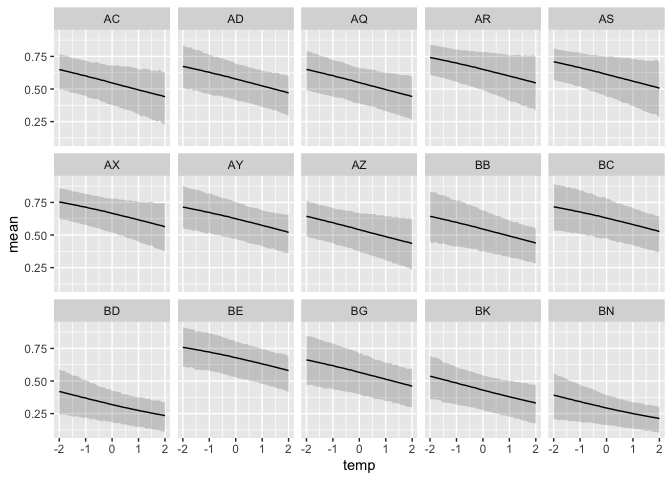

Hi all,

I've attached some data from a common garden experiment, where plants from 15 different populations were planted out (locations are shown in Figure 1 here if you're curious). One goal for the experiment was to see if temperature of origin affected performance of plants in the common garden. Here are some practice questions, very similar to Julin's from last week. The data set is big-ish. I've already sub-sampled it, but there are still 3250 observations. The models are still running quickly on my computer, but if that's not the case for you, feel free to sub-sample it further. Please let me know if you have any questions.


```r
library(rethinking)
```

```
## Loading required package: rstan
```

```
## Loading required package: StanHeaders
```

```
## Loading required package: ggplot2
```

```
## rstan (Version 2.19.2, GitRev: 2e1f913d3ca3)
```

```
## For execution on a local, multicore CPU with excess RAM we recommend calling
## options(mc.cores = parallel::detectCores()).
## To avoid recompilation of unchanged Stan programs, we recommend calling
## rstan_options(auto_write = TRUE)
```

```
## Loading required package: parallel
```

```
## Loading required package: dagitty
```

```
## rethinking (Version 1.93)
```

```
## 
## Attaching package: 'rethinking'
```

```
## The following object is masked from 'package:stats':
## 
##     rstudent
```

```r
library(tidyverse)
```

```
## ── Attaching packages ───────────────────────────────── tidyverse 1.3.0 ──
```

```
## ✓ tibble  2.1.3     ✓ dplyr   0.8.3
## ✓ tidyr   1.0.0     ✓ stringr 1.4.0
## ✓ readr   1.3.1     ✓ forcats 0.4.0
## ✓ purrr   0.3.3
```

```
## ── Conflicts ──────────────────────────────────── tidyverse_conflicts() ──
## x tidyr::extract() masks rstan::extract()
## x dplyr::filter()  masks stats::filter()
## x dplyr::lag()     masks stats::lag()
## x purrr::map()     masks rethinking::map()
```

```r
options(mc.cores = parallel::detectCores())
rstan_options(auto_write = TRUE)
```


```r
data <- read_csv("clarkia_transplant_data.csv")
```

```
## Parsed with column specification:
## cols(
##   temperature_diff_fall = col_double(),
##   blk = col_double(),
##   nov_germ = col_double(),
##   pop = col_character(),
##   dam = col_character(),
##   sire = col_character(),
##   nov_size = col_double(),
##   mar_surv = col_double(),
##   mar_size = col_double(),
##   fruit_count = col_double(),
##   total_est_seeds = col_double(),
##   temperature_diff_annual = col_double(),
##   precip_diff_spring = col_double(),
##   first_fl_julian = col_double(),
##   last_fl_julian = col_double()
## )
```

```r
data %>% arrange(pop)
```

```
## # A tibble: 3,250 x 15
##    temperature_dif…   blk nov_germ pop   dam   sire  nov_size mar_surv mar_size
##               <dbl> <dbl>    <dbl> <chr> <chr> <chr>    <dbl>    <dbl>    <dbl>
##  1            -1.30     3        1 AC    AC21  AC47         5        1       10
##  2            -1.30     1        1 AC    AC24  AC49         3        1        6
##  3            -1.30     1        1 AC    AC44  AC24        NA        1        6
##  4            -1.30     1        1 AC    AC17  AC13         4        1        6
##  5            -1.30     1        1 AC    AC19  AC05         3        1        8
##  6            -1.30     1        1 AC    AC38  AC21        NA        1        4
##  7            -1.30     1        1 AC    AC38  AC21        NA        1        2
##  8            -1.30     1        1 AC    AC05  AC17         4        1        8
##  9            -1.30     1        1 AC    AC24  AC49        NA        1        4
## 10            -1.30     2        1 AC    AC47  AC03         4        1        4
## # … with 3,240 more rows, and 6 more variables: fruit_count <dbl>,
## #   total_est_seeds <dbl>, temperature_diff_annual <dbl>,
## #   precip_diff_spring <dbl>, first_fl_julian <dbl>, last_fl_julian <dbl>
```


## 1
_1. Fit a simple model with effects of temperature difference (temperature_diff_fall) on November germination (nov_germ). Temperature difference is already centered and scaled (i.e., negative values are the smallest temperature differences). Make sure to use the appropriate likelihood for the germination data (0 = no germ, 1  = germ). _

First let's take a look

```r
data %>%
  group_by(pop) %>%
  summarize(temp_diff_fall=unique(temperature_diff_fall), germ.prop=mean(nov_germ)) %>%
  ggplot(aes(x=temp_diff_fall, y=germ.prop, color=pop)) +
  geom_point()
```

<!-- -->

fit a model

```r
datsmall <- data %>% select(nov_germ, temperature_diff_fall)
fm1 <- ulam(alist(nov_germ ~ dbinom(size=1, prob = p),
                  logit(p) <- a + b_temp*temperature_diff_fall,
                  a ~ dnorm(0, 2),
                  b_temp ~dnorm(0, 2)),
            data=datsmall,
            chains = 4,
            cores = 4,
            log_lik = TRUE)
```


```r
precis(fm1)
```

```
##              mean         sd       5.5%      94.5%    n_eff     Rhat
## a       0.2062897 0.03581636  0.1497621  0.2649778 1311.709 1.002310
## b_temp -0.2162736 0.03077157 -0.2653492 -0.1664145 1132.094 1.000885
```

```r
pairs(fm1)
```

<!-- -->

## 2. Simulate from your priors to see if you've chosen reasonable priors, adjust them if necessary.


```r
prior <- extract.prior(fm1)
```

```
## 
## SAMPLING FOR MODEL '3cfc66916c5836f5db2f0e5a730e0236' NOW (CHAIN 1).
## Chain 1: 
## Chain 1: Gradient evaluation took 0.000281 seconds
## Chain 1: 1000 transitions using 10 leapfrog steps per transition would take 2.81 seconds.
## Chain 1: Adjust your expectations accordingly!
## Chain 1: 
## Chain 1: 
## Chain 1: Iteration:    1 / 2000 [  0%]  (Warmup)
## Chain 1: Iteration:  200 / 2000 [ 10%]  (Warmup)
## Chain 1: Iteration:  400 / 2000 [ 20%]  (Warmup)
## Chain 1: Iteration:  600 / 2000 [ 30%]  (Warmup)
## Chain 1: Iteration:  800 / 2000 [ 40%]  (Warmup)
## Chain 1: Iteration: 1000 / 2000 [ 50%]  (Warmup)
## Chain 1: Iteration: 1001 / 2000 [ 50%]  (Sampling)
## Chain 1: Iteration: 1200 / 2000 [ 60%]  (Sampling)
## Chain 1: Iteration: 1400 / 2000 [ 70%]  (Sampling)
## Chain 1: Iteration: 1600 / 2000 [ 80%]  (Sampling)
## Chain 1: Iteration: 1800 / 2000 [ 90%]  (Sampling)
## Chain 1: Iteration: 2000 / 2000 [100%]  (Sampling)
## Chain 1: 
## Chain 1:  Elapsed Time: 0.826081 seconds (Warm-up)
## Chain 1:                0.74325 seconds (Sampling)
## Chain 1:                1.56933 seconds (Total)
## Chain 1:
```

```r
str(prior)
```

```
## List of 2
##  $ a     : num [1:1000(1d)] 4.4868 -0.1506 0.1202 -0.0745 0.4902 ...
##  $ b_temp: num [1:1000(1d)] 2.502 -1.189 -3.072 1.494 -0.504 ...
##  - attr(*, "source")= chr "ulam prior: 1000 samples from fit"
```


```r
pred.df <- data.frame(temperature_diff_fall=seq(-2,2,.1))
prior.pred <- link(fm1, data=pred.df, post=prior, n = 50)
dim(prior.pred)
```

```
## [1] 1000   41
```

```r
head(prior.pred[,1:10])
```

```
##            [,1]       [,2]       [,3]       [,4]       [,5]       [,6]
## [1,] 0.37329607 0.43343267 0.49559598 0.55789574 0.61842518 0.67548784
## [2,] 0.90269182 0.89173569 0.87971037 0.86654924 0.85219008 0.83657726
## [3,] 0.99810147 0.99742042 0.99649592 0.99524166 0.99354137 0.99123886
## [4,] 0.04467254 0.05150063 0.05930758 0.06821287 0.07834396 0.08983468
## [5,] 0.81744669 0.80979733 0.80190512 0.79376882 0.78538779 0.77676194
## [6,] 0.94412021 0.93366825 0.92142402 0.90714440 0.89057791 0.87147453
##           [,7]      [,8]      [,9]     [,10]
## [1,] 0.7277734 0.7744477 0.8151520 0.8499340
## [2,] 0.8196643 0.8014164 0.7818136 0.7608532
## [3,] 0.9881253 0.9839232 0.9782668 0.9706796
## [4,] 0.1028227 0.1174462 0.1338392 0.1521260
## [5,] 0.7678919 0.7587788 0.7494247 0.7398322
## [6,] 0.8495992 0.8247495 0.7967760 0.7656064
```

```r
#reality check:
inv_logit(prior$a[1] + prior$b_temp[1]*-2)
```

```
## [1] 0.3732961
```


```r
colnames(prior.pred) <- pred.df$temperature_diff_fall
prior.pred %>% as_tibble() %>%
  mutate(sample=1:nrow(.)) %>%
  gather(key="temp", value="germ", -sample) %>%
  mutate(temp=as.numeric(temp)) %>%
  ggplot(aes(x=temp, y=germ, group=sample)) +
  geom_line(alpha=.2)
```

<!-- -->

this implies that the slope prior is too wide, with most response going from no to all germination

try with narrower prior for b_temp


```r
datsmall <- data %>% select(nov_germ, temperature_diff_fall)
fm2 <- ulam(alist(nov_germ ~ dbinom(size=1, prob = p),
                  logit(p) <- a + b_temp*temperature_diff_fall,
                  a ~ dnorm(0, 1.5),
                  b_temp ~dnorm(0, .5)),
            data=datsmall,
            chains = 4,
            cores = 4,
            log_lik = TRUE)
```


```r
precis(fm2)
```

```
##             mean         sd       5.5%      94.5%    n_eff     Rhat
## a       0.202314 0.03617555  0.1458454  0.2597217 1384.805 1.000429
## b_temp -0.212550 0.02959347 -0.2582283 -0.1656204 1223.375 1.001430
```

```r
pairs(fm2)
```

<!-- -->


```r
prior <- extract.prior(fm2)
```

```
## 
## SAMPLING FOR MODEL 'dab5757eafd08671e77a0370656394df' NOW (CHAIN 1).
## Chain 1: 
## Chain 1: Gradient evaluation took 0.000245 seconds
## Chain 1: 1000 transitions using 10 leapfrog steps per transition would take 2.45 seconds.
## Chain 1: Adjust your expectations accordingly!
## Chain 1: 
## Chain 1: 
## Chain 1: Iteration:    1 / 2000 [  0%]  (Warmup)
## Chain 1: Iteration:  200 / 2000 [ 10%]  (Warmup)
## Chain 1: Iteration:  400 / 2000 [ 20%]  (Warmup)
## Chain 1: Iteration:  600 / 2000 [ 30%]  (Warmup)
## Chain 1: Iteration:  800 / 2000 [ 40%]  (Warmup)
## Chain 1: Iteration: 1000 / 2000 [ 50%]  (Warmup)
## Chain 1: Iteration: 1001 / 2000 [ 50%]  (Sampling)
## Chain 1: Iteration: 1200 / 2000 [ 60%]  (Sampling)
## Chain 1: Iteration: 1400 / 2000 [ 70%]  (Sampling)
## Chain 1: Iteration: 1600 / 2000 [ 80%]  (Sampling)
## Chain 1: Iteration: 1800 / 2000 [ 90%]  (Sampling)
## Chain 1: Iteration: 2000 / 2000 [100%]  (Sampling)
## Chain 1: 
## Chain 1:  Elapsed Time: 0.84689 seconds (Warm-up)
## Chain 1:                0.696238 seconds (Sampling)
## Chain 1:                1.54313 seconds (Total)
## Chain 1:
```

```r
str(prior)
```

```
## List of 2
##  $ a     : num [1:1000(1d)] 0.936 0.228 1.029 2.937 -1.306 ...
##  $ b_temp: num [1:1000(1d)] -0.332 -0.593 0.884 -0.156 -0.365 ...
##  - attr(*, "source")= chr "ulam prior: 1000 samples from fit"
```


```r
pred.df <- data.frame(temperature_diff_fall=seq(-2,2,.1))
prior.pred <- link(fm2, data=pred.df, post=prior, n = 50)
dim(prior.pred)
```

```
## [1] 1000   41
```

```r
head(prior.pred[,1:10])
```

```
##           [,1]      [,2]      [,3]      [,4]      [,5]      [,6]      [,7]
## [1,] 0.8318555 0.8271665 0.8223747 0.8174793 0.8124798 0.8073756 0.8021663
## [2,] 0.8043541 0.7948591 0.7850264 0.7748559 0.7643486 0.7535070 0.7423348
## [3,] 0.3232861 0.3429122 0.3630904 0.3837626 0.4048636 0.4263222 0.4480618
## [4,] 0.9626649 0.9620988 0.9615243 0.9609416 0.9603503 0.9597505 0.9591420
## [5,] 0.3598179 0.3514549 0.3431820 0.3350034 0.3269226 0.3189432 0.3110686
## [6,] 0.8123053 0.8029529 0.7932531 0.7832047 0.7728078 0.7620638 0.7509754
##           [,8]      [,9]     [,10]
## [1,] 0.7968516 0.7914312 0.7859050
## [2,] 0.7308370 0.7190204 0.7068931
## [3,] 0.4700017 0.4920583 0.5141457
## [4,] 0.9585247 0.9578985 0.9572632
## [5,] 0.3033019 0.2956458 0.2881031
## [6,] 0.7395469 0.7277841 0.7156942
```

```r
#reality check:
inv_logit(prior$a[1] + prior$b_temp[1]*-2)
```

```
## [1] 0.8318555
```


```r
colnames(prior.pred) <- pred.df$temperature_diff_fall
prior.pred %>% as_tibble() %>%
  mutate(sample=1:nrow(.)) %>%
  gather(key="temp", value="germ", -sample) %>%
  mutate(temp=as.numeric(temp)) %>%
  ggplot(aes(x=temp, y=germ, group=sample)) +
  geom_line(alpha=.2)
```

<!-- -->


_These blocks were set up in the field, and had differences in soil depth, slope, and competitive environment. So maybe a model that includes block will describe the data better._ 

## 3. Fit a model that includes an effect of block (blk), with no pooling.


```r
datsmall <- data %>% select(nov_germ, temperature_diff_fall, blk)
sort(unique(datsmall$blk))
```

```
## [1] 1 2 3 4
```

```r
fm3 <- ulam(alist(nov_germ ~ dbinom(size=1, prob = p),
                  logit(p) <- a[blk] + b_temp*temperature_diff_fall,
                  a[blk] ~ dnorm(0, 1.5),
                  b_temp ~ dnorm(0, .5)),
            data=datsmall,
            chains = 4,
            cores = 4,
            log_lik = TRUE)
```


```r
precis(fm3, depth=2)
```

```
##              mean         sd       5.5%      94.5%    n_eff      Rhat
## a[1]    0.3990700 0.07363892  0.2806837  0.5134624 2800.845 0.9995124
## a[2]    0.5419552 0.07524220  0.4220285  0.6623614 3269.861 0.9989856
## a[3]   -0.3345856 0.07189243 -0.4498801 -0.2145536 2397.645 0.9998883
## a[4]    0.2306565 0.06937206  0.1147653  0.3403167 3141.264 0.9990846
## b_temp -0.2210784 0.03038950 -0.2714536 -0.1740839 2449.520 0.9990809
```

```r
pairs(fm3)
```

<!-- -->


## 4. Fit a model that includes block, and allows partial pooling. 


```r
datsmall <- data %>% select(nov_germ, temperature_diff_fall, blk)
sort(unique(datsmall$blk))
```

```
## [1] 1 2 3 4
```

```r
fm4 <- ulam(alist(nov_germ ~ dbinom(size=1, prob = p),
                  logit(p) <- a[blk] + b_temp*temperature_diff_fall,
                  a[blk] ~ dnorm(ablk_bar, sigma),
                  b_temp ~ dnorm(0, .5),
                  ablk_bar ~ dnorm(0, 1.5),
                  sigma ~ dexp(1)),
            data=datsmall,
            chains = 4,
            cores = 4,
            log_lik = TRUE)
```


```r
pairs(fm4)
```

<!-- -->

```r
precis(fm4, depth=2)
```

```
##                mean         sd       5.5%      94.5%    n_eff      Rhat
## a[1]      0.3925428 0.07266169  0.2806880  0.5101367 1930.991 0.9988472
## a[2]      0.5377727 0.07073717  0.4234551  0.6521163 1711.974 0.9987797
## a[3]     -0.3189234 0.07464991 -0.4429812 -0.2021733 1924.265 0.9998765
## a[4]      0.2289347 0.06802226  0.1250021  0.3374347 2088.870 0.9981434
## b_temp   -0.2208488 0.02985938 -0.2679628 -0.1736746 1952.232 0.9998511
## ablk_bar  0.2256655 0.30235172 -0.2046109  0.7151591  983.515 1.0018146
## sigma     0.5720261 0.33621208  0.2464140  1.2141371 1043.284 1.0005278
```

The experiment included many individuals from each of the 15 populations. So, each individual is not an independent representative of a given temperature, but might be similar to other plants from that population for reasons besides temperature. 

5. Build a model that accounts for this by including population (pop) and allowing partial pooling between populations A) without block, and B) with block included as in the model above. How does including population affect the temperature estimate?


```r
datsmall <- data %>% 
  mutate(pop_i = as.numeric(as.factor(pop))) %>%
  select(nov_germ, temperature_diff_fall, pop_i)

fm5a <- ulam(alist(nov_germ ~ dbinom(size=1, prob = p),
                   logit(p) <- a[pop_i] + b_temp*temperature_diff_fall,
                   a[pop_i] ~ dnorm(apop_bar, sigma_pop),
                   apop_bar ~ dnorm(0,1.5),
                   sigma_pop ~ dexp(1),
                   b_temp ~ dnorm(0, .5)),
             data=datsmall,
             chains = 4,
             cores = 4,
             iter=2000,
             log_lik = TRUE)
```


```r
precis(fm5a, depth=2)
```

```
##                 mean        sd        5.5%        94.5%     n_eff      Rhat
## a[1]       0.1972681 0.2008430 -0.11927065  0.523077911  824.3026 1.0044187
## a[2]       0.3091208 0.1545450  0.06332130  0.553436025 1179.9365 1.0029929
## a[3]       0.1952432 0.1312611 -0.01939446  0.411225151 3358.0161 0.9997183
## a[4]       0.6496376 0.2354049  0.28012467  1.028283160  851.3091 1.0035935
## a[5]       0.4802189 0.2304963  0.12672793  0.854005954  693.9441 1.0038746
## a[6]       0.7102510 0.1616222  0.45311239  0.970589603 1463.7945 1.0035835
## a[7]       0.5037389 0.1974004  0.18445304  0.816553605  848.7574 1.0043997
## a[8]       0.1760517 0.1810358 -0.10345696  0.467622197 1007.5139 1.0024766
## a[9]       0.1679930 0.2389082 -0.21796937  0.538751957  679.8906 1.0044803
## a[10]      0.5182876 0.2606403  0.09833328  0.927592897  658.6636 1.0052582
## a[11]     -0.7707996 0.1676558 -1.03843413 -0.505505169 2415.9241 1.0010118
## a[12]      0.7446943 0.2248902  0.38403559  1.100999141  724.1779 1.0040809
## a[13]      0.2578330 0.2487386 -0.14202146  0.659904567  869.2495 1.0038705
## a[14]     -0.2812506 0.1309075 -0.49576449 -0.071344896 3082.9798 0.9994869
## a[15]     -0.8983621 0.1687415 -1.16668529 -0.638686537 1338.3339 1.0024829
## apop_bar   0.1968751 0.1553751 -0.04556189  0.442022274 2798.1419 1.0020516
## sigma_pop  0.5754112 0.1400385  0.39926071  0.826451612 1964.1172 1.0022535
## b_temp    -0.2057005 0.1244027 -0.40250500 -0.001737064  531.4938 1.0071608
```

```r
pairs(fm5a)
```

<!-- -->
temp estimate the same, but confidence interval much wider

with block.  had to adjust sigma_pop and sigma_blk for narrower priors, and increase iter

```r
datsmall <- data %>% 
  mutate(pop_i = as.numeric(as.factor(pop))) %>%
  select(nov_germ, temperature_diff_fall, pop_i, blk)

fm5b <- ulam(alist(nov_germ ~ dbinom(size=1, prob = p),
                   logit(p) <- a[pop_i] + b_temp*temperature_diff_fall + b_blk[blk],
                   a[pop_i] ~ dnorm(apop_bar, sigma_pop),
                   b_blk[blk] ~ dnorm(0, sigma_blk),
                   apop_bar ~ dnorm(0, 1),
                   sigma_pop ~ dcauchy(0, .5),
                   sigma_blk ~ dcauchy(0, .25),
                   b_temp ~ dnorm(0, .5)),
             data=datsmall,
             chains = 4,
             cores = 4,
             iter=4000,
             log_lik = TRUE)
```


```r
precis(fm5b, depth=2)
```

```
##                 mean        sd        5.5%       94.5%     n_eff     Rhat
## a[1]       0.1840341 0.3140873 -0.31083816  0.66589391 1187.9195 1.000582
## a[2]       0.3113492 0.2773605 -0.13380270  0.72170387  891.3820 1.003531
## a[3]       0.1939219 0.2671888 -0.22430811  0.60415478  926.7002 1.002603
## a[4]       0.6370350 0.3328026  0.12244955  1.15907418 1287.8404 1.000691
## a[5]       0.4663299 0.3339023 -0.04411796  0.98331511 1226.2895 1.000667
## a[6]       0.7065792 0.2874452  0.26066538  1.14870469 1064.7453 1.001311
## a[7]       0.5205467 0.3005343  0.04601329  0.97783566  987.9274 1.003464
## a[8]       0.1590930 0.3042443 -0.31989835  0.63392148 1143.0601 1.000775
## a[9]       0.1797868 0.3217649 -0.33710259  0.67178511  999.5202 1.003468
## a[10]      0.5466987 0.3439147 -0.01398931  1.08766100 1072.4338 1.003221
## a[11]     -0.7940090 0.2872199 -1.25205729 -0.35025016  974.1480 1.002426
## a[12]      0.7689255 0.3148919  0.26742950  1.25589772 1011.7919 1.003061
## a[13]      0.2694596 0.3345413 -0.26822689  0.79071728 1060.9898 1.003654
## a[14]     -0.2992490 0.2703622 -0.72196661  0.11249454  943.5040 1.002279
## a[15]     -0.9187939 0.2842356 -1.37331787 -0.49848049  939.1034 1.002843
## b_blk[1]   0.1996716 0.2432440 -0.15935461  0.58587486  781.9458 1.002733
## b_blk[2]   0.3502276 0.2420937 -0.01084913  0.72966790  795.2173 1.002740
## b_blk[3]  -0.5456456 0.2431945 -0.91067124 -0.17953010  780.8197 1.002875
## b_blk[4]   0.0289286 0.2411972 -0.32603403  0.41287687  794.9311 1.003156
## apop_bar   0.1928973 0.2746499 -0.24281491  0.60873227  941.7307 1.002311
## sigma_pop  0.5703592 0.1262984  0.40218860  0.79433163 3306.2851 1.000222
## sigma_blk  0.4570466 0.2251152  0.23293953  0.84737328 1910.8303 1.002499
## b_temp    -0.2222192 0.1223909 -0.41006482 -0.01822365 1693.2631 1.000600
```

```r
extract.samples(fm5b) %>%
  as.data.frame() %>%
  cor() %>%
  round(2)
```

```
##             a.1   a.2   a.3   a.4   a.5   a.6   a.7   a.8   a.9  a.10  a.11
## a.1        1.00  0.50  0.68  0.79  0.82  0.76  0.37  0.80  0.24  0.18  0.55
## a.2        0.50  1.00  0.72  0.44  0.44  0.61  0.78  0.54  0.76  0.74  0.72
## a.3        0.68  0.72  1.00  0.64  0.65  0.74  0.66  0.70  0.60  0.56  0.71
## a.4        0.79  0.44  0.64  1.00  0.80  0.74  0.33  0.79  0.21  0.14  0.51
## a.5        0.82  0.44  0.65  0.80  1.00  0.75  0.30  0.80  0.17  0.11  0.51
## a.6        0.76  0.61  0.74  0.74  0.75  1.00  0.51  0.78  0.42  0.36  0.63
## a.7        0.37  0.78  0.66  0.33  0.30  0.51  1.00  0.42  0.80  0.79  0.68
## a.8        0.80  0.54  0.70  0.79  0.80  0.78  0.42  1.00  0.30  0.25  0.59
## a.9        0.24  0.76  0.60  0.21  0.17  0.42  0.80  0.30  1.00  0.85  0.64
## a.10       0.18  0.74  0.56  0.14  0.11  0.36  0.79  0.25  0.85  1.00  0.61
## a.11       0.55  0.72  0.71  0.51  0.51  0.63  0.68  0.59  0.64  0.61  1.00
## a.12       0.28  0.76  0.61  0.23  0.21  0.44  0.80  0.33  0.84  0.84  0.65
## a.13       0.25  0.71  0.58  0.21  0.19  0.41  0.76  0.32  0.78  0.79  0.63
## a.14       0.69  0.71  0.76  0.65  0.66  0.73  0.62  0.72  0.57  0.53  0.71
## a.15       0.49  0.75  0.71  0.43  0.43  0.59  0.74  0.53  0.73  0.71  0.70
## b_blk.1   -0.74 -0.80 -0.85 -0.69 -0.70 -0.80 -0.73 -0.77 -0.67 -0.62 -0.78
## b_blk.2   -0.74 -0.80 -0.85 -0.69 -0.70 -0.80 -0.73 -0.77 -0.67 -0.63 -0.79
## b_blk.3   -0.74 -0.80 -0.85 -0.70 -0.70 -0.80 -0.73 -0.77 -0.66 -0.63 -0.77
## b_blk.4   -0.75 -0.80 -0.85 -0.70 -0.70 -0.80 -0.73 -0.77 -0.67 -0.63 -0.78
## apop_bar   0.61  0.73  0.74  0.57  0.56  0.67  0.69  0.64  0.65  0.61  0.71
## sigma_pop  0.04  0.02  0.01  0.08  0.06  0.07  0.03  0.03 -0.01  0.01 -0.12
## sigma_blk  0.01 -0.02 -0.01  0.01  0.01  0.00 -0.03  0.01 -0.03 -0.03 -0.02
## b_temp     0.51 -0.26  0.06  0.54  0.59  0.31 -0.42  0.45 -0.57 -0.63 -0.09
##            a.12  a.13  a.14  a.15 b_blk.1 b_blk.2 b_blk.3 b_blk.4 apop_bar
## a.1        0.28  0.25  0.69  0.49   -0.74   -0.74   -0.74   -0.75     0.61
## a.2        0.76  0.71  0.71  0.75   -0.80   -0.80   -0.80   -0.80     0.73
## a.3        0.61  0.58  0.76  0.71   -0.85   -0.85   -0.85   -0.85     0.74
## a.4        0.23  0.21  0.65  0.43   -0.69   -0.69   -0.70   -0.70     0.57
## a.5        0.21  0.19  0.66  0.43   -0.70   -0.70   -0.70   -0.70     0.56
## a.6        0.44  0.41  0.73  0.59   -0.80   -0.80   -0.80   -0.80     0.67
## a.7        0.80  0.76  0.62  0.74   -0.73   -0.73   -0.73   -0.73     0.69
## a.8        0.33  0.32  0.72  0.53   -0.77   -0.77   -0.77   -0.77     0.64
## a.9        0.84  0.78  0.57  0.73   -0.67   -0.67   -0.66   -0.67     0.65
## a.10       0.84  0.79  0.53  0.71   -0.62   -0.63   -0.63   -0.63     0.61
## a.11       0.65  0.63  0.71  0.70   -0.78   -0.79   -0.77   -0.78     0.71
## a.12       1.00  0.78  0.59  0.73   -0.68   -0.68   -0.69   -0.69     0.66
## a.13       0.78  1.00  0.56  0.69   -0.65   -0.65   -0.65   -0.65     0.63
## a.14       0.59  0.56  1.00  0.69   -0.85   -0.84   -0.84   -0.84     0.73
## a.15       0.73  0.69  0.69  1.00   -0.78   -0.78   -0.78   -0.78     0.72
## b_blk.1   -0.68 -0.65 -0.85 -0.78    1.00    0.91    0.90    0.91    -0.80
## b_blk.2   -0.68 -0.65 -0.84 -0.78    0.91    1.00    0.91    0.91    -0.80
## b_blk.3   -0.69 -0.65 -0.84 -0.78    0.90    0.91    1.00    0.91    -0.80
## b_blk.4   -0.69 -0.65 -0.84 -0.78    0.91    0.91    0.91    1.00    -0.80
## apop_bar   0.66  0.63  0.73  0.72   -0.80   -0.80   -0.80   -0.80     1.00
## sigma_pop  0.04  0.00 -0.03 -0.10   -0.01   -0.02   -0.02   -0.02     0.01
## sigma_blk -0.03 -0.02 -0.01 -0.02    0.03    0.04   -0.04    0.02    -0.01
## b_temp    -0.53 -0.50  0.10 -0.24   -0.05   -0.05   -0.05   -0.05    -0.05
##           sigma_pop sigma_blk b_temp
## a.1            0.04      0.01   0.51
## a.2            0.02     -0.02  -0.26
## a.3            0.01     -0.01   0.06
## a.4            0.08      0.01   0.54
## a.5            0.06      0.01   0.59
## a.6            0.07      0.00   0.31
## a.7            0.03     -0.03  -0.42
## a.8            0.03      0.01   0.45
## a.9           -0.01     -0.03  -0.57
## a.10           0.01     -0.03  -0.63
## a.11          -0.12     -0.02  -0.09
## a.12           0.04     -0.03  -0.53
## a.13           0.00     -0.02  -0.50
## a.14          -0.03     -0.01   0.10
## a.15          -0.10     -0.02  -0.24
## b_blk.1       -0.01      0.03  -0.05
## b_blk.2       -0.02      0.04  -0.05
## b_blk.3       -0.02     -0.04  -0.05
## b_blk.4       -0.02      0.02  -0.05
## apop_bar       0.01     -0.01  -0.05
## sigma_pop      1.00      0.02   0.04
## sigma_blk      0.02      1.00   0.03
## b_temp         0.04      0.03   1.00
```


## 6. Compare the five models you built using WAIC. Which fits best?


```r
compare(fm1, fm2, fm3, fm4, fm5a, fm5b)
```

```
##          WAIC       SE     dWAIC      dSE     pWAIC       weight
## fm5b 4184.590 34.34640   0.00000       NA 17.065788 1.000000e+00
## fm5a 4271.239 30.09583  86.64895 18.24578 14.311994 1.529043e-19
## fm4  4355.021 24.32227 170.43096 25.60195  4.850214 9.803615e-38
## fm3  4355.311 24.65054 170.72163 25.63287  5.034649 8.477513e-38
## fm2  4436.382 16.58948 251.79256 30.52109  1.960980 2.108338e-55
## fm1  4436.464 16.88819 251.87487 30.52915  2.005723 2.023330e-55
```

including block and pop fits best.  doesn't seem to matter if block is heirarchical or not (fm3 and fm4 very similar)


## 7. Plot effects of temperature difference for the average block, and also make a plot that includes the variability across blocks. 

Should I do this for the different populations?

first, average block, all pops:


```r
post <- extract.samples(fm5b)
str(post)
```

```
## List of 6
##  $ a        : num [1:8000, 1:15] 0.6501 0.0512 0.5571 -0.1263 -0.119 ...
##  $ b_blk    : num [1:8000, 1:4] 0.01399 0.41939 0.00507 0.34334 0.44385 ...
##  $ apop_bar : num [1:8000(1d)] 0.0181 -0.291 0.584 -0.0865 0.032 ...
##  $ sigma_pop: num [1:8000(1d)] 1.03 0.602 0.592 0.344 0.481 ...
##  $ sigma_blk: num [1:8000(1d)] 0.229 0.651 0.739 0.273 0.379 ...
##  $ b_temp   : num [1:8000(1d)] -0.229 -0.229 -0.265 -0.264 -0.243 ...
##  - attr(*, "source")= chr "ulam posterior: 8000 samples from fm5b"
```


```r
link_avg_blk <- function(post, temp) {
  m <- with(post, inv_logit(a + as.vector(b_temp*temp)))
  m
}
```


```r
pred.df <- tibble(temp = seq(-2,2,.1))

pred.df <- pred.df %>%
  mutate(posterior.pred=map(temp, ~ link_avg_blk(post, temp=.)))

pred.df # a tibble of tables
```

```
## # A tibble: 41 x 2
##     temp posterior.pred         
##    <dbl> <list>                 
##  1 -2    <dbl[,15] [8,000 × 15]>
##  2 -1.9  <dbl[,15] [8,000 × 15]>
##  3 -1.8  <dbl[,15] [8,000 × 15]>
##  4 -1.7  <dbl[,15] [8,000 × 15]>
##  5 -1.6  <dbl[,15] [8,000 × 15]>
##  6 -1.5  <dbl[,15] [8,000 × 15]>
##  7 -1.4  <dbl[,15] [8,000 × 15]>
##  8 -1.30 <dbl[,15] [8,000 × 15]>
##  9 -1.2  <dbl[,15] [8,000 × 15]>
## 10 -1.1  <dbl[,15] [8,000 × 15]>
## # … with 31 more rows
```

now compute mean and hpdi for each temperature

```r
pred.df <- pred.df %>%
  mutate(mean=map(posterior.pred, ~ apply(., 2, mean)),
         low89=map(posterior.pred, ~ apply(., 2, HPDI)[1,]),
         high89=map(posterior.pred, ~ apply(., 2, HPDI)[2,]),
  )
pred.df
```

```
## # A tibble: 41 x 5
##     temp posterior.pred          mean       low89      high89    
##    <dbl> <list>                  <list>     <list>     <list>    
##  1 -2    <dbl[,15] [8,000 × 15]> <dbl [15]> <dbl [15]> <dbl [15]>
##  2 -1.9  <dbl[,15] [8,000 × 15]> <dbl [15]> <dbl [15]> <dbl [15]>
##  3 -1.8  <dbl[,15] [8,000 × 15]> <dbl [15]> <dbl [15]> <dbl [15]>
##  4 -1.7  <dbl[,15] [8,000 × 15]> <dbl [15]> <dbl [15]> <dbl [15]>
##  5 -1.6  <dbl[,15] [8,000 × 15]> <dbl [15]> <dbl [15]> <dbl [15]>
##  6 -1.5  <dbl[,15] [8,000 × 15]> <dbl [15]> <dbl [15]> <dbl [15]>
##  7 -1.4  <dbl[,15] [8,000 × 15]> <dbl [15]> <dbl [15]> <dbl [15]>
##  8 -1.30 <dbl[,15] [8,000 × 15]> <dbl [15]> <dbl [15]> <dbl [15]>
##  9 -1.2  <dbl[,15] [8,000 × 15]> <dbl [15]> <dbl [15]> <dbl [15]>
## 10 -1.1  <dbl[,15] [8,000 × 15]> <dbl [15]> <dbl [15]> <dbl [15]>
## # … with 31 more rows
```


```r
plot.df <- pred.df %>% select(-posterior.pred) %>% 
  unnest(mean, low89, high89) %>%
  mutate(pop=rep_along(mean, levels(factor(data$pop)) )) # an unsatisfying way to handle this
```

```
## Warning: unnest() has a new interface. See ?unnest for details.
## Try `df %>% unnest(c(mean, low89, high89))`, with `mutate()` if needed
```

```r
plot.df
```

```
## # A tibble: 615 x 5
##     temp  mean low89 high89 pop  
##    <dbl> <dbl> <dbl>  <dbl> <chr>
##  1    -2 0.650 0.554  0.751 AC   
##  2    -2 0.674 0.546  0.825 AD   
##  3    -2 0.650 0.529  0.771 AQ   
##  4    -2 0.743 0.662  0.828 AR   
##  5    -2 0.710 0.623  0.793 AS   
##  6    -2 0.755 0.671  0.847 AX   
##  7    -2 0.715 0.581  0.859 AY   
##  8    -2 0.644 0.548  0.751 AZ   
##  9    -2 0.644 0.483  0.826 BB   
## 10    -2 0.718 0.571  0.888 BC   
## # … with 605 more rows
```


```r
plot.df %>%
  ggplot(aes(x=temp, y=mean, ymin=low89, ymax=high89, color=pop, group=pop)) +
  geom_line() 
```

<!-- -->

alternative:


```r
plot.df %>%
  ggplot(aes(x=temp, y=mean, ymin=low89, ymax=high89)) +
  geom_ribbon(alpha=.2) +
  geom_line() +
  facet_wrap(~pop, nrow=3)
```

<!-- -->


### average block, average pop:


```r
link_avg_blk_avg_pop <- function(post, temp) {
  m <- with(post, inv_logit(rowMeans(a) + as.vector(b_temp*temp)))
  m
}
```


```r
pred.df <- tibble(temp = seq(-2,2,.1))

pred.df <- pred.df %>%
  mutate(posterior.pred=map(temp, ~ link_avg_blk_avg_pop(post, temp=.)))

pred.df # a tibble of tables
```

```
## # A tibble: 41 x 2
##     temp posterior.pred
##    <dbl> <list>        
##  1 -2    <dbl [8,000]> 
##  2 -1.9  <dbl [8,000]> 
##  3 -1.8  <dbl [8,000]> 
##  4 -1.7  <dbl [8,000]> 
##  5 -1.6  <dbl [8,000]> 
##  6 -1.5  <dbl [8,000]> 
##  7 -1.4  <dbl [8,000]> 
##  8 -1.30 <dbl [8,000]> 
##  9 -1.2  <dbl [8,000]> 
## 10 -1.1  <dbl [8,000]> 
## # … with 31 more rows
```

now compute mean and hpdi for each temperature

```r
pred.df <- pred.df %>%
  mutate(mean=map_dbl(posterior.pred, ~ mean(.)),
         low89=map_dbl(posterior.pred, ~ HPDI(.)[1]),
         high89=map_dbl(posterior.pred, ~ HPDI(.)[2]),
  )
pred.df
```

```
## # A tibble: 41 x 5
##     temp posterior.pred  mean low89 high89
##    <dbl> <list>         <dbl> <dbl>  <dbl>
##  1 -2    <dbl [8,000]>  0.651 0.537  0.782
##  2 -1.9  <dbl [8,000]>  0.646 0.533  0.774
##  3 -1.8  <dbl [8,000]>  0.641 0.529  0.765
##  4 -1.7  <dbl [8,000]>  0.636 0.526  0.757
##  5 -1.6  <dbl [8,000]>  0.631 0.523  0.750
##  6 -1.5  <dbl [8,000]>  0.627 0.524  0.747
##  7 -1.4  <dbl [8,000]>  0.622 0.518  0.737
##  8 -1.30 <dbl [8,000]>  0.617 0.511  0.724
##  9 -1.2  <dbl [8,000]>  0.611 0.512  0.721
## 10 -1.1  <dbl [8,000]>  0.606 0.509  0.713
## # … with 31 more rows
```


```r
pred.df %>%
  select(-posterior.pred) %>%
  ggplot(aes(x=temp, y=mean, ymin=low89, ymax=high89)) +
  geom_ribbon(alpha=.2) +
  geom_line() 
```

<!-- -->

### include uncertainity about block


```r
pickOnePerRow <- function(m) { # pick one value from each row of a matrix and return as vector
                               # is there a better way to do this?
  result <- vector(mode=mode(m), length=nrow(m))
  for(i in 1:nrow(m)) result[i] <- m[i, sample(ncol(m), size=1)]
  return(result)
}

link_blk <- function(post, temp) {
  m <- with(post, 
            inv_logit(
              a + 
                as.vector(b_temp*temp) + 
                pickOnePerRow(b_blk) # pick a flat at random
            )
  )
  return(m)
}
```


```r
pred.df <- tibble(temp = seq(-2,2,.1)) 

pred.df <- pred.df %>%
  mutate(posterior.pred=map(temp, ~ link_blk(post, temp=.)))

pred.df # a tibble of tables
```

```
## # A tibble: 41 x 2
##     temp posterior.pred         
##    <dbl> <list>                 
##  1 -2    <dbl[,15] [8,000 × 15]>
##  2 -1.9  <dbl[,15] [8,000 × 15]>
##  3 -1.8  <dbl[,15] [8,000 × 15]>
##  4 -1.7  <dbl[,15] [8,000 × 15]>
##  5 -1.6  <dbl[,15] [8,000 × 15]>
##  6 -1.5  <dbl[,15] [8,000 × 15]>
##  7 -1.4  <dbl[,15] [8,000 × 15]>
##  8 -1.30 <dbl[,15] [8,000 × 15]>
##  9 -1.2  <dbl[,15] [8,000 × 15]>
## 10 -1.1  <dbl[,15] [8,000 × 15]>
## # … with 31 more rows
```

now compute mean and hpdi for each temperature

```r
pred.df <- pred.df %>%
  mutate(mean=map(posterior.pred, ~ apply(., 2, mean)), 
         low89=map(posterior.pred, ~ apply(., 2, HPDI)[1,]),
         high89=map(posterior.pred, ~ apply(., 2, HPDI)[2,]),
  )
pred.df
```

```
## # A tibble: 41 x 5
##     temp posterior.pred          mean       low89      high89    
##    <dbl> <list>                  <list>     <list>     <list>    
##  1 -2    <dbl[,15] [8,000 × 15]> <dbl [15]> <dbl [15]> <dbl [15]>
##  2 -1.9  <dbl[,15] [8,000 × 15]> <dbl [15]> <dbl [15]> <dbl [15]>
##  3 -1.8  <dbl[,15] [8,000 × 15]> <dbl [15]> <dbl [15]> <dbl [15]>
##  4 -1.7  <dbl[,15] [8,000 × 15]> <dbl [15]> <dbl [15]> <dbl [15]>
##  5 -1.6  <dbl[,15] [8,000 × 15]> <dbl [15]> <dbl [15]> <dbl [15]>
##  6 -1.5  <dbl[,15] [8,000 × 15]> <dbl [15]> <dbl [15]> <dbl [15]>
##  7 -1.4  <dbl[,15] [8,000 × 15]> <dbl [15]> <dbl [15]> <dbl [15]>
##  8 -1.30 <dbl[,15] [8,000 × 15]> <dbl [15]> <dbl [15]> <dbl [15]>
##  9 -1.2  <dbl[,15] [8,000 × 15]> <dbl [15]> <dbl [15]> <dbl [15]>
## 10 -1.1  <dbl[,15] [8,000 × 15]> <dbl [15]> <dbl [15]> <dbl [15]>
## # … with 31 more rows
```


```r
plot.df <- pred.df %>% select(-posterior.pred) %>%  
  unnest(c(mean, low89, high89)) %>%
  mutate(pop=rep_along(mean, levels(factor(data$pop)) )) # an unsatisfying way to handle this
plot.df
```

```
## # A tibble: 615 x 5
##     temp  mean low89 high89 pop  
##    <dbl> <dbl> <dbl>  <dbl> <chr>
##  1    -2 0.649 0.495  0.766 AC   
##  2    -2 0.673 0.508  0.839 AD   
##  3    -2 0.650 0.490  0.794 AQ   
##  4    -2 0.741 0.608  0.840 AR   
##  5    -2 0.708 0.572  0.813 AS   
##  6    -2 0.753 0.624  0.862 AX   
##  7    -2 0.714 0.551  0.878 AY   
##  8    -2 0.643 0.492  0.766 AZ   
##  9    -2 0.643 0.444  0.836 BB   
## 10    -2 0.716 0.535  0.895 BC   
## # … with 605 more rows
```


```r
plot.df %>% 
  ggplot(aes(x=temp, y=mean, ymin=low89, ymax=high89)) +
  geom_ribbon(alpha=.2) +
  geom_line() +
  facet_wrap(~pop, nrow=3)
```

<!-- -->


There are other complexities to this data. For example, there is also some family structure within populations (dam and sire) which could be included as hierarchical effects. There are also other response variables (November size, March survival and size, first flower date, last flower date, fruit number, estimated seed production) that might require different likelihoods (and in some cases treatment for over-dispersion or zero inflation). So if the above problems were too easy and you feel adventurous, you could try analyzing one of these responses instead of germination (you will need to filter out missing observations).

