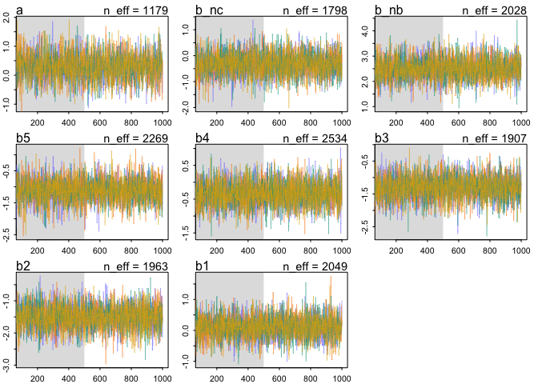
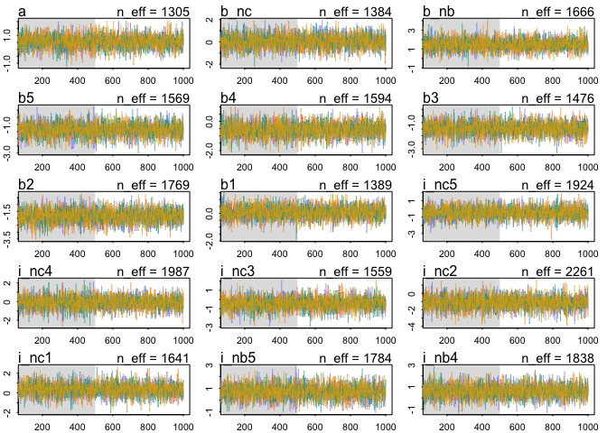

```r
library(rethinking)
```

```
## Loading required package: rstan
```

```
## Loading required package: StanHeaders
```

```
## Loading required package: ggplot2
```

```
## rstan (Version 2.19.2, GitRev: 2e1f913d3ca3)
```

```
## For execution on a local, multicore CPU with excess RAM we recommend calling
## options(mc.cores = parallel::detectCores()).
## To avoid recompilation of unchanged Stan programs, we recommend calling
## rstan_options(auto_write = TRUE)
```

```
## Loading required package: parallel
```

```
## Loading required package: dagitty
```

```
## rethinking (Version 1.93)
```

```
## 
## Attaching package: 'rethinking'
```

```
## The following object is masked from 'package:stats':
## 
##     rstudent
```

```r
library(tidyverse)
```

```
## ── Attaching packages ──── tidyverse 1.3.0 ──
```

```
## ✓ tibble  2.1.3     ✓ dplyr   0.8.3
## ✓ tidyr   1.0.0     ✓ stringr 1.4.0
## ✓ readr   1.3.1     ✓ forcats 0.4.0
## ✓ purrr   0.3.3
```

```
## ── Conflicts ─────── tidyverse_conflicts() ──
## x tidyr::extract() masks rstan::extract()
## x dplyr::filter()  masks stats::filter()
## x dplyr::lag()     masks stats::lag()
## x purrr::map()     masks rethinking::map()
```

Here is your much-awaited dataset for our upcoming meeting on the 21st of February, 2020. The data came fresh off the greenhouse on 2/8/2020 from a night break experiment. Thirty-two accessions from a lettuce F6 recombinant inbred line population were planted in the same greenhouse under 10hr light/14hr dark diurnal cycles. Three treatments are implemented: 

1. "Nightbreak": the plants are grown on a bench surrounded by plastic blackout curtains. These plants receive a one-hour night break treatment at 12am every day (meaning the lights turn on in the middle of the night for an hour) in addition to the 10L/14D lighting. 
2. "Control": the plants are grown on a bench surrounded by plastic blackout curtains. 10L/14D lighting. 
3. "Control_NoCurtain": the plants are grown on a bench without any curtains. 10L/14D lighting. 

The goals of the experiment are:
a. to see if night break induces earlier flowering in lettuce;
b. if so, do different lettuce genotypes respond to night breaks differently; and 
c. which one(s) of the five candidate loci is/are associated with differential responses. 

How to interpret the phenotype:
Phenotype is recorded in the "Score" column. The different scores represent different developmental stages:
1: rosette 
2: bolted (elongation of the main stem)
3: budding
4: first flower
5: first mature seed head

Aaaaand finally here are your questions!
Q1: 
a. Load the dataset. Look for column "Score" for the response variable we are interested in. A developmental score of 1 or 2 indicates vegetative growth, while a score of 3, 4, or 5 indicates reproductive growth. Create a "Reproduction" column with values 0 and 1, where 0 indicates vegetative growth and 1 indicates reproductive growth. 


```r
data <- read_csv("Nightbreak_02_08_20_Rclub.csv")
```

```
## Parsed with column specification:
## cols(
##   RIL = col_character(),
##   Treatment = col_character(),
##   Rep = col_double(),
##   Plot = col_double(),
##   Date = col_character(),
##   loc1 = col_character(),
##   loc2 = col_character(),
##   loc3 = col_character(),
##   loc4 = col_character(),
##   loc5 = col_character(),
##   Score = col_double()
## )
```

```r
head(data)
```

```
## # A tibble: 6 x 11
##   RIL   Treatment   Rep  Plot Date   loc1  loc2  loc3  loc4  loc5  Score
##   <chr> <chr>     <dbl> <dbl> <chr>  <chr> <chr> <chr> <chr> <chr> <dbl>
## 1 100   Control       1     1 2/8/20 P     P     A     P     A         2
## 2 2     Control       1     2 2/8/20 A     P     P     A     A         2
## 3 137   Control       1     3 2/8/20 P     A     P     P     A         1
## 4 172   Control       1     4 2/8/20 P     P     P     A     A         2
## 5 188   Control       1     5 2/8/20 P     A     P     P     P         2
## 6 PI    Control       1     6 2/8/20 P     P     P     P     P         3
```

```r
table(data$RIL, data$Treatment)
```

```
##      
##       Control Control_NoCurtain NightBreak
##   100       2                 2          2
##   105       2                 2          2
##   108       2                 2          2
##   112       2                 2          2
##   114       2                 2          2
##   137       2                 2          2
##   14        2                 2          2
##   146       2                 2          2
##   154       2                 2          2
##   161       2                 2          2
##   169       2                 2          2
##   172       2                 2          2
##   175       2                 2          2
##   179       2                 2          2
##   188       2                 1          1
##   19        2                 2          2
##   2         2                 2          2
##   201       2                 2          2
##   21        2                 2          2
##   222       2                 2          2
##   228       2                 2          2
##   229       2                 2          2
##   235       2                 2          2
##   24        2                 2          2
##   25        2                 1          1
##   33        2                 2          2
##   53        2                 2          2
##   55        2                 2          2
##   58        2                 2          2
##   66        2                 2          2
##   Arm       2                 2          2
##   PI        2                 2          2
```


```r
data <- data %>%
  mutate(reproduction=ifelse(Score>2, 1, 0))
```


```r
data %>% group_by(Treatment) %>%
  summarize(repro=mean(reproduction))
```

```
## # A tibble: 3 x 2
##   Treatment         repro
##   <chr>             <dbl>
## 1 Control           0.172
## 2 Control_NoCurtain 0.161
## 3 NightBreak        0.677
```


b. (optional) Take a look at columns "loc1" through "loc5". The levels "A" or "P" indicate which parental allele the RIL has inherited. Can you think of a reason why there are 32 lines in this experiment? 


```r
2^5
```

```
## [1] 32
```


Q2:
Using the "Reproduction" column you created in Q1a as the response variable, fit a simple model with effects of genotype ("RIL") and treatment ("Treatment") on the rate of transitioning to reproductive growth by 2/8/20. (Things you might want to consider: appropriate likelihood function, intersection term). 

First fit a model with Treatment only

```r
data <- data %>%
  mutate(RIL_i = as.numeric(as.factor(data$RIL)),
         NoCurtain = ifelse(Treatment=="Control_NoCurtain", 1L, 0L),
         NightBreak = ifelse(Treatment=="NightBreak", 1L, 0L))

dat2a <- data %>% select(reproduction, NoCurtain, NightBreak)

fm2a <- ulam(alist(reproduction ~ dbinom(1, p),
                   logit(p) <- a + b_nc*NoCurtain + b_nb*NightBreak,
                   a ~ dnorm(0, 1.5),
                   b_nc ~ dnorm(0,1),
                   b_nb ~ dnorm(0,1)),
             data=dat2a,
             cores = 4,
             chains = 4,
             log_lik=TRUE)
```


```r
precis(fm2a)
```

```
##            mean        sd      5.5%      94.5%    n_eff     Rhat
## a    -1.3641269 0.2743188 -1.809892 -0.9332679 834.6716 1.002745
## b_nc -0.3021683 0.4005808 -0.921529  0.3523434 965.4684 1.000087
## b_nb  1.9859375 0.3707041  1.395183  2.6082073 782.1153 1.003745
```

```r
pairs(fm2a)
```

<!-- -->

```r
traceplot(fm2a)
```

<!-- -->

```r
trankplot(fm2a)
```

<!-- -->


```r
coef(fm2a)
```

```
##          a       b_nc       b_nb 
## -1.3641269 -0.3021683  1.9859375
```

```r
inv_logit(coef(fm2a)["a"])
```

```
##         a 
## 0.2035704
```

```r
inv_logit(coef(fm2a)["a"] + coef(fm2a)["b_nb"])
```

```
##         a 
## 0.6506302
```

Night breaks promote reproduction probability

Now try it with RIL.  Probably this should be donw pooling info across RILs but not doing that now.


```r
dat2b <- data %>% select(reproduction, RIL_i, NoCurtain, NightBreak)

fm2b <- ulam(alist(reproduction ~ dbinom(1, p),
                   logit(p) <- a[RIL_i] + 
                     b_nc*NoCurtain + 
                     b_nb*NightBreak +
                     i_nc[RIL_i]*NoCurtain +
                     i_nb[RIL_i]*NightBreak,
                   a[RIL_i] ~ dnorm(0, 1.5),
                   b_nc ~ dnorm(0, 1),
                   b_nb ~ dnorm(0, 1),
                   i_nc[RIL_i] ~ dnorm(0, .5),
                   i_nb[RIL_i] ~ dnorm(0, .5)),
             data=dat2b,
             cores = 4,
             chains = 4,
             log_lik=TRUE)
```


```r
traceplot(fm2b, as=FALSE)
```

```
## Waiting to draw page 2 of 7
```

<!-- -->

```
## Waiting to draw page 3 of 7
```

<!-- -->

```
## Waiting to draw page 4 of 7
```

<!-- -->

```
## Waiting to draw page 5 of 7
```

<!-- -->

```
## Waiting to draw page 6 of 7
```

<!-- -->

```
## Waiting to draw page 7 of 7
```

<!-- -->

```r
precis(fm2b, depth=2)
```

```
##                 mean        sd       5.5%        94.5%    n_eff      Rhat
## a[1]     -1.49982262 0.9305633 -2.9358026 -0.009840909 2825.123 0.9989047
## a[2]     -1.53772854 0.8989544 -2.9907912 -0.135067155 3078.115 1.0010691
## a[3]     -2.33458585 0.9860924 -4.0119486 -0.837434419 3127.646 0.9998288
## a[4]     -0.82533467 0.8659655 -2.1932471  0.481596229 3598.339 1.0001945
## a[5]     -2.31813809 0.9496584 -3.8737274 -0.862555721 3313.168 0.9983861
## a[6]     -2.35570495 1.0464009 -4.0059304 -0.769300547 3434.631 0.9986784
## a[7]      2.19309445 0.9942429  0.6848368  3.831918646 4107.615 0.9992436
## a[8]      2.19084498 0.9814172  0.7255413  3.759335123 2828.632 0.9991295
## a[9]     -0.81207119 0.8620280 -2.1205047  0.554282290 2869.553 0.9983236
## a[10]     2.18885921 0.9877644  0.7185179  3.850585468 3215.861 0.9985657
## a[11]    -0.81164090 0.8746438 -2.2216291  0.541038325 4421.012 0.9984895
## a[12]    -0.77860384 0.8753569 -2.1847822  0.663418605 4486.202 0.9984659
## a[13]    -0.81542712 0.8867545 -2.2280121  0.568487008 3063.915 0.9993099
## a[14]    -0.81258651 0.8617054 -2.1938591  0.513052768 4053.876 0.9983222
## a[15]    -0.06799868 0.9229093 -1.5687234  1.427157899 3580.376 0.9989356
## a[16]    -0.81652759 0.9059561 -2.3172263  0.627331886 4016.998 0.9990330
## a[17]    -0.79724210 0.8638921 -2.1628545  0.573402882 4043.926 0.9983029
## a[18]    -0.79122107 0.8591905 -2.1765214  0.529114122 3478.289 0.9994432
## a[19]    -2.37310938 0.9946175 -4.0513076 -0.840076640 3025.676 0.9989267
## a[20]    -1.51808963 0.9211056 -3.0021657 -0.027791640 3217.978 1.0004878
## a[21]    -0.79913697 0.8632634 -2.2269426  0.570778531 3353.860 0.9996166
## a[22]    -2.34579358 1.0276349 -4.0051365 -0.752833741 3280.112 0.9989159
## a[23]     2.20365690 0.9829134  0.6821626  3.859291409 3483.135 0.9986981
## a[24]    -0.81591482 0.8897096 -2.2676821  0.567120653 3734.894 0.9992551
## a[25]    -0.95483212 0.9834804 -2.5231653  0.606341121 5468.167 0.9989214
## a[26]    -2.34170869 1.0167048 -4.0265624 -0.816419757 3505.653 0.9985422
## a[27]    -0.82041815 0.8966995 -2.2400359  0.582160171 3789.074 1.0001245
## a[28]    -1.55406680 0.9538324 -3.0718095 -0.085436250 2590.763 0.9999310
## a[29]    -2.34559426 1.0047389 -3.9948929 -0.817501222 3141.608 0.9986504
## a[30]    -0.79839974 0.8705734 -2.2261509  0.608256570 3691.108 0.9986016
## a[31]    -2.32855777 1.0267926 -4.0694079 -0.740927706 3695.542 0.9988156
## a[32]     2.19637150 1.0175850  0.5946556  3.906565279 2600.219 0.9991015
## b_nc     -1.44315740 0.4370945 -2.1723503 -0.769997993 2454.445 1.0005399
## b_nb      1.81101512 0.3608765  1.2370895  2.379291536 2694.337 0.9989647
## i_nc[1]  -0.05339056 0.5019192 -0.8443718  0.742037114 2864.351 1.0018300
## i_nc[2]  -0.03787058 0.5061698 -0.8440055  0.780427112 4510.268 0.9982519
## i_nc[3]  -0.01387658 0.5204159 -0.8036911  0.810163445 4564.041 0.9990681
## i_nc[4]  -0.05251515 0.4818232 -0.8105160  0.727700324 4760.527 0.9984888
## i_nc[5]  -0.02275951 0.4910166 -0.8090572  0.757307712 3929.207 0.9988686
## i_nc[6]  -0.01783990 0.4849348 -0.8167318  0.746261243 3633.307 0.9985659
## i_nc[7]   0.15760768 0.4930950 -0.6536227  0.950620272 3427.490 0.9990414
## i_nc[8]   0.16991117 0.5050736 -0.6316802  0.974598893 3752.764 0.9982950
## i_nc[9]  -0.06869903 0.4701663 -0.8320947  0.673442665 3955.938 0.9991996
## i_nc[10]  0.16289094 0.4761991 -0.5990777  0.907067967 2981.123 0.9986515
## i_nc[11] -0.05580270 0.5040351 -0.8689471  0.746409740 3538.120 1.0002534
## i_nc[12] -0.05621921 0.4750464 -0.8256379  0.699114465 3310.110 0.9987246
## i_nc[13] -0.06732385 0.4831044 -0.8396682  0.737004998 3128.969 0.9998171
## i_nc[14] -0.07114470 0.4828279 -0.8521256  0.702086377 3570.507 0.9984561
## i_nc[15] -0.05995854 0.4990583 -0.8735082  0.741876168 4014.996 0.9989594
## i_nc[16] -0.06828201 0.4966296 -0.8744603  0.754532703 4582.226 0.9990753
## i_nc[17] -0.06566229 0.5038879 -0.8620929  0.730083808 3937.661 0.9989126
## i_nc[18] -0.06360309 0.5021963 -0.8912466  0.727161120 3750.225 0.9996653
## i_nc[19] -0.04060648 0.4868495 -0.8223350  0.731286112 3833.363 0.9986474
## i_nc[20] -0.02445040 0.4765725 -0.8075988  0.724695455 3458.519 0.9996526
## i_nc[21] -0.04742668 0.4911894 -0.8207118  0.735494588 3064.096 0.9996841
## i_nc[22] -0.02311189 0.4968868 -0.8232242  0.767362662 4318.583 0.9986002
## i_nc[23]  0.15570023 0.5004805 -0.6355117  0.969697457 3525.732 0.9990738
## i_nc[24] -0.06480578 0.4933408 -0.8477658  0.732817516 3776.758 0.9984986
## i_nc[25] -0.03669119 0.5057029 -0.8570039  0.785734343 4609.130 0.9993064
## i_nc[26] -0.02142752 0.4934394 -0.8115825  0.761598335 4159.395 0.9982876
## i_nc[27] -0.06965573 0.5199213 -0.9137010  0.729990207 3032.366 0.9991469
## i_nc[28] -0.04316986 0.4837954 -0.8148034  0.742743774 4760.217 0.9986752
## i_nc[29] -0.01102810 0.4955851 -0.8213153  0.770694137 3557.374 0.9992055
## i_nc[30] -0.06998955 0.4861401 -0.8320384  0.705292357 3983.423 0.9986132
## i_nc[31] -0.01837266 0.5158312 -0.8188197  0.810909038 4094.729 0.9984043
## i_nc[32]  0.16512229 0.4918883 -0.6331371  0.956079346 3325.311 0.9983550
## i_nb[1]  -0.02445930 0.4934484 -0.7995882  0.776973884 3072.745 0.9992024
## i_nb[2]  -0.02967220 0.4793516 -0.8000125  0.714059782 4016.774 1.0002503
## i_nb[3]  -0.18199298 0.5124299 -0.9914058  0.621623367 2804.294 0.9992844
## i_nb[4]   0.12339536 0.4729802 -0.6582026  0.894763232 3241.023 0.9992998
## i_nb[5]  -0.17964109 0.5014450 -1.0125545  0.634550140 4733.427 0.9999244
## i_nb[6]  -0.18192497 0.4860898 -0.9527143  0.610780867 4500.087 0.9984283
## i_nb[7]   0.01677915 0.4800952 -0.7448106  0.787739131 3069.949 0.9999588
## i_nb[8]   0.01913514 0.4969168 -0.7900371  0.806568022 4111.212 0.9989079
## i_nb[9]   0.15071717 0.4993093 -0.6445212  0.937834786 3343.974 0.9986147
## i_nb[10]  0.01328773 0.4772073 -0.7348928  0.736091597 5767.906 0.9985164
## i_nb[11]  0.12946516 0.4896394 -0.6789097  0.907910159 4017.688 0.9993638
## i_nb[12]  0.13065358 0.4823620 -0.6320588  0.898399025 3315.165 0.9987586
## i_nb[13]  0.13423427 0.4660099 -0.5911778  0.883842467 3576.545 0.9991925
## i_nb[14]  0.14182876 0.4927918 -0.6421118  0.916020089 2836.717 0.9982535
## i_nb[15]  0.03701715 0.5196352 -0.7780926  0.860882360 3939.317 0.9992361
## i_nb[16]  0.14872382 0.4907726 -0.6288968  0.914265183 4346.932 0.9988789
## i_nb[17]  0.14509002 0.4815264 -0.6219151  0.926183758 3410.284 0.9986499
## i_nb[18]  0.12401138 0.4728249 -0.6320328  0.881406415 3854.263 0.9989751
## i_nb[19] -0.17803024 0.4755319 -0.9241447  0.607008615 3428.290 0.9995696
## i_nb[20] -0.03165146 0.4729574 -0.7858695  0.712565154 3523.222 0.9994990
## i_nb[21]  0.14675633 0.4652968 -0.5980427  0.869196792 3044.453 0.9991529
## i_nb[22] -0.18294233 0.4693558 -0.9341292  0.560475966 3634.005 0.9986697
## i_nb[23]  0.01400837 0.4857754 -0.7597085  0.803730453 3870.081 0.9988002
## i_nb[24]  0.14412309 0.4776201 -0.6226684  0.931879054 4535.486 0.9984338
## i_nb[25]  0.07828998 0.4920524 -0.7229660  0.841920875 3092.954 0.9982337
## i_nb[26] -0.17484534 0.5185114 -0.9929091  0.647618643 5351.716 0.9984564
## i_nb[27]  0.14036008 0.4967252 -0.6247433  0.948649528 3338.999 1.0000034
## i_nb[28] -0.01724155 0.4849105 -0.7911951  0.751436020 3161.063 0.9994149
## i_nb[29] -0.18041872 0.4844453 -0.9384253  0.612743223 3217.642 0.9994688
## i_nb[30]  0.13743879 0.4773144 -0.6081614  0.928782534 3758.016 0.9993389
## i_nb[31] -0.17961904 0.4784808 -0.9143769  0.574461450 4250.467 0.9994034
## i_nb[32]  0.02041359 0.4835142 -0.7487079  0.802204493 2928.608 0.9990974
```

<!-- -->


```r
precis(fm2b, depth=2) %>%
  rownames_to_column("parameter") %>%
  mutate(parameter_type=str_sub(parameter, 1, 1)) %>%
  ggplot(aes(x=parameter, y=mean, ymax=`94.5%`, ymin=`5.5%`)) +
  geom_errorbar() +
  geom_point() +
  facet_wrap(facets=~parameter_type, scales="free_x",ncol=1) +
  theme(axis.text.x = element_text(angle=90, hjust=1, size = 8))
```

<!-- -->

Different intercepts for the different RILs, but no evidence of interaction.

Q3:
Because we are more interested in the effects of individual loci than the performance of specific genotypes, fit a model with additive effects of the five loci and effect of treatment.  


```r
dat3 <- data %>% select(reproduction, NoCurtain, NightBreak, starts_with("loc")) %>%
  mutate_at(vars(starts_with("loc")), ~ ifelse(.=="A", 1L, 0L))

dat3
```

```
## # A tibble: 188 x 8
##    reproduction NoCurtain NightBreak  loc1  loc2  loc3  loc4  loc5
##           <dbl>     <int>      <int> <int> <int> <int> <int> <int>
##  1            0         0          0     0     0     1     0     1
##  2            0         0          0     1     0     0     1     1
##  3            0         0          0     0     1     0     0     1
##  4            0         0          0     0     0     0     1     1
##  5            0         0          0     0     1     0     0     0
##  6            1         0          0     0     0     0     0     0
##  7            0         0          0     1     1     1     0     0
##  8            0         0          0     0     0     1     1     1
##  9            1         0          0     1     0     0     1     0
## 10            0         0          0     0     1     1     0     0
## # … with 178 more rows
```


```r
fm3 <- ulam(alist(reproduction ~ dbinom(1, p),
                  logit(p) <- a + 
                    b_nc*NoCurtain + 
                    b_nb*NightBreak +
                    b1*loc1 +
                    b2*loc2 +
                    b3*loc3 +
                    b4*loc4 +
                    b5*loc5,
                  a ~ dnorm(0, 1.5),
                  b_nc ~ dnorm(0, 1),
                  b_nb ~ dnorm(0, 1),
                  c(b1, b2, b3, b4, b5) ~ dnorm(0,1)),
            data=dat3,
            cores = 4,
            chains = 4,
            log_lik=TRUE)
```


```r
traceplot(fm3)
trankplot(fm3)
```

<!-- -->

```r
pairs(fm3)
```

<!-- --><!-- -->


```r
precis(fm3)
```

```
##            mean        sd       5.5%      94.5%    n_eff      Rhat
## a     0.2990996 0.4586286 -0.4567292  1.0260473 1178.741 0.9992221
## b_nc -0.3152874 0.4463839 -1.0238384  0.4029188 1798.007 1.0001339
## b_nb  2.5086425 0.4346782  1.8270265  3.2080518 2027.679 1.0011592
## b5   -1.1158052 0.3589779 -1.6830024 -0.5523385 2269.323 1.0000381
## b4   -0.3334072 0.3715751 -0.9302913  0.2680958 2534.172 0.9999492
## b3   -1.2935874 0.3648075 -1.8938874 -0.7283136 1907.324 1.0010648
## b2   -1.5017620 0.3832182 -2.1188480 -0.9013297 1962.523 1.0021689
## b1    0.1186508 0.3713979 -0.4667929  0.7189025 2048.953 0.9995938
```

```r
plot(precis(fm3))
```

<!-- -->


Q4: 
Now let's look at some interaction terms. Can you fit a model that takes into account interaction effects between treatment and allele types at the five loci? How do you interpret the output? (I built a somewhat "ugly" model for this question. I'm excited to see what y'all's models look like.)


```r
fm4 <- ulam(alist(reproduction ~ dbinom(1, p),
                  logit(p) <- a + 
                    b_nc*NoCurtain + 
                    b_nb*NightBreak +
                    b1*loc1 +
                    b2*loc2 +
                    b3*loc3 +
                    b4*loc4 +
                    b5*loc5 +
                    i_nc1*NoCurtain*loc1 +
                    i_nc2*NoCurtain*loc2 +
                    i_nc3*NoCurtain*loc3 +
                    i_nc4*NoCurtain*loc4 +
                    i_nc5*NoCurtain*loc5 +
                    i_nb1*NightBreak*loc1 +
                    i_nb2*NightBreak*loc2 +
                    i_nb3*NightBreak*loc3 +
                    i_nb4*NightBreak*loc4 +
                    i_nb5*NightBreak*loc5  ,
                  a ~ dnorm(0, 1.5),
                  b_nc ~ dnorm(0, 1),
                  b_nb ~ dnorm(0, 1),
                  c(b1, b2, b3, b4, b5) ~ dnorm(0,1),
                  c(i_nc1, i_nc2, i_nc3, i_nc4, i_nc5) ~ dnorm(0,1),
                  c(i_nb1, i_nb2, i_nb3, i_nb4, i_nb5) ~ dnorm(0,1)
                  ),
            data=dat3,
            cores = 4,
            chains = 4,
            log_lik=TRUE)
```


```r
traceplot(fm4, ask=FALSE)
```

```
## Waiting to draw page 2 of 2
```

<!-- --><!-- -->


```r
precis(fm4)
```

```
##              mean        sd        5.5%      94.5%    n_eff      Rhat
## a      0.53980199 0.5008730 -0.25290183  1.3288594 1305.374 1.0022301
## b_nc   0.03028196 0.6394374 -1.00457269  1.0710373 1383.839 1.0001821
## b_nb   1.46585007 0.6170592  0.49957569  2.4860085 1665.618 1.0012757
## b5    -1.37068687 0.4857594 -2.16829000 -0.5834205 1569.285 0.9997625
## b4    -0.56046106 0.4928206 -1.34128379  0.2191539 1594.462 1.0006535
## b3    -1.45583787 0.5039854 -2.26606718 -0.6588644 1476.227 1.0012083
## b2    -1.84274832 0.5094964 -2.67076601 -1.0394216 1768.938 1.0001438
## b1     0.08727960 0.4818720 -0.69781428  0.8559908 1389.465 1.0012137
## i_nc5 -0.47305066 0.7245512 -1.63666026  0.7251701 1923.613 0.9990980
## i_nc4 -0.09252838 0.6648924 -1.16617067  0.9413035 1986.650 1.0005793
## i_nc3 -0.42700555 0.7063041 -1.56684398  0.6774703 1558.772 1.0008453
## i_nc2 -1.11702241 0.7892607 -2.40054621  0.1318761 2260.800 0.9991025
## i_nc1  0.33968052 0.6820361 -0.74562934  1.4181410 1640.885 1.0000730
## i_nb5  0.72060662 0.6147147 -0.29856187  1.7271037 1783.682 0.9993371
## i_nb4  0.59933025 0.6177011 -0.37921498  1.6240236 1838.132 1.0001891
## i_nb3  0.39143892 0.6264972 -0.59625019  1.3917253 1944.678 0.9993043
## i_nb2  1.01120275 0.6346736  0.03685064  2.0527873 2003.565 1.0001126
## i_nb1 -0.06736546 0.5991216 -1.02258263  0.9092513 1702.647 1.0008385
```

```r
plot(precis(fm4))
```

<!-- -->


Q5:
By simplifying the developmental score phenotype into a binary variable that indicates whether a plant has entered reproductive growth, we run the risk of losing potentially important information. Re-fit your favorite model from Q4 with the ordered categorical outcome variable of "Score." Do you observe any changes in your results? If so, why do you think it happened?


```r
dat5 <- data %>% select(Score, NoCurtain, NightBreak, starts_with("loc")) %>%
  mutate_at(vars(starts_with("loc")), ~ ifelse(.=="P", 1L, 0L))

dat5
```

```
## # A tibble: 188 x 8
##    Score NoCurtain NightBreak  loc1  loc2  loc3  loc4  loc5
##    <dbl>     <int>      <int> <int> <int> <int> <int> <int>
##  1     2         0          0     1     1     0     1     0
##  2     2         0          0     0     1     1     0     0
##  3     1         0          0     1     0     1     1     0
##  4     2         0          0     1     1     1     0     0
##  5     2         0          0     1     0     1     1     1
##  6     3         0          0     1     1     1     1     1
##  7     1         0          0     0     0     0     1     1
##  8     2         0          0     1     1     0     0     0
##  9     3         0          0     0     1     1     0     1
## 10     1         0          0     1     0     0     1     1
## # … with 178 more rows
```

```r
fm5 <- ulam(alist(Score ~ dordlogit(phi, cutpoints),
                  logit(phi) <- 
                    b_nc*NoCurtain + 
                    b_nb*NightBreak +
                    b1*loc1 +
                    b2*loc2 +
                    b3*loc3 +
                    b4*loc4 +
                    b5*loc5 +
                    i_nc1*NoCurtain*loc1 +
                    i_nc2*NoCurtain*loc2 +
                    i_nc3*NoCurtain*loc3 +
                    i_nc4*NoCurtain*loc4 +
                    i_nc5*NoCurtain*loc5 +
                    i_nb1*NightBreak*loc1 +
                    i_nb2*NightBreak*loc2 +
                    i_nb3*NightBreak*loc3 +
                    i_nb4*NightBreak*loc4 +
                    i_nb5*NightBreak*loc5  ,
                  b_nc ~ dnorm(0, 1),
                  b_nb ~ dnorm(0, 1),
                  c(b1, b2, b3, b4, b5) ~ dnorm(0,1),
                  c(i_nc1, i_nc2, i_nc3, i_nc4, i_nc5) ~ dnorm(0,1),
                  c(i_nb1, i_nb2, i_nb3, i_nb4, i_nb5) ~ dnorm(0,1),
                  cutpoints ~ dnorm(0, 1.5)
                  ),
            data=dat5,
            cores = 4,
            chains = 4,
            log_lik=TRUE)
```


```r
traceplot(fm5, ask=FALSE)
```

```
## Waiting to draw page 2 of 2
```

<!-- -->

```r
trankplot(fm5, ask=FALSE)
```

<!-- -->

```
## Waiting to draw page 2 of 2
```

<!-- --><!-- -->


```r
precis(fm5)
```

```
## 3 vector or matrix parameters hidden. Use depth=2 to show them.
```

```
##              mean        sd       5.5%       94.5%    n_eff      Rhat
## b_nc  -1.36634717 0.8052536 -2.6369259 -0.07666439 3394.647 1.0006409
## b_nb   1.28363006 0.8690313 -0.1136708  2.68493900 2946.823 0.9999097
## b5     0.15845632 0.7888500 -1.0628188  1.46390426 3501.858 1.0001873
## b4    -0.35102428 0.7772787 -1.5965501  0.86816195 3510.695 0.9984733
## b3     0.21854934 0.8489487 -1.1152113  1.55406859 3014.179 1.0010748
## b2     0.55126043 0.8749385 -0.8082123  1.95331019 2253.312 0.9994147
## b1    -0.13198116 0.8094389 -1.3946854  1.21994626 2719.547 0.9997107
## i_nc5 -0.10724306 0.9250028 -1.6254746  1.35804125 3946.351 0.9988189
## i_nc4 -0.21974858 0.9585784 -1.7542131  1.28692006 3776.478 1.0001739
## i_nc3 -0.01140537 0.9079205 -1.4955266  1.43746055 3394.802 0.9995526
## i_nc2  0.13664053 1.0136308 -1.4849212  1.71872478 2800.752 0.9990825
## i_nc1 -0.01136178 0.9325624 -1.4875728  1.43032381 4472.600 0.9984336
## i_nb5  0.67776517 0.8784457 -0.7008696  2.08963178 3602.203 0.9985155
## i_nb4  0.65128326 0.9278753 -0.8352605  2.11140290 3380.451 0.9984204
## i_nb3  0.62552804 0.9216105 -0.8373406  2.07676810 2714.011 0.9987619
## i_nb2  0.56972753 0.8880984 -0.8386885  1.97335214 3712.614 0.9985893
## i_nb1  0.71184014 0.9136164 -0.7378754  2.21329471 3116.297 0.9984616
```


```r
plot(precis(fm5))
```

```
## 3 vector or matrix parameters hidden. Use depth=2 to show them.
```

<!-- -->

Now there are no effect of the loci.  Loci are specific to reproduction rather than overall development?

Q6:
Each "Plot" # correspond to a specific spot on a bench. In other words, the same plot # indicates equivalent locations on their respective benches even across different treatments and replicates. Update your favorite model from Q4 or Q5 using hierarchical modeling that allow partial pooling across plots. Compare the models. What do they say and which model do you prefer?


```r
dat6 <- data %>% select(reproduction, NoCurtain, NightBreak, starts_with("loc"), Plot) %>%
  mutate_at(vars(starts_with("loc")), ~ ifelse(.=="P", 1L, 0L))

sort(unique(dat6$Plot))
```

```
##  [1]  1  2  3  4  5  6  7  8  9 10 11 12 13 14 15 16 17 18 19 20 21 22 23 24 25
## [26] 26 27 28 29 30 31 32
```

```r
dat6
```

```
## # A tibble: 188 x 9
##    reproduction NoCurtain NightBreak  loc1  loc2  loc3  loc4  loc5  Plot
##           <dbl>     <int>      <int> <int> <int> <int> <int> <int> <dbl>
##  1            0         0          0     1     1     0     1     0     1
##  2            0         0          0     0     1     1     0     0     2
##  3            0         0          0     1     0     1     1     0     3
##  4            0         0          0     1     1     1     0     0     4
##  5            0         0          0     1     0     1     1     1     5
##  6            1         0          0     1     1     1     1     1     6
##  7            0         0          0     0     0     0     1     1     7
##  8            0         0          0     1     1     0     0     0     8
##  9            1         0          0     0     1     1     0     1     9
## 10            0         0          0     1     0     0     1     1    10
## # … with 178 more rows
```


```r
fm6 <- ulam(alist(reproduction ~ dbinom(1, p),
                  logit(p) <- a_bar + z[Plot]*sigma_a + 
                    b_nc*NoCurtain + 
                    b_nb*NightBreak +
                    b1*loc1 +
                    b2*loc2 +
                    b3*loc3 +
                    b4*loc4 +
                    b5*loc5 +
                    i_nc1*NoCurtain*loc1 +
                    i_nc2*NoCurtain*loc2 +
                    i_nc3*NoCurtain*loc3 +
                    i_nc4*NoCurtain*loc4 +
                    i_nc5*NoCurtain*loc5 +
                    i_nb1*NightBreak*loc1 +
                    i_nb2*NightBreak*loc2 +
                    i_nb3*NightBreak*loc3 +
                    i_nb4*NightBreak*loc4 +
                    i_nb5*NightBreak*loc5  ,
                  z[Plot] ~ dnorm(0, 1),
                  a_bar ~ dnorm(0, 1.5),
                  sigma_a ~ dexp(1),
                  b_nc ~ dnorm(0, 1),
                  b_nb ~ dnorm(0, 1),
                  c(b1, b2, b3, b4, b5) ~ dnorm(0,1),
                  c(i_nc1, i_nc2, i_nc3, i_nc4, i_nc5) ~ dnorm(0,1),
                  c(i_nb1, i_nb2, i_nb3, i_nb4, i_nb5) ~ dnorm(0,1)
                  ),
            data=dat6,
            cores = 4,
            chains = 4,
            log_lik=TRUE)
```


```r
traceplot(fm6, ask=FALSE)
```

```
## Waiting to draw page 2 of 4
```

<!-- -->

```
## Waiting to draw page 3 of 4
```

<!-- -->

```
## Waiting to draw page 4 of 4
```

<!-- --><!-- -->


```r
precis(fm6)
```

```
## 32 vector or matrix parameters hidden. Use depth=2 to show them.
```

```
##                mean        sd        5.5%       94.5%     n_eff      Rhat
## a_bar   -3.23492463 0.5941852 -4.21830631 -2.32236862 1977.8197 0.9989859
## sigma_a  0.39069335 0.2800468  0.03850286  0.90340098  838.4413 1.0022198
## b_nc    -1.16021013 0.7271051 -2.29689218  0.01555749 2623.8262 1.0003860
## b_nb     1.86787068 0.6563691  0.78858053  2.90913776 2196.9151 0.9999812
## b5       0.90441424 0.4937852  0.11625324  1.71456057 2286.8095 1.0014428
## b4       0.18327294 0.4651330 -0.54860843  0.92508246 2537.4281 0.9994583
## b3       1.01568680 0.4849508  0.23738933  1.77587251 2598.2395 1.0000588
## b2       1.31887360 0.4708964  0.53362632  2.07107955 2058.3847 1.0002911
## b1      -0.41300336 0.4657376 -1.16129541  0.31814867 2501.2012 0.9999046
## i_nc5    0.34896932 0.6724975 -0.71725132  1.42104845 2743.7732 1.0001904
## i_nc4    0.04767774 0.6731571 -1.00600503  1.10063558 4532.1846 0.9984581
## i_nc3    0.30886986 0.6616578 -0.71847942  1.35682697 4129.3676 0.9993392
## i_nc2    0.80248571 0.6645165 -0.25506538  1.88053343 3111.5790 0.9997384
## i_nc1   -0.30320941 0.6772103 -1.41904447  0.75622095 3235.2387 0.9993597
## i_nb5    0.13445470 0.6162946 -0.84234805  1.12494623 2652.9643 0.9997156
## i_nb4    0.16820135 0.6094938 -0.81883654  1.13003884 2749.2205 0.9997243
## i_nb3    0.54511705 0.6487692 -0.49227355  1.58972896 2908.6347 1.0001981
## i_nb2   -0.12479770 0.6044008 -1.09202894  0.81852524 2732.4169 1.0000241
## i_nb1    0.73408047 0.6144051 -0.23027143  1.70655253 2693.3121 0.9995420
```


```r
plot(precis(fm6))
```

```
## 32 vector or matrix parameters hidden. Use depth=2 to show them.
```

<!-- -->


```r
compare(fm4, fm6)
```

```
##         WAIC       SE    dWAIC     dSE    pWAIC      weight
## fm4 158.7683 12.28869  0.00000      NA 10.22402 0.996137691
## fm6 169.8735 12.77058 11.10524 4.07236 14.45479 0.003862309
```


Q7 (optional):
a. What can we conclude regarding treatment effect?

Night breaks increases reproduction probability.  For example, when all loci are "A":

```r
inv_logit(coef(fm4)["a"])
```

```
##         a 
## 0.6317664
```

```r
inv_logit(coef(fm4)["a"] + coef(fm4)["b_nb"])
```

```
##         a 
## 0.8813892
```


b. What can we conclude regarding differential response to nightbreak treatment?

Although some loci affect reproduction, there is no interaction between loci and night breaks.

c. If we concluded that there are differential responses to nightbreak across genotypes, which genetic loci contributed to the differential responses, and which ones did not?


