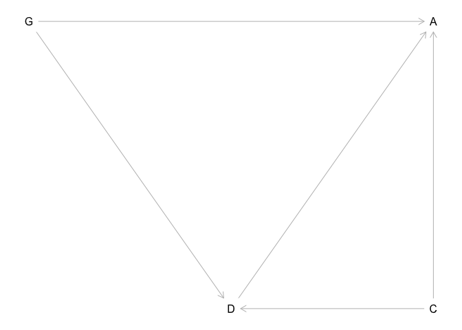

```r
library(rethinking)
```

```
## Loading required package: rstan
```

```
## Loading required package: StanHeaders
```

```
## Loading required package: ggplot2
```

```
## rstan (Version 2.19.2, GitRev: 2e1f913d3ca3)
```

```
## For execution on a local, multicore CPU with excess RAM we recommend calling
## options(mc.cores = parallel::detectCores()).
## To avoid recompilation of unchanged Stan programs, we recommend calling
## rstan_options(auto_write = TRUE)
```

```
## Loading required package: parallel
```

```
## Loading required package: dagitty
```

```
## rethinking (Version 1.90)
```

```r
library(tidyverse)
```

```
## ── Attaching packages ─────────────────────── tidyverse 1.2.1 ──
```

```
## ✔ tibble  2.1.3     ✔ purrr   0.3.2
## ✔ tidyr   1.0.0     ✔ dplyr   0.8.3
## ✔ readr   1.3.1     ✔ stringr 1.4.0
## ✔ tibble  2.1.3     ✔ forcats 0.4.0
```

```
## ── Conflicts ────────────────────────── tidyverse_conflicts() ──
## ✖ tidyr::extract() masks rstan::extract()
## ✖ dplyr::filter()  masks stats::filter()
## ✖ dplyr::lag()     masks stats::lag()
## ✖ purrr::map()     masks rethinking::map()
```

0E1
10E2
10E3
10M1
 
Problems 1 and 2 at https://github.com/rmcelreath/statrethinking_winter2019/blob/master/homework/week06.pdf

## 10E1
_If an event has probability 0.35, what are the log-odds of this event?_


```r
logit(.35)
```

```
## [1] -0.6190392
```

```r
log(.35/.65)
```

```
## [1] -0.6190392
```

## 10E2
_If an event has log-odds 3.2, what is the probability of this event?_

```r
inv_logit(3.2)
```

```
## [1] 0.9608343
```

```r
exp(3.2) / (1+exp(3.2)) # algebra works!
```

```
## [1] 0.9608343
```

## 10E3
_Suppose that a coefficient in a logistic regression has value 1.7. What does this imply about the proportional change in odds of the outcome?_

The increases the probability of the event by 70%

## 10M1
_Asexplainedinthechapter,binomialdatacanbeorganizedinaggregatedanddisaggregated forms, without any impact on inference. But the likelihood of the data does change when the data are converted between the two formats. Can you explain why?_

extra parameter blah blah

## PDF 1

_The data in data(NWOGrants) are outcomes for scientific funding applications for the Netherlands Organization for Scientific Research (NWO) from 2010–2012 (see van der Lee and Ellemers doi:10.1073/pnas.1510159112). These data have a very similar structure to the UCBAdmit data discussed in Chapter 11. I want you to consider a similar question: What are the total and indirect causal effects of gender on grant awards? Consider a mediation path (a pipe) through dis- cipline. Draw the corresponding DAG and then use one or more binomial GLMs to answer the question. What is your causal interpretation? If NWO’s goal is to equalize rates of funding between the genders, what type of intervention would be most effective?_


```r
g <- dagitty("dag{
  G -> A;
  G -> D;
  D -> A
}")
coordinates(g) <- list(x=c(G=0, D=1, A=2),
                       y=c(G=0, D=1, A=0))
plot(g)
```

<!-- -->


```r
data("NWOGrants")
NWOGrants
```

```
##             discipline gender applications awards
## 1    Chemical sciences      m           83     22
## 2    Chemical sciences      f           39     10
## 3    Physical sciences      m          135     26
## 4    Physical sciences      f           39      9
## 5              Physics      m           67     18
## 6              Physics      f            9      2
## 7           Humanities      m          230     33
## 8           Humanities      f          166     32
## 9   Technical sciences      m          189     30
## 10  Technical sciences      f           62     13
## 11   Interdisciplinary      m          105     12
## 12   Interdisciplinary      f           78     17
## 13 Earth/life sciences      m          156     38
## 14 Earth/life sciences      f          126     18
## 15     Social sciences      m          425     65
## 16     Social sciences      f          409     47
## 17    Medical sciences      m          245     46
## 18    Medical sciences      f          260     29
```

plot it

```r
NWOGrants %>% 
  mutate(success=awards/applications) %>%
  ggplot(aes(x=discipline, y=success, color=gender, size=applications)) +
  geom_point() +
  theme(axis.text.x = element_text(angle=90, hjust = 1, vjust=0.5))
```

<!-- -->

overall difference, irrespective of field

```r
d1 <- with(NWOGrants, list(g=ifelse(gender=="m",1,2),
                           applications=applications,
                           awards=awards))

m11.1 <- ulam(
  alist(awards ~ dbinom(applications, p),
        logit(p) <- a[g],
        a[g] ~ dnorm(0,1.5)),
  data=d1,
  chains = 4,
  cores = 4)
```

this is on the logit scale

```r
precis(m11.1, depth=2)
```

```
##           mean         sd      5.5%     94.5%    n_eff      Rhat
## a[1] -1.532679 0.06871169 -1.645225 -1.421099 1409.711 0.9996175
## a[2] -1.740891 0.07966791 -1.871595 -1.619135 1312.361 1.0003066
```

look at differences in award rate

```r
post <- extract.samples(m11.1) 

# relative scale
precis(data.frame(rel_dif=exp(post$a[,2]-post$a[,1])))
```

```
##              mean         sd      5.5%     94.5%     histogram
## rel_dif 0.8167873 0.08855236 0.6817527 0.9679423 ▁▁▂▅▇▇▅▃▂▁▁▁▁
```

```r
#absolute scale
precis(data.frame(prob_dif=inv_logit(post$a[,2])-inv_logit(post$a[,1])))
```

```
##                 mean         sd        5.5%        94.5%   histogram
## prob_dif -0.02834245 0.01461199 -0.05186551 -0.004513955 ▁▁▁▃▇▇▅▂▁▁▁
```
Women are 82% as likely to receive an award, translating to a reduced success rate of 3% 


## now fit a model that has a separate probability for each discipline


```r
d2 <- with(NWOGrants, list(g=ifelse(gender=="m",1,2),
                           applications=applications,
                           awards=awards, 
                           discipline=rep(1:9, each=2)))

m11.2 <- ulam(
  alist(awards ~ dbinom(applications, p),
        logit(p) <- a[g] + b[discipline],
        a[g] ~ dnorm(0,1.5),
        b[discipline] ~ dnorm(0,1.5)),
  data=d2,
  iter=2000,
  chains = 4,
  cores = 4)
```

```
## Warning: Bulk Effective Samples Size (ESS) is too low, indicating posterior means and medians may be unreliable.
## Running the chains for more iterations may help. See
## http://mc-stan.org/misc/warnings.html#bulk-ess
```

```
## Warning: Tail Effective Samples Size (ESS) is too low, indicating posterior variances and tail quantiles may be unreliable.
## Running the chains for more iterations may help. See
## http://mc-stan.org/misc/warnings.html#tail-ess
```


```r
pairs(m11.2)
```

<!-- -->

```r
precis(m11.2, depth=2)
```

```
##            mean        sd       5.5%       94.5%    n_eff     Rhat
## a[1] -1.1799746 0.4344601 -1.8770771 -0.48425332 378.6362 1.003600
## a[2] -1.3166312 0.4385052 -2.0215375 -0.60961492 381.6403 1.003490
## b[1]  0.1738457 0.4689596 -0.5849698  0.91074142 433.3348 1.002538
## b[2] -0.1794648 0.4653011 -0.9075433  0.56397210 429.4097 1.002857
## b[3]  0.1493917 0.4985336 -0.6302835  0.92326054 481.4595 1.002510
## b[4] -0.3947987 0.4477519 -1.1122762  0.32092452 409.8582 1.002352
## b[5] -0.3702200 0.4634629 -1.1181954  0.36500289 423.2006 1.002662
## b[6] -0.4364035 0.4698383 -1.1815193  0.31216336 450.1248 1.003423
## b[7] -0.1614149 0.4550916 -0.8931903  0.55504236 405.1279 1.003429
## b[8] -0.6210736 0.4412022 -1.3280972  0.08585875 385.4066 1.002619
## b[9] -0.5021150 0.4472757 -1.2055486  0.20662712 397.0646 1.003087
```

so much correlation.  Try not indexing gender. I this parameterization each discipline coefficient will be the rate for males in that discipline and then the gender coefficient will be the difference for females.


```r
d3 <- with(NWOGrants, list(g=ifelse(gender=="m",0,1),
                           applications=applications,
                           awards=awards, 
                           discipline=rep(1:9, each=2)))

m11.3 <- ulam(
  alist(awards ~ dbinom(applications, p),
        logit(p) <-  a[discipline] + b_female*g,
        a[discipline] ~ dnorm(0,1.5),
        b_female ~dnorm(0,1.5)),
  data=d3,
  iter=2000,
  chains = 4,
  cores = 4)
```


```r
precis(m11.3, depth=2)
```

```
##                mean        sd       5.5%        94.5%    n_eff      Rhat
## a[1]     -0.9714310 0.2069315 -1.3041703 -0.642469740 4121.808 1.0002567
## a[2]     -1.3332420 0.1893093 -1.6492711 -1.037904147 4898.578 1.0010745
## a[3]     -0.9898049 0.2531038 -1.3940600 -0.590124130 4507.534 0.9993567
## a[4]     -1.5525861 0.1401893 -1.7859887 -1.334195580 3861.468 1.0002996
## a[5]     -1.5254762 0.1692735 -1.8022675 -1.262271514 4353.998 0.9993365
## a[6]     -1.5825114 0.2061248 -1.9234666 -1.259614982 4213.837 0.9999399
## a[7]     -1.3146602 0.1548397 -1.5682385 -1.071873366 3868.969 0.9998030
## a[8]     -1.7825080 0.1124282 -1.9678963 -1.603402116 3592.857 1.0000764
## a[9]     -1.6581413 0.1368683 -1.8798599 -1.441832155 4205.801 0.9998777
## b_female -0.1658278 0.1063955 -0.3347896  0.002285212 3045.269 1.0000913
```

```r
pairs(m11.3)
```

<!-- -->
This looks much better.

look at differences in award rate.

On relative scale

```r
post <- extract.samples(m11.3, pars="b_female") 

# relative  and absolute scale
precis(list(rel_female=exp(post$b_female)))
```

```
##                 mean         sd      5.5%    94.5%       histogram
## rel_female 0.8519962 0.09078363 0.7154886 1.002288 ▁▁▁▃▅▇▇▅▃▁▁▁▁▁▁
```

So women are 86% as likely to get an award, but the 89% condidence intervals cross 1

For the absolute scale I think it will probably be easier to use link


```r
# the difference between men and women will be the same for all disciplines using this model, so just get one of them.
newdat <- data.frame(g=0:1, 
                     discipline=1)
newdat
```

```
##   g discipline
## 1 0          1
## 2 1          1
```

```r
pred <- link(m11.3, data = newdat)
head(pred)
```

```
##           [,1]      [,2]
## [1,] 0.2536624 0.2169049
## [2,] 0.2849082 0.2056766
## [3,] 0.3221801 0.2912310
## [4,] 0.3328976 0.2833800
## [5,] 0.2761595 0.2254372
## [6,] 0.2806139 0.2601893
```


```r
precis(list(abs_female=pred[,2] - pred[,1]))
```

```
##                   mean         sd        5.5%        94.5% histogram
## abs_female -0.03141938 0.02023512 -0.06340139 0.0003938052 ▁▁▁▅▇▅▁▁▁
```

Women do 3% worse when accounting for overall differences in award rate between departments, although confidence interval touches 0

Can I do this from posterior directly?


```r
post <- extract.samples(m11.3)
str(post)
```

```
## List of 2
##  $ a       : num [1:4000, 1:9] -1.079 -0.92 -0.744 -0.695 -0.964 ...
##  $ b_female: num [1:4000(1d)] -0.205 -0.431 -0.146 -0.233 -0.271 ...
##  - attr(*, "source")= chr "ulam posterior: 4000 samples from m11.3"
```

```r
# again I should just be able to look at one discipline
precis(list(abd_female=inv_logit(post$a[,1]) -inv_logit(post$a[,1]-post$b_female)))
```

```
##                   mean         sd        5.5%        94.5% histogram
## abd_female -0.03473431 0.02312083 -0.07275271 0.0003932943  ▁▁▂▅▇▅▁▁
```

Overall I do see a reduction in award rates to women.  When we consider discipline than the signficance of this drops, but I wonder if there is still something going on...

## 11.2

_2. Suppose that the NWO Grants sample has an unobserved confound that influences both choice of discipline and the probability of an award. One example of such a confound could be the career stage of each applicant. Suppose that in some disciplines, junior scholars apply for most of the grants. In other disciplines, scholars from all career stages compete. As a result, career stage influences discipline as well as the probability of being awarded a grant. Add these influences to your DAG from Problem 1. What happens now when you condition on discipline? Does it provide an un-confounded estimate of the direct path from gender to an award? Why or why not? Justify your answer with the back-door criterion. Hint: This is structurally a lot like the grandparents-parentschildren-neighborhoods example from a previous week. If you have trouble thinking this though, try simulating fake data, assuming your DAG is true. Then analyze it using the model from Problem 1. What do you conclude? Is it possible for gender to have a real direct causal influence but for a regression conditioning on both gender and discipline to suggest zero influence?_


```r
g <- dagitty("dag{
  G -> A;
  G -> D;
  D -> A;
  C -> A;
  C -> D;
}")
coordinates(g) <- list(x=c(G=0, D=1, A=2, C=2),
                       y=c(G=0, D=1, A=0, C=1))
plot(g)
```

<!-- -->

So if this is the DAG, the regression model from 1 closes the D->A, but leaves a back door from D through C to A?
