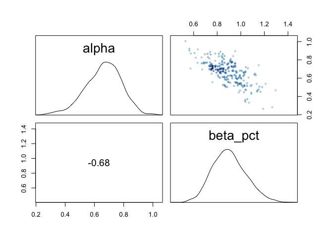

```r
library(rethinking)
```

```
## Loading required package: rstan
```

```
## Loading required package: StanHeaders
```

```
## Loading required package: ggplot2
```

```
## rstan (Version 2.19.2, GitRev: 2e1f913d3ca3)
```

```
## For execution on a local, multicore CPU with excess RAM we recommend calling
## options(mc.cores = parallel::detectCores()).
## To avoid recompilation of unchanged Stan programs, we recommend calling
## rstan_options(auto_write = TRUE)
```

```
## Loading required package: parallel
```

```
## Loading required package: dagitty
```

```
## rethinking (Version 1.91)
```

```
## 
## Attaching package: 'rethinking'
```

```
## The following object is masked from 'package:stats':
## 
##     rstudent
```

```r
library(tidyverse)
```

```
## ── Attaching packages ─────────────────────────────────────────────────────── tidyverse 1.2.1 ──
```

```
## ✔ tibble  2.1.3     ✔ purrr   0.3.2
## ✔ tidyr   1.0.0     ✔ dplyr   0.8.3
## ✔ readr   1.3.1     ✔ stringr 1.4.0
## ✔ tibble  2.1.3     ✔ forcats 0.4.0
```

```
## ── Conflicts ────────────────────────────────────────────────────────── tidyverse_conflicts() ──
## ✖ tidyr::extract() masks rstan::extract()
## ✖ dplyr::filter()  masks stats::filter()
## ✖ dplyr::lag()     masks stats::lag()
## ✖ purrr::map()     masks rethinking::map()
```

0E1
10E2
10E3
10M1
 
Problems 1 and 2 at https://github.com/rmcelreath/statrethinking_winter2019/blob/master/homework/week06.pdf

## 10E1
_If an event has probability 0.35, what are the log-odds of this event?_


```r
logit(.35)
```

```
## [1] -0.6190392
```

```r
log(.35/.65)
```

```
## [1] -0.6190392
```

## 10E2
_If an event has log-odds 3.2, what is the probability of this event?_

```r
inv_logit(3.2)
```

```
## [1] 0.9608343
```

```r
exp(3.2) / (1+exp(3.2)) # algebra works!
```

```
## [1] 0.9608343
```

## 10E3
_Suppose that a coefficient in a logistic regression has value 1.7. What does this imply about the proportional change in odds of the outcome?_

The increases the probability of the event by 70%

## 10M1
_Asexplainedinthechapter,binomialdatacanbeorganizedinaggregatedanddisaggregated forms, without any impact on inference. But the likelihood of the data does change when the data are converted between the two formats. Can you explain why?_

extra parameter blah blah

## PDF 1

_The data in data(NWOGrants) are outcomes for scientific funding applications for the Netherlands Organization for Scientific Research (NWO) from 2010–2012 (see van der Lee and Ellemers doi:10.1073/pnas.1510159112). These data have a very similar structure to the UCBAdmit data discussed in Chapter 11. I want you to consider a similar question: What are the total and indirect causal effects of gender on grant awards? Consider a mediation path (a pipe) through dis- cipline. Draw the corresponding DAG and then use one or more binomial GLMs to answer the question. What is your causal interpretation? If NWO’s goal is to equalize rates of funding between the genders, what type of intervention would be most effective?_


```r
g <- dagitty("dag{
  G -> A;
  G -> D;
  D -> A
}")
coordinates(g) <- list(x=c(G=0, D=1, A=2),
                       y=c(G=0, D=1, A=0))
plot(g)
```

<!-- -->


```r
data("NWOGrants")
NWOGrants
```

```
##             discipline gender applications awards
## 1    Chemical sciences      m           83     22
## 2    Chemical sciences      f           39     10
## 3    Physical sciences      m          135     26
## 4    Physical sciences      f           39      9
## 5              Physics      m           67     18
## 6              Physics      f            9      2
## 7           Humanities      m          230     33
## 8           Humanities      f          166     32
## 9   Technical sciences      m          189     30
## 10  Technical sciences      f           62     13
## 11   Interdisciplinary      m          105     12
## 12   Interdisciplinary      f           78     17
## 13 Earth/life sciences      m          156     38
## 14 Earth/life sciences      f          126     18
## 15     Social sciences      m          425     65
## 16     Social sciences      f          409     47
## 17    Medical sciences      m          245     46
## 18    Medical sciences      f          260     29
```

plot it

```r
NWOGrants %>% 
  mutate(success=awards/applications) %>%
  ggplot(aes(x=discipline, y=success, color=gender, size=applications)) +
  geom_point() +
  theme(axis.text.x = element_text(angle=90, hjust = 1, vjust=0.5))
```

<!-- -->

overall difference, irrespective of field

```r
d1 <- with(NWOGrants, list(g=ifelse(gender=="m",1,2),
                           applications=applications,
                           awards=awards))

m11.1 <- ulam(
  alist(awards ~ dbinom(applications, p),
        logit(p) <- a[g],
        a[g] ~ dnorm(0,1.5)),
  data=d1,
  chains = 4,
  cores = 4)
```

this is on the logit scale

```r
precis(m11.1, depth=2)
```

```
##           mean         sd      5.5%     94.5%    n_eff     Rhat
## a[1] -1.533131 0.06559237 -1.638790 -1.428745 1440.882 1.000265
## a[2] -1.738305 0.08152185 -1.868813 -1.613970 1099.181 1.003201
```

look at differences in award rate

```r
post <- extract.samples(m11.1) 

# relative scale
precis(data.frame(rel_dif=exp(post$a[,2]-post$a[,1])))
```

```
##              mean         sd      5.5%     94.5%      histogram
## rel_dif 0.8191643 0.08738091 0.6815548 0.9625164 ▁▁▁▂▅▇▇▅▃▂▁▁▁▁
```

```r
#absolute scale
precis(data.frame(prob_dif=inv_logit(post$a[,2])-inv_logit(post$a[,1])))
```

```
##                 mean        sd        5.5%        94.5%    histogram
## prob_dif -0.02791429 0.0144386 -0.05186246 -0.005205244 ▁▁▁▂▃▇▇▅▂▁▁▁
```
Women are 82% as likely to receive an award, translating to a reduced success rate of 3% 


## now fit a model that has a separate probability for each discipline


```r
d2 <- with(NWOGrants, list(g=ifelse(gender=="m",1,2),
                           applications=applications,
                           awards=awards, 
                           discipline=rep(1:9, each=2)))

m11.2 <- ulam(
  alist(awards ~ dbinom(applications, p),
        logit(p) <- a[g] + b[discipline],
        a[g] ~ dnorm(0,1.5),
        b[discipline] ~ dnorm(0,1.5)),
  data=d2,
  iter=2000,
  chains = 4,
  cores = 4)
```

```
## Warning: Bulk Effective Samples Size (ESS) is too low, indicating posterior means and medians may be unreliable.
## Running the chains for more iterations may help. See
## http://mc-stan.org/misc/warnings.html#bulk-ess
```


```r
pairs(m11.2)
```

<!-- -->

```r
precis(m11.2, depth=2)
```

```
##            mean        sd       5.5%       94.5%    n_eff     Rhat
## a[1] -1.1825746 0.4239700 -1.8704975 -0.52937921 340.0589 1.020197
## a[2] -1.3203440 0.4272540 -2.0223038 -0.65913417 339.0495 1.020394
## b[1]  0.1760827 0.4604972 -0.5401124  0.92121789 414.1415 1.017360
## b[2] -0.1700718 0.4524807 -0.8674796  0.55378179 394.5159 1.019616
## b[3]  0.1534734 0.4778361 -0.6176523  0.91226111 430.8565 1.016865
## b[4] -0.3926756 0.4388993 -1.0806526  0.32295951 359.9497 1.018252
## b[5] -0.3643402 0.4496338 -1.0477412  0.37660356 388.3981 1.016933
## b[6] -0.4382881 0.4552029 -1.1540325  0.31466633 401.3221 1.016106
## b[7] -0.1597480 0.4395104 -0.8523639  0.54828683 364.0044 1.019167
## b[8] -0.6183808 0.4290950 -1.2835826  0.08575244 359.9202 1.019228
## b[9] -0.4974024 0.4371562 -1.1759970  0.21531089 362.0293 1.018871
```

so much correlation.  Try not indexing gender. I this parameterization each discipline coefficient will be the rate for males in that discipline and then the gender coefficient will be the difference for females.


```r
d3 <- with(NWOGrants, list(g=ifelse(gender=="m",0,1),
                           applications=applications,
                           awards=awards, 
                           discipline=rep(1:9, each=2)))

m11.3 <- ulam(
  alist(awards ~ dbinom(applications, p),
        logit(p) <-  a[discipline] + b_female*g,
        a[discipline] ~ dnorm(0,1.5),
        b_female ~dnorm(0,1.5)),
  data=d3,
  iter=2000,
  chains = 4,
  cores = 4)
```


```r
precis(m11.3, depth=2)
```

```
##                mean        sd       5.5%        94.5%    n_eff      Rhat
## a[1]     -0.9736482 0.2080045 -1.3081169 -0.651800111 4698.831 0.9994190
## a[2]     -1.3388463 0.1921643 -1.6442239 -1.041952119 3549.126 1.0004529
## a[3]     -0.9944208 0.2568241 -1.4237850 -0.604119751 4021.370 0.9997464
## a[4]     -1.5574747 0.1411539 -1.7826887 -1.336654357 3859.406 1.0003105
## a[5]     -1.5266089 0.1675932 -1.7937296 -1.267133572 4028.884 0.9997316
## a[6]     -1.5881197 0.2030508 -1.9237939 -1.274933956 4222.900 0.9996687
## a[7]     -1.3169496 0.1535972 -1.5659364 -1.076523040 4427.189 1.0003681
## a[8]     -1.7807919 0.1146798 -1.9625411 -1.597677588 3336.875 0.9997481
## a[9]     -1.6586013 0.1338802 -1.8718784 -1.443767734 3779.574 0.9999601
## b_female -0.1628051 0.1061859 -0.3292261  0.004153869 2560.235 0.9997797
```

```r
pairs(m11.3)
```

<!-- -->
This looks much better.

look at differences in award rate.

On relative scale

```r
post <- extract.samples(m11.3, pars="b_female") 

# relative  and absolute scale
precis(list(rel_female=exp(post$b_female)))
```

```
##                 mean         sd      5.5%    94.5% histogram
## rel_female 0.8545545 0.09083796 0.7194803 1.004163  ▁▁▅▇▃▁▁▁
```

So women are 86% as likely to get an award, but the 89% condidence intervals cross 1

For the absolute scale I think it will probably be easier to use link


```r
# the difference between men and women will be the same for all disciplines using this model, so just get one of them.
newdat <- data.frame(g=0:1, 
                     discipline=1)
newdat
```

```
##   g discipline
## 1 0          1
## 2 1          1
```

```r
pred <- link(m11.3, data = newdat)
head(pred)
```

```
##           [,1]      [,2]
## [1,] 0.2920435 0.2816299
## [2,] 0.3371825 0.2579096
## [3,] 0.1763112 0.1498775
## [4,] 0.2607554 0.2190191
## [5,] 0.2591796 0.2341054
## [6,] 0.2779758 0.2878934
```


```r
precis(list(abs_female=pred[,2] - pred[,1]))
```

```
##                   mean         sd        5.5%        94.5% histogram
## abs_female -0.03081056 0.02023053 -0.06356217 0.0008070204 ▁▁▁▅▇▅▁▁▁
```

Women do 3% worse when accounting for overall differences in award rate between departments, although confidence interval touches 0

Can I do this from posterior directly?


```r
post <- extract.samples(m11.3)
str(post)
```

```
## List of 2
##  $ a       : num [1:4000, 1:9] -0.885 -0.676 -1.542 -1.042 -1.05 ...
##  $ b_female: num [1:4000(1d)] -0.0509 -0.381 -0.194 -0.2293 -0.135 ...
##  - attr(*, "source")= chr "ulam posterior: 4000 samples from m11.3"
```

```r
# again I should just be able to look at one discipline
precis(list(abd_female=inv_logit(post$a[,1]) -inv_logit(post$a[,1]-post$b_female)))
```

```
##                   mean        sd        5.5%        94.5%  histogram
## abd_female -0.03404281 0.0230909 -0.07257963 0.0008042333 ▁▁▁▂▇▇▅▁▁▁
```

Overall I do see a reduction in award rates to women.  When we consider discipline than the signficance of this drops, but I wonder if there is still something going on...

interaction?


```r
m11.4 <- ulam(
  alist(awards ~ dbinom(applications, p),
        logit(p) <-  a[discipline] + b_female*g + inter[discipline]*g,
        a[discipline] ~ dnorm(0,1.5),
        b_female ~dnorm(0,1.5),
        inter[discipline] ~ dnorm(0,.5)),
  data=d3,
  iter=2000,
  chains = 4,
  cores = 4)
```


```r
precis(m11.4, depth=2)
```

```
##                  mean        sd        5.5%         94.5%    n_eff
## a[1]     -1.005235451 0.2334656 -1.37868188 -6.371349e-01 4950.878
## a[2]     -1.387990604 0.2071818 -1.73136391 -1.058003e+00 5352.125
## a[3]     -0.999113524 0.2629141 -1.42073120 -5.853709e-01 6456.707
## a[4]     -1.724799409 0.1747106 -2.01032430 -1.451702e+00 4513.258
## a[5]     -1.609926286 0.1800599 -1.90613810 -1.324240e+00 5987.652
## a[6]     -1.837411402 0.2630587 -2.25516336 -1.422757e+00 4947.343
## a[7]     -1.180502173 0.1821395 -1.47041391 -8.941985e-01 5460.013
## a[8]     -1.721037672 0.1325153 -1.93760575 -1.513675e+00 5613.097
## a[9]     -1.501301272 0.1586930 -1.75489476 -1.250443e+00 4943.170
## b_female -0.083664522 0.1956140 -0.40030551  2.293011e-01 2110.348
## inter[1]  0.006190538 0.3468657 -0.55117685  5.604706e-01 4857.297
## inter[2]  0.149151798 0.3470073 -0.41313158  6.987226e-01 4605.030
## inter[3] -0.074039259 0.4311017 -0.74509961  6.135934e-01 6901.439
## inter[4]  0.321824188 0.2847153 -0.13176673  7.781496e-01 2854.301
## inter[5]  0.243813560 0.3268970 -0.28431860  7.612295e-01 3798.050
## inter[6]  0.466169903 0.3351089 -0.07132541  1.000248e+00 3983.267
## inter[7] -0.434955612 0.3049355 -0.93422562  3.213935e-02 3560.663
## inter[8] -0.220775498 0.2528911 -0.61809635  1.797720e-01 2719.986
## inter[9] -0.437437018 0.2781242 -0.88280118 -6.568688e-05 2978.547
##               Rhat
## a[1]     0.9999556
## a[2]     0.9997086
## a[3]     0.9994802
## a[4]     1.0005715
## a[5]     0.9994349
## a[6]     0.9997908
## a[7]     1.0005464
## a[8]     0.9994439
## a[9]     0.9998540
## b_female 0.9998151
## inter[1] 1.0000392
## inter[2] 0.9998971
## inter[3] 0.9992344
## inter[4] 1.0007055
## inter[5] 0.9997749
## inter[6] 0.9995702
## inter[7] 0.9998360
## inter[8] 1.0003995
## inter[9] 0.9991674
```


```r
plot(precis(m11.4, depth=2))
```

<!-- -->


## 11.2

_2. Suppose that the NWO Grants sample has an unobserved confound that influences both choice of discipline and the probability of an award. One example of such a confound could be the career stage of each applicant. Suppose that in some disciplines, junior scholars apply for most of the grants. In other disciplines, scholars from all career stages compete. As a result, career stage influences discipline as well as the probability of being awarded a grant. Add these influences to your DAG from Problem 1. What happens now when you condition on discipline? Does it provide an un-confounded estimate of the direct path from gender to an award? Why or why not? Justify your answer with the back-door criterion. Hint: This is structurally a lot like the grandparents-parentschildren-neighborhoods example from a previous week. If you have trouble thinking this though, try simulating fake data, assuming your DAG is true. Then analyze it using the model from Problem 1. What do you conclude? Is it possible for gender to have a real direct causal influence but for a regression conditioning on both gender and discipline to suggest zero influence?_


```r
g <- dagitty("dag{
  G -> A;
  G -> D;
  D -> A;
  C -> A;
  C -> D;
}")
coordinates(g) <- list(x=c(G=0, D=1, A=2, C=2),
                       y=c(G=0, D=1, A=0, C=1))
plot(g)
```

<!-- -->

So if this is the DAG, the regression model from 1 closes the D->A, but leaves a back door from D through C to A?

# Chapter 11.2 problems

## 10E4
_Why do Poisson regressions sometimes require the use of an offset? Provide an example._

If the data have been collected (events counted) over different sampling times/ distances (exposures) we need an offset to account for this.  For example, we want to compare transposition events across the genome.  One group counted number of transposons per 100KB and the other per 1MB.

## 10M2
_If a coefficient in a Poisson regression has value 1.7, what does this imply about the change in the outcome?_

For every unit change in the predictor there will be a 5.47-fold (e^1.7) increase  in the number of counts 


```r
exp(1)
```

```
## [1] 2.718282
```

```r
exp(1+1.7)
```

```
## [1] 14.87973
```

```r
exp(1+1.7+1.7)
```

```
## [1] 81.45087
```

```r
exp(1)^1.7
```

```
## [1] 5.473947
```

## 10M3
_Explain why the logit link is appropriate for a binomial generalized linear model._

We need to transform the linear model to return a value between 0 and 1 (i.e. the probability scale)

## 10M4
_Explain why the log link is appropriate for a Poisson generalized linear model._

This keeps the outcome variable on a positive scale, required for count data.  You cannot have negative counts.  

(OK but this is true for so much stuff that we model with linear models and Gaussian distributions...)

## 10H4

_The data contained in data(salamanders) are counts of salamanders (Plethodon elongatus) from 47 different 49-m2 plots in northern California.  The column SALAMAN is the count in each plot, and the columns PCTCOVER and FORESTAGE are percent of ground cover and age of trees in the plot, respectively. You will model SALAMAN as a Poisson variable._

_(a) Model the relationship between density and percent cover, using a log-link (same as the example in the book and lecture). Use weakly informative priors of your choosing. Check the quadratic approximation again, by comparing map to map2stan. Then plot the expected counts and their 89% interval against percent cover. In which ways does the model do a good job? In which ways does it do a bad job?_


```r
data("salamanders")
salamanders
```

```
##    SITE SALAMAN PCTCOVER FORESTAGE
## 1     1      13       85       316
## 2     2      11       86        88
## 3     3      11       90       548
## 4     4       9       88        64
## 5     5       8       89        43
## 6     6       7       83       368
## 7     7       6       83       200
## 8     8       6       91        71
## 9     9       5       88        42
## 10   10       5       90       551
## 11   11       4       87       675
## 12   12       3       83       217
## 13   13       3       87       212
## 14   14       3       89       398
## 15   15       3       92       357
## 16   16       3       93       478
## 17   17       2        2         5
## 18   18       2       87        30
## 19   19       2       93       551
## 20   20       1        7         3
## 21   21       1       16        15
## 22   22       1       19        31
## 23   23       1       29        10
## 24   24       1       34        49
## 25   25       1       46        30
## 26   26       1       80       215
## 27   27       1       86       586
## 28   28       1       88       105
## 29   29       1       92       210
## 30   30       0        0         0
## 31   31       0        1         4
## 32   32       0        3         3
## 33   33       0        5         2
## 34   34       0        8        10
## 35   35       0        9         8
## 36   36       0       11         6
## 37   37       0       14        49
## 38   38       0       17        29
## 39   39       0       24        57
## 40   40       0       44        59
## 41   41       0       52        78
## 42   42       0       77        50
## 43   43       0       78       320
## 44   44       0       80       411
## 45   45       0       86       133
## 46   46       0       89        60
## 47   47       0       91       187
```


```r
library(GGally)
```

```
## Registered S3 method overwritten by 'GGally':
##   method from   
##   +.gg   ggplot2
```

```
## 
## Attaching package: 'GGally'
```

```
## The following object is masked from 'package:dplyr':
## 
##     nasa
```

```r
salamanders %>% select(SALAMAN, PCTCOVER, FORESTAGE) %>% ggpairs()
```

<!-- -->


```r
salamanders$pctcover_std <- scale(salamanders$PCTCOVER)
m10h4.1.quap <- quap(
  alist(SALAMAN ~ dpois(lambda),
        log(lambda) <- alpha + beta_pct*pctcover_std,
        alpha ~ dnorm(3, 0.5),
        beta_pct ~ dnorm(0, 0.2)),
  data=salamanders)
```


```r
precis(m10h4.1.quap)
```

```
##               mean        sd      5.5%     94.5%
## alpha    0.7997915 0.1014376 0.6376746 0.9619083
## beta_pct 0.6535256 0.1064780 0.4833533 0.8236980
```


```r
m10h4.1.stan <- ulam(
  alist(SALAMAN ~ dpois(lambda),
        log(lambda) <- alpha + beta_pct*pctcover_std,
        alpha ~ dnorm(3, 0.5),
        beta_pct ~ dnorm(0, 0.5)),
  chains=4,
  cores=4,
  data=salamanders,
  log_lik = TRUE)
```

```r
precis(m10h4.1.quap)
```

```
##               mean        sd      5.5%     94.5%
## alpha    0.7997915 0.1014376 0.6376746 0.9619083
## beta_pct 0.6535256 0.1064780 0.4833533 0.8236980
```


```r
precis(m10h4.1.stan)
```

```
##               mean        sd      5.5%     94.5%    n_eff     Rhat
## alpha    0.6590881 0.1164568 0.4679335 0.8404691 832.2551 1.004191
## beta_pct 0.8998101 0.1403850 0.6756486 1.1272866 767.9772 1.007390
```

somewhat similar


```r
pairs(m10h4.1.stan)
```

<!-- -->

```r
trankplot(m10h4.1.stan)
traceplot(m10h4.1.stan)
```

<!-- --><!-- -->

plot observed and expected

```r
pred <- link(m10h4.1.stan)
pred_obs <- as_tibble(cbind(
  salamanders,
  mu=colMeans(pred),
  low.89=apply(pred,2,HPDI)[1,],
  high.89=apply(pred, 2, HPDI)[2,]))
pred_obs
```

```
## # A tibble: 47 x 8
##     SITE SALAMAN PCTCOVER FORESTAGE pctcover_std[,1]    mu low.89 high.89
##    <int>   <int>    <int>     <int>            <dbl> <dbl>  <dbl>   <dbl>
##  1     1      13       85       316            0.727  3.73   3.19    4.24
##  2     2      11       86        88            0.755  3.83   3.28    4.36
##  3     3      11       90       548            0.867  4.24   3.59    4.89
##  4     4       9       88        64            0.811  4.03   3.43    4.62
##  5     5       8       89        43            0.839  4.13   3.50    4.74
##  6     6       7       83       368            0.671  3.55   3.02    4.01
##  7     7       6       83       200            0.671  3.55   3.02    4.01
##  8     8       6       91        71            0.895  4.35   3.68    5.03
##  9     9       5       88        42            0.811  4.03   3.43    4.62
## 10    10       5       90       551            0.867  4.24   3.59    4.89
## # … with 37 more rows
```


```r
pred_obs %>%
  mutate(observed=SALAMAN,
         predicted=mu) %>%
  ggplot(aes(x=PCTCOVER)) +
  geom_point(aes(y=observed), color="black") +
  geom_pointrange(aes(y=predicted, ymin=low.89, ymax=high.89), color="blue")
```

<!-- -->

Lots of scatter at high PCTCOVER.


```r
pred_obs %>%
  mutate(observed=SALAMAN,
         predicted=mu) %>%
  ggplot(aes(observed,predicted)) +
  geom_point()
```

<!-- -->


_(b) Can you improve the model by using the other predictor, FORESTAGE? Try any models you think useful. Can you explain why FORESTAGE helps or does not help with prediction?_

additive model:


```r
salamanders$forestage_std <- scale(salamanders$FORESTAGE)
m10h4.2 <- ulam(
  alist(SALAMAN ~ dpois(lambda),
        log(lambda) <- alpha + beta_pct*pctcover_std + beta_f*forestage_std,
        alpha ~ dnorm(3, 0.5),
        c(beta_pct,beta_f) ~ dnorm(0, 0.5)),
  chains=4,
  cores=4,
  data=salamanders,
  log_lik = TRUE)
```


```r
precis(m10h4.2)
```

```
##                mean         sd       5.5%     94.5%    n_eff      Rhat
## alpha    0.65501556 0.11756923  0.4555913 0.8333947 844.5714 1.0047221
## beta_f   0.01835796 0.09530968 -0.1374866 0.1735507 936.7183 0.9995558
## beta_pct 0.88954517 0.15473838  0.6494090 1.1446556 789.7242 1.0011236
```


```r
pairs(m10h4.2)
```

<!-- -->

```r
trankplot(m10h4.2)
```

<!-- -->

```r
traceplot(m10h4.2)
```

<!-- -->

plot observed and expected

```r
pred <- link(m10h4.2)
pred_obs <- as_tibble(cbind(
  salamanders,
  mu=colMeans(pred),
  low.89=apply(pred,2,HPDI)[1,],
  high.89=apply(pred, 2, HPDI)[2,]))
pred_obs
```

```
## # A tibble: 47 x 9
##     SITE SALAMAN PCTCOVER FORESTAGE pctcover_std[,1] forestage_std[,…    mu
##    <int>   <int>    <int>     <int>            <dbl>            <dbl> <dbl>
##  1     1      13       85       316            0.727            0.761  3.75
##  2     2      11       86        88            0.755           -0.418  3.77
##  3     3      11       90       548            0.867            1.96   4.38
##  4     4       9       88        64            0.811           -0.542  3.96
##  5     5       8       89        43            0.839           -0.650  4.06
##  6     6       7       83       368            0.671            1.03   3.59
##  7     7       6       83       200            0.671            0.161  3.52
##  8     8       6       91        71            0.895           -0.505  4.27
##  9     9       5       88        42            0.811           -0.655  3.96
## 10    10       5       90       551            0.867            1.98   4.38
## # … with 37 more rows, and 2 more variables: low.89 <dbl>, high.89 <dbl>
```


```r
pred_obs %>%
  mutate(observed=SALAMAN,
         predicted=mu) %>%
  ggplot(aes(x=PCTCOVER)) +
  geom_point(aes(y=observed), color="black") +
  geom_pointrange(aes(y=predicted, ymin=low.89, ymax=high.89), color="blue")
```

<!-- -->


```r
compare(m10h4.1.stan, m10h4.2)
```

```
##                  WAIC    pWAIC   dWAIC   weight       SE      dSE
## m10h4.1.stan 214.9449 3.984454 0.00000 0.898256 24.66818       NA
## m10h4.2      219.3009 6.949885 4.35599 0.101744 25.40286 1.368113
```

interaction model:


```r
m10h4.3 <- ulam(
  alist(SALAMAN ~ dpois(lambda),
        log(lambda) <- alpha + 
          beta_pct*pctcover_std + 
          beta_f*forestage_std +
          beta_pct_f*pctcover_std*forestage_std,
        alpha ~ dnorm(3, 0.5),
        c(beta_pct,beta_f,beta_pct_f) ~ dnorm(0, 0.5)),
  chains=4,
  cores=4,
  data=salamanders,
  log_lik = TRUE)
```


```r
precis(m10h4.3)
```

```
##                  mean        sd        5.5%       94.5%    n_eff     Rhat
## alpha       0.9084932 0.1858158  0.60924921  1.21461887 424.5171 1.004026
## beta_pct_f -0.5061598 0.2681831 -0.95305121 -0.08990875 416.0174 1.004295
## beta_f      0.4121384 0.2257866  0.05083799  0.79064335 408.9000 1.002674
## beta_pct    0.5860730 0.2318478  0.21460524  0.95097108 417.7776 1.002151
```


```r
pairs(m10h4.3)
```

<!-- -->

```r
trankplot(m10h4.3)
traceplot(m10h4.3)
```

<!-- --><!-- -->

plot observed and expected

```r
pred <- link(m10h4.3)
pred_obs <- as_tibble(cbind(
  salamanders,
  mu=colMeans(pred),
  low.89=apply(pred,2,HPDI)[1,],
  high.89=apply(pred, 2, HPDI)[2,]))
pred_obs
```

```
## # A tibble: 47 x 9
##     SITE SALAMAN PCTCOVER FORESTAGE pctcover_std[,1] forestage_std[,…    mu
##    <int>   <int>    <int>     <int>            <dbl>            <dbl> <dbl>
##  1     1      13       85       316            0.727            0.761  3.95
##  2     2      11       86        88            0.755           -0.418  3.84
##  3     3      11       90       548            0.867            1.96   3.97
##  4     4       9       88        64            0.811           -0.542  4.03
##  5     5       8       89        43            0.839           -0.650  4.13
##  6     6       7       83       368            0.671            1.03   3.99
##  7     7       6       83       200            0.671            0.161  3.74
##  8     8       6       91        71            0.895           -0.505  4.32
##  9     9       5       88        42            0.811           -0.655  4.03
## 10    10       5       90       551            0.867            1.98   3.97
## # … with 37 more rows, and 2 more variables: low.89 <dbl>, high.89 <dbl>
```


```r
pred_obs %>%
  mutate(observed=SALAMAN,
         predicted=mu) %>%
  ggplot(aes(x=PCTCOVER)) +
  geom_point(aes(y=observed), color="black") +
  geom_pointrange(aes(y=predicted, ymin=low.89, ymax=high.89), color="blue")
```

<!-- -->


```r
compare(m10h4.1.stan, m10h4.2)
```

```
##                  WAIC    pWAIC   dWAIC   weight       SE      dSE
## m10h4.1.stan 214.9449 3.984454 0.00000 0.898256 24.66818       NA
## m10h4.2      219.3009 6.949885 4.35599 0.101744 25.40286 1.368113
```

## Week6 PDF # 3 

_The data in data(Primates301) were first introduced at the end of Chapter 7. In this problem, you will consider how brain size is associated with social learning._

_There are three parts._

_First, model the number of observations of social_learning for each species as a function of the log brain size. Use a Poisson distribution for the social_learning outcome variable. Interpret the resulting posterior._


```r
data("Primates301")
p <- Primates301 %>% 
  select(genus, species, social_learning, brain, research_effort) %>%
  mutate(l_brain_std = scale(log(brain)),
         l_research_effort_std = scale(log(research_effort)),
         gen_spec = str_c(genus, "_", species)) %>%
  na.omit() %>%
  arrange(gen_spec)

table(p$gen_spec) %>% max() #more than one row per species?  no
```

```
## [1] 1
```

```r
p
```

```
##              genus          species social_learning  brain research_effort
## 1   Allenopithecus     nigroviridis               0  58.02               6
## 2         Alouatta         belzebul               0  52.84              15
## 3         Alouatta           caraya               0  52.63              45
## 4         Alouatta          guariba               0  51.70              37
## 5         Alouatta         palliata               3  49.88              79
## 6         Alouatta            pigra               0  51.13              25
## 7         Alouatta             sara               0  59.08               4
## 8         Alouatta        seniculus               0  55.22              82
## 9            Aotus           azarai               0  20.67              22
## 10           Aotus        lemurinus               0  16.30              16
## 11           Aotus      trivirgatus               0  16.85              58
## 12      Arctocebus     calabarensis               0   6.92               1
## 13          Ateles        belzebuth               0 117.02              12
## 14          Ateles        fusciceps               0 114.24               4
## 15          Ateles        geoffroyi               2 105.09              58
## 16          Ateles         paniscus               0 103.85              30
## 17           Avahi          laniger               0   9.86              10
## 18           Avahi     occidentalis               0   7.95               6
## 19    Bunopithecus          hoolock               0 110.68              24
## 20         Cacajao           calvus               0  76.00              11
## 21         Cacajao   melanocephalus               0  68.77               8
## 22       Callimico          goeldii               0  11.43              43
## 23      Callithrix        argentata               0   7.95              16
## 24      Callithrix          jacchus               2   7.24             161
## 25      Callithrix          pygmaea               0   4.17              36
## 26           Cebus        albifrons               1  65.45              13
## 27           Cebus           apella              17  66.63             249
## 28           Cebus        capucinus               5  72.93              60
## 29           Cebus        olivaceus               0  69.84              18
## 30      Cercocebus        galeritus               0  99.07              19
## 31      Cercocebus        torquatus               1 105.99              32
## 32   Cercopithecus         ascanius               1  59.58              26
## 33   Cercopithecus        campbelli               0  57.39              11
## 34   Cercopithecus           cephus               0  65.26               8
## 35   Cercopithecus            diana               1  62.61              28
## 36   Cercopithecus       erythrotis               0  65.40               3
## 37   Cercopithecus          hamlyni               0  65.90               4
## 38   Cercopithecus          lhoesti               0  74.20               7
## 39   Cercopithecus            mitis               0  71.33              56
## 40   Cercopithecus             mona               0  61.84               8
## 41   Cercopithecus        neglectus               0  65.97              17
## 42   Cercopithecus        nictitans               0  71.13               7
## 43   Cercopithecus       petaurista               0  55.08               5
## 44   Cercopithecus         pogonias               0  59.56               8
## 45   Cercopithecus            wolfi               0  61.45               7
## 46    Cheirogaleus            major               0   5.81               3
## 47    Cheirogaleus           medius               0   2.60              13
## 48      Chiropotes          satanas               0  48.33              21
## 49     Chlorocebus         aethiops               5  65.00              91
## 50         Colobus       angolensis               0  77.70              16
## 51         Colobus          guereza               0  74.39              42
## 52         Colobus        polykomos               0  73.83              17
## 53         Colobus          satanas               0  74.90              10
## 54     Daubentonia madagascariensis               0  44.85              52
## 55    Erythrocebus            patas               2  97.73              33
## 56         Eulemur        coronatus               0  20.65              11
## 57         Eulemur           fulvus               1  25.77              81
## 58         Eulemur           macaco               0  24.51              32
## 59         Eulemur           mongoz               0  20.17              13
## 60         Eulemur      rubriventer               0  26.23              13
## 61        Euoticus      elegantulus               0   5.53               1
## 62          Galago           alleni               0   5.58               2
## 63          Galago           moholi               0   3.71              14
## 64          Galago     senegalensis               0   3.96              20
## 65      Galagoides         demidoff               0   2.65               5
## 66         Gorilla          gorilla              13 490.41             517
## 67       Hapalemur          griseus               0  14.09              40
## 68       Hapalemur            simus               0  27.14               8
## 69       Hylobates           agilis               0  91.16              16
## 70       Hylobates          klossii               0  87.99               4
## 71       Hylobates              lar               0 101.87              86
## 72       Hylobates         muelleri               0  85.13               5
## 73       Hylobates         pileatus               0  84.69              16
## 74           Indri            indri               0  34.81               8
## 75       Lagothrix       lagotricha               0  96.50              34
## 76           Lemur            catta               4  22.90             103
## 77  Leontopithecus      chrysomelas               0  11.84              46
## 78  Leontopithecus          rosalia               0  12.83              85
## 79       Lepilemur         dorsalis               0   6.70               1
## 80       Lepilemur         edwardsi               0   7.25               5
## 81       Lepilemur         leucopus               0   6.87               2
## 82       Lepilemur         microdon               0   9.75               1
## 83       Lepilemur       mustelinus               0   9.56               5
## 84       Lepilemur     ruficaudatus               0   8.25               2
## 85      Lophocebus         albigena               0  93.97              34
## 86      Lophocebus        aterrimus               0 101.59               6
## 87           Loris      tardigradus               0   5.87              14
## 88          Macaca        arctoides               1 100.70              48
## 89          Macaca       assamensis               0  90.46              17
## 90          Macaca         cyclopis               0  82.00              12
## 91          Macaca     fascicularis               7  63.98             174
## 92          Macaca          fuscata              45 102.92             253
## 93          Macaca          mulatta              15  88.98             296
## 94          Macaca       nemestrina               3 105.59              51
## 95          Macaca            nigra               0  94.90              27
## 96          Macaca          radiata               0  74.87              34
## 97          Macaca          silenus               1  85.00              48
## 98          Macaca           sinica               0  69.70              12
## 99          Macaca         sylvanus               0  93.20              67
## 100     Mandrillus      leucophaeus               0 148.00              18
## 101     Mandrillus           sphinx               3 153.88              30
## 102     Microcebus          murinus               0   1.63              66
## 103     Microcebus            rufus               0   1.72               8
## 104          Mirza        coquereli               0   5.80               3
## 105        Nasalis         larvatus               0  92.30              17
## 106       Nomascus       gabriellae               0 119.38               4
## 107     Nycticebus          coucang               0  10.13              37
## 108     Nycticebus         pygmaeus               0   7.23              19
## 109       Otolemur   crassicaudatus               1  11.78              36
## 110       Otolemur        garnettii               1  11.50              12
## 111            Pan         paniscus               5 341.29             225
## 112            Pan      troglodytes             214 363.05             755
## 113          Papio           anubis               4 167.42              43
## 114          Papio     cynocephalus               2 163.19             114
## 115          Papio        hamadryas               1 146.17              78
## 116          Papio            papio               3 142.50               8
## 117          Papio          ursinus               5 178.00              22
## 118   Perodicticus            potto               0  12.42              10
## 119   Piliocolobus           badius               0  63.59              52
## 120   Piliocolobus           kirkii               1  57.25               7
## 121       Pithecia         pithecia               0  32.26              28
## 122          Pongo         pygmaeus              86 377.38             321
## 123      Presbytis           comata               0  80.30              11
## 124      Presbytis       melalophos               0  64.85               6
## 125     Procolobus            verus               0  52.60               3
## 126    Propithecus          diadema               0  39.80              28
## 127    Propithecus        verreauxi               1  26.21              41
## 128      Pygathrix          nemaeus               0  91.41              25
## 129  Rhinopithecus        roxellana               0 117.76              36
## 130       Saguinus      fuscicollis               2   7.94              81
## 131       Saguinus         leucopus               0   9.70               3
## 132       Saguinus            midas               0   9.78              17
## 133       Saguinus           mystax               0  11.09              46
## 134       Saguinus          oedipus               0   9.76             153
## 135        Saimiri        oerstedii               1  25.07               4
## 136        Saimiri         sciureus               1  24.14              89
## 137  Semnopithecus         entellus               2 110.93              98
## 138   Symphalangus      syndactylus               0 123.50              40
## 139        Tarsius         bancanus               0   3.16               8
## 140        Tarsius         dentatus               0   3.00               2
## 141        Tarsius         syrichta               0   3.36              10
## 142  Theropithecus           gelada               0 133.33              34
## 143 Trachypithecus        cristatus               0  57.86               8
## 144 Trachypithecus             geei               0  81.30               7
## 145 Trachypithecus           johnii               1  84.60               9
## 146 Trachypithecus         obscurus               0  62.12               6
## 147 Trachypithecus          phayrei               0  72.84              16
## 148 Trachypithecus         pileatus               0 103.64               5
## 149 Trachypithecus          vetulus               0  61.29               2
## 150        Varecia        variegata               0  32.12              57
##     l_brain_std l_research_effort_std                     gen_spec
## 1    0.37259063           -0.73726892  Allenopithecus_nigroviridis
## 2    0.29771403           -0.03690129            Alouatta_belzebul
## 3    0.29452568            0.80282398              Alouatta_caraya
## 4    0.28025120            0.65320644             Alouatta_guariba
## 5    0.25155764            1.23298947            Alouatta_palliata
## 6    0.27137485            0.35354872               Alouatta_pigra
## 7    0.38708621           -1.04718654                Alouatta_sara
## 8    0.33298822            1.26147789           Alouatta_seniculus
## 9   -0.45376792            0.25583917                 Aotus_azarai
## 10  -0.64393787            0.01242878              Aotus_lemurinus
## 11  -0.61736773            0.99680134            Aotus_trivirgatus
## 12  -1.32989768           -2.10680186      Arctocebus_calabarensis
## 13   0.93429513           -0.20746126             Ateles_belzebuth
## 14   0.91504472           -1.04718654             Ateles_fusciceps
## 15   0.84820262            0.99680134             Ateles_geoffroyi
## 16   0.83869920            0.49290637              Ateles_paniscus
## 17  -1.04640979           -0.34681891                Avahi_laniger
## 18  -1.21880200           -0.73726892           Avahi_occidentalis
## 19   0.88969734            0.32234640         Bunopithecus_hoolock
## 20   0.58872363           -0.27396849               Cacajao_calvus
## 21   0.50868566           -0.51737888       Cacajao_melanocephalus
## 22  -0.92810891            0.76807477            Callimico_goeldii
## 23  -1.21880200            0.01242878         Callithrix_argentata
## 24  -1.29370377            1.77717406           Callithrix_jacchus
## 25  -1.73542873            0.63226401           Callithrix_pygmaea
## 26   0.46906841           -0.14628055              Cebus_albifrons
## 27   0.48337484            2.11046814                 Cebus_apella
## 28   0.55571005            1.02271403              Cebus_capucinus
## 29   0.52104721            0.10245635              Cebus_olivaceus
## 30   0.80097167            0.14378268         Cercocebus_galeritus
## 31   0.85503030            0.54223644         Cercocebus_torquatus
## 32   0.39383372            0.38352711       Cercopithecus_ascanius
## 33   0.36384932           -0.27396849      Cercopithecus_campbelli
## 34   0.46674075           -0.51737888         Cercopithecus_cephus
## 35   0.43355021            0.44017160          Cercopithecus_diana
## 36   0.46845652           -1.26707658     Cercopithecus_erythrotis
## 37   0.47455445           -1.04718654        Cercopithecus_hamlyni
## 38   0.56953260           -0.61944372        Cercopithecus_lhoesti
## 39   0.53794908            0.96997926          Cercopithecus_mitis
## 40   0.42364243           -0.51737888           Cercopithecus_mona
## 41   0.47540447            0.05876726      Cercopithecus_neglectus
## 42   0.53570100           -0.61944372      Cercopithecus_nictitans
## 43   0.33095574           -0.87662657     Cercopithecus_petaurista
## 44   0.39356491           -0.51737888       Cercopithecus_pogonias
## 45   0.41857704           -0.61944372          Cercopithecus_wolfi
## 46  -1.46988019           -1.26707658           Cheirogaleus_major
## 47  -2.11366137           -0.14628055          Cheirogaleus_medius
## 48   0.22628288            0.22028156           Chiropotes_satanas
## 49   0.46354452            1.34107759         Chlorocebus_aethiops
## 50   0.60643563            0.01242878           Colobus_angolensis
## 51   0.57158017            0.75008922              Colobus_guereza
## 52   0.56553013            0.05876726            Colobus_polykomos
## 53   0.57705054           -0.34681891              Colobus_satanas
## 54   0.16645089            0.91333477 Daubentonia_madagascariensis
## 55   0.79006829            0.56575679           Erythrocebus_patas
## 56  -0.45454299           -0.27396849            Eulemur_coronatus
## 57  -0.27720157            1.25209924               Eulemur_fulvus
## 58  -0.31733821            0.54223644               Eulemur_macaco
## 59  -0.47337355           -0.14628055               Eulemur_mongoz
## 60  -0.26303578           -0.14628055          Eulemur_rubriventer
## 61  -1.50942670           -2.10680186         Euoticus_elegantulus
## 62  -1.50222004           -1.57699420                Galago_alleni
## 63  -1.82901251           -0.08963606                Galago_moholi
## 64  -1.77680014            0.18298875          Galago_senegalensis
## 65  -2.09841036           -0.87662657          Galagoides_demidoff
## 66   2.08154982            2.66889523              Gorilla_gorilla
## 67  -0.76059299            0.71279641            Hapalemur_griseus
## 68  -0.23572959           -0.51737888              Hapalemur_simus
## 69   0.73434888            0.01242878             Hylobates_agilis
## 70   0.70601130           -1.04718654            Hylobates_klossii
## 71   0.82328656            1.29788243                Hylobates_lar
## 72   0.67955476           -0.87662657           Hylobates_muelleri
## 73   0.67540579            0.01242878           Hylobates_pileatus
## 74  -0.03644996           -0.51737888                  Indri_indri
## 75   0.77992755            0.58857492         Lagothrix_lagotricha
## 76  -0.37173808            1.43575734                  Lemur_catta
## 77  -0.89989214            0.81962358   Leontopithecus_chrysomelas
## 78  -0.83559758            1.28894256       Leontopithecus_rosalia
## 79  -1.35576541           -2.10680186           Lepilemur_dorsalis
## 80  -1.29259865           -0.87662657           Lepilemur_edwardsi
## 81  -1.33570375           -1.57699420           Lepilemur_leucopus
## 82  -1.05539224           -2.10680186           Lepilemur_microdon
## 83  -1.07114875           -0.87662657         Lepilemur_mustelinus
## 84  -1.18914476           -1.57699420       Lepilemur_ruficaudatus
## 85   0.75865624            0.58857492          Lophocebus_albigena
## 86   0.82108285           -0.73726892         Lophocebus_aterrimus
## 87  -1.46165422           -0.08963606            Loris_tardigradus
## 88   0.81403765            0.85215406             Macaca_arctoides
## 89   0.72817708            0.05876726            Macaca_assamensis
## 90   0.64956205           -0.20746126              Macaca_cyclopis
## 91   0.45088079            1.83652662          Macaca_fascicularis
## 92   0.83149686            2.12264929               Macaca_fuscata
## 93   0.71496938            2.24262942               Macaca_mulatta
## 94   0.85200296            0.89849254            Macaca_nemestrina
## 95   0.76654118            0.41237396                 Macaca_nigra
## 96   0.57672978            0.58857492               Macaca_radiata
## 97   0.67833116            0.85215406               Macaca_silenus
## 98   0.51944062           -0.20746126                Macaca_sinica
## 99   0.75206857            1.10705866              Macaca_sylvanus
## 100  1.12234267            0.10245635       Mandrillus_leucophaeus
## 101  1.15353680            0.49290637            Mandrillus_sphinx
## 102 -2.48751190            1.09556445           Microcebus_murinus
## 103 -2.44448133           -0.51737888             Microcebus_rufus
## 104 -1.47125944           -1.26707658              Mirza_coquereli
## 105  0.74429936            0.05876726             Nasalis_larvatus
## 106  0.95028165           -1.04718654          Nomascus_gabriellae
## 107 -1.02478000            0.65320644           Nycticebus_coucang
## 108 -1.29481041            0.14378268          Nycticebus_pygmaeus
## 109 -0.90395982            0.63226401      Otolemur_crassicaudatus
## 110 -0.92322047           -0.20746126           Otolemur_garnettii
## 111  1.79130535            2.03299927                 Pan_paniscus
## 112  1.84079218            2.95833571              Pan_troglodytes
## 113  1.22105799            0.76807477                 Papio_anubis
## 114  1.20056889            1.51331561           Papio_cynocephalus
## 115  1.11238098            1.22325238              Papio_hamadryas
## 116  1.09202168           -0.51737888                  Papio_papio
## 117  1.27012041            0.25583917                Papio_ursinus
## 118 -0.86160130           -0.34681891           Perodicticus_potto
## 119  0.44598534            0.91333477          Piliocolobus_badius
## 120  0.36189378           -0.61944372          Piliocolobus_kirkii
## 121 -0.09736102            0.44017160            Pithecia_pithecia
## 122  1.87178716            2.30460426               Pongo_pygmaeus
## 123  0.63278865           -0.27396849             Presbytis_comata
## 124  0.46169472           -0.73726892         Presbytis_melalophos
## 125  0.29406916           -1.26707658             Procolobus_verus
## 126  0.07080742            0.44017160          Propithecus_diadema
## 127 -0.26364650            0.73167023        Propithecus_verreauxi
## 128  0.73654161            0.35354872            Pygathrix_nemaeus
## 129  0.93934229            0.63226401      Rhinopithecus_roxellana
## 130 -1.21980975            1.25209924         Saguinus_fuscicollis
## 131 -1.05950872           -1.26707658            Saguinus_leucopus
## 132 -1.05293247            0.05876726               Saguinus_midas
## 133 -0.95228680            0.81962358              Saguinus_mystax
## 134 -1.05457147            1.73821781             Saguinus_oedipus
## 135 -0.29925087           -1.04718654            Saimiri_oerstedii
## 136 -0.32951695            1.32409132             Saimiri_sciureus
## 137  0.89150379            1.39772209       Semnopithecus_entellus
## 138  0.97744742            0.71279641     Symphalangus_syndactylus
## 139 -1.95748533           -0.51737888             Tarsius_bancanus
## 140 -1.99908710           -1.57699420             Tarsius_dentatus
## 141 -1.90835004           -0.34681891             Tarsius_syrichta
## 142  1.03876639            0.58857492         Theropithecus_gelada
## 143  0.37037964           -0.51737888     Trachypithecus_cristatus
## 144  0.64269786           -0.61944372          Trachypithecus_geei
## 145  0.67455448           -0.42735131        Trachypithecus_johnii
## 146  0.42725946           -0.73726892      Trachypithecus_obscurus
## 147  0.55472139            0.01242878       Trachypithecus_phayrei
## 148  0.83707852           -0.87662657      Trachypithecus_pileatus
## 149  0.41648962           -1.57699420       Trachypithecus_vetulus
## 150 -0.10084321            0.98350795            Varecia_variegata
```


```r
p %>%
  select(social_learning, l_brain_std, l_research_effort_std) %>%
  ggpairs()
```

```
## Warning: Continuous x aesthetic -- did you forget aes(group=...)?

## Warning: Continuous x aesthetic -- did you forget aes(group=...)?
```

```
## `stat_bin()` using `bins = 30`. Pick better value with `binwidth`.
## `stat_bin()` using `bins = 30`. Pick better value with `binwidth`.
```

<!-- -->


```r
p_small <- list(social_learning=p$social_learning, l_brain_std=as.vector(p$l_brain_std))
p_small
```

```
## $social_learning
##   [1]   0   0   0   0   3   0   0   0   0   0   0   0   0   0   2   0   0
##  [18]   0   0   0   0   0   0   2   0   1  17   5   0   0   1   1   0   0
##  [35]   1   0   0   0   0   0   0   0   0   0   0   0   0   0   5   0   0
##  [52]   0   0   0   2   0   1   0   0   0   0   0   0   0   0  13   0   0
##  [69]   0   0   0   0   0   0   0   4   0   0   0   0   0   0   0   0   0
##  [86]   0   0   1   0   0   7  45  15   3   0   0   1   0   0   0   3   0
## [103]   0   0   0   0   0   0   1   1   5 214   4   2   1   3   5   0   0
## [120]   1   0  86   0   0   0   0   1   0   0   2   0   0   0   0   1   1
## [137]   2   0   0   0   0   0   0   0   1   0   0   0   0   0
## 
## $l_brain_std
##   [1]  0.37259063  0.29771403  0.29452568  0.28025120  0.25155764
##   [6]  0.27137485  0.38708621  0.33298822 -0.45376792 -0.64393787
##  [11] -0.61736773 -1.32989768  0.93429513  0.91504472  0.84820262
##  [16]  0.83869920 -1.04640979 -1.21880200  0.88969734  0.58872363
##  [21]  0.50868566 -0.92810891 -1.21880200 -1.29370377 -1.73542873
##  [26]  0.46906841  0.48337484  0.55571005  0.52104721  0.80097167
##  [31]  0.85503030  0.39383372  0.36384932  0.46674075  0.43355021
##  [36]  0.46845652  0.47455445  0.56953260  0.53794908  0.42364243
##  [41]  0.47540447  0.53570100  0.33095574  0.39356491  0.41857704
##  [46] -1.46988019 -2.11366137  0.22628288  0.46354452  0.60643563
##  [51]  0.57158017  0.56553013  0.57705054  0.16645089  0.79006829
##  [56] -0.45454299 -0.27720157 -0.31733821 -0.47337355 -0.26303578
##  [61] -1.50942670 -1.50222004 -1.82901251 -1.77680014 -2.09841036
##  [66]  2.08154982 -0.76059299 -0.23572959  0.73434888  0.70601130
##  [71]  0.82328656  0.67955476  0.67540579 -0.03644996  0.77992755
##  [76] -0.37173808 -0.89989214 -0.83559758 -1.35576541 -1.29259865
##  [81] -1.33570375 -1.05539224 -1.07114875 -1.18914476  0.75865624
##  [86]  0.82108285 -1.46165422  0.81403765  0.72817708  0.64956205
##  [91]  0.45088079  0.83149686  0.71496938  0.85200296  0.76654118
##  [96]  0.57672978  0.67833116  0.51944062  0.75206857  1.12234267
## [101]  1.15353680 -2.48751190 -2.44448133 -1.47125944  0.74429936
## [106]  0.95028165 -1.02478000 -1.29481041 -0.90395982 -0.92322047
## [111]  1.79130535  1.84079218  1.22105799  1.20056889  1.11238098
## [116]  1.09202168  1.27012041 -0.86160130  0.44598534  0.36189378
## [121] -0.09736102  1.87178716  0.63278865  0.46169472  0.29406916
## [126]  0.07080742 -0.26364650  0.73654161  0.93934229 -1.21980975
## [131] -1.05950872 -1.05293247 -0.95228680 -1.05457147 -0.29925087
## [136] -0.32951695  0.89150379  0.97744742 -1.95748533 -1.99908710
## [141] -1.90835004  1.03876639  0.37037964  0.64269786  0.67455448
## [146]  0.42725946  0.55472139  0.83707852  0.41648962 -0.10084321
```

```r
m3 <- ulam(
  alist(social_learning ~ dpois(lambda),
        log(lambda) <- alpha + beta_brain*l_brain_std,
        alpha ~ dnorm(3, 0.5),
        beta_brain ~ dnorm(0, .5)),
  data=p_small,
  chains=4,
  cores=4,
  log_lik=T)
```


```r
precis(m3)
```

```
##                 mean         sd      5.5%      94.5%    n_eff     Rhat
## alpha      -1.040394 0.10904633 -1.217710 -0.8706834 546.1299 1.008306
## beta_brain  2.700647 0.07167565  2.588167  2.8160554 556.9191 1.008598
```

each std deviation increase in log brain size causes a 14.8797317 fold increase in social learning


```r
pairs(m3)
```

<!-- -->

```r
trankplot(m3)
traceplot(m3)
```

<!-- --><!-- -->


```r
pred <- link(m3)
pred_obs <- as_tibble(
  cbind(p, 
        predicted=colMeans(pred),
        low.89 = apply(pred, 2, HPDI)[1,],
        high.89 = apply(pred, 2, HPDI)[2,]))
```


```r
pred_obs %>%
  ggplot(aes(x=brain)) +
  geom_point(aes(y=social_learning)) +
  geom_pointrange(aes(y=predicted, ymin=low.89, ymax=high.89), color="blue", alpha=.5) +
  scale_x_log10()
```

<!-- -->


_Second, some species are studied much more than others. So the number of reported instances of social_learning could be a product of research effort. Use the research_effort variable, specifically its logarithm, as an additional predictor variable. Interpret the coefficient for log research_effort. Does this model disagree with the previous one?_


```r
p_small <- list(social_learning=p$social_learning, l_brain_std=as.vector(p$l_brain_std), l_research_effort_std=as.vector(p$l_research_effort_std))

m3.2 <- ulam(
  alist(social_learning ~ dpois(lambda),
        log(lambda) <- alpha + beta_brain*l_brain_std + beta_r*l_research_effort_std,
        alpha ~ dnorm(3, 0.5),
        beta_brain ~ dnorm(0, .5),
        beta_r ~ dnorm(0, .5)),
  data=p_small,
  chains=4,
  cores=4,
  log_lik=T)
```


```r
precis(m3.2)
```

```
##                  mean         sd       5.5%      94.5%    n_eff     Rhat
## alpha      -1.5793689 0.13404605 -1.7960587 -1.3579870 654.9503 1.002108
## beta_brain  0.4470408 0.08025986  0.3185656  0.5722533 766.3493 1.001266
## beta_r      1.9542250 0.08153888  1.8233364  2.0851369 559.1892 1.002646
```

The brain size effect is now much smaller, and research effort has a large effect

each std deviation increase in log brain size is associated with a 1.5683122 fold increase in social learning

each std deviation increase in log research effort is associated with a 6.958751 fold increase in social learning


```r
pairs(m3.2)
```

<!-- -->

```r
trankplot(m3.2)
```

<!-- -->

```r
traceplot(m3.2)
```

<!-- -->


```r
pred <- link(m3.2)
pred_obs <- as_tibble(
  cbind(p, 
        predicted=colMeans(pred),
        low.89 = apply(pred, 2, HPDI)[1,],
        high.89 = apply(pred, 2, HPDI)[2,]))
```


```r
pred_obs %>%
  ggplot(aes(x=brain)) +
  geom_point(aes(y=social_learning)) +
  geom_pointrange(aes(y=predicted, ymin=low.89, ymax=high.89), color="blue", alpha=.5) +
  scale_x_log10()
```

<!-- -->


```r
pred_obs %>%
  ggplot(aes(x=research_effort)) +
  geom_point(aes(y=social_learning)) +
  geom_pointrange(aes(y=predicted, ymin=low.89, ymax=high.89), color="blue", alpha=.5) +
  scale_x_log10()
```

<!-- -->


```r
pred_obs %>%
  ggplot(aes(x=social_learning, y=predicted)) +
  geom_point() +
  scale_x_log10() +
  scale_y_log10()
```

```
## Warning: Transformation introduced infinite values in continuous x-axis
```

<!-- -->


_Third, draw a DAG to represent how you think the variables social_learning, brain, and research_effort interact. Justify the DAG with the measured associations in the two models above (and any other models you used)._

There is a backdoor from brain size to research effort


```r
g <- dagitty("dag{
  brain_size -> learning;
  brain_size -> research;
  research -> learning
}")
coordinates(g) <- list(x=c(brain_size=1, learning=1, research=2),
                       y=c(brain_size=0, learning=2, research=1))
plot(g)
```

<!-- -->


