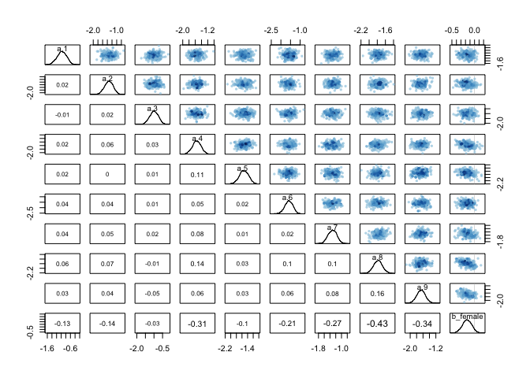
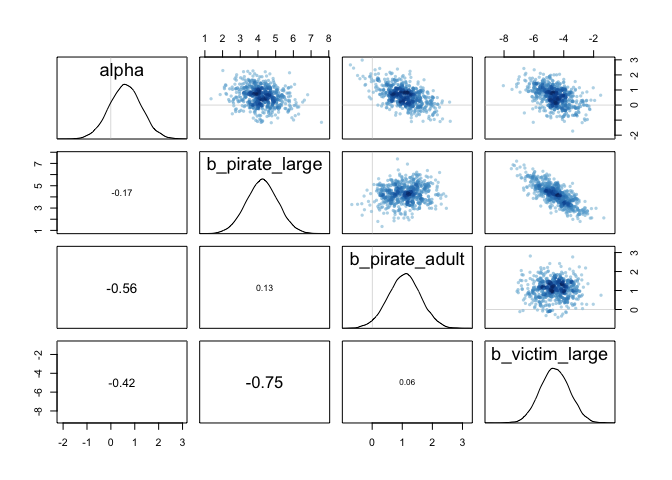
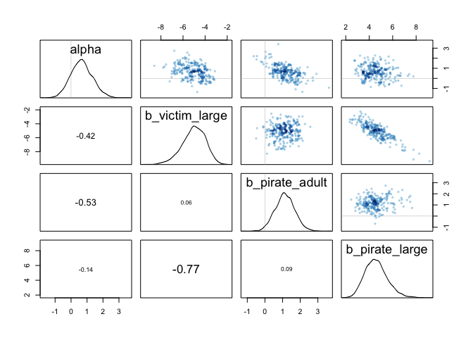
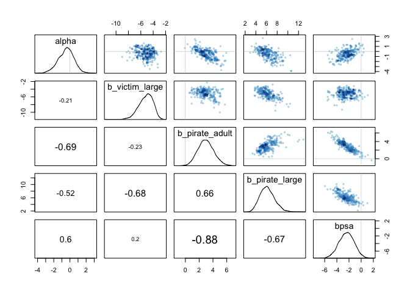
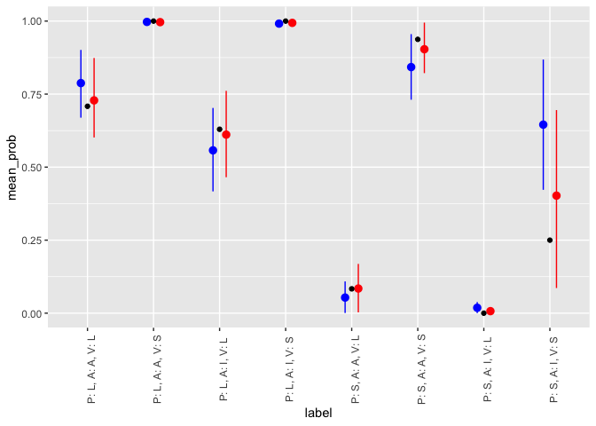
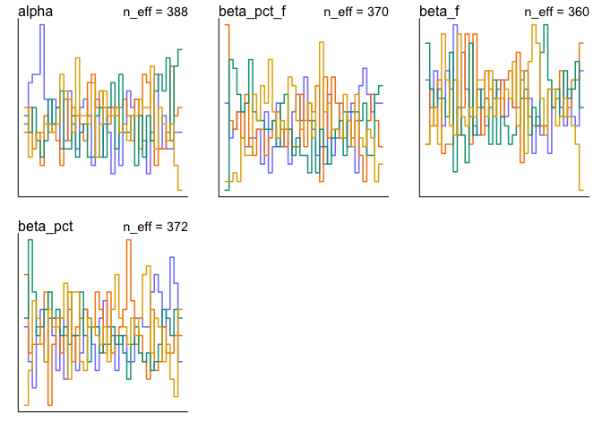
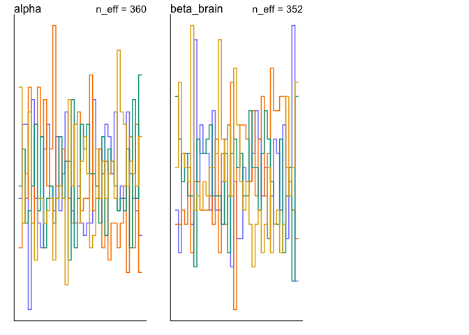

```r
library(rethinking)
```

```
## Loading required package: rstan
```

```
## Loading required package: StanHeaders
```

```
## Loading required package: ggplot2
```

```
## rstan (Version 2.19.2, GitRev: 2e1f913d3ca3)
```

```
## For execution on a local, multicore CPU with excess RAM we recommend calling
## options(mc.cores = parallel::detectCores()).
## To avoid recompilation of unchanged Stan programs, we recommend calling
## rstan_options(auto_write = TRUE)
```

```
## Loading required package: parallel
```

```
## Loading required package: dagitty
```

```
## rethinking (Version 1.91)
```

```
## 
## Attaching package: 'rethinking'
```

```
## The following object is masked from 'package:stats':
## 
##     rstudent
```

```r
library(tidyverse)
```

```
## ── Attaching packages ─────────────────────────────────────────────────────── tidyverse 1.2.1 ──
```

```
## ✔ tibble  2.1.3     ✔ purrr   0.3.2
## ✔ tidyr   1.0.0     ✔ dplyr   0.8.3
## ✔ readr   1.3.1     ✔ stringr 1.4.0
## ✔ tibble  2.1.3     ✔ forcats 0.4.0
```

```
## ── Conflicts ────────────────────────────────────────────────────────── tidyverse_conflicts() ──
## ✖ tidyr::extract() masks rstan::extract()
## ✖ dplyr::filter()  masks stats::filter()
## ✖ dplyr::lag()     masks stats::lag()
## ✖ purrr::map()     masks rethinking::map()
```

0E1
10E2
10E3
10M1
 
Problems 1 and 2 at https://github.com/rmcelreath/statrethinking_winter2019/blob/master/homework/week06.pdf

## 10E1
_If an event has probability 0.35, what are the log-odds of this event?_


```r
logit(.35)
```

```
## [1] -0.6190392
```

```r
log(.35/.65)
```

```
## [1] -0.6190392
```

## 10E2
_If an event has log-odds 3.2, what is the probability of this event?_

```r
inv_logit(3.2)
```

```
## [1] 0.9608343
```

```r
exp(3.2) / (1+exp(3.2)) # algebra works!
```

```
## [1] 0.9608343
```

## 10E3
_Suppose that a coefficient in a logistic regression has value 1.7. What does this imply about the proportional change in odds of the outcome?_

The increases the probability of the event by 70%

## 10M1
_Asexplainedinthechapter,binomialdatacanbeorganizedinaggregatedanddisaggregated forms, without any impact on inference. But the likelihood of the data does change when the data are converted between the two formats. Can you explain why?_

extra parameter blah blah

## PDF 1

_The data in data(NWOGrants) are outcomes for scientific funding applications for the Netherlands Organization for Scientific Research (NWO) from 2010–2012 (see van der Lee and Ellemers doi:10.1073/pnas.1510159112). These data have a very similar structure to the UCBAdmit data discussed in Chapter 11. I want you to consider a similar question: What are the total and indirect causal effects of gender on grant awards? Consider a mediation path (a pipe) through dis- cipline. Draw the corresponding DAG and then use one or more binomial GLMs to answer the question. What is your causal interpretation? If NWO’s goal is to equalize rates of funding between the genders, what type of intervention would be most effective?_


```r
g <- dagitty("dag{
  G -> A;
  G -> D;
  D -> A
}")
coordinates(g) <- list(x=c(G=0, D=1, A=2),
                       y=c(G=0, D=1, A=0))
plot(g)
```

<!-- -->


```r
data("NWOGrants")
NWOGrants
```

```
##             discipline gender applications awards
## 1    Chemical sciences      m           83     22
## 2    Chemical sciences      f           39     10
## 3    Physical sciences      m          135     26
## 4    Physical sciences      f           39      9
## 5              Physics      m           67     18
## 6              Physics      f            9      2
## 7           Humanities      m          230     33
## 8           Humanities      f          166     32
## 9   Technical sciences      m          189     30
## 10  Technical sciences      f           62     13
## 11   Interdisciplinary      m          105     12
## 12   Interdisciplinary      f           78     17
## 13 Earth/life sciences      m          156     38
## 14 Earth/life sciences      f          126     18
## 15     Social sciences      m          425     65
## 16     Social sciences      f          409     47
## 17    Medical sciences      m          245     46
## 18    Medical sciences      f          260     29
```

plot it

```r
NWOGrants %>% 
  mutate(success=awards/applications) %>%
  ggplot(aes(x=discipline, y=success, color=gender, size=applications)) +
  geom_point() +
  theme(axis.text.x = element_text(angle=90, hjust = 1, vjust=0.5))
```

<!-- -->

overall difference, irrespective of field

```r
d1 <- with(NWOGrants, list(g=ifelse(gender=="m",1,2),
                           applications=applications,
                           awards=awards))

m11.1 <- ulam(
  alist(awards ~ dbinom(applications, p),
        logit(p) <- a[g],
        a[g] ~ dnorm(0,1.5)),
  data=d1,
  chains = 4,
  cores = 4)
```

this is on the logit scale

```r
precis(m11.1, depth=2)
```

```
##           mean         sd      5.5%     94.5%    n_eff     Rhat
## a[1] -1.533131 0.06559237 -1.638790 -1.428745 1440.882 1.000265
## a[2] -1.738305 0.08152185 -1.868813 -1.613970 1099.181 1.003201
```

look at differences in award rate

```r
post <- extract.samples(m11.1) 

# relative scale
precis(data.frame(rel_dif=exp(post$a[,2]-post$a[,1])))
```

```
##              mean         sd      5.5%     94.5%      histogram
## rel_dif 0.8191643 0.08738091 0.6815548 0.9625164 ▁▁▁▂▅▇▇▅▃▂▁▁▁▁
```

```r
#absolute scale
precis(data.frame(prob_dif=inv_logit(post$a[,2])-inv_logit(post$a[,1])))
```

```
##                 mean        sd        5.5%        94.5%    histogram
## prob_dif -0.02791429 0.0144386 -0.05186246 -0.005205244 ▁▁▁▂▃▇▇▅▂▁▁▁
```
Women are 82% as likely to receive an award, translating to a reduced success rate of 3% 


## now fit a model that has a separate probability for each discipline


```r
d2 <- with(NWOGrants, list(g=ifelse(gender=="m",1,2),
                           applications=applications,
                           awards=awards, 
                           discipline=rep(1:9, each=2)))

m11.2 <- ulam(
  alist(awards ~ dbinom(applications, p),
        logit(p) <- a[g] + b[discipline],
        a[g] ~ dnorm(0,1.5),
        b[discipline] ~ dnorm(0,1.5)),
  data=d2,
  iter=2000,
  chains = 4,
  cores = 4)
```

```
## Warning: Bulk Effective Samples Size (ESS) is too low, indicating posterior means and medians may be unreliable.
## Running the chains for more iterations may help. See
## http://mc-stan.org/misc/warnings.html#bulk-ess
```


```r
pairs(m11.2)
```

<!-- -->

```r
precis(m11.2, depth=2)
```

```
##            mean        sd       5.5%       94.5%    n_eff     Rhat
## a[1] -1.1825746 0.4239700 -1.8704975 -0.52937921 340.0589 1.020197
## a[2] -1.3203440 0.4272540 -2.0223038 -0.65913417 339.0495 1.020394
## b[1]  0.1760827 0.4604972 -0.5401124  0.92121789 414.1415 1.017360
## b[2] -0.1700718 0.4524807 -0.8674796  0.55378179 394.5159 1.019616
## b[3]  0.1534734 0.4778361 -0.6176523  0.91226111 430.8565 1.016865
## b[4] -0.3926756 0.4388993 -1.0806526  0.32295951 359.9497 1.018252
## b[5] -0.3643402 0.4496338 -1.0477412  0.37660356 388.3981 1.016933
## b[6] -0.4382881 0.4552029 -1.1540325  0.31466633 401.3221 1.016106
## b[7] -0.1597480 0.4395104 -0.8523639  0.54828683 364.0044 1.019167
## b[8] -0.6183808 0.4290950 -1.2835826  0.08575244 359.9202 1.019228
## b[9] -0.4974024 0.4371562 -1.1759970  0.21531089 362.0293 1.018871
```

so much correlation.  Try not indexing gender. I this parameterization each discipline coefficient will be the rate for males in that discipline and then the gender coefficient will be the difference for females.


```r
d3 <- with(NWOGrants, list(g=ifelse(gender=="m",0,1),
                           applications=applications,
                           awards=awards, 
                           discipline=rep(1:9, each=2)))

m11.3 <- ulam(
  alist(awards ~ dbinom(applications, p),
        logit(p) <-  a[discipline] + b_female*g,
        a[discipline] ~ dnorm(0,1.5),
        b_female ~dnorm(0,1.5)),
  data=d3,
  iter=2000,
  chains = 4,
  cores = 4)
```


```r
precis(m11.3, depth=2)
```

```
##                mean        sd       5.5%        94.5%    n_eff      Rhat
## a[1]     -0.9736482 0.2080045 -1.3081169 -0.651800111 4698.831 0.9994190
## a[2]     -1.3388463 0.1921643 -1.6442239 -1.041952119 3549.126 1.0004529
## a[3]     -0.9944208 0.2568241 -1.4237850 -0.604119751 4021.370 0.9997464
## a[4]     -1.5574747 0.1411539 -1.7826887 -1.336654357 3859.406 1.0003105
## a[5]     -1.5266089 0.1675932 -1.7937296 -1.267133572 4028.884 0.9997316
## a[6]     -1.5881197 0.2030508 -1.9237939 -1.274933956 4222.900 0.9996687
## a[7]     -1.3169496 0.1535972 -1.5659364 -1.076523040 4427.189 1.0003681
## a[8]     -1.7807919 0.1146798 -1.9625411 -1.597677588 3336.875 0.9997481
## a[9]     -1.6586013 0.1338802 -1.8718784 -1.443767734 3779.574 0.9999601
## b_female -0.1628051 0.1061859 -0.3292261  0.004153869 2560.235 0.9997797
```

```r
pairs(m11.3)
```

<!-- -->
This looks much better.

look at differences in award rate.

On relative scale

```r
post <- extract.samples(m11.3, pars="b_female") 

# relative  and absolute scale
precis(list(rel_female=exp(post$b_female)))
```

```
##                 mean         sd      5.5%    94.5% histogram
## rel_female 0.8545545 0.09083796 0.7194803 1.004163  ▁▁▅▇▃▁▁▁
```

So women are 86% as likely to get an award, but the 89% condidence intervals cross 1

For the absolute scale I think it will probably be easier to use link


```r
# the difference between men and women will be the same for all disciplines using this model, so just get one of them.
newdat <- data.frame(g=0:1, 
                     discipline=1)
newdat
```

```
##   g discipline
## 1 0          1
## 2 1          1
```

```r
pred <- link(m11.3, data = newdat)
head(pred)
```

```
##           [,1]      [,2]
## [1,] 0.2920435 0.2816299
## [2,] 0.3371825 0.2579096
## [3,] 0.1763112 0.1498775
## [4,] 0.2607554 0.2190191
## [5,] 0.2591796 0.2341054
## [6,] 0.2779758 0.2878934
```


```r
precis(list(abs_female=pred[,2] - pred[,1]))
```

```
##                   mean         sd        5.5%        94.5% histogram
## abs_female -0.03081056 0.02023053 -0.06356217 0.0008070204 ▁▁▁▅▇▅▁▁▁
```

Women do 3% worse when accounting for overall differences in award rate between departments, although confidence interval touches 0

Can I do this from posterior directly?


```r
post <- extract.samples(m11.3)
str(post)
```

```
## List of 2
##  $ a       : num [1:4000, 1:9] -0.885 -0.676 -1.542 -1.042 -1.05 ...
##  $ b_female: num [1:4000(1d)] -0.0509 -0.381 -0.194 -0.2293 -0.135 ...
##  - attr(*, "source")= chr "ulam posterior: 4000 samples from m11.3"
```

```r
# again I should just be able to look at one discipline
precis(list(abd_female=inv_logit(post$a[,1]) -inv_logit(post$a[,1]-post$b_female)))
```

```
##                   mean        sd        5.5%        94.5%  histogram
## abd_female -0.03404281 0.0230909 -0.07257963 0.0008042333 ▁▁▁▂▇▇▅▁▁▁
```

Overall I do see a reduction in award rates to women.  When we consider discipline than the signficance of this drops, but I wonder if there is still something going on...

interaction?


```r
m11.4 <- ulam(
  alist(awards ~ dbinom(applications, p),
        logit(p) <-  a[discipline] + b_female*g + inter[discipline]*g,
        a[discipline] ~ dnorm(0,1.5),
        b_female ~dnorm(0,1.5),
        inter[discipline] ~ dnorm(0,.5)),
  data=d3,
  iter=2000,
  chains = 4,
  cores = 4)
```


```r
precis(m11.4, depth=2)
```

```
##                  mean        sd        5.5%         94.5%    n_eff
## a[1]     -1.005235451 0.2334656 -1.37868188 -6.371349e-01 4950.878
## a[2]     -1.387990604 0.2071818 -1.73136391 -1.058003e+00 5352.125
## a[3]     -0.999113524 0.2629141 -1.42073120 -5.853709e-01 6456.707
## a[4]     -1.724799409 0.1747106 -2.01032430 -1.451702e+00 4513.258
## a[5]     -1.609926286 0.1800599 -1.90613810 -1.324240e+00 5987.652
## a[6]     -1.837411402 0.2630587 -2.25516336 -1.422757e+00 4947.343
## a[7]     -1.180502173 0.1821395 -1.47041391 -8.941985e-01 5460.013
## a[8]     -1.721037672 0.1325153 -1.93760575 -1.513675e+00 5613.097
## a[9]     -1.501301272 0.1586930 -1.75489476 -1.250443e+00 4943.170
## b_female -0.083664522 0.1956140 -0.40030551  2.293011e-01 2110.348
## inter[1]  0.006190538 0.3468657 -0.55117685  5.604706e-01 4857.297
## inter[2]  0.149151798 0.3470073 -0.41313158  6.987226e-01 4605.030
## inter[3] -0.074039259 0.4311017 -0.74509961  6.135934e-01 6901.439
## inter[4]  0.321824188 0.2847153 -0.13176673  7.781496e-01 2854.301
## inter[5]  0.243813560 0.3268970 -0.28431860  7.612295e-01 3798.050
## inter[6]  0.466169903 0.3351089 -0.07132541  1.000248e+00 3983.267
## inter[7] -0.434955612 0.3049355 -0.93422562  3.213935e-02 3560.663
## inter[8] -0.220775498 0.2528911 -0.61809635  1.797720e-01 2719.986
## inter[9] -0.437437018 0.2781242 -0.88280118 -6.568688e-05 2978.547
##               Rhat
## a[1]     0.9999556
## a[2]     0.9997086
## a[3]     0.9994802
## a[4]     1.0005715
## a[5]     0.9994349
## a[6]     0.9997908
## a[7]     1.0005464
## a[8]     0.9994439
## a[9]     0.9998540
## b_female 0.9998151
## inter[1] 1.0000392
## inter[2] 0.9998971
## inter[3] 0.9992344
## inter[4] 1.0007055
## inter[5] 0.9997749
## inter[6] 0.9995702
## inter[7] 0.9998360
## inter[8] 1.0003995
## inter[9] 0.9991674
```


```r
plot(precis(m11.4, depth=2))
```

<!-- -->


## 11.2

_2. Suppose that the NWO Grants sample has an unobserved confound that influences both choice of discipline and the probability of an award. One example of such a confound could be the career stage of each applicant. Suppose that in some disciplines, junior scholars apply for most of the grants. In other disciplines, scholars from all career stages compete. As a result, career stage influences discipline as well as the probability of being awarded a grant. Add these influences to your DAG from Problem 1. What happens now when you condition on discipline? Does it provide an un-confounded estimate of the direct path from gender to an award? Why or why not? Justify your answer with the back-door criterion. Hint: This is structurally a lot like the grandparents-parentschildren-neighborhoods example from a previous week. If you have trouble thinking this though, try simulating fake data, assuming your DAG is true. Then analyze it using the model from Problem 1. What do you conclude? Is it possible for gender to have a real direct causal influence but for a regression conditioning on both gender and discipline to suggest zero influence?_


```r
g <- dagitty("dag{
  G -> A;
  G -> D;
  D -> A;
  C -> A;
  C -> D;
}")
coordinates(g) <- list(x=c(G=0, D=1, A=2, C=2),
                       y=c(G=0, D=1, A=0, C=1))
plot(g)
```

<!-- -->

So if this is the DAG, the regression model from 1 closes the D->A, but leaves a back door from D through C to A?

# Chapter 11.2 problems

## 10E4
_Why do Poisson regressions sometimes require the use of an offset? Provide an example._

If the data have been collected (events counted) over different sampling times/ distances (exposures) we need an offset to account for this.  For example, we want to compare transposition events across the genome.  One group counted number of transposons per 100KB and the other per 1MB.

## 10M2
_If a coefficient in a Poisson regression has value 1.7, what does this imply about the change in the outcome?_

For every unit change in the predictor there will be a 5.47-fold (e^1.7) increase  in the number of counts 


```r
exp(1)
```

```
## [1] 2.718282
```

```r
exp(1+1.7)
```

```
## [1] 14.87973
```

```r
exp(1+1.7+1.7)
```

```
## [1] 81.45087
```

```r
exp(1)^1.7
```

```
## [1] 5.473947
```

## 10M3
_Explain why the logit link is appropriate for a binomial generalized linear model._

We need to transform the linear model to return a value between 0 and 1 (i.e. the probability scale)

## 10M4
_Explain why the log link is appropriate for a Poisson generalized linear model._

This keeps the outcome variable on a positive scale, required for count data.  You cannot have negative counts.  

(OK but this is true for so much stuff that we model with linear models and Gaussian distributions...)

## 10H3
_The data contained in library(MASS);data(eagles) are records of salmon pirating at- tempts by Bald Eagles in Washington State. See ?eagles for details. While one eagle feeds, some- times another will swoop in and try to steal the salmon from it. Call the feeding eagle the “victim” and the thief the “pirate.” Use the available data to build a binomial GLM of successful pirating attempts._


```r
library(MASS)
```

```
## 
## Attaching package: 'MASS'
```

```
## The following object is masked from 'package:dplyr':
## 
##     select
```

```r
data(eagles)
?eagles
eagles
```

```
##    y  n P A V
## 1 17 24 L A L
## 2 29 29 L A S
## 3 17 27 L I L
## 4 20 20 L I S
## 5  1 12 S A L
## 6 15 16 S A S
## 7  0 28 S I L
## 8  1  4 S I S
```


```r
eagleslist <- with(eagles,
                   list(y=y,
                        n=n,
                        pirate_large=ifelse(P=="L",1,0),
                        pirate_adult=ifelse(A=="A",1,0),
                        victim_large=ifelse(V=="L",1,0)))
str(eagleslist)
```

```
## List of 5
##  $ y           : int [1:8] 17 29 17 20 1 15 0 1
##  $ n           : int [1:8] 24 29 27 20 12 16 28 4
##  $ pirate_large: num [1:8] 1 1 1 1 0 0 0 0
##  $ pirate_adult: num [1:8] 1 1 0 0 1 1 0 0
##  $ victim_large: num [1:8] 1 0 1 0 1 0 1 0
```


```r
m10h3q <- quap(alist(y ~ dbinom(n, p),
                    logit(p) <- alpha + 
                      b_pirate_large*pirate_large +
                      b_pirate_adult*pirate_adult +
                      b_victim_large*victim_large,
                    alpha ~ dnorm(0,10),
                    c(b_pirate_large, b_pirate_adult, b_victim_large) ~ dnorm(0,5)),
              data=eagleslist)
```


```r
precis(m10h3q)
```

```
##                      mean        sd       5.5%     94.5%
## alpha           0.5915456 0.6622747 -0.4668974  1.649988
## b_pirate_large  4.2418436 0.8960257  2.8098216  5.673866
## b_pirate_adult  1.0814092 0.5339218  0.2280990  1.934719
## b_victim_large -4.5926285 0.9614019 -6.1291344 -3.056123
```

```r
pairs(m10h3q)
```

<!-- -->


```r
m10h3stan <- ulam(alist(y ~ dbinom(n, p),
                    logit(p) <- alpha + 
                      b_pirate_large*pirate_large +
                      b_pirate_adult*pirate_adult +
                      b_victim_large*victim_large,
                    alpha ~ dnorm(0,10),
                    c(b_pirate_large, b_pirate_adult, b_victim_large) ~ dnorm(0,5)),
              data=eagleslist,
              chains = 4,
              cores = 4,
              iter = 2000,
              log_lik = TRUE)
```


```r
precis(m10h3stan)
```

```
##                      mean        sd       5.5%     94.5%    n_eff
## alpha           0.6680818 0.6949563 -0.3765181  1.826792 1828.035
## b_victim_large -5.0969311 1.0851857 -6.9662089 -3.552801 1517.705
## b_pirate_adult  1.1294505 0.5461097  0.2916863  2.038210 2115.254
## b_pirate_large  4.6775512 1.0019921  3.2608353  6.408095 1565.650
##                     Rhat
## alpha          1.0017591
## b_victim_large 1.0002728
## b_pirate_adult 1.0022453
## b_pirate_large 0.9994862
```

```r
pairs(m10h3stan)
```

<!-- -->

_(b) Now interpret the estimates. If the quadratic approximation turned out okay, then it’s okay to use the map estimates. Otherwise stick to map2stan estimates. Then plot the posterior predictions. Compute and display both (1) the predicted probability of success and its 89% interval for each row (i) in the data, as well as (2) the predicted success count and its 89% interval. What different information does each type of posterior prediction provide?_

posterior are not entirely Gaussian, stick with Stan

Get predictions


```r
pred <- link(m10h3stan)
head(pred)
```

```
##           [,1]      [,2]      [,3]      [,4]       [,5]      [,6]
## [1,] 0.7225917 0.9988672 0.6311558 0.9982766 0.01175426 0.8010487
## [2,] 0.7495498 0.9994508 0.5630972 0.9987255 0.00574217 0.7783477
## [3,] 0.8571167 0.9971798 0.5652816 0.9871212 0.09033975 0.8540960
## [4,] 0.8021618 0.9988147 0.4235613 0.9934944 0.04784005 0.9126056
## [5,] 0.7562515 0.9949442 0.6229421 0.9905473 0.04607962 0.7539323
## [6,] 0.6734950 0.9963793 0.5567622 0.9940680 0.03948403 0.8457748
##             [,7]      [,8]
## [1,] 0.007753010 0.7256547
## [2,] 0.002480948 0.6019489
## [3,] 0.021074034 0.5592636
## [4,] 0.009023120 0.6542652
## [5,] 0.025077391 0.6199919
## [6,] 0.024421236 0.7695613
```

```r
summary(pred)
```

```
##        V1               V2               V3               V4        
##  Min.   :0.4802   Min.   :0.9667   Min.   :0.2736   Min.   :0.8947  
##  1st Qu.:0.7432   1st Qu.:0.9966   1st Qu.:0.5008   1st Qu.:0.9895  
##  Median :0.7943   Median :0.9983   Median :0.5616   Median :0.9947  
##  Mean   :0.7887   Mean   :0.9974   Mean   :0.5599   Mean   :0.9919  
##  3rd Qu.:0.8439   3rd Qu.:0.9992   3rd Qu.:0.6215   3rd Qu.:0.9976  
##  Max.   :0.9597   Max.   :1.0000   Max.   :0.8507   Max.   :0.9999  
##        V5                 V6               V7                  V8        
##  Min.   :0.000383   Min.   :0.5020   Min.   :0.0001549   Min.   :0.1769  
##  1st Qu.:0.020388   1st Qu.:0.7991   1st Qu.:0.0065914   1st Qu.:0.5479  
##  Median :0.039911   Median :0.8529   Median :0.0132420   Median :0.6543  
##  Mean   :0.050561   Mean   :0.8435   Mean   :0.0176576   Mean   :0.6458  
##  3rd Qu.:0.069070   3rd Qu.:0.8973   3rd Qu.:0.0233485   3rd Qu.:0.7536  
##  Max.   :0.320536   Max.   :0.9881   Max.   :0.1226691   Max.   :0.9670
```
These are the probability of successful pirate for each of the 8 rows in the table.


```r
pred_obs <- as_tibble(cbind(eagles, 
                            mean_prob=colMeans(pred),
                            low.89=apply(pred, 2, HPDI)[1,],
                            high.89=apply(pred, 2, HPDI)[2,]
)) %>%
  mutate(observed_prob=y/n,
         pred_success=mean_prob*n,
         pred_low=low.89*n,
         pred_high=high.89*n,
         label=str_c("P: ", P, ", A: ", A, ", V: ", V)) %>%
  dplyr::select(label, everything())
pred_obs
```

```
## # A tibble: 8 x 13
##   label     y     n P     A     V     mean_prob  low.89 high.89
##   <chr> <int> <int> <fct> <fct> <fct>     <dbl>   <dbl>   <dbl>
## 1 P: L…    17    24 L     A     L        0.789  6.65e-1  0.899 
## 2 P: L…    29    29 L     A     S        0.997  9.94e-1  1.000 
## 3 P: L…    17    27 L     I     L        0.560  4.17e-1  0.700 
## 4 P: L…    20    20 L     I     S        0.992  9.83e-1  1.000 
## 5 P: S…     1    12 S     A     L        0.0506 5.71e-4  0.101 
## 6 P: S…    15    16 S     A     S        0.843  7.44e-1  0.960 
## 7 P: S…     0    28 S     I     L        0.0177 1.55e-4  0.0361
## 8 P: S…     1     4 S     I     S        0.646  4.35e-1  0.883 
## # … with 4 more variables: observed_prob <dbl>, pred_success <dbl>,
## #   pred_low <dbl>, pred_high <dbl>
```


```r
pred_obs %>%
  ggplot(aes(x=label)) +
  geom_pointrange(aes(y=mean_prob, ymin=low.89, ymax=high.89), color="blue", fill="blue") +
  geom_point(aes(y=observed_prob)) +
  theme(axis.text.x = element_text(angle=90))
```

<!-- -->


```r
pred_obs %>%
  ggplot(aes(x=label)) +
  geom_pointrange(aes(y=pred_success, ymin=pred_low, ymax=pred_high), color="blue", fill="blue") +
  geom_point(aes(y=y)) +
  theme(axis.text.x = element_text(angle=90))
```

<!-- -->

Overall the fit looks pretty good.  Size of pirate and victim are both pretty importnat; age is less important.

Try with interaction


```r
m10h3stan_int <- ulam(alist(y ~ dbinom(n, p),
                    logit(p) <- alpha + 
                      b_pirate_large*pirate_large +
                      b_pirate_adult*pirate_adult +
                      b_victim_large*victim_large +
                      bpsa*pirate_large*pirate_adult,
                    alpha ~ dnorm(0,10),
                    c(b_pirate_large, b_pirate_adult, b_victim_large) ~ dnorm(0,5),
                    bpsa ~ dnorm(0,2.5)),
              data=eagleslist,
              chains = 4,
              cores = 4,
              iter = 2000,
              log_lik = TRUE)
```


```r
precis(m10h3stan_int)
```

```
##                      mean       sd      5.5%      94.5%    n_eff     Rhat
## alpha          -0.5060512 0.893756 -1.966597  0.8903941 1353.238 1.001999
## b_victim_large -5.2038196 1.088062 -7.058916 -3.6066771 1379.121 1.002439
## b_pirate_adult  2.9715258 1.076442  1.264331  4.7127681 1306.866 1.003297
## b_pirate_large  6.1770377 1.286468  4.228951  8.3409163 1129.966 1.005967
## bpsa           -2.4099196 1.161655 -4.287005 -0.5223843 1330.255 1.003211
```

```r
pairs(m10h3stan_int)
```

<!-- -->


```r
compare(m10h3stan, m10h3stan_int)
```

```
##                   WAIC    pWAIC    dWAIC     weight       SE     dSE
## m10h3stan_int 21.21540 2.228920 0.000000 0.98984143 5.687052      NA
## m10h3stan     30.37385 5.045099 9.158454 0.01015857 7.777259 3.26884
```

Interaction model fits better.  Lets compare the predictions.

```r
pred_int <- link(m10h3stan_int)
head(pred)
```

```
##           [,1]      [,2]      [,3]      [,4]       [,5]      [,6]
## [1,] 0.7225917 0.9988672 0.6311558 0.9982766 0.01175426 0.8010487
## [2,] 0.7495498 0.9994508 0.5630972 0.9987255 0.00574217 0.7783477
## [3,] 0.8571167 0.9971798 0.5652816 0.9871212 0.09033975 0.8540960
## [4,] 0.8021618 0.9988147 0.4235613 0.9934944 0.04784005 0.9126056
## [5,] 0.7562515 0.9949442 0.6229421 0.9905473 0.04607962 0.7539323
## [6,] 0.6734950 0.9963793 0.5567622 0.9940680 0.03948403 0.8457748
##             [,7]      [,8]
## [1,] 0.007753010 0.7256547
## [2,] 0.002480948 0.6019489
## [3,] 0.021074034 0.5592636
## [4,] 0.009023120 0.6542652
## [5,] 0.025077391 0.6199919
## [6,] 0.024421236 0.7695613
```

```r
summary(pred)
```

```
##        V1               V2               V3               V4        
##  Min.   :0.4802   Min.   :0.9667   Min.   :0.2736   Min.   :0.8947  
##  1st Qu.:0.7432   1st Qu.:0.9966   1st Qu.:0.5008   1st Qu.:0.9895  
##  Median :0.7943   Median :0.9983   Median :0.5616   Median :0.9947  
##  Mean   :0.7887   Mean   :0.9974   Mean   :0.5599   Mean   :0.9919  
##  3rd Qu.:0.8439   3rd Qu.:0.9992   3rd Qu.:0.6215   3rd Qu.:0.9976  
##  Max.   :0.9597   Max.   :1.0000   Max.   :0.8507   Max.   :0.9999  
##        V5                 V6               V7                  V8        
##  Min.   :0.000383   Min.   :0.5020   Min.   :0.0001549   Min.   :0.1769  
##  1st Qu.:0.020388   1st Qu.:0.7991   1st Qu.:0.0065914   1st Qu.:0.5479  
##  Median :0.039911   Median :0.8529   Median :0.0132420   Median :0.6543  
##  Mean   :0.050561   Mean   :0.8435   Mean   :0.0176576   Mean   :0.6458  
##  3rd Qu.:0.069070   3rd Qu.:0.8973   3rd Qu.:0.0233485   3rd Qu.:0.7536  
##  Max.   :0.320536   Max.   :0.9881   Max.   :0.1226691   Max.   :0.9670
```
These are the probability of successful pirate for each of the 8 rows in the table.


```r
pred_obs_int <- as_tibble(cbind(pred_obs, 
                            mean_prob_int=colMeans(pred_int),
                            low.89_int=apply(pred_int, 2, HPDI)[1,],
                            high.89_int=apply(pred_int, 2, HPDI)[2,]
)) %>%
  mutate(pred_success_int=mean_prob_int*n,
         pred_low_int=low.89_int*n,
         pred_high_int=high.89_int*n)
pred_obs_int
```

```
## # A tibble: 8 x 19
##   label     y     n P     A     V     mean_prob  low.89 high.89
##   <chr> <int> <int> <fct> <fct> <fct>     <dbl>   <dbl>   <dbl>
## 1 P: L…    17    24 L     A     L        0.789  6.65e-1  0.899 
## 2 P: L…    29    29 L     A     S        0.997  9.94e-1  1.000 
## 3 P: L…    17    27 L     I     L        0.560  4.17e-1  0.700 
## 4 P: L…    20    20 L     I     S        0.992  9.83e-1  1.000 
## 5 P: S…     1    12 S     A     L        0.0506 5.71e-4  0.101 
## 6 P: S…    15    16 S     A     S        0.843  7.44e-1  0.960 
## 7 P: S…     0    28 S     I     L        0.0177 1.55e-4  0.0361
## 8 P: S…     1     4 S     I     S        0.646  4.35e-1  0.883 
## # … with 10 more variables: observed_prob <dbl>, pred_success <dbl>,
## #   pred_low <dbl>, pred_high <dbl>, mean_prob_int <dbl>,
## #   low.89_int <dbl>, high.89_int <dbl>, pred_success_int <dbl>,
## #   pred_low_int <dbl>, pred_high_int <dbl>
```


```r
pred_obs_int %>%
  ggplot(aes(x=label)) +
  geom_pointrange(aes(y=mean_prob, ymin=low.89, ymax=high.89), color="blue", position = position_nudge(x=-.1)) +
  geom_pointrange(aes(y=mean_prob_int, ymin=low.89_int, ymax=high.89_int), color="red", position = position_nudge(x=.1)) +
  geom_point(aes(y=observed_prob)) +
  theme(axis.text.x = element_text(angle=90))
```

<!-- -->


```r
pred_obs_int %>%
  ggplot(aes(x=label)) +
  geom_pointrange(aes(y=pred_success, ymin=pred_low, ymax=pred_high), color="blue", position = position_nudge(x=-.1)) +
  geom_pointrange(aes(y=pred_success_int, ymin=pred_low_int, ymax=pred_high_int), color="red", position = position_nudge(x=.1)) +
  geom_point(aes(y=y)) +
  theme(axis.text.x = element_text(angle=90))
```

<!-- -->

Fits better!

## 10H4

_The data contained in data(salamanders) are counts of salamanders (Plethodon elongatus) from 47 different 49-m2 plots in northern California.  The column SALAMAN is the count in each plot, and the columns PCTCOVER and FORESTAGE are percent of ground cover and age of trees in the plot, respectively. You will model SALAMAN as a Poisson variable._

_(a) Model the relationship between density and percent cover, using a log-link (same as the example in the book and lecture). Use weakly informative priors of your choosing. Check the quadratic approximation again, by comparing map to map2stan. Then plot the expected counts and their 89% interval against percent cover. In which ways does the model do a good job? In which ways does it do a bad job?_


```r
data("salamanders")
head(salamanders)
```

```
##   SITE SALAMAN PCTCOVER FORESTAGE
## 1    1      13       85       316
## 2    2      11       86        88
## 3    3      11       90       548
## 4    4       9       88        64
## 5    5       8       89        43
## 6    6       7       83       368
```


```r
library(GGally)
salamanders %>% dplyr::select(SALAMAN, PCTCOVER, FORESTAGE) %>% ggpairs()
```

<!-- -->


```r
salamanders$pctcover_std <- scale(salamanders$PCTCOVER)
m10h4.1.quap <- quap(
  alist(SALAMAN ~ dpois(lambda),
        log(lambda) <- alpha + beta_pct*pctcover_std,
        alpha ~ dnorm(3, 0.5),
        beta_pct ~ dnorm(0, 0.2)),
  data=salamanders)
```


```r
precis(m10h4.1.quap)
```

```
##               mean        sd      5.5%     94.5%
## alpha    0.7997914 0.1014376 0.6376745 0.9619082
## beta_pct 0.6535256 0.1064780 0.4833533 0.8236980
```


```r
m10h4.1.stan <- ulam(
  alist(SALAMAN ~ dpois(lambda),
        log(lambda) <- alpha + beta_pct*pctcover_std,
        alpha ~ dnorm(3, 0.5),
        beta_pct ~ dnorm(0, 0.5)),
  chains=4,
  cores=4,
  data=salamanders,
  log_lik = TRUE)
```

```r
precis(m10h4.1.quap)
```

```
##               mean        sd      5.5%     94.5%
## alpha    0.7997914 0.1014376 0.6376745 0.9619082
## beta_pct 0.6535256 0.1064780 0.4833533 0.8236980
```


```r
precis(m10h4.1.stan)
```

```
##               mean        sd      5.5%     94.5%    n_eff      Rhat
## alpha    0.6625333 0.1187904 0.4680666 0.8506492 764.7956 1.0003034
## beta_pct 0.8951736 0.1403594 0.6816316 1.1201919 783.0796 0.9994593
```

somewhat similar


```r
pairs(m10h4.1.stan)
```

<!-- -->

```r
trankplot(m10h4.1.stan)
traceplot(m10h4.1.stan)
```

<!-- --><!-- -->

plot observed and expected

```r
pred <- link(m10h4.1.stan)
pred_obs <- as_tibble(cbind(
  salamanders,
  mu=colMeans(pred),
  low.89=apply(pred,2,HPDI)[1,],
  high.89=apply(pred, 2, HPDI)[2,]))
head(pred_obs)
```

```
## # A tibble: 6 x 8
##    SITE SALAMAN PCTCOVER FORESTAGE pctcover_std[,1]    mu low.89 high.89
##   <int>   <int>    <int>     <int>            <dbl> <dbl>  <dbl>   <dbl>
## 1     1      13       85       316            0.727  3.73   3.14    4.21
## 2     2      11       86        88            0.755  3.83   3.30    4.41
## 3     3      11       90       548            0.867  4.23   3.60    4.90
## 4     4       9       88        64            0.811  4.03   3.46    4.65
## 5     5       8       89        43            0.839  4.13   3.52    4.77
## 6     6       7       83       368            0.671  3.55   3.08    4.08
```


```r
pred_obs %>%
  mutate(observed=SALAMAN,
         predicted=mu) %>%
  ggplot(aes(x=PCTCOVER)) +
  geom_point(aes(y=observed), color="black") +
  geom_pointrange(aes(y=predicted, ymin=low.89, ymax=high.89), color="blue")
```

<!-- -->

Lots of scatter at high PCTCOVER.


```r
pred_obs %>%
  mutate(observed=SALAMAN,
         predicted=mu) %>%
  ggplot(aes(observed,predicted)) +
  geom_point()
```

<!-- -->


_(b) Can you improve the model by using the other predictor, FORESTAGE? Try any models you think useful. Can you explain why FORESTAGE helps or does not help with prediction?_

additive model:


```r
salamanders$forestage_std <- scale(salamanders$FORESTAGE)
m10h4.2 <- ulam(
  alist(SALAMAN ~ dpois(lambda),
        log(lambda) <- alpha + beta_pct*pctcover_std + beta_f*forestage_std,
        alpha ~ dnorm(3, 0.5),
        c(beta_pct,beta_f) ~ dnorm(0, 0.5)),
  chains=4,
  cores=4,
  data=salamanders,
  log_lik = TRUE)
```


```r
precis(m10h4.2)
```

```
##                mean         sd       5.5%     94.5%     n_eff      Rhat
## alpha    0.65501756 0.12181522  0.4583297 0.8434691  692.2849 0.9991825
## beta_f   0.01898094 0.09001692 -0.1226663 0.1625840 1256.6568 1.0019872
## beta_pct 0.89310741 0.15306438  0.6509104 1.1494828  772.5915 1.0008394
```


```r
pairs(m10h4.2)
```

<!-- -->

```r
trankplot(m10h4.2)
```

<!-- -->

```r
traceplot(m10h4.2)
```

<!-- -->

plot observed and expected

```r
pred <- link(m10h4.2)
pred_obs <- as_tibble(cbind(
  salamanders,
  mu=colMeans(pred),
  low.89=apply(pred,2,HPDI)[1,],
  high.89=apply(pred, 2, HPDI)[2,]))
pred_obs
```

```
## # A tibble: 47 x 9
##     SITE SALAMAN PCTCOVER FORESTAGE pctcover_std[,1] forestage_std[,…    mu
##    <int>   <int>    <int>     <int>            <dbl>            <dbl> <dbl>
##  1     1      13       85       316            0.727            0.761  3.76
##  2     2      11       86        88            0.755           -0.418  3.78
##  3     3      11       90       548            0.867            1.96   4.39
##  4     4       9       88        64            0.811           -0.542  3.97
##  5     5       8       89        43            0.839           -0.650  4.06
##  6     6       7       83       368            0.671            1.03   3.59
##  7     7       6       83       200            0.671            0.161  3.53
##  8     8       6       91        71            0.895           -0.505  4.28
##  9     9       5       88        42            0.811           -0.655  3.96
## 10    10       5       90       551            0.867            1.98   4.39
## # … with 37 more rows, and 2 more variables: low.89 <dbl>, high.89 <dbl>
```


```r
pred_obs %>%
  mutate(observed=SALAMAN,
         predicted=mu) %>%
  ggplot(aes(x=PCTCOVER)) +
  geom_point(aes(y=observed), color="black") +
  geom_pointrange(aes(y=predicted, ymin=low.89, ymax=high.89), color="blue")
```

<!-- -->


```r
compare(m10h4.1.stan, m10h4.2)
```

```
##                  WAIC    pWAIC    dWAIC    weight       SE     dSE
## m10h4.1.stan 214.9087 3.893460 0.000000 0.8568647 24.59892      NA
## m10h4.2      218.4877 6.429347 3.578979 0.1431353 25.15243 1.18967
```

interaction model:


```r
m10h4.3 <- ulam(
  alist(SALAMAN ~ dpois(lambda),
        log(lambda) <- alpha + 
          beta_pct*pctcover_std + 
          beta_f*forestage_std +
          beta_pct_f*pctcover_std*forestage_std,
        alpha ~ dnorm(3, 0.5),
        c(beta_pct,beta_f,beta_pct_f) ~ dnorm(0, 0.5)),
  chains=4,
  cores=4,
  data=salamanders,
  log_lik = TRUE)
```


```r
precis(m10h4.3)
```

```
##                  mean        sd        5.5%      94.5%    n_eff     Rhat
## alpha       0.9159851 0.1731851  0.63420296  1.1802584 583.7882 1.003716
## beta_pct_f -0.5126583 0.2625507 -0.91907145 -0.1128446 631.8610 1.001556
## beta_f      0.4171630 0.2217191  0.06115377  0.7721276 651.8511 1.001262
## beta_pct    0.5780088 0.2144516  0.24067254  0.9251724 564.5769 1.005379
```


```r
pairs(m10h4.3)
```

<!-- -->

```r
trankplot(m10h4.3)
traceplot(m10h4.3)
```

<!-- --><!-- -->

plot observed and expected

```r
pred <- link(m10h4.3)
pred_obs <- as_tibble(cbind(
  salamanders,
  mu=colMeans(pred),
  low.89=apply(pred,2,HPDI)[1,],
  high.89=apply(pred, 2, HPDI)[2,]))
pred_obs
```

```
## # A tibble: 47 x 9
##     SITE SALAMAN PCTCOVER FORESTAGE pctcover_std[,1] forestage_std[,…    mu
##    <int>   <int>    <int>     <int>            <dbl>            <dbl> <dbl>
##  1     1      13       85       316            0.727            0.761  3.95
##  2     2      11       86        88            0.755           -0.418  3.85
##  3     3      11       90       548            0.867            1.96   3.97
##  4     4       9       88        64            0.811           -0.542  4.03
##  5     5       8       89        43            0.839           -0.650  4.14
##  6     6       7       83       368            0.671            1.03   4.00
##  7     7       6       83       200            0.671            0.161  3.75
##  8     8       6       91        71            0.895           -0.505  4.32
##  9     9       5       88        42            0.811           -0.655  4.03
## 10    10       5       90       551            0.867            1.98   3.97
## # … with 37 more rows, and 2 more variables: low.89 <dbl>, high.89 <dbl>
```


```r
pred_obs %>%
  mutate(observed=SALAMAN,
         predicted=mu) %>%
  ggplot(aes(x=PCTCOVER)) +
  geom_point(aes(y=observed), color="black") +
  geom_pointrange(aes(y=predicted, ymin=low.89, ymax=high.89), color="blue")
```

<!-- -->


```r
compare(m10h4.1.stan, m10h4.2)
```

```
##                  WAIC    pWAIC    dWAIC    weight       SE     dSE
## m10h4.1.stan 214.9087 3.893460 0.000000 0.8568647 24.59892      NA
## m10h4.2      218.4877 6.429347 3.578979 0.1431353 25.15243 1.18967
```

## Week6 PDF # 3 

_The data in data(Primates301) were first introduced at the end of Chapter 7. In this problem, you will consider how brain size is associated with social learning._

_There are three parts._

_First, model the number of observations of social_learning for each species as a function of the log brain size. Use a Poisson distribution for the social_learning outcome variable. Interpret the resulting posterior._


```r
data("Primates301")
p <- Primates301 %>% 
  dplyr::select(genus, species, social_learning, brain, research_effort) %>%
  mutate(l_brain_std = scale(log(brain)),
         l_research_effort_std = scale(log(research_effort)),
         gen_spec = str_c(genus, "_", species)) %>%
  na.omit() %>%
  arrange(gen_spec)

table(p$gen_spec) %>% max() #more than one row per species?  no
```

```
## [1] 1
```

```r
head(p)
```

```
##            genus      species social_learning brain research_effort
## 1 Allenopithecus nigroviridis               0 58.02               6
## 2       Alouatta     belzebul               0 52.84              15
## 3       Alouatta       caraya               0 52.63              45
## 4       Alouatta      guariba               0 51.70              37
## 5       Alouatta     palliata               3 49.88              79
## 6       Alouatta        pigra               0 51.13              25
##   l_brain_std l_research_effort_std                    gen_spec
## 1   0.3725906           -0.73726892 Allenopithecus_nigroviridis
## 2   0.2977140           -0.03690129           Alouatta_belzebul
## 3   0.2945257            0.80282398             Alouatta_caraya
## 4   0.2802512            0.65320644            Alouatta_guariba
## 5   0.2515576            1.23298947           Alouatta_palliata
## 6   0.2713749            0.35354872              Alouatta_pigra
```


```r
p %>%
  dplyr::select(social_learning, l_brain_std, l_research_effort_std) %>%
  ggpairs()
```

```
## Warning: Continuous x aesthetic -- did you forget aes(group=...)?

## Warning: Continuous x aesthetic -- did you forget aes(group=...)?
```

```
## `stat_bin()` using `bins = 30`. Pick better value with `binwidth`.
## `stat_bin()` using `bins = 30`. Pick better value with `binwidth`.
```

<!-- -->


```r
p_small <- list(social_learning=p$social_learning, l_brain_std=as.vector(p$l_brain_std))

m3 <- ulam(
  alist(social_learning ~ dpois(lambda),
        log(lambda) <- alpha + beta_brain*l_brain_std,
        alpha ~ dnorm(3, 0.5),
        beta_brain ~ dnorm(0, .5)),
  data=p_small,
  chains=4,
  cores=4,
  log_lik=T)
```


```r
precis(m3)
```

```
##                 mean         sd      5.5%      94.5%    n_eff     Rhat
## alpha      -1.041629 0.11260138 -1.232193 -0.8704509 451.7209 1.007637
## beta_brain  2.701913 0.07451217  2.589092  2.8237263 469.3767 1.005404
```

each std deviation increase in log brain size causes a 14.8797317 fold increase in social learning


```r
pairs(m3)
```

<!-- -->

```r
trankplot(m3)
traceplot(m3)
```

<!-- --><!-- -->


```r
pred <- link(m3)
pred_obs <- as_tibble(
  cbind(p, 
        predicted=colMeans(pred),
        low.89 = apply(pred, 2, HPDI)[1,],
        high.89 = apply(pred, 2, HPDI)[2,]))
```


```r
pred_obs %>%
  ggplot(aes(x=brain)) +
  geom_point(aes(y=social_learning)) +
  geom_pointrange(aes(y=predicted, ymin=low.89, ymax=high.89), color="blue", alpha=.5) +
  scale_x_log10()
```

<!-- -->


_Second, some species are studied much more than others. So the number of reported instances of social_learning could be a product of research effort. Use the research_effort variable, specifically its logarithm, as an additional predictor variable. Interpret the coefficient for log research_effort. Does this model disagree with the previous one?_


```r
p_small <- list(social_learning=p$social_learning, l_brain_std=as.vector(p$l_brain_std), l_research_effort_std=as.vector(p$l_research_effort_std))

m3.2 <- ulam(
  alist(social_learning ~ dpois(lambda),
        log(lambda) <- alpha + beta_brain*l_brain_std + beta_r*l_research_effort_std,
        alpha ~ dnorm(3, 0.5),
        beta_brain ~ dnorm(0, .5),
        beta_r ~ dnorm(0, .5)),
  data=p_small,
  chains=4,
  cores=4,
  log_lik=T)
```


```r
precis(m3.2)
```

```
##                  mean         sd       5.5%      94.5%    n_eff     Rhat
## alpha      -1.5671515 0.14429612 -1.7992478 -1.3342840 715.7346 1.001049
## beta_brain  0.4573966 0.08430175  0.3198357  0.5965524 621.8965 1.001147
## beta_r      1.9428324 0.08430192  1.8012811  2.0749844 587.1847 1.000996
```

The brain size effect is now much smaller, and research effort has a large effect

each std deviation increase in log brain size is associated with a 1.5683122 fold increase in social learning

each std deviation increase in log research effort is associated with a 6.958751 fold increase in social learning


```r
pairs(m3.2)
```

<!-- -->

```r
trankplot(m3.2)
```

<!-- -->

```r
traceplot(m3.2)
```

<!-- -->


```r
pred <- link(m3.2)
pred_obs <- as_tibble(
  cbind(p, 
        predicted=colMeans(pred),
        low.89 = apply(pred, 2, HPDI)[1,],
        high.89 = apply(pred, 2, HPDI)[2,]))
```


```r
pred_obs %>%
  ggplot(aes(x=brain)) +
  geom_point(aes(y=social_learning)) +
  geom_pointrange(aes(y=predicted, ymin=low.89, ymax=high.89), color="blue", alpha=.5) +
  scale_x_log10()
```

<!-- -->


```r
pred_obs %>%
  ggplot(aes(x=research_effort)) +
  geom_point(aes(y=social_learning)) +
  geom_pointrange(aes(y=predicted, ymin=low.89, ymax=high.89), color="blue", alpha=.5) +
  scale_x_log10()
```

<!-- -->


```r
pred_obs %>%
  ggplot(aes(x=social_learning, y=predicted)) +
  geom_point() +
  scale_x_log10() +
  scale_y_log10()
```

```
## Warning: Transformation introduced infinite values in continuous x-axis
```

<!-- -->


_Third, draw a DAG to represent how you think the variables social_learning, brain, and research_effort interact. Justify the DAG with the measured associations in the two models above (and any other models you used)._

There is a backdoor from brain size to research effort


```r
g <- dagitty("dag{
  brain_size -> learning;
  brain_size -> research;
  research -> learning
}")
coordinates(g) <- list(x=c(brain_size=1, learning=1, research=2),
                       y=c(brain_size=0, learning=2, research=1))
plot(g)
```

<!-- -->


