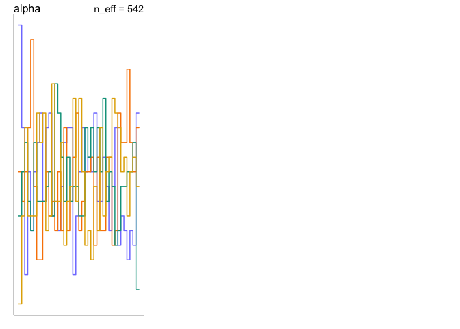

```r
library(rethinking)
```

```
## Loading required package: rstan
```

```
## Loading required package: StanHeaders
```

```
## Loading required package: ggplot2
```

```
## rstan (Version 2.19.2, GitRev: 2e1f913d3ca3)
```

```
## For execution on a local, multicore CPU with excess RAM we recommend calling
## options(mc.cores = parallel::detectCores()).
## To avoid recompilation of unchanged Stan programs, we recommend calling
## rstan_options(auto_write = TRUE)
```

```
## Loading required package: parallel
```

```
## Loading required package: dagitty
```

```
## rethinking (Version 1.90)
```

```r
library(tidyverse)
```

```
## ── Attaching packages ────────────
```

```
## ✔ tibble  2.1.3     ✔ purrr   0.3.2
## ✔ tidyr   1.0.0     ✔ dplyr   0.8.3
## ✔ readr   1.3.1     ✔ stringr 1.4.0
## ✔ tibble  2.1.3     ✔ forcats 0.4.0
```

```
## ── Conflicts ─────────────────────
## ✖ tidyr::extract() masks rstan::extract()
## ✖ dplyr::filter()  masks stats::filter()
## ✖ dplyr::lag()     masks stats::lag()
## ✖ purrr::map()     masks rethinking::map()
```

# Problems

## 11E3
_When count data are zero-inflated, using a model that ignores zero-inflation will tend to induce which kind of inferential error?_

Will underestimate the rate of the event occuring.

## 11E4
_Over-dispersion is common in count data. Give an example of a natural process that might produce over-dispersed counts. Can you also give an example of a process that might produce under- dispersed counts?_

The rate of leaves falling off of a evergeen tree could be overdispersed if you did not take weather/wind conditions into account.

One would expect underdispersion to occur in a system that has a negative feedback loop (depending on the time delay)

## 11M3 (optional)

_Can you modify the derivation of the zero-inflated Poisson distribution (ZIPoisson) from the chapter to construct a zero-inflated binomial distribution?_

## 11H1

_In 2014, a paper was published that was entitled “Female hurricanes are deadlier than male hurricanes.” As the title suggests, the paper claimed that hurricanes with female names have caused greater loss of life, and the explanation given is that people unconsciously rate female hurricanes as less dangerous and so are less likely to evacuate._

_Statisticians severely criticized the paper after publication. Here, you’ll explore the complete data used in the paper and consider the hypothesis that hurricanes with female names are deadlier. _

_In this problem, you’ll focus on predicting deaths using femininity of each hurricane’s name._

_Fit and interpret the simplest possible model, a Poisson model of deaths using femininity as a predictor. You can use map or map2stan. Compare the model to an intercept-only Poisson model of deaths. How strong is the association between femininity of name and deaths? Which storms does the model fit (retrodict) well? Which storms does it fit poorly?_


```r
library(rethinking)
data(Hurricanes)
?Hurricanes
head(Hurricanes)
```

```
##       name year deaths category min_pressure damage_norm female femininity
## 1     Easy 1950      2        3          960        1590      1    6.77778
## 2     King 1950      4        3          955        5350      0    1.38889
## 3     Able 1952      3        1          985         150      0    3.83333
## 4  Barbara 1953      1        1          987          58      1    9.83333
## 5 Florence 1953      0        1          985          15      1    8.33333
## 6    Carol 1954     60        3          960       19321      1    8.11111
```


```r
Hurricanes %>%
  ggplot(aes(x=femininity, y=deaths)) +
  geom_point() +
  geom_smooth()
```

```
## `geom_smooth()` using method = 'loess' and formula 'y ~ x'
```

<!-- -->

```r
Hurricanes %>%
  ggplot(aes(x=femininity, y=deaths)) +
  geom_point() +
  geom_smooth() +
  scale_x_log10()
```

```
## `geom_smooth()` using method = 'loess' and formula 'y ~ x'
```

<!-- -->

Doesn't look very promising...

Prior predictions.  deaths can go higher, so should I modify alpha?

```r
curve(dlnorm(x, 0, 10), from=0, to=100, n=200)
curve(dlnorm(x, 3, .5), from=0, to=100, n=200, add=TRUE, col="blue")
curve(dlnorm(x, 3, 1), from=0, to=100, n=200, add=TRUE, col="red")
```

<!-- -->

But, we are really thinking about average rate of deaths, which is around 20, so seems OK

Intercept only model

```r
mh1 <- ulam(alist( 
  deaths ~ dpois(lambda),
  log(lambda) <- alpha,
  alpha ~ dnorm(3, .5)),
  data=Hurricanes,
  chains = 4,
  cores = 4,
  log_lik = TRUE)
```


```r
trankplot(mh1)
traceplot(mh1)
```

<!-- --><!-- -->


```r
precis(mh1)
```

```
##           mean         sd     5.5%    94.5%    n_eff     Rhat
## alpha 3.028115 0.02301902 2.991376 3.064096 606.5901 1.005308
```


```r
exp(3.03)
```

```
## [1] 20.69723
```

```r
mean(Hurricanes$deaths)
```

```
## [1] 20.65217
```


Model with feminity as predictor.  If I don't standardize femininity, what prior should I use?


```r
set.seed(10)
N <- 100
a <- rnorm( N , 3 , .5 )
b <- rnorm( N , 0 , 0.2 )
plot( NULL , xlim=c(1,10) , ylim=c(0,500) )
for ( i in 1:N ) curve( exp( a[i] + b[i]*x ) , add=TRUE , col=col.alpha("black",0.5) )
```

<!-- -->

Seems reasonable


```r
mh1.2 <- ulam(alist( 
  deaths ~ dpois(lambda),
  log(lambda) <- alpha + b*femininity,
  alpha ~ dnorm(3, .5),
  b ~ dnorm(0, 0.2)),
  data=Hurricanes,
  chains = 4,
  cores = 4,
  log_lik = TRUE)
```


```r
traceplot(mh1.2)
trankplot(mh1.2)
```

<!-- -->

```r
pairs(mh1.2)
```

<!-- --><!-- -->


```r
precis(mh1.2)
```

```
##             mean          sd       5.5%      94.5%    n_eff     Rhat
## alpha 2.50264632 0.065129170 2.39395539 2.59951615 477.5620 1.004621
## b     0.07362816 0.008112247 0.06175729 0.08753918 481.0118 1.004044
```


```r
compare(mh1, mh1.2)
```

```
##           WAIC     pWAIC    dWAIC       weight        SE      dSE
## mh1.2 4402.113 129.93623  0.00000 1.000000e+00  990.5732       NA
## mh1   4451.735  80.64279 49.62132 1.678293e-11 1076.3798 150.0824
```


While model h1.2 shows strong support for a non-zero beta (effect of feminity), it does not fit the data significantly better than the intercept only model.

## 11H2

_Counts are nearly always over-dispersed relative to Poisson. So fit a gamma-Poisson (aka negative-binomial) model to predict deaths using femininity. Show that the over-dispersed model no longer shows as precise a positive association between femininity and deaths, with an 89% interval that overlaps zero. Can you explain why the association diminished in strength?_


```r
mh2 <- ulam(alist( 
  deaths ~ dgampois(lambda, phi),
  log(lambda) <- alpha + b*femininity,
  alpha ~ dnorm(3, .5),
  b ~ dnorm(0, 0.2),
  phi ~ dexp(1)),
  data=Hurricanes,
  chains = 4,
  cores = 4,
  log_lik = TRUE)
```


```r
traceplot(mh2)
```

<!-- -->

```r
trankplot(mh2)
```

<!-- -->

```r
pairs(mh2)
```

<!-- -->


```r
precis(mh2)
```

```
##             mean         sd        5.5%     94.5%    n_eff     Rhat
## alpha 2.73898277 0.29078879  2.29324554 3.2179558 680.2881 1.000776
## b     0.04633343 0.03941750 -0.01467054 0.1112433 678.0920 1.000390
## phi   0.45291515 0.06049232  0.36480905 0.5547366 905.3345 1.001539
```

Now we are much less certain about `b` being positive.  The support interval crosses 0.


## 11H6

_The data in data(Fish) are records of visits to a national park. See ?Fish for details. The question of interest is how many fish an average visitor takes per hour, when fishing. The problem is that not everyone tried to fish, so the fish_caught numbers are zero-inflated. As with the monks example in the chapter, there is a process that determines who is fishing (working) and another process that determines fish per hour (manuscripts per day), conditional on fishing (working). We want to model both. Otherwise we’ll end up with an underestimate of rate of fish extraction from the park._

_You will model these data using zero-inflated Poisson GLMs. Predict fish_caught as a function of any of the other variables you think are relevant. One thing you must do, however, is use a proper Poisson offset/exposure in the Poisson portion of the zero-inflated model. Then use the hours variable to construct the offset. This will adjust the model for the differing amount of time individuals spent in the park._


```r
data(Fish)
?Fish
head(Fish)
```

```
##   fish_caught livebait camper persons child  hours
## 1           0        0      0       1     0 21.124
## 2           0        1      1       1     0  5.732
## 3           0        1      0       1     0  1.323
## 4           0        1      1       2     1  0.548
## 5           1        1      0       1     0  1.695
## 6           0        1      1       4     2  0.493
```

```r
summary(Fish)
```

```
##   fish_caught         livebait         camper         persons     
##  Min.   :  0.000   Min.   :0.000   Min.   :0.000   Min.   :1.000  
##  1st Qu.:  0.000   1st Qu.:1.000   1st Qu.:0.000   1st Qu.:2.000  
##  Median :  0.000   Median :1.000   Median :1.000   Median :2.000  
##  Mean   :  3.296   Mean   :0.864   Mean   :0.588   Mean   :2.528  
##  3rd Qu.:  2.000   3rd Qu.:1.000   3rd Qu.:1.000   3rd Qu.:4.000  
##  Max.   :149.000   Max.   :1.000   Max.   :1.000   Max.   :4.000  
##      child           hours        
##  Min.   :0.000   Min.   : 0.0040  
##  1st Qu.:0.000   1st Qu.: 0.2865  
##  Median :0.000   Median : 1.8315  
##  Mean   :0.684   Mean   : 5.5260  
##  3rd Qu.:1.000   3rd Qu.: 7.3427  
##  Max.   :3.000   Max.   :71.0360
```

Livebait could be important as could child, and, of course, persons.  If I am including children then persons should get split into adults, because otherwise children are getting counted twice.

First fit this without ZI:


```r
f <- Fish
f$log_hours <- log(f$hours)
f$adults <- f$persons - f$child
mh6.1 <- ulam(alist(
  fish_caught ~ dpois(lambda),
  log(lambda) <- log_hours + a + bLive*livebait + bAdult*adults + bChild*child,
  a ~ dnorm(3, .5),
  c(bLive, bAdult, bChild) ~ dnorm(0, .5)),
  data = f,
  chains = 4,
  cores = 4,
  log_lik = TRUE)
```


```r
traceplot(mh6.1)
trankplot(mh6.1)
```

<!-- -->

```r
pairs(mh6.1)
```

<!-- --><!-- -->


```r
precis(mh6.1)
```

```
##              mean         sd       5.5%      94.5%     n_eff     Rhat
## a      -3.2658688 0.15793225 -3.5198870 -3.0105734  890.3824 1.003381
## bChild  1.1787026 0.08444149  1.0410730  1.3082568  930.9046 1.002783
## bAdult  0.7427879 0.03342437  0.6900491  0.7968823 1133.5761 1.002995
## bLive   0.7070584 0.13925089  0.4795133  0.9251886 1119.2915 1.000695
```


Now the zero inflated

```r
mh6.2 <- ulam(alist(
  fish_caught ~ dzipois(p, lambda),
  logit(p) <- ap,
  log(lambda) <- log_hours + a + bLive*livebait + bAdult*adults + bChild*child,
  ap ~ dnorm(0, 1.5),
  a ~ dnorm(3, .5),
  c(bLive, bAdult, bChild) ~ dnorm(0, .5)),
  data = f,
  chains = 4,
  cores = 4,
  log_lik = TRUE)
```


```r
traceplot(mh6.2)
trankplot(mh6.2)
```

<!-- -->

```r
pairs(mh6.2)
```

<!-- --><!-- -->

```r
precis(mh6.1)
```

```
##              mean         sd       5.5%      94.5%     n_eff     Rhat
## a      -3.2658688 0.15793225 -3.5198870 -3.0105734  890.3824 1.003381
## bChild  1.1787026 0.08444149  1.0410730  1.3082568  930.9046 1.002783
## bAdult  0.7427879 0.03342437  0.6900491  0.7968823 1133.5761 1.002995
## bLive   0.7070584 0.13925089  0.4795133  0.9251886 1119.2915 1.000695
```


```r
precis(mh6.2)
```

```
##              mean         sd       5.5%      94.5%     n_eff      Rhat
## ap     -1.0633963 0.22373677 -1.4231959 -0.7040675 1721.7949 1.0001357
## a      -2.4434254 0.18324212 -2.7407414 -2.1491555  835.4728 0.9997538
## bChild  1.0640210 0.08888972  0.9204019  1.2026992 1292.0125 1.0017214
## bAdult  0.5678115 0.03805441  0.5076698  0.6309709 1104.9875 0.9996353
## bLive   0.5637760 0.15006950  0.3247237  0.8081070 1132.4662 1.0025277
```


```r
inv_logit(-1.07) # estimate 25% of parties don't fish
```

```
## [1] 0.2554031
```

```r
exp(-2.45) # average fish caught per hour at intercept condition.  Hmm this should be 0.  Center predictors?
```

```
## [1] 0.08629359
```

```r
exp(-2.45+.57) # acerage fish caught per hour by adult
```

```
## [1] 0.1525901
```

Let's look at predictions


```r
pred1 <- link(mh6.1)
pred2 <- link(mh6.2)
pred2_fish <- pred2$lambda*pred2$p[,1] # have to multiple fishing success by probability of fishing
pred_obs <- as_tibble(
  cbind(f, 
        pred1=colMeans(pred1),
        pred2=colMeans(pred2_fish),
        low.89.1=apply(pred1,2,HPDI)[1,],
        high.89.1=apply(pred1,2,HPDI)[2,],
        low.89.2=apply(pred2_fish,2,HPDI)[1,],
        high.89.2=apply(pred2_fish,2,HPDI)[2,]))
head(pred_obs)
```

```
## # A tibble: 6 x 14
##   fish_caught livebait camper persons child  hours log_hours adults pred1
##         <int>    <int>  <int>   <int> <int>  <dbl>     <dbl>  <int> <dbl>
## 1           0        0      0       1     0 21.1       3.05       1 1.71 
## 2           0        1      1       1     0  5.73      1.75       1 0.936
## 3           0        1      0       1     0  1.32      0.280      1 0.216
## 4           0        1      1       2     1  0.548    -0.601      1 0.291
## 5           1        1      0       1     0  1.70      0.528      1 0.277
## 6           0        1      1       4     2  0.493    -0.707      2 1.80 
## # … with 5 more variables: pred2 <dbl>, low.89.1 <dbl>, high.89.1 <dbl>,
## #   low.89.2 <dbl>, high.89.2 <dbl>
```


```r
pl <- pred_obs %>% 
  select(fish_caught, ends_with("1"), ends_with("2")) %>%
  gather(key="model", value="predicted", pred1, pred2) %>%
  ggplot(aes(x=fish_caught, y=predicted, color=model)) +
  geom_point(alpha=.5) +
  geom_abline(intercept=0, slope=1) +
  coord_fixed() +
  facet_wrap(~model)
pl
```

<!-- -->


```r
pl + coord_cartesian(xlim=c(0,50))
```

```
## Coordinate system already present. Adding new coordinate system, which will replace the existing one.
```

<!-- -->


```r
f %>% arrange(desc(fish_caught)) %>% head(20)
```

```
##    fish_caught livebait camper persons child  hours  log_hours adults
## 1          149        1      1       4     0 35.592  3.5721209      4
## 2           65        1      1       4     0  3.905  1.3622578      4
## 3           38        1      1       4     0  3.285  1.1893667      4
## 4           32        1      1       4     0 10.545  2.3556518      4
## 5           32        1      1       4     0 12.781  2.5479597      4
## 6           31        1      0       3     1  2.017  0.7016113      2
## 7           30        1      1       3     0  4.269  1.4513796      3
## 8           29        1      0       4     0  2.364  0.8603551      4
## 9           22        1      1       4     0  4.552  1.5155667      4
## 10          21        1      1       2     0 11.812  2.4691160      2
## 11          21        1      1       2     0  3.658  1.2969165      2
## 12          16        1      1       4     1  2.586  0.9501123      3
## 13          15        1      1       3     0 13.864  2.6292956      3
## 14          15        1      0       3     0  1.460  0.3784364      3
## 15          14        1      1       4     1  0.229 -1.4740333      3
## 16          13        1      1       4     0  5.241  1.6565123      4
## 17          11        1      1       4     0 33.394  3.5083762      4
## 18          10        1      1       3     0 13.179  2.5786247      3
## 19           9        1      0       3     0 14.755  2.6915820      3
## 20           9        1      0       2     0 11.008  2.3986223      2
```


# Book Code


```r
## R code 12.1
pbar <- 0.5
theta <- 5
curve( dbeta2(x,pbar,theta) , from=0 , to=1 ,
       xlab="probability" , ylab="Density" )
```


```r
## R code 12.2
library(rethinking)
data(UCBadmit)
d <- UCBadmit
d$gid <- ifelse( d$applicant.gender=="male" , 1L , 2L )
dat <- list( A=d$admit , N=d$applications , gid=d$gid )
m12.1 <- ulam(
  alist(
    A ~ dbetabinom( N , pbar , theta ),
    logit(pbar) <- a[gid],
    a[gid] ~ dnorm( 0 , 1.5 ),
    theta ~ dexp(1)
  ), data=dat , chains=4 )
```


```r
## R code 12.3
post <- extract.samples( m12.1 )
post$da <- post$a[,1] - post$a[,2]
precis( post , depth=2 )
```


```r
## R code 12.4
gid <- 2
# draw posterior mean beta distribution
curve( dbeta2(x,mean(logistic(post$a[,gid])),mean(post$theta)) , from=0 , to=1 ,
       ylab="Density" , xlab="probability admit", ylim=c(0,3) , lwd=2 )

# draw 50 beta distributions sampled from posterior
for ( i in 1:50 ) {
  p <- logistic( post$a[i,gid] )
  theta <- post$theta[i]
  curve( dbeta2(x,p,theta) , add=TRUE , col=col.alpha("black",0.2) )
}
mtext( "distribution of female admission rates" )
```


```r
## R code 12.5
#postcheck( m12.1 )
```


```r
## R code 12.6
library(rethinking)
data(Kline)
d <- Kline
d$P <- standardize( log(d$population) )
d$contact_id <- ifelse( d$contact=="high" , 2L , 1L )

dat2 <- list(
  T = d$total_tools,
  P = d$population,
  cid = d$contact_id )

m12.3 <- ulam(
  alist(
    T ~ dgampois( lambda , phi ),
    lambda <- exp(a[cid])*P^b[cid] / g,
    a[cid] ~ dnorm(1,1),
    b[cid] ~ dexp(1),
    g ~ dexp(1),
    phi ~ dexp(1)
  ), data=dat2 , chains=4 , log_lik=TRUE )
```


```r
## R code 12.7
# define parameters
prob_drink <- 0.2 # 20% of days
rate_work <- 1    # average 1 manuscript per day

# sample one year of production
N <- 365

# simulate days monks drink
set.seed(365)
drink <- rbinom( N , 1 , prob_drink )

# simulate manuscripts completed
y <- (1-drink)*rpois( N , rate_work )
```


```r
## R code 12.8
simplehist( y , xlab="manuscripts completed" , lwd=4 )
zeros_drink <- sum(drink)
zeros_work <- sum(y==0 & drink==0)
zeros_total <- sum(y==0)
lines( c(0,0) , c(zeros_work,zeros_total) , lwd=4 , col=rangi2 )
```


```r
## R code 12.9
m12.4 <- ulam(
  alist(
    y ~ dzipois( p , lambda ),
    logit(p) <- ap,
    log(lambda) <- al,
    ap ~ dnorm( -1.5 , 1 ),
    al ~ dnorm( 1 , 0.5 )
  ) , data=list(y=as.integer(y)) , chains=4 )
precis( m12.4 )
```


```r
## R code 12.10
inv_logit(-1.28) # probability drink
exp(0.01)       # rate finish manuscripts, when not drinking

## R code 12.11
m12.4_alt <- ulam(
  alist(
    y|y>0 ~ custom( log1m(p) + poisson_lpmf(y|lambda) ),
    y|y==0 ~ custom( log_mix( p , 0 , poisson_lpmf(0|lambda) ) ),
    logit(p) <- ap,
    log(lambda) <- al,
    ap ~ dnorm(-1.5,1),
    al ~ dnorm(1,0.5)
  ) , data=list(y=as.integer(y)) , chains=4 )
```


```r
## R code 12.12
library(rethinking)
data(Trolley)
d <- Trolley

## R code 12.13
simplehist( d$response , xlim=c(1,7) , xlab="response" )

## R code 12.14
# discrete proportion of each response value
pr_k <- table( d$response ) / nrow(d)

# cumsum converts to cumulative proportions
cum_pr_k <- cumsum( pr_k )

# plot
plot( 1:7 , cum_pr_k , type="b" , xlab="response" ,
      ylab="cumulative proportion" , ylim=c(0,1) )

## R code 12.15
logit <- function(x) log(x/(1-x)) # convenience function
( lco <- logit( cum_pr_k ) )

## R code 12.16
m12.5 <- ulam(
  alist(
    R ~ dordlogit( 0 , cutpoints ),
    cutpoints ~ dnorm( 0 , 1.5 )
  ) ,
  data=list( R=d$response ), chains=4 , cores=3 )

## R code 12.17
m12.5q <- quap(
  alist(
    response ~ dordlogit( 0 , c(a1,a2,a3,a4,a5,a6) ),
    c(a1,a2,a3,a4,a5,a6) ~ dnorm( 0 , 1.5 )
  ) , data=d ,
  start=list(a1=-2,a2=-1,a3=0,a4=1,a5=2,a6=2.5) )

## R code 12.18
precis( m12.5 , depth=2 )

## R code 12.19
inv_logit(coef(m12.5))

## R code 12.20
( pk <- dordlogit( 1:7 , 0 , coef(m12.5) ) )

## R code 12.21
sum( pk*(1:7) )

## R code 12.22
( pk <- dordlogit( 1:7 , 0 , coef(m12.5)-0.5 ) )

## R code 12.23
sum( pk*(1:7) )

## R code 12.24
dat <- list(
  R = d$response,
  A = d$action,
  I = d$intention,
  C = d$contact )
m12.6 <- ulam(
  alist(
    R ~ dordlogit( phi , cutpoints ),
    phi <- bA*A + bC*C + BI*I ,
    BI <- bI + bIA*A + bIC*C ,
    c(bA,bI,bC,bIA,bIC) ~ dnorm( 0 , 0.5 ),
    cutpoints ~ dnorm( 0 , 1.5 )
  ) , data=dat , chains=4 , cores=4 )
precis( m12.6 )

## R code 12.25
plot( precis(m12.6) , xlim=c(-1.4,0) )

## R code 12.26
plot( NULL , type="n" , xlab="intention" , ylab="probability" ,
      xlim=c(0,1) , ylim=c(0,1) , xaxp=c(0,1,1) , yaxp=c(0,1,2) )

## R code 12.27
kA <- 0     # value for action
kC <- 0     # value for contact
kI <- 0:1   # values of intention to calculate over
pdat <- data.frame(A=kA,C=kC,I=kI)
phi <- link( m12.6 , data=pdat )$phi

## R code 12.28
post <- extract.samples( m12.6 )
for ( s in 1:50 ) {
  pk <- pordlogit( 1:6 , phi[s,] , post$cutpoints[s,] )
  for ( i in 1:6 ) lines( kI , pk[,i] , col=col.alpha("black",0.1) )
}

## R code 12.29
kA <- 0     # value for action
kC <- 1     # value for contact
kI <- 0:1   # values of intention to calculate over
pdat <- data.frame(A=kA,C=kC,I=kI)
s <- sim( m12.6 , data=pdat )
simplehist( s , xlab="response" )

## R code 12.30
library(rethinking)
data(Trolley)
d <- Trolley
levels(d$edu)

## R code 12.31
edu_levels <- c( 6 , 1 , 8 , 4 , 7 , 2 , 5 , 3 )
d$edu_new <- edu_levels[ d$edu ]

## R code 12.32
library(gtools)
set.seed(1805)
delta <- rdirichlet( 10 , alpha=rep(2,7) )
str(delta)

## R code 12.33
h <- 3
plot( NULL , xlim=c(1,7) , ylim=c(0,0.4) , xlab="index" , ylab="probability" )
for ( i in 1:nrow(delta) ) lines( 1:7 , delta[i,] , type="b" ,
                                  pch=ifelse(i==h,16,1) , lwd=ifelse(i==h,4,1.5) ,
                                  col=ifelse(i==h,"black",col.alpha("black",0.7)) )

## R code 12.34
dat <- list(
  R = d$response ,
  action = d$action,
  intention = d$intention,
  contact = d$contact,
  E = as.integer( d$edu_new ), # edu_new as an index
  alpha = rep(2,7) )           # delta prior

m12.5 <- ulam(
  alist(
    R ~ ordered_logistic( phi , kappa ),
    phi <- bE*sum( delta_j[1:E] ) + bA*action + bI*intention + bC*contact,
    kappa ~ normal( 0 , 1.5 ),
    c(bA,bI,bC,bE) ~ normal( 0 , 1 ),
    vector[8]: delta_j <<- append_row( 0 , delta ),
    simplex[7]: delta ~ dirichlet( alpha )
  ),
  data=dat , chains=3 , cores=3 )

## R code 12.35
precis( m12.5 , depth=2 , omit="cutpoints" )

## R code 12.36
delta_labels <- c("Elem","MidSch","SHS","HSG","SCol","Bach","Mast","Grad")
pairs( m12.5 , pars="delta" , labels=delta_labels )

## R code 12.37
dat$edu_norm <- normalize( d$edu_new )
m12.6 <- ulam(
  alist(
    y ~ ordered_logistic( mu , cutpoints ),
    mu <- bE*edu_norm + bA*action + bI*intention + bC*contact,
    c(bA,bI,bC,bE) ~ normal( 0 , 1 ),
    cutpoints ~ normal( 0 , 1.5 )
  ), data=dat , chains=3 , cores=3 )
precis( m12.6 )

## R code 12.38
library(rethinking)
data(Hurricanes)
```

