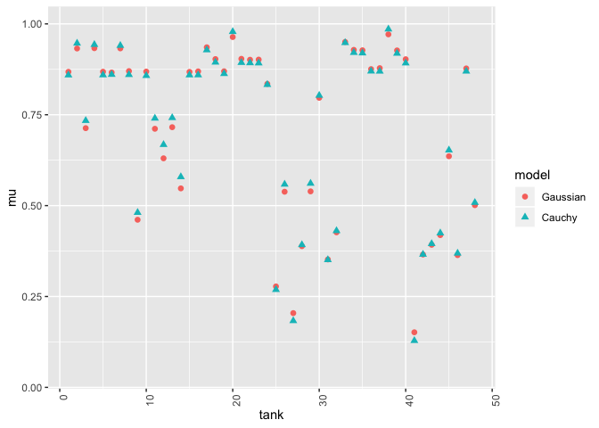
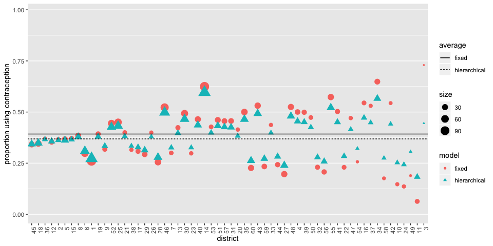

# Problems


## 12E1

_12E1. Which of the following priors will produce more shrinkage in the estimates? (a) αtank ∼
Normal(0, 1); (b) αtank ∼ Normal(0, 2)._

αtank ∼ Normal(0, 1)

## 12E2

_Make the following model into a multilevel model._

Old:
yi ∼ Binomial(1, pi)  
logit(pi) = αgroup[i] + βxi   
αgroup ∼ Normal(0, 1.5)  
β ∼ Normal(0, 1)

New:
yi ∼ Binomial(1, pi)  
logit(pi) = αgroup[i] + βxi   
αgroup ∼ Normal(a_bar, sigma)  
a_bar ~ Normal(0, 1.5)  
sigma ~ dexp(0,1)  
β ∼ Normal(0, 1)


## 12E3

_Make the following model into a multilevel model._

yi ∼ Normal(μi, σ)  
μi = αgroup[i] + βxi  
αgroup ∼ Normal(a_bar, sigma)  
a_bar ~ Normal(0, 10)  
sigma ~ dexp(1)  
β ∼ Normal(0, 1)  
σ ∼ HalfCauchy(0, 2)

## 12M1

_Revisit the Reed frog survival data, data(reedfrogs), and add the predation and size treatment variables to the varying intercepts model. Consider models with either main effect alone, both main effects, as well as a model including both and their interaction. Instead of focusing on inferences about these two predictor variables, focus on the inferred variation across tanks. Explain why it changes as it does across models._


```r
library(rethinking)
```

```
## Loading required package: rstan
```

```
## Loading required package: StanHeaders
```

```
## Loading required package: ggplot2
```

```
## rstan (Version 2.19.2, GitRev: 2e1f913d3ca3)
```

```
## For execution on a local, multicore CPU with excess RAM we recommend calling
## options(mc.cores = parallel::detectCores()).
## To avoid recompilation of unchanged Stan programs, we recommend calling
## rstan_options(auto_write = TRUE)
```

```
## Loading required package: parallel
```

```
## Loading required package: dagitty
```

```
## rethinking (Version 1.93)
```

```
## 
## Attaching package: 'rethinking'
```

```
## The following object is masked from 'package:stats':
## 
##     rstudent
```

```r
library(tidyverse)
```

```
## ── Attaching packages ───────────────────── tidyverse 1.3.0 ──
```

```
## ✓ tibble  2.1.3     ✓ dplyr   0.8.3
## ✓ tidyr   1.0.0     ✓ stringr 1.4.0
## ✓ readr   1.3.1     ✓ forcats 0.4.0
## ✓ purrr   0.3.3
```

```
## ── Conflicts ──────────────────────── tidyverse_conflicts() ──
## x tidyr::extract() masks rstan::extract()
## x dplyr::filter()  masks stats::filter()
## x dplyr::lag()     masks stats::lag()
## x purrr::map()     masks rethinking::map()
```

```r
data(reedfrogs)
d <- reedfrogs
str(d)
```

```
## 'data.frame':	48 obs. of  5 variables:
##  $ density : int  10 10 10 10 10 10 10 10 10 10 ...
##  $ pred    : Factor w/ 2 levels "no","pred": 1 1 1 1 1 1 1 1 2 2 ...
##  $ size    : Factor w/ 2 levels "big","small": 1 1 1 1 2 2 2 2 1 1 ...
##  $ surv    : int  9 10 7 10 9 9 10 9 4 9 ...
##  $ propsurv: num  0.9 1 0.7 1 0.9 0.9 1 0.9 0.4 0.9 ...
```

```r
# make the tank cluster variable
d$tank <- 1:nrow(d)
```

orignal

```r
dat <- list(
  S = d$surv,
  N = d$density,
  tank = d$tank
)

m12M1a <- ulam(
  alist(
    S ~ dbinom( N , p ) ,
    logit(p) <- a[tank] ,
    a[tank] ~ dnorm( a_bar , sigma ) ,
    a_bar ~ dnorm( 0 , 1.5 ) ,
    sigma ~ dexp( 1 )
  ), data=dat , chains=4 , log_lik=TRUE )
```

```
## 
## SAMPLING FOR MODEL '71890fa4702bb6983de3ea7367f0b982' NOW (CHAIN 1).
## Chain 1: 
## Chain 1: Gradient evaluation took 3e-05 seconds
## Chain 1: 1000 transitions using 10 leapfrog steps per transition would take 0.3 seconds.
## Chain 1: Adjust your expectations accordingly!
## Chain 1: 
## Chain 1: 
## Chain 1: Iteration:   1 / 1000 [  0%]  (Warmup)
## Chain 1: Iteration: 100 / 1000 [ 10%]  (Warmup)
## Chain 1: Iteration: 200 / 1000 [ 20%]  (Warmup)
## Chain 1: Iteration: 300 / 1000 [ 30%]  (Warmup)
## Chain 1: Iteration: 400 / 1000 [ 40%]  (Warmup)
## Chain 1: Iteration: 500 / 1000 [ 50%]  (Warmup)
## Chain 1: Iteration: 501 / 1000 [ 50%]  (Sampling)
## Chain 1: Iteration: 600 / 1000 [ 60%]  (Sampling)
## Chain 1: Iteration: 700 / 1000 [ 70%]  (Sampling)
## Chain 1: Iteration: 800 / 1000 [ 80%]  (Sampling)
## Chain 1: Iteration: 900 / 1000 [ 90%]  (Sampling)
## Chain 1: Iteration: 1000 / 1000 [100%]  (Sampling)
## Chain 1: 
## Chain 1:  Elapsed Time: 0.196689 seconds (Warm-up)
## Chain 1:                0.136419 seconds (Sampling)
## Chain 1:                0.333108 seconds (Total)
## Chain 1: 
## 
## SAMPLING FOR MODEL '71890fa4702bb6983de3ea7367f0b982' NOW (CHAIN 2).
## Chain 2: 
## Chain 2: Gradient evaluation took 1.8e-05 seconds
## Chain 2: 1000 transitions using 10 leapfrog steps per transition would take 0.18 seconds.
## Chain 2: Adjust your expectations accordingly!
## Chain 2: 
## Chain 2: 
## Chain 2: Iteration:   1 / 1000 [  0%]  (Warmup)
## Chain 2: Iteration: 100 / 1000 [ 10%]  (Warmup)
## Chain 2: Iteration: 200 / 1000 [ 20%]  (Warmup)
## Chain 2: Iteration: 300 / 1000 [ 30%]  (Warmup)
## Chain 2: Iteration: 400 / 1000 [ 40%]  (Warmup)
## Chain 2: Iteration: 500 / 1000 [ 50%]  (Warmup)
## Chain 2: Iteration: 501 / 1000 [ 50%]  (Sampling)
## Chain 2: Iteration: 600 / 1000 [ 60%]  (Sampling)
## Chain 2: Iteration: 700 / 1000 [ 70%]  (Sampling)
## Chain 2: Iteration: 800 / 1000 [ 80%]  (Sampling)
## Chain 2: Iteration: 900 / 1000 [ 90%]  (Sampling)
## Chain 2: Iteration: 1000 / 1000 [100%]  (Sampling)
## Chain 2: 
## Chain 2:  Elapsed Time: 0.132354 seconds (Warm-up)
## Chain 2:                0.091656 seconds (Sampling)
## Chain 2:                0.22401 seconds (Total)
## Chain 2: 
## 
## SAMPLING FOR MODEL '71890fa4702bb6983de3ea7367f0b982' NOW (CHAIN 3).
## Chain 3: 
## Chain 3: Gradient evaluation took 1.2e-05 seconds
## Chain 3: 1000 transitions using 10 leapfrog steps per transition would take 0.12 seconds.
## Chain 3: Adjust your expectations accordingly!
## Chain 3: 
## Chain 3: 
## Chain 3: Iteration:   1 / 1000 [  0%]  (Warmup)
## Chain 3: Iteration: 100 / 1000 [ 10%]  (Warmup)
## Chain 3: Iteration: 200 / 1000 [ 20%]  (Warmup)
## Chain 3: Iteration: 300 / 1000 [ 30%]  (Warmup)
## Chain 3: Iteration: 400 / 1000 [ 40%]  (Warmup)
## Chain 3: Iteration: 500 / 1000 [ 50%]  (Warmup)
## Chain 3: Iteration: 501 / 1000 [ 50%]  (Sampling)
## Chain 3: Iteration: 600 / 1000 [ 60%]  (Sampling)
## Chain 3: Iteration: 700 / 1000 [ 70%]  (Sampling)
## Chain 3: Iteration: 800 / 1000 [ 80%]  (Sampling)
## Chain 3: Iteration: 900 / 1000 [ 90%]  (Sampling)
## Chain 3: Iteration: 1000 / 1000 [100%]  (Sampling)
## Chain 3: 
## Chain 3:  Elapsed Time: 0.12743 seconds (Warm-up)
## Chain 3:                0.090495 seconds (Sampling)
## Chain 3:                0.217925 seconds (Total)
## Chain 3: 
## 
## SAMPLING FOR MODEL '71890fa4702bb6983de3ea7367f0b982' NOW (CHAIN 4).
## Chain 4: 
## Chain 4: Gradient evaluation took 1.5e-05 seconds
## Chain 4: 1000 transitions using 10 leapfrog steps per transition would take 0.15 seconds.
## Chain 4: Adjust your expectations accordingly!
## Chain 4: 
## Chain 4: 
## Chain 4: Iteration:   1 / 1000 [  0%]  (Warmup)
## Chain 4: Iteration: 100 / 1000 [ 10%]  (Warmup)
## Chain 4: Iteration: 200 / 1000 [ 20%]  (Warmup)
## Chain 4: Iteration: 300 / 1000 [ 30%]  (Warmup)
## Chain 4: Iteration: 400 / 1000 [ 40%]  (Warmup)
## Chain 4: Iteration: 500 / 1000 [ 50%]  (Warmup)
## Chain 4: Iteration: 501 / 1000 [ 50%]  (Sampling)
## Chain 4: Iteration: 600 / 1000 [ 60%]  (Sampling)
## Chain 4: Iteration: 700 / 1000 [ 70%]  (Sampling)
## Chain 4: Iteration: 800 / 1000 [ 80%]  (Sampling)
## Chain 4: Iteration: 900 / 1000 [ 90%]  (Sampling)
## Chain 4: Iteration: 1000 / 1000 [100%]  (Sampling)
## Chain 4: 
## Chain 4:  Elapsed Time: 0.196862 seconds (Warm-up)
## Chain 4:                0.222593 seconds (Sampling)
## Chain 4:                0.419455 seconds (Total)
## Chain 4:
```


```r
dat <- list(
  S = d$surv,
  N = d$density,
  tank = d$tank,
  pred = ifelse(d$pred=="no", 0, 1)
)

m12M1_pred <- ulam(
  alist(
    S ~ dbinom( N , p ) ,
    logit(p) <- a[tank] + b_pred*pred,
    a[tank] ~ dnorm( a_bar , sigma ) ,
    a_bar ~ dnorm( 0 , 1.5 ) ,
    b_pred ~ dnorm(0, 1),
    sigma ~ dexp( 1 )
  ), data=dat , chains=4 , log_lik=TRUE, iter = 2000 )
```

```
## 
## SAMPLING FOR MODEL 'aa87ab538ed55c26c71a4153184c550c' NOW (CHAIN 1).
## Chain 1: 
## Chain 1: Gradient evaluation took 2.4e-05 seconds
## Chain 1: 1000 transitions using 10 leapfrog steps per transition would take 0.24 seconds.
## Chain 1: Adjust your expectations accordingly!
## Chain 1: 
## Chain 1: 
## Chain 1: Iteration:    1 / 2000 [  0%]  (Warmup)
## Chain 1: Iteration:  200 / 2000 [ 10%]  (Warmup)
## Chain 1: Iteration:  400 / 2000 [ 20%]  (Warmup)
## Chain 1: Iteration:  600 / 2000 [ 30%]  (Warmup)
## Chain 1: Iteration:  800 / 2000 [ 40%]  (Warmup)
## Chain 1: Iteration: 1000 / 2000 [ 50%]  (Warmup)
## Chain 1: Iteration: 1001 / 2000 [ 50%]  (Sampling)
## Chain 1: Iteration: 1200 / 2000 [ 60%]  (Sampling)
## Chain 1: Iteration: 1400 / 2000 [ 70%]  (Sampling)
## Chain 1: Iteration: 1600 / 2000 [ 80%]  (Sampling)
## Chain 1: Iteration: 1800 / 2000 [ 90%]  (Sampling)
## Chain 1: Iteration: 2000 / 2000 [100%]  (Sampling)
## Chain 1: 
## Chain 1:  Elapsed Time: 0.287068 seconds (Warm-up)
## Chain 1:                0.226273 seconds (Sampling)
## Chain 1:                0.513341 seconds (Total)
## Chain 1: 
## 
## SAMPLING FOR MODEL 'aa87ab538ed55c26c71a4153184c550c' NOW (CHAIN 2).
## Chain 2: 
## Chain 2: Gradient evaluation took 1.4e-05 seconds
## Chain 2: 1000 transitions using 10 leapfrog steps per transition would take 0.14 seconds.
## Chain 2: Adjust your expectations accordingly!
## Chain 2: 
## Chain 2: 
## Chain 2: Iteration:    1 / 2000 [  0%]  (Warmup)
## Chain 2: Iteration:  200 / 2000 [ 10%]  (Warmup)
## Chain 2: Iteration:  400 / 2000 [ 20%]  (Warmup)
## Chain 2: Iteration:  600 / 2000 [ 30%]  (Warmup)
## Chain 2: Iteration:  800 / 2000 [ 40%]  (Warmup)
## Chain 2: Iteration: 1000 / 2000 [ 50%]  (Warmup)
## Chain 2: Iteration: 1001 / 2000 [ 50%]  (Sampling)
## Chain 2: Iteration: 1200 / 2000 [ 60%]  (Sampling)
## Chain 2: Iteration: 1400 / 2000 [ 70%]  (Sampling)
## Chain 2: Iteration: 1600 / 2000 [ 80%]  (Sampling)
## Chain 2: Iteration: 1800 / 2000 [ 90%]  (Sampling)
## Chain 2: Iteration: 2000 / 2000 [100%]  (Sampling)
## Chain 2: 
## Chain 2:  Elapsed Time: 0.340266 seconds (Warm-up)
## Chain 2:                0.214451 seconds (Sampling)
## Chain 2:                0.554717 seconds (Total)
## Chain 2: 
## 
## SAMPLING FOR MODEL 'aa87ab538ed55c26c71a4153184c550c' NOW (CHAIN 3).
## Chain 3: 
## Chain 3: Gradient evaluation took 1.6e-05 seconds
## Chain 3: 1000 transitions using 10 leapfrog steps per transition would take 0.16 seconds.
## Chain 3: Adjust your expectations accordingly!
## Chain 3: 
## Chain 3: 
## Chain 3: Iteration:    1 / 2000 [  0%]  (Warmup)
## Chain 3: Iteration:  200 / 2000 [ 10%]  (Warmup)
## Chain 3: Iteration:  400 / 2000 [ 20%]  (Warmup)
## Chain 3: Iteration:  600 / 2000 [ 30%]  (Warmup)
## Chain 3: Iteration:  800 / 2000 [ 40%]  (Warmup)
## Chain 3: Iteration: 1000 / 2000 [ 50%]  (Warmup)
## Chain 3: Iteration: 1001 / 2000 [ 50%]  (Sampling)
## Chain 3: Iteration: 1200 / 2000 [ 60%]  (Sampling)
## Chain 3: Iteration: 1400 / 2000 [ 70%]  (Sampling)
## Chain 3: Iteration: 1600 / 2000 [ 80%]  (Sampling)
## Chain 3: Iteration: 1800 / 2000 [ 90%]  (Sampling)
## Chain 3: Iteration: 2000 / 2000 [100%]  (Sampling)
## Chain 3: 
## Chain 3:  Elapsed Time: 0.303721 seconds (Warm-up)
## Chain 3:                0.238765 seconds (Sampling)
## Chain 3:                0.542486 seconds (Total)
## Chain 3: 
## 
## SAMPLING FOR MODEL 'aa87ab538ed55c26c71a4153184c550c' NOW (CHAIN 4).
## Chain 4: 
## Chain 4: Gradient evaluation took 1.3e-05 seconds
## Chain 4: 1000 transitions using 10 leapfrog steps per transition would take 0.13 seconds.
## Chain 4: Adjust your expectations accordingly!
## Chain 4: 
## Chain 4: 
## Chain 4: Iteration:    1 / 2000 [  0%]  (Warmup)
## Chain 4: Iteration:  200 / 2000 [ 10%]  (Warmup)
## Chain 4: Iteration:  400 / 2000 [ 20%]  (Warmup)
## Chain 4: Iteration:  600 / 2000 [ 30%]  (Warmup)
## Chain 4: Iteration:  800 / 2000 [ 40%]  (Warmup)
## Chain 4: Iteration: 1000 / 2000 [ 50%]  (Warmup)
## Chain 4: Iteration: 1001 / 2000 [ 50%]  (Sampling)
## Chain 4: Iteration: 1200 / 2000 [ 60%]  (Sampling)
## Chain 4: Iteration: 1400 / 2000 [ 70%]  (Sampling)
## Chain 4: Iteration: 1600 / 2000 [ 80%]  (Sampling)
## Chain 4: Iteration: 1800 / 2000 [ 90%]  (Sampling)
## Chain 4: Iteration: 2000 / 2000 [100%]  (Sampling)
## Chain 4: 
## Chain 4:  Elapsed Time: 0.325097 seconds (Warm-up)
## Chain 4:                0.308404 seconds (Sampling)
## Chain 4:                0.633501 seconds (Total)
## Chain 4:
```


```r
precis(m12M1_pred, depth = 2)
```

```
##              mean        sd        5.5%     94.5%     n_eff      Rhat
## a[1]    2.4591324 0.6868003  1.38741002  3.576655 3622.2866 0.9992610
## a[2]    2.9494307 0.7483510  1.84312318  4.202269 3063.7934 1.0017836
## a[3]    1.6863535 0.6203339  0.72453809  2.677431 2955.8394 1.0014602
## a[4]    2.9465731 0.7321893  1.79987125  4.122627 3289.5782 0.9992734
## a[5]    2.4655851 0.6967320  1.41055014  3.610224 4189.3361 0.9992898
## a[6]    2.4658830 0.6615723  1.42125186  3.524196 4075.4602 0.9993694
## a[7]    2.9359483 0.7404571  1.80747492  4.147557 2887.1451 0.9998130
## a[8]    2.4620877 0.6884033  1.37437873  3.595281 3832.4972 0.9999999
## a[9]    2.1965103 0.5768223  1.28040910  3.117884 1467.3008 1.0026351
## a[10]   3.5347146 0.6018344  2.60108525  4.535452 1790.8737 1.0003596
## a[11]   2.9719244 0.5689543  2.08171252  3.912435 1608.9204 1.0017561
## a[12]   2.7051067 0.5916773  1.79542011  3.664656 1392.1574 1.0005578
## a[13]   2.9550816 0.5798877  2.03265190  3.894736 1375.9258 1.0029552
## a[14]   2.4577953 0.5806957  1.53832800  3.384974 1434.8751 1.0021336
## a[15]   3.5508055 0.6192356  2.60586451  4.587951 1803.1425 0.9996693
## a[16]   3.5392516 0.6270197  2.58450297  4.567303 1737.9744 1.0008881
## a[17]   2.8810305 0.6094448  1.94813438  3.912312 2843.4286 0.9999668
## a[18]   2.5563395 0.5737219  1.68961876  3.501414 4055.6643 0.9995368
## a[19]   2.2670180 0.5369011  1.45045354  3.164633 3485.1749 0.9997313
## a[20]   3.2727395 0.6800229  2.26443467  4.417523 2635.9716 1.0012268
## a[21]   2.5474459 0.5698501  1.67668469  3.499468 3722.5079 0.9992950
## a[22]   2.5439363 0.5551793  1.69414610  3.444997 3544.6260 0.9994211
## a[23]   2.5402282 0.5724098  1.67124746  3.509777 3334.6663 0.9994759
## a[24]   2.0083244 0.4888913  1.26315622  2.797572 3738.9629 1.0008717
## a[25]   1.5283352 0.4825059  0.73541101  2.267604  992.7390 1.0037776
## a[26]   2.4985114 0.4558177  1.75611743  3.226188  983.2127 1.0031439
## a[27]   1.2117820 0.5112013  0.37792490  2.002536 1031.3639 1.0043015
## a[28]   1.9579766 0.4702821  1.18080428  2.700862  861.5955 1.0038656
## a[29]   2.4942732 0.4614963  1.75346911  3.210305  923.8483 1.0022945
## a[30]   3.4785076 0.4797506  2.73735684  4.252663 1188.0412 1.0010264
## a[31]   1.8221978 0.4697021  1.05702940  2.563950  791.3581 1.0050674
## a[32]   2.0907656 0.4637651  1.34047067  2.824913  869.5126 1.0030371
## a[33]   3.0599886 0.6107951  2.14137312  4.099614 2940.9563 1.0001637
## a[34]   2.7456364 0.5412002  1.91792325  3.655987 2809.9326 1.0015949
## a[35]   2.7610547 0.5458551  1.94262503  3.665487 3986.8678 1.0000664
## a[36]   2.2388511 0.4731947  1.51892148  3.002726 4966.4540 0.9996432
## a[37]   2.2571419 0.4773090  1.52770899  3.053663 4233.3501 1.0002702
## a[38]   3.4158950 0.6689528  2.41947321  4.563227 3189.9174 1.0006281
## a[39]   2.7411771 0.5362413  1.92311562  3.626552 3472.5917 0.9997377
## a[40]   2.4859722 0.4927202  1.72936084  3.300129 4015.6382 0.9996036
## a[41]   0.8805223 0.5013497  0.06024822  1.655143  900.5891 1.0043697
## a[42]   1.8680838 0.4345543  1.14546629  2.538888  759.7428 1.0050789
## a[43]   1.9664479 0.4353198  1.27140552  2.651228  767.8805 1.0036089
## a[44]   2.0738607 0.4173221  1.40489696  2.728853  768.9314 1.0032475
## a[45]   2.8677682 0.4268975  2.18923005  3.548865  759.4899 1.0039638
## a[46]   1.8630744 0.4366635  1.16269704  2.549777  777.9587 1.0049758
## a[47]   3.9750265 0.4941841  3.22081700  4.807156 1317.2750 1.0004346
## a[48]   2.3724356 0.4201336  1.70831678  3.030300  767.7870 1.0049313
## a_bar   2.5186881 0.2309149  2.15402072  2.889354  622.9332 1.0034115
## b_pred -2.4021236 0.2995116 -2.86821142 -1.909262  398.7277 1.0080903
## sigma   0.8255247 0.1436727  0.61350444  1.073442 1158.4691 1.0070359
```

```r
plot(m12M1_pred)
```

```
## 48 vector or matrix parameters hidden. Use depth=2 to show them.
```

<!-- -->


size model

```r
dat <- list(
  S = d$surv,
  N = d$density,
  tank = d$tank,
  sze = ifelse(d$size=="small", 0, 1)
)

str(dat)
```

```
## List of 4
##  $ S   : int [1:48] 9 10 7 10 9 9 10 9 4 9 ...
##  $ N   : int [1:48] 10 10 10 10 10 10 10 10 10 10 ...
##  $ tank: int [1:48] 1 2 3 4 5 6 7 8 9 10 ...
##  $ sze : num [1:48] 1 1 1 1 0 0 0 0 1 1 ...
```

```r
m12M1_size <- ulam(
  alist(
    S ~ dbinom( N , p ) ,
    logit(p) <- a[tank] + b_size*sze,
    a[tank] ~ dnorm( a_bar , sigma ) ,
    a_bar ~ dnorm( 0 , 1.5 ) ,
    b_size ~ dnorm(0, 1),
    sigma ~ dexp( 1 )
  ), data=dat , chains=4 , iter=4000, log_lik=TRUE )
```

```
## 
## SAMPLING FOR MODEL '17202027312df8570bfa43f2633214bb' NOW (CHAIN 1).
## Chain 1: 
## Chain 1: Gradient evaluation took 2.4e-05 seconds
## Chain 1: 1000 transitions using 10 leapfrog steps per transition would take 0.24 seconds.
## Chain 1: Adjust your expectations accordingly!
## Chain 1: 
## Chain 1: 
## Chain 1: Iteration:    1 / 4000 [  0%]  (Warmup)
## Chain 1: Iteration:  400 / 4000 [ 10%]  (Warmup)
## Chain 1: Iteration:  800 / 4000 [ 20%]  (Warmup)
## Chain 1: Iteration: 1200 / 4000 [ 30%]  (Warmup)
## Chain 1: Iteration: 1600 / 4000 [ 40%]  (Warmup)
## Chain 1: Iteration: 2000 / 4000 [ 50%]  (Warmup)
## Chain 1: Iteration: 2001 / 4000 [ 50%]  (Sampling)
## Chain 1: Iteration: 2400 / 4000 [ 60%]  (Sampling)
## Chain 1: Iteration: 2800 / 4000 [ 70%]  (Sampling)
## Chain 1: Iteration: 3200 / 4000 [ 80%]  (Sampling)
## Chain 1: Iteration: 3600 / 4000 [ 90%]  (Sampling)
## Chain 1: Iteration: 4000 / 4000 [100%]  (Sampling)
## Chain 1: 
## Chain 1:  Elapsed Time: 0.650641 seconds (Warm-up)
## Chain 1:                0.774605 seconds (Sampling)
## Chain 1:                1.42525 seconds (Total)
## Chain 1: 
## 
## SAMPLING FOR MODEL '17202027312df8570bfa43f2633214bb' NOW (CHAIN 2).
## Chain 2: 
## Chain 2: Gradient evaluation took 2.6e-05 seconds
## Chain 2: 1000 transitions using 10 leapfrog steps per transition would take 0.26 seconds.
## Chain 2: Adjust your expectations accordingly!
## Chain 2: 
## Chain 2: 
## Chain 2: Iteration:    1 / 4000 [  0%]  (Warmup)
## Chain 2: Iteration:  400 / 4000 [ 10%]  (Warmup)
## Chain 2: Iteration:  800 / 4000 [ 20%]  (Warmup)
## Chain 2: Iteration: 1200 / 4000 [ 30%]  (Warmup)
## Chain 2: Iteration: 1600 / 4000 [ 40%]  (Warmup)
## Chain 2: Iteration: 2000 / 4000 [ 50%]  (Warmup)
## Chain 2: Iteration: 2001 / 4000 [ 50%]  (Sampling)
## Chain 2: Iteration: 2400 / 4000 [ 60%]  (Sampling)
## Chain 2: Iteration: 2800 / 4000 [ 70%]  (Sampling)
## Chain 2: Iteration: 3200 / 4000 [ 80%]  (Sampling)
## Chain 2: Iteration: 3600 / 4000 [ 90%]  (Sampling)
## Chain 2: Iteration: 4000 / 4000 [100%]  (Sampling)
## Chain 2: 
## Chain 2:  Elapsed Time: 0.632131 seconds (Warm-up)
## Chain 2:                0.469359 seconds (Sampling)
## Chain 2:                1.10149 seconds (Total)
## Chain 2: 
## 
## SAMPLING FOR MODEL '17202027312df8570bfa43f2633214bb' NOW (CHAIN 3).
## Chain 3: 
## Chain 3: Gradient evaluation took 1.6e-05 seconds
## Chain 3: 1000 transitions using 10 leapfrog steps per transition would take 0.16 seconds.
## Chain 3: Adjust your expectations accordingly!
## Chain 3: 
## Chain 3: 
## Chain 3: Iteration:    1 / 4000 [  0%]  (Warmup)
## Chain 3: Iteration:  400 / 4000 [ 10%]  (Warmup)
## Chain 3: Iteration:  800 / 4000 [ 20%]  (Warmup)
## Chain 3: Iteration: 1200 / 4000 [ 30%]  (Warmup)
## Chain 3: Iteration: 1600 / 4000 [ 40%]  (Warmup)
## Chain 3: Iteration: 2000 / 4000 [ 50%]  (Warmup)
## Chain 3: Iteration: 2001 / 4000 [ 50%]  (Sampling)
## Chain 3: Iteration: 2400 / 4000 [ 60%]  (Sampling)
## Chain 3: Iteration: 2800 / 4000 [ 70%]  (Sampling)
## Chain 3: Iteration: 3200 / 4000 [ 80%]  (Sampling)
## Chain 3: Iteration: 3600 / 4000 [ 90%]  (Sampling)
## Chain 3: Iteration: 4000 / 4000 [100%]  (Sampling)
## Chain 3: 
## Chain 3:  Elapsed Time: 0.689629 seconds (Warm-up)
## Chain 3:                0.516615 seconds (Sampling)
## Chain 3:                1.20624 seconds (Total)
## Chain 3: 
## 
## SAMPLING FOR MODEL '17202027312df8570bfa43f2633214bb' NOW (CHAIN 4).
## Chain 4: 
## Chain 4: Gradient evaluation took 1.5e-05 seconds
## Chain 4: 1000 transitions using 10 leapfrog steps per transition would take 0.15 seconds.
## Chain 4: Adjust your expectations accordingly!
## Chain 4: 
## Chain 4: 
## Chain 4: Iteration:    1 / 4000 [  0%]  (Warmup)
## Chain 4: Iteration:  400 / 4000 [ 10%]  (Warmup)
## Chain 4: Iteration:  800 / 4000 [ 20%]  (Warmup)
## Chain 4: Iteration: 1200 / 4000 [ 30%]  (Warmup)
## Chain 4: Iteration: 1600 / 4000 [ 40%]  (Warmup)
## Chain 4: Iteration: 2000 / 4000 [ 50%]  (Warmup)
## Chain 4: Iteration: 2001 / 4000 [ 50%]  (Sampling)
## Chain 4: Iteration: 2400 / 4000 [ 60%]  (Sampling)
## Chain 4: Iteration: 2800 / 4000 [ 70%]  (Sampling)
## Chain 4: Iteration: 3200 / 4000 [ 80%]  (Sampling)
## Chain 4: Iteration: 3600 / 4000 [ 90%]  (Sampling)
## Chain 4: Iteration: 4000 / 4000 [100%]  (Sampling)
## Chain 4: 
## Chain 4:  Elapsed Time: 0.618293 seconds (Warm-up)
## Chain 4:                0.674582 seconds (Sampling)
## Chain 4:                1.29287 seconds (Total)
## Chain 4:
```


```r
precis(m12M1_size)
```

```
## 48 vector or matrix parameters hidden. Use depth=2 to show them.
```

```
##              mean        sd       5.5%     94.5%     n_eff     Rhat
## a_bar   1.4880629 0.3375462  0.9426560 2.0286841 1564.2553 1.000467
## b_size -0.2842944 0.4646782 -0.9977492 0.4708924  983.8116 1.001538
## sigma   1.6218643 0.2158522  1.3100961 1.9933574 4108.5082 1.000617
```


both size and pred

```r
dat <- list(
  S = d$surv,
  N = d$density,
  tank = d$tank,
  sze = ifelse(d$size=="small", 0, 1),
  pred = ifelse(d$pred=="no", 0, 1)
)

m12M1_both <- ulam(
  alist(
    S ~ dbinom( N , p ) ,
    logit(p) <- a[tank] + b_pred*pred + b_size*sze,
    a[tank] ~ dnorm( a_bar , sigma ) ,
    a_bar ~ dnorm( 0 , 1.5 ) ,
    b_pred ~ dnorm(0, 1),
    b_size ~ dnorm(0, 1),
    sigma ~ dexp( 1 )
  ), data=dat , chains=4 , log_lik=TRUE, iter=4000 )
```

```
## 
## SAMPLING FOR MODEL '09d2323bd23a1ccc5175483b3b026314' NOW (CHAIN 1).
## Chain 1: 
## Chain 1: Gradient evaluation took 3.8e-05 seconds
## Chain 1: 1000 transitions using 10 leapfrog steps per transition would take 0.38 seconds.
## Chain 1: Adjust your expectations accordingly!
## Chain 1: 
## Chain 1: 
## Chain 1: Iteration:    1 / 4000 [  0%]  (Warmup)
## Chain 1: Iteration:  400 / 4000 [ 10%]  (Warmup)
## Chain 1: Iteration:  800 / 4000 [ 20%]  (Warmup)
## Chain 1: Iteration: 1200 / 4000 [ 30%]  (Warmup)
## Chain 1: Iteration: 1600 / 4000 [ 40%]  (Warmup)
## Chain 1: Iteration: 2000 / 4000 [ 50%]  (Warmup)
## Chain 1: Iteration: 2001 / 4000 [ 50%]  (Sampling)
## Chain 1: Iteration: 2400 / 4000 [ 60%]  (Sampling)
## Chain 1: Iteration: 2800 / 4000 [ 70%]  (Sampling)
## Chain 1: Iteration: 3200 / 4000 [ 80%]  (Sampling)
## Chain 1: Iteration: 3600 / 4000 [ 90%]  (Sampling)
## Chain 1: Iteration: 4000 / 4000 [100%]  (Sampling)
## Chain 1: 
## Chain 1:  Elapsed Time: 0.65287 seconds (Warm-up)
## Chain 1:                0.467218 seconds (Sampling)
## Chain 1:                1.12009 seconds (Total)
## Chain 1: 
## 
## SAMPLING FOR MODEL '09d2323bd23a1ccc5175483b3b026314' NOW (CHAIN 2).
## Chain 2: 
## Chain 2: Gradient evaluation took 1.7e-05 seconds
## Chain 2: 1000 transitions using 10 leapfrog steps per transition would take 0.17 seconds.
## Chain 2: Adjust your expectations accordingly!
## Chain 2: 
## Chain 2: 
## Chain 2: Iteration:    1 / 4000 [  0%]  (Warmup)
## Chain 2: Iteration:  400 / 4000 [ 10%]  (Warmup)
## Chain 2: Iteration:  800 / 4000 [ 20%]  (Warmup)
## Chain 2: Iteration: 1200 / 4000 [ 30%]  (Warmup)
## Chain 2: Iteration: 1600 / 4000 [ 40%]  (Warmup)
## Chain 2: Iteration: 2000 / 4000 [ 50%]  (Warmup)
## Chain 2: Iteration: 2001 / 4000 [ 50%]  (Sampling)
## Chain 2: Iteration: 2400 / 4000 [ 60%]  (Sampling)
## Chain 2: Iteration: 2800 / 4000 [ 70%]  (Sampling)
## Chain 2: Iteration: 3200 / 4000 [ 80%]  (Sampling)
## Chain 2: Iteration: 3600 / 4000 [ 90%]  (Sampling)
## Chain 2: Iteration: 4000 / 4000 [100%]  (Sampling)
## Chain 2: 
## Chain 2:  Elapsed Time: 0.650214 seconds (Warm-up)
## Chain 2:                0.712065 seconds (Sampling)
## Chain 2:                1.36228 seconds (Total)
## Chain 2: 
## 
## SAMPLING FOR MODEL '09d2323bd23a1ccc5175483b3b026314' NOW (CHAIN 3).
## Chain 3: 
## Chain 3: Gradient evaluation took 1.9e-05 seconds
## Chain 3: 1000 transitions using 10 leapfrog steps per transition would take 0.19 seconds.
## Chain 3: Adjust your expectations accordingly!
## Chain 3: 
## Chain 3: 
## Chain 3: Iteration:    1 / 4000 [  0%]  (Warmup)
## Chain 3: Iteration:  400 / 4000 [ 10%]  (Warmup)
## Chain 3: Iteration:  800 / 4000 [ 20%]  (Warmup)
## Chain 3: Iteration: 1200 / 4000 [ 30%]  (Warmup)
## Chain 3: Iteration: 1600 / 4000 [ 40%]  (Warmup)
## Chain 3: Iteration: 2000 / 4000 [ 50%]  (Warmup)
## Chain 3: Iteration: 2001 / 4000 [ 50%]  (Sampling)
## Chain 3: Iteration: 2400 / 4000 [ 60%]  (Sampling)
## Chain 3: Iteration: 2800 / 4000 [ 70%]  (Sampling)
## Chain 3: Iteration: 3200 / 4000 [ 80%]  (Sampling)
## Chain 3: Iteration: 3600 / 4000 [ 90%]  (Sampling)
## Chain 3: Iteration: 4000 / 4000 [100%]  (Sampling)
## Chain 3: 
## Chain 3:  Elapsed Time: 0.611689 seconds (Warm-up)
## Chain 3:                0.585337 seconds (Sampling)
## Chain 3:                1.19703 seconds (Total)
## Chain 3: 
## 
## SAMPLING FOR MODEL '09d2323bd23a1ccc5175483b3b026314' NOW (CHAIN 4).
## Chain 4: 
## Chain 4: Gradient evaluation took 1.8e-05 seconds
## Chain 4: 1000 transitions using 10 leapfrog steps per transition would take 0.18 seconds.
## Chain 4: Adjust your expectations accordingly!
## Chain 4: 
## Chain 4: 
## Chain 4: Iteration:    1 / 4000 [  0%]  (Warmup)
## Chain 4: Iteration:  400 / 4000 [ 10%]  (Warmup)
## Chain 4: Iteration:  800 / 4000 [ 20%]  (Warmup)
## Chain 4: Iteration: 1200 / 4000 [ 30%]  (Warmup)
## Chain 4: Iteration: 1600 / 4000 [ 40%]  (Warmup)
## Chain 4: Iteration: 2000 / 4000 [ 50%]  (Warmup)
## Chain 4: Iteration: 2001 / 4000 [ 50%]  (Sampling)
## Chain 4: Iteration: 2400 / 4000 [ 60%]  (Sampling)
## Chain 4: Iteration: 2800 / 4000 [ 70%]  (Sampling)
## Chain 4: Iteration: 3200 / 4000 [ 80%]  (Sampling)
## Chain 4: Iteration: 3600 / 4000 [ 90%]  (Sampling)
## Chain 4: Iteration: 4000 / 4000 [100%]  (Sampling)
## Chain 4: 
## Chain 4:  Elapsed Time: 0.650412 seconds (Warm-up)
## Chain 4:                0.64184 seconds (Sampling)
## Chain 4:                1.29225 seconds (Total)
## Chain 4:
```


```r
precis(m12M1_both)
```

```
## 48 vector or matrix parameters hidden. Use depth=2 to show them.
```

```
##             mean        sd       5.5%       94.5%    n_eff     Rhat
## a_bar   2.704880 0.2616757  2.2849557  3.12134670 1053.147 1.001860
## b_pred -2.387739 0.2888676 -2.8474543 -1.91922079 1429.418 1.000812
## b_size -0.418927 0.2851242 -0.8712235  0.04358124 1802.190 1.001189
## sigma   0.782561 0.1468009  0.5660256  1.03211955 2054.049 1.000549
```


interaction

```r
dat <- list(
  S = d$surv,
  N = d$density,
  tank = d$tank,
  sze = ifelse(d$size=="small", 0, 1),
  pred = ifelse(d$pred=="no", 0, 1)
)

m12M1_int <- ulam(
  alist(
    S ~ dbinom( N , p ) ,
    logit(p) <- a[tank] + b_pred*pred + b_size*sze +b_int*pred*sze,
    a[tank] ~ dnorm( a_bar , sigma ) ,
    a_bar ~ dnorm( 0 , 1.5 ) ,
    b_pred ~ dnorm(0, 1),
    b_size ~ dnorm(0, 1),
    b_int ~ dnorm(0, .5),
    sigma ~ dexp( 1 )
  ), data=dat , chains=4 , log_lik=TRUE, iter=4000 )
```

```
## 
## SAMPLING FOR MODEL 'a9eacd23439d812f0f4b338d47f6c645' NOW (CHAIN 1).
## Chain 1: 
## Chain 1: Gradient evaluation took 7.8e-05 seconds
## Chain 1: 1000 transitions using 10 leapfrog steps per transition would take 0.78 seconds.
## Chain 1: Adjust your expectations accordingly!
## Chain 1: 
## Chain 1: 
## Chain 1: Iteration:    1 / 4000 [  0%]  (Warmup)
## Chain 1: Iteration:  400 / 4000 [ 10%]  (Warmup)
## Chain 1: Iteration:  800 / 4000 [ 20%]  (Warmup)
## Chain 1: Iteration: 1200 / 4000 [ 30%]  (Warmup)
## Chain 1: Iteration: 1600 / 4000 [ 40%]  (Warmup)
## Chain 1: Iteration: 2000 / 4000 [ 50%]  (Warmup)
## Chain 1: Iteration: 2001 / 4000 [ 50%]  (Sampling)
## Chain 1: Iteration: 2400 / 4000 [ 60%]  (Sampling)
## Chain 1: Iteration: 2800 / 4000 [ 70%]  (Sampling)
## Chain 1: Iteration: 3200 / 4000 [ 80%]  (Sampling)
## Chain 1: Iteration: 3600 / 4000 [ 90%]  (Sampling)
## Chain 1: Iteration: 4000 / 4000 [100%]  (Sampling)
## Chain 1: 
## Chain 1:  Elapsed Time: 0.835263 seconds (Warm-up)
## Chain 1:                1.01346 seconds (Sampling)
## Chain 1:                1.84872 seconds (Total)
## Chain 1: 
## 
## SAMPLING FOR MODEL 'a9eacd23439d812f0f4b338d47f6c645' NOW (CHAIN 2).
## Chain 2: 
## Chain 2: Gradient evaluation took 2.1e-05 seconds
## Chain 2: 1000 transitions using 10 leapfrog steps per transition would take 0.21 seconds.
## Chain 2: Adjust your expectations accordingly!
## Chain 2: 
## Chain 2: 
## Chain 2: Iteration:    1 / 4000 [  0%]  (Warmup)
## Chain 2: Iteration:  400 / 4000 [ 10%]  (Warmup)
## Chain 2: Iteration:  800 / 4000 [ 20%]  (Warmup)
## Chain 2: Iteration: 1200 / 4000 [ 30%]  (Warmup)
## Chain 2: Iteration: 1600 / 4000 [ 40%]  (Warmup)
## Chain 2: Iteration: 2000 / 4000 [ 50%]  (Warmup)
## Chain 2: Iteration: 2001 / 4000 [ 50%]  (Sampling)
## Chain 2: Iteration: 2400 / 4000 [ 60%]  (Sampling)
## Chain 2: Iteration: 2800 / 4000 [ 70%]  (Sampling)
## Chain 2: Iteration: 3200 / 4000 [ 80%]  (Sampling)
## Chain 2: Iteration: 3600 / 4000 [ 90%]  (Sampling)
## Chain 2: Iteration: 4000 / 4000 [100%]  (Sampling)
## Chain 2: 
## Chain 2:  Elapsed Time: 0.922945 seconds (Warm-up)
## Chain 2:                0.944726 seconds (Sampling)
## Chain 2:                1.86767 seconds (Total)
## Chain 2: 
## 
## SAMPLING FOR MODEL 'a9eacd23439d812f0f4b338d47f6c645' NOW (CHAIN 3).
## Chain 3: 
## Chain 3: Gradient evaluation took 1.9e-05 seconds
## Chain 3: 1000 transitions using 10 leapfrog steps per transition would take 0.19 seconds.
## Chain 3: Adjust your expectations accordingly!
## Chain 3: 
## Chain 3: 
## Chain 3: Iteration:    1 / 4000 [  0%]  (Warmup)
## Chain 3: Iteration:  400 / 4000 [ 10%]  (Warmup)
## Chain 3: Iteration:  800 / 4000 [ 20%]  (Warmup)
## Chain 3: Iteration: 1200 / 4000 [ 30%]  (Warmup)
## Chain 3: Iteration: 1600 / 4000 [ 40%]  (Warmup)
## Chain 3: Iteration: 2000 / 4000 [ 50%]  (Warmup)
## Chain 3: Iteration: 2001 / 4000 [ 50%]  (Sampling)
## Chain 3: Iteration: 2400 / 4000 [ 60%]  (Sampling)
## Chain 3: Iteration: 2800 / 4000 [ 70%]  (Sampling)
## Chain 3: Iteration: 3200 / 4000 [ 80%]  (Sampling)
## Chain 3: Iteration: 3600 / 4000 [ 90%]  (Sampling)
## Chain 3: Iteration: 4000 / 4000 [100%]  (Sampling)
## Chain 3: 
## Chain 3:  Elapsed Time: 0.880656 seconds (Warm-up)
## Chain 3:                0.689426 seconds (Sampling)
## Chain 3:                1.57008 seconds (Total)
## Chain 3: 
## 
## SAMPLING FOR MODEL 'a9eacd23439d812f0f4b338d47f6c645' NOW (CHAIN 4).
## Chain 4: 
## Chain 4: Gradient evaluation took 2e-05 seconds
## Chain 4: 1000 transitions using 10 leapfrog steps per transition would take 0.2 seconds.
## Chain 4: Adjust your expectations accordingly!
## Chain 4: 
## Chain 4: 
## Chain 4: Iteration:    1 / 4000 [  0%]  (Warmup)
## Chain 4: Iteration:  400 / 4000 [ 10%]  (Warmup)
## Chain 4: Iteration:  800 / 4000 [ 20%]  (Warmup)
## Chain 4: Iteration: 1200 / 4000 [ 30%]  (Warmup)
## Chain 4: Iteration: 1600 / 4000 [ 40%]  (Warmup)
## Chain 4: Iteration: 2000 / 4000 [ 50%]  (Warmup)
## Chain 4: Iteration: 2001 / 4000 [ 50%]  (Sampling)
## Chain 4: Iteration: 2400 / 4000 [ 60%]  (Sampling)
## Chain 4: Iteration: 2800 / 4000 [ 70%]  (Sampling)
## Chain 4: Iteration: 3200 / 4000 [ 80%]  (Sampling)
## Chain 4: Iteration: 3600 / 4000 [ 90%]  (Sampling)
## Chain 4: Iteration: 4000 / 4000 [100%]  (Sampling)
## Chain 4: 
## Chain 4:  Elapsed Time: 0.846339 seconds (Warm-up)
## Chain 4:                1.01003 seconds (Sampling)
## Chain 4:                1.85637 seconds (Total)
## Chain 4:
```


```r
precis(m12M1_int)
```

```
## 48 vector or matrix parameters hidden. Use depth=2 to show them.
```

```
##              mean        sd       5.5%       94.5%    n_eff     Rhat
## a_bar   2.5474694 0.2701091  2.1189142  2.98331805 1238.620 1.002829
## b_pred -2.1043752 0.3160943 -2.6109789 -1.60339299 1623.244 1.001706
## b_size -0.0599948 0.3403588 -0.6069567  0.48917465 1855.220 1.001143
## b_int  -0.6600615 0.3621325 -1.2405429 -0.08222024 3455.152 1.000018
## sigma   0.7372838 0.1452065  0.5182001  0.98265245 2219.577 1.000141
```


```r
coeftab(m12M1a, m12M1_pred, m12M1_size, m12M1_both, m12M1_int)@coefs %>% 
  as.data.frame() %>%
  rownames_to_column(var="coef") %>%
  filter(str_detect(coef, "\\[", negate = TRUE))
```

```
##     coef m12M1a m12M1_pred m12M1_size m12M1_both m12M1_int
## 1  a_bar   1.35       2.52       1.49       2.70      2.55
## 2  sigma   1.62       0.83       1.62       0.78      0.74
## 3 b_pred     NA      -2.40         NA      -2.39     -2.10
## 4 b_size     NA         NA      -0.28      -0.42     -0.06
## 5  b_int     NA         NA         NA         NA     -0.66
```

sigma represents the estimated variation (or really the standard deviation) between tanks.  It turns out that some of that variation is caused by differences in predation and size, so when those variables are included in the model, the "residual" tank to tank variation is reduced.


## 12M2

_Compare the models you fit just above, using WAIC. Can you reconcile the differences in WAIC with the posterior distributions of the models?_


```r
compare(m12M1a, m12M1_pred, m12M1_size, m12M1_both, m12M1_int)
```

```
##                WAIC       SE     dWAIC      dSE    pWAIC    weight
## m12M1_pred 198.8558 8.958127 0.0000000       NA 19.08226 0.3412016
## m12M1_int  199.6347 9.116453 0.7788881 2.767821 18.92918 0.2311414
## m12M1_both 200.2888 8.636651 1.4330196 1.883515 19.29798 0.1666613
## m12M1_size 200.7285 7.169761 1.8727077 5.670432 21.16502 0.1337697
## m12M1a     200.8288 7.358062 1.9730166 5.552666 21.19541 0.1272260
```

I would have thought that the pred or both models would have been notably better than the intercept only model.

## 12M3

Re-estimate the basic Reed frog varying intercept model, but now using a Cauchy distribution in place of the Gaussian distribution for the varying intercepts.

Compare the posterior means of the intercepts, αtank, to the posterior means produced in the chapter, using the customary Gaussian prior. Can you explain the pattern of differences?


```r
dat <- list(
  S = d$surv,
  N = d$density,
  tank = d$tank
)

m12M3 <- ulam(
  alist(
    S ~ dbinom( N , p ) ,
    logit(p) <- a[tank] ,
    a[tank] ~ dcauchy( a_bar , sigma ) ,
    a_bar ~ dnorm( 0 , 1.5 ) ,
    sigma ~ dcauchy(0, 1)
  ), data=dat , chains=4 , log_lik=TRUE )
```

now compare the models.

```r
precis(m12M1a)
```

```
## 48 vector or matrix parameters hidden. Use depth=2 to show them.
```

```
##           mean        sd      5.5%    94.5%    n_eff      Rhat
## a_bar 1.348012 0.2569801 0.9482239 1.766252 2433.513 0.9991427
## sigma 1.620087 0.2187757 1.3028842 2.001006 1276.164 0.9997024
```

```r
precis(m12M3)
```

```
## 48 vector or matrix parameters hidden. Use depth=2 to show them.
```

```
##           mean        sd      5.5%    94.5%    n_eff      Rhat
## a_bar 1.480218 0.2998824 0.9974749 1.942537 1186.705 1.0001667
## sigma 1.013529 0.2195519 0.6853115 1.372769 1520.281 0.9989392
```

```r
compare(m12M1a, m12M3)
```

```
##            WAIC       SE    dWAIC      dSE    pWAIC    weight
## m12M1a 200.8288 7.358062 0.000000       NA 21.19541 0.8351683
## m12M3  204.0742 8.313576 3.245417 2.387018 23.45348 0.1648317
```


```r
pred.orig <- link(m12M1a)

pred.cauchy <- link(m12M3)

results <-rbind(
  data.frame(
    tank=1:48,
    mu=apply(pred.orig, 2, mean),
    hdpi.low=apply(pred.orig, 2, HPDI)[1,],
    hdpi.high=apply(pred.orig, 2, HPDI)[2,],
    model="Gaussian"),
  data.frame(
    tank=1:48,
    mu=apply(pred.cauchy, 2, mean),
    hdpi.low=apply(pred.cauchy, 2, HPDI)[1,],
    hdpi.high=apply(pred.cauchy, 2, HPDI)[2,],
    model="Cauchy")
)
```


```r
results %>%
  ggplot(aes(x=tank, y=mu, ymin=hdpi.low, ymax=hdpi.high, color=model, shape=model)) +
  geom_point(size=2) +
  theme(axis.text.x = element_text(angle=90, hjust=1))
```

<!-- -->


```r
results %>%
  ggplot(aes(x=model, y=mu, group=tank)) +
  geom_line()
```

<!-- -->

Cuachy distribution has fatter tails so we see a bit of a spread in the tank estimates....


## 12M4

OKay this was in the book...


```r
## R code 13.21
library(rethinking)
data(chimpanzees)
d <- chimpanzees
d$treatment <- 1 + d$prosoc_left + 2*d$condition

dat_list <- list(
  pulled_left = d$pulled_left,
  actor = d$actor,
  block_id = d$block,
  treatment = as.integer(d$treatment) )

set.seed(13)
m13.4 <- ulam(
  alist(
    pulled_left ~ dbinom( 1 , p ) ,
    logit(p) <- a[actor] + g[block_id] + b[treatment] ,
    b[treatment] ~ dnorm( 0 , 0.5 ),
    # adaptive priors
    a[actor] ~ dnorm( a_bar , sigma_a ),
    g[block_id] ~ dnorm( 0 , sigma_g ),
    # hyper-priors
    a_bar ~ dnorm( 0 , 1.5 ),
    sigma_a ~ dexp(1),
    sigma_g ~ dexp(1)
  ) , data=dat_list , chains=4 , cores=4 , log_lik=TRUE )
```

```
## Warning: There were 22 divergent transitions after warmup. Increasing adapt_delta above 0.95 may help. See
## http://mc-stan.org/misc/warnings.html#divergent-transitions-after-warmup
```

```
## Warning: Examine the pairs() plot to diagnose sampling problems
```

```
## Warning: Bulk Effective Samples Size (ESS) is too low, indicating posterior means and medians may be unreliable.
## Running the chains for more iterations may help. See
## http://mc-stan.org/misc/warnings.html#bulk-ess
```

```
## Warning: Tail Effective Samples Size (ESS) is too low, indicating posterior variances and tail quantiles may be unreliable.
## Running the chains for more iterations may help. See
## http://mc-stan.org/misc/warnings.html#tail-ess
```


```r
## R code 13.22
precis( m13.4 , depth=2 )
```

```
##                mean        sd        5.5%        94.5%     n_eff     Rhat
## b[1]    -0.11690849 0.3011362 -0.59089823  0.388027611  158.0734 1.030259
## b[2]     0.40367920 0.2993664 -0.07243773  0.876281406  310.1579 1.017015
## b[3]    -0.47517242 0.2982659 -0.96121444 -0.001208767  514.5166 1.009468
## b[4]     0.30223326 0.3062024 -0.16969249  0.797988770  186.4974 1.021001
## a[1]    -0.36616417 0.3585130 -0.94055086  0.242096169  445.8348 1.011758
## a[2]     4.60765170 1.2025595  2.97569348  6.831933378  915.4325 1.008771
## a[3]    -0.67157756 0.3646073 -1.24345640 -0.078383728  708.5391 1.007395
## a[4]    -0.67815263 0.3654014 -1.26252548 -0.093317530  234.9853 1.019278
## a[5]    -0.37347321 0.3576212 -0.93033429  0.191634975  337.7865 1.013853
## a[6]     0.56781505 0.3450970  0.01493180  1.119769346  559.8562 1.009294
## a[7]     2.09058800 0.4477239  1.40803121  2.821500334  721.4185 1.010104
## g[1]    -0.16773309 0.2214237 -0.56899632  0.067615618  426.3964 1.007305
## g[2]     0.04666713 0.1766454 -0.18776887  0.355726581  921.3437 1.007404
## g[3]     0.05447137 0.1889605 -0.22254139  0.393896427 1062.2701 1.007080
## g[4]     0.01627582 0.1758810 -0.24521607  0.311856360  938.6204 1.008535
## g[5]    -0.02273205 0.1805091 -0.31235331  0.243453720  872.8554 1.002842
## g[6]     0.11643591 0.1931547 -0.10661896  0.486435415  533.3200 1.010657
## a_bar    0.57583733 0.7440793 -0.57786389  1.791021290  800.3107 1.000534
## sigma_a  1.99734206 0.6599766  1.17313475  3.158635609 1106.0906 1.004157
## sigma_g  0.21326993 0.1725644  0.02710867  0.520068155  228.7446 1.016867
```

```r
plot( precis(m13.4,depth=2) ) # also plot
```

<!-- -->


## 12H1


```r
data("bangladesh")
d <- bangladesh
d$district_id <- as.integer(as.factor(d$district))
str(d)
```

```
## 'data.frame':	1934 obs. of  7 variables:
##  $ woman            : int  1 2 3 4 5 6 7 8 9 10 ...
##  $ district         : int  1 1 1 1 1 1 1 1 1 1 ...
##  $ use.contraception: int  0 0 0 0 0 0 0 0 0 0 ...
##  $ living.children  : int  4 1 3 4 1 1 4 4 2 4 ...
##  $ age.centered     : num  18.44 -5.56 1.44 8.44 -13.56 ...
##  $ urban            : int  1 1 1 1 1 1 1 1 1 1 ...
##  $ district_id      : int  1 1 1 1 1 1 1 1 1 1 ...
```

fixed effect model

```r
dat = list(district_id=d$district_id, contraception=d$use.contraception)
str(dat)
```

```
## List of 2
##  $ district_id  : int [1:1934] 1 1 1 1 1 1 1 1 1 1 ...
##  $ contraception: int [1:1934] 0 0 0 0 0 0 0 0 0 0 ...
```

```r
M12H1a <- ulam(
  alist(contraception ~ dbinom(1, p),
        logit(p) <- a[district_id],
        a[district_id] ~ dnorm(0, 1.5)),
  data = dat, chains = 4, log_lik = TRUE)
```

```
## 
## SAMPLING FOR MODEL '7cbae65d12bba671b124e7008347814d' NOW (CHAIN 1).
## Chain 1: 
## Chain 1: Gradient evaluation took 0.000254 seconds
## Chain 1: 1000 transitions using 10 leapfrog steps per transition would take 2.54 seconds.
## Chain 1: Adjust your expectations accordingly!
## Chain 1: 
## Chain 1: 
## Chain 1: Iteration:   1 / 1000 [  0%]  (Warmup)
## Chain 1: Iteration: 100 / 1000 [ 10%]  (Warmup)
## Chain 1: Iteration: 200 / 1000 [ 20%]  (Warmup)
## Chain 1: Iteration: 300 / 1000 [ 30%]  (Warmup)
## Chain 1: Iteration: 400 / 1000 [ 40%]  (Warmup)
## Chain 1: Iteration: 500 / 1000 [ 50%]  (Warmup)
## Chain 1: Iteration: 501 / 1000 [ 50%]  (Sampling)
## Chain 1: Iteration: 600 / 1000 [ 60%]  (Sampling)
## Chain 1: Iteration: 700 / 1000 [ 70%]  (Sampling)
## Chain 1: Iteration: 800 / 1000 [ 80%]  (Sampling)
## Chain 1: Iteration: 900 / 1000 [ 90%]  (Sampling)
## Chain 1: Iteration: 1000 / 1000 [100%]  (Sampling)
## Chain 1: 
## Chain 1:  Elapsed Time: 1.83164 seconds (Warm-up)
## Chain 1:                1.59328 seconds (Sampling)
## Chain 1:                3.42493 seconds (Total)
## Chain 1: 
## 
## SAMPLING FOR MODEL '7cbae65d12bba671b124e7008347814d' NOW (CHAIN 2).
## Chain 2: 
## Chain 2: Gradient evaluation took 0.00016 seconds
## Chain 2: 1000 transitions using 10 leapfrog steps per transition would take 1.6 seconds.
## Chain 2: Adjust your expectations accordingly!
## Chain 2: 
## Chain 2: 
## Chain 2: Iteration:   1 / 1000 [  0%]  (Warmup)
## Chain 2: Iteration: 100 / 1000 [ 10%]  (Warmup)
## Chain 2: Iteration: 200 / 1000 [ 20%]  (Warmup)
## Chain 2: Iteration: 300 / 1000 [ 30%]  (Warmup)
## Chain 2: Iteration: 400 / 1000 [ 40%]  (Warmup)
## Chain 2: Iteration: 500 / 1000 [ 50%]  (Warmup)
## Chain 2: Iteration: 501 / 1000 [ 50%]  (Sampling)
## Chain 2: Iteration: 600 / 1000 [ 60%]  (Sampling)
## Chain 2: Iteration: 700 / 1000 [ 70%]  (Sampling)
## Chain 2: Iteration: 800 / 1000 [ 80%]  (Sampling)
## Chain 2: Iteration: 900 / 1000 [ 90%]  (Sampling)
## Chain 2: Iteration: 1000 / 1000 [100%]  (Sampling)
## Chain 2: 
## Chain 2:  Elapsed Time: 1.96893 seconds (Warm-up)
## Chain 2:                1.55813 seconds (Sampling)
## Chain 2:                3.52706 seconds (Total)
## Chain 2: 
## 
## SAMPLING FOR MODEL '7cbae65d12bba671b124e7008347814d' NOW (CHAIN 3).
## Chain 3: 
## Chain 3: Gradient evaluation took 0.000165 seconds
## Chain 3: 1000 transitions using 10 leapfrog steps per transition would take 1.65 seconds.
## Chain 3: Adjust your expectations accordingly!
## Chain 3: 
## Chain 3: 
## Chain 3: Iteration:   1 / 1000 [  0%]  (Warmup)
## Chain 3: Iteration: 100 / 1000 [ 10%]  (Warmup)
## Chain 3: Iteration: 200 / 1000 [ 20%]  (Warmup)
## Chain 3: Iteration: 300 / 1000 [ 30%]  (Warmup)
## Chain 3: Iteration: 400 / 1000 [ 40%]  (Warmup)
## Chain 3: Iteration: 500 / 1000 [ 50%]  (Warmup)
## Chain 3: Iteration: 501 / 1000 [ 50%]  (Sampling)
## Chain 3: Iteration: 600 / 1000 [ 60%]  (Sampling)
## Chain 3: Iteration: 700 / 1000 [ 70%]  (Sampling)
## Chain 3: Iteration: 800 / 1000 [ 80%]  (Sampling)
## Chain 3: Iteration: 900 / 1000 [ 90%]  (Sampling)
## Chain 3: Iteration: 1000 / 1000 [100%]  (Sampling)
## Chain 3: 
## Chain 3:  Elapsed Time: 1.9184 seconds (Warm-up)
## Chain 3:                1.93381 seconds (Sampling)
## Chain 3:                3.85221 seconds (Total)
## Chain 3: 
## 
## SAMPLING FOR MODEL '7cbae65d12bba671b124e7008347814d' NOW (CHAIN 4).
## Chain 4: 
## Chain 4: Gradient evaluation took 0.000162 seconds
## Chain 4: 1000 transitions using 10 leapfrog steps per transition would take 1.62 seconds.
## Chain 4: Adjust your expectations accordingly!
## Chain 4: 
## Chain 4: 
## Chain 4: Iteration:   1 / 1000 [  0%]  (Warmup)
## Chain 4: Iteration: 100 / 1000 [ 10%]  (Warmup)
## Chain 4: Iteration: 200 / 1000 [ 20%]  (Warmup)
## Chain 4: Iteration: 300 / 1000 [ 30%]  (Warmup)
## Chain 4: Iteration: 400 / 1000 [ 40%]  (Warmup)
## Chain 4: Iteration: 500 / 1000 [ 50%]  (Warmup)
## Chain 4: Iteration: 501 / 1000 [ 50%]  (Sampling)
## Chain 4: Iteration: 600 / 1000 [ 60%]  (Sampling)
## Chain 4: Iteration: 700 / 1000 [ 70%]  (Sampling)
## Chain 4: Iteration: 800 / 1000 [ 80%]  (Sampling)
## Chain 4: Iteration: 900 / 1000 [ 90%]  (Sampling)
## Chain 4: Iteration: 1000 / 1000 [100%]  (Sampling)
## Chain 4: 
## Chain 4:  Elapsed Time: 2.22521 seconds (Warm-up)
## Chain 4:                1.65248 seconds (Sampling)
## Chain 4:                3.87769 seconds (Total)
## Chain 4:
```


```r
precis(M12H1a, depth=2) %>% head()
```

```
##              mean        sd       5.5%      94.5%    n_eff      Rhat
## a[1] -1.055508523 0.2097928 -1.3937164 -0.7259341 5985.211 0.9983548
## a[2] -0.577780977 0.4564626 -1.3375017  0.1562800 4973.877 0.9995361
## a[3]  1.252437033 1.1429624 -0.4936847  3.1576095 4002.102 0.9997920
## a[4]  0.001140096 0.3649918 -0.5760228  0.5774228 5528.479 0.9986286
## a[5] -0.561290968 0.3302895 -1.0971290 -0.0395408 4869.066 0.9992659
## a[6] -0.869425539 0.2615467 -1.3046892 -0.4550778 5088.273 0.9987757
```

multi-level model:

```r
M12H1b <- ulam(
  alist(contraception ~ dbinom(1, p),
        logit(p) <- a[district_id],
        a[district_id] ~ dnorm(a_bar, sigma),
        a_bar ~ dnorm(0, 1.5),
        sigma ~ dexp(1)),
  data = dat, chains = 4, log_lik = TRUE, cores=4 )
```


```r
precis(M12H1b, depth=2) %>% head()
```

```
##            mean        sd       5.5%       94.5%    n_eff      Rhat
## a[1] -0.9899552 0.1949003 -1.3064550 -0.68959192 3538.005 0.9989767
## a[2] -0.5833494 0.3614593 -1.1662371 -0.02014006 3181.558 0.9993799
## a[3] -0.2317480 0.5063911 -1.0012614  0.56429226 3322.489 0.9988790
## a[4] -0.1862491 0.3076827 -0.6733492  0.31259755 4265.280 0.9982174
## a[5] -0.5769672 0.2769154 -1.0352410 -0.15479266 4081.103 0.9999938
## a[6] -0.8132207 0.2349686 -1.1890557 -0.44547849 3712.211 0.9988048
```


```r
compare(M12H1a, M12H1b)
```

```
##            WAIC       SE    dWAIC      dSE    pWAIC    weight
## M12H1b 2514.625 25.02452 0.000000       NA 35.68721 0.9899578
## M12H1a 2523.806 28.91864 9.181733 7.744964 53.86767 0.0100422
```
Hierarchical model strongly preferred

#### make the plots...

First, get posterior samples

```r
pred.df <- data.frame(district_id=unique(dat$district_id))
pred1 <- link(M12H1a, pred.df)
dim(pred1)
```

```
## [1] 2000   60
```

```r
pred1[1:5, 1:5]
```

```
##           [,1]      [,2]      [,3]      [,4]      [,5]
## [1,] 0.2682002 0.2921103 0.3718680 0.4466180 0.5102328
## [2,] 0.2824183 0.2677161 0.8232001 0.4607534 0.4462490
## [3,] 0.2383377 0.3916201 0.5339876 0.4641540 0.2901981
## [4,] 0.2956614 0.1764319 0.8477259 0.5849533 0.3637553
## [5,] 0.3291904 0.2917012 0.8712058 0.4941575 0.3785319
```

```r
range(pred1) #already transformed
```

```
## [1] 0.001290472 0.994420739
```

```r
pred2 <- link(M12H1b, pred.df)
```

summarize samples

```r
results1 <- data.frame(
  district_id=1:60,
  mu=apply(pred1, 2, mean),
  hdpi.low=apply(pred1, 2, HPDI)[1,],
  hdpi.high=apply(pred1, 2, HPDI)[2,],
  model="fixed")

results2 <- data.frame(
  district_id=1:60,
  mu=apply(pred2, 2, mean),
  hdpi.low=apply(pred2, 2, HPDI)[1,],
  hdpi.high=apply(pred2, 2, HPDI)[2,],
  model="hierarchical")

resultsall <- rbind(results1, results2)
head(resultsall)
```

```
##   district_id        mu  hdpi.low hdpi.high model
## 1           1 0.2601827 0.1929196 0.3192789 fixed
## 2           2 0.3657578 0.1844353 0.5121860 fixed
## 3           3 0.7297899 0.4611118 0.9807792 fixed
## 4           4 0.5002387 0.3688746 0.6454500 fixed
## 5           5 0.3665914 0.2456246 0.4844333 fixed
## 6           6 0.2982258 0.2062912 0.3766310 fixed
```

add sample size per district so that I can use this in plotting:

```r
resultsall <- d %>% 
  group_by(district_id) %>%
  summarize(size=n()) %>%
  right_join(resultsall)
```

```
## Joining, by = "district_id"
```

I want to order the plotting by the differnce between the models


```r
resultsdiff <- 
  resultsall %>%
  select(district_id, size, model, mu) %>%
  spread(key = model, value = mu) %>% 
  mutate(diff=abs(fixed-hierarchical))

plotorder <- resultsdiff  %>%
  arrange(diff) %>%
  pull(district_id) %>% 
  as.character()
```


```r
hlines <- data.frame(
  average=c("fixed", "hierarchical"),
  estimate=c(mean(d$use.contraception),
             inv_logit(coef(M12H1b)["a_bar"])
  ))

resultsall %>%
  ggplot(aes(x=as.factor(district_id), y=mu, ymin=hdpi.low, ymax=hdpi.high, fill=model, color=model, shape=model, size=size)) +
  geom_point() +
  scale_x_discrete(limits=plotorder) +
  geom_hline(aes(yintercept = estimate, linetype = average), data=hlines) +
  theme(axis.text.x = element_text(angle=90, hjust=1),panel.grid.major.x = element_blank()) +
  ylab("proportion using contraception") +
  xlab("district")
```

<!-- -->

Two determinants: sample size and distance from overall mean


```r
resultsdiff %>% 
  ggplot(aes(x=size,y=diff)) +
  geom_point() +
  geom_smooth()
```

```
## `geom_smooth()` using method = 'loess' and formula 'y ~ x'
```

<!-- -->


```r
resultsdiff %>% 
  mutate(distance.from.abar=abs(fixed-inv_logit(coef(M12H1b)["a_bar"]))) %>%
  ggplot(aes(x=distance.from.abar,y=diff)) +
  geom_point() +
  geom_smooth()
```

```
## `geom_smooth()` using method = 'loess' and formula 'y ~ x'
```

<!-- -->

## 12H2

_Return to the Trolley data, data(Trolley), from Chapter 12. Define and fit a varying intercepts model for these data. Cluster intercepts on individual participants, as indicated by the unique values in the id variable. Include action, intention, and contact as ordinary terms. Compare the varying intercepts model and a model that ignores individuals, using both WAIC and posterior predictions. What is the impact of individual variation in these data?_


```r
data(Trolley)

d <- Trolley

dat <- list(
  R = d$response,
  A = d$action,
  I = d$intention,
  C = d$contact,
  id = d$id)

system.time({
  m12H2a <- ulam(
    alist(
      R ~ dordlogit( phi , cutpoints ),
      phi <- bA*A + bC*C + BI*I ,
      BI <- bI + bIA*A + bIC*C ,
      c(bA,bI,bC,bIA,bIC) ~ dnorm( 0 , 0.5 ),
      cutpoints ~ dnorm( 0 , 1.5 )
    ) , data=dat , chains=4 , cores=4, log_lik = TRUE )
})
```

```
##     user   system  elapsed 
## 3095.605   14.151  955.351
```


```r
system.time({
  m12H2b <- ulam( alist(
  R ~ dordlogit( phi , cutpoints ),
  phi <- alpha[id] + bA*A + bC*C + BI*I ,
  BI <- bI + bIA*A + bIC*C , 
  alpha[id] ~ dnorm(0, sigma),
  c(bA,bI,bC,bIA,bIC) ~ dnorm( 0 , 0.5 ), 
  cutpoints ~ dnorm( 0 , 1.5 ),
  sigma ~ dexp(1)) ,
  data=dat, 
  chains=4, 
  cores=4,
  log_lik = TRUE)
})
```

```
## Warning: Bulk Effective Samples Size (ESS) is too low, indicating posterior means and medians may be unreliable.
## Running the chains for more iterations may help. See
## http://mc-stan.org/misc/warnings.html#bulk-ess
```

```
## Warning: Tail Effective Samples Size (ESS) is too low, indicating posterior variances and tail quantiles may be unreliable.
## Running the chains for more iterations may help. See
## http://mc-stan.org/misc/warnings.html#tail-ess
```

```
##     user   system  elapsed 
## 6625.282   22.618 1961.295
```


```r
precis(m12H2a)
```

```
## 6 vector or matrix parameters hidden. Use depth=2 to show them.
```

```
##           mean         sd       5.5%      94.5%    n_eff     Rhat
## bIC -1.2345616 0.09357473 -1.3796292 -1.0860197 1391.413 1.002759
## bIA -0.4332886 0.07908662 -0.5569181 -0.2988533 1245.676 1.001838
## bC  -0.3429776 0.06600206 -0.4501328 -0.2375302 1207.872 1.003097
## bI  -0.2918034 0.05490015 -0.3790827 -0.2062375 1143.792 1.004232
## bA  -0.4726172 0.05222480 -0.5559474 -0.3934316 1082.908 1.004165
```

```r
precis(m12H2b)
```

```
## 337 vector or matrix parameters hidden. Use depth=2 to show them.
```

```
##             mean         sd       5.5%      94.5%     n_eff     Rhat
## bIC   -1.6785190 0.10285814 -1.8473615 -1.5198136  939.4153 1.005209
## bIA   -0.5675747 0.08081362 -0.6991112 -0.4353545 1188.1897 1.000504
## bC    -0.4458475 0.07254937 -0.5598957 -0.3274683  990.7274 1.005766
## bI    -0.3790743 0.06031320 -0.4755543 -0.2810565  947.5081 1.002956
## bA    -0.6432736 0.05648863 -0.7356979 -0.5526233 1057.6945 1.002423
## sigma  1.9169551 0.08202872  1.7906309  2.0505250 2075.1195 1.001075
```

```r
compare(m12H2a, m12H2b)
```

```
##            WAIC        SE    dWAIC      dSE     pWAIC weight
## m12H2b 31057.26 179.43726    0.000       NA 356.54433      1
## m12H2a 36928.40  80.68143 5871.143 173.5793  10.54528      0
```


```r
plot(coeftab(m12H2a, m12H2b))
```

<!-- -->

## 12H3


```r
data(Trolley)

d <- Trolley

dat <- list(
  R = d$response,
  A = d$action,
  I = d$intention,
  C = d$contact,
  id = d$id,
  st = d$story)

system.time({
  m12H3 <- ulam( alist(
  R ~ dordlogit( phi , cutpoints ),
  phi <- alpha[id] + gamma[st] + bA*A + bC*C + BI*I ,
  BI <- bI + bIA*A + bIC*C , 
  alpha[id] ~ dnorm(0, sigma_alpha),
  gamma[st] ~ dnorm(0, sigma_gamma),
  c(bA,bI,bC,bIA,bIC) ~ dnorm( 0 , 0.5 ), 
  cutpoints ~ dnorm( 0 , 1.5 ),
  sigma_alpha ~ dexp(1),
  sigma_gamma ~ dexp(1)) ,
  data=dat, 
  chains=4, 
  cores=4,
  log_lik = TRUE)
})
```

```
## Warning: Bulk Effective Samples Size (ESS) is too low, indicating posterior means and medians may be unreliable.
## Running the chains for more iterations may help. See
## http://mc-stan.org/misc/warnings.html#bulk-ess
```

```
##      user    system   elapsed 
## 10487.754    91.589  3892.325
```


```r
precis(m12H3,depth=2)
```

```
##                      mean         sd         5.5%       94.5%     n_eff
## alpha[1]     -0.540299835 0.31699890 -1.056281018 -0.04171369  633.0168
## alpha[2]     -1.685456195 0.43555351 -2.357715107 -0.99562714 1078.8877
## alpha[3]     -2.999032111 0.41078831 -3.692912250 -2.35568768  830.7199
## alpha[4]     -0.351198761 0.48417124 -1.094083909  0.45538292 1280.9385
## alpha[5]     -3.513446170 0.42035578 -4.199376227 -2.83304391  885.8911
## alpha[6]      0.704989555 0.34054077  0.152594659  1.22858753  527.1775
## alpha[7]     -0.374953777 0.32366867 -0.901917938  0.15058790  450.1903
## alpha[8]      3.976327201 0.48973716  3.215210410  4.79488775 1523.7898
## alpha[9]     -0.860599621 0.32121249 -1.381848512 -0.35041530  646.4865
## alpha[10]     0.807606215 0.33540377  0.275065587  1.34875756  895.7052
## alpha[11]     0.593401637 0.34694516  0.032714046  1.14267168  853.0819
## alpha[12]     2.449248029 0.39232513  1.816253492  3.06382407  927.7531
## alpha[13]    -0.422015948 0.30845321 -0.921012040  0.04088898  726.4361
## alpha[14]    -0.965856330 0.34035515 -1.512177272 -0.42023361  726.6480
## alpha[15]     1.742302442 0.33674122  1.190060977  2.27293219  676.4000
## alpha[16]    -1.867074540 0.44084887 -2.587914763 -1.15464264 1212.1965
## alpha[17]     1.692223682 0.47738663  0.948613118  2.45970762 1381.4228
## alpha[18]    -1.152775922 0.36081578 -1.708032194 -0.55272839  837.3678
## alpha[19]    -1.359350139 0.32065327 -1.873668077 -0.83516829  730.5733
## alpha[20]    -0.524408057 0.31365096 -1.010511536 -0.02551755  638.7476
## alpha[21]    -2.168173812 0.34328427 -2.725022747 -1.62415194  878.1258
## alpha[22]     0.033169167 0.36690646 -0.555417276  0.63046978  796.0070
## alpha[23]    -5.356205500 0.58555086 -6.337644406 -4.48802266 1319.5666
## alpha[24]    -1.738725583 0.31438268 -2.243658870 -1.22347493  657.9829
## alpha[25]    -0.661949908 0.32901617 -1.206716650 -0.14513543  582.5219
## alpha[26]     0.936546914 0.32150024  0.410479490  1.43908123  592.0607
## alpha[27]     1.124140056 0.45646001  0.400418009  1.86029649 1628.8009
## alpha[28]    -0.806649666 0.34523484 -1.360869373 -0.26300273  729.5453
## alpha[29]     1.249064044 0.33018983  0.720580420  1.78132566  427.5327
## alpha[30]     1.752283619 0.33517651  1.216651652  2.28458786  642.1522
## alpha[31]     3.931219389 0.42986810  3.271551464  4.66475340 1056.7595
## alpha[32]    -0.683866836 0.31961617 -1.198754402 -0.15333814  676.6326
## alpha[33]    -0.181053949 0.30999172 -0.681906598  0.30939054  516.2098
## alpha[34]    -1.959108589 0.34498739 -2.506952493 -1.40346884  559.6148
## alpha[35]     1.444259057 0.33173003  0.895322257  1.97263597  655.7560
## alpha[36]     1.680050779 0.30160324  1.204405453  2.17198969  641.4000
## alpha[37]     1.143890426 0.42949383  0.438373790  1.81128787  914.4859
## alpha[38]     0.712678919 0.31529868  0.222172862  1.22486972  842.7520
## alpha[39]     1.257710776 0.34231741  0.697840598  1.79085248  727.0920
## alpha[40]     1.293964875 0.37206989  0.682560934  1.88022511 1043.6151
## alpha[41]    -0.823788520 0.29259344 -1.291958309 -0.36021385  491.0450
## alpha[42]     1.765125583 0.31222061  1.262101196  2.27619871  675.6142
## alpha[43]     1.819372734 0.31213861  1.305311556  2.31315558  661.3158
## alpha[44]     0.232162117 0.33095733 -0.297509545  0.75814605  634.8948
## alpha[45]     0.788237540 0.31435921  0.285431590  1.28947411  698.8255
## alpha[46]     2.083711227 0.35991317  1.532923604  2.66540820  917.9395
## alpha[47]     2.112408328 0.31945591  1.592601421  2.61081022  542.6509
## alpha[48]     2.496675567 0.34447495  1.957192469  3.06955376  532.5899
## alpha[49]    -2.039603100 0.30334679 -2.537506852 -1.54001835  699.4032
## alpha[50]     1.231099599 0.33081181  0.707320160  1.75121090  940.7868
## alpha[51]    -0.370843605 0.37158020 -0.958500177  0.23340268  921.0389
## alpha[52]     0.670198697 0.31090483  0.161735639  1.15734276  701.7663
## alpha[53]    -2.463147811 0.46020215 -3.189910408 -1.71505622 1433.4934
## alpha[54]    -0.446394711 0.34391678 -0.998566841  0.12470240  845.7405
## alpha[55]     2.083814998 0.31160933  1.579004704  2.58814659  627.9862
## alpha[56]     4.021637039 0.45068731  3.317128036  4.78274945  766.3914
## alpha[57]    -0.119539537 0.37496025 -0.740946005  0.46529164  767.1569
## alpha[58]    -1.500783033 0.30913189 -1.980992859 -0.99879417  671.6353
## alpha[59]    -2.564710053 0.41511612 -3.244881481 -1.92793463  920.0267
## alpha[60]    -1.183744490 0.33191776 -1.709503695 -0.65700185  816.0173
## alpha[61]    -1.219542063 0.31319674 -1.716828187 -0.73397845  900.7390
## alpha[62]     0.355806605 0.31468083 -0.133581257  0.86099323  631.7974
## alpha[63]    -1.611410343 0.29652808 -2.098804446 -1.13360452  670.4943
## alpha[64]    -0.240933931 0.32241055 -0.756819308  0.29037318  672.5106
## alpha[65]    -0.811188067 0.44416974 -1.528873000 -0.08710696 1483.9550
## alpha[66]     4.838946539 0.58010026  3.974339570  5.80549374 1506.3593
## alpha[67]     0.215096830 0.31136538 -0.279002379  0.71750080  690.5446
## alpha[68]     2.378584659 0.36152082  1.835115299  2.96710036  816.4207
## alpha[69]     3.397413804 0.40009852  2.764388874  4.02030339  992.2692
## alpha[70]    -0.944677883 0.30729350 -1.432689187 -0.45815107  590.1436
## alpha[71]     0.500254999 0.30727154  0.006616696  0.98979529  794.5674
## alpha[72]     1.113250791 0.45116380  0.401309361  1.86147911  748.5635
## alpha[73]     2.027746545 0.31038504  1.541255355  2.53765552  488.8892
## alpha[74]     1.058603234 0.34166773  0.504461070  1.61105237  708.4210
## alpha[75]     0.767299926 0.34646118  0.220196749  1.33624094  675.2435
## alpha[76]     3.666972632 0.41030172  3.017047098  4.32991580 1099.7257
## alpha[77]     0.088704229 0.35644310 -0.479336619  0.65911230  699.7684
## alpha[78]     0.227654442 0.33145115 -0.294465040  0.75285868  636.0772
## alpha[79]     1.013509409 0.41066587  0.382584459  1.66244988  546.7647
## alpha[80]     0.470825080 0.34516724 -0.099262129  1.01529033  821.6690
## alpha[81]    -1.548564867 0.47325844 -2.307995487 -0.79275758 1412.2752
## alpha[82]     1.160987446 0.35880845  0.604616654  1.72749830  914.2771
## alpha[83]    -4.099222916 0.45430690 -4.824948928 -3.41213788 1296.7041
## alpha[84]     1.083715393 0.34932559  0.535045246  1.65041731  873.1211
## alpha[85]     1.328989064 0.40833509  0.702374292  1.97176932 1264.7490
## alpha[86]    -1.339656756 0.36058895 -1.914937363 -0.77986779  980.7351
## alpha[87]     2.786726105 0.43947643  2.094555003  3.50736701 1126.6926
## alpha[88]    -0.201544908 0.33159576 -0.721762196  0.33340912  647.5118
## alpha[89]    -1.140512403 0.32310976 -1.660570502 -0.62449845  746.1883
## alpha[90]    -0.043282486 0.35680983 -0.631312519  0.52814075  960.5225
## alpha[91]     0.746617481 0.35777554  0.186898641  1.32004529 1102.7573
## alpha[92]     0.297645068 0.32066070 -0.207569374  0.81709254  550.4209
## alpha[93]     5.237323818 0.60963883  4.327183465  6.25840622 1625.1407
## alpha[94]     0.808652470 0.31825449  0.302310856  1.31834276  673.9118
## alpha[95]     2.174404862 0.48485988  1.405284190  2.93446248 1334.2022
## alpha[96]     1.427161774 0.34323819  0.897577451  1.96539955  774.8784
## alpha[97]     1.239300640 0.38100393  0.634425718  1.84279377  972.5405
## alpha[98]    -1.236959530 0.36289252 -1.815990793 -0.65216183  701.6303
## alpha[99]     0.622800252 0.30465140  0.145763216  1.11464062  590.6608
## alpha[100]   -0.450556008 0.31841165 -0.969145514  0.06097420  529.4542
## alpha[101]   -1.840945728 0.32146136 -2.344492312 -1.29856594  939.5445
## alpha[102]    5.832220693 0.74210028  4.768141298  7.11349300 2045.9085
## alpha[103]   -1.073751902 0.32050324 -1.573950223 -0.55804643  593.3783
## alpha[104]   -2.085639085 0.34210450 -2.629162551 -1.54868855  669.5735
## alpha[105]   -1.700066782 0.35397554 -2.265374262 -1.14795627  814.7285
## alpha[106]    0.180368045 0.32098258 -0.328316169  0.68360221  645.9947
## alpha[107]   -0.844596461 0.36186415 -1.417798462 -0.27250233 1120.4765
## alpha[108]   -0.084915688 0.32509690 -0.589780264  0.41363694  698.1077
## alpha[109]   -0.262817870 0.32420450 -0.794997066  0.26780515  763.2711
## alpha[110]   -0.138703517 0.32188117 -0.664779168  0.37308161  593.4673
## alpha[111]   -1.024641520 0.37383883 -1.621388237 -0.43070924 1029.7906
## alpha[112]   -4.200797866 0.50150071 -5.029743559 -3.44257320 1909.7378
## alpha[113]    1.875537346 0.32914794  1.346279745  2.38096374  683.0488
## alpha[114]    0.542831763 0.32148828  0.038639660  1.06408036  535.8960
## alpha[115]   -1.606003421 0.36134614 -2.195470555 -1.04556305  808.6477
## alpha[116]    0.878148123 0.33253876  0.353599537  1.41880237  724.1316
## alpha[117]    0.660886008 0.34319564  0.141672078  1.22059458 1111.5985
## alpha[118]   -1.536641229 0.39409017 -2.167784502 -0.88778415 1162.1030
## alpha[119]   -2.726941006 0.45523449 -3.451518326 -2.01055409 1176.6476
## alpha[120]   -1.768211212 0.33345903 -2.288117664 -1.21689497  691.0953
## alpha[121]   -0.227715704 0.31782478 -0.725241212  0.27716984  868.5718
## alpha[122]   -0.888472729 0.35478327 -1.443106936 -0.29393592 1010.1821
## alpha[123]    1.018812472 0.31655027  0.511355903  1.53492579  684.7267
## alpha[124]   -0.883628527 0.30785116 -1.367306836 -0.39507264  652.2095
## alpha[125]   -1.866141870 0.30618969 -2.356079350 -1.38016791  787.1361
## alpha[126]   -0.404636148 0.31399098 -0.894878722  0.11000520  674.1484
## alpha[127]    1.973474516 0.33656069  1.420695847  2.50868787  575.8686
## alpha[128]    0.764410612 0.33463239  0.235074342  1.29159107  885.2210
## alpha[129]   -1.441189528 0.34067735 -1.967614345 -0.90150213  733.0844
## alpha[130]   -1.137496334 0.36750861 -1.736995905 -0.55662770  777.5933
## alpha[131]    0.673856120 0.32609543  0.146261433  1.19974958  623.3045
## alpha[132]    1.412204774 0.33263116  0.882891639  1.94573738  647.1157
## alpha[133]    0.957178345 0.33258040  0.433806795  1.51992694  716.9116
## alpha[134]   -1.051989711 0.40313256 -1.689262715 -0.42340756  858.1412
## alpha[135]    0.288591334 0.32131425 -0.227069865  0.80011764  525.7062
## alpha[136]   -0.866438954 0.30694339 -1.358847833 -0.37711188  584.2756
## alpha[137]   -0.318995312 0.37179533 -0.920030483  0.25564276  851.0714
## alpha[138]   -2.219119725 0.48527625 -2.996496747 -1.45916211 1436.5034
## alpha[139]   -1.352065835 0.36648840 -1.937688854 -0.76456719  759.8878
## alpha[140]    0.456434916 0.42034068 -0.219330666  1.12066315  932.9132
## alpha[141]    6.375857307 0.87005101  5.132409332  7.85546208 2066.3638
## alpha[142]    0.535224809 0.31088788  0.037768156  1.03267173  695.3846
## alpha[143]   -3.807260216 0.40051597 -4.470045111 -3.18897698 1084.6988
## alpha[144]   -2.995132853 0.40324412 -3.648034522 -2.36171789 1043.6932
## alpha[145]    4.971936836 0.57597605  4.078614618  5.93422427 1548.1724
## alpha[146]   -1.149947813 0.32102088 -1.683899821 -0.63715365  733.3670
## alpha[147]    4.740133464 0.56441137  3.883753113  5.70603124 1261.2159
## alpha[148]    4.078472050 0.45249038  3.369453149  4.83501272 1052.8181
## alpha[149]    0.093860923 0.32149463 -0.437179142  0.61296387  894.0804
## alpha[150]   -0.426374901 0.31869228 -0.938110288  0.07909324  615.8614
## alpha[151]   -1.367111681 0.35030323 -1.930193375 -0.80333227  737.3803
## alpha[152]    1.919957916 0.31213072  1.445131491  2.41875598  672.0967
## alpha[153]   -0.001569931 0.37649942 -0.622147025  0.60473164  839.4754
## alpha[154]   -2.465760186 0.39638041 -3.083089370 -1.83420556 1034.8511
## alpha[155]    2.665552725 0.41055138  2.013814346  3.32403455 1166.0408
## alpha[156]   -1.688788632 0.31031554 -2.178936240 -1.19187192  615.2611
## alpha[157]    0.019704694 0.32500486 -0.511336391  0.51765607  767.7296
## alpha[158]    1.125472777 0.30568837  0.641762991  1.60506011  576.0155
## alpha[159]   -0.884151005 0.31072509 -1.374184183 -0.38594425  598.9633
## alpha[160]    0.831794573 0.30471446  0.340050293  1.32773241  518.2730
## alpha[161]   -1.253650171 0.32275539 -1.771065269 -0.74120081  730.4400
## alpha[162]    0.973745252 0.35658907  0.395290542  1.54675845  768.1049
## alpha[163]   -1.695441080 0.32648765 -2.196626288 -1.16058767  798.5227
## alpha[164]    2.019577380 0.31259234  1.533627629  2.53422705  696.3575
## alpha[165]    3.215112387 0.37236324  2.627042399  3.82826357  858.3609
## alpha[166]   -0.165490516 0.31491973 -0.661718385  0.35432423  739.6821
## alpha[167]    0.843447098 0.30078758  0.370840507  1.31663537  686.7190
## alpha[168]   -0.297040629 0.30461880 -0.794737596  0.20266865  517.0812
## alpha[169]    0.100750619 0.32154425 -0.401264375  0.59620798  533.7450
## alpha[170]    0.723187569 0.33722099  0.170452771  1.25711130 1007.8492
## alpha[171]    0.391874233 0.33922230 -0.156431809  0.93683803  777.5358
## alpha[172]    0.260030304 0.33224785 -0.281783737  0.78546937  748.4718
## alpha[173]   -0.504698533 0.34749618 -1.058797970  0.04196742  517.4614
## alpha[174]    2.114153652 0.29891240  1.626256977  2.58340434  514.3128
## alpha[175]   -1.075633291 0.31647630 -1.579431329 -0.56483283  523.5163
## alpha[176]   -0.560142821 0.30282619 -1.053184608 -0.08047847  654.1078
## alpha[177]   -0.002034683 0.31334331 -0.503114373  0.49873436  725.2571
## alpha[178]    1.290453307 0.32996699  0.766829542  1.80221839  577.9703
## alpha[179]    0.750646000 0.30595103  0.258261477  1.23510010  717.3731
## alpha[180]    2.305164078 0.35045861  1.756813289  2.86743162  759.2841
## alpha[181]   -1.374574730 0.37279692 -1.969759575 -0.81210733  829.6888
## alpha[182]    5.454497810 0.62784255  4.519536712  6.53294342 2746.9324
## alpha[183]   -0.512743368 0.31685027 -1.012837815 -0.01682412  636.8658
## alpha[184]   -0.766841367 0.31365084 -1.261230763 -0.26569023  551.5183
## alpha[185]    1.104981312 0.47717802  0.356870882  1.89484969 1559.4662
## alpha[186]   -3.335849626 0.45168708 -4.063879889 -2.63005268 1128.9642
## alpha[187]   -2.422192285 0.34150019 -2.970523986 -1.88347046  936.6602
## alpha[188]    1.462629556 0.33124860  0.943591302  1.99227387  859.1893
## alpha[189]    1.069999257 0.33584342  0.507564306  1.60166968  659.2396
## alpha[190]    1.453607407 0.31263787  0.926689791  1.94732826  544.8121
## alpha[191]   -0.603709232 0.31154044 -1.087160458 -0.10019011  713.3036
## alpha[192]    0.389860244 0.32207688 -0.135240248  0.89755521  568.7543
## alpha[193]    2.034810428 0.45391965  1.319330878  2.76328563 1361.6360
## alpha[194]   -1.354951449 0.33832749 -1.918668298 -0.81950404  887.5163
## alpha[195]   -1.890006108 0.34095700 -2.414994851 -1.33879834  603.4475
## alpha[196]   -1.708203032 0.37248733 -2.305658946 -1.10261665 1060.6857
## alpha[197]    0.743739302 0.30692503  0.249387501  1.23014380  492.1574
## alpha[198]    1.449142114 0.32650440  0.916001824  1.96461018  720.2290
## alpha[199]   -0.760776069 0.31232364 -1.261966162 -0.26521470  645.9121
## alpha[200]   -0.913276008 0.37177221 -1.515530862 -0.32189638  575.8217
## alpha[201]    2.661524437 0.42722745  1.995389759  3.33935908 1230.4058
## alpha[202]    2.550773385 0.41208865  1.903920997  3.18793910  966.3953
## alpha[203]   -0.451619543 0.33924741 -0.991843392  0.08924606  876.2217
## alpha[204]   -0.027688678 0.34223484 -0.564898633  0.53363806  892.3906
## alpha[205]   -0.762323455 0.31134124 -1.273916920 -0.25562596  737.7655
## alpha[206]   -1.986295851 0.38512432 -2.616387567 -1.37832279 1250.1571
## alpha[207]   -2.240079630 0.31561636 -2.730131328 -1.72693934  731.1720
## alpha[208]   -0.581693887 0.32340058 -1.098682799 -0.05170173  654.4615
## alpha[209]   -0.800354768 0.35688013 -1.377798574 -0.22335321  835.6306
## alpha[210]    0.688958765 0.31276105  0.172832173  1.17674741  680.6810
## alpha[211]    0.287348674 0.35500090 -0.272605749  0.85974946  855.1814
## alpha[212]    0.408284685 0.35219516 -0.150377641  0.97916626  787.7344
## alpha[213]   -0.562715493 0.35532525 -1.153084769 -0.02983879  700.2205
## alpha[214]   -1.574579391 0.34065252 -2.120958692 -1.01762354  972.2803
## alpha[215]   -1.544791354 0.31361497 -2.044853741 -1.03271912  760.1700
## alpha[216]    0.535819058 0.37811211 -0.072564419  1.13859907 1076.8111
## alpha[217]    1.288260041 0.31304075  0.793141171  1.76662312  684.0715
## alpha[218]   -3.610359746 0.38407225 -4.254874458 -3.00315095 1344.8830
## alpha[219]   -2.025866411 0.32794811 -2.560599116 -1.51812277  639.7618
## alpha[220]    0.492582902 0.30824761 -0.009792886  0.96638468  403.2985
## alpha[221]    0.000813471 0.35396881 -0.565116353  0.55132336  769.6349
## alpha[222]   -0.891623795 0.31297382 -1.397462958 -0.37431445  573.6949
## alpha[223]    6.384122762 0.87722936  5.140462800  7.84027589 1844.2307
## alpha[224]   -1.158455787 0.44237567 -1.859427605 -0.44864305 1024.3773
## alpha[225]   -0.088312736 0.41951956 -0.753624876  0.59378947 1217.8483
## alpha[226]    1.060971789 0.32688740  0.541451476  1.58030071  628.1768
## alpha[227]   -1.793465926 0.36278347 -2.372011251 -1.20907205  747.4317
## alpha[228]   -0.401697147 0.30719143 -0.885184149  0.09648457  671.0293
## alpha[229]   -0.306696929 0.34638554 -0.841392882  0.25289877  763.3295
## alpha[230]   -0.966785261 0.30648880 -1.451071514 -0.46398927  698.6915
## alpha[231]   -2.903157706 0.42955902 -3.624714418 -2.21873587 1080.8197
## alpha[232]   -0.101225854 0.53095623 -0.956430887  0.73803128 1350.9640
## alpha[233]   -2.365561842 0.34836736 -2.917167493 -1.80739083  914.8227
## alpha[234]   -0.125245403 0.33141721 -0.673033220  0.38895908  753.7552
## alpha[235]    5.113102365 0.57242341  4.256719075  6.08611632 1591.4527
## alpha[236]   -1.866764834 0.32111800 -2.357908889 -1.34683147  662.7139
## alpha[237]   -2.327332608 0.37430973 -2.914715055 -1.74577713  810.8749
## alpha[238]   -0.588345482 0.31614761 -1.090708552 -0.06734404  568.6074
## alpha[239]   -0.282285432 0.31327957 -0.774889298  0.21617249  631.2572
## alpha[240]   -0.915502026 0.31134754 -1.402765196 -0.40882561  701.9728
## alpha[241]   -0.998509605 0.34214431 -1.546001266 -0.45502998  899.6183
## alpha[242]   -0.237584118 0.30326592 -0.734773815  0.22936206  595.9488
## alpha[243]    2.039081554 0.30852026  1.547559361  2.53200638  506.8635
## alpha[244]   -1.311091910 0.33558113 -1.846174384 -0.76104975  728.2815
## alpha[245]   -0.404216180 0.33931261 -0.970280804  0.12784571  621.7320
## alpha[246]   -0.724320400 0.32787390 -1.238758172 -0.20838923  700.8207
## alpha[247]   -1.727653296 0.31690879 -2.231362405 -1.22894119  725.1063
## alpha[248]   -0.460090539 0.31877245 -0.965997096  0.03588754  675.6194
## alpha[249]   -1.294521825 0.42712669 -1.961637634 -0.63460110  829.2702
## alpha[250]    0.357874022 0.32050310 -0.155188503  0.86820890  586.7797
## alpha[251]   -0.167162347 0.36740725 -0.762632225  0.42966456  967.5509
## alpha[252]   -2.646713433 0.34617958 -3.208673149 -2.10552625  757.7014
## alpha[253]   -0.276265367 0.30731723 -0.765074572  0.20579879  609.4332
## alpha[254]    0.500630446 0.32908454 -0.032603736  1.02608924  875.4437
## alpha[255]   -1.686971419 0.33032992 -2.218995642 -1.17109428  736.3198
## alpha[256]   -1.143820108 0.33314008 -1.658203799 -0.59261533  632.0434
## alpha[257]   -4.315185198 0.52880153 -5.186485247 -3.48868252 2055.6582
## alpha[258]   -4.293470861 0.50438665 -5.108304498 -3.51681798 1600.3080
## alpha[259]   -1.022927377 0.31958978 -1.531651052 -0.51467696  687.2254
## alpha[260]    5.702426143 0.67606192  4.695807373  6.81405059 1810.4098
## alpha[261]   -3.262038060 0.48386318 -4.023613042 -2.47301833 1688.8770
## alpha[262]   -0.305559538 0.31076754 -0.794485595  0.19904316  612.1435
## alpha[263]   -2.954811766 0.40570657 -3.600016562 -2.30916912 1127.5559
## alpha[264]    0.304407594 0.32622640 -0.209556268  0.82421230  965.0608
## alpha[265]    1.493355224 0.32216850  0.980794785  2.02488251  645.3913
## alpha[266]    0.404737300 0.32091251 -0.099156850  0.91500111  531.3640
## alpha[267]   -0.719093487 0.32064600 -1.237424246 -0.21067183  781.5715
## alpha[268]    0.820001621 0.34595796  0.260030059  1.36955797  952.5620
## alpha[269]    2.008477240 0.31994855  1.495202140  2.52872050  551.5312
## alpha[270]   -2.935795265 0.35091336 -3.506327391 -2.38251456  981.3923
## alpha[271]    1.285937309 0.37821547  0.687457610  1.89295426 1024.3022
## alpha[272]    5.327177326 0.65667699  4.349974690  6.42845471 2070.8701
## alpha[273]   -1.203194668 0.36621420 -1.797828734 -0.61080955  621.5328
## alpha[274]    0.495246951 0.30508244  0.017038800  0.99990306  589.8918
## alpha[275]    0.303700763 0.33693996 -0.238394825  0.83447262  613.8315
## alpha[276]   -0.941588589 0.30407748 -1.419048547 -0.46564751  596.3627
## alpha[277]   -1.088081234 0.35516320 -1.662461191 -0.51182536  544.0433
## alpha[278]   -1.394809142 0.33930861 -1.924579482 -0.86516567  796.6367
## alpha[279]   -1.402376093 0.35605656 -1.974413902 -0.83351751  809.3228
## alpha[280]   -0.635973456 0.33561809 -1.180157065 -0.09046419  750.5336
## alpha[281]   -1.173004422 0.36885083 -1.758149191 -0.59300914 1003.3515
## alpha[282]   -0.377436283 0.32971525 -0.887639788  0.13172827  607.7338
## alpha[283]    1.433953369 0.29840085  0.962462143  1.90741038  472.3216
## alpha[284]    2.271474002 0.35596325  1.709138402  2.84935469  619.4056
## alpha[285]   -0.928468901 0.31108402 -1.440282972 -0.44344210  753.0780
## alpha[286]   -3.524780625 0.43431646 -4.211345098 -2.86001540 1373.5411
## alpha[287]   -0.918510797 0.33215142 -1.427543217 -0.39036441  638.2530
## alpha[288]   -2.072921677 0.42416702 -2.760935014 -1.38675649 1300.6492
## alpha[289]    0.874057969 0.30575000  0.389150969  1.36305501  622.2034
## alpha[290]   -1.801140011 0.33203250 -2.315208734 -1.25511056  798.3643
## alpha[291]   -1.203011626 0.33546856 -1.735679298 -0.65143343  615.4127
## alpha[292]    1.966366645 0.35041778  1.411205725  2.51297765  765.9939
## alpha[293]   -0.023330836 0.32624951 -0.546273210  0.49372800  611.6836
## alpha[294]    4.046602745 0.47959258  3.300089189  4.83534824 1567.2146
## alpha[295]   -0.707182566 0.35220692 -1.279963211 -0.14041865  869.7399
## alpha[296]    0.284187632 0.32169903 -0.240138152  0.79442150  776.9707
## alpha[297]   -1.974001432 0.35084467 -2.539300412 -1.40688449  609.8234
## alpha[298]   -0.308718344 0.29819093 -0.777825447  0.16442316  385.7825
## alpha[299]    2.884075229 0.38782716  2.271476813  3.50553657 1436.9072
## alpha[300]    1.053680982 0.31197907  0.539431154  1.56163869  678.9961
## alpha[301]    5.186652743 0.63881981  4.258818488  6.31837259 1432.5511
## alpha[302]    0.394599443 0.35477095 -0.166418023  0.97121950  790.7443
## alpha[303]    0.135778942 0.33424523 -0.396084350  0.67942153  571.8321
## alpha[304]   -0.368821587 0.37427290 -0.951565938  0.23291268  866.7155
## alpha[305]   -0.435176998 0.30634588 -0.922152541  0.04228835  661.7008
## alpha[306]   -0.717718801 0.33644405 -1.248926272 -0.17979731  801.7414
## alpha[307]   -0.320740202 0.31978529 -0.830699790  0.19058434  494.9001
## alpha[308]    1.642031637 0.52789176  0.777545920  2.47051149  942.3607
## alpha[309]   -0.066397471 0.34719543 -0.628435065  0.49556810  768.8411
## alpha[310]    2.783188539 0.35992265  2.218754264  3.36112375  763.9591
## alpha[311]    1.107287462 0.34146607  0.554008574  1.65820360  695.7011
## alpha[312]    0.658373302 0.33270283  0.122224021  1.18145940  682.4782
## alpha[313]   -1.544890038 0.35444306 -2.122368991 -1.00021106  652.4541
## alpha[314]   -1.385540688 0.32605485 -1.898987490 -0.85649199  666.8318
## alpha[315]   -0.866476030 0.34678307 -1.415513664 -0.32783164  740.3392
## alpha[316]    1.583780785 0.30349369  1.092210292  2.07101933  617.4829
## alpha[317]   -0.803906686 0.30940743 -1.296563026 -0.31677393  511.8212
## alpha[318]   -0.815108483 0.35365961 -1.393980218 -0.25114484  724.9376
## alpha[319]   -0.358094462 0.31882050 -0.869545028  0.13892378  729.3951
## alpha[320]   -1.783352524 0.36493626 -2.356955913 -1.20072847  681.3711
## alpha[321]   -1.778818976 0.35319824 -2.337939798 -1.21371559  910.3878
## alpha[322]    4.175392937 0.43292974  3.497914956  4.88369725 1071.9589
## alpha[323]    0.195998493 0.33909830 -0.337722437  0.73160083  999.8094
## alpha[324]    6.397242372 0.83186291  5.244283251  7.79756511 2254.6694
## alpha[325]   -1.143076487 0.56044789 -2.027758610 -0.23737476 1370.7099
## alpha[326]    0.659128833 0.34956534  0.095447897  1.21145875  789.5151
## alpha[327]   -0.275176318 0.33596216 -0.819775305  0.26167790  674.1122
## alpha[328]    1.757165065 0.32941485  1.234680209  2.28125052  820.7362
## alpha[329]   -1.263192690 0.31476450 -1.770929882 -0.75640075  570.3773
## alpha[330]   -3.499112463 0.43468629 -4.221144639 -2.81416532 1197.5640
## alpha[331]   -0.565628065 0.38368614 -1.158147946  0.04251652  826.8252
## gamma[1]      0.907357953 0.17109732  0.644667289  1.17879393  391.1458
## gamma[2]     -0.093126047 0.16919711 -0.351138562  0.18018933  436.5091
## gamma[3]      0.060886038 0.16239062 -0.180253762  0.32226610  374.5105
## gamma[4]      0.604084466 0.16368640  0.361099990  0.86329057  376.8016
## gamma[5]      0.008696413 0.16889610 -0.252747998  0.26999209  376.6891
## gamma[6]      0.099379064 0.16770592 -0.162573535  0.36630133  432.4263
## gamma[7]     -0.592401839 0.16947434 -0.852393119 -0.31550114  440.1201
## gamma[8]      0.015979089 0.17066226 -0.250420687  0.29137071  426.6977
## gamma[9]     -0.399514682 0.16918924 -0.657901379 -0.13026490  432.6581
## gamma[10]     0.852966700 0.16933266  0.603626178  1.12292418  397.4722
## gamma[11]    -0.292209194 0.16398997 -0.538030917 -0.02844667  413.4000
## gamma[12]    -0.275788929 0.16116502 -0.520338316 -0.02046406  391.9276
## bIC          -1.286297068 0.11550846 -1.470515111 -1.09959254 1171.0527
## bIA          -0.527030074 0.08527183 -0.664750830 -0.39096844 1093.2164
## bC           -1.077682609 0.09845932 -1.235589245 -0.93062563 1253.4516
## bI           -0.459400276 0.06841134 -0.571873306 -0.34837459  966.9010
## bA           -0.892161998 0.06973179 -1.000741241 -0.78155943 1034.0540
## cutpoints[1] -3.919686704 0.19781727 -4.221903436 -3.59958889  232.7454
## cutpoints[2] -2.944421992 0.19571121 -3.246746957 -2.61624690  229.9065
## cutpoints[3] -2.112886795 0.19520546 -2.415587087 -1.79272826  220.9788
## cutpoints[4] -0.564302153 0.19341054 -0.863340018 -0.25159211  210.9876
## cutpoints[5]  0.517808589 0.19325584  0.219268461  0.83276788  205.7551
## cutpoints[6]  1.961487897 0.19488947  1.664744340  2.28274684  203.9349
## sigma_alpha   1.970325561 0.08507705  1.836196161  2.10686858 1728.1637
## sigma_gamma   0.541004110 0.13621113  0.365761023  0.79578987 1712.0270
##                   Rhat
## alpha[1]     1.0069005
## alpha[2]     1.0057986
## alpha[3]     1.0020879
## alpha[4]     1.0022381
## alpha[5]     1.0038504
## alpha[6]     1.0069857
## alpha[7]     1.0094963
## alpha[8]     1.0025119
## alpha[9]     1.0043882
## alpha[10]    1.0035170
## alpha[11]    1.0020819
## alpha[12]    1.0052718
## alpha[13]    1.0030925
## alpha[14]    1.0068728
## alpha[15]    1.0053307
## alpha[16]    1.0032720
## alpha[17]    1.0039763
## alpha[18]    1.0041610
## alpha[19]    1.0040508
## alpha[20]    1.0052539
## alpha[21]    1.0015198
## alpha[22]    1.0030962
## alpha[23]    1.0010724
## alpha[24]    1.0026231
## alpha[25]    1.0076987
## alpha[26]    1.0049705
## alpha[27]    1.0014005
## alpha[28]    1.0052105
## alpha[29]    1.0084165
## alpha[30]    1.0044944
## alpha[31]    1.0068026
## alpha[32]    1.0060390
## alpha[33]    1.0095822
## alpha[34]    1.0063601
## alpha[35]    1.0058103
## alpha[36]    1.0072093
## alpha[37]    1.0042484
## alpha[38]    1.0037073
## alpha[39]    1.0068586
## alpha[40]    1.0039620
## alpha[41]    1.0070287
## alpha[42]    1.0044690
## alpha[43]    1.0076797
## alpha[44]    1.0060951
## alpha[45]    1.0039898
## alpha[46]    1.0054016
## alpha[47]    1.0083087
## alpha[48]    1.0086161
## alpha[49]    1.0052840
## alpha[50]    1.0043663
## alpha[51]    1.0038677
## alpha[52]    1.0046271
## alpha[53]    1.0041522
## alpha[54]    1.0072165
## alpha[55]    1.0066319
## alpha[56]    1.0061766
## alpha[57]    1.0024140
## alpha[58]    1.0044845
## alpha[59]    1.0030452
## alpha[60]    1.0028736
## alpha[61]    1.0061312
## alpha[62]    1.0080434
## alpha[63]    1.0082746
## alpha[64]    1.0069079
## alpha[65]    1.0005837
## alpha[66]    1.0027685
## alpha[67]    1.0034139
## alpha[68]    1.0054348
## alpha[69]    1.0057966
## alpha[70]    1.0052655
## alpha[71]    1.0038532
## alpha[72]    1.0053421
## alpha[73]    1.0081233
## alpha[74]    1.0091002
## alpha[75]    1.0050061
## alpha[76]    1.0045874
## alpha[77]    1.0025746
## alpha[78]    1.0062146
## alpha[79]    1.0072840
## alpha[80]    1.0052891
## alpha[81]    1.0010221
## alpha[82]    1.0052788
## alpha[83]    1.0018644
## alpha[84]    1.0057654
## alpha[85]    1.0013406
## alpha[86]    1.0035155
## alpha[87]    1.0029664
## alpha[88]    1.0043797
## alpha[89]    1.0030769
## alpha[90]    1.0032034
## alpha[91]    1.0038679
## alpha[92]    1.0084036
## alpha[93]    1.0048622
## alpha[94]    1.0072166
## alpha[95]    1.0013293
## alpha[96]    1.0028657
## alpha[97]    1.0060326
## alpha[98]    1.0024212
## alpha[99]    1.0069342
## alpha[100]   1.0050555
## alpha[101]   1.0033722
## alpha[102]   0.9992394
## alpha[103]   1.0056417
## alpha[104]   1.0046625
## alpha[105]   1.0060394
## alpha[106]   1.0068345
## alpha[107]   1.0034229
## alpha[108]   1.0053789
## alpha[109]   1.0020927
## alpha[110]   1.0106893
## alpha[111]   1.0016667
## alpha[112]   0.9997474
## alpha[113]   1.0047686
## alpha[114]   1.0079683
## alpha[115]   1.0037836
## alpha[116]   1.0084959
## alpha[117]   1.0014007
## alpha[118]   1.0027772
## alpha[119]   1.0019436
## alpha[120]   1.0023462
## alpha[121]   1.0049533
## alpha[122]   1.0039217
## alpha[123]   1.0054826
## alpha[124]   1.0046751
## alpha[125]   1.0034106
## alpha[126]   1.0071188
## alpha[127]   1.0043111
## alpha[128]   1.0025534
## alpha[129]   1.0064363
## alpha[130]   1.0059145
## alpha[131]   1.0065522
## alpha[132]   1.0066825
## alpha[133]   1.0043049
## alpha[134]   1.0058114
## alpha[135]   1.0060598
## alpha[136]   1.0059502
## alpha[137]   1.0014457
## alpha[138]   1.0042718
## alpha[139]   1.0054272
## alpha[140]   1.0074168
## alpha[141]   1.0001595
## alpha[142]   1.0060372
## alpha[143]   1.0003538
## alpha[144]   1.0019872
## alpha[145]   1.0004119
## alpha[146]   1.0039652
## alpha[147]   1.0030679
## alpha[148]   1.0039916
## alpha[149]   1.0066940
## alpha[150]   1.0062594
## alpha[151]   1.0054464
## alpha[152]   1.0050539
## alpha[153]   1.0041082
## alpha[154]   1.0028094
## alpha[155]   1.0024937
## alpha[156]   1.0064934
## alpha[157]   1.0082793
## alpha[158]   1.0058130
## alpha[159]   1.0061329
## alpha[160]   1.0074247
## alpha[161]   1.0028705
## alpha[162]   1.0076890
## alpha[163]   1.0050354
## alpha[164]   1.0027579
## alpha[165]   1.0035866
## alpha[166]   1.0046747
## alpha[167]   1.0064597
## alpha[168]   1.0069046
## alpha[169]   1.0101878
## alpha[170]   1.0021644
## alpha[171]   1.0043919
## alpha[172]   1.0063863
## alpha[173]   1.0128060
## alpha[174]   1.0066847
## alpha[175]   1.0054806
## alpha[176]   1.0056171
## alpha[177]   1.0038784
## alpha[178]   1.0099808
## alpha[179]   1.0055448
## alpha[180]   1.0063823
## alpha[181]   1.0030441
## alpha[182]   0.9995203
## alpha[183]   1.0104830
## alpha[184]   1.0069435
## alpha[185]   1.0011402
## alpha[186]   1.0027124
## alpha[187]   1.0037627
## alpha[188]   1.0019733
## alpha[189]   1.0074308
## alpha[190]   1.0042208
## alpha[191]   1.0063468
## alpha[192]   1.0061246
## alpha[193]   1.0040370
## alpha[194]   1.0026351
## alpha[195]   1.0081306
## alpha[196]   1.0043199
## alpha[197]   1.0112412
## alpha[198]   1.0028222
## alpha[199]   1.0046283
## alpha[200]   1.0090001
## alpha[201]   1.0057385
## alpha[202]   1.0033042
## alpha[203]   1.0056110
## alpha[204]   1.0039693
## alpha[205]   1.0065623
## alpha[206]   1.0033497
## alpha[207]   1.0020650
## alpha[208]   1.0042957
## alpha[209]   1.0032802
## alpha[210]   1.0075845
## alpha[211]   1.0039943
## alpha[212]   1.0051319
## alpha[213]   1.0032636
## alpha[214]   1.0025584
## alpha[215]   1.0045076
## alpha[216]   1.0023626
## alpha[217]   1.0078350
## alpha[218]   1.0013914
## alpha[219]   1.0079918
## alpha[220]   1.0120831
## alpha[221]   1.0049650
## alpha[222]   1.0072704
## alpha[223]   1.0034696
## alpha[224]   1.0030723
## alpha[225]   1.0014331
## alpha[226]   1.0055538
## alpha[227]   1.0047249
## alpha[228]   1.0045265
## alpha[229]   1.0054050
## alpha[230]   1.0035233
## alpha[231]   1.0028584
## alpha[232]   1.0058204
## alpha[233]   1.0021798
## alpha[234]   1.0040740
## alpha[235]   1.0057062
## alpha[236]   1.0050981
## alpha[237]   1.0036285
## alpha[238]   1.0098579
## alpha[239]   1.0058385
## alpha[240]   1.0057360
## alpha[241]   1.0022110
## alpha[242]   1.0040126
## alpha[243]   1.0067766
## alpha[244]   1.0045274
## alpha[245]   1.0071465
## alpha[246]   1.0019026
## alpha[247]   1.0034760
## alpha[248]   1.0040279
## alpha[249]   1.0050779
## alpha[250]   1.0075301
## alpha[251]   1.0029424
## alpha[252]   1.0030499
## alpha[253]   1.0049989
## alpha[254]   1.0033380
## alpha[255]   1.0047766
## alpha[256]   1.0061512
## alpha[257]   1.0002624
## alpha[258]   1.0003040
## alpha[259]   1.0053827
## alpha[260]   1.0017271
## alpha[261]   1.0009327
## alpha[262]   1.0075942
## alpha[263]   1.0012738
## alpha[264]   1.0061444
## alpha[265]   1.0047005
## alpha[266]   1.0065099
## alpha[267]   1.0046768
## alpha[268]   1.0017723
## alpha[269]   1.0055465
## alpha[270]   1.0065364
## alpha[271]   1.0023683
## alpha[272]   1.0014312
## alpha[273]   1.0087268
## alpha[274]   1.0069052
## alpha[275]   1.0079929
## alpha[276]   1.0058738
## alpha[277]   1.0053341
## alpha[278]   1.0027660
## alpha[279]   1.0056631
## alpha[280]   1.0066210
## alpha[281]   1.0025695
## alpha[282]   1.0045759
## alpha[283]   1.0083447
## alpha[284]   1.0085975
## alpha[285]   1.0043284
## alpha[286]   1.0014133
## alpha[287]   1.0062325
## alpha[288]   1.0041011
## alpha[289]   1.0066806
## alpha[290]   1.0034595
## alpha[291]   1.0062358
## alpha[292]   1.0069784
## alpha[293]   1.0030821
## alpha[294]   0.9990973
## alpha[295]   1.0072336
## alpha[296]   1.0044589
## alpha[297]   1.0115055
## alpha[298]   1.0149627
## alpha[299]   1.0021870
## alpha[300]   1.0037774
## alpha[301]   1.0008923
## alpha[302]   1.0045699
## alpha[303]   1.0061376
## alpha[304]   1.0008941
## alpha[305]   1.0073366
## alpha[306]   1.0038761
## alpha[307]   1.0088254
## alpha[308]   1.0042570
## alpha[309]   1.0065145
## alpha[310]   1.0058552
## alpha[311]   1.0055329
## alpha[312]   1.0053919
## alpha[313]   1.0056395
## alpha[314]   1.0062147
## alpha[315]   1.0030271
## alpha[316]   1.0100282
## alpha[317]   1.0092338
## alpha[318]   1.0033148
## alpha[319]   1.0059336
## alpha[320]   1.0068639
## alpha[321]   1.0031185
## alpha[322]   1.0063150
## alpha[323]   1.0041169
## alpha[324]   1.0001493
## alpha[325]   1.0034738
## alpha[326]   1.0065480
## alpha[327]   1.0070258
## alpha[328]   1.0054454
## alpha[329]   1.0099722
## alpha[330]   1.0010792
## alpha[331]   1.0067950
## gamma[1]     1.0163186
## gamma[2]     1.0137448
## gamma[3]     1.0169264
## gamma[4]     1.0163044
## gamma[5]     1.0144493
## gamma[6]     1.0118887
## gamma[7]     1.0146584
## gamma[8]     1.0125314
## gamma[9]     1.0159485
## gamma[10]    1.0202777
## gamma[11]    1.0130271
## gamma[12]    1.0171347
## bIC          1.0004851
## bIA          1.0020745
## bC           1.0009155
## bI           1.0024427
## bA           1.0029040
## cutpoints[1] 1.0307984
## cutpoints[2] 1.0312306
## cutpoints[3] 1.0323353
## cutpoints[4] 1.0337475
## cutpoints[5] 1.0348237
## cutpoints[6] 1.0361810
## sigma_alpha  0.9997672
## sigma_gamma  1.0029193
```


```r
compare(M12H1a, M12H1b, m12H3)
```

```
## Warning in compare(M12H1a, M12H1b, m12H3): Different numbers of observations found for at least two models.
## Model comparison is valid only for models fit to exactly the same observations.
## Number of observations for each model:
## M12H1a 1934 
## M12H1b 1934 
## m12H3 9930
```

```
## Warning in ic_ptw1 - ic_ptw2: longer object length is not a multiple of shorter
## object length

## Warning in ic_ptw1 - ic_ptw2: longer object length is not a multiple of shorter
## object length
```

```
##             WAIC        SE        dWAIC       dSE     pWAIC    weight
## M12H1b  2514.625  25.02452     0.000000        NA  35.68721 0.9899578
## M12H1a  2523.806  28.91864     9.181733  7.744964  53.86767 0.0100422
## m12H3  30566.335 180.35142 28051.709905 83.420207 365.49599 0.0000000
```


# Book


```r
knitr::opts_chunk$set(eval = FALSE)
```


```r
## R code 13.1
library(rethinking)
data(reedfrogs)
d <- reedfrogs
str(d)

## R code 13.2
# make the tank cluster variable
d$tank <- 1:nrow(d)

dat <- list(
  S = d$surv,
  N = d$density,
  tank = d$tank )
```


```r
# approximate posterior
m13.1 <- ulam(
  alist(
    S ~ dbinom( N , p ) ,
    logit(p) <- a[tank] ,
    a[tank] ~ dnorm( 0 , 1.5 )
  ), data=dat , chains=4 , log_lik=TRUE )
```


```r
## R code 13.3
m13.2 <- ulam(
  alist(
    S ~ dbinom( N , p ) ,
    logit(p) <- a[tank] ,
    a[tank] ~ dnorm( a_bar , sigma ) ,
    a_bar ~ dnorm( 0 , 1.5 ) ,
    sigma ~ dexp( 1 )
  ), data=dat , chains=4 , log_lik=TRUE )
```


```r
## R code 13.4
compare( m13.1 , m13.2 )
```


```r
## R code 13.5
# extract Stan samples
post <- extract.samples(m13.2)

# compute median intercept for each tank
# also transform to probability with logistic
d$propsurv.est <- logistic( apply( post$a , 2 , mean ) )

# display raw proportions surviving in each tank
plot( d$propsurv , ylim=c(0,1) , pch=16 , xaxt="n" ,
      xlab="tank" , ylab="proportion survival" , col=rangi2 )
axis( 1 , at=c(1,16,32,48) , labels=c(1,16,32,48) )

# overlay posterior means
points( d$propsurv.est )

# mark posterior mean probability across tanks
abline( h=mean(inv_logit(post$a_bar)) , lty=2 )

# draw vertical dividers between tank densities
abline( v=16.5 , lwd=0.5 )
abline( v=32.5 , lwd=0.5 )
text( 8 , 0 , "small tanks" )
text( 16+8 , 0 , "medium tanks" )
text( 32+8 , 0 , "large tanks" )
```


```r
## R code 13.6
# show first 100 populations in the posterior
plot( NULL , xlim=c(-3,4) , ylim=c(0,0.35) ,
      xlab="log-odds survive" , ylab="Density" )
for ( i in 1:100 )
  curve( dnorm(x,post$a_bar[i],post$sigma[i]) , add=TRUE ,
         col=col.alpha("black",0.2) )

# sample 8000 imaginary tanks from the posterior distribution
sim_tanks <- rnorm( 8000 , post$a_bar , post$sigma )

# transform to probability and visualize
dens( inv_logit(sim_tanks) , lwd=2 , adj=0.1 )
```


```r
## R code 13.7
a_bar <- 1.5
sigma <- 1.5
nponds <- 60
Ni <- as.integer( rep( c(5,10,25,35) , each=15 ) )

## R code 13.8
set.seed(5005)
a_pond <- rnorm( nponds , mean=a_bar , sd=sigma )

## R code 13.9
dsim <- data.frame( pond=1:nponds , Ni=Ni , true_a=a_pond )
dsim
```


```r
## R code 13.10
class(1:3)
class(c(1,2,3))

## R code 13.11
dsim$Si <- rbinom( nponds , prob=logistic(dsim$true_a) , size=dsim$Ni )

## R code 13.12
dsim$p_nopool <- dsim$Si / dsim$Ni
dsim
```


```r
## R code 13.13
dat <- list( Si=dsim$Si , Ni=dsim$Ni , pond=dsim$pond )
m13.3 <- ulam(
  alist(
    Si ~ dbinom( Ni , p ),
    logit(p) <- a_pond[pond],
    a_pond[pond] ~ dnorm( a_bar , sigma ),
    a_bar ~ dnorm( 0 , 1.5 ),
    sigma ~ dexp( 1 )
  ), data=dat , chains=4 )
```


```r
## R code 13.14
precis( m13.3 , depth=2 )
```


```r
## R code 13.15
post <- extract.samples( m13.3 )
dsim$p_partpool <- apply( inv_logit(post$a_pond) , 2 , mean )

## R code 13.16
dsim$p_true <- inv_logit( dsim$true_a )

## R code 13.17
nopool_error <- abs( dsim$p_nopool - dsim$p_true )
partpool_error <- abs( dsim$p_partpool - dsim$p_true )

## R code 13.18
plot( 1:60 , nopool_error , xlab="pond" , ylab="absolute error" ,
      col=rangi2 , pch=16 )
points( 1:60 , partpool_error )

## R code 13.19
nopool_avg <- aggregate(nopool_error,list(dsim$Ni),mean)
partpool_avg <- aggregate(partpool_error,list(dsim$Ni),mean)
```


```r
## R code 13.20
a <- 1.5
sigma <- 1.5
nponds <- 60
Ni <- as.integer( rep( c(5,10,25,35) , each=15 ) )
a_pond <- rnorm( nponds , mean=a , sd=sigma )
dsim <- data.frame( pond=1:nponds , Ni=Ni , true_a=a_pond )
dsim$Si <- rbinom( nponds,prob=inv_logit( dsim$true_a ),size=dsim$Ni )
dsim$p_nopool <- dsim$Si / dsim$Ni
newdat <- list(Si=dsim$Si,Ni=dsim$Ni,pond=1:nponds)
m13.3new <- stan( fit=m13.3@stanfit , data=newdat , chains=4 )

post <- extract.samples( m13.3new )
dsim$p_partpool <- apply( inv_logit(post$a_pond) , 2 , mean )
dsim$p_true <- inv_logit( dsim$true_a )
nopool_error <- abs( dsim$p_nopool - dsim$p_true )
partpool_error <- abs( dsim$p_partpool - dsim$p_true )
plot( 1:60 , nopool_error , xlab="pond" , ylab="absolute error" , col=rangi2 , pch=16 )
points( 1:60 , partpool_error )

## R code 13.21
library(rethinking)
data(chimpanzees)
d <- chimpanzees
d$treatment <- 1 + d$prosoc_left + 2*d$condition

dat_list <- list(
  pulled_left = d$pulled_left,
  actor = d$actor,
  block_id = d$block,
  treatment = as.integer(d$treatment) )

set.seed(13)
m13.4 <- ulam(
  alist(
    pulled_left ~ dbinom( 1 , p ) ,
    logit(p) <- a[actor] + g[block_id] + b[treatment] ,
    b[treatment] ~ dnorm( 0 , 0.5 ),
    # adaptive priors
    a[actor] ~ dnorm( a_bar , sigma_a ),
    g[block_id] ~ dnorm( 0 , sigma_g ),
    # hyper-priors
    a_bar ~ dnorm( 0 , 1.5 ),
    sigma_a ~ dexp(1),
    sigma_g ~ dexp(1)
  ) , data=dat_list , chains=4 , cores=4 , log_lik=TRUE )

## R code 13.22
precis( m13.4 , depth=2 )
plot( precis(m13.4,depth=2) ) # also plot

## R code 13.23
set.seed(14)
m13.5 <- ulam(
  alist(
    pulled_left ~ dbinom( 1 , p ) ,
    logit(p) <- a[actor] + b[treatment] ,
    b[treatment] ~ dnorm( 0 , 0.5 ),
    a[actor] ~ dnorm( a_bar , sigma_a ),
    a_bar ~ dnorm( 0 , 1.5 ),
    sigma_a ~ dexp(1)
  ) , data=dat_list , chains=4 , cores=4 , log_lik=TRUE )

## R code 13.24
compare( m13.4 , m13.5 )

## R code 13.25
set.seed(15)
m13.6 <- ulam(
  alist(
    pulled_left ~ dbinom( 1 , p ) ,
    logit(p) <- a[actor] + g[block_id] + b[treatment] ,
    b[treatment] ~ dnorm( 0 , sigma_b ),
    a[actor] ~ dnorm( a_bar , sigma_a ),
    g[block_id] ~ dnorm( 0 , sigma_g ),
    a_bar ~ dnorm( 0 , 1.5 ),
    sigma_a ~ dexp(1),
    sigma_g ~ dexp(1),
    sigma_b ~ dexp(1)
  ) , data=dat_list , chains=4 , cores=4 , log_lik=TRUE )
coeftab(m13.4,m13.6)

## R code 13.26
m13x <- ulam(
  alist(
    v ~ normal(0,3),
    x ~ normal(0,exp(v))
  ), data=list(N=1) , chains=4 )
precis(m13x)

## R code 13.27
m13y <- ulam(
  alist(
    v ~ normal(0,3),
    z ~ normal(0,1),
    gq> real[1]:x <<- z*exp(v)
  ), data=list(N=1) , chains=4 )
precis(m13y)

## R code 13.28
set.seed(13)
m13.4b <- ulam( m13.4 , chains=4 , cores=4 , control=list(adapt_delta=0.99) )
divergent(m13.4b)

## R code 13.29
set.seed(13)
m13.4nc <- ulam(
  alist(
    pulled_left ~ dbinom( 1 , p ) ,
    logit(p) <- a_bar + z[actor]*sigma_a + # actor intercepts
      x[block_id]*sigma_g +      # block intercepts
      b[treatment] ,
    b[treatment] ~ dnorm( 0 , 0.5 ),
    z[actor] ~ dnorm( 0 , 1 ),
    x[block_id] ~ dnorm( 0 , 1 ),
    a_bar ~ dnorm( 0 , 1.5 ),
    sigma_a ~ dexp(1),
    sigma_g ~ dexp(1)
  ) , data=dat_list , chains=4 , cores=4 )

## R code 13.30
neff_c <- precis( m13.4 , depth=2 )[['n_eff']]
neff_nc <- precis( m13.4nc , depth=2 )[['n_eff']]
par_names <- rownames( precis( m13.4 , depth=2 ) )
neff_table <- cbind( neff_c , neff_nc )
rownames(neff_table) <- par_names
round(t(neff_table))

## R code 13.31
chimp <- 2
d_pred <- list(
  actor = rep(chimp,4),
  treatment = 1:4,
  block_id = rep(1,4)
)
p <- link( m13.4 , data=d_pred )
p_mu <- apply( p , 2 , mean )
p_ci <- apply( p , 2 , PI )

## R code 13.32
post <- extract.samples(m13.4)
str(post)

## R code 13.33
dens( post$a[,5] )

## R code 13.34
p_link <- function( treatment , actor=1 , block_id=1 ) {
  logodds <- with( post ,
                   a[,actor] + g[,block_id] + b[,treatment] )
  return( inv_logit(logodds) )
}

## R code 13.35
p_raw <- sapply( 1:4 , function(i) p_link( i , actor=2 , block_id=1 ) )
p_mu <- apply( p_raw , 2 , mean )
p_ci <- apply( p_raw , 2 , PI )

## R code 13.36
p_link_abar <- function( treatment ) {
  logodds <- with( post , a_bar + b[,treatment] )
  return( inv_logit(logodds) )
}

## R code 13.37
p_raw <- sapply( 1:4 , function(i) p_link_abar( i ) )
p_mu <- apply( p_raw , 2 , mean )
p_ci <- apply( p_raw , 2 , PI )

plot( NULL , xlab="treatment" , ylab="proportion pulled left" ,
      ylim=c(0,1) , xaxt="n" , xlim=c(1,4) )
axis( 1 , at=1:4 , labels=c("R/N","L/N","R/P","L/P") )
lines( 1:4 , p_mu )
shade( p_ci , 1:4 )

## R code 13.38
a_sim <- with( post , rnorm( length(post$a_bar) , a_bar , sigma_a ) )
p_link_asim <- function( treatment ) {
  logodds <- with( post , a_sim + b[,treatment] )
  return( inv_logit(logodds) )
}
p_raw_asim <- sapply( 1:4 , function(i) p_link_asim( i ) )

## R code 13.39
plot( NULL , xlab="treatment" , ylab="proportion pulled left" ,
      ylim=c(0,1) , xaxt="n" , xlim=c(1,4) )
axis( 1 , at=1:4 , labels=c("R/N","L/N","R/P","L/P") )
for ( i in 1:100 ) lines( 1:4 , p_raw_asim[i,] , col=col.alpha("black",0.25) , lwd=2 )

## R code 13.40
sort(unique(d$district))

## R code 13.41
d$district_id <- as.integer(as.factor(d$district))
sort(unique(d$district_id))
```

