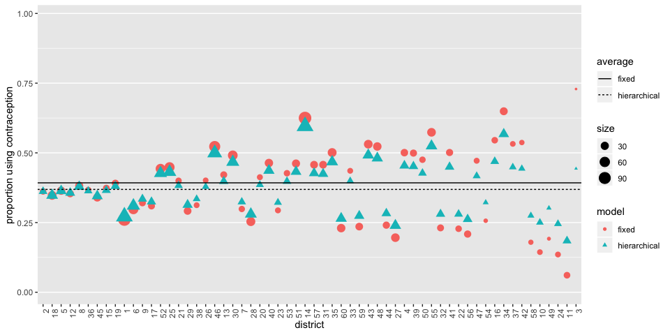
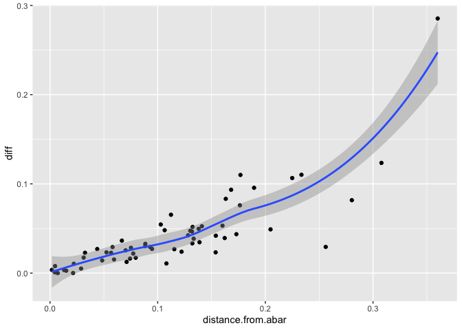

# Problems


## 12E1

_12E1. Which of the following priors will produce more shrinkage in the estimates? (a) αtank ∼
Normal(0, 1); (b) αtank ∼ Normal(0, 2)._

αtank ∼ Normal(0, 1)

## 12E2

_Make the following model into a multilevel model._

yi ∼ Binomial(1, pi)  
logit(pi) = αgroup[i] + βxi   
αgroup ∼ Normal(a_bar, sigma)  
a_bar ~ Normal(0, 1.5)  
sigma ~ dexp(1)  
β ∼ Normal(0, 1)


## 12E3

_Make the following model into a multilevel model._

yi ∼ Normal(μi, σ)  
μi = αgroup[i] + βxi  
αgroup ∼ Normal(a_bar, sigma)  
a_bar ~ Normal(0, 10)  
sigma ~ dexp(1)  
β ∼ Normal(0, 1)  
σ ∼ HalfCauchy(0, 2)

## 12M1

_Revisit the Reed frog survival data, data(reedfrogs), and add the predation and size treatment variables to the varying intercepts model. Consider models with either main effect alone, both main effects, as well as a model including both and their interaction. Instead of focusing on inferences about these two predictor variables, focus on the inferred variation across tanks. Explain why it changes as it does across models._


```r
library(rethinking)
```

```
## Loading required package: rstan
```

```
## Loading required package: StanHeaders
```

```
## Loading required package: ggplot2
```

```
## rstan (Version 2.19.2, GitRev: 2e1f913d3ca3)
```

```
## For execution on a local, multicore CPU with excess RAM we recommend calling
## options(mc.cores = parallel::detectCores()).
## To avoid recompilation of unchanged Stan programs, we recommend calling
## rstan_options(auto_write = TRUE)
```

```
## Loading required package: parallel
```

```
## Loading required package: dagitty
```

```
## rethinking (Version 1.93)
```

```
## 
## Attaching package: 'rethinking'
```

```
## The following object is masked from 'package:stats':
## 
##     rstudent
```

```r
library(tidyverse)
```

```
## ── Attaching packages ────────────────────────────────── tidyverse 1.3.0 ──
```

```
## ✓ tibble  2.1.3     ✓ dplyr   0.8.3
## ✓ tidyr   1.0.0     ✓ stringr 1.4.0
## ✓ readr   1.3.1     ✓ forcats 0.4.0
## ✓ purrr   0.3.3
```

```
## ── Conflicts ───────────────────────────────────── tidyverse_conflicts() ──
## x tidyr::extract() masks rstan::extract()
## x dplyr::filter()  masks stats::filter()
## x dplyr::lag()     masks stats::lag()
## x purrr::map()     masks rethinking::map()
```

```r
data(reedfrogs)
d <- reedfrogs
str(d)
```

```
## 'data.frame':	48 obs. of  5 variables:
##  $ density : int  10 10 10 10 10 10 10 10 10 10 ...
##  $ pred    : Factor w/ 2 levels "no","pred": 1 1 1 1 1 1 1 1 2 2 ...
##  $ size    : Factor w/ 2 levels "big","small": 1 1 1 1 2 2 2 2 1 1 ...
##  $ surv    : int  9 10 7 10 9 9 10 9 4 9 ...
##  $ propsurv: num  0.9 1 0.7 1 0.9 0.9 1 0.9 0.4 0.9 ...
```

```r
# make the tank cluster variable
d$tank <- 1:nrow(d)
```

orignal

```r
dat <- list(
    S = d$surv,
    N = d$density,
    tank = d$tank
)

m12M1a <- ulam(
    alist(
        S ~ dbinom( N , p ) ,
        logit(p) <- a[tank] ,
        a[tank] ~ dnorm( a_bar , sigma ) ,
        a_bar ~ dnorm( 0 , 1.5 ) ,
        sigma ~ dexp( 1 )
    ), data=dat , chains=4 , log_lik=TRUE )
```

```
## 
## SAMPLING FOR MODEL '71890fa4702bb6983de3ea7367f0b982' NOW (CHAIN 1).
## Chain 1: 
## Chain 1: Gradient evaluation took 2.5e-05 seconds
## Chain 1: 1000 transitions using 10 leapfrog steps per transition would take 0.25 seconds.
## Chain 1: Adjust your expectations accordingly!
## Chain 1: 
## Chain 1: 
## Chain 1: Iteration:   1 / 1000 [  0%]  (Warmup)
## Chain 1: Iteration: 100 / 1000 [ 10%]  (Warmup)
## Chain 1: Iteration: 200 / 1000 [ 20%]  (Warmup)
## Chain 1: Iteration: 300 / 1000 [ 30%]  (Warmup)
## Chain 1: Iteration: 400 / 1000 [ 40%]  (Warmup)
## Chain 1: Iteration: 500 / 1000 [ 50%]  (Warmup)
## Chain 1: Iteration: 501 / 1000 [ 50%]  (Sampling)
## Chain 1: Iteration: 600 / 1000 [ 60%]  (Sampling)
## Chain 1: Iteration: 700 / 1000 [ 70%]  (Sampling)
## Chain 1: Iteration: 800 / 1000 [ 80%]  (Sampling)
## Chain 1: Iteration: 900 / 1000 [ 90%]  (Sampling)
## Chain 1: Iteration: 1000 / 1000 [100%]  (Sampling)
## Chain 1: 
## Chain 1:  Elapsed Time: 0.097103 seconds (Warm-up)
## Chain 1:                0.066826 seconds (Sampling)
## Chain 1:                0.163929 seconds (Total)
## Chain 1: 
## 
## SAMPLING FOR MODEL '71890fa4702bb6983de3ea7367f0b982' NOW (CHAIN 2).
## Chain 2: 
## Chain 2: Gradient evaluation took 1e-05 seconds
## Chain 2: 1000 transitions using 10 leapfrog steps per transition would take 0.1 seconds.
## Chain 2: Adjust your expectations accordingly!
## Chain 2: 
## Chain 2: 
## Chain 2: Iteration:   1 / 1000 [  0%]  (Warmup)
## Chain 2: Iteration: 100 / 1000 [ 10%]  (Warmup)
## Chain 2: Iteration: 200 / 1000 [ 20%]  (Warmup)
## Chain 2: Iteration: 300 / 1000 [ 30%]  (Warmup)
## Chain 2: Iteration: 400 / 1000 [ 40%]  (Warmup)
## Chain 2: Iteration: 500 / 1000 [ 50%]  (Warmup)
## Chain 2: Iteration: 501 / 1000 [ 50%]  (Sampling)
## Chain 2: Iteration: 600 / 1000 [ 60%]  (Sampling)
## Chain 2: Iteration: 700 / 1000 [ 70%]  (Sampling)
## Chain 2: Iteration: 800 / 1000 [ 80%]  (Sampling)
## Chain 2: Iteration: 900 / 1000 [ 90%]  (Sampling)
## Chain 2: Iteration: 1000 / 1000 [100%]  (Sampling)
## Chain 2: 
## Chain 2:  Elapsed Time: 0.127773 seconds (Warm-up)
## Chain 2:                0.0675 seconds (Sampling)
## Chain 2:                0.195273 seconds (Total)
## Chain 2: 
## 
## SAMPLING FOR MODEL '71890fa4702bb6983de3ea7367f0b982' NOW (CHAIN 3).
## Chain 3: 
## Chain 3: Gradient evaluation took 1e-05 seconds
## Chain 3: 1000 transitions using 10 leapfrog steps per transition would take 0.1 seconds.
## Chain 3: Adjust your expectations accordingly!
## Chain 3: 
## Chain 3: 
## Chain 3: Iteration:   1 / 1000 [  0%]  (Warmup)
## Chain 3: Iteration: 100 / 1000 [ 10%]  (Warmup)
## Chain 3: Iteration: 200 / 1000 [ 20%]  (Warmup)
## Chain 3: Iteration: 300 / 1000 [ 30%]  (Warmup)
## Chain 3: Iteration: 400 / 1000 [ 40%]  (Warmup)
## Chain 3: Iteration: 500 / 1000 [ 50%]  (Warmup)
## Chain 3: Iteration: 501 / 1000 [ 50%]  (Sampling)
## Chain 3: Iteration: 600 / 1000 [ 60%]  (Sampling)
## Chain 3: Iteration: 700 / 1000 [ 70%]  (Sampling)
## Chain 3: Iteration: 800 / 1000 [ 80%]  (Sampling)
## Chain 3: Iteration: 900 / 1000 [ 90%]  (Sampling)
## Chain 3: Iteration: 1000 / 1000 [100%]  (Sampling)
## Chain 3: 
## Chain 3:  Elapsed Time: 0.102868 seconds (Warm-up)
## Chain 3:                0.066306 seconds (Sampling)
## Chain 3:                0.169174 seconds (Total)
## Chain 3: 
## 
## SAMPLING FOR MODEL '71890fa4702bb6983de3ea7367f0b982' NOW (CHAIN 4).
## Chain 4: 
## Chain 4: Gradient evaluation took 1.6e-05 seconds
## Chain 4: 1000 transitions using 10 leapfrog steps per transition would take 0.16 seconds.
## Chain 4: Adjust your expectations accordingly!
## Chain 4: 
## Chain 4: 
## Chain 4: Iteration:   1 / 1000 [  0%]  (Warmup)
## Chain 4: Iteration: 100 / 1000 [ 10%]  (Warmup)
## Chain 4: Iteration: 200 / 1000 [ 20%]  (Warmup)
## Chain 4: Iteration: 300 / 1000 [ 30%]  (Warmup)
## Chain 4: Iteration: 400 / 1000 [ 40%]  (Warmup)
## Chain 4: Iteration: 500 / 1000 [ 50%]  (Warmup)
## Chain 4: Iteration: 501 / 1000 [ 50%]  (Sampling)
## Chain 4: Iteration: 600 / 1000 [ 60%]  (Sampling)
## Chain 4: Iteration: 700 / 1000 [ 70%]  (Sampling)
## Chain 4: Iteration: 800 / 1000 [ 80%]  (Sampling)
## Chain 4: Iteration: 900 / 1000 [ 90%]  (Sampling)
## Chain 4: Iteration: 1000 / 1000 [100%]  (Sampling)
## Chain 4: 
## Chain 4:  Elapsed Time: 0.096344 seconds (Warm-up)
## Chain 4:                0.065153 seconds (Sampling)
## Chain 4:                0.161497 seconds (Total)
## Chain 4:
```


```r
dat <- list(
    S = d$surv,
    N = d$density,
    tank = d$tank,
    pred = ifelse(d$pred=="no", 0, 1)
)

m12M1_pred <- ulam(
    alist(
        S ~ dbinom( N , p ) ,
        logit(p) <- a[tank] + b_pred*pred,
        a[tank] ~ dnorm( a_bar , sigma ) ,
        a_bar ~ dnorm( 0 , 1.5 ) ,
        b_pred ~ dnorm(0, 1),
        sigma ~ dexp( 1 )
    ), data=dat , chains=4 , log_lik=TRUE, iter = 2000 )
```

```
## 
## SAMPLING FOR MODEL 'aa87ab538ed55c26c71a4153184c550c' NOW (CHAIN 1).
## Chain 1: 
## Chain 1: Gradient evaluation took 2e-05 seconds
## Chain 1: 1000 transitions using 10 leapfrog steps per transition would take 0.2 seconds.
## Chain 1: Adjust your expectations accordingly!
## Chain 1: 
## Chain 1: 
## Chain 1: Iteration:    1 / 2000 [  0%]  (Warmup)
## Chain 1: Iteration:  200 / 2000 [ 10%]  (Warmup)
## Chain 1: Iteration:  400 / 2000 [ 20%]  (Warmup)
## Chain 1: Iteration:  600 / 2000 [ 30%]  (Warmup)
## Chain 1: Iteration:  800 / 2000 [ 40%]  (Warmup)
## Chain 1: Iteration: 1000 / 2000 [ 50%]  (Warmup)
## Chain 1: Iteration: 1001 / 2000 [ 50%]  (Sampling)
## Chain 1: Iteration: 1200 / 2000 [ 60%]  (Sampling)
## Chain 1: Iteration: 1400 / 2000 [ 70%]  (Sampling)
## Chain 1: Iteration: 1600 / 2000 [ 80%]  (Sampling)
## Chain 1: Iteration: 1800 / 2000 [ 90%]  (Sampling)
## Chain 1: Iteration: 2000 / 2000 [100%]  (Sampling)
## Chain 1: 
## Chain 1:  Elapsed Time: 0.207125 seconds (Warm-up)
## Chain 1:                0.221062 seconds (Sampling)
## Chain 1:                0.428187 seconds (Total)
## Chain 1: 
## 
## SAMPLING FOR MODEL 'aa87ab538ed55c26c71a4153184c550c' NOW (CHAIN 2).
## Chain 2: 
## Chain 2: Gradient evaluation took 1.1e-05 seconds
## Chain 2: 1000 transitions using 10 leapfrog steps per transition would take 0.11 seconds.
## Chain 2: Adjust your expectations accordingly!
## Chain 2: 
## Chain 2: 
## Chain 2: Iteration:    1 / 2000 [  0%]  (Warmup)
## Chain 2: Iteration:  200 / 2000 [ 10%]  (Warmup)
## Chain 2: Iteration:  400 / 2000 [ 20%]  (Warmup)
## Chain 2: Iteration:  600 / 2000 [ 30%]  (Warmup)
## Chain 2: Iteration:  800 / 2000 [ 40%]  (Warmup)
## Chain 2: Iteration: 1000 / 2000 [ 50%]  (Warmup)
## Chain 2: Iteration: 1001 / 2000 [ 50%]  (Sampling)
## Chain 2: Iteration: 1200 / 2000 [ 60%]  (Sampling)
## Chain 2: Iteration: 1400 / 2000 [ 70%]  (Sampling)
## Chain 2: Iteration: 1600 / 2000 [ 80%]  (Sampling)
## Chain 2: Iteration: 1800 / 2000 [ 90%]  (Sampling)
## Chain 2: Iteration: 2000 / 2000 [100%]  (Sampling)
## Chain 2: 
## Chain 2:  Elapsed Time: 0.178479 seconds (Warm-up)
## Chain 2:                0.160884 seconds (Sampling)
## Chain 2:                0.339363 seconds (Total)
## Chain 2: 
## 
## SAMPLING FOR MODEL 'aa87ab538ed55c26c71a4153184c550c' NOW (CHAIN 3).
## Chain 3: 
## Chain 3: Gradient evaluation took 1.5e-05 seconds
## Chain 3: 1000 transitions using 10 leapfrog steps per transition would take 0.15 seconds.
## Chain 3: Adjust your expectations accordingly!
## Chain 3: 
## Chain 3: 
## Chain 3: Iteration:    1 / 2000 [  0%]  (Warmup)
## Chain 3: Iteration:  200 / 2000 [ 10%]  (Warmup)
## Chain 3: Iteration:  400 / 2000 [ 20%]  (Warmup)
## Chain 3: Iteration:  600 / 2000 [ 30%]  (Warmup)
## Chain 3: Iteration:  800 / 2000 [ 40%]  (Warmup)
## Chain 3: Iteration: 1000 / 2000 [ 50%]  (Warmup)
## Chain 3: Iteration: 1001 / 2000 [ 50%]  (Sampling)
## Chain 3: Iteration: 1200 / 2000 [ 60%]  (Sampling)
## Chain 3: Iteration: 1400 / 2000 [ 70%]  (Sampling)
## Chain 3: Iteration: 1600 / 2000 [ 80%]  (Sampling)
## Chain 3: Iteration: 1800 / 2000 [ 90%]  (Sampling)
## Chain 3: Iteration: 2000 / 2000 [100%]  (Sampling)
## Chain 3: 
## Chain 3:  Elapsed Time: 0.199262 seconds (Warm-up)
## Chain 3:                0.141047 seconds (Sampling)
## Chain 3:                0.340309 seconds (Total)
## Chain 3: 
## 
## SAMPLING FOR MODEL 'aa87ab538ed55c26c71a4153184c550c' NOW (CHAIN 4).
## Chain 4: 
## Chain 4: Gradient evaluation took 1.2e-05 seconds
## Chain 4: 1000 transitions using 10 leapfrog steps per transition would take 0.12 seconds.
## Chain 4: Adjust your expectations accordingly!
## Chain 4: 
## Chain 4: 
## Chain 4: Iteration:    1 / 2000 [  0%]  (Warmup)
## Chain 4: Iteration:  200 / 2000 [ 10%]  (Warmup)
## Chain 4: Iteration:  400 / 2000 [ 20%]  (Warmup)
## Chain 4: Iteration:  600 / 2000 [ 30%]  (Warmup)
## Chain 4: Iteration:  800 / 2000 [ 40%]  (Warmup)
## Chain 4: Iteration: 1000 / 2000 [ 50%]  (Warmup)
## Chain 4: Iteration: 1001 / 2000 [ 50%]  (Sampling)
## Chain 4: Iteration: 1200 / 2000 [ 60%]  (Sampling)
## Chain 4: Iteration: 1400 / 2000 [ 70%]  (Sampling)
## Chain 4: Iteration: 1600 / 2000 [ 80%]  (Sampling)
## Chain 4: Iteration: 1800 / 2000 [ 90%]  (Sampling)
## Chain 4: Iteration: 2000 / 2000 [100%]  (Sampling)
## Chain 4: 
## Chain 4:  Elapsed Time: 0.210387 seconds (Warm-up)
## Chain 4:                0.154707 seconds (Sampling)
## Chain 4:                0.365094 seconds (Total)
## Chain 4:
```


```r
precis(m12M1_pred, depth = 2)
```

```
##              mean        sd         5.5%     94.5%     n_eff      Rhat
## a[1]    2.4436159 0.6808933  1.390499234  3.572778 4067.3242 1.0008155
## a[2]    2.9450296 0.7347443  1.807578827  4.142557 3124.7170 1.0006244
## a[3]    1.6578449 0.6291794  0.672931842  2.682930 3010.8831 1.0002729
## a[4]    2.9319267 0.7413181  1.819396443  4.147716 2985.0135 1.0012285
## a[5]    2.4506931 0.6967722  1.336795138  3.596856 3302.6001 1.0008939
## a[6]    2.4589452 0.6753361  1.422449834  3.591981 2860.6092 1.0008168
## a[7]    2.9281937 0.7595537  1.807843389  4.194239 2957.1030 1.0013570
## a[8]    2.4547823 0.6816778  1.395624708  3.591883 3745.1069 0.9998644
## a[9]    2.1475294 0.5812537  1.219741015  3.082359 1834.4070 1.0017900
## a[10]   3.5068464 0.6204420  2.573845029  4.530529 1670.0910 1.0041324
## a[11]   2.9253828 0.5695578  2.043134101  3.860285 1786.1642 1.0017333
## a[12]   2.6789906 0.5695269  1.775920864  3.595426 1799.7323 1.0011501
## a[13]   2.9345755 0.5684680  2.053258575  3.852703 1865.2312 1.0016845
## a[14]   2.4161475 0.5724380  1.509998479  3.329181 1512.5707 1.0025201
## a[15]   3.5333882 0.6383944  2.577552261  4.577519 1783.8432 1.0041995
## a[16]   3.5159767 0.6194335  2.571976156  4.540960 1898.1618 1.0041446
## a[17]   2.8633525 0.6219143  1.936635183  3.912780 3526.3850 1.0003647
## a[18]   2.5333246 0.5466996  1.698825287  3.430439 3570.4619 1.0015244
## a[19]   2.2505765 0.5331638  1.429089803  3.131264 3694.7011 1.0000625
## a[20]   3.2589150 0.6815753  2.270535784  4.399862 2576.9075 1.0012439
## a[21]   2.5488334 0.5793941  1.652643281  3.518664 3835.1351 1.0003999
## a[22]   2.5406078 0.5671528  1.674981073  3.479903 4118.3460 1.0003653
## a[23]   2.5390968 0.5576853  1.661209300  3.484193 3508.9633 1.0020120
## a[24]   1.9931006 0.4984223  1.237644322  2.822704 3560.2802 0.9996703
## a[25]   1.4935532 0.4785756  0.704320100  2.230630 1072.9325 1.0038007
## a[26]   2.4605410 0.4623704  1.713575303  3.193516 1189.3619 1.0035925
## a[27]   1.1708217 0.5170082  0.340345225  1.958841 1102.9442 1.0014346
## a[28]   1.9208011 0.4782812  1.156551004  2.685564 1115.4010 1.0044338
## a[29]   2.4520756 0.4515640  1.726892579  3.180557 1176.9663 1.0044488
## a[30]   3.4594109 0.4965346  2.679821891  4.254974 1437.2472 1.0035836
## a[31]   1.7869163 0.4741109  1.023225806  2.533566 1214.3998 1.0031037
## a[32]   2.0564879 0.4703244  1.300399593  2.768256 1076.3886 1.0037502
## a[33]   3.0503055 0.6095918  2.143612974  4.053137 2550.2821 1.0003846
## a[34]   2.7369869 0.5291591  1.946960389  3.621308 3828.9740 1.0003894
## a[35]   2.7436305 0.5485347  1.923841338  3.642566 3804.4526 1.0013068
## a[36]   2.2402150 0.4821396  1.497830596  3.034528 4218.7207 1.0002992
## a[37]   2.2544869 0.4697906  1.551390642  3.019748 3371.1601 1.0010435
## a[38]   3.4074688 0.6660323  2.429481561  4.520676 2757.6494 1.0000203
## a[39]   2.7421092 0.5515174  1.906040348  3.708056 3504.9312 0.9998162
## a[40]   2.4695219 0.4992979  1.709798165  3.299179 4216.1722 0.9992761
## a[41]   0.8390739 0.5082421 -0.009528837  1.625716 1146.7306 1.0015179
## a[42]   1.8222051 0.4397682  1.075312420  2.503183  956.8459 1.0042538
## a[43]   1.9331527 0.4332720  1.240193285  2.620910  984.5272 1.0038402
## a[44]   2.0351737 0.4288301  1.335794992  2.711350 1066.8234 1.0035239
## a[45]   2.8340153 0.4235209  2.162141319  3.516243  936.2877 1.0044469
## a[46]   1.8277417 0.4334150  1.093657696  2.514187 1025.4419 1.0056924
## a[47]   3.9451368 0.4847070  3.192882737  4.738977 1308.8075 1.0046190
## a[48]   2.3327840 0.4295657  1.638296776  3.001834 1018.7617 1.0046411
## a_bar   2.4943902 0.2339363  2.114915474  2.876646  689.2421 1.0087266
## b_pred -2.3658935 0.2992128 -2.835874678 -1.872029  527.8893 1.0105455
## sigma   0.8298619 0.1480591  0.611185167  1.083704 1096.8531 1.0046570
```

```r
plot(m12M1_pred)
```

```
## 48 vector or matrix parameters hidden. Use depth=2 to show them.
```

<!-- -->


size model

```r
dat <- list(
    S = d$surv,
    N = d$density,
    tank = d$tank,
    sze = ifelse(d$size=="small", 0, 1)
)

str(dat)
```

```
## List of 4
##  $ S   : int [1:48] 9 10 7 10 9 9 10 9 4 9 ...
##  $ N   : int [1:48] 10 10 10 10 10 10 10 10 10 10 ...
##  $ tank: int [1:48] 1 2 3 4 5 6 7 8 9 10 ...
##  $ sze : num [1:48] 1 1 1 1 0 0 0 0 1 1 ...
```

```r
m12M1_size <- ulam(
    alist(
        S ~ dbinom( N , p ) ,
        logit(p) <- a[tank] + b_size*sze,
        a[tank] ~ dnorm( a_bar , sigma ) ,
        a_bar ~ dnorm( 0 , 1.5 ) ,
        b_size ~ dnorm(0, 1),
        sigma ~ dexp( 1 )
    ), data=dat , chains=4 , iter=4000, log_lik=TRUE )
```

```
## 
## SAMPLING FOR MODEL '17202027312df8570bfa43f2633214bb' NOW (CHAIN 1).
## Chain 1: 
## Chain 1: Gradient evaluation took 2.7e-05 seconds
## Chain 1: 1000 transitions using 10 leapfrog steps per transition would take 0.27 seconds.
## Chain 1: Adjust your expectations accordingly!
## Chain 1: 
## Chain 1: 
## Chain 1: Iteration:    1 / 4000 [  0%]  (Warmup)
## Chain 1: Iteration:  400 / 4000 [ 10%]  (Warmup)
## Chain 1: Iteration:  800 / 4000 [ 20%]  (Warmup)
## Chain 1: Iteration: 1200 / 4000 [ 30%]  (Warmup)
## Chain 1: Iteration: 1600 / 4000 [ 40%]  (Warmup)
## Chain 1: Iteration: 2000 / 4000 [ 50%]  (Warmup)
## Chain 1: Iteration: 2001 / 4000 [ 50%]  (Sampling)
## Chain 1: Iteration: 2400 / 4000 [ 60%]  (Sampling)
## Chain 1: Iteration: 2800 / 4000 [ 70%]  (Sampling)
## Chain 1: Iteration: 3200 / 4000 [ 80%]  (Sampling)
## Chain 1: Iteration: 3600 / 4000 [ 90%]  (Sampling)
## Chain 1: Iteration: 4000 / 4000 [100%]  (Sampling)
## Chain 1: 
## Chain 1:  Elapsed Time: 0.453732 seconds (Warm-up)
## Chain 1:                0.477837 seconds (Sampling)
## Chain 1:                0.931569 seconds (Total)
## Chain 1: 
## 
## SAMPLING FOR MODEL '17202027312df8570bfa43f2633214bb' NOW (CHAIN 2).
## Chain 2: 
## Chain 2: Gradient evaluation took 1.1e-05 seconds
## Chain 2: 1000 transitions using 10 leapfrog steps per transition would take 0.11 seconds.
## Chain 2: Adjust your expectations accordingly!
## Chain 2: 
## Chain 2: 
## Chain 2: Iteration:    1 / 4000 [  0%]  (Warmup)
## Chain 2: Iteration:  400 / 4000 [ 10%]  (Warmup)
## Chain 2: Iteration:  800 / 4000 [ 20%]  (Warmup)
## Chain 2: Iteration: 1200 / 4000 [ 30%]  (Warmup)
## Chain 2: Iteration: 1600 / 4000 [ 40%]  (Warmup)
## Chain 2: Iteration: 2000 / 4000 [ 50%]  (Warmup)
## Chain 2: Iteration: 2001 / 4000 [ 50%]  (Sampling)
## Chain 2: Iteration: 2400 / 4000 [ 60%]  (Sampling)
## Chain 2: Iteration: 2800 / 4000 [ 70%]  (Sampling)
## Chain 2: Iteration: 3200 / 4000 [ 80%]  (Sampling)
## Chain 2: Iteration: 3600 / 4000 [ 90%]  (Sampling)
## Chain 2: Iteration: 4000 / 4000 [100%]  (Sampling)
## Chain 2: 
## Chain 2:  Elapsed Time: 0.413484 seconds (Warm-up)
## Chain 2:                0.484944 seconds (Sampling)
## Chain 2:                0.898428 seconds (Total)
## Chain 2: 
## 
## SAMPLING FOR MODEL '17202027312df8570bfa43f2633214bb' NOW (CHAIN 3).
## Chain 3: 
## Chain 3: Gradient evaluation took 1.2e-05 seconds
## Chain 3: 1000 transitions using 10 leapfrog steps per transition would take 0.12 seconds.
## Chain 3: Adjust your expectations accordingly!
## Chain 3: 
## Chain 3: 
## Chain 3: Iteration:    1 / 4000 [  0%]  (Warmup)
## Chain 3: Iteration:  400 / 4000 [ 10%]  (Warmup)
## Chain 3: Iteration:  800 / 4000 [ 20%]  (Warmup)
## Chain 3: Iteration: 1200 / 4000 [ 30%]  (Warmup)
## Chain 3: Iteration: 1600 / 4000 [ 40%]  (Warmup)
## Chain 3: Iteration: 2000 / 4000 [ 50%]  (Warmup)
## Chain 3: Iteration: 2001 / 4000 [ 50%]  (Sampling)
## Chain 3: Iteration: 2400 / 4000 [ 60%]  (Sampling)
## Chain 3: Iteration: 2800 / 4000 [ 70%]  (Sampling)
## Chain 3: Iteration: 3200 / 4000 [ 80%]  (Sampling)
## Chain 3: Iteration: 3600 / 4000 [ 90%]  (Sampling)
## Chain 3: Iteration: 4000 / 4000 [100%]  (Sampling)
## Chain 3: 
## Chain 3:  Elapsed Time: 0.513545 seconds (Warm-up)
## Chain 3:                0.543117 seconds (Sampling)
## Chain 3:                1.05666 seconds (Total)
## Chain 3: 
## 
## SAMPLING FOR MODEL '17202027312df8570bfa43f2633214bb' NOW (CHAIN 4).
## Chain 4: 
## Chain 4: Gradient evaluation took 1.2e-05 seconds
## Chain 4: 1000 transitions using 10 leapfrog steps per transition would take 0.12 seconds.
## Chain 4: Adjust your expectations accordingly!
## Chain 4: 
## Chain 4: 
## Chain 4: Iteration:    1 / 4000 [  0%]  (Warmup)
## Chain 4: Iteration:  400 / 4000 [ 10%]  (Warmup)
## Chain 4: Iteration:  800 / 4000 [ 20%]  (Warmup)
## Chain 4: Iteration: 1200 / 4000 [ 30%]  (Warmup)
## Chain 4: Iteration: 1600 / 4000 [ 40%]  (Warmup)
## Chain 4: Iteration: 2000 / 4000 [ 50%]  (Warmup)
## Chain 4: Iteration: 2001 / 4000 [ 50%]  (Sampling)
## Chain 4: Iteration: 2400 / 4000 [ 60%]  (Sampling)
## Chain 4: Iteration: 2800 / 4000 [ 70%]  (Sampling)
## Chain 4: Iteration: 3200 / 4000 [ 80%]  (Sampling)
## Chain 4: Iteration: 3600 / 4000 [ 90%]  (Sampling)
## Chain 4: Iteration: 4000 / 4000 [100%]  (Sampling)
## Chain 4: 
## Chain 4:  Elapsed Time: 0.474562 seconds (Warm-up)
## Chain 4:                0.306169 seconds (Sampling)
## Chain 4:                0.780731 seconds (Total)
## Chain 4:
```


```r
precis(m12M1_size)
```

```
## 48 vector or matrix parameters hidden. Use depth=2 to show them.
```

```
##              mean        sd       5.5%     94.5%    n_eff      Rhat
## a_bar   1.4899024 0.3450357  0.9402076 2.0414343 1680.310 1.0010708
## b_size -0.3002522 0.4692928 -1.0559473 0.4672306 1049.597 1.0032726
## sigma   1.6189809 0.2182153  1.3030237 1.9888290 4892.763 0.9999958
```


both size and pred

```r
dat <- list(
    S = d$surv,
    N = d$density,
    tank = d$tank,
    sze = ifelse(d$size=="small", 0, 1),
    pred = ifelse(d$pred=="no", 0, 1)
)

m12M1_both <- ulam(
    alist(
        S ~ dbinom( N , p ) ,
        logit(p) <- a[tank] + b_pred*pred + b_size*sze,
        a[tank] ~ dnorm( a_bar , sigma ) ,
        a_bar ~ dnorm( 0 , 1.5 ) ,
        b_pred ~ dnorm(0, 1),
        b_size ~ dnorm(0, 1),
        sigma ~ dexp( 1 )
    ), data=dat , chains=4 , log_lik=TRUE, iter=4000 )
```

```
## 
## SAMPLING FOR MODEL '09d2323bd23a1ccc5175483b3b026314' NOW (CHAIN 1).
## Chain 1: 
## Chain 1: Gradient evaluation took 2.4e-05 seconds
## Chain 1: 1000 transitions using 10 leapfrog steps per transition would take 0.24 seconds.
## Chain 1: Adjust your expectations accordingly!
## Chain 1: 
## Chain 1: 
## Chain 1: Iteration:    1 / 4000 [  0%]  (Warmup)
## Chain 1: Iteration:  400 / 4000 [ 10%]  (Warmup)
## Chain 1: Iteration:  800 / 4000 [ 20%]  (Warmup)
## Chain 1: Iteration: 1200 / 4000 [ 30%]  (Warmup)
## Chain 1: Iteration: 1600 / 4000 [ 40%]  (Warmup)
## Chain 1: Iteration: 2000 / 4000 [ 50%]  (Warmup)
## Chain 1: Iteration: 2001 / 4000 [ 50%]  (Sampling)
## Chain 1: Iteration: 2400 / 4000 [ 60%]  (Sampling)
## Chain 1: Iteration: 2800 / 4000 [ 70%]  (Sampling)
## Chain 1: Iteration: 3200 / 4000 [ 80%]  (Sampling)
## Chain 1: Iteration: 3600 / 4000 [ 90%]  (Sampling)
## Chain 1: Iteration: 4000 / 4000 [100%]  (Sampling)
## Chain 1: 
## Chain 1:  Elapsed Time: 0.493382 seconds (Warm-up)
## Chain 1:                0.62933 seconds (Sampling)
## Chain 1:                1.12271 seconds (Total)
## Chain 1: 
## 
## SAMPLING FOR MODEL '09d2323bd23a1ccc5175483b3b026314' NOW (CHAIN 2).
## Chain 2: 
## Chain 2: Gradient evaluation took 1.7e-05 seconds
## Chain 2: 1000 transitions using 10 leapfrog steps per transition would take 0.17 seconds.
## Chain 2: Adjust your expectations accordingly!
## Chain 2: 
## Chain 2: 
## Chain 2: Iteration:    1 / 4000 [  0%]  (Warmup)
## Chain 2: Iteration:  400 / 4000 [ 10%]  (Warmup)
## Chain 2: Iteration:  800 / 4000 [ 20%]  (Warmup)
## Chain 2: Iteration: 1200 / 4000 [ 30%]  (Warmup)
## Chain 2: Iteration: 1600 / 4000 [ 40%]  (Warmup)
## Chain 2: Iteration: 2000 / 4000 [ 50%]  (Warmup)
## Chain 2: Iteration: 2001 / 4000 [ 50%]  (Sampling)
## Chain 2: Iteration: 2400 / 4000 [ 60%]  (Sampling)
## Chain 2: Iteration: 2800 / 4000 [ 70%]  (Sampling)
## Chain 2: Iteration: 3200 / 4000 [ 80%]  (Sampling)
## Chain 2: Iteration: 3600 / 4000 [ 90%]  (Sampling)
## Chain 2: Iteration: 4000 / 4000 [100%]  (Sampling)
## Chain 2: 
## Chain 2:  Elapsed Time: 0.481176 seconds (Warm-up)
## Chain 2:                0.461973 seconds (Sampling)
## Chain 2:                0.943149 seconds (Total)
## Chain 2: 
## 
## SAMPLING FOR MODEL '09d2323bd23a1ccc5175483b3b026314' NOW (CHAIN 3).
## Chain 3: 
## Chain 3: Gradient evaluation took 1.3e-05 seconds
## Chain 3: 1000 transitions using 10 leapfrog steps per transition would take 0.13 seconds.
## Chain 3: Adjust your expectations accordingly!
## Chain 3: 
## Chain 3: 
## Chain 3: Iteration:    1 / 4000 [  0%]  (Warmup)
## Chain 3: Iteration:  400 / 4000 [ 10%]  (Warmup)
## Chain 3: Iteration:  800 / 4000 [ 20%]  (Warmup)
## Chain 3: Iteration: 1200 / 4000 [ 30%]  (Warmup)
## Chain 3: Iteration: 1600 / 4000 [ 40%]  (Warmup)
## Chain 3: Iteration: 2000 / 4000 [ 50%]  (Warmup)
## Chain 3: Iteration: 2001 / 4000 [ 50%]  (Sampling)
## Chain 3: Iteration: 2400 / 4000 [ 60%]  (Sampling)
## Chain 3: Iteration: 2800 / 4000 [ 70%]  (Sampling)
## Chain 3: Iteration: 3200 / 4000 [ 80%]  (Sampling)
## Chain 3: Iteration: 3600 / 4000 [ 90%]  (Sampling)
## Chain 3: Iteration: 4000 / 4000 [100%]  (Sampling)
## Chain 3: 
## Chain 3:  Elapsed Time: 0.483789 seconds (Warm-up)
## Chain 3:                0.555777 seconds (Sampling)
## Chain 3:                1.03957 seconds (Total)
## Chain 3: 
## 
## SAMPLING FOR MODEL '09d2323bd23a1ccc5175483b3b026314' NOW (CHAIN 4).
## Chain 4: 
## Chain 4: Gradient evaluation took 1.3e-05 seconds
## Chain 4: 1000 transitions using 10 leapfrog steps per transition would take 0.13 seconds.
## Chain 4: Adjust your expectations accordingly!
## Chain 4: 
## Chain 4: 
## Chain 4: Iteration:    1 / 4000 [  0%]  (Warmup)
## Chain 4: Iteration:  400 / 4000 [ 10%]  (Warmup)
## Chain 4: Iteration:  800 / 4000 [ 20%]  (Warmup)
## Chain 4: Iteration: 1200 / 4000 [ 30%]  (Warmup)
## Chain 4: Iteration: 1600 / 4000 [ 40%]  (Warmup)
## Chain 4: Iteration: 2000 / 4000 [ 50%]  (Warmup)
## Chain 4: Iteration: 2001 / 4000 [ 50%]  (Sampling)
## Chain 4: Iteration: 2400 / 4000 [ 60%]  (Sampling)
## Chain 4: Iteration: 2800 / 4000 [ 70%]  (Sampling)
## Chain 4: Iteration: 3200 / 4000 [ 80%]  (Sampling)
## Chain 4: Iteration: 3600 / 4000 [ 90%]  (Sampling)
## Chain 4: Iteration: 4000 / 4000 [100%]  (Sampling)
## Chain 4: 
## Chain 4:  Elapsed Time: 0.46321 seconds (Warm-up)
## Chain 4:                0.431009 seconds (Sampling)
## Chain 4:                0.894219 seconds (Total)
## Chain 4:
```


```r
precis(m12M1_both)
```

```
## 48 vector or matrix parameters hidden. Use depth=2 to show them.
```

```
##              mean        sd       5.5%       94.5%    n_eff     Rhat
## a_bar   2.6959722 0.2718841  2.2587285  3.11928184 1093.615 1.002330
## b_pred -2.3791086 0.2967453 -2.8334633 -1.89611651 1379.032 1.001747
## b_size -0.4082132 0.2859255 -0.8596123  0.05721257 1797.914 1.001822
## sigma   0.7815067 0.1498643  0.5596320  1.03569488 2027.543 1.005169
```


interaction

```r
dat <- list(
    S = d$surv,
    N = d$density,
    tank = d$tank,
    sze = ifelse(d$size=="small", 0, 1),
    pred = ifelse(d$pred=="no", 0, 1)
)

m12M1_int <- ulam(
    alist(
        S ~ dbinom( N , p ) ,
        logit(p) <- a[tank] + b_pred*pred + b_size*sze +b_int*pred*sze,
        a[tank] ~ dnorm( a_bar , sigma ) ,
        a_bar ~ dnorm( 0 , 1.5 ) ,
        b_pred ~ dnorm(0, 1),
        b_size ~ dnorm(0, 1),
        b_int ~ dnorm(0, .5),
        sigma ~ dexp( 1 )
    ), data=dat , chains=4 , log_lik=TRUE, iter=4000 )
```

```
## 
## SAMPLING FOR MODEL 'a9eacd23439d812f0f4b338d47f6c645' NOW (CHAIN 1).
## Chain 1: 
## Chain 1: Gradient evaluation took 3.4e-05 seconds
## Chain 1: 1000 transitions using 10 leapfrog steps per transition would take 0.34 seconds.
## Chain 1: Adjust your expectations accordingly!
## Chain 1: 
## Chain 1: 
## Chain 1: Iteration:    1 / 4000 [  0%]  (Warmup)
## Chain 1: Iteration:  400 / 4000 [ 10%]  (Warmup)
## Chain 1: Iteration:  800 / 4000 [ 20%]  (Warmup)
## Chain 1: Iteration: 1200 / 4000 [ 30%]  (Warmup)
## Chain 1: Iteration: 1600 / 4000 [ 40%]  (Warmup)
## Chain 1: Iteration: 2000 / 4000 [ 50%]  (Warmup)
## Chain 1: Iteration: 2001 / 4000 [ 50%]  (Sampling)
## Chain 1: Iteration: 2400 / 4000 [ 60%]  (Sampling)
## Chain 1: Iteration: 2800 / 4000 [ 70%]  (Sampling)
## Chain 1: Iteration: 3200 / 4000 [ 80%]  (Sampling)
## Chain 1: Iteration: 3600 / 4000 [ 90%]  (Sampling)
## Chain 1: Iteration: 4000 / 4000 [100%]  (Sampling)
## Chain 1: 
## Chain 1:  Elapsed Time: 0.626707 seconds (Warm-up)
## Chain 1:                0.643944 seconds (Sampling)
## Chain 1:                1.27065 seconds (Total)
## Chain 1: 
## 
## SAMPLING FOR MODEL 'a9eacd23439d812f0f4b338d47f6c645' NOW (CHAIN 2).
## Chain 2: 
## Chain 2: Gradient evaluation took 1.5e-05 seconds
## Chain 2: 1000 transitions using 10 leapfrog steps per transition would take 0.15 seconds.
## Chain 2: Adjust your expectations accordingly!
## Chain 2: 
## Chain 2: 
## Chain 2: Iteration:    1 / 4000 [  0%]  (Warmup)
## Chain 2: Iteration:  400 / 4000 [ 10%]  (Warmup)
## Chain 2: Iteration:  800 / 4000 [ 20%]  (Warmup)
## Chain 2: Iteration: 1200 / 4000 [ 30%]  (Warmup)
## Chain 2: Iteration: 1600 / 4000 [ 40%]  (Warmup)
## Chain 2: Iteration: 2000 / 4000 [ 50%]  (Warmup)
## Chain 2: Iteration: 2001 / 4000 [ 50%]  (Sampling)
## Chain 2: Iteration: 2400 / 4000 [ 60%]  (Sampling)
## Chain 2: Iteration: 2800 / 4000 [ 70%]  (Sampling)
## Chain 2: Iteration: 3200 / 4000 [ 80%]  (Sampling)
## Chain 2: Iteration: 3600 / 4000 [ 90%]  (Sampling)
## Chain 2: Iteration: 4000 / 4000 [100%]  (Sampling)
## Chain 2: 
## Chain 2:  Elapsed Time: 0.631538 seconds (Warm-up)
## Chain 2:                0.719465 seconds (Sampling)
## Chain 2:                1.351 seconds (Total)
## Chain 2: 
## 
## SAMPLING FOR MODEL 'a9eacd23439d812f0f4b338d47f6c645' NOW (CHAIN 3).
## Chain 3: 
## Chain 3: Gradient evaluation took 1.4e-05 seconds
## Chain 3: 1000 transitions using 10 leapfrog steps per transition would take 0.14 seconds.
## Chain 3: Adjust your expectations accordingly!
## Chain 3: 
## Chain 3: 
## Chain 3: Iteration:    1 / 4000 [  0%]  (Warmup)
## Chain 3: Iteration:  400 / 4000 [ 10%]  (Warmup)
## Chain 3: Iteration:  800 / 4000 [ 20%]  (Warmup)
## Chain 3: Iteration: 1200 / 4000 [ 30%]  (Warmup)
## Chain 3: Iteration: 1600 / 4000 [ 40%]  (Warmup)
## Chain 3: Iteration: 2000 / 4000 [ 50%]  (Warmup)
## Chain 3: Iteration: 2001 / 4000 [ 50%]  (Sampling)
## Chain 3: Iteration: 2400 / 4000 [ 60%]  (Sampling)
## Chain 3: Iteration: 2800 / 4000 [ 70%]  (Sampling)
## Chain 3: Iteration: 3200 / 4000 [ 80%]  (Sampling)
## Chain 3: Iteration: 3600 / 4000 [ 90%]  (Sampling)
## Chain 3: Iteration: 4000 / 4000 [100%]  (Sampling)
## Chain 3: 
## Chain 3:  Elapsed Time: 0.629037 seconds (Warm-up)
## Chain 3:                0.661575 seconds (Sampling)
## Chain 3:                1.29061 seconds (Total)
## Chain 3: 
## 
## SAMPLING FOR MODEL 'a9eacd23439d812f0f4b338d47f6c645' NOW (CHAIN 4).
## Chain 4: 
## Chain 4: Gradient evaluation took 1.5e-05 seconds
## Chain 4: 1000 transitions using 10 leapfrog steps per transition would take 0.15 seconds.
## Chain 4: Adjust your expectations accordingly!
## Chain 4: 
## Chain 4: 
## Chain 4: Iteration:    1 / 4000 [  0%]  (Warmup)
## Chain 4: Iteration:  400 / 4000 [ 10%]  (Warmup)
## Chain 4: Iteration:  800 / 4000 [ 20%]  (Warmup)
## Chain 4: Iteration: 1200 / 4000 [ 30%]  (Warmup)
## Chain 4: Iteration: 1600 / 4000 [ 40%]  (Warmup)
## Chain 4: Iteration: 2000 / 4000 [ 50%]  (Warmup)
## Chain 4: Iteration: 2001 / 4000 [ 50%]  (Sampling)
## Chain 4: Iteration: 2400 / 4000 [ 60%]  (Sampling)
## Chain 4: Iteration: 2800 / 4000 [ 70%]  (Sampling)
## Chain 4: Iteration: 3200 / 4000 [ 80%]  (Sampling)
## Chain 4: Iteration: 3600 / 4000 [ 90%]  (Sampling)
## Chain 4: Iteration: 4000 / 4000 [100%]  (Sampling)
## Chain 4: 
## Chain 4:  Elapsed Time: 0.650405 seconds (Warm-up)
## Chain 4:                0.650275 seconds (Sampling)
## Chain 4:                1.30068 seconds (Total)
## Chain 4:
```


```r
precis(m12M1_int)
```

```
## 48 vector or matrix parameters hidden. Use depth=2 to show them.
```

```
##               mean        sd       5.5%       94.5%     n_eff     Rhat
## a_bar   2.53666368 0.2711837  2.1214386  2.97870543  919.0105 1.006542
## b_pred -2.09797568 0.3235423 -2.6211927 -1.58537871 1194.7492 1.008018
## b_size -0.04549524 0.3463168 -0.5991908  0.50902694 1728.9058 1.001846
## b_int  -0.66217362 0.3646844 -1.2380585 -0.07091852 3238.6995 1.002247
## sigma   0.74485603 0.1482816  0.5307263  0.99388419 2246.2141 1.001717
```


```r
coeftab(m12M1a, m12M1_pred, m12M1_size, m12M1_both, m12M1_int)@coefs %>% 
    as.data.frame() %>%
    rownames_to_column(var="coef") %>%
    filter(str_detect(coef, "\\[", negate = TRUE))
```

```
##     coef m12M1a m12M1_pred m12M1_size m12M1_both m12M1_int
## 1  a_bar   1.35       2.49       1.49       2.70      2.54
## 2  sigma   1.62       0.83       1.62       0.78      0.74
## 3 b_pred     NA      -2.37         NA      -2.38     -2.10
## 4 b_size     NA         NA      -0.30      -0.41     -0.05
## 5  b_int     NA         NA         NA         NA     -0.66
```

sigma represents the estimated variation (or really the standard deviation) between tanks.  It turns out that some of that variation is caused by differences in predation and size, so when those variables are included in the model, the "residual" tank to tank variation is reduced.


## 12M2

_Compare the models you fit just above, using WAIC. Can you reconcile the differences in WAIC with the posterior distributions of the models?_


```r
compare(m12M1a, m12M1_pred, m12M1_size, m12M1_both, m12M1_int)
```

```
##                WAIC       SE     dWAIC      dSE    pWAIC    weight
## m12M1_pred 198.7941 8.910742 0.0000000       NA 19.09929 0.3340788
## m12M1_both 199.7218 8.579738 0.9277657 1.765999 19.01172 0.2100812
## m12M1_int  199.7383 9.137469 0.9441913 2.762150 19.03774 0.2083629
## m12M1a     200.7453 7.404026 1.9512047 5.367046 21.23649 0.1259361
## m12M1_size 200.8163 7.167901 2.0222480 5.509536 21.22357 0.1215411
```

I would have thought that the pred or both models would have been notably better than the intercept only model.

## 12H1


```r
data("bangladesh")
d <- bangladesh
d$district_id <- as.integer(as.factor(d$district))
str(d)
```

```
## 'data.frame':	1934 obs. of  7 variables:
##  $ woman            : int  1 2 3 4 5 6 7 8 9 10 ...
##  $ district         : int  1 1 1 1 1 1 1 1 1 1 ...
##  $ use.contraception: int  0 0 0 0 0 0 0 0 0 0 ...
##  $ living.children  : int  4 1 3 4 1 1 4 4 2 4 ...
##  $ age.centered     : num  18.44 -5.56 1.44 8.44 -13.56 ...
##  $ urban            : int  1 1 1 1 1 1 1 1 1 1 ...
##  $ district_id      : int  1 1 1 1 1 1 1 1 1 1 ...
```

fixed effect model

```r
dat = list(district_id=d$district_id, contraception=d$use.contraception)
str(dat)
```

```
## List of 2
##  $ district_id  : int [1:1934] 1 1 1 1 1 1 1 1 1 1 ...
##  $ contraception: int [1:1934] 0 0 0 0 0 0 0 0 0 0 ...
```

```r
M12H1a <- ulam(
    alist(contraception ~ dbinom(1, p),
          logit(p) <- a[district_id],
          a[district_id] ~ dnorm(0, 1.5)),
    data = dat, chains = 4, log_lik = TRUE)
```

```
## 
## SAMPLING FOR MODEL '7cbae65d12bba671b124e7008347814d' NOW (CHAIN 1).
## Chain 1: 
## Chain 1: Gradient evaluation took 0.000174 seconds
## Chain 1: 1000 transitions using 10 leapfrog steps per transition would take 1.74 seconds.
## Chain 1: Adjust your expectations accordingly!
## Chain 1: 
## Chain 1: 
## Chain 1: Iteration:   1 / 1000 [  0%]  (Warmup)
## Chain 1: Iteration: 100 / 1000 [ 10%]  (Warmup)
## Chain 1: Iteration: 200 / 1000 [ 20%]  (Warmup)
## Chain 1: Iteration: 300 / 1000 [ 30%]  (Warmup)
## Chain 1: Iteration: 400 / 1000 [ 40%]  (Warmup)
## Chain 1: Iteration: 500 / 1000 [ 50%]  (Warmup)
## Chain 1: Iteration: 501 / 1000 [ 50%]  (Sampling)
## Chain 1: Iteration: 600 / 1000 [ 60%]  (Sampling)
## Chain 1: Iteration: 700 / 1000 [ 70%]  (Sampling)
## Chain 1: Iteration: 800 / 1000 [ 80%]  (Sampling)
## Chain 1: Iteration: 900 / 1000 [ 90%]  (Sampling)
## Chain 1: Iteration: 1000 / 1000 [100%]  (Sampling)
## Chain 1: 
## Chain 1:  Elapsed Time: 1.39022 seconds (Warm-up)
## Chain 1:                1.03566 seconds (Sampling)
## Chain 1:                2.42588 seconds (Total)
## Chain 1: 
## 
## SAMPLING FOR MODEL '7cbae65d12bba671b124e7008347814d' NOW (CHAIN 2).
## Chain 2: 
## Chain 2: Gradient evaluation took 0.000116 seconds
## Chain 2: 1000 transitions using 10 leapfrog steps per transition would take 1.16 seconds.
## Chain 2: Adjust your expectations accordingly!
## Chain 2: 
## Chain 2: 
## Chain 2: Iteration:   1 / 1000 [  0%]  (Warmup)
## Chain 2: Iteration: 100 / 1000 [ 10%]  (Warmup)
## Chain 2: Iteration: 200 / 1000 [ 20%]  (Warmup)
## Chain 2: Iteration: 300 / 1000 [ 30%]  (Warmup)
## Chain 2: Iteration: 400 / 1000 [ 40%]  (Warmup)
## Chain 2: Iteration: 500 / 1000 [ 50%]  (Warmup)
## Chain 2: Iteration: 501 / 1000 [ 50%]  (Sampling)
## Chain 2: Iteration: 600 / 1000 [ 60%]  (Sampling)
## Chain 2: Iteration: 700 / 1000 [ 70%]  (Sampling)
## Chain 2: Iteration: 800 / 1000 [ 80%]  (Sampling)
## Chain 2: Iteration: 900 / 1000 [ 90%]  (Sampling)
## Chain 2: Iteration: 1000 / 1000 [100%]  (Sampling)
## Chain 2: 
## Chain 2:  Elapsed Time: 1.26482 seconds (Warm-up)
## Chain 2:                1.037 seconds (Sampling)
## Chain 2:                2.30182 seconds (Total)
## Chain 2: 
## 
## SAMPLING FOR MODEL '7cbae65d12bba671b124e7008347814d' NOW (CHAIN 3).
## Chain 3: 
## Chain 3: Gradient evaluation took 0.000119 seconds
## Chain 3: 1000 transitions using 10 leapfrog steps per transition would take 1.19 seconds.
## Chain 3: Adjust your expectations accordingly!
## Chain 3: 
## Chain 3: 
## Chain 3: Iteration:   1 / 1000 [  0%]  (Warmup)
## Chain 3: Iteration: 100 / 1000 [ 10%]  (Warmup)
## Chain 3: Iteration: 200 / 1000 [ 20%]  (Warmup)
## Chain 3: Iteration: 300 / 1000 [ 30%]  (Warmup)
## Chain 3: Iteration: 400 / 1000 [ 40%]  (Warmup)
## Chain 3: Iteration: 500 / 1000 [ 50%]  (Warmup)
## Chain 3: Iteration: 501 / 1000 [ 50%]  (Sampling)
## Chain 3: Iteration: 600 / 1000 [ 60%]  (Sampling)
## Chain 3: Iteration: 700 / 1000 [ 70%]  (Sampling)
## Chain 3: Iteration: 800 / 1000 [ 80%]  (Sampling)
## Chain 3: Iteration: 900 / 1000 [ 90%]  (Sampling)
## Chain 3: Iteration: 1000 / 1000 [100%]  (Sampling)
## Chain 3: 
## Chain 3:  Elapsed Time: 1.31511 seconds (Warm-up)
## Chain 3:                1.04919 seconds (Sampling)
## Chain 3:                2.3643 seconds (Total)
## Chain 3: 
## 
## SAMPLING FOR MODEL '7cbae65d12bba671b124e7008347814d' NOW (CHAIN 4).
## Chain 4: 
## Chain 4: Gradient evaluation took 0.000151 seconds
## Chain 4: 1000 transitions using 10 leapfrog steps per transition would take 1.51 seconds.
## Chain 4: Adjust your expectations accordingly!
## Chain 4: 
## Chain 4: 
## Chain 4: Iteration:   1 / 1000 [  0%]  (Warmup)
## Chain 4: Iteration: 100 / 1000 [ 10%]  (Warmup)
## Chain 4: Iteration: 200 / 1000 [ 20%]  (Warmup)
## Chain 4: Iteration: 300 / 1000 [ 30%]  (Warmup)
## Chain 4: Iteration: 400 / 1000 [ 40%]  (Warmup)
## Chain 4: Iteration: 500 / 1000 [ 50%]  (Warmup)
## Chain 4: Iteration: 501 / 1000 [ 50%]  (Sampling)
## Chain 4: Iteration: 600 / 1000 [ 60%]  (Sampling)
## Chain 4: Iteration: 700 / 1000 [ 70%]  (Sampling)
## Chain 4: Iteration: 800 / 1000 [ 80%]  (Sampling)
## Chain 4: Iteration: 900 / 1000 [ 90%]  (Sampling)
## Chain 4: Iteration: 1000 / 1000 [100%]  (Sampling)
## Chain 4: 
## Chain 4:  Elapsed Time: 1.38994 seconds (Warm-up)
## Chain 4:                1.08122 seconds (Sampling)
## Chain 4:                2.47117 seconds (Total)
## Chain 4:
```


```r
precis(M12H1a, depth=2) %>% head()
```

```
##              mean        sd       5.5%       94.5%    n_eff      Rhat
## a[1] -1.052243843 0.2095622 -1.3964538 -0.71415601 4222.958 0.9988785
## a[2] -0.594920850 0.4484211 -1.3058276  0.09539439 4818.906 0.9995425
## a[3]  1.222419114 1.0967928 -0.5007855  3.06849133 3829.279 0.9986329
## a[4]  0.003092674 0.3441709 -0.5544897  0.54555022 3869.318 0.9992661
## a[5] -0.569980677 0.3121441 -1.0866870 -0.08819027 4022.307 0.9987163
## a[6] -0.873395163 0.2772950 -1.3150985 -0.44452431 4291.938 0.9988554
```

multi-level model:

```r
M12H1b <- ulam(
    alist(contraception ~ dbinom(1, p),
          logit(p) <- a[district_id],
          a[district_id] ~ dnorm(a_bar, sigma),
          a_bar ~ dnorm(0, 1.5),
          sigma ~ dexp(1)),
    data = dat, chains = 4, log_lik = TRUE, cores=4 )
```


```r
precis(M12H1b, depth=2) %>% head()
```

```
##            mean        sd       5.5%       94.5%    n_eff      Rhat
## a[1] -0.9948563 0.1906046 -1.3014465 -0.69398000 3518.446 0.9987808
## a[2] -0.5844082 0.3486040 -1.1475090 -0.02783596 4645.183 0.9989106
## a[3] -0.2389231 0.5183875 -1.0352167  0.58354884 2361.396 1.0000942
## a[4] -0.1879955 0.2988216 -0.6558145  0.28046610 3274.769 0.9993727
## a[5] -0.5715314 0.2885935 -1.0268000 -0.11544996 4391.748 0.9982981
## a[6] -0.8101584 0.2471979 -1.2211441 -0.42428895 2944.586 0.9994847
```


```r
compare(M12H1a, M12H1b)
```

```
##            WAIC       SE   dWAIC      dSE    pWAIC      weight
## M12H1b 2514.419 24.97353  0.0000       NA 35.59453 0.994343896
## M12H1a 2524.758 28.98798 10.3387 7.746836 54.39479 0.005656104
```
Hierarchical model strongly preferred

#### make the plots...

First, get posterior samples

```r
pred.df <- data.frame(district_id=unique(dat$district_id))
pred1 <- link(M12H1a, pred.df)
dim(pred1)
```

```
## [1] 2000   60
```

```r
pred1[1:5, 1:5]
```

```
##           [,1]      [,2]      [,3]      [,4]      [,5]
## [1,] 0.2763993 0.3752831 0.9905088 0.5622763 0.4043451
## [2,] 0.3012370 0.4016022 0.9658819 0.5402759 0.4008583
## [3,] 0.2439983 0.5690730 0.7023719 0.4520178 0.2554228
## [4,] 0.2616443 0.2835117 0.3067046 0.6938849 0.4868360
## [5,] 0.2927649 0.4809926 0.8230011 0.5557916 0.3436640
```

```r
range(pred1) #already transformed
```

```
## [1] 0.001332226 0.992026872
```

```r
pred2 <- link(M12H1b, pred.df)
```

summarize samples

```r
results1 <- data.frame(
    district_id=1:60,
    mu=apply(pred1, 2, mean),
    hdpi.low=apply(pred1, 2, HPDI)[1,],
    hdpi.high=apply(pred1, 2, HPDI)[2,],
    model="fixed")

results2 <- data.frame(
    district_id=1:60,
    mu=apply(pred2, 2, mean),
    hdpi.low=apply(pred2, 2, HPDI)[1,],
    hdpi.high=apply(pred2, 2, HPDI)[2,],
    model="hierarchical")

resultsall <- rbind(results1, results2)
head(resultsall)
```

```
##   district_id        mu  hdpi.low hdpi.high model
## 1           1 0.2608047 0.2053350 0.3327562 fixed
## 2           2 0.3617485 0.2013036 0.5106993 fixed
## 3           3 0.7289630 0.4706519 0.9812292 fixed
## 4           4 0.5007471 0.3571069 0.6225926 fixed
## 5           5 0.3642727 0.2550329 0.4793690 fixed
## 6           6 0.2977698 0.2107421 0.3887236 fixed
```

add sample size per district so that I can use this in plotting:

```r
resultsall <- d %>% 
    group_by(district_id) %>%
    summarize(size=n()) %>%
    right_join(resultsall)
```

```
## Joining, by = "district_id"
```

I want to order the plotting by the differnce between the models


```r
resultsdiff <- 
    resultsall %>%
    select(district_id, size, model, mu) %>%
    spread(key = model, value = mu) %>% 
    mutate(diff=abs(fixed-hierarchical))

plotorder <- resultsdiff  %>%
    arrange(diff) %>%
    pull(district_id) %>% 
    as.character()
```


```r
hlines <- data.frame(
    average=c("fixed", "hierarchical"),
    estimate=c(mean(d$use.contraception),
               inv_logit(coef(M12H1b)["a_bar"])
    ))

resultsall %>%
    ggplot(aes(x=as.factor(district_id), y=mu, ymin=hdpi.low, ymax=hdpi.high, fill=model, color=model, shape=model, size=size)) +
    geom_point() +
    scale_x_discrete(limits=plotorder) +
    geom_hline(aes(yintercept = estimate, linetype = average), data=hlines) +
    theme(axis.text.x = element_text(angle=90, hjust=1),panel.grid.major.x = element_blank()) +
    ylab("proportion using contraception") +
    xlab("district")
```

<!-- -->

Two determinants: sample size and distance from overall mean


```r
resultsdiff %>% 
    ggplot(aes(x=size,y=diff)) +
    geom_point() +
    geom_smooth()
```

```
## `geom_smooth()` using method = 'loess' and formula 'y ~ x'
```

<!-- -->


```r
resultsdiff %>% 
    mutate(distance.from.abar=abs(fixed-inv_logit(coef(M12H1b)["a_bar"]))) %>%
    ggplot(aes(x=distance.from.abar,y=diff)) +
    geom_point() +
    geom_smooth()
```

```
## `geom_smooth()` using method = 'loess' and formula 'y ~ x'
```

<!-- -->


# Book


```r
knitr::opts_chunk$set(eval = FALSE)
```


```r
## R code 13.1
library(rethinking)
data(reedfrogs)
d <- reedfrogs
str(d)

## R code 13.2
# make the tank cluster variable
d$tank <- 1:nrow(d)

dat <- list(
    S = d$surv,
    N = d$density,
    tank = d$tank )
```


```r
# approximate posterior
m13.1 <- ulam(
    alist(
        S ~ dbinom( N , p ) ,
        logit(p) <- a[tank] ,
        a[tank] ~ dnorm( 0 , 1.5 )
    ), data=dat , chains=4 , log_lik=TRUE )
```


```r
## R code 13.3
m13.2 <- ulam(
    alist(
        S ~ dbinom( N , p ) ,
        logit(p) <- a[tank] ,
        a[tank] ~ dnorm( a_bar , sigma ) ,
        a_bar ~ dnorm( 0 , 1.5 ) ,
        sigma ~ dexp( 1 )
    ), data=dat , chains=4 , log_lik=TRUE )
```


```r
## R code 13.4
compare( m13.1 , m13.2 )
```


```r
## R code 13.5
# extract Stan samples
post <- extract.samples(m13.2)

# compute median intercept for each tank
# also transform to probability with logistic
d$propsurv.est <- logistic( apply( post$a , 2 , mean ) )

# display raw proportions surviving in each tank
plot( d$propsurv , ylim=c(0,1) , pch=16 , xaxt="n" ,
    xlab="tank" , ylab="proportion survival" , col=rangi2 )
axis( 1 , at=c(1,16,32,48) , labels=c(1,16,32,48) )

# overlay posterior means
points( d$propsurv.est )

# mark posterior mean probability across tanks
abline( h=mean(inv_logit(post$a_bar)) , lty=2 )

# draw vertical dividers between tank densities
abline( v=16.5 , lwd=0.5 )
abline( v=32.5 , lwd=0.5 )
text( 8 , 0 , "small tanks" )
text( 16+8 , 0 , "medium tanks" )
text( 32+8 , 0 , "large tanks" )
```


```r
## R code 13.6
# show first 100 populations in the posterior
plot( NULL , xlim=c(-3,4) , ylim=c(0,0.35) ,
    xlab="log-odds survive" , ylab="Density" )
for ( i in 1:100 )
    curve( dnorm(x,post$a_bar[i],post$sigma[i]) , add=TRUE ,
    col=col.alpha("black",0.2) )

# sample 8000 imaginary tanks from the posterior distribution
sim_tanks <- rnorm( 8000 , post$a_bar , post$sigma )

# transform to probability and visualize
dens( inv_logit(sim_tanks) , lwd=2 , adj=0.1 )
```


```r
## R code 13.7
a_bar <- 1.5
sigma <- 1.5
nponds <- 60
Ni <- as.integer( rep( c(5,10,25,35) , each=15 ) )

## R code 13.8
set.seed(5005)
a_pond <- rnorm( nponds , mean=a_bar , sd=sigma )

## R code 13.9
dsim <- data.frame( pond=1:nponds , Ni=Ni , true_a=a_pond )
dsim
```


```r
## R code 13.10
class(1:3)
class(c(1,2,3))

## R code 13.11
dsim$Si <- rbinom( nponds , prob=logistic(dsim$true_a) , size=dsim$Ni )

## R code 13.12
dsim$p_nopool <- dsim$Si / dsim$Ni
dsim
```


```r
## R code 13.13
dat <- list( Si=dsim$Si , Ni=dsim$Ni , pond=dsim$pond )
m13.3 <- ulam(
    alist(
        Si ~ dbinom( Ni , p ),
        logit(p) <- a_pond[pond],
        a_pond[pond] ~ dnorm( a_bar , sigma ),
        a_bar ~ dnorm( 0 , 1.5 ),
        sigma ~ dexp( 1 )
    ), data=dat , chains=4 )
```


```r
## R code 13.14
precis( m13.3 , depth=2 )
```


```r
## R code 13.15
post <- extract.samples( m13.3 )
dsim$p_partpool <- apply( inv_logit(post$a_pond) , 2 , mean )

## R code 13.16
dsim$p_true <- inv_logit( dsim$true_a )

## R code 13.17
nopool_error <- abs( dsim$p_nopool - dsim$p_true )
partpool_error <- abs( dsim$p_partpool - dsim$p_true )

## R code 13.18
plot( 1:60 , nopool_error , xlab="pond" , ylab="absolute error" ,
    col=rangi2 , pch=16 )
points( 1:60 , partpool_error )

## R code 13.19
nopool_avg <- aggregate(nopool_error,list(dsim$Ni),mean)
partpool_avg <- aggregate(partpool_error,list(dsim$Ni),mean)
```


```r
## R code 13.20
a <- 1.5
sigma <- 1.5
nponds <- 60
Ni <- as.integer( rep( c(5,10,25,35) , each=15 ) )
a_pond <- rnorm( nponds , mean=a , sd=sigma )
dsim <- data.frame( pond=1:nponds , Ni=Ni , true_a=a_pond )
dsim$Si <- rbinom( nponds,prob=inv_logit( dsim$true_a ),size=dsim$Ni )
dsim$p_nopool <- dsim$Si / dsim$Ni
newdat <- list(Si=dsim$Si,Ni=dsim$Ni,pond=1:nponds)
m13.3new <- stan( fit=m13.3@stanfit , data=newdat , chains=4 )

post <- extract.samples( m13.3new )
dsim$p_partpool <- apply( inv_logit(post$a_pond) , 2 , mean )
dsim$p_true <- inv_logit( dsim$true_a )
nopool_error <- abs( dsim$p_nopool - dsim$p_true )
partpool_error <- abs( dsim$p_partpool - dsim$p_true )
plot( 1:60 , nopool_error , xlab="pond" , ylab="absolute error" , col=rangi2 , pch=16 )
points( 1:60 , partpool_error )

## R code 13.21
library(rethinking)
data(chimpanzees)
d <- chimpanzees
d$treatment <- 1 + d$prosoc_left + 2*d$condition

dat_list <- list(
    pulled_left = d$pulled_left,
    actor = d$actor,
    block_id = d$block,
    treatment = as.integer(d$treatment) )

set.seed(13)
m13.4 <- ulam(
    alist(
        pulled_left ~ dbinom( 1 , p ) ,
        logit(p) <- a[actor] + g[block_id] + b[treatment] ,
        b[treatment] ~ dnorm( 0 , 0.5 ),
        # adaptive priors
        a[actor] ~ dnorm( a_bar , sigma_a ),
        g[block_id] ~ dnorm( 0 , sigma_g ),
        # hyper-priors
        a_bar ~ dnorm( 0 , 1.5 ),
        sigma_a ~ dexp(1),
        sigma_g ~ dexp(1)
    ) , data=dat_list , chains=4 , cores=4 , log_lik=TRUE )

## R code 13.22
precis( m13.4 , depth=2 )
plot( precis(m13.4,depth=2) ) # also plot

## R code 13.23
set.seed(14)
m13.5 <- ulam(
    alist(
        pulled_left ~ dbinom( 1 , p ) ,
        logit(p) <- a[actor] + b[treatment] ,
        b[treatment] ~ dnorm( 0 , 0.5 ),
        a[actor] ~ dnorm( a_bar , sigma_a ),
        a_bar ~ dnorm( 0 , 1.5 ),
        sigma_a ~ dexp(1)
    ) , data=dat_list , chains=4 , cores=4 , log_lik=TRUE )

## R code 13.24
compare( m13.4 , m13.5 )

## R code 13.25
set.seed(15)
m13.6 <- ulam(
    alist(
        pulled_left ~ dbinom( 1 , p ) ,
        logit(p) <- a[actor] + g[block_id] + b[treatment] ,
        b[treatment] ~ dnorm( 0 , sigma_b ),
        a[actor] ~ dnorm( a_bar , sigma_a ),
        g[block_id] ~ dnorm( 0 , sigma_g ),
        a_bar ~ dnorm( 0 , 1.5 ),
        sigma_a ~ dexp(1),
        sigma_g ~ dexp(1),
        sigma_b ~ dexp(1)
    ) , data=dat_list , chains=4 , cores=4 , log_lik=TRUE )
coeftab(m13.4,m13.6)

## R code 13.26
m13x <- ulam(
    alist(
        v ~ normal(0,3),
        x ~ normal(0,exp(v))
    ), data=list(N=1) , chains=4 )
precis(m13x)

## R code 13.27
m13y <- ulam(
    alist(
        v ~ normal(0,3),
        z ~ normal(0,1),
        gq> real[1]:x <<- z*exp(v)
    ), data=list(N=1) , chains=4 )
precis(m13y)

## R code 13.28
set.seed(13)
m13.4b <- ulam( m13.4 , chains=4 , cores=4 , control=list(adapt_delta=0.99) )
divergent(m13.4b)

## R code 13.29
set.seed(13)
m13.4nc <- ulam(
    alist(
        pulled_left ~ dbinom( 1 , p ) ,
        logit(p) <- a_bar + z[actor]*sigma_a + # actor intercepts
                    x[block_id]*sigma_g +      # block intercepts
                    b[treatment] ,
        b[treatment] ~ dnorm( 0 , 0.5 ),
        z[actor] ~ dnorm( 0 , 1 ),
        x[block_id] ~ dnorm( 0 , 1 ),
        a_bar ~ dnorm( 0 , 1.5 ),
        sigma_a ~ dexp(1),
        sigma_g ~ dexp(1)
    ) , data=dat_list , chains=4 , cores=4 )

## R code 13.30
neff_c <- precis( m13.4 , depth=2 )[['n_eff']]
neff_nc <- precis( m13.4nc , depth=2 )[['n_eff']]
par_names <- rownames( precis( m13.4 , depth=2 ) )
neff_table <- cbind( neff_c , neff_nc )
rownames(neff_table) <- par_names
round(t(neff_table))

## R code 13.31
chimp <- 2
d_pred <- list(
    actor = rep(chimp,4),
    treatment = 1:4,
    block_id = rep(1,4)
)
p <- link( m13.4 , data=d_pred )
p_mu <- apply( p , 2 , mean )
p_ci <- apply( p , 2 , PI )

## R code 13.32
post <- extract.samples(m13.4)
str(post)

## R code 13.33
dens( post$a[,5] )

## R code 13.34
p_link <- function( treatment , actor=1 , block_id=1 ) {
    logodds <- with( post ,
        a[,actor] + g[,block_id] + b[,treatment] )
    return( inv_logit(logodds) )
}

## R code 13.35
p_raw <- sapply( 1:4 , function(i) p_link( i , actor=2 , block_id=1 ) )
p_mu <- apply( p_raw , 2 , mean )
p_ci <- apply( p_raw , 2 , PI )

## R code 13.36
p_link_abar <- function( treatment ) {
    logodds <- with( post , a_bar + b[,treatment] )
    return( inv_logit(logodds) )
}

## R code 13.37
p_raw <- sapply( 1:4 , function(i) p_link_abar( i ) )
p_mu <- apply( p_raw , 2 , mean )
p_ci <- apply( p_raw , 2 , PI )

plot( NULL , xlab="treatment" , ylab="proportion pulled left" ,
    ylim=c(0,1) , xaxt="n" , xlim=c(1,4) )
axis( 1 , at=1:4 , labels=c("R/N","L/N","R/P","L/P") )
lines( 1:4 , p_mu )
shade( p_ci , 1:4 )

## R code 13.38
a_sim <- with( post , rnorm( length(post$a_bar) , a_bar , sigma_a ) )
p_link_asim <- function( treatment ) {
    logodds <- with( post , a_sim + b[,treatment] )
    return( inv_logit(logodds) )
}
p_raw_asim <- sapply( 1:4 , function(i) p_link_asim( i ) )

## R code 13.39
plot( NULL , xlab="treatment" , ylab="proportion pulled left" ,
    ylim=c(0,1) , xaxt="n" , xlim=c(1,4) )
axis( 1 , at=1:4 , labels=c("R/N","L/N","R/P","L/P") )
for ( i in 1:100 ) lines( 1:4 , p_raw_asim[i,] , col=col.alpha("black",0.25) , lwd=2 )

## R code 13.40
sort(unique(d$district))

## R code 13.41
d$district_id <- as.integer(as.factor(d$district))
sort(unique(d$district_id))
```

