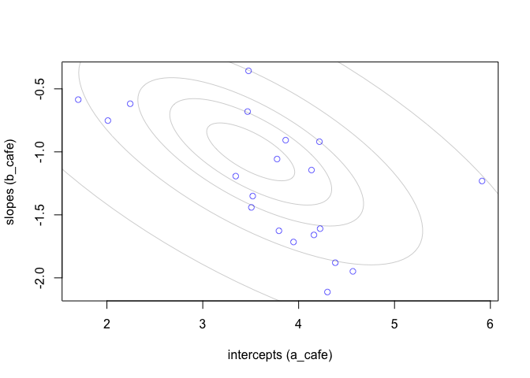
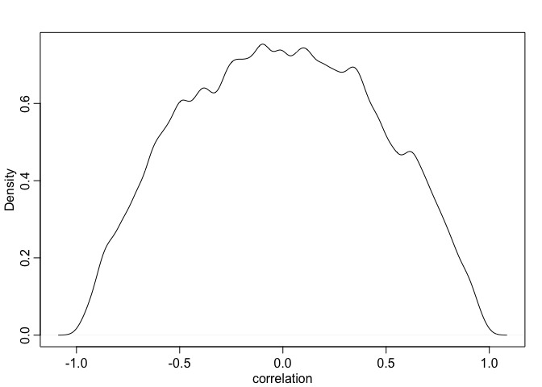
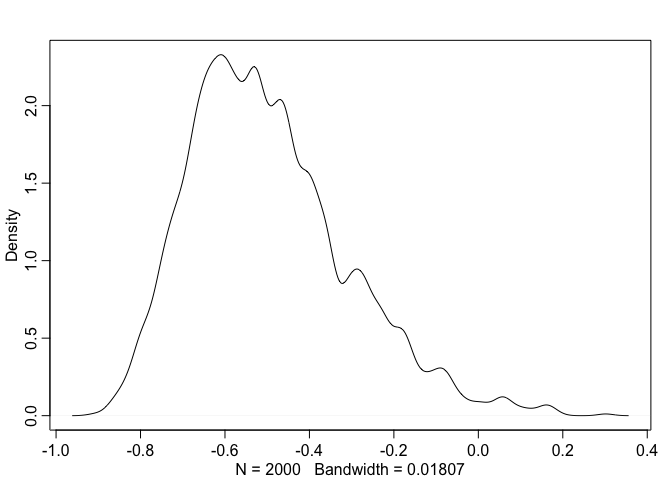
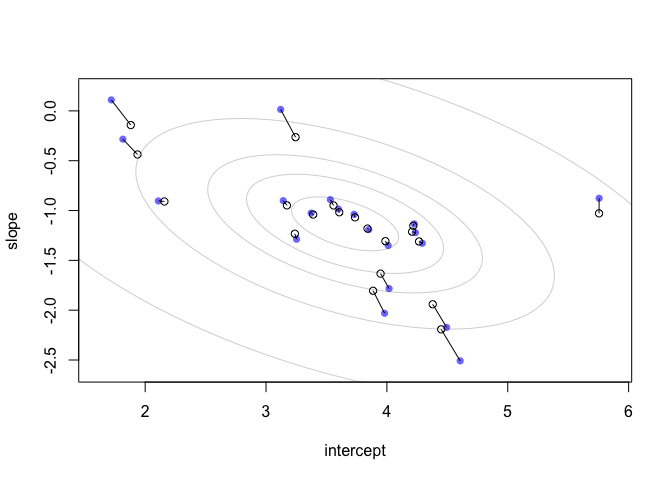
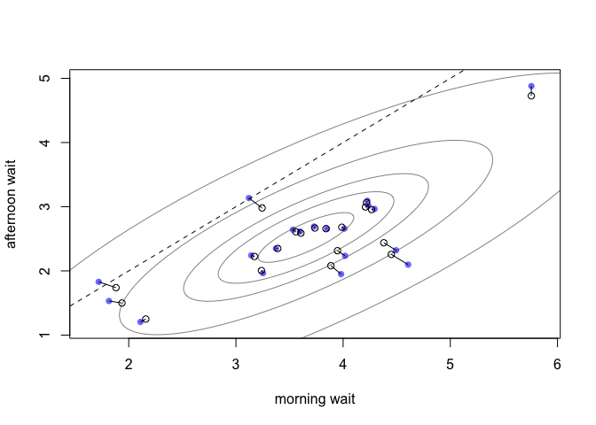

Problems
========

14E1
----

*Add to the following model varying slopes on the predictor
*

![
y\_i \\sim Normal(\\mu\_i, \\alpha) \\\\
\\mu\_i = \\alpha\_{group\[i\]} + \\beta X\_i \\\\
\\alpha\_{Group} \\sim Normal(\\alpha, \\sigma\_{\\alpha}) \\\\
\\alpha \\sim Normal(0, 10) \\\\
\\beta \\sim Normal(0,1) \\\\
\\sigma \\sim HalfCauchy(0, 2) \\\\
\\sigma\_\\alpha \\sim HalfCauchy(0,2) \\\\
](https://latex.codecogs.com/png.latex?%0Ay_i%20%5Csim%20Normal%28%5Cmu_i%2C%20%5Calpha%29%20%5C%5C%0A%5Cmu_i%20%3D%20%5Calpha_%7Bgroup%5Bi%5D%7D%20%2B%20%5Cbeta%20X_i%20%5C%5C%0A%5Calpha_%7BGroup%7D%20%5Csim%20Normal%28%5Calpha%2C%20%5Csigma_%7B%5Calpha%7D%29%20%5C%5C%0A%5Calpha%20%5Csim%20Normal%280%2C%2010%29%20%5C%5C%0A%5Cbeta%20%5Csim%20Normal%280%2C1%29%20%5C%5C%0A%5Csigma%20%5Csim%20HalfCauchy%280%2C%202%29%20%5C%5C%0A%5Csigma_%5Calpha%20%5Csim%20HalfCauchy%280%2C2%29%20%5C%5C%0A "
y_i \sim Normal(\mu_i, \alpha) \\
\mu_i = \alpha_{group[i]} + \beta X_i \\
\alpha_{Group} \sim Normal(\alpha, \sigma_{\alpha}) \\
\alpha \sim Normal(0, 10) \\
\beta \sim Normal(0,1) \\
\sigma \sim HalfCauchy(0, 2) \\
\sigma_\alpha \sim HalfCauchy(0,2) \\
")

answer:

![
y\_i \\sim Normal(\\mu\_i, \\alpha) \\\\
\\mu\_i = \\alpha\_{group\[i\]} + \\beta\_{group\[i\]} X\_i \\\\
\\left\[
\\begin{array}{c}
\\alpha\_{Group} \\\\
\\beta\_{Group}
\\end{array}
\\right\]
\\sim MVNormal
\\left(
\\left\[
\\begin{array}{c}
\\alpha\\\\
\\beta 
\\end{array}
\\right\]
,S
\\right) \\\\
S = \\left(
\\begin{array}{cc} 
\\sigma\_\\alpha & 0 \\\\
0 & \\sigma\_\\alpha
\\end{array}
\\right) 
\\mathbf{R}
\\left(
\\begin{array}{cc} 
\\sigma\_\\alpha & 0 \\\\
0 & \\sigma\_\\alpha
\\end{array}
\\right) \\\\
\\alpha \\sim Normal(0, 10) \\\\
\\beta \\sim Normal(0,1) \\\\
\\sigma \\sim HalfCauchy(0, 2) \\\\
\\sigma\_\\alpha \\sim HalfCauchy(0,2) \\\\
\\sigma\_\\beta \\sim HalfCauchy(0,2) \\\\
\\mathbf{R} \\sim LKJcorr(2)
](https://latex.codecogs.com/png.latex?%0Ay_i%20%5Csim%20Normal%28%5Cmu_i%2C%20%5Calpha%29%20%5C%5C%0A%5Cmu_i%20%3D%20%5Calpha_%7Bgroup%5Bi%5D%7D%20%2B%20%5Cbeta_%7Bgroup%5Bi%5D%7D%20X_i%20%5C%5C%0A%5Cleft%5B%0A%5Cbegin%7Barray%7D%7Bc%7D%0A%5Calpha_%7BGroup%7D%20%5C%5C%0A%5Cbeta_%7BGroup%7D%0A%5Cend%7Barray%7D%0A%5Cright%5D%0A%5Csim%20MVNormal%0A%5Cleft%28%0A%5Cleft%5B%0A%5Cbegin%7Barray%7D%7Bc%7D%0A%5Calpha%5C%5C%0A%5Cbeta%20%0A%5Cend%7Barray%7D%0A%5Cright%5D%0A%2CS%0A%5Cright%29%20%5C%5C%0AS%20%3D%20%5Cleft%28%0A%5Cbegin%7Barray%7D%7Bcc%7D%20%0A%5Csigma_%5Calpha%20%26%200%20%5C%5C%0A0%20%26%20%5Csigma_%5Calpha%0A%5Cend%7Barray%7D%0A%5Cright%29%20%0A%5Cmathbf%7BR%7D%0A%5Cleft%28%0A%5Cbegin%7Barray%7D%7Bcc%7D%20%0A%5Csigma_%5Calpha%20%26%200%20%5C%5C%0A0%20%26%20%5Csigma_%5Calpha%0A%5Cend%7Barray%7D%0A%5Cright%29%20%5C%5C%0A%5Calpha%20%5Csim%20Normal%280%2C%2010%29%20%5C%5C%0A%5Cbeta%20%5Csim%20Normal%280%2C1%29%20%5C%5C%0A%5Csigma%20%5Csim%20HalfCauchy%280%2C%202%29%20%5C%5C%0A%5Csigma_%5Calpha%20%5Csim%20HalfCauchy%280%2C2%29%20%5C%5C%0A%5Csigma_%5Cbeta%20%5Csim%20HalfCauchy%280%2C2%29%20%5C%5C%0A%5Cmathbf%7BR%7D%20%5Csim%20LKJcorr%282%29%0A "
y_i \sim Normal(\mu_i, \alpha) \\
\mu_i = \alpha_{group[i]} + \beta_{group[i]} X_i \\
\left[
\begin{array}{c}
\alpha_{Group} \\
\beta_{Group}
\end{array}
\right]
\sim MVNormal
\left(
\left[
\begin{array}{c}
\alpha\\
\beta 
\end{array}
\right]
,S
\right) \\
S = \left(
\begin{array}{cc} 
\sigma_\alpha & 0 \\
0 & \sigma_\alpha
\end{array}
\right) 
\mathbf{R}
\left(
\begin{array}{cc} 
\sigma_\alpha & 0 \\
0 & \sigma_\alpha
\end{array}
\right) \\
\alpha \sim Normal(0, 10) \\
\beta \sim Normal(0,1) \\
\sigma \sim HalfCauchy(0, 2) \\
\sigma_\alpha \sim HalfCauchy(0,2) \\
\sigma_\beta \sim HalfCauchy(0,2) \\
\mathbf{R} \sim LKJcorr(2)
")

14E2
----

*Think up a context in which varying intercepts will be positively
correlated with varying slopes. Provide a mechanistic explanation for
the correlation.*

Competitive plant growth, +/- true shade. LArge plants will outcomptete
smaller plants and get even bigger. small plants won't be able to
complete and will stay small.

14E3
----

*Whenisitpossibleforavaryingslopesmodeltohavefewereffectiveparameters(asestimated
by WAIC or DIC) than the corresponding model with fixed (unpooled)
slopes? Explain.*

If there is strong correlation between intercept and slope, then
effectively fewer parameters need to be estimated (because if you know
intercept you know slope).

14M1
----

*Repeat the café robot simulation from the beginning of the chapter.
This time, set rho to zero, so that there is no correlation between
intercepts and slopes. How does the posterior distribution of the
correlation reflect this change in the underlying simulation?*

### First, from the book:

Simulate some cafes

``` {.r}
## R code 14.1
a <- 3.5            # average morning wait time
b <- (-1)           # average difference afternoon wait time
sigma_a <- 1        # std dev in intercepts
sigma_b <- 0.5      # std dev in slopes
rho <- (-0.7)       # correlation between intercepts and slopes
```

``` {.r}
## R code 14.2
Mu <- c( a , b )

## R code 14.5
sigmas <- c(sigma_a,sigma_b) # standard deviations
Rho <- matrix( c(1,rho,rho,1) , nrow=2 ) # correlation matrix

# now matrix multiply to get covariance matrix
Sigma <- diag(sigmas) %*% Rho %*% diag(sigmas)
Sigma
```

    ##       [,1]  [,2]
    ## [1,]  1.00 -0.35
    ## [2,] -0.35  0.25

``` {.r}
## R code 14.6
N_cafes <- 20

## R code 14.7
library(MASS)
set.seed(5) # used to replicate example
vary_effects <- mvrnorm( N_cafes , Mu , Sigma )

## R code 14.8
a_cafe <- vary_effects[,1]
b_cafe <- vary_effects[,2]
```

now simulate sampling

``` {.r}
## R code 14.10
set.seed(22)
N_visits <- 10
afternoon <- rep(0:1,N_visits*N_cafes/2)
cafe_id <- rep( 1:N_cafes , each=N_visits )
mu <- a_cafe[cafe_id] + b_cafe[cafe_id]*afternoon
sigma <- 0.5  # std dev within cafes
wait <- rnorm( N_visits*N_cafes , mu , sigma )
d <- data.frame( cafe=cafe_id , afternoon=afternoon , wait=wait )
```

``` {.r}
## R code 14.12
m14.1 <- ulam(
    alist(
        wait ~ normal( mu , sigma ),
        mu <- a_cafe[cafe] + b_cafe[cafe]*afternoon,
        c(a_cafe,b_cafe)[cafe] ~ multi_normal( c(a,b) , Rho , sigma_cafe ),
        a ~ normal(5,2),
        b ~ normal(-1,0.5),
        sigma_cafe ~ exponential(1),
        sigma ~ exponential(1),
        Rho ~ lkj_corr(2)
    ) , data=d , chains=4 , cores=4, log_lik = TRUE )
```

### with rho 0

Simulate some cafes

``` {.r}
## R code 14.1
a <- 3.5            # average morning wait time
b <- (-1)           # average difference afternoon wait time
sigma_a <- 1        # std dev in intercepts
sigma_b <- 0.5      # std dev in slopes
rho <- (0)       # correlation between intercepts and slopes
```

``` {.r}
## R code 14.2
Mu <- c( a , b )

## R code 14.5
sigmas <- c(sigma_a,sigma_b) # standard deviations
Rho <- matrix( c(1,rho,rho,1) , nrow=2 ) # correlation matrix

# now matrix multiply to get covariance matrix
Sigma <- diag(sigmas) %*% Rho %*% diag(sigmas)
Sigma
```

    ##      [,1] [,2]
    ## [1,]    1 0.00
    ## [2,]    0 0.25

``` {.r}
## R code 14.6
N_cafes <- 20

## R code 14.7
set.seed(5) # used to replicate example
vary_effects <- mvrnorm( N_cafes , Mu , Sigma )

## R code 14.8
a_cafe <- vary_effects[,1]
b_cafe <- vary_effects[,2]
```

now simulate sampling

``` {.r}
## R code 14.10
set.seed(22)
N_visits <- 10
afternoon <- rep(0:1,N_visits*N_cafes/2)
cafe_id <- rep( 1:N_cafes , each=N_visits )
mu <- a_cafe[cafe_id] + b_cafe[cafe_id]*afternoon
sigma <- 0.5  # std dev within cafes
wait <- rnorm( N_visits*N_cafes , mu , sigma )
d_zero_rho <- data.frame( cafe=cafe_id , afternoon=afternoon , wait=wait )
```

``` {.r}
## R code 14.12
m14.1alt <- ulam(
    alist(
        wait ~ normal( mu , sigma ),
        mu <- a_cafe[cafe] + b_cafe[cafe]*afternoon,
        c(a_cafe,b_cafe)[cafe] ~ multi_normal( c(a,b) , Rho , sigma_cafe ),
        a ~ normal(5,2),
        b ~ normal(-1,0.5),
        sigma_cafe ~ exponential(1),
        sigma ~ exponential(1),
        Rho ~ lkj_corr(2)
    ) , data=d_zero_rho , chains=4 , cores=4, log_lik = TRUE )
```

    ## recompiling to avoid crashing R session

``` {.r}
precis(m14.1, depth=3, pars=c("a", "b", "Rho"))
```

    ##                mean           sd       5.5%      94.5%    n_eff      Rhat
    ## a         3.6540560 2.216840e-01  3.3042476  4.0038041 2534.471 0.9985916
    ## b        -1.1415404 1.437323e-01 -1.3683510 -0.9123456 2473.478 0.9995964
    ## Rho[1,1]  1.0000000 0.000000e+00  1.0000000  1.0000000      NaN       NaN
    ## Rho[1,2] -0.5020623 1.802186e-01 -0.7533067 -0.1868229 2463.166 0.9989320
    ## Rho[2,1] -0.5020623 1.802186e-01 -0.7533067 -0.1868229 2463.166 0.9989320
    ## Rho[2,2]  1.0000000 8.220706e-17  1.0000000  1.0000000 2112.773 0.9979980

``` {.r}
precis(m14.1alt, depth = 3, pars=c("a", "b", "Rho"))
```

    ##                 mean           sd       5.5%      94.5%    n_eff     Rhat
    ## a         3.71558153 2.258057e-01  3.3675259  4.0741742 2267.265 1.001063
    ## b        -1.10250653 1.473425e-01 -1.3329514 -0.8739319 2104.294 1.000082
    ## Rho[1,1]  1.00000000 0.000000e+00  1.0000000  1.0000000      NaN      NaN
    ## Rho[1,2] -0.05914906 2.319446e-01 -0.4208165  0.3257339 1887.576 1.001780
    ## Rho[2,1] -0.05914906 2.319446e-01 -0.4208165  0.3257339 1887.576 1.001780
    ## Rho[2,2]  1.00000000 9.527034e-17  1.0000000  1.0000000 2044.376 0.997998

correlation estimate now \~ zero, as expected.

14M2
----

*Fit this multilevel model (separate pooling) to the simulated café
data:*

``` {.r}
## R code 14.12
m14.M2 <- ulam(
    alist(
        wait ~ normal( mu , sigma ),
        mu <- a_cafe[cafe] + b_cafe[cafe]*afternoon,
        a_cafe[cafe] ~ normal(a_bar, a_sigma),
        b_cafe[cafe] ~ normal(b_bar, b_sigma),
        a_bar ~ normal(5,2),
        b_bar ~ normal(-1,0.5),
        a_sigma ~ exponential(1),
        b_sigma ~ exponential(1),
        sigma ~ exponential(1)
    ) , data=d , chains=4 , cores=4, log_lik=TRUE )
```

``` {.r}
compare(m14.1, m14.M2)
```

    ##            WAIC       SE     dWAIC      dSE    pWAIC    weight
    ## m14.1  305.2609 17.78987 0.0000000       NA 33.00102 0.5478858
    ## m14.M2 305.6451 17.99910 0.3842642 2.137314 32.27162 0.4521142

pretty much the same. had hoped this would make the case for correlative
pooling...

14M3
----

Book
====

Simulate some cafes

``` {.r}
## R code 14.1
a <- 3.5            # average morning wait time
b <- (-1)           # average difference afternoon wait time
sigma_a <- 1        # std dev in intercepts
sigma_b <- 0.5      # std dev in slopes
rho <- (-0.7)       # correlation between intercepts and slopes
```

``` {.r}
## R code 14.2
Mu <- c( a , b )

## R code 14.3
cov_ab <- sigma_a*sigma_b*rho
Sigma <- matrix( c(sigma_a^2,cov_ab,cov_ab,sigma_b^2) , ncol=2 )

## R code 14.4
matrix( c(1,2,3,4) , nrow=2 , ncol=2 )
```

    ##      [,1] [,2]
    ## [1,]    1    3
    ## [2,]    2    4

``` {.r}
## R code 14.5
sigmas <- c(sigma_a,sigma_b) # standard deviations
Rho <- matrix( c(1,rho,rho,1) , nrow=2 ) # correlation matrix

# now matrix multiply to get covariance matrix
Sigma <- diag(sigmas) %*% Rho %*% diag(sigmas)
Sigma
```

    ##       [,1]  [,2]
    ## [1,]  1.00 -0.35
    ## [2,] -0.35  0.25

``` {.r}
## R code 14.6
N_cafes <- 20

## R code 14.7
library(MASS)
set.seed(5) # used to replicate example
vary_effects <- mvrnorm( N_cafes , Mu , Sigma )

## R code 14.8
a_cafe <- vary_effects[,1]
b_cafe <- vary_effects[,2]

## R code 14.9
plot( a_cafe , b_cafe , col=rangi2 ,
    xlab="intercepts (a_cafe)" , ylab="slopes (b_cafe)" )

# overlay population distribution
library(ellipse)
```

    ## 
    ## Attaching package: 'ellipse'

    ## The following object is masked from 'package:rethinking':
    ## 
    ##     pairs

    ## The following object is masked from 'package:graphics':
    ## 
    ##     pairs

``` {.r}
for ( l in c(0.1,0.3,0.5,0.8,0.99) )
    lines(ellipse(Sigma,centre=Mu,level=l),col=col.alpha("black",0.2))
```

`<!-- -->`{=html}

now simulate sampling

``` {.r}
## R code 14.10
set.seed(22)
N_visits <- 10
afternoon <- rep(0:1,N_visits*N_cafes/2)
cafe_id <- rep( 1:N_cafes , each=N_visits )
mu <- a_cafe[cafe_id] + b_cafe[cafe_id]*afternoon
sigma <- 0.5  # std dev within cafes
wait <- rnorm( N_visits*N_cafes , mu , sigma )
d <- data.frame( cafe=cafe_id , afternoon=afternoon , wait=wait )
d
```

    ##     cafe afternoon      wait
    ## 1      1         0 3.9678929
    ## 2      1         1 3.8571978
    ## 3      1         0 4.7278755
    ## 4      1         1 2.7610133
    ## 5      1         0 4.1194827
    ## 6      1         1 3.5436522
    ## 7      1         0 4.1909492
    ## 8      1         1 2.5332235
    ## 9      1         0 4.1240321
    ## 10     1         1 2.7648868
    ## 11     2         0 1.6285444
    ## 12     2         1 1.2997086
    ## 13     2         0 2.3820122
    ## 14     2         1 1.2167166
    ## 15     2         0 1.6140508
    ## 16     2         1 0.7976508
    ## 17     2         0 2.4412792
    ## 18     2         1 2.2601987
    ## 19     2         0 2.4787735
    ## 20     2         1 0.4508602
    ## 21     3         0 4.2782826
    ## 22     3         1 2.6155598
    ## 23     3         0 4.2277546
    ## 24     3         1 2.0927322
    ## 25     3         0 4.2941706
    ## 26     3         1 2.8956186
    ## 27     3         0 4.6922298
    ## 28     3         1 2.1666390
    ## 29     3         0 4.9780066
    ## 30     3         1 1.8374065
    ## 31     4         0 3.6126323
    ## 32     4         1 1.5168045
    ## 33     4         0 3.6638952
    ## 34     4         1 1.8831005
    ## 35     4         0 2.8338139
    ## 36     4         1 1.7470407
    ## 37     4         0 3.3720479
    ## 38     4         1 2.6260871
    ## 39     4         0 2.7802535
    ## 40     4         1 2.0503973
    ## 41     5         0 1.5867226
    ## 42     5         1 1.3947669
    ## 43     5         0 2.0753433
    ## 44     5         1 2.0745109
    ## 45     5         0 2.2045744
    ## 46     5         1 2.7420834
    ## 47     5         0 1.6200965
    ## 48     5         1 1.2822865
    ## 49     5         0 1.1116341
    ## 50     5         1 1.6542109
    ## 51     6         0 3.6362822
    ## 52     6         1 3.2534341
    ## 53     6         0 3.3889599
    ## 54     6         1 3.2106004
    ## 55     6         0 4.8480520
    ## 56     6         1 2.9567778
    ## 57     6         0 4.9368840
    ## 58     6         1 2.5660084
    ## 59     6         0 4.6554610
    ## 60     6         1 2.8368435
    ## 61     7         0 3.3984235
    ## 62     7         1 2.8788324
    ## 63     7         0 3.7173417
    ## 64     7         1 2.1021608
    ## 65     7         0 3.3520633
    ## 66     7         1 3.0247287
    ## 67     7         0 3.8741506
    ## 68     7         1 3.2205101
    ## 69     7         0 3.6474687
    ## 70     7         1 1.8385930
    ## 71     8         0 3.6971708
    ## 72     8         1 2.1305167
    ## 73     8         0 3.7303181
    ## 74     8         1 2.0347525
    ## 75     8         0 4.1198843
    ## 76     8         1 1.9878978
    ## 77     8         0 3.5352774
    ## 78     8         1 2.3410838
    ## 79     8         0 5.0074088
    ## 80     8         1 2.6806061
    ## 81     9         0 4.4105403
    ## 82     9         1 3.1360459
    ## 83     9         0 3.5485809
    ## 84     9         1 3.2839353
    ## 85     9         0 4.7034413
    ## 86     9         1 2.1927989
    ## 87     9         0 4.1604345
    ## 88     9         1 2.3370569
    ## 89     9         0 3.2290943
    ## 90     9         1 2.3470523
    ## 91    10         0 3.7790783
    ## 92    10         1 2.7815778
    ## 93    10         0 3.6908124
    ## 94    10         1 2.6842041
    ## 95    10         0 3.6739399
    ## 96    10         1 2.7526249
    ## 97    10         0 3.3009887
    ## 98    10         1 2.5882405
    ## 99    10         0 3.2170385
    ## 100   10         1 2.4008392
    ## 101   11         0 1.3866774
    ## 102   11         1 1.2251146
    ## 103   11         0 1.5374481
    ## 104   11         1 1.8911030
    ## 105   11         0 2.0440251
    ## 106   11         1 1.4825473
    ## 107   11         0 2.3053675
    ## 108   11         1 2.0147873
    ## 109   11         0 1.8050769
    ## 110   11         1 1.0450414
    ## 111   12         0 4.0865711
    ## 112   12         1 1.6610791
    ## 113   12         0 3.4982132
    ## 114   12         1 2.2208548
    ## 115   12         0 2.9146148
    ## 116   12         1 3.0898881
    ## 117   12         0 4.5563579
    ## 118   12         1 3.3040109
    ## 119   12         0 4.1924795
    ## 120   12         1 3.0147962
    ## 121   13         0 3.9669914
    ## 122   13         1 2.0143616
    ## 123   13         0 4.0823665
    ## 124   13         1 1.2142337
    ## 125   13         0 3.8813289
    ## 126   13         1 1.8169712
    ## 127   13         0 3.5927248
    ## 128   13         1 2.7553118
    ## 129   13         0 4.3818435
    ## 130   13         1 1.9490383
    ## 131   14         0 3.2426154
    ## 132   14         1 1.6085752
    ## 133   14         0 2.4233729
    ## 134   14         1 1.8561347
    ## 135   14         0 4.1243762
    ## 136   14         1 2.3101760
    ## 137   14         0 3.1193893
    ## 138   14         1 2.4563408
    ## 139   14         0 2.8033230
    ## 140   14         1 2.9760704
    ## 141   15         0 5.1810238
    ## 142   15         1 2.5779341
    ## 143   15         0 4.4748711
    ## 144   15         1 1.8505316
    ## 145   15         0 4.9231077
    ## 146   15         1 2.2967337
    ## 147   15         0 4.3611941
    ## 148   15         1 1.6717649
    ## 149   15         0 4.0922197
    ## 150   15         1 2.0918128
    ## 151   16         0 3.1394434
    ## 152   16         1 1.9818328
    ## 153   16         0 3.7947913
    ## 154   16         1 2.9945802
    ## 155   16         0 3.4741649
    ## 156   16         1 2.2611456
    ## 157   16         0 3.5614384
    ## 158   16         1 2.4030906
    ## 159   16         0 2.8976436
    ## 160   16         1 2.0986390
    ## 161   17         0 3.8733157
    ## 162   17         1 3.0278342
    ## 163   17         0 4.4076139
    ## 164   17         1 3.1162877
    ## 165   17         0 4.0792206
    ## 166   17         1 2.8800927
    ## 167   17         0 4.6189638
    ## 168   17         1 3.0648752
    ## 169   17         0 4.2018437
    ## 170   17         1 2.9800223
    ## 171   18         0 4.8686274
    ## 172   18         1 4.8269026
    ## 173   18         0 5.3579401
    ## 174   18         1 4.7056985
    ## 175   18         0 6.5198872
    ## 176   18         1 4.8927955
    ## 177   18         0 6.1303904
    ## 178   18         1 5.1833383
    ## 179   18         0 5.9030889
    ## 180   18         1 4.7881800
    ## 181   19         0 3.7296292
    ## 182   19         1 2.9772458
    ## 183   19         0 2.6228565
    ## 184   19         1 3.2854654
    ## 185   19         0 3.8941007
    ## 186   19         1 3.0659216
    ## 187   19         0 2.7767559
    ## 188   19         1 3.4586721
    ## 189   19         0 2.5819582
    ## 190   19         1 2.8900848
    ## 191   20         0 3.6168188
    ## 192   20         1 1.9505858
    ## 193   20         0 3.8823709
    ## 194   20         1 2.9197521
    ## 195   20         0 3.5691201
    ## 196   20         1 2.1098063
    ## 197   20         0 3.7900409
    ## 198   20         1 2.8376260
    ## 199   20         0 3.7840564
    ## 200   20         1 3.6340586

``` {.r}
## R code 14.11
R <- rlkjcorr( 1e4 , K=2 , eta=2 )
dens( R[,1,2] , xlab="correlation" )
```

`<!-- -->`{=html}

``` {.r}
## R code 14.12
m14.1 <- ulam(
    alist(
        wait ~ normal( mu , sigma ),
        mu <- a_cafe[cafe] + b_cafe[cafe]*afternoon,
        c(a_cafe,b_cafe)[cafe] ~ multi_normal( c(a,b) , Rho , sigma_cafe ),
        a ~ normal(5,2),
        b ~ normal(-1,0.5),
        sigma_cafe ~ exponential(1),
        sigma ~ exponential(1),
        Rho ~ lkj_corr(2)
    ) , data=d , chains=4 , cores=4 )
```

``` {.r}
## R code 14.13
post <- extract.samples(m14.1)
dens( post$Rho[,1,2] )
```

`<!-- -->`{=html}

``` {.r}
## R code 14.14
# compute unpooled estimates directly from data
a1 <- sapply( 1:N_cafes ,
        function(i) mean(wait[cafe_id==i & afternoon==0]) )
b1 <- sapply( 1:N_cafes ,
        function(i) mean(wait[cafe_id==i & afternoon==1]) ) - a1

# extract posterior means of partially pooled estimates
post <- extract.samples(m14.1)
a2 <- apply( post$a_cafe , 2 , mean )
b2 <- apply( post$b_cafe , 2 , mean )

# plot both and connect with lines
plot( a1 , b1 , xlab="intercept" , ylab="slope" ,
    pch=16 , col=rangi2 , ylim=c( min(b1)-0.1 , max(b1)+0.1 ) ,
    xlim=c( min(a1)-0.1 , max(a1)+0.1 ) )
points( a2 , b2 , pch=1 )
for ( i in 1:N_cafes ) lines( c(a1[i],a2[i]) , c(b1[i],b2[i]) )

## R code 14.15
# compute posterior mean bivariate Gaussian
Mu_est <- c( mean(post$a) , mean(post$b) )
rho_est <- mean( post$Rho[,1,2] )
sa_est <- mean( post$sigma_cafe[,1] )
sb_est <- mean( post$sigma_cafe[,2] )
cov_ab <- sa_est*sb_est*rho_est
Sigma_est <- matrix( c(sa_est^2,cov_ab,cov_ab,sb_est^2) , ncol=2 )

# draw contours
library(ellipse)
for ( l in c(0.1,0.3,0.5,0.8,0.99) )
    lines(ellipse(Sigma_est,centre=Mu_est,level=l),
        col=col.alpha("black",0.2))
```

`<!-- -->`{=html}

``` {.r}
## R code 14.16
# convert varying effects to waiting times
wait_morning_1 <- (a1)
wait_afternoon_1 <- (a1 + b1)
wait_morning_2 <- (a2)
wait_afternoon_2 <- (a2 + b2)

# plot both and connect with lines
plot( wait_morning_1 , wait_afternoon_1 , xlab="morning wait" ,
    ylab="afternoon wait" , pch=16 , col=rangi2 ,
    ylim=c( min(wait_afternoon_1)-0.1 , max(wait_afternoon_1)+0.1 ) ,
    xlim=c( min(wait_morning_1)-0.1 , max(wait_morning_1)+0.1 ) )
points( wait_morning_2 , wait_afternoon_2 , pch=1 )
for ( i in 1:N_cafes )
    lines( c(wait_morning_1[i],wait_morning_2[i]) ,
    c(wait_afternoon_1[i],wait_afternoon_2[i]) )
abline( a=0 , b=1 , lty=2 )

## R code 14.17
# now shrinkage distribution by simulation
v <- mvrnorm( 1e4 , Mu_est , Sigma_est )
v[,2] <- v[,1] + v[,2] # calculate afternoon wait
Sigma_est2 <- cov(v)
Mu_est2 <- Mu_est
Mu_est2[2] <- Mu_est[1]+Mu_est[2]

# draw contours
library(ellipse)
for ( l in c(0.1,0.3,0.5,0.8,0.99) )
    lines(ellipse(Sigma_est2,centre=Mu_est2,level=l),
        col=col.alpha("black",0.5))
```

`<!-- -->`{=html}

``` {.r}
## R code 14.18
library(rethinking)
data(chimpanzees)
d <- chimpanzees
d$block_id <- d$block
d$treatment <- 1L + d$prosoc_left + 2L*d$condition

dat <- list(
    L = d$pulled_left,
    tid = d$treatment,
    actor = d$actor,
    block_id = as.integer(d$block_id) )

m14.2 <- ulam(
    alist(
        L ~ binomial(1,p),
        logit(p) <- g[tid] + alpha[actor,tid] + beta[block_id,tid],

        # adaptive priors
        vector[4]:alpha[actor] ~ multi_normal(0,Rho_actor,sigma_actor),
        vector[4]:beta[block_id] ~ multi_normal(0,Rho_block,sigma_block),

        # fixed priors
        g[tid] ~ dnorm(0,1),
        sigma_actor ~ dexp(1),
        Rho_actor ~ dlkjcorr(4),
        sigma_block ~ dexp(1),
        Rho_block ~ dlkjcorr(4)
    ) , data=dat , chains=4 , cores=4 )

## R code 14.19
m14.3 <- ulam(
    alist(
        L ~ binomial(1,p),
        logit(p) <- g[tid] + alpha[actor,tid] + beta[block_id,tid],

        # adaptive priors - non-centered
        transpars> matrix[actor,4]:alpha <-
                compose_noncentered( sigma_actor , L_Rho_actor , z_actor ),
        transpars> matrix[block_id,4]:beta <-
                compose_noncentered( sigma_block , L_Rho_block , z_block ),
        matrix[4,actor]:z_actor ~ normal( 0 , 1 ),
        matrix[4,block_id]:z_block ~ normal( 0 , 1 ),

        # fixed priors
        g[tid] ~ normal(0,1),
        vector[4]:sigma_actor ~ dexp(1),
        cholesky_factor_corr[4]:L_Rho_actor ~ lkj_corr_cholesky( 2 ),
        vector[4]:sigma_block ~ dexp(1),
        cholesky_factor_corr[4]:L_Rho_block ~ lkj_corr_cholesky( 2 ),

        # compute ordinary correlation matrixes from Cholesky factors
        gq> matrix[4,4]:Rho_actor <<- multiply_lower_tri_self_transpose(L_Rho_actor),
        gq> matrix[4,4]:Rho_block <<- multiply_lower_tri_self_transpose(L_Rho_block)
    ) , data=dat , chains=4 , cores=4 , log_lik=TRUE )

## R code 14.20
# extract n_eff values for each model
neff_nc <- precis(m14.3,3,pars=c("alpha","beta"))$n_eff
neff_c <- precis(m14.2,3,pars=c("alpha","beta"))$n_eff
plot( neff_c , neff_nc , xlab="centered (default)" ,
    ylab="non-centered (cholesky)" , lwd=1.5 )
abline(a=0,b=1,lty=2)

## R code 14.21
precis( m14.3 , depth=2 , pars=c("sigma_actor","sigma_block") )

## R code 14.22
# compute mean for each actor in each treatment
pl <- by( d$pulled_left , list( d$actor , d$treatment ) , mean )

# generate posterior predictions using link
datp <- list(
    actor=rep(1:7,each=4) ,
    tid=rep(1:4,times=7) ,
    block_id=rep(5,times=4*7) )
p_post <- link( m14.3 , data=datp )
p_mu <- apply( p_post , 2 , mean )
p_ci <- apply( p_post , 2 , PI )

# set up plot
plot( NULL , xlim=c(1,28) , ylim=c(0,1) , xlab="" ,
    ylab="proportion left lever" , xaxt="n" , yaxt="n" )
axis( 2 , at=c(0,0.5,1) , labels=c(0,0.5,1) )
abline( h=0.5 , lty=2 )
for ( j in 1:7 ) abline( v=(j-1)*4+4.5 , lwd=0.5 )
for ( j in 1:7 ) text( (j-1)*4+2.5 , 1.1 , concat("actor ",j) , xpd=TRUE )

xo <- 0.1 # offset distance to stagger raw data and predictions
# raw data
for ( j in (1:7)[-2] ) {
    lines( (j-1)*4+c(1,3)-xo , pl[j,c(1,3)] , lwd=2 , col=rangi2 )
    lines( (j-1)*4+c(2,4)-x0 , pl[j,c(2,4)] , lwd=2 , col=rangi2 )
}
points( 1:28-xo , t(pl) , pch=16 , col="white" , cex=1.7 )
points( 1:28-xo , t(pl) , pch=c(1,1,16,16) , col=rangi2 , lwd=2 )

yoff <- 0.175
text( 1-xo , pl[1,1]-yoff , "R/N" , pos=1 , cex=0.8 )
text( 2-xo , pl[1,2]+yoff , "L/N" , pos=3 , cex=0.8 )
text( 3-xo , pl[1,3]-yoff , "R/P" , pos=1 , cex=0.8 )
text( 4-xo , pl[1,4]+yoff , "L/P" , pos=3 , cex=0.8 )

# posterior predictions
for ( j in (1:7)[-2] ) {
    lines( (j-1)*4+c(1,3)+xo , p_mu[(j-1)*4+c(1,3)] , lwd=2 )
    lines( (j-1)*4+c(2,4)+xo , p_mu[(j-1)*4+c(2,4)] , lwd=2 )
}
for ( i in 1:28 ) lines( c(i,i)+xo , p_ci[,i] , lwd=1 )
points( 1:28+xo , p_mu , pch=16 , col="white" , cex=1.3 )
points( 1:28+xo , p_mu , pch=c(1,1,16,16) )

## R code 14.23
set.seed(73)
N <- 500
U_sim <- rnorm( N )
Q_sim <- sample( 1:4 , size=N , replace=TRUE )
E_sim <- rnorm( N , U_sim + Q_sim )
W_sim <- rnorm( N , U_sim + 0*E_sim )
dat_sim <- list(
    W=standardize(W_sim) ,
    E=standardize(E_sim) ,
    Q=standardize(Q_sim) )

## R code 14.24
m14.4 <- ulam(
    alist(
        W ~ dnorm( mu , sigma ),
        mu <- aW + bEW*E,
        aW ~ dnorm( 0 , 0.2 ),
        bEW ~ dnorm( 0 , 0.5 ),
        sigma ~ dexp( 1 )
    ) , data=dat_sim , chains=4 , cores=4 )
precis( m14.4 )

## R code 14.25
m14.5 <- ulam(
    alist(
        c(W,E) ~ multi_normal( c(muW,muE) , Rho , Sigma ),
        muW <- aW + bEW*E,
        muE <- aE + bQE*Q,
        c(aW,aE) ~ normal( 0 , 0.2 ),
        c(bEW,bQE) ~ normal( 0 , 0.5 ),
        Rho ~ lkj_corr( 2 ),
        Sigma ~ exponential( 1 )
    ), data=dat_sim , chains=4 , cores=4 )
precis( m14.5 , depth=3 )

## R code 14.26
m14.4x <- ulam( m14.4 , data=dat_sim , chains=4 , cores=4 )
m14.5x <- ulam( m14.5 , data=dat_sim , chains=4 , cores=4 )

## R code 14.27
set.seed(73)
N <- 500
U_sim <- rnorm( N )
Q_sim <- sample( 1:4 , size=N , replace=TRUE )
E_sim <- rnorm( N , U_sim + Q_sim )
W_sim <- rnorm( N , -U_sim + 0.2*E_sim )
dat_sim <- list(
    W=standardize(W_sim) ,
    E=standardize(E_sim) ,
    Q=standardize(Q_sim) )

## R code 14.28
library(dagitty)
dagIV <- dagitty( "dag{
    E -> W
    E <- U -> W
    Q -> E
}")
instrumentalVariables( dagIV , exposure="E" , outcome="W" )

## R code 14.29
library(rethinking)
data(KosterLeckie)

## R code 14.30
kl_data <- list(
    N = nrow(kl_dyads),
    N_households = max(kl_dyads$hidB),
    did = kl_dyads$did,
    hidA = kl_dyads$hidA,
    hidB = kl_dyads$hidB,
    giftsAB = kl_dyads$giftsAB,
    giftsBA = kl_dyads$giftsBA
)

m14.4 <- ulam(
    alist(
        giftsAB ~ poisson( lambdaAB ),
        giftsBA ~ poisson( lambdaBA ),
        log(lambdaAB) <- a + gr[hidA,1] + gr[hidB,2] + d[did,1] ,
        log(lambdaBA) <- a + gr[hidB,1] + gr[hidA,2] + d[did,2] ,
        a ~ normal(0,1),

       ## gr matrix of varying effects
        vector[2]:gr[N_households] ~ multi_normal(0,Rho_gr,sigma_gr),
        Rho_gr ~ lkj_corr(4),
        sigma_gr ~ exponential(1),

       ## dyad effects
        transpars> matrix[N,2]:d <-
                compose_noncentered( rep_vector(sigma_d,2) , L_Rho_d , z ),
        matrix[2,N]:z ~ normal( 0 , 1 ),
        cholesky_factor_corr[2]:L_Rho_d ~ lkj_corr_cholesky( 8 ),
        sigma_d ~ exponential(1),

       ## compute correlation matrix for dyads
        gq> matrix[2,2]:Rho_d <<- Chol_to_Corr( L_Rho_d )
    ), data=kl_data , chains=4 , cores=4 , iter=2000 )

## R code 14.31
precis( m14.4 , depth=3 , pars=c("Rho_gr","sigma_gr") )

## R code 14.32
post <- extract.samples( m14.4 )
g <- sapply( 1:25 , function(i) post$a + post$gr[,i,1] )
r <- sapply( 1:25 , function(i) post$a + post$gr[,i,2] )
Eg_mu <- apply( exp(g) , 2 , mean )
Er_mu <- apply( exp(r) , 2 , mean )

## R code 14.33
plot( NULL , xlim=c(0,8.6) , ylim=c(0,8.6) , xlab="generalized giving" ,
    ylab="generalized receiving" , lwd=1.5 )
abline(a=0,b=1,lty=2)

# ellipses
library(ellipse)
for ( i in 1:25 ) {
    Sigma <- cov( cbind( g[,i] , r[,i] ) )
    Mu <- c( mean(g[,i]) , mean(r[,i]) )
    for ( l in c(0.5) ) {
        el <- ellipse( Sigma , centre=Mu , level=l )
        lines( exp(el) , col=col.alpha("black",0.5) )
    }
}
# household means
points( Eg_mu , Er_mu , pch=21 , bg="white" , lwd=1.5 )

## R code 14.34
precis( m14.4 , depth=3 , pars=c("Rho_d","sigma_d") )

## R code 14.35
dy1 <- apply( post$d[,,1] , 2 , mean )
dy2 <- apply( post$d[,,2] , 2 , mean )
plot( dy1 , dy2 )

## R code 14.36
# load the distance matrix
library(rethinking)
data(islandsDistMatrix)

# display (measured in thousands of km)
Dmat <- islandsDistMatrix
colnames(Dmat) <- c("Ml","Ti","SC","Ya","Fi","Tr","Ch","Mn","To","Ha")
round(Dmat,1)

## R code 14.37
# linear
curve( exp(-1*x) , from=0 , to=4 , lty=2 ,
    xlab="distance" , ylab="correlation" )

# squared
curve( exp(-1*x^2) , add=TRUE )

## R code 14.38
data(Kline2) # load the ordinary data, now with coordinates
d <- Kline2
d$society <- 1:10 # index observations

dat_list <- list(
    T = d$total_tools,
    P = d$population,
    society = d$society,
    Dmat=islandsDistMatrix )

m14.7 <- ulam(
    alist(
        T ~ dpois(lambda),
        lambda <- (a*P^b/g)*exp(k[society]),
        vector[10]:k ~ multi_normal( 0 , SIGMA ),
        matrix[10,10]:SIGMA <- cov_GPL2( Dmat , etasq , rhosq , 0.01 ),
        c(a,b,g) ~ dexp( 1 ),
        etasq ~ dexp( 2 ),
        rhosq ~ dexp( 0.5 )
    ), data=dat_list , chains=4 , cores=4 , iter=2000 )

## R code 14.39
precis( m14.7 , depth=3 )

## R code 14.40
post <- extract.samples(m14.7)

# plot the posterior median covariance function
plot( NULL , xlab="distance (thousand km)" , ylab="covariance" ,
    xlim=c(0,10) , ylim=c(0,2) )

# compute posterior mean covariance
x_seq <- seq( from=0 , to=10 , length.out=100 )
pmcov <- sapply( x_seq , function(x) post$etasq*exp(-post$rhosq*x^2) )
pmcov_mu <- apply( pmcov , 2 , mean )
lines( x_seq , pmcov_mu , lwd=2 )

# plot 60 functions sampled from posterior
for ( i in 1:50 )
    curve( post$etasq[i]*exp(-post$rhosq[i]*x^2) , add=TRUE ,
        col=col.alpha("black",0.3) )

## R code 14.41
# compute posterior median covariance among societies
K <- matrix(0,nrow=10,ncol=10)
for ( i in 1:10 )
    for ( j in 1:10 )
        K[i,j] <- median(post$etasq) *
                  exp( -median(post$rhosq) * islandsDistMatrix[i,j]^2 )
diag(K) <- median(post$etasq) + 0.01

## R code 14.42
# convert to correlation matrix
Rho <- round( cov2cor(K) , 2 )
# add row/col names for convenience
colnames(Rho) <- c("Ml","Ti","SC","Ya","Fi","Tr","Ch","Mn","To","Ha")
rownames(Rho) <- colnames(Rho)
Rho

## R code 14.43
# scale point size to logpop
psize <- d$logpop / max(d$logpop)
psize <- exp(psize*1.5)-2

# plot raw data and labels
plot( d$lon2 , d$lat , xlab="longitude" , ylab="latitude" ,
    col=rangi2 , cex=psize , pch=16 , xlim=c(-50,30) )
labels <- as.character(d$culture)
text( d$lon2 , d$lat , labels=labels , cex=0.7 , pos=c(2,4,3,3,4,1,3,2,4,2) )

# overlay lines shaded by Rho
for( i in 1:10 )
    for ( j in 1:10 )
        if ( i < j )
            lines( c( d$lon2[i],d$lon2[j] ) , c( d$lat[i],d$lat[j] ) ,
                lwd=2 , col=col.alpha("black",Rho[i,j]^2) )

## R code 14.44
# compute posterior median relationship, ignoring distance
logpop.seq <- seq( from=6 , to=14 , length.out=30 )
lambda <- sapply( logpop.seq , function(lp) exp( post$a + post$bp*lp ) )
lambda.median <- apply( lambda , 2 , median )
lambda.PI80 <- apply( lambda , 2 , PI , prob=0.8 )

# plot raw data and labels
plot( d$logpop , d$total_tools , col=rangi2 , cex=psize , pch=16 ,
    xlab="log population" , ylab="total tools" )
text( d$logpop , d$total_tools , labels=labels , cex=0.7 ,
    pos=c(4,3,4,2,2,1,4,4,4,2) )

# display posterior predictions
lines( logpop.seq , lambda.median , lty=2 )
lines( logpop.seq , lambda.PI80[1,] , lty=2 )
lines( logpop.seq , lambda.PI80[2,] , lty=2 )

# overlay correlations
for( i in 1:10 )
    for ( j in 1:10 )
        if ( i < j )
            lines( c( d$logpop[i],d$logpop[j] ) ,
                   c( d$total_tools[i],d$total_tools[j] ) ,
                   lwd=2 , col=col.alpha("black",Rho[i,j]^2) )

## R code 14.45
m14.7nc <- ulam(
    alist(
        T ~ dpois(lambda),
        lambda <- (a*P^b/g)*exp(k[society]),

        # non-centered Gaussian Process prior
        transpars> vector[10]: k <<- L_SIGMA * z,
        vector[10]: z ~ normal( 0 , 1 ),
        transpars> matrix[10,10]: L_SIGMA <<- cholesky_decompose( SIGMA ),
        transpars> matrix[10,10]: SIGMA <- cov_GPL2( Dmat , etasq , rhosq , 0.01 ),

        c(a,b,g) ~ dexp( 1 ),
        etasq ~ dexp( 2 ),
        rhosq ~ dexp( 0.5 )
    ), data=dat_list , chains=4 , cores=4 , iter=2000 )

## R code 14.46
library(rethinking)
data(Primates301)
data(Primates301_nex)

# plot it using ape package - install.packages('ape') if needed
library(ape)
plot( ladderize(Primates301_nex) , type="fan" , font=1 , no.margin=TRUE ,
    label.offset=1 , cex=0.5 )

## R code 14.47
d <- Primates301
d$name <- as.character(d$name)
dstan <- d[ complete.cases( d$group_size , d$body , d$brain ) , ]
spp_obs <- dstan$name

## R code 14.48
dat_list <- list(
    N_spp = nrow(dstan),
    M = standardize(log(dstan$body)),
    B = standardize(log(dstan$brain)),
    G = standardize(log(dstan$group_size)),
    Imat = diag( nrow(dstan) )
)

m14.8 <- ulam(
    alist(
        B ~ multi_normal( mu , SIGMA ),
        mu <- a + bM*M + bG*G,
        matrix[N_spp,N_spp]: SIGMA <- Imat * sigma_sq,
        a ~ normal( 0 , 1 ),
        c(bM,bG) ~ normal( 0 , 0.5 ),
        sigma_sq ~ exponential( 1 )
    ), data=dat_list , chains=4 , cores=4 )
precis( m14.8 )

## R code 14.49
library(ape)
tree_trimmed <- keep.tip( Primates301_nex, spp_obs )
Rbm <- corBrownian( phy=tree_trimmed )
V <- vcv(Rbm)
Dmat <- cophenetic( tree_trimmed )
plot( Dmat , V , xlab="phylogenetic distance" , ylab="covariance" )

## R code 14.50
# put species in right order
dat_list$V <- V[ spp_obs , spp_obs ]
# convert to correlation matrix
dat_list$R <- dat_list$V / max(V)

# Brownian motion model
m14.9 <- ulam(
    alist(
        B ~ multi_normal( mu , SIGMA ),
        mu <- a + bM*M + bG*G,
        matrix[N_spp,N_spp]: SIGMA <- R * sigma_sq,
        a ~ normal( 0 , 1 ),
        c(bM,bG) ~ normal( 0 , 0.5 ),
        sigma_sq ~ exponential( 1 )
    ), data=dat_list , chains=4 , cores=4 )
precis( m14.9 )

## R code 14.51
# add scaled and reordered distance matrix
dat_list$Dmat <- Dmat[ spp_obs , spp_obs ] / max(Dmat)

m14.10 <- ulam(
    alist(
        B ~ multi_normal( mu , SIGMA ),
        mu <- a + bM*M + bG*G,
        matrix[N_spp,N_spp]: SIGMA <- cov_GPL1( Dmat , etasq , rhosq , 0.01 ),
        a ~ normal(0,1),
        c(bM,bG) ~ normal(0,0.5),
        etasq ~ half_normal(1,0.25),
        rhosq ~ half_normal(3,0.25)
    ), data=dat_list , chains=4 , cores=4 )
precis( m14.10 )

## R code 14.52
post <- extract.samples(m14.10)
plot( NULL , xlim=c(0,max(dat_list$Dmat)) , ylim=c(0,1.5) ,
    xlab="phylogenetic distance" , ylab="covariance" )

# posterior
for ( i in 1:30 )
    curve( post$etasq[i]*exp(-post$rhosq[i]*x) , add=TRUE , col=rangi2 )

# prior mean and 89% interval
eta <- abs(rnorm(1e3,1,0.25))
rho <- abs(rnorm(1e3,3,0.25))
d_seq <- seq(from=0,to=1,length.out=50)
K <- sapply( d_seq , function(x) eta*exp(-rho*x) )
lines( d_seq , colMeans(K) , lwd=2 )
shade( apply(K,2,PI) , d_seq )
text( 0.5 , 0.5 , "prior" )
text( 0.2 , 0.1 , "posterior" , col=rangi2 )

## R code 14.53
S <- matrix( c( sa^2 , sa*sb*rho , sa*sb*rho , sb^2 ) , nrow=2 )
```
