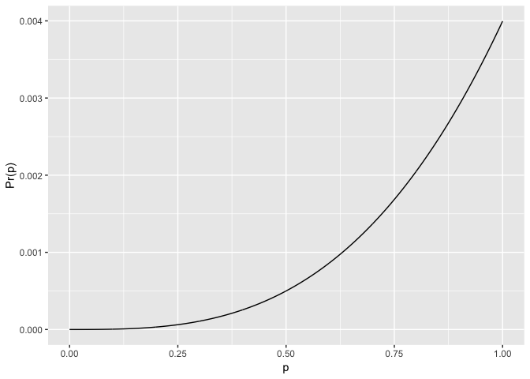
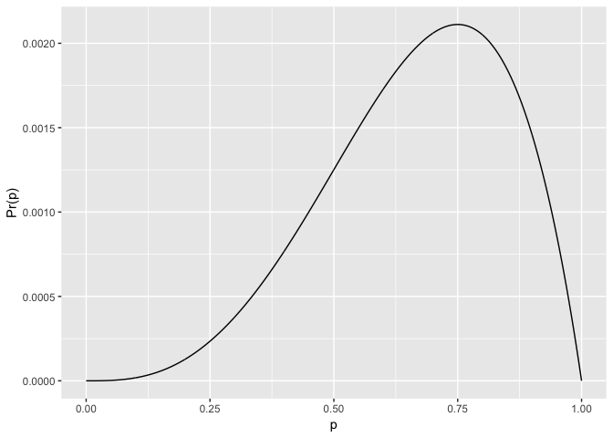
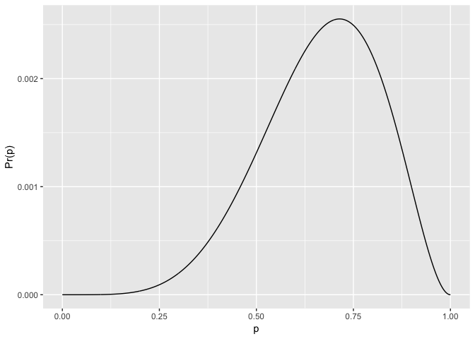
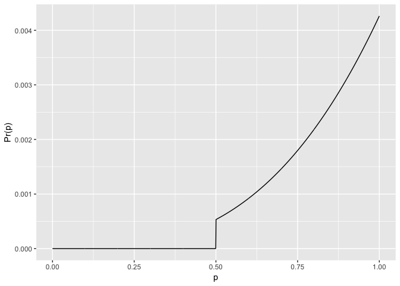
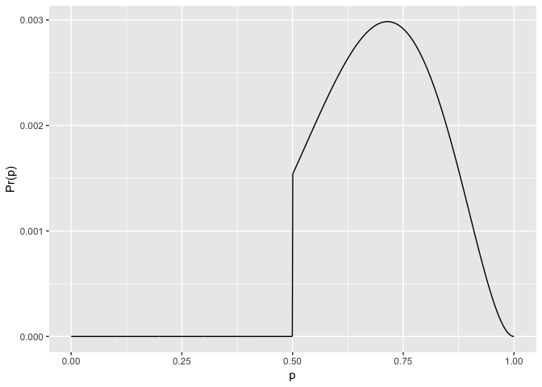

## 2E1. 
_Which of the expressions below correspond to the statement: the probability of rain on Monday?_
(1) Pr(rain)
(2) Pr(rain|Monday)
(3) Pr(Monday|rain)
(4) Pr(rain, Monday) /Pr(Monday)

### Answer:
2

## 2E2. 
_Which of the following statements corresponds to the expression: Pr(Monday|rain)?_
(1) The probability of rain on Monday.
(2) The probability of rain, given that it is Monday.
(3) The probability that it is Monday, given that it is raining.
(4) The probability that it is Monday and that it is raining.

### Answer:
3

## 2E3. 
_2E3. Which of the expressions below correspond to the statement: the probability that it is Monday,_
_given that it is raining?_
(1) Pr(Monday|rain)
(2) Pr(rain|Monday)
(3) Pr(rain|Monday)Pr(Monday)
(4) Pr(rain|Monday)Pr(Monday)/Pr(rain)
(5) Pr(Monday|rain)Pr(rain)/Pr(Monday)

### Answer:
1


## 2M1. 
_Recall the globe tossing model from the chapter. Compute and plot the grid approximate posterior distribution for each of the following sets of observations. In each case, assume a uniform prior for p._
(1) W,W,W
(2) W,W,W,L
(3) L,W,W,L,W,W,W


```r
library(tidyverse)
```

```
## ── Attaching packages ─────────────────────────────────────────────────────────────── tidyverse 1.2.1 ──
```

```
## ✔ ggplot2 3.0.0     ✔ purrr   0.2.5
## ✔ tibble  1.4.2     ✔ dplyr   0.7.6
## ✔ tidyr   0.8.1     ✔ stringr 1.3.1
## ✔ readr   1.1.1     ✔ forcats 0.3.0
```

```
## ── Conflicts ────────────────────────────────────────────────────────────────── tidyverse_conflicts() ──
## ✖ dplyr::filter() masks stats::filter()
## ✖ dplyr::lag()    masks stats::lag()
```


```r
grid_binom <- function(w,n,grid.size=1000) {
  grid_p <- seq(0,1,length.out = grid.size)
  prior <- rep(1,grid.size)
  likelihood <- dbinom(w, n ,grid_p)
  unstd.posterior <- prior*likelihood
  posterior <- unstd.posterior / sum(unstd.posterior)
  qplot(grid_p, posterior, geom="line") + 
    xlab("p") + 
    ylab("Pr(p)")
}
```


### 1 W,W,W

```r
grid_binom(3,3)
```

<!-- -->

### (2) W,W,W,L


```r
grid_binom(3,4)
```

<!-- -->


### (3) L,W,W,L,W,W,W


```r
grid_binom(5, 7)
```

<!-- -->

## 2M2. 
_Now assume a prior for p that is equal to zero when p < 0.5 and is a positive constant when p ≥ 0.5. Again compute and plot the grid approximate posterior distribution for each of the sets of observations in the problem just above._


```r
grid_binom2 <- function(w,n,grid.size=1000) {
  grid_p <- seq(0,1,length.out = grid.size)
  prior <- rep(1,grid.size)
  prior <- ifelse(grid_p < .5, 0, 1)
  likelihood <- dbinom(w, n ,grid_p)
  unstd.posterior <- prior*likelihood
  posterior <- unstd.posterior / sum(unstd.posterior)
  qplot(grid_p, posterior, geom="line") + 
    xlab("p") + 
    ylab("Pr(p)")
}
```


```r
grid_binom2(3,3)
```

<!-- -->

```r
grid_binom2(3,4)
```

<!-- -->

```r
grid_binom2(5,7)
```

<!-- -->


## 2M3. 
_Suppose there are two globes, one for Earth and one for Mars. The Earth globe is 70% covered in water. The Mars globe is 100% land. Further suppose that one of these globes—you don’t know which—was tossed in the air and produced a “land” observation. Assume that each globe was equally likely to be tossed. Show that the posterior probability that the globe was the Earth, conditional on seeing “land” (Pr(Earth|land)), is 0.23._


```r
prior <- c(0.5 , 0.5) # first is for earth, second is for mars
prob <- c(0.7, 0) # prob of water for earth, and for mars
likelihood <- dbinom(0, 1, prob) # likelihood for earth and for mars
unstd.post <- likelihood * prior
post <- unstd.post / sum(unstd.post)
post
```

```
## [1] 0.2307692 0.7692308
```

## 2M4. 
_Suppose you have a deck with only three cards. Each card has two sides, and each side is either black or white. One card has two black sides. The second card has one black and one white side. The third card has two white sides. Now suppose all three cards are placed in a bag and shuffled. Someone reaches into the bag and pulls out a card and places it flat on a table. A black side is shown facing up, but you don’t know the color of the side facing down. Show that the probability that the other side is also black is 2/3. Use the counting method (Section 2 of the chapter) to approach this problem. This means counting up the ways that each card could produce the observed data (a black side facing up on the table)._

### Answer

It is best to think of the number of "sides" rather than the number of cards.

Since there are three B sides, there are three ways to get B up.  So for the three ways, what is the color of the other side? 2 are B, 1 is W.

## 2M5. 
_Now suppose there are four cards: B/B, B/W, W/W, and another B/B. Again suppose a card is drawn from the bag and a black side appears face up. Again calculate the probability that the other side is black._

Again, think of sides:

5 ways to get B up.  4 of those 5 have B on the other side, so prob of B on the other side is 0.8


## 2M6. 
_Imagine that black ink is heavy, and so cards with black sides are heavier thancards with white sides. As a result, it’s less likely that a card with black sides is pulled from the bag. So again assume there are three cards: B/B, B/W, and W/W. After experimenting a number of times, you conclude that for every way to pull the B/B card from the bag, there are 2 ways to pull the B/W card and 3 ways to pull the W/W card. Again suppose that a card is pulled and a black side appears face up. Show that the probability the other side is black is now 0.5. Use the counting method, as before._

| card | ways to pull from bag | way to pull B side up | product | prob |
|:-----|:----------------------|:----------------------|:--------|:-----|
| W/W  | 3                     | 0                     | 0       | 0    |
| B/W  | 2                     | 1                     | 2       | .5   |
| B/B  | 1                     | 2                     | 2       | .5   |


##2M7. 
Assume again the original card problem, with a single card showing a blackside face up. Before looking at the other side, we draw another card from the bag and lay it face up on the table. The face that is shown on the new card is white. Show that the probability that the first card, the one showing a black side, has black on its other side is now 0.75. Use the counting method, if you can. Hint: Treat this like the sequence of globe tosses, counting all the ways to see each observation, for each possible first card.
