## Easy


```r
p_grid <- seq( from=0 , to=1 , length.out=1000 )
prior <- rep( 1 , 1000 )
likelihood <- dbinom( 6 , size=9 , prob=p_grid )
posterior <- likelihood * prior
posterior <- posterior / sum(posterior)
set.seed(100)
samples <- sample( p_grid , prob=posterior , size=1e4 , replace=TRUE )
```


```r
hist(samples)
```

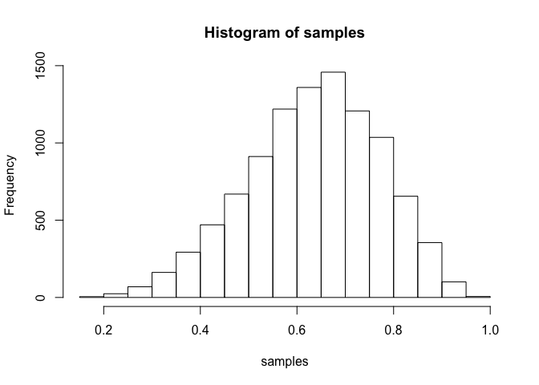<!-- -->


### 3E1. 
_How much posterior probability lies below p = 0.2?_


```r
sum(samples < .2) / length(samples)
```

```
## [1] 5e-04
```

### 3E2. 
_How much posterior probability lies above p = 0.8?_


```r
sum(samples > 0.8) / length(samples)
```

```
## [1] 0.1117
```

### 3E3. 
_How much posterior probability lies between p = 0.2 and p = 0.8?_


```r
sum(samples >0.2 & samples < 0.8) / length(samples)
```

```
## [1] 0.8878
```

### 3E4. 
_20% of the posterior probability lies below which value of p?_


```r
quantile(samples, 0.2)
```

```
##       20% 
## 0.5195195
```


### 3E5. 
_20% of the posterior probability lies above which value of p?_


```r
quantile(samples, 0.8)
```

```
##       80% 
## 0.7567568
```


### 3E6. 
_Which values of p contain the narrowest interval equal to 66% of the posterior probability?_


```r
HPDI(samples, 0.66)
```

```
##     |0.66     0.66| 
## 0.5205205 0.7847848
```


### 3E7. 
_Which values of p contain 66% of the posterior probability, assuming equal posterior probability both below and above the interval?_


```r
PI(samples, 0.66)
```

```
##       17%       83% 
## 0.5005005 0.7687688
```

## Medium

### 3M1. 
_Suppose the globe tossing data had turned out to be 8 water in 15 tosses. Construct the posterior distribution, using grid approximation. Use the same flat prior as before._


```r
p_grid <- seq(0,1, length.out = 1000)
prior <- rep(1,length(p_grid))
likelihood <- dbinom(8, 15, prob = p_grid)
plot(likelihood)
```

<!-- -->

```r
unstd.post <- prior*likelihood
post <- unstd.post / sum(unstd.post)
plot(post)
```

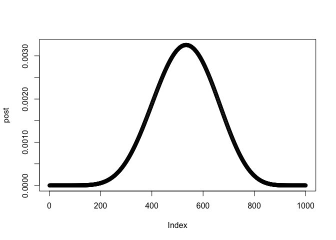<!-- -->


### 3M2. 
_Draw 10,000 samples from the grid approximation from above. Then use the samples to calculate the 90% HPDI for p._


```r
samples <- sample(p_grid, size = 10000, replace = TRUE, prob = post)
hist(samples)
```

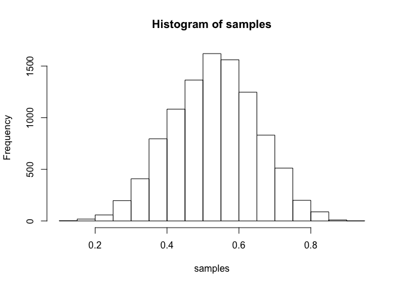<!-- -->

```r
HPDI(samples, 0.9)
```

```
##      |0.9      0.9| 
## 0.3383383 0.7317317
```


### 3M3. 
_Construct a posterior predictive check for this model and data. This means simulate the distribution of samples, averaging over the posterior uncertainty in p. What is the probability of observing 8 water in 15 tosses?_


```r
predictions <- rbinom(10000, 15, prob = samples)
sum(predictions==8) / length(predictions)
```

```
## [1] 0.1428
```


### 3M4. 
_Using the posterior distribution constructed from the new (8/15) data, now calculate the probability of observing 6 water in 9 tosses._


```r
predictions9 <- rbinom(10000, 9, prob = samples)
sum(predictions9==6) / length(predictions9)
```

```
## [1] 0.1695
```


### 3M5.
_Start over at 3M1, but now use a prior that is zero below p = 0:5 and a constant above p = 0:5. This corresponds to prior information that a majority of the Earth’s surface is water. Repeat each problem above and compare the inferences. What difference does the better prior make? If it helps,
compare inferences (using both priors) to the true value p = 0:7._


```r
p_grid <- seq(0,1, length.out = 1000)
prior <- rep(1,length(p_grid)) %>% ifelse(p_grid < .5, 0, .)
likelihood <- dbinom(8, 15, prob = p_grid)
plot(likelihood)
```

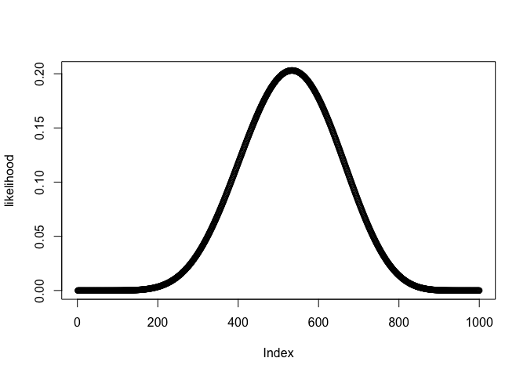<!-- -->

```r
unstd.post <- prior*likelihood
post <- unstd.post / sum(unstd.post)
plot(post)
```

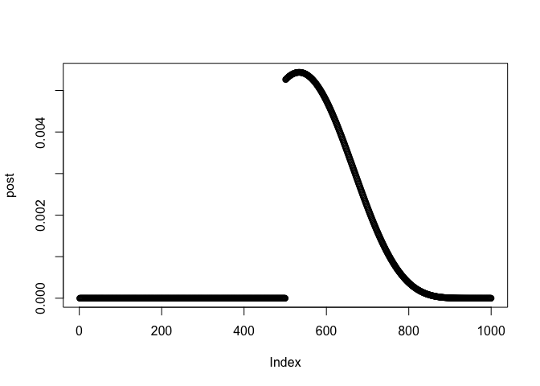<!-- -->


_Draw 10,000 samples from the grid approximation from above. Then use the samples to calculate the 90% HPDI for p._


```r
samples2 <- sample(p_grid, size = 10000, replace = TRUE, prob = post)
hist(samples2)
```

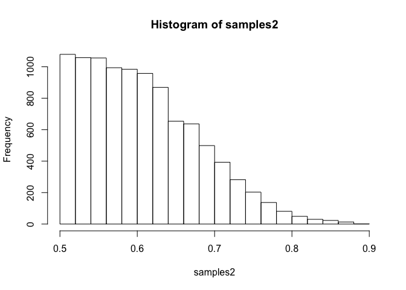<!-- -->

```r
HPDI(samples2, 0.9)
```

```
##      |0.9      0.9| 
## 0.5005005 0.7097097
```

Confidence intervals are tighter

## 3H1
_3H1. Using grid approximation, compute the posterior distribution for the probability of a birth being a boy. Assume a uniform prior probability. Which parameter value maximizes the posterior probability?_

```r
 library(rethinking)
data(homeworkch3)
sum(birth1) + sum(birth2)
```

```
## [1] 111
```


```r
p_grid <- seq(0,1, length.out = 1000)
prior <- rep(1,1000)
likelihood <- dbinom(111, size=200, prob=p_grid)
posterior <- prior*likelihood
posterior <- posterior / sum(posterior)
plot(p_grid, posterior)
```

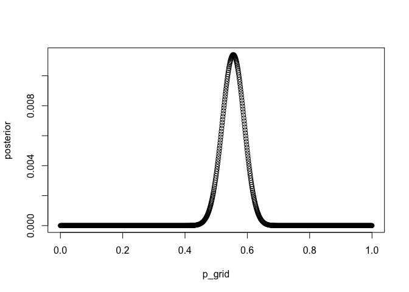<!-- -->

```r
p_grid[which.max(posterior)]
```

```
## [1] 0.5545546
```

## 3H2. 
Using the sample function, draw 10,000 random parameter values from the posterior distribution you calculated above. Use these samples to estimate the 50%, 89%, and 97% highest posterior density intervals.


```r
sample <- sample(p_grid, size=10000, replace = TRUE, prob=posterior)
HPDI(sample,c(.5,.89,.97))
```

```
##     |0.97     |0.89      |0.5      0.5|     0.89|     0.97| 
## 0.4784785 0.4964965 0.5255255 0.5735736 0.6076076 0.6276276
```


## 3H3. 
Use rbinom to simulate 10,000 replicates of 200 births. You should end up with 10,000 num- bers, each one a count of boys out of 200 births. Compare the distribution of predicted numbers of boys to the actual count in the data (111 boys out of 200 births). There are many good ways to visualize the simulations, but the dens command (part of the rethinking package) is probably the easiest way in this case. Does it look like the model fits the data well? That is, does the distribution of predictions include the actual observation as a central, likely outcome?


```r
sims <- rbinom(10000, size = 200, prob = sample)
hist(sims)
```

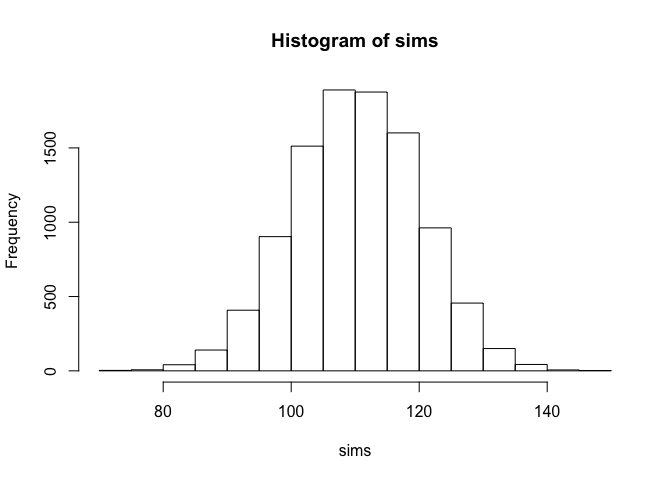<!-- -->

```r
dens(sims)
```

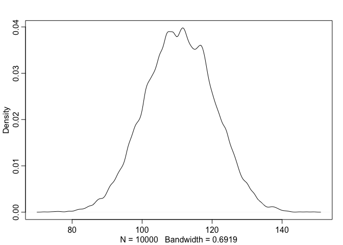<!-- -->

```r
mean(sims)
```

```
## [1] 110.7069
```

```r
median(sims)
```

```
## [1] 111
```

```r
sum(sims==111) / length(sims)
```

```
## [1] 0.0398
```

```r
sum(sims > 109 & sims < 113) / length(sims)
```

```
## [1] 0.1168
```
##3H4. 
Now compare 10,000 counts of boys from 100 simulated first borns only to the number of boys in the first births, birth1. How does the model look in this light?

```r
sims <- rbinom(10000, size = 100, prob = sample)
hist(sims)
```

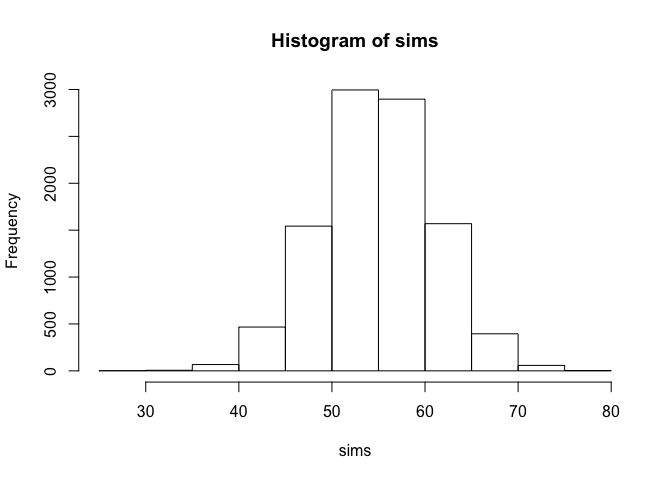<!-- -->

```r
dens(sims)
```

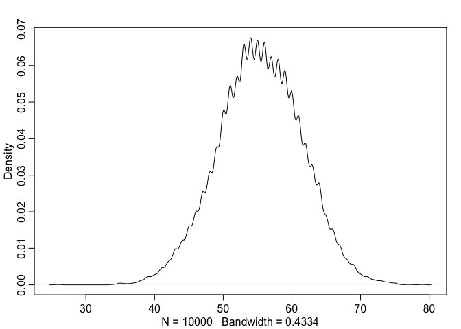<!-- -->

```r
cat("mean: ", mean(sims))
```

```
## mean:  55.3854
```

```r
cat("median: ", median(sims))
```

```
## median:  55
```

```r
cat("observed: ",sum(birth1))
```

```
## observed:  51
```

```r
sum(sims==51) / length(sims)
```

```
## [1] 0.0528
```

```r
sum(sims==55) / length(sims)
```

```
## [1] 0.0639
```

```r
HPDI(sims,.95)
```

```
## |0.95 0.95| 
##    43    66
```

clearly not great

3H5. The model assumes that sex of first and second births are independent. To check this assump- tion, focus now on second births that followed female first borns. Compare 10,000 simulated counts of boys to only those second births that followed girls. To do this correctly, you need to count the number of first borns who were girls and simulate that many births, 10,000 times. Compare the counts of boys in your simulations to the actual observed count of boys following girls. How does the model look in this light? Any guesses what is going on in these data?


```r
#number of female first borns:
sum(birth1==0)
```

```
## [1] 49
```

```r
#number of boys after female first borns
sum(birth1==0 & birth2==1)
```

```
## [1] 39
```


```r
sims <- rbinom(10000, size = 49, prob = sample)
hist(sims)
```

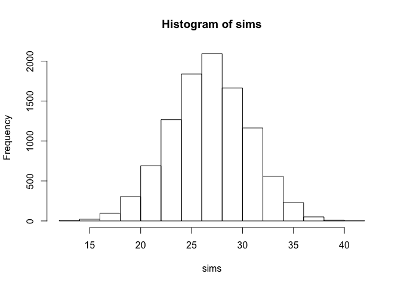<!-- -->

```r
dens(sims)
```

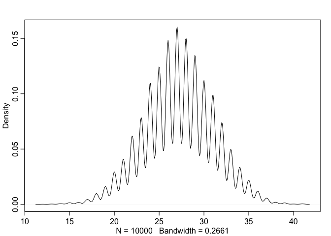<!-- -->

```r
cat("mean: ", mean(sims))
```

```
## mean:  27.2215
```

```r
cat("median: ", median(sims))
```

```
## median:  27
```

```r
cat("observed: ",sum(birth1))
```

```
## observed:  51
```

```r
sum(sims==39) / length(sims)
```

```
## [1] 9e-04
```

```r
HPDI(sims,.95)
```

```
## |0.95 0.95| 
##    19    34
```

```r
sum(sims>=39) / length(sims)
```

```
## [1] 0.0014
```

model predicts we should see 27 boys out of 49, but we observed 39.  This is outside of the 95% confidnce interval.

