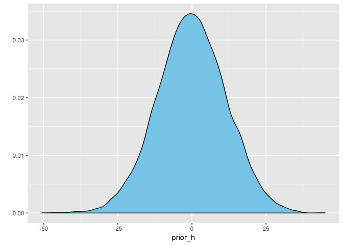

4E1-4E5; 4M1, 4M2, 4M3

## 4E1. 
_In the model definition below, which line is the likelihood?_

$$
y_i \sim Normal(\mu, \sigma)
$$

## 4E2. 
_In the model definition just above, how many parameters are in the posterior distribution?_

Two, $\mu, \sigma$

## 4E3. 
_Using the model definition above, write down the appropriate form of Bayes’ theorem that includes the proper likelihood and priors._


## 4E4. 
_In the model definition below, which line is the linear model?_


$$
\mu_i = \alpha + \beta x_i
$$

## 4E5. 
_In the model definition just above, how many parameters are in the posterior distribution?_

Three, $\alpha, \beta, \sigma$


## 4M1. 
_For the model definition below, simulate observed heights from the prior (not the posterior)._


```r
prior_h <- rnorm(n = 10000,
                 mean = rnorm(n = 10000, mean = 0, sd = 10),
                 sd = runif(n = 10000, min = 0, max = 10))

  qplot(prior_h, geom="density", fill=I("skyblue"))
```

<!-- -->


## 4M2. 
_Translate the model just above into a quap formula._


```r
f <- alist(
  height ~ dnorm(mu, sigma),
  mu ~ dnorm(0, 10),
  sigma ~ dunif(0, 10))
```


## 4M3. 
_Translate the quap model formula below into a mathematical model definition._


```r
flist <- alist(
    y ~ dnorm( mu , sigma ),
    mu <- a + b*x,
    a ~ dnorm( 0 , 50 ),
    b ~ dunif( 0 , 10 ),
    sigma ~ dunif( 0 , 50 )
)
```

$$
y_i \sim Normal (\mu_i, \sigma) \\
mu_i = \alpha + \beta x_i \\
\alpha \sim Normal(0, 50) \\
\beta \sim Uniform(0, 10) \\
\sigma \sim Uniform(0, 50)
$$
