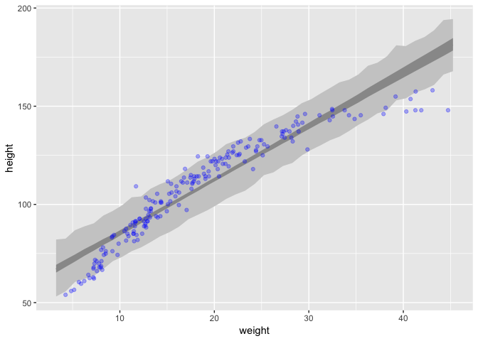
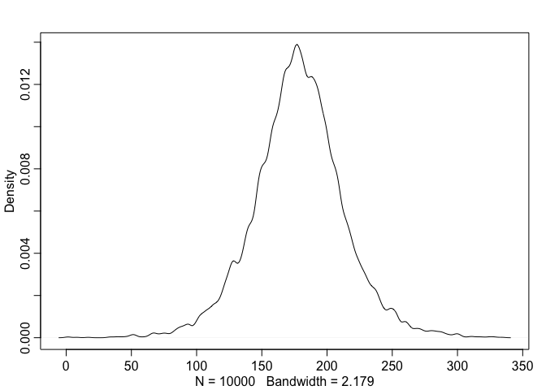
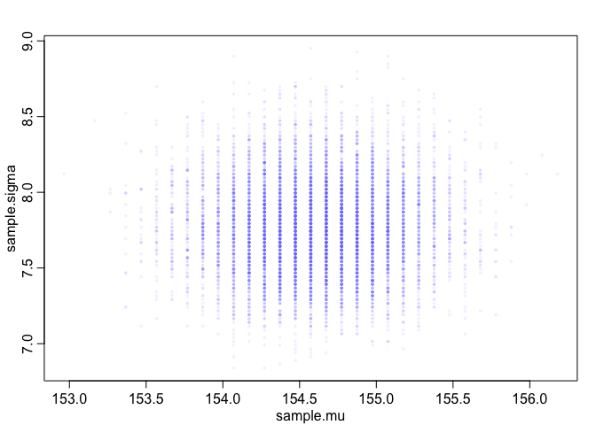
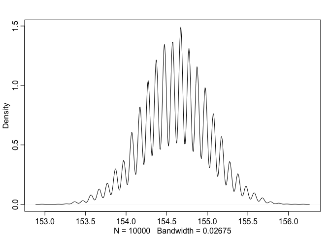
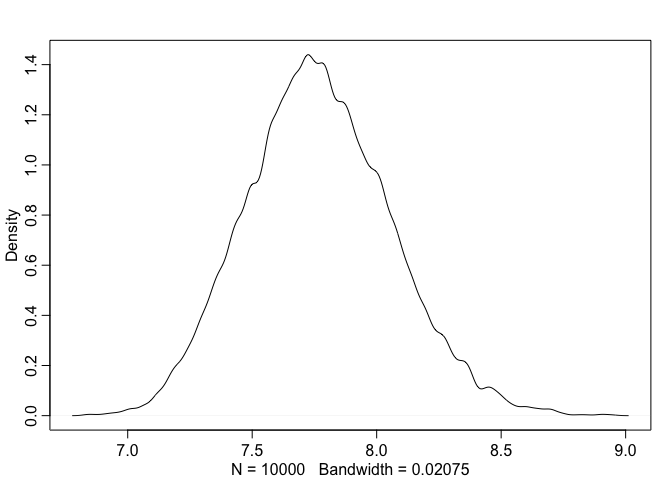
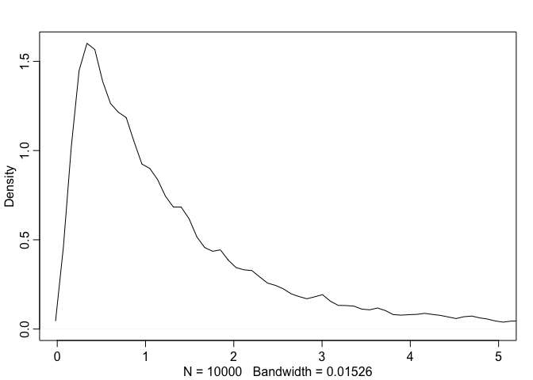

4E1-4E5; 4M1, 4M2, 4M3

4E1.
----

*In the model definition below, which line is the likelihood?*


")

4E2.
----

*In the model definition just above, how many parameters are in the
posterior distribution?*

Two,


4E3.
----

*Using the model definition above, write down the appropriate form of
Bayes' theorem that includes the proper likelihood and priors.*

4E4.
----

*In the model definition below, which line is the linear model?*


4E5.
----

*In the model definition just above, how many parameters are in the
posterior distribution?*

Three,


4M1.
----

*For the model definition below, simulate observed heights from the
prior (not the posterior).*

``` {.r}
prior_h <- rnorm(n = 10000,
                 mean = rnorm(n = 10000, mean = 0, sd = 10),
                 sd = runif(n = 10000, min = 0, max = 10))

  qplot(prior_h, geom="density", fill=I("skyblue"))
```

<!-- -->

4M2.
----

*Translate the model just above into a quap formula.*

``` {.r}
f <- alist(
  height ~ dnorm(mu, sigma),
  mu ~ dnorm(0, 10),
  sigma ~ dunif(0, 10))
```

4M3.
----

*Translate the quap model formula below into a mathematical model
definition.*

``` {.r}
flist <- alist(
    y ~ dnorm( mu , sigma ),
    mu <- a + b*x,
    a ~ dnorm( 0 , 50 ),
    b ~ dunif( 0 , 10 ),
    sigma ~ dunif( 0 , 50 )
)
```

 \\
mu_i = \alpha + \beta x_i \\
\alpha \sim Normal(0, 50) \\
\beta \sim Uniform(0, 10) \\
\sigma \sim Uniform(0, 50)
")

Week 2 problems
===============

4M4, 4M5, 4M6, 4H1, 4H2

4M4
---

*A sample of students is measured for height each year for 3 years.
After the third year, you want to fit a linear regression predicting
height using year as a predictor. Write down the mathematical model
definition for this regression, using any variable names and priors you
choose. Be prepared to defend your choice of priors.*

 \\
mu_i = \alpha + \beta*year_i \\
\alpha \sim Normal(100, 50) \\
\beta \sim Log-Normal(0, 1) \\
\sigma \sim Uniform(0, 50)\\
")

 Really we should fit each student as a random effect, but we aren't
there yet.

Assume height measured in cm. We don't know the age of the students but
I am assuming elementary age. 100cm with a broad SD.

Choose log-normal for Beta because students should shrink with time.

how much can a student grow in a year? 10cm?

``` {.r}
betas <- seq(0,20,by=.1)
plot(betas,dlnorm(betas,2,1),type="l")
```

<!-- -->

not entirely happy with this...

4M5
---

*Now suppose I tell you that the average height in the first year was
120 cm and that every student got taller each year. Does this
information lead you to change your choice of priors? How?*

Not so different, but I would go with:

 \\
mu_i = \alpha + \beta*year_i \\
\alpha \sim Normal(120, 50) \\
\beta \sim Log-Normal(0, 1) \\
\sigma \sim Uniform(0, 50)\\
")

4M6
---

*Now suppose I tell you that the variance among heights for students of
the same age is never more than 64cm. How does this lead you to revise
your priors?*

 \\
mu_i = \alpha + \beta*year_i \\
\alpha \sim Normal(120, 50) \\
\beta \sim Log-Normal(0, 1) \\
\sigma \sim Uniform(0, 8)\\
")

4H1
---

*The weights listed below were recorded in the !Kung census, but heights
were not recorded for these individuals. Provide predicted heights and
89% intervals (either HPDI or PI) for each of these individuals. That
is, fill in the table below, using model-based predictions.*

``` {.r}
weights <- c(46.95,43.72,64.78,32.59,54.63)
```

These all seem to be adult weights, so I am going to use the simple
regression model on adults

``` {.r}
#4.42
data(Howell1)
d <- Howell1
d2 <- d[ d$age >= 18 , ]

# define the average weight, x-bar
xbar <- mean(d2$weight)

# fit model
m4.3 <- quap(
    alist(
        height ~ dnorm( mu , sigma ) ,
        mu <- a + b*( weight - xbar ) ,
        a ~ dnorm( 178 , 20 ) ,
        b ~ dlnorm( 0 , 1 ) ,
        sigma ~ dunif( 0 , 50 )
    ) ,
    data=d2 )
```

``` {.r}
sim.heights <- sim(fit = m4.3,
                   data = data.frame(weight=weights),
                   n=1e4)
dim(sim.heights)
```

    ## [1] 10000     5

``` {.r}
head(sim.heights)
```

    ##          [,1]     [,2]     [,3]     [,4]     [,5]
    ## [1,] 157.4049 158.9164 173.7565 128.4920 162.1303
    ## [2,] 157.2506 148.4500 178.6658 144.4662 166.7329
    ## [3,] 151.3772 151.9207 177.6453 142.1428 161.9565
    ## [4,] 154.3727 158.7349 167.5517 138.1722 164.1422
    ## [5,] 157.6281 155.2929 164.5594 143.0228 167.9828
    ## [6,] 156.2978 151.8533 172.9743 144.7207 161.1789

``` {.r}
results <- tibble(
  individual=1:5,
  weight=weights,
  predicted.height=apply(sim.heights,2,mean)
  )
results <- cbind(results,t(apply(sim.heights, 2, HPDI)))
knitr::kable(results,digits=2)
```

    individual   weight   predicted.height   \|0.89   0.89\|
  ------------ -------- ------------------ -------- --------
             1    46.95             156.37   148.39   164.56
             2    43.72             153.37   145.55   161.62
             3    64.78             172.48   164.37   180.74
             4    32.59             143.38   135.09   151.35
             5    54.63             163.30   155.50   171.90

4H2.
----

*Select out all the rows in the Howell1 data with ages below 18 years of
age. If you do it right, you should end up with a new data frame with
192 rows in it.*

``` {.r}
d3 <- Howell1 %>% as_tibble() %>% filter(age < 18)
d3
```

    ## # A tibble: 192 x 4
    ##    height weight   age  male
    ##     <dbl>  <dbl> <dbl> <int>
    ##  1  122.    19.6  12       1
    ##  2  105.    13.9   8       0
    ##  3   86.4   10.5   6.5     0
    ##  4  130.    23.6  13       1
    ##  5  109.    16.0   7       0
    ##  6  137.    27.3  17       1
    ##  7  126.    22.7  16       0
    ##  8  114.    17.9  11       1
    ##  9  145.    28.8  17       0
    ## 10  122.    20.4   8       1
    ## # … with 182 more rows

*(a) Fit a linear regression to these data, using quap. Present and
interpret the estimates. For every 10 units of increase in weight, how
much taller does the model predict a child gets?*

first let's take a look

``` {.r}
qplot(weight, height, data = d3)
```

<!-- -->

so not linear here, but based on problem I think we fit a simple
regression model

``` {.r}
# define the average weight, x-bar
xbar <- mean(d3$weight)

# fit model
m4H2 <- quap(
    alist(
        height ~ dnorm( mu , sigma ) ,
        mu <- a + b*( weight - xbar ) ,
        a ~ dnorm( 100 , 20 ) ,
        b ~ dlnorm( 0 , 1 ) ,
        sigma ~ dunif( 0 , 50 )
    ) ,
    data=d3 )
```

``` {.r}
precis(m4H2)
```

    ##             mean         sd       5.5%      94.5%
    ## a     108.310943 0.60868596 107.338145 109.283741
    ## b       2.716531 0.06832305   2.607337   2.825724
    ## sigma   8.438102 0.43068316   7.749787   9.126416

For every 10 units increase in weight, the model predicts an increase of
27.2 height

*(b) Plot the raw data, with height on the vertical axis and weight on
the horizontal axis. Super- impose the MAP regression line and 89% HPDI
for the mean. Also superimpose the 89% HPDI for predicted heights.*

``` {.r}
post <- extract.samples(m4H2)
weight.seq <- seq.int(from=min(d3$weight)-1, to=max(d3$weight)+1, by=1)
mu <- link(m4H2, data=data.frame(weight=weight.seq))
mu.mean <- apply( mu , 2 , mean )
mu.HPDI <- apply( mu , 2 , HPDI , prob=0.89 )
sim <- sim(m4H2, data=data.frame(weight=weight.seq))
sim.HPDI <- apply(sim, 2, HPDI, prob=0.89)
```

``` {.r}
plot( height ~ weight , data=d3 , col=rangi2 )
# plot the MAP line, aka the mean mu for each weight
lines( weight.seq , mu.mean )
shade( sim.HPDI , weight.seq, col = col.alpha("black",
                 0.15 ))
# plot a shaded region for 89% HPDI
shade( mu.HPDI , weight.seq, col = col.alpha("black",
                 0.30) )
```

<!-- -->

try to plot with ggplot...

``` {.r}
plot.data <- as_tibble(cbind(weight.seq, mu.mean, t(mu.HPDI), t(sim.HPDI))) %>%
  rename(weight=weight.seq, mu.89l=`|0.89`, mu.89u=`0.89|`, sim.89l=V5, sim.89u=V6)
```

    ## Warning: `as_tibble.matrix()` requires a matrix with column names or a `.name_repair` argument. Using compatibility `.name_repair`.
    ## This warning is displayed once per session.

``` {.r}
plot.data
```

    ## # A tibble: 43 x 6
    ##    weight mu.mean mu.89l mu.89u sim.89l sim.89u
    ##     <dbl>   <dbl>  <dbl>  <dbl>   <dbl>   <dbl>
    ##  1   3.25    67.1   65.3   69.3    53.1    82.1
    ##  2   4.25    69.8   68.1   71.9    55.7    82.6
    ##  3   5.25    72.5   70.9   74.5    60.5    86.9
    ##  4   6.25    75.2   73.8   77.3    62.1    88.8
    ##  5   7.25    78.0   76.5   79.7    63.7    90.4
    ##  6   8.25    80.7   79.4   82.4    67.1    94.3
    ##  7   9.25    83.4   81.9   84.7    71.1    96.7
    ##  8  10.3     86.1   84.8   87.5    73.3    99.6
    ##  9  11.3     88.8   87.6   90.1    76.2   104. 
    ## 10  12.3     91.5   90.5   92.9    78.1   104. 
    ## # … with 33 more rows

``` {.r}
plot.data %>%
  ggplot(aes(x=weight)) +
  geom_line(aes(y=mu.mean)) +
  geom_ribbon(aes(ymin=sim.89l, ymax=sim.89u), fill="gray80") +
  geom_ribbon(aes(ymin=mu.89l, ymax=mu.89u), fill="gray60") +
  geom_point(aes(y=height), data=d3,color="blue", alpha=.3) +
  ylab("height")
```

<!-- -->

*(c) What aspects of the model fit concern you? Describe the kinds of
assumptions you would change, if any, to improve the model. You don't
have to write any new code. Just explain what the model appears to be
doing a bad job of, and what you hypothesize would be a better model.*

The model is trying to fit a straight line to curved data. This results
in a poor fit, especially at the ends. I would fit either a polynomial
or spline regression to try to correct this.

Code from Book
==============

``` {.r}
## R code 4.1
pos <- replicate( 1000 , sum( runif(16,-1,1) ) )

## R code 4.2
prod( 1 + runif(12,0,0.1) )
```

    ## [1] 1.910414

``` {.r}
## R code 4.3
growth <- replicate( 10000 , prod( 1 + runif(12,0,0.1) ) )
dens( growth , norm.comp=TRUE )
```

<!-- -->

``` {.r}
## R code 4.4
big <- replicate( 10000 , prod( 1 + runif(12,0,0.5) ) )
small <- replicate( 10000 , prod( 1 + runif(12,0,0.01) ) )

## R code 4.5
log.big <- replicate( 10000 , log(prod(1 + runif(12,0,0.5))) )

## R code 4.6
w <- 6; n <- 9;
p_grid <- seq(from=0,to=1,length.out=100)
posterior <- dbinom(w,n,p_grid)*dunif(p_grid,0,1)
posterior <- posterior/sum(posterior)

## R code 4.7
library(rethinking)
data(Howell1)
d <- Howell1

## R code 4.8
str( d )
```

    ## 'data.frame':    544 obs. of  4 variables:
    ##  $ height: num  152 140 137 157 145 ...
    ##  $ weight: num  47.8 36.5 31.9 53 41.3 ...
    ##  $ age   : num  63 63 65 41 51 35 32 27 19 54 ...
    ##  $ male  : int  1 0 0 1 0 1 0 1 0 1 ...

``` {.r}
## R code 4.9
precis( d )
```

    ##               mean         sd      5.5%     94.5%     histogram
    ## height 138.2635963 27.6024476 81.108550 165.73500 ▁▁▁▁▁▁▁▂▁▇▇▅▁
    ## weight  35.6106176 14.7191782  9.360721  54.50289 ▁▂▃▂▂▂▂▅▇▇▃▂▁
    ## age     29.3443934 20.7468882  1.000000  66.13500     ▇▅▅▃▅▂▂▁▁
    ## male     0.4724265  0.4996986  0.000000   1.00000    ▇▁▁▁▁▁▁▁▁▇

``` {.r}
## R code 4.10
d$height
```

    ##   [1] 151.7650 139.7000 136.5250 156.8450 145.4150 163.8300 149.2250
    ##   [8] 168.9100 147.9550 165.1000 154.3050 151.1300 144.7800 149.9000
    ##  [15] 150.4950 163.1950 157.4800 143.9418 121.9200 105.4100  86.3600
    ##  [22] 161.2900 156.2100 129.5400 109.2200 146.4000 148.5900 147.3200
    ##  [29] 137.1600 125.7300 114.3000 147.9550 161.9250 146.0500 146.0500
    ##  [36] 152.7048 142.8750 142.8750 147.9550 160.6550 151.7650 162.8648
    ##  [43] 171.4500 147.3200 147.9550 144.7800 121.9200 128.9050  97.7900
    ##  [50] 154.3050 143.5100 146.7000 157.4800 127.0000 110.4900  97.7900
    ##  [57] 165.7350 152.4000 141.6050 158.8000 155.5750 164.4650 151.7650
    ##  [64] 161.2900 154.3050 145.4150 145.4150 152.4000 163.8300 144.1450
    ##  [71] 129.5400 129.5400 153.6700 142.8750 146.0500 167.0050 158.4198
    ##  [78]  91.4400 165.7350 149.8600 147.9550 137.7950 154.9400 160.9598
    ##  [85] 161.9250 147.9550 113.6650 159.3850 148.5900 136.5250 158.1150
    ##  [92] 144.7800 156.8450 179.0700 118.7450 170.1800 146.0500 147.3200
    ##  [99] 113.0300 162.5600 133.9850 152.4000 160.0200 149.8600 142.8750
    ## [106] 167.0050 159.3850 154.9400 148.5900 111.1250 111.7600 162.5600
    ## [113] 152.4000 124.4600 111.7600  86.3600 170.1800 146.0500 159.3850
    ## [120] 151.1300 160.6550 169.5450 158.7500  74.2950 149.8600 153.0350
    ## [127]  96.5200 161.9250 162.5600 149.2250 116.8400 100.0760 163.1950
    ## [134] 161.9250 145.4150 163.1950 151.1300 150.4950 141.6050 170.8150
    ## [141]  91.4400 157.4800 152.4000 149.2250 129.5400 147.3200 145.4150
    ## [148] 121.9200 113.6650 157.4800 154.3050 120.6500 115.6000 167.0050
    ## [155] 142.8750 152.4000  96.5200 160.0000 159.3850 149.8600 160.6550
    ## [162] 160.6550 149.2250 125.0950 140.9700 154.9400 141.6050 160.0200
    ## [169] 150.1648 155.5750 103.5050  94.6150 156.2100 153.0350 167.0050
    ## [176] 149.8600 147.9550 159.3850 161.9250 155.5750 159.3850 146.6850
    ## [183] 172.7200 166.3700 141.6050 142.8750 133.3500 127.6350 119.3800
    ## [190] 151.7650 156.8450 148.5900 157.4800 149.8600 147.9550 102.2350
    ## [197] 153.0350 160.6550 149.2250 114.3000 100.9650 138.4300  91.4400
    ## [204] 162.5600 149.2250 158.7500 149.8600 158.1150 156.2100 148.5900
    ## [211] 143.5100 154.3050 131.4450 157.4800 157.4800 154.3050 107.9500
    ## [218] 168.2750 145.4150 147.9550 100.9650 113.0300 149.2250 154.9400
    ## [225] 162.5600 156.8450 123.1900 161.0106 144.7800 143.5100 149.2250
    ## [232] 110.4900 149.8600 165.7350 144.1450 157.4800 154.3050 163.8300
    ## [239] 156.2100 153.6700 134.6200 144.1450 114.3000 162.5600 146.0500
    ## [246] 120.6500 154.9400 144.7800 106.6800 146.6850 152.4000 163.8300
    ## [253] 165.7350 156.2100 152.4000 140.3350 158.1150 163.1950 151.1300
    ## [260] 171.1198 149.8600 163.8300 141.6050  93.9800 149.2250 105.4100
    ## [267] 146.0500 161.2900 162.5600 145.4150 145.4150 170.8150 127.0000
    ## [274] 159.3850 159.4000 153.6700 160.0200 150.4950 149.2250 127.0000
    ## [281] 142.8750 142.1130 147.3200 162.5600 164.4650 160.0200 153.6700
    ## [288] 167.0050 151.1300 147.9550 125.3998 111.1250 153.0350 139.0650
    ## [295] 152.4000 154.9400 147.9550 143.5100 117.9830 144.1450  92.7100
    ## [302] 147.9550 155.5750 150.4950 155.5750 154.3050 130.6068 101.6000
    ## [309] 157.4800 168.9100 150.4950 111.7600 160.0200 167.6400 144.1450
    ## [316] 145.4150 160.0200 147.3200 164.4650 153.0350 149.2250 160.0200
    ## [323] 149.2250  85.0900  84.4550  59.6138  92.7100 111.1250  90.8050
    ## [330] 153.6700  99.6950  62.4840  81.9150  96.5200  80.0100 150.4950
    ## [337] 151.7650 140.6398  88.2650 158.1150 149.2250 151.7650 154.9400
    ## [344] 123.8250 104.1400 161.2900 148.5900  97.1550  93.3450 160.6550
    ## [351] 157.4800 167.0050 157.4800  91.4400  60.4520 137.1600 152.4000
    ## [358] 152.4000  81.2800 109.2200  71.1200  89.2048  67.3100  85.0900
    ## [365]  69.8500 161.9250 152.4000  88.9000  90.1700  71.7550  83.8200
    ## [372] 159.3850 142.2400 142.2400 168.9100 123.1900  74.9300  74.2950
    ## [379]  90.8050 160.0200  67.9450 135.8900 158.1150  85.0900  93.3450
    ## [386] 152.4000 155.5750 154.3050 156.8450 120.0150 114.3000  83.8200
    ## [393] 156.2100 137.1600 114.3000  93.9800 168.2750 147.9550 139.7000
    ## [400] 157.4800  76.2000  66.0400 160.7000 114.3000 146.0500 161.2900
    ## [407]  69.8500 133.9850  67.9450 150.4950 163.1950 148.5900 148.5900
    ## [414] 161.9250 153.6700  68.5800 151.1300 163.8300 153.0350 151.7650
    ## [421] 132.0800 156.2100 140.3350 158.7500 142.8750  84.4550 151.9428
    ## [428] 161.2900 127.9906 160.9852 144.7800 132.0800 117.9830 160.0200
    ## [435] 154.9400 160.9852 165.9890 157.9880 154.9400  97.9932  64.1350
    ## [442] 160.6550 147.3200 146.7000 147.3200 172.9994 158.1150 147.3200
    ## [449] 124.9934 106.0450 165.9890 149.8600  76.2000 161.9250 140.0048
    ## [456]  66.6750  62.8650 163.8300 147.9550 160.0200 154.9400 152.4000
    ## [463]  62.2300 146.0500 151.9936 157.4800  55.8800  60.9600 151.7650
    ## [470] 144.7800 118.1100  78.1050 160.6550 151.1300 121.9200  92.7100
    ## [477] 153.6700 147.3200 139.7000 157.4800  91.4400 154.9400 143.5100
    ## [484]  83.1850 158.1150 147.3200 123.8250  88.9000 160.0200 137.1600
    ## [491] 165.1000 154.9400 111.1250 153.6700 145.4150 141.6050 144.7800
    ## [498] 163.8300 161.2900 154.9000 161.3000 170.1800 149.8600 123.8250
    ## [505]  85.0900 160.6550 154.9400 106.0450 126.3650 166.3700 148.2852
    ## [512] 124.4600  89.5350 101.6000 151.7650 148.5900 153.6700  53.9750
    ## [519] 146.6850  56.5150 100.9650 121.9200  81.5848 154.9400 156.2100
    ## [526] 132.7150 125.0950 101.6000 160.6550 146.0500 132.7150  87.6300
    ## [533] 156.2100 152.4000 162.5600 114.9350  67.9450 142.8750  76.8350
    ## [540] 145.4150 162.5600 156.2100  71.1200 158.7500

``` {.r}
## R code 4.11
d2 <- d[ d$age >= 18 , ]

## R code 4.12
curve( dnorm( x , 178 , 20 ) , from=100 , to=250 )
```

<!-- -->

``` {.r}
## R code 4.13
curve( dunif( x , 0 , 50 ) , from=-10 , to=60 )
```

<!-- -->

``` {.r}
## R code 4.14
sample_mu <- rnorm( 1e4 , 178 , 20 )
sample_sigma <- runif( 1e4 , 0 , 50 )
prior_h <- rnorm( 1e4 , sample_mu , sample_sigma )
dens( prior_h )
```

<!-- -->

``` {.r}
## R code 4.15
sample_mu <- rnorm( 1e4 , 178 , 100 )
prior_h <- rnorm( 1e4 , sample_mu , sample_sigma )
dens( prior_h )
```

<!-- -->

``` {.r}
## R code 4.16
mu.list <- seq( from=140, to=160 , length.out=200 )
sigma.list <- seq( from=4 , to=9 , length.out=200 )
post <- expand.grid( mu=mu.list , sigma=sigma.list )
post$LL <- sapply( 1:nrow(post) , function(i) sum( dnorm(
                d2$height ,
                mean=post$mu[i] ,
                sd=post$sigma[i] ,
                log=TRUE ) ) )
post$prod <- post$LL + dnorm( post$mu , 178 , 20 , TRUE ) +
    dunif( post$sigma , 0 , 50 , TRUE )
post$prob <- exp( post$prod - max(post$prod) )

## R code 4.17
contour_xyz( post$mu , post$sigma , post$prob )
```

<!-- -->

``` {.r}
## R code 4.18
image_xyz( post$mu , post$sigma , post$prob )
```

<!-- -->

``` {.r}
## R code 4.19
sample.rows <- sample( 1:nrow(post) , size=1e4 , replace=TRUE ,
    prob=post$prob )
sample.mu <- post$mu[ sample.rows ]
sample.sigma <- post$sigma[ sample.rows ]

## R code 4.20
plot( sample.mu , sample.sigma , cex=0.5 , pch=16 , col=col.alpha(rangi2,0.1) )
```

<!-- -->

``` {.r}
## R code 4.21
dens( sample.mu )
```

<!-- -->

``` {.r}
dens( sample.sigma )
```

<!-- -->

``` {.r}
## R code 4.22
HPDI( sample.mu )
```

    ##    |0.89    0.89| 
    ## 153.8693 155.1759

``` {.r}
HPDI( sample.sigma )
```

    ##    |0.89    0.89| 
    ## 7.291457 8.195980

``` {.r}
## R code 4.23
d3 <- sample( d2$height , size=20 )

## R code 4.24
mu.list <- seq( from=150, to=170 , length.out=200 )
sigma.list <- seq( from=4 , to=20 , length.out=200 )
post2 <- expand.grid( mu=mu.list , sigma=sigma.list )
post2$LL <- sapply( 1:nrow(post2) , function(i)
    sum( dnorm( d3 , mean=post2$mu[i] , sd=post2$sigma[i] ,
    log=TRUE ) ) )
post2$prod <- post2$LL + dnorm( post2$mu , 178 , 20 , TRUE ) +
    dunif( post2$sigma , 0 , 50 , TRUE )
post2$prob <- exp( post2$prod - max(post2$prod) )
sample2.rows <- sample( 1:nrow(post2) , size=1e4 , replace=TRUE ,
    prob=post2$prob )
sample2.mu <- post2$mu[ sample2.rows ]
sample2.sigma <- post2$sigma[ sample2.rows ]
plot( sample2.mu , sample2.sigma , cex=0.5 ,
    col=col.alpha(rangi2,0.1) ,
    xlab="mu" , ylab="sigma" , pch=16 )
```

<!-- -->

``` {.r}
## R code 4.25
dens( sample2.sigma , norm.comp=TRUE )
```

<!-- -->

``` {.r}
## R code 4.26
library(rethinking)
data(Howell1)
d <- Howell1
d2 <- d[ d$age >= 18 , ]

## R code 4.27
flist <- alist(
    height ~ dnorm( mu , sigma ) ,
    mu ~ dnorm( 178 , 20 ) ,
    sigma ~ dunif( 0 , 50 )
)

## R code 4.28
m4.1 <- quap( flist , data=d2 )

## R code 4.29
precis( m4.1 )
```

    ##             mean        sd       5.5%      94.5%
    ## mu    154.606763 0.4119798 153.948340 155.265187
    ## sigma   7.731055 0.2913598   7.265406   8.196704

``` {.r}
## R code 4.30
start <- list(
    mu=mean(d2$height),
    sigma=sd(d2$height)
)
m4.1 <- quap( flist , data=d2 , start=start )

## R code 4.31
m4.2 <- quap(
    alist(
        height ~ dnorm( mu , sigma ) ,
        mu ~ dnorm( 178 , 0.1 ) ,
        sigma ~ dunif( 0 , 50 )
    ) , data=d2 )
precis( m4.2 )
```

    ##           mean        sd      5.5%    94.5%
    ## mu    177.8638 0.1002354 177.70356 178.0239
    ## sigma  24.5176 0.9289266  23.03299  26.0022

``` {.r}
## R code 4.32
vcov( m4.1 )
```

    ##                 mu        sigma
    ## mu    0.1697396109 0.0002180307
    ## sigma 0.0002180307 0.0849058224

``` {.r}
## R code 4.33
diag( vcov( m4.1 ) )
```

    ##         mu      sigma 
    ## 0.16973961 0.08490582

``` {.r}
cov2cor( vcov( m4.1 ) )
```

    ##                mu       sigma
    ## mu    1.000000000 0.001816174
    ## sigma 0.001816174 1.000000000

``` {.r}
## R code 4.34
library(rethinking)
post <- extract.samples( m4.1 , n=1e4 )
head(post)
```

    ##         mu    sigma
    ## 1 154.4323 7.913822
    ## 2 154.5852 7.435014
    ## 3 154.8238 7.422743
    ## 4 154.6209 7.849641
    ## 5 154.0239 7.551737
    ## 6 155.1732 7.201031

``` {.r}
## R code 4.35
precis(post)
```

    ##            mean        sd      5.5%      94.5%     histogram
    ## mu    154.60018 0.4156856 153.92897 155.260859      ▁▁▁▅▇▂▁▁
    ## sigma   7.72872 0.2942913   7.26191   8.193346 ▁▁▁▁▂▅▇▇▃▁▁▁▁

``` {.r}
## R code 4.36
library(MASS)
```

    ## Warning: package 'MASS' was built under R version 3.5.2

    ## 
    ## Attaching package: 'MASS'

    ## The following object is masked from 'package:dplyr':
    ## 
    ##     select

``` {.r}
post <- mvrnorm( n=1e4 , mu=coef(m4.1) , Sigma=vcov(m4.1) )

## R code 4.37
plot( d2$height ~ d2$weight )
```

<!-- -->

``` {.r}
## R code 4.38
set.seed(2971)
N <- 100                   # 100 lines
a <- rnorm( N , 178 , 20 )
b <- rnorm( N , 0 , 10 )

## R code 4.39
plot( NULL , xlim=range(d2$weight) , ylim=c(-100,400) ,
    xlab="weight" , ylab="height" )
abline( h=0 , lty=2 )
abline( h=272 , lty=1 , lwd=0.5 )
mtext( "b ~ dnorm(0,10)" )
xbar <- mean(d2$weight)
for ( i in 1:N ) curve( a[i] + b[i]*(x - xbar) ,
    from=min(d2$weight) , to=max(d2$weight) , add=TRUE ,
    col=col.alpha("black",0.2) )
```

<!-- -->

``` {.r}
## R code 4.40
b <- rlnorm( 1e4 , 0 , 1 )
dens( b , xlim=c(0,5) , adj=0.1 )
```

<!-- -->

``` {.r}
## R code 4.41
set.seed(2971)
N <- 100                   # 100 lines
a <- rnorm( N , 178 , 20 )
b <- rlnorm( N , 0 , 1 )

## R code 4.42
# load data again, since it's a long way back
library(rethinking)
data(Howell1)
d <- Howell1
d2 <- d[ d$age >= 18 , ]

# define the average weight, x-bar
xbar <- mean(d2$weight)

# fit model
m4.3 <- quap(
    alist(
        height ~ dnorm( mu , sigma ) ,
        mu <- a + b*( weight - xbar ) ,
        a ~ dnorm( 178 , 20 ) ,
        b ~ dlnorm( 0 , 1 ) ,
        sigma ~ dunif( 0 , 50 )
    ) ,
    data=d2 )

## R code 4.43
m4.3b <- quap(
    alist(
        height ~ dnorm( mu , sigma ) ,
        mu <- a + exp(log_b)*( weight - xbar ),
        a ~ dnorm( 178 , 100 ) ,
        log_b ~ dnorm( 0 , 1 ) ,
        sigma ~ dunif( 0 , 50 )
    ) ,
    data=d2 )
```

``` {.r}
## R code 4.44
precis( m4.3 )
```

    ##              mean         sd        5.5%       94.5%
    ## a     154.6013671 0.27030766 154.1693633 155.0333710
    ## b       0.9032807 0.04192363   0.8362787   0.9702828
    ## sigma   5.0718809 0.19115478   4.7663786   5.3773831

``` {.r}
## R code 4.45
round( vcov( m4.3 ) , 3 )
```

    ##           a     b sigma
    ## a     0.073 0.000 0.000
    ## b     0.000 0.002 0.000
    ## sigma 0.000 0.000 0.037

``` {.r}
## R code 4.46
plot( height ~ weight , data=d2 , col=rangi2 )
post <- extract.samples( m4.3 )
a_map <- mean(post$a)
b_map <- mean(post$b)
curve( a_map + b_map*(x - xbar) , add=TRUE )
```

<!-- -->

``` {.r}
## R code 4.47
post <- extract.samples( m4.3 )
post[1:5,]
```

    ##          a         b    sigma
    ## 1 154.6673 0.9579937 5.242168
    ## 2 154.9493 0.9075067 4.873812
    ## 3 154.8834 0.9578025 5.120553
    ## 4 154.4967 0.8987900 5.161813
    ## 5 154.2916 0.8414611 4.755758

``` {.r}
## R code 4.48
N <- 10
dN <- d2[ 1:N , ]
mN <- quap(
    alist(
        height ~ dnorm( mu , sigma ) ,
        mu <- a + b*( weight - mean(weight) ) ,
        a ~ dnorm( 178 , 20 ) ,
        b ~ dlnorm( 0 , 1 ) ,
        sigma ~ dunif( 0 , 50 )
    ) , data=dN )

## R code 4.49
# extract 20 samples from the posterior
post <- extract.samples( mN , n=20 )

# display raw data and sample size
plot( dN$weight , dN$height ,
    xlim=range(d2$weight) , ylim=range(d2$height) ,
    col=rangi2 , xlab="weight" , ylab="height" )
mtext(concat("N = ",N))

# plot the lines, with transparency
for ( i in 1:20 )
    curve( post$a[i] + post$b[i]*(x-mean(dN$weight)) ,
        col=col.alpha("black",0.3) , add=TRUE )
```

<!-- -->

``` {.r}
## R code 4.50
post <- extract.samples( m4.3 )
mu_at_50 <- post$a + post$b * ( 50 - xbar )

## R code 4.51
dens( mu_at_50 , col=rangi2 , lwd=2 , xlab="mu|weight=50" )
```

<!-- -->

``` {.r}
## R code 4.52
HPDI( mu_at_50 , prob=0.89 )
```

    ##    |0.89    0.89| 
    ## 158.5710 159.6676

``` {.r}
## R code 4.53
mu <- link( m4.3 )
str(mu)
```

    ##  num [1:1000, 1:352] 157 158 157 157 157 ...

``` {.r}
## R code 4.54
# define sequence of weights to compute predictions for
# these values will be on the horizontal axis
weight.seq <- seq( from=25 , to=70 , by=1 )

# use link to compute mu
# for each sample from posterior
# and for each weight in weight.seq
mu <- link( m4.3 , data=data.frame(weight=weight.seq) )
str(mu)
```

    ##  num [1:1000, 1:46] 137 136 136 137 136 ...

``` {.r}
## R code 4.55
# use type="n" to hide raw data
plot( height ~ weight , d2 , type="n" )

# loop over samples and plot each mu value
for ( i in 1:100 )
    points( weight.seq , mu[i,] , pch=16 , col=col.alpha(rangi2,0.1) )
```

<!-- -->

``` {.r}
## R code 4.56
# summarize the distribution of mu
mu.mean <- apply( mu , 2 , mean )
mu.HPDI <- apply( mu , 2 , HPDI , prob=0.89 )

## R code 4.57
# plot raw data
# fading out points to make line and interval more visible
plot( height ~ weight , data=d2 , col=col.alpha(rangi2,0.5) )

# plot the MAP line, aka the mean mu for each weight
lines( weight.seq , mu.mean )

# plot a shaded region for 89% HPDI
shade( mu.HPDI , weight.seq )
```

<!-- -->

``` {.r}
## R code 4.58
post <- extract.samples(m4.3)
mu.link <- function(weight) post$a + post$b*( weight - xbar )
weight.seq <- seq( from=25 , to=70 , by=1 )
mu <- sapply( weight.seq , mu.link )
mu.mean <- apply( mu , 2 , mean )
mu.HPDI <- apply( mu , 2 , HPDI , prob=0.89 )

## R code 4.59
sim.height <- sim( m4.3 , data=list(weight=weight.seq) )
str(sim.height)
```

    ##  num [1:1000, 1:46] 142 142 126 133 134 ...

``` {.r}
## R code 4.60
height.PI <- apply( sim.height , 2 , PI , prob=0.89 )

## R code 4.61
# plot raw data
plot( height ~ weight , d2 , col=col.alpha(rangi2,0.5) )

# draw MAP line
lines( weight.seq , mu.mean )

# draw HPDI region for line
shade( mu.HPDI , weight.seq )

# draw PI region for simulated heights
shade( height.PI , weight.seq )
```

<!-- -->

``` {.r}
## R code 4.62
sim.height <- sim( m4.3 , data=list(weight=weight.seq) , n=1e4 )
height.PI <- apply( sim.height , 2 , PI , prob=0.89 )

## R code 4.63
post <- extract.samples(m4.3)
weight.seq <- 25:70
sim.height <- sapply( weight.seq , function(weight)
    rnorm(
        n=nrow(post) ,
        mean=post$a + post$b*( weight - xbar ) ,
        sd=post$sigma ) )
height.PI <- apply( sim.height , 2 , PI , prob=0.89 )
```

``` {.r}
## R code 4.64
library(rethinking)
data(Howell1)
d <- Howell1
str(d)
```

    ## 'data.frame':    544 obs. of  4 variables:
    ##  $ height: num  152 140 137 157 145 ...
    ##  $ weight: num  47.8 36.5 31.9 53 41.3 ...
    ##  $ age   : num  63 63 65 41 51 35 32 27 19 54 ...
    ##  $ male  : int  1 0 0 1 0 1 0 1 0 1 ...

``` {.r}
## R code 4.65
d$weight_s <- ( d$weight - mean(d$weight) )/sd(d$weight)
d$weight_s2 <- d$weight_s^2
m4.5 <- quap(
    alist(
        height ~ dnorm( mu , sigma ) ,
        mu <- a + b1*weight_s + b2*weight_s2 ,
        a ~ dnorm( 178 , 20 ) ,
        b1 ~ dlnorm( 0 , 1 ) ,
        b2 ~ dnorm( 0 , 1 ) ,
        sigma ~ dunif( 0 , 50 )
    ) ,
    data=d )

## R code 4.66
precis( m4.5 )
```

    ##             mean        sd       5.5%      94.5%
    ## a     146.057415 0.3689755 145.467721 146.647109
    ## b1     21.733063 0.2888890  21.271363  22.194764
    ## b2     -7.803268 0.2741838  -8.241467  -7.365069
    ## sigma   5.774474 0.1764651   5.492448   6.056499

``` {.r}
## R code 4.67
weight.seq <- seq( from=-2.2 , to=2 , length.out=30 )
pred_dat <- list( weight_s=weight.seq , weight_s2=weight.seq^2 )
mu <- link( m4.5 , data=pred_dat )
mu.mean <- apply( mu , 2 , mean )
mu.PI <- apply( mu , 2 , PI , prob=0.89 )
sim.height <- sim( m4.5 , data=pred_dat )
height.PI <- apply( sim.height , 2 , PI , prob=0.89 )

## R code 4.68
plot( height ~ weight_s , d , col=col.alpha(rangi2,0.5) )
lines( weight.seq , mu.mean )
shade( mu.PI , weight.seq )
shade( height.PI , weight.seq )
```

<!-- -->

``` {.r}
## R code 4.69
d$weight_s3 <- d$weight_s^3
m4.6 <- quap(
    alist(
        height ~ dnorm( mu , sigma ) ,
        mu <- a + b1*weight_s + b2*weight_s2 + b3*weight_s3 ,
        a ~ dnorm( 178 , 20 ) ,
        b1 ~ dlnorm( 0 , 1 ) ,
        b2 ~ dnorm( 0 , 10 ) ,
        b3 ~ dnorm( 0 , 10 ) ,
        sigma ~ dunif( 0 , 50 )
    ) ,
    data=d )

## R code 4.70
plot( height ~ weight_s , d , col=col.alpha(rangi2,0.5) , xaxt="n" )

## R code 4.71
at <- c(-2,-1,0,1,2)
labels <- at*sd(d$weight) + mean(d$weight)
axis( side=1 , at=at , labels=round(labels,1) )
```

<!-- -->

``` {.r}
## R code 4.72
library(rethinking)
data(cherry_blossoms)
d <- cherry_blossoms
precis(d)
```

    ##                   mean          sd      5.5%      94.5%       histogram
    ## year       1408.000000 350.8845964 867.77000 1948.23000   ▇▇▇▇▇▇▇▇▇▇▇▇▁
    ## doy         104.540508   6.4070362  94.43000  115.00000        ▁▂▅▇▇▃▁▁
    ## temp          6.141886   0.6636479   5.15000    7.29470        ▁▃▅▇▃▂▁▁
    ## temp_upper    7.185151   0.9929206   5.89765    8.90235 ▁▂▅▇▇▅▂▂▁▁▁▁▁▁▁
    ## temp_lower    5.098941   0.8503496   3.78765    6.37000 ▁▁▁▁▁▁▁▃▅▇▃▂▁▁▁

``` {.r}
## R code 4.73
d2 <- d[ complete.cases(d$temp) , ] # complete cases on temp
num_knots <- 15
knot_list <- quantile( d2$year , probs=seq(0,1,length.out=num_knots) )

knot_list
```

    ##        0% 7.142857% 14.28571% 21.42857% 28.57143% 35.71429% 42.85714% 
    ##  839.0000  937.2143 1017.4286 1097.6429 1177.8571 1258.0714 1338.2857 
    ##       50% 57.14286% 64.28571% 71.42857% 78.57143% 85.71429% 92.85714% 
    ## 1418.5000 1498.7143 1578.9286 1659.1429 1739.3571 1819.5714 1899.7857 
    ##      100% 
    ## 1980.0000

``` {.r}
## R code 4.74
library(splines)
B <- bs(d2$year,
    knots=knot_list[-c(1,num_knots)] ,
    degree=3 , intercept=TRUE )

## R code 4.75
plot( NULL , xlim=range(d2$year) , ylim=c(0,1) , xlab="year" , ylab="basis value" )
for ( i in 1:ncol(B) ) lines( d2$year , B[,i] )
```

<!-- -->

``` {.r}
## R code 4.76
m4.7 <- quap(
    alist(
        T ~ dnorm( mu , sigma ) ,
        mu <- a + B %*% w ,
        a ~ dnorm(6,10),
        w ~ dnorm(0,1),
        sigma ~ dexp(1)
    ),
    data=list( T=d2$temp , B=B ) ,
    start=list( w=rep( 0 , ncol(B) ) ) )
```

``` {.r}
## R code 4.77
post <- extract.samples(m4.7)
str(post)
```

    ## List of 3
    ##  $ a    : num [1:10000] 6.29 6.08 6.77 6.14 6.73 ...
    ##  $ sigma: num [1:10000] 0.346 0.344 0.345 0.341 0.337 ...
    ##  $ w    : num [1:10000, 1:17] 0.0233 0.675 -0.3895 0.3515 -0.405 ...
    ##  - attr(*, "source")= chr "quap posterior: 10000 samples from m4.7"

``` {.r}
w <- apply( post$w , 2 , mean )
plot( NULL , xlim=range(d2$year) , ylim=c(-2,2) ,
    xlab="year" , ylab="basis * weight" )
for ( i in 1:ncol(B) ) lines( d2$year , w[i]*B[,i] )
```

<!-- -->

``` {.r}
## R code 4.78
mu <- link( m4.7 )
mu_PI <- apply(mu,2,PI,0.97)
plot( d2$year , d2$temp , col=col.alpha(rangi2,0.3) , pch=16 )
shade( mu_PI , d2$year , col=col.alpha("black",0.5) )
```

<!-- -->

``` {.r}
## R code 4.79
plot( height ~ weight , data=Howell1 ,
    col=col.alpha(rangi2,0.4) )
```

<!-- -->
