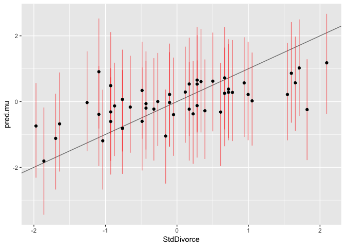
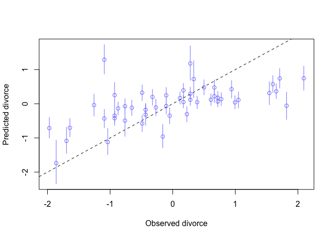

homework problems
=================

5E1
---

2 and 4

5E3
---

*Write down a multiple regression to evaluate the claim: Neither amount
of funding nor size of laboratory is by itself a good predictor of time
to PhD degree; but together these variables are both positively
associated with time to degree. Write down the model definition and
indicate which side of zero each slope parameter should be on.*

 \\
mu_i = \alpha + \beta Fund*F_i + \beta Size*S_i\\
alpha \sim Norm(5,1)\\
\beta Fund \sim Norm(0,1)\\
\beta Size \sim Norm(0,1)\\
\sigma \sim exp(1)\\
")

Both slope parameters will be positive

5M2
---

*5M2. Invent your own example of a masked relationship. An outcome
variable should be correlated with both predictor variables, but in
opposite directions. And the two predictor variables should be
correlated with one another.*

Backcounty ski ascent speed influenced by Altitude and AirTemp.

Higher altitude decreases speed because of reduced oxygen

Higher temp increases speed because snow is denser and therfore do not
sink as deep. Also less icey.

But temp increases with altitude.

5M3
---

*It is sometimes observed that the best predictor of fire risk is the
presence of firefighters--- States and localities with many firefighters
also have more fires. Presumably firefighters do not cause fires.
Nevertheless, this is not a spurious correlation. Instead fires cause
firefighters. Consider the same reversal of causal inference in the
context of the divorce and marriage data. How might a high divorce rate
cause a higher marriage rate? Can you think of a way to evaluate this
relationship, using multiple regression?*

high divorce rate means that there are more single people availble for
marriage.

Mr \~ Ma + Dr

5M4
---

*In the divorce data, States with high numbers of Mormons (members of
The Church of Jesus Christ of Latter-day Saints, LDS) have much lower
divorce rates than the regression models expected. Find a list of LDS
population by State and use those numbers as a predictor variable,
predicting divorce rate using marriage rate, median age at marriage, and
percent LDS population (possibly stan- dardized). You may want to
consider transformations of the raw percent LDS variable.*

``` {.r}
library(rethinking)
library(tidyverse)
data("WaffleDivorce")
library(rvest)
```

    ## Loading required package: xml2

    ## 
    ## Attaching package: 'rvest'

    ## The following object is masked from 'package:purrr':
    ## 
    ##     pluck

    ## The following object is masked from 'package:readr':
    ## 
    ##     guess_encoding

get the data into R. Use rvest to web scrape the table

``` {.r}
LDS <- read_html("https://en.wikipedia.org/wiki/The_Church_of_Jesus_Christ_of_Latter-day_Saints_membership_statistics_(United_States)")
LDS_table <- LDS %>% html_nodes(".wikitable") %>% magrittr::extract2(1) %>% html_table()
head(LDS_table)
```

    ##        State Membership Population   LDS Temples Missions Districts Stakes
    ## 1    Alabama     37,913  4,887,871 0.78%       1        1         0      7
    ## 2     Alaska     33,298    737,438 4.52%       1        1         0      8
    ## 3    Arizona    432,161  7,171,646 6.03%       6        6         0    115
    ## 4   Arkansas     31,765  3,013,825 1.05%       0        1         0      7
    ## 5 California    761,054 39,557,045 1.92%       7       18         0    154
    ## 6   Colorado    150,958  5,695,564 2.65%       2        4         0     35
    ##   Wards Branches Congregations Family History Centers
    ## 1    45       31            76                     44
    ## 2    59       21            80                     15
    ## 3   821       83           904                     74
    ## 4    42       27            69                     25
    ## 5 1,110      130         1,240                    228
    ## 6   277       28           305                     64

``` {.r}
LDS_table <- LDS_table %>% mutate(LDS_pct = {str_remove(LDS, "%") %>% as.numeric()}) %>%
  select(State,LDS_pct)
head(LDS_table)
```

    ##        State LDS_pct
    ## 1    Alabama    0.78
    ## 2     Alaska    4.52
    ## 3    Arizona    6.03
    ## 4   Arkansas    1.05
    ## 5 California    1.92
    ## 6   Colorado    2.65

Combine the data

``` {.r}
# what is missing in WaffleDivorce?
anti_join(LDS_table, WaffleDivorce, by = c("State" = "Location"))
```

    ## Warning: Column `State`/`Location` joining character vector and factor,
    ## coercing into character vector

    ##    State LDS_pct
    ## 1 Nevada    6.08
    ## 2 Totals    2.04

``` {.r}
# Nevada!

# do the join
divorce <- inner_join(WaffleDivorce, LDS_table, by = c("Location" = "State"))
```

    ## Warning: Column `Location`/`State` joining factor and character vector,
    ## coercing into character vector

``` {.r}
head(divorce)
```

    ##     Location Loc Population MedianAgeMarriage Marriage Marriage.SE Divorce
    ## 1    Alabama  AL       4.78              25.3     20.2        1.27    12.7
    ## 2     Alaska  AK       0.71              25.2     26.0        2.93    12.5
    ## 3    Arizona  AZ       6.33              25.8     20.3        0.98    10.8
    ## 4   Arkansas  AR       2.92              24.3     26.4        1.70    13.5
    ## 5 California  CA      37.25              26.8     19.1        0.39     8.0
    ## 6   Colorado  CO       5.03              25.7     23.5        1.24    11.6
    ##   Divorce.SE WaffleHouses South Slaves1860 Population1860 PropSlaves1860
    ## 1       0.79          128     1     435080         964201           0.45
    ## 2       2.05            0     0          0              0           0.00
    ## 3       0.74           18     0          0              0           0.00
    ## 4       1.22           41     1     111115         435450           0.26
    ## 5       0.24            0     0          0         379994           0.00
    ## 6       0.94           11     0          0          34277           0.00
    ##   LDS_pct
    ## 1    0.78
    ## 2    4.52
    ## 3    6.03
    ## 4    1.05
    ## 5    1.92
    ## 6    2.65

``` {.r}
hist(divorce$LDS_pct, breaks = 30)
```

<!-- -->

``` {.r}
hist(log(divorce$LDS_pct), breaks = 30)
```

<!-- -->

``` {.r}
divorce <- divorce %>% mutate(LDS_log = log(LDS_pct))
```

``` {.r}
divorce <- divorce %>%
  mutate(StdAge = scale(MedianAgeMarriage),
         StdMarriage = scale(Marriage),
         StdDivorce = scale(Divorce),
         StdLDS = scale(LDS_pct),
         StdLDS_log = scale(LDS_log))
head(divorce)
```

    ##     Location Loc Population MedianAgeMarriage Marriage Marriage.SE Divorce
    ## 1    Alabama  AL       4.78              25.3     20.2        1.27    12.7
    ## 2     Alaska  AK       0.71              25.2     26.0        2.93    12.5
    ## 3    Arizona  AZ       6.33              25.8     20.3        0.98    10.8
    ## 4   Arkansas  AR       2.92              24.3     26.4        1.70    13.5
    ## 5 California  CA      37.25              26.8     19.1        0.39     8.0
    ## 6   Colorado  CO       5.03              25.7     23.5        1.24    11.6
    ##   Divorce.SE WaffleHouses South Slaves1860 Population1860 PropSlaves1860
    ## 1       0.79          128     1     435080         964201           0.45
    ## 2       2.05            0     0          0              0           0.00
    ## 3       0.74           18     0          0              0           0.00
    ## 4       1.22           41     1     111115         435450           0.26
    ## 5       0.24            0     0          0         379994           0.00
    ## 6       0.94           11     0          0          34277           0.00
    ##   LDS_pct     LDS_log     StdAge StdMarriage StdDivorce      StdLDS
    ## 1    0.78 -0.24846136 -0.6062895  0.02264406  1.6542053 -0.26225607
    ## 2    4.52  1.50851199 -0.6866993  1.54980162  1.5443643  0.11273923
    ## 3    6.03  1.79674701 -0.2042408  0.04897436  0.6107159  0.26414107
    ## 4    1.05  0.04879016 -1.4103870  1.65512283  2.0935693 -0.23518421
    ## 5    1.92  0.65232519  0.5998567 -0.26698927 -0.9270579 -0.14795269
    ## 6    2.65  0.97455964 -0.2846505  0.89154405  1.0500799 -0.07475842
    ##   StdLDS_log
    ## 1 -0.3908803
    ## 2  1.1979095
    ## 3  1.4585536
    ## 4 -0.1220827
    ## 5  0.4236798
    ## 6  0.7150689

``` {.r}
m5m4.1 <- quap(
  flist = alist(
    StdDivorce ~ dnorm(mu, sigma),
    mu <- a + bA*StdAge + bM*StdMarriage + bL*StdLDS_log,
    a ~ dnorm(0, 0.2),
    bA ~ dnorm(0, 0.5),
    bM ~ dnorm(0, 0.5),
    bL ~ dnorm(0, 1),
    sigma ~ dexp(1)),
  data = divorce)
precis(m5m4.1)
```

    ##                mean         sd       5.5%       94.5%
    ## a      4.542301e-09 0.09379186 -0.1498975  0.14989752
    ## bA    -7.068109e-01 0.15160781 -0.9491095 -0.46451235
    ## bM     8.518699e-02 0.16340793 -0.1759704  0.34634442
    ## bL    -3.153510e-01 0.15467551 -0.5625523 -0.06814964
    ## sigma  7.508988e-01 0.07452175  0.6317986  0.86999890

plot predicted vs observed

``` {.r}
predicted <- sim(m5m4.1)
divorce$pred.mu <- predicted %>% apply(2, mean)
pred.HPDI <- predicted %>% apply(2,HPDI,.95) %>% t()
divorce$pred.hpdi.low <- pred.HPDI[,1]
divorce$pred.hpdi.high <- pred.HPDI[,2]
```

``` {.r}
divorce %>%
  ggplot(aes(x=StdDivorce, y = pred.mu, ymin=pred.hpdi.low, ymax=pred.hpdi.high)) +
  geom_abline(slope=1,intercept=0, color="gray50") +
  geom_linerange(color="red", alpha=.5)  +
  geom_point() 
```

<!-- -->

``` {.r}
m5m4.2 <- quap(
  flist = alist(
    StdDivorce ~ dnorm(mu, sigma),
    mu <- a + bA*StdAge + bM*StdMarriage + bL*StdLDS,
    a ~ dnorm(0, 0.2),
    bA ~ dnorm(0, 0.5),
    bM ~ dnorm(0, 0.5),
    bL ~ dnorm(0, 1),
    sigma ~ dexp(1)),
  data = divorce)
precis(m5m4.2)
```

    ##                mean         sd       5.5%      94.5%
    ## a      5.106751e-08 0.09187012 -0.1468262  0.1468263
    ## bA    -6.924323e-01 0.14431599 -0.9230772 -0.4617875
    ## bM     4.183543e-02 0.14767195 -0.1941729  0.2778437
    ## bL    -3.293842e-01 0.12209077 -0.5245089 -0.1342596
    ## sigma  7.313439e-01 0.07256589  0.6153696  0.8473182

Non-transformed seems slightly better (narrower credible intervals)

plot predicted vs observed

``` {.r}
predicted <- sim(m5m4.2)
divorce$pred.mu <- predicted %>% apply(2, mean)
pred.HPDI <- predicted %>% apply(2,HPDI,.95) %>% t()
divorce$pred.hpdi.low <- pred.HPDI[,1]
divorce$pred.hpdi.high <- pred.HPDI[,2]
```

``` {.r}
divorce %>%
  ggplot(aes(x=StdDivorce, y = pred.mu, ymin=pred.hpdi.low, ymax=pred.hpdi.high)) +
  geom_abline(slope=1,intercept=0, color="gray50") +
  geom_linerange(color="red", alpha=.5)  +
  geom_point() 
```

<!-- -->

5H1
---

*The urban fox (Vulpes vulpes) is a successful exploiter of human
habitat. Since urban foxes move in packs and defend territories, data on
habitat quality and population density is also included. The data frame
has five columns:*

(1) group: Number of the social group the individual fox belongs to\
(2) avgfood: The average amount of food available in the territory\
(3) groupsize: The number of foxes in the social group\
(4) area: Size of the territory\
(5) weight: Body weight of the individual fox

*Fit two bivariate Gaussian regressions, using quap: (1) body weight as
a linear function of territory size (area), and (2) body weight as a
linear function of groupsize. Plot the results of these regressions,
displaying the MAP regression line and the 95% interval of the mean. Is
either variable important for predicting fox body weight?*

``` {.r}
data("foxes")
head(foxes)
```

    ##   group avgfood groupsize area weight
    ## 1     1    0.37         2 1.09   5.02
    ## 2     1    0.37         2 1.09   2.84
    ## 3     2    0.53         2 2.05   5.33
    ## 4     2    0.53         2 2.05   6.07
    ## 5     3    0.49         2 2.12   5.85
    ## 6     3    0.49         2 2.12   3.25

``` {.r}
m5h1.1 <- quap(
  flist = alist(
    weight ~ dnorm(mu, sigma),
    mu <- a + bA*area,
    a ~ dnorm(5,2),
    bA ~ dnorm(0,1),
    sigma ~ dexp(1)),
  data=foxes)
precis(m5h1.1)
```

    ##             mean         sd       5.5%     94.5%
    ## a     4.47238526 0.37938769  3.8660505 5.0787201
    ## bA    0.01860714 0.11503196 -0.1652361 0.2024504
    ## sigma 1.17267652 0.07640374  1.0505686 1.2947845

``` {.r}
m5h1pred1 <- data.frame(
  area=seq(min(foxes$area)*.95, max(foxes$area)*1.05, length.out = 100))

m5h1.1.link <- link(m5h1.1, data = m5h1pred1)

m5h1pred1 <- m5h1pred1 %>%
  mutate(mu = apply(m5h1.1.link, 2, mean),
         hpdi.low = {apply(m5h1.1.link, 2, HPDI, .95) %>% 
             t() %>% 
             magrittr::extract(,1)},
         hpdi.high = {apply(m5h1.1.link, 2, HPDI, .95) %>% 
             t() %>% 
             magrittr::extract(,2)})
head(m5h1pred1)
```

    ##       area       mu hpdi.low hpdi.high
    ## 1 1.035500 4.491455 3.928585  5.030308
    ## 2 1.078813 4.492271 3.938074  5.023723
    ## 3 1.122126 4.493086 3.904563  4.972998
    ## 4 1.165439 4.493902 3.916743  4.964978
    ## 5 1.208753 4.494718 3.951404  4.979246
    ## 6 1.252066 4.495534 3.938169  4.950091

``` {.r}
m5h1pred1 %>%
  ggplot(aes(x=area,y=mu,ymin=hpdi.low,ymax=hpdi.high)) +
  geom_line() +
  geom_ribbon(alpha=.2) +
  geom_point(aes(x=area, y=weight), color="blue", alpha=0.3,data=foxes, inherit.aes = FALSE)
```

<!-- -->

``` {.r}
m5h1.2 <- quap(
  flist = alist(
    weight ~ dnorm(mu, sigma),
    mu <- a + bG*groupsize,
    a ~ dnorm(5,2),
    bG ~ dnorm(0,1),
    sigma ~ dexp(1)),
  data=foxes)
precis(m5h1.2)
```

    ##             mean         sd       5.5%       94.5%
    ## a      5.0636885 0.31846467  4.5547205  5.57265654
    ## bG    -0.1229535 0.06920771 -0.2335608 -0.01234624
    ## sigma  1.1577649 0.07544795  1.0371845  1.27834527

``` {.r}
m5h1pred2 <- data.frame(
  groupsize=seq(min(foxes$groupsize)*.95, max(foxes$groupsize)*1.05, length.out = 100))

m5h1.2.link <- link(m5h1.2, data = m5h1pred2)

m5h1pred2 <- m5h1pred2 %>%
  mutate(mu = apply(m5h1.2.link, 2, mean),
         hpdi.low = {apply(m5h1.2.link, 2, HPDI, .95) %>% 
             t() %>% 
             magrittr::extract(,1)},
         hpdi.high = {apply(m5h1.2.link, 2, HPDI, .95) %>% 
             t() %>% 
             magrittr::extract(,2)})
head(m5h1pred2)
```

    ##   groupsize       mu hpdi.low hpdi.high
    ## 1  1.900000 4.817767 4.399063  5.195840
    ## 2  1.965657 4.810036 4.399956  5.179518
    ## 3  2.031313 4.802305 4.400850  5.164514
    ## 4  2.096970 4.794574 4.396859  5.148666
    ## 5  2.162626 4.786843 4.397774  5.134463
    ## 6  2.228283 4.779111 4.402127  5.123827

``` {.r}
m5h1pred2 %>%
  ggplot(aes(x=groupsize,y=mu,ymin=hpdi.low,ymax=hpdi.high)) +
  geom_line() +
  geom_ribbon(alpha=.2) +
  geom_point(aes(x=groupsize, y=weight), color="blue", alpha=0.3,data=foxes, inherit.aes = FALSE)
```

<!-- --> some
evidence for groupsize having an influence

5H2
---

\_ Now fit a multiple linear regression with weight as the outcome and
both area and groupsize as predictor variables. Plot the predictions of
the model for each predictor, holding the other predictor constant at
its mean. What does this model say about the importance of each
variable? Why do you get different results than you got in the exercise
just above?\_

``` {.r}
plot(foxes$groupsize, foxes$area)
```

<!-- -->

``` {.r}
m5h2 <- quap(
  flist = alist(
    weight ~ dnorm(mu, sigma),
    mu <- a + bA*area + bG*groupsize,
    a ~ dnorm(5,2),
    bA ~ dnorm(0,1),
    bG ~ dnorm(0,1),
    sigma ~ dexp(1)),
  data=foxes)
precis(m5h2)
```

    ##             mean         sd       5.5%      94.5%
    ## a      4.4906231 0.36110428  3.9135087  5.0677375
    ## bA     0.5817853 0.19360266  0.2723708  0.8911997
    ## bG    -0.4150601 0.11782141 -0.6033615 -0.2267587
    ## sigma  1.1132820 0.07258942  0.9972701  1.2292939

counterfactual...

``` {.r}
pred5h2area <- data.frame(
  area=seq(min(foxes$area)*.95, max(foxes$area)*1.05, length.out = 100),
  groupsize=mean(foxes$groupsize))
link5h2area <- link(m5h2, data = pred5h2area)
sim5h2area <- sim(m5h2, data=pred5h2area)
```

``` {.r}
pred5h2area <- pred5h2area %>%
  mutate(weight = apply(link5h2area, 2, mean),
         mu.low = {apply(link5h2area, 2, HPDI, .95) %>% 
             t() %>% 
             magrittr::extract(,1)},
         mu.high = {apply(link5h2area, 2, HPDI, .95) %>% 
             t() %>% 
             magrittr::extract(,2)},
         sim.low = {apply(sim5h2area, 2, HPDI, .95) %>% 
             t() %>% 
             magrittr::extract(,1)},
         sim.high = {apply(sim5h2area, 2, HPDI, .95) %>% 
             t() %>% 
             magrittr::extract(,2)})
```

``` {.r}
pred5h2area %>% ggplot(aes(x=area,y=weight)) +
  geom_line() +
  geom_ribbon(aes(ymin=sim.low, ymax=sim.high),alpha=.2) +
  geom_ribbon(aes(ymin=mu.low, ymax=mu.high),alpha=.4)
```

<!-- -->

``` {.r}
pred5h2groupsize <- data.frame(
  groupsize=seq(min(foxes$groupsize)*.95, max(foxes$groupsize)*1.05, length.out = 100),
  area=mean(foxes$area))
link5h2groupsize <- link(m5h2, data = pred5h2groupsize)
sim5h2groupsize <- sim(m5h2, data=pred5h2groupsize)
```

``` {.r}
pred5h2groupsize <- pred5h2groupsize %>%
  mutate(weight = apply(link5h2groupsize, 2, mean),
         mu.low = {apply(link5h2groupsize, 2, HPDI, .95) %>% 
             t() %>% 
             magrittr::extract(,1)},
         mu.high = {apply(link5h2groupsize, 2, HPDI, .95) %>% 
             t() %>% 
             magrittr::extract(,2)},
         sim.low = {apply(sim5h2groupsize, 2, HPDI, .95) %>% 
             t() %>% 
             magrittr::extract(,1)},
         sim.high = {apply(sim5h2groupsize, 2, HPDI, .95) %>% 
             t() %>% 
             magrittr::extract(,2)})
```

``` {.r}
pred5h2groupsize %>% ggplot(aes(x=groupsize,y=weight)) +
  geom_line() +
  geom_ribbon(aes(ymin=sim.low, ymax=sim.high),alpha=.2) +
  geom_ribbon(aes(ymin=mu.low, ymax=mu.high),alpha=.4)
```

<!-- -->

area increaeses weight, groupsize decreases weight. area and groupsize
are positively correlated so they mask one another. \# book code and
notes

``` {.r}
## R code 5.1
# load data and copy
library(rethinking)
data(WaffleDivorce)
d <- WaffleDivorce

# standardize variables
d$A <- scale( d$MedianAgeMarriage )
d$D <- scale( d$Divorce )

## R code 5.2
sd( d$MedianAgeMarriage )
```

    ## [1] 1.24363

``` {.r}
## R code 5.3
m5.1 <- quap(
  alist(
    D ~ dnorm( mu , sigma ) ,
    mu <- a + bA * A ,
    a ~ dnorm( 0 , 0.2 ) ,
    bA ~ dnorm( 0 , 0.5 ) ,
    sigma ~ dexp( 1 )
  ) , data = d )

## R code 5.4
set.seed(10)
prior <- extract.prior( m5.1 )
mu <- link( m5.1 , post=prior , data=list( A=c(-2,2) ) )
plot( NULL , xlim=c(-2,2) , ylim=c(-2,2) )
for ( i in 1:50 ) lines( c(-2,2) , mu[i,] , col=col.alpha("black",0.4) )
```

<!-- -->

``` {.r}
## R code 5.5
# compute percentile interval of mean
A_seq <- seq( from=-3 , to=3.2 , length.out=30 )
mu <- link( m5.1 , data=list(A=A_seq) )
mu.mean <- apply( mu , 2, mean )
mu.PI <- apply( mu , 2 , PI )

# plot it all
plot( D ~ A , data=d , col=rangi2 )
lines( A_seq , mu.mean , lwd=2 )
shade( mu.PI , A_seq )
```

<!-- -->

``` {.r}
## R code 5.6
d$M <- scale( d$Marriage )
m5.2 <- quap(
  alist(
    D ~ dnorm( mu , sigma ) ,
    mu <- a + bM * M ,
    a ~ dnorm( 0 , 0.2 ) ,
    bM ~ dnorm( 0 , 0.5 ) ,
    sigma ~ dexp( 1 )
  ) , data = d )

## R code 5.7
library(dagitty)
dag5.1 <- dagitty( "dag {
    A -> D
    A -> M
    M -> D
}")
coordinates(dag5.1) <- list( x=c(A=0,D=1,M=2) , y=c(A=0,D=1,M=0) )
plot( dag5.1 )
```

<!-- -->

``` {.r}
## R code 5.8
m5.3 <- quap(
  alist(
    D ~ dnorm( mu , sigma ) ,
    mu <- a + bM*M + bA*A ,
    a ~ dnorm( 0 , 0.2 ) ,
    bM ~ dnorm( 0 , 0.5 ) ,
    bA ~ dnorm( 0 , 0.5 ) ,
    sigma ~ dexp( 1 )
  ) , data = d )
precis( m5.3 )
```

    ##                mean         sd       5.5%      94.5%
    ## a     -2.828642e-05 0.09707123 -0.1551669  0.1551103
    ## bM    -6.553086e-02 0.15076312 -0.3064794  0.1754177
    ## bA    -6.136370e-01 0.15097351 -0.8549218 -0.3723521
    ## sigma  7.850672e-01 0.07783076  0.6606786  0.9094558

``` {.r}
## R code 5.9
plot( coeftab(m5.1,m5.2,m5.3), par=c("bA","bM") )
```

<!-- -->

``` {.r}
## R code 5.10
N <- 50 # number of simulated States
age <- rnorm( N )        # sim A
mar <- rnorm( N , age )  # sim A -> M
div <- rnorm( N , age )  # sim A -> D
```

``` {.r}
## R code 5.11
m5.4 <- quap(
  alist(
    M ~ dnorm( mu , sigma ) ,
    mu <- a + bAM * A ,
    a ~ dnorm( 0 , 0.2 ) ,
    bAM ~ dnorm( 0 , 0.5 ) ,
    sigma ~ dexp( 1 )
  ) , data = d )

## R code 5.12
mu <- link(m5.4)
mu_mean <- apply( mu , 2 , mean )
mu_resid <- d$M - mu_mean
```

``` {.r}
## R code 5.13
# prepare new counterfactual data
M_seq <- seq( from=-2 , to=3 , length.out=30 )
pred_data <- data.frame( M = M_seq , A = 0 )

# compute counterfactual mean divorce (mu)
mu <- link( m5.3 , data=pred_data )
mu_mean <- apply( mu , 2 , mean )
mu_PI <- apply( mu , 2 , PI )

# simulate counterfactual divorce outcomes
D_sim <- sim( m5.3 , data=pred_data , n=1e4 )
D_PI <- apply( D_sim , 2 , PI )

# display predictions, hiding raw data with type="n"
plot( D ~ M , data=d , type="n" )
mtext( "Median age marriage (std) = 0" )
lines( M_seq , mu_mean )
shade( mu_PI , M_seq )
shade( D_PI , M_seq )
```

<!-- -->

``` {.r}
## R code 5.14
# call link without specifying new data
# so it uses original data
mu <- link( m5.3 )

# summarize samples across cases
mu_mean <- apply( mu , 2 , mean )
mu_PI <- apply( mu , 2 , PI )

# simulate observations
# again no new data, so uses original data
D_sim <- sim( m5.3 , n=1e4 )
D_PI <- apply( D_sim , 2 , PI )

## R code 5.15
plot( mu_mean ~ d$D , col=rangi2 , ylim=range(mu_PI) ,
      xlab="Observed divorce" , ylab="Predicted divorce" )
abline( a=0 , b=1 , lty=2 )
for ( i in 1:nrow(d) ) lines( rep(d$D[i],2) , mu_PI[,i] , col=rangi2 )

## R code 5.16
identify( x=d$D , y=mu_mean , labels=d$Loc )
```

<!-- -->

    ## integer(0)

``` {.r}
## R code 5.17
N <- 100                         # number of cases
x_real <- rnorm( N )             # x_real as Gaussian with mean 0 and stddev 1
x_spur <- rnorm( N , x_real )    # x_spur as Gaussian with mean=x_real
y <- rnorm( N , x_real )         # y as Gaussian with mean=x_real
d <- data.frame(y,x_real,x_spur) # bind all together in data frame

## R code 5.18
library(rethinking)
data(milk)
d <- milk
str(d)
```

    ## 'data.frame':    29 obs. of  8 variables:
    ##  $ clade         : Factor w/ 4 levels "Ape","New World Monkey",..: 4 4 4 4 4 2 2 2 2 2 ...
    ##  $ species       : Factor w/ 29 levels "A palliata","Alouatta seniculus",..: 11 8 9 10 16 2 1 6 28 27 ...
    ##  $ kcal.per.g    : num  0.49 0.51 0.46 0.48 0.6 0.47 0.56 0.89 0.91 0.92 ...
    ##  $ perc.fat      : num  16.6 19.3 14.1 14.9 27.3 ...
    ##  $ perc.protein  : num  15.4 16.9 16.9 13.2 19.5 ...
    ##  $ perc.lactose  : num  68 63.8 69 71.9 53.2 ...
    ##  $ mass          : num  1.95 2.09 2.51 1.62 2.19 5.25 5.37 2.51 0.71 0.68 ...
    ##  $ neocortex.perc: num  55.2 NA NA NA NA ...

``` {.r}
## R code 5.19
d$K <- scale( d$kcal.per.g )
d$N <- scale( d$neocortex.perc )
d$M <- scale( log(d$mass) )

# ## R code 5.20
# m5.5_draft <- quap(
#   alist(
#     K ~ dnorm( mu , sigma ) ,
#     mu <- a + bN*N ,
#     a ~ dnorm( 0 , 1 ) ,
#     bN ~ dnorm( 0 , 1 ) ,
#     sigma ~ dexp( 1 )
#   ) , data=d )
# 
# ## R code 5.21
# d$neocortex.perc
# 
## R code 5.22
dcc <- d[ complete.cases(d$K,d$N,d$M) , ]

## R code 5.23
m5.5_draft <- quap(
alist(
K ~ dnorm( mu , sigma ) ,
mu <- a + bN*N ,
a ~ dnorm( 0 , 1 ) ,
bN ~ dnorm( 0 , 1 ) ,
sigma ~ dexp( 1 )
) , data=dcc )
#
# ## R code 5.24
# prior <- extract.prior( m5.5_draft )
# xseq <- c(-2,2)
# mu <- link( m5.5_draft , post=prior , data=list(N=xseq) )
# plot( NULL , xlim=xseq , ylim=xseq )
# for ( i in 1:50 ) lines( xseq , mu[i,] , col=col.alpha("black",0.3) )

## R code 5.25
m5.5 <- quap(
  alist(
    K ~ dnorm( mu , sigma ) ,
    mu <- a + bN*N ,
    a ~ dnorm( 0 , 0.2 ) ,
    bN ~ dnorm( 0 , 0.5 ) ,
    sigma ~ dexp( 1 )
  ) , data=dcc )

## R code 5.26
precis( m5.5 )
```

    ##             mean        sd       5.5%     94.5%
    ## a     0.03993986 0.1544908 -0.2069663 0.2868460
    ## bN    0.13323452 0.2237469 -0.2243563 0.4908253
    ## sigma 0.99982067 0.1647082  0.7365852 1.2630562

``` {.r}
## R code 5.27
xseq <- seq( from=min(dcc$N)-0.15 , to=max(dcc$N)+0.15 , length.out=30 )
mu <- link( m5.5 , data=list(N=xseq) )
mu_mean <- apply(mu,2,mean)
mu_PI <- apply(mu,2,PI)
plot( K ~ N , data=dcc )
lines( xseq , mu_mean , lwd=2 )
shade( mu_PI , xseq )
```

<!-- -->

``` {.r}
## R code 5.28
m5.6 <- quap(
  alist(
    K ~ dnorm( mu , sigma ) ,
    mu <- a + bM*M ,
    a ~ dnorm( 0 , 0.2 ) ,
    bM ~ dnorm( 0 , 0.5 ) ,
    sigma ~ dexp( 1 )
  ) , data=dcc )
precis(m5.6)
```

    ##              mean        sd       5.5%      94.5%
    ## a      0.04654511 0.1512800 -0.1952296 0.28831984
    ## bM    -0.28253859 0.1928818 -0.5908010 0.02572382
    ## sigma  0.94927994 0.1570618  0.6982649 1.20029497

``` {.r}
## R code 5.29
m5.7 <- quap(
  alist(
    K ~ dnorm( mu , sigma ) ,
    mu <- a + bN*N + bM*M ,
    a ~ dnorm( 0 , 0.2 ) ,
    bN ~ dnorm( 0 , 0.5 ) ,
    bM ~ dnorm( 0 , 0.5 ) ,
    sigma ~ dexp( 1 )
  ) , data=dcc )
precis(m5.7)
```

    ##              mean        sd       5.5%      94.5%
    ## a      0.06799141 0.1339986 -0.1461643  0.2821471
    ## bN     0.67511810 0.2482984  0.2782892  1.0719470
    ## bM    -0.70299056 0.2207869 -1.0558507 -0.3501304
    ## sigma  0.73801382 0.1324616  0.5263146  0.9497131

``` {.r}
## R code 5.30
plot( coeftab( m5.5 , m5.6 , m5.7 ) , pars=c("bM","bN") )
```

<!-- -->

``` {.r}
## R code 5.31
xseq <- seq( from=min(dcc$M)-0.15 , to=max(dcc$M)+0.15 , length.out=30 )
mu <- link( m5.7 , data=data.frame( M=xseq , N=0 ) )
mu_mean <- apply(mu,2,mean)
mu_PI <- apply(mu,2,PI)
plot( NULL , xlim=range(dcc$M) , ylim=range(dcc$K) )
lines( xseq , mu_mean , lwd=2 )
shade( mu_PI , xseq )
```

<!-- -->

``` {.r}
## R code 5.32
# M -> K <- N
# M -> N
n <- 100
M <- rnorm( n )
N <- rnorm( n , M )
K <- rnorm( n , N - M )
d_sim <- data.frame(K=K,N=N,M=M)

## R code 5.33
# M -> K <- N
# N -> M
n <- 100
N <- rnorm( n )
M <- rnorm( n , N )
K <- rnorm( n , N - M )
d_sim2 <- data.frame(K=K,N=N,M=M)

# M -> K <- N
# M <- U -> N
n <- 100
U <- rnorm( n )
N <- rnorm( n , U )
M <- rnorm( n , U )
K <- rnorm( n , N - M )
d_sim3 <- data.frame(K=K,N=N,M=M)

## R code 5.34
data(Howell1)
d <- Howell1
str(d)
```

    ## 'data.frame':    544 obs. of  4 variables:
    ##  $ height: num  152 140 137 157 145 ...
    ##  $ weight: num  47.8 36.5 31.9 53 41.3 ...
    ##  $ age   : num  63 63 65 41 51 35 32 27 19 54 ...
    ##  $ male  : int  1 0 0 1 0 1 0 1 0 1 ...

``` {.r}
## R code 5.35
mu_female <- rnorm(1e4,178,20)
mu_male <- rnorm(1e4,178,20) + rnorm(1e4,0,10)
precis( data.frame( mu_female , mu_male ) )
```

    ##               mean       sd     5.5%    94.5%  histogram
    ## mu_female 177.7477 20.09761 146.3001 210.4557  ▁▁▃▇▇▂▁▁▁
    ## mu_male   177.6815 22.70494 140.7987 214.1197 ▁▁▁▃▇▇▃▁▁▁

``` {.r}
## R code 5.36
d$sex <- ifelse( d$male==1 , 2 , 1 )
str( d$sex )
```

    ##  num [1:544] 2 1 1 2 1 2 1 2 1 2 ...

``` {.r}
## R code 5.37
m5.8 <- quap(
  alist(
    height ~ dnorm( mu , sigma ) ,
    mu <- a[sex] ,
    a[sex] ~ dnorm( 178 , 20 ) ,
    sigma ~ dunif( 0 , 50 )
  ) , data=d )
precis( m5.8 , depth=2 )
```

    ##            mean        sd      5.5%     94.5%
    ## a[1]  134.91122 1.6068463 132.34317 137.47928
    ## a[2]  142.57928 1.6973809 139.86653 145.29202
    ## sigma  27.30846 0.8279287  25.98527  28.63165

``` {.r}
## R code 5.38
post <- extract.samples(m5.8)
post$diff_fm <- post$a[,1] - post$a[,2]
precis( post , depth=2 )
```

    ##               mean        sd      5.5%      94.5%      histogram
    ## sigma    27.326018 0.8162263  26.01602  28.640141 ▁▁▁▁▃▇▇▇▃▂▁▁▁▁
    ## a[1]    134.915574 1.6049591 132.37060 137.486020       ▁▁▁▃▇▃▁▁
    ## a[2]    142.550368 1.6954805 139.84644 145.254307  ▁▁▁▁▃▅▇▇▃▂▁▁▁
    ## diff_fm  -7.634794 2.3375236 -11.35519  -3.902813     ▁▁▁▂▇▇▃▁▁▁

``` {.r}
## R code 5.39
data(milk)
d <- milk
unique(d$clade)
```

    ## [1] Strepsirrhine    New World Monkey Old World Monkey Ape             
    ## Levels: Ape New World Monkey Old World Monkey Strepsirrhine

``` {.r}
## R code 5.40
d$clade_id <- as.integer( d$clade )

## R code 5.41
d$K <- scale( d$kcal.per.g )
m5.9 <- quap(
  alist(
    K ~ dnorm( mu , sigma ),
    mu <- a[clade_id],
    a[clade_id] ~ dnorm( 0 , 0.5 ),
    sigma ~ dexp( 1 )
  ) , data=d )
labels <- paste( "a[" , 1:4 , "]:" , levels(d$clade) , sep="" )
plot( precis( m5.9 , depth=2 , pars="a" ) , labels=labels ,
      xlab="expected kcal (std)" )
```

<!-- -->

``` {.r}
## R code 5.42
set.seed(63)
d$house <- sample( rep(1:4,each=8) , size=nrow(d) )

## R code 5.43
m5.10 <- quap(
  alist(
    K ~ dnorm( mu , sigma ),
    mu <- a[clade_id] + h[house],
    a[clade_id] ~ dnorm( 0 , 0.5 ),
    h[house] ~ dnorm( 0 , 0.5 ),
    sigma ~ dexp( 1 )
  ) , data=d )
```
