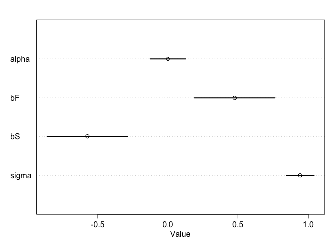

## Problems

### 6H1
_Use the Waffle House data, data(WaffleDivorce), to find the total causal influence of number of Waffle Houses on divorce rate. Justify your model or models with a causal graph._


```r
data(WaffleDivorce)
head(WaffleDivorce)
```

```
##     Location Loc Population MedianAgeMarriage Marriage Marriage.SE Divorce
## 1    Alabama  AL       4.78              25.3     20.2        1.27    12.7
## 2     Alaska  AK       0.71              25.2     26.0        2.93    12.5
## 3    Arizona  AZ       6.33              25.8     20.3        0.98    10.8
## 4   Arkansas  AR       2.92              24.3     26.4        1.70    13.5
## 5 California  CA      37.25              26.8     19.1        0.39     8.0
## 6   Colorado  CO       5.03              25.7     23.5        1.24    11.6
##   Divorce.SE WaffleHouses South Slaves1860 Population1860 PropSlaves1860
## 1       0.79          128     1     435080         964201           0.45
## 2       2.05            0     0          0              0           0.00
## 3       0.74           18     0          0              0           0.00
## 4       1.22           41     1     111115         435450           0.26
## 5       0.24            0     0          0         379994           0.00
## 6       0.94           11     0          0          34277           0.00
```

The DAG presented in the chapter is:

```r
waffledag <- dagitty("dag {
  S -> A
  S -> M
  A -> M
  M -> D
  A -> D
  S -> W
  W -> D
}")

coordinates(waffledag) <- list(x=c(S=0, W=2, M = 1, A = 0, D = 2),
                               y=c(S=0, W=0, M = 1, A = 2, D=2))
  
plot(waffledag)
```

<!-- -->

Now, McElreath would say conditions on S.  I would prefer A and M, since S is only an indicator variable and I am ntos rue that it can account for all the variability in A and M.  Will try both.

First scale and center

```r
waffle2 <- WaffleDivorce %>%
  select(A=MedianAgeMarriage, M=Marriage, D=Divorce, W=WaffleHouses, S=South) %>%
  mutate_at(vars(A, M, D, W), scale)
head(waffle2)
```

```
##            A           M          D          W S
## 1 -0.6062895  0.02264406  1.6542053  1.4540295 1
## 2 -0.6866993  1.54980162  1.5443643 -0.4915672 0
## 3 -0.2042408  0.04897436  0.6107159 -0.2179676 0
## 4 -1.4103870  1.65512283  2.0935693  0.1316318 1
## 5  0.5998567 -0.26698927 -0.9270579 -0.4915672 0
## 6 -0.2846505  0.89154405  1.0500799 -0.3243674 0
```


```r
m6h1.1 <- quap(alist(
  D ~ dnorm(mu, sigma),
  mu <- alpha + bA*A + bM*M + bW*W,
  alpha ~ dnorm(0,0.2),
  bA ~ dnorm(0, 0.5),
  bM ~ dnorm(0, 0.5),
  bW ~ dnorm(0, 0.5),
  sigma ~ dexp(1)),
  data=waffle2)
```


```r
precis(m6h1.1)
```

```
##                mean         sd         5.5%      94.5%
## alpha -2.797599e-06 0.09516359 -0.152092589  0.1520870
## bA    -5.843543e-01 0.14882346 -0.822202970 -0.3465057
## bM    -5.007168e-02 0.14775345 -0.286210240  0.1860669
## bW     1.782194e-01 0.10774075  0.006028866  0.3504099
## sigma  7.650650e-01 0.07584142  0.643855756  0.8862742
```


```r
plot(precis(m6h1.1))
```

<!-- -->

This implies that wafflehouses may indeed influence divorce rate

Try it conditioning on S


```r
m6h1.2 <- quap(alist(
  D ~ dnorm(mu, sigma),
  mu <- alpha + bS*S + bW*W,
  alpha ~ dnorm(0,0.2),
  bS ~ dnorm(0, 0.5),
  bW ~ dnorm(0, 0.5),
  sigma ~ dexp(1)),
  data=waffle2)
```


```r
precis(m6h1.2)
```

```
##              mean         sd        5.5%     94.5%
## alpha -0.07724658 0.12384339 -0.27517223 0.1206791
## bS     0.39437484 0.29088870 -0.07052148 0.8592712
## bW     0.12310774 0.15331657 -0.12192175 0.3681372
## sigma  0.92660557 0.09198013  0.77960355 1.0736076
```


```r
plot(precis(m6h1.2))
```

<!-- -->

Try it conditioning on S and A


```r
m6h1.3 <- quap(alist(
  D ~ dnorm(mu, sigma),
  mu <- alpha + bA*A + bS*S + bW*W,
  alpha ~ dnorm(0,0.2),
  bA ~ dnorm(0, 0.5),
  bS ~ dnorm(0, 0.5),
  bW ~ dnorm(0, 0.5),
  sigma ~ dexp(1)),
  data=waffle2)
```


```r
precis(m6h1.3)
```

```
##              mean         sd        5.5%      94.5%
## alpha -0.04828018 0.11058949 -0.22502355  0.1284632
## bA    -0.53321493 0.10876043 -0.70703509 -0.3593948
## bS     0.22235649 0.26186989 -0.19616217  0.6408751
## bW     0.11670071 0.13093414 -0.09255733  0.3259587
## sigma  0.76099342 0.07541483  0.64046596  0.8815209
```


```r
plot(precis(m6h1.3))
```

<!-- -->


```r
m6h1.4 <- quap(alist(
  D ~ dnorm(mu, sigma),
  mu <- alpha + bA*A  + bW*W,
  alpha ~ dnorm(0,0.2),
  bA ~ dnorm(0, 0.5),
  bW ~ dnorm(0, 0.5),
  sigma ~ dexp(1)),
  data=waffle2)
```


```r
precis(m6h1.4)
```

```
##                mean         sd         5.5%      94.5%
## alpha -5.265125e-07 0.09536477 -0.152411854  0.1524108
## bA    -5.494582e-01 0.10785036 -0.721823920 -0.3770925
## bW     1.808101e-01 0.10774620  0.008610835  0.3530093
## sigma  7.671577e-01 0.07593356  0.645801253  0.8885142
```


```r
plot(precis(m6h1.4))
```

<!-- -->

So if we do not include State then there is a bit of an influence of wafflehouses on divorce.  I don't really think that wafflehouses cause divorce, rather there is something else influenced by State, not captured in this model.


```r
waffledag2 <- dagitty("dag {
  S -> A
  A -> D
  S -> W
  S -> U
  U -> D
}")

coordinates(waffledag2) <- list(x=c(S=0, W=2, U = 1, A = 0, D = 2),
                               y=c(S=0, W=0, U = 1, A = 2, D=2))
  
plot(waffledag2)
```

<!-- -->


### 6H2.
_Build a series of models to test the implied conditional independencies of the causal graph you used in the previous problem. If any of the tests fail, how do you think the graph needs to be amended? Does the graph need more or fewer arrows? Feel free to nominate variables that aren’t in the data._


```r
impliedConditionalIndependencies(waffledag2)
```

```
## A _||_ U | S
## A _||_ W | S
## D _||_ S | A, U
## D _||_ W | S
## D _||_ W | A, U
## U _||_ W | S
```

Well, since U is unobserved I can't test those.

A _||_ W | S
first, dependence if I don't condition?

```r
quap(alist(
  A ~ dnorm(mu, sigma),
  mu <- alpha +  + bW*W,
  alpha ~ dnorm(0,0.2),
  bW ~ dnorm(0, 0.5),
  sigma ~ dexp(1)),
  data=waffle2) %>%
  precis() %>% 
  plot
```

<!-- -->

No.  Same if conditinon on state?


```r
quap(alist(
  A ~ dnorm(mu, sigma),
  mu <- alpha + bS*S  + bW*W,
  alpha ~ dnorm(0,0.2),
  bW ~ dnorm(0, 0.5),
  bS ~ dnorm(0, 0.5),
  sigma ~ dexp(1)),
  data=waffle2) %>%
  precis %>%
  plot
```

<!-- -->

D _||_ W | S
without conditioning

```r
quap(alist(
  D ~ dnorm(mu, sigma),
  mu <- alpha + bW*W,
  alpha ~ dnorm(0,0.2),
  bW ~ dnorm(0, 0.5),
  sigma ~ dexp(1)),
  data=waffle2) %>%
  precis %>%
  plot
```

<!-- -->

with conditioning

```r
quap(alist(
  D ~ dnorm(mu, sigma),
  mu <- alpha + bS*S  + bW*W,
  alpha ~ dnorm(0,0.2),
  bW ~ dnorm(0, 0.5),
  bS ~ dnorm(0, 0.5),
  sigma ~ dexp(1)),
  data=waffle2) %>%
  precis %>%
  plot
```

<!-- -->

## From github:


```r
foxdag <- dagitty("dag {
area -> avgfood
avgfood -> groupsize
avgfood -> weight
groupsize -> weight
}")

coordinates(foxdag) <- list(
  x=c(area=1, avgfood=0, groupsize=2, weight=1),
  y=c(area=0, avgfood=1, groupsize=1, weight=2))

plot(foxdag)
```

<!-- -->


### 1. 
_Use a model to infer the total causal influence of area on weight. Would increasing the area available to each fox make it heavier (healthier)? You might want to standardize the variables. Regardless, use prior predictive simulation to show that your model’s prior predictions stay within the possible outcome range._


```r
data("foxes")
head(foxes)
```

```
##   group avgfood groupsize area weight
## 1     1    0.37         2 1.09   5.02
## 2     1    0.37         2 1.09   2.84
## 3     2    0.53         2 2.05   5.33
## 4     2    0.53         2 2.05   6.07
## 5     3    0.49         2 2.12   5.85
## 6     3    0.49         2 2.12   3.25
```


```r
foxes2 <- foxes %>%
  mutate_at(vars(-group), scale)
head(foxes2)
```

```
##   group   avgfood groupsize      area     weight
## 1     1 -1.924829 -1.524089 -2.239596  0.4141347
## 2     1 -1.924829 -1.524089 -2.239596 -1.4270464
## 3     2 -1.118035 -1.524089 -1.205508  0.6759540
## 4     2 -1.118035 -1.524089 -1.205508  1.3009421
## 5     3 -1.319734 -1.524089 -1.130106  1.1151348
## 6     3 -1.319734 -1.524089 -1.130106 -1.0807692
```

model

```r
m1 <- quap(alist(
  weight ~ dnorm(mu, sigma),
  mu <- alpha + bA*area,
  alpha ~ dnorm(0,.2),
  bA ~ dnorm(0,.5),
  sigma ~ dexp(1)),
  data=foxes2)
```

check priors

```r
m1.priors <- extract.prior(m1)
str(m1.priors)
```

```
## List of 3
##  $ alpha: num [1:1000(1d)] -0.4019 -0.2356 0.0945 0.3271 -0.0372 ...
##  $ bA   : num [1:1000(1d)] -0.273 0.123 0.397 -0.495 0.383 ...
##  $ sigma: num [1:1000(1d)] 1.905 2.474 1.244 0.277 1.386 ...
##  - attr(*, "source")= chr "quap prior: 1000 samples from m1"
```

```r
mu <- link (m1, post=m1.priors, data=list(area=c(-2,2))) # why not a sequence?
                                                         #oh, because we are going to plot the slope
qplot(x=-2,xend=2,y=mu[1:50,1],yend=mu[1:50,2], geom="segment", alpha=.2, xlab="area", ylab="weight")
```

<!-- -->

priors seems reasonable


```r
plot(precis(m1))
```

<!-- -->

no clear relationship.  So I need to close the path from avgfood to groupsize?

_2. Now infer the causal impact of adding food to a territory. Would this make foxes heavier? Which covariates do you need to adjust for to estimate the total causal influence of food?_

We need to control for groupsize here. **no, according to McElreath, since the problem asks for the total influence of food, we want all forward paths**.  

model

```r
m2 <- quap(alist(
  weight ~ dnorm(mu, sigma),
  mu <- alpha + bF*avgfood + bS*groupsize,
  alpha ~ dnorm(0,.2),
  bF ~ dnorm(0,.5),
  bS ~ dnorm(0,.5),
  sigma ~ dexp(1)),
  data=foxes2)
```

check priors

```r
m2.priors <- extract.prior(m2)
str(m2.priors)
```

```
## List of 4
##  $ alpha: num [1:1000(1d)] 0.1487 0.4223 -0.3249 -0.0945 0.2073 ...
##  $ bF   : num [1:1000(1d)] -0.73 0.323 -0.387 -0.391 0.182 ...
##  $ bS   : num [1:1000(1d)] -0.26 0.451 0.599 0.264 -1.06 ...
##  $ sigma: num [1:1000(1d)] 1.4687 1.6029 0.3008 1.5553 0.0761 ...
##  - attr(*, "source")= chr "quap prior: 1000 samples from m2"
```

```r
mu <- link (m2, post=m2.priors, data=list(avgfood=c(-2,2), groupsize=0)) 
# plot the slope
qplot(x=-2,xend=2,y=mu[1:50,1],yend=mu[1:50,2], geom="segment", alpha=.2, xlab="avgfood", ylab="weight")
```

<!-- -->


```r
plot(precis(m2))
```

<!-- -->

_3. Now infer the causal impact of group size.  Which covariates do you need to adjust for? Looking at the posterior distribution of the resulting model, what do you think explains these data? That is, can you explain the estimates for all three problems? How do they go together?_

Isn't this the same model as used for problem 2??

Anyway: area increases both groupsize and avgfood.  However these have opposite effects on weight, so no observed influence.

## Book Code


```r
## R code 6.1
set.seed(1914)
N <- 200 # num grant proposals
p <- 0.1 # proportion to select
# uncorrelated newsworthiness and trustworthiness
nw <- rnorm(N)
tw <- rnorm(N)
# select top 10% of combined scores
s <- nw + tw  # total score
q <- quantile( s , 1-p ) # top 10% threshold
selected <- ifelse( s >= q , TRUE , FALSE )
cor( tw[selected] , nw[selected] )
```

```
## [1] -0.7680083
```

```r
cor(tw,nw)
```

```
## [1] -0.06719578
```


```r
## R code 6.2
N <- 100                          # number of individuals
set.seed(909)
height <- rnorm(N,10,2)           # sim total height of each
leg_prop <- runif(N,0.4,0.5)      # leg as proportion of height
leg_left <- leg_prop*height +     # sim left leg as proportion + error
    rnorm( N , 0 , 0.02 )
leg_right <- leg_prop*height +    # sim right leg as proportion + error
    rnorm( N , 0 , 0.02 )
                                  # combine into data frame
d <- data.frame(height,leg_left,leg_right)
```


```r
## R code 6.3
m6.1 <- quap(
    alist(
        height ~ dnorm( mu , sigma ) ,
        mu <- a + bl*leg_left + br*leg_right ,
        a ~ dnorm( 10 , 100 ) ,
        bl ~ dnorm( 2 , 10 ) ,
        br ~ dnorm( 2 , 10 ) ,
        sigma ~ dexp( 1 )
    ) ,
    data=d )
precis(m6.1)
```

```
##            mean         sd       5.5%     94.5%
## a     0.9812791 0.28395540  0.5274635 1.4350947
## bl    0.2118585 2.52703706 -3.8268348 4.2505518
## br    1.7836774 2.53125061 -2.2617500 5.8291047
## sigma 0.6171026 0.04343427  0.5476862 0.6865189
```


```r
## R code 6.4
plot(precis(m6.1))
```

<!-- -->


```r
## R code 6.5
post <- extract.samples(m6.1)
plot( bl ~ br , post , col=col.alpha(rangi2,0.1) , pch=16 )
```

<!-- -->


```r
## R code 6.6
sum_blbr <- post$bl + post$br
dens( sum_blbr , col=rangi2 , lwd=2 , xlab="sum of bl and br" )
```

<!-- -->


```r
## R code 6.7
m6.2 <- quap(
    alist(
        height ~ dnorm( mu , sigma ) ,
        mu <- a + bl*leg_left,
        a ~ dnorm( 10 , 100 ) ,
        bl ~ dnorm( 2 , 10 ) ,
        sigma ~ dexp( 1 )
    ) ,
    data=d )
precis(m6.2)
```

```
##            mean         sd      5.5%    94.5%
## a     0.9979326 0.28364620 0.5446112 1.451254
## bl    1.9920676 0.06115704 1.8943269 2.089808
## sigma 0.6186038 0.04353998 0.5490185 0.688189
```


```r
## R code 6.8
library(rethinking)
data(milk)
d <- milk
d$K <- scale( d$kcal.per.g )
d$F <- scale( d$perc.fat )
d$L <- scale( d$perc.lactose )
```


```r
## R code 6.9
# kcal.per.g regressed on perc.fat
m6.3 <- quap(
    alist(
        K ~ dnorm( mu , sigma ) ,
        mu <- a + bF*F ,
        a ~ dnorm( 0 , 0.2 ) ,
        bF ~ dnorm( 0 , 0.5 ) ,
        sigma ~ dexp( 1 )
    ) , data=d )

# kcal.per.g regressed on perc.lactose
m6.4 <- quap(
    alist(
        K ~ dnorm( mu , sigma ) ,
        mu <- a + bL*L ,
        a ~ dnorm( 0 , 0.2 ) ,
        bL ~ dnorm( 0 , 0.5 ) ,
        sigma ~ dexp( 1 )
    ) , data=d )

precis( m6.3 )
```

```
##               mean         sd       5.5%     94.5%
## a     1.535526e-07 0.07725195 -0.1234634 0.1234637
## bF    8.618970e-01 0.08426088  0.7272318 0.9965621
## sigma 4.510179e-01 0.05870756  0.3571919 0.5448440
```

```r
precis( m6.4 )
```

```
##                mean         sd       5.5%      94.5%
## a      7.438895e-07 0.06661633 -0.1064650  0.1064665
## bL    -9.024550e-01 0.07132848 -1.0164517 -0.7884583
## sigma  3.804653e-01 0.04958259  0.3012227  0.4597078
```


```r
## R code 6.10
m6.5 <- quap(
    alist(
        K ~ dnorm( mu , sigma ) ,
        mu <- a + bF*F + bL*L ,
        a ~ dnorm( 0 , 0.2 ) ,
        bF ~ dnorm( 0 , 0.5 ) ,
        bL ~ dnorm( 0 , 0.5 ) ,
        sigma ~ dexp( 1 )
    ) ,
    data=d )
precis( m6.5 )
```

```
##                mean         sd        5.5%      94.5%
## a     -3.172136e-07 0.06603577 -0.10553823  0.1055376
## bF     2.434983e-01 0.18357865 -0.04989579  0.5368925
## bL    -6.780825e-01 0.18377670 -0.97179320 -0.3843719
## sigma  3.767418e-01 0.04918394  0.29813637  0.4553472
```


```r
## R code 6.11
pairs( ~ kcal.per.g + perc.fat + perc.lactose , data=d , col=rangi2 )
```

<!-- -->

```r
## R code 6.12
cor( d$perc.fat , d$perc.lactose )
```

```
## [1] -0.9416373
```


```r
## R code 6.13
library(rethinking)
data(milk)
d <- milk
sim.coll <- function( r=0.9 ) {
    d$x <- rnorm( nrow(d) , mean=r*d$perc.fat ,
        sd=sqrt( (1-r^2)*var(d$perc.fat) ) )
    m <- lm( kcal.per.g ~ perc.fat + x , data=d )
    sqrt( diag( vcov(m) ) )[2] # stddev of parameter
}
rep.sim.coll <- function( r=0.9 , n=100 ) {
    stddev <- replicate( n , sim.coll(r) )
    mean(stddev)
}
r.seq <- seq(from=0,to=0.99,by=0.01)
stddev <- sapply( r.seq , function(z) rep.sim.coll(r=z,n=100) )
plot( stddev ~ r.seq , type="l" , col=rangi2, lwd=2 , xlab="correlation" )
```

<!-- -->


```r
## R code 6.14
set.seed(71)
# number of plants
N <- 100

# simulate initial heights
h0 <- rnorm(N,10,2)

# assign treatments and simulate fungus and growth
treatment <- rep( 0:1 , each=N/2 )
fungus <- rbinom( N , size=1 , prob=0.5 - treatment*0.4 )
h1 <- h0 + rnorm(N, 5 - 3*fungus)

# compose a clean data frame
d <- data.frame( h0=h0 , h1=h1 , treatment=treatment , fungus=fungus )
precis(d)
```

```
##               mean        sd      5.5%    94.5%    histogram
## h0         9.95978 2.1011623  6.570328 13.07874 ▁▂▂▂▇▃▂▃▁▁▁▁
## h1        14.39920 2.6880870 10.618002 17.93369     ▁▁▃▇▇▇▁▁
## treatment  0.50000 0.5025189  0.000000  1.00000   ▇▁▁▁▁▁▁▁▁▇
## fungus     0.23000 0.4229526  0.000000  1.00000   ▇▁▁▁▁▁▁▁▁▂
```


```r
## R code 6.15
sim_p <- rlnorm( 1e4 , 0 , 0.25 )
precis( data.frame(sim_p) )
```

```
##          mean        sd     5.5%    94.5%    histogram
## sim_p 1.03699 0.2629894 0.670683 1.496397 ▁▁▃▇▇▃▁▁▁▁▁▁
```

```r
## R code 6.16
m6.6 <- quap(
    alist(
        h1 ~ dnorm( mu , sigma ),
        mu <- h0*p,
        p ~ dlnorm( 0 , 0.25 ),
        sigma ~ dexp( 1 )
    ), data=d )
precis(m6.6)
```

```
##           mean         sd     5.5%    94.5%
## p     1.426626 0.01760992 1.398482 1.454770
## sigma 1.793286 0.12517262 1.593236 1.993336
```


```r
## R code 6.17
m6.7 <- quap(
    alist(
        h1 ~ dnorm( mu , sigma ),
        mu <- h0 * p,
        p <- a + bt*treatment + bf*fungus,
        a ~ dlnorm( 0 , 0.2 ) ,
        bt ~ dnorm( 0 , 0.5 ),
        bf ~ dnorm( 0 , 0.5 ),
        sigma ~ dexp( 1 )
    ), data=d )
precis(m6.7)
```

```
##               mean         sd        5.5%       94.5%
## a      1.481391468 0.02451069  1.44221865  1.52056429
## bt     0.002412222 0.02986965 -0.04532525  0.05014969
## bf    -0.266718915 0.03654772 -0.32512923 -0.20830860
## sigma  1.408797442 0.09862070  1.25118251  1.56641237
```

```r
## R code 6.18
m6.8 <- quap(
    alist(
        h1 ~ dnorm( mu , sigma ),
        mu <- h0 * p,
        p <- a + bt*treatment,
        a ~ dlnorm( 0 , 0.2 ),
        bt ~ dnorm( 0 , 0.5 ),
        sigma ~ dexp( 1 )
    ), data=d )
precis(m6.8)
```

```
##             mean         sd       5.5%     94.5%
## a     1.38035767 0.02517554 1.34012229 1.4205931
## bt    0.08499924 0.03429718 0.03018573 0.1398128
## sigma 1.74631655 0.12191552 1.55147200 1.9411611
```


```r
## R code 6.19
library(dagitty)
plant_dag <- dagitty( "dag {
    H0 -> H1
    F -> H1
    T -> F
}")
coordinates( plant_dag ) <- list( x=c(H0=0,T=2,F=1.5,H1=1) ,
                                  y=c(H0=0,T=0,F=1,H1=2) )
plot( plant_dag )
```

<!-- -->


```r
## R code 6.20
dseparated( plant_dag , "T" , "H1" )
```

```
## [1] FALSE
```

```r
dseparated( plant_dag , "T" , "H1" , "F" )
```

```
## [1] TRUE
```

```r
## R code 6.21
impliedConditionalIndependencies( plant_dag )
```

```
## F _||_ H0
## H0 _||_ T
## H1 _||_ T | F
```


```r
## R code 6.22
library(rethinking)
d <- sim_happiness( seed=1977 , N_years=1000 )
precis(d)
```

```
##                    mean        sd      5.5%     94.5%     histogram
## age        3.300000e+01 18.768883  4.000000 62.000000 ▇▇▇▇▇▇▇▇▇▇▇▇▇
## married    3.007692e-01  0.458769  0.000000  1.000000    ▇▁▁▁▁▁▁▁▁▃
## happiness -1.000070e-16  1.214421 -1.789474  1.789474      ▇▅▇▅▅▇▅▇
```

```r
## R code 6.23
d2 <- d[ d$age>17 , ] # only adults
d2$A <- ( d2$age - 18 ) / ( 65 - 18 )
```


```r
## R code 6.24
d2$mid <- d2$married + 1
m6.9 <- quap(
    alist(
        happiness ~ dnorm( mu , sigma ),
        mu <- a[mid] + bA*A,
        a[mid] ~ dnorm( 0 , 1 ),
        bA ~ dnorm( 0 , 2 ),
        sigma ~ dexp(1)
    ) , data=d2 )
precis(m6.9,depth=2)
```

```
##             mean         sd       5.5%      94.5%
## a[1]  -0.2350877 0.06348986 -0.3365568 -0.1336186
## a[2]   1.2585517 0.08495989  1.1227694  1.3943340
## bA    -0.7490274 0.11320112 -0.9299447 -0.5681102
## sigma  0.9897080 0.02255800  0.9536559  1.0257600
```

```r
## R code 6.25
m6.10 <- quap(
    alist(
        happiness ~ dnorm( mu , sigma ),
        mu <- a + bA*A,
        a ~ dnorm( 0 , 1 ),
        bA ~ dnorm( 0 , 2 ),
        sigma ~ dexp(1)
    ) , data=d2 )
precis(m6.10)
```

```
##                mean         sd       5.5%     94.5%
## a      1.649248e-07 0.07675015 -0.1226614 0.1226617
## bA    -2.728620e-07 0.13225976 -0.2113769 0.2113764
## sigma  1.213188e+00 0.02766080  1.1689803 1.2573949
```


```r
## R code 6.26
N <- 200  # number of grandparent-parent-child triads
b_GP <- 1 # direct effect of G on P
b_GC <- 0 # direct effect of G on C
b_PC <- 1 # direct effect of P on C
b_U <- 2  # direct effect of U on P and C

## R code 6.27
set.seed(1)
U <- 2*rbern( N , 0.5 ) - 1
G <- rnorm( N )
P <- rnorm( N , b_GP*G + b_U*U )
C <- rnorm( N , b_PC*P + b_GC*G + b_U*U )
d <- data.frame( C=C , P=P , G=G , U=U )
```


```r
## R code 6.28
m6.11 <- quap(
    alist(
        C ~ dnorm( mu , sigma ),
        mu <- a + b_PC*P + b_GC*G,
        a ~ dnorm( 0 , 1 ),
        c(b_PC,b_GC) ~ dnorm( 0 , 1 ),
        sigma ~ dexp( 1 )
    ), data=d )
precis(m6.11)
```

```
##             mean         sd       5.5%       94.5%
## a     -0.1174752 0.09919574 -0.2760091  0.04105877
## b_PC   1.7868915 0.04455355  1.7156863  1.85809664
## b_GC  -0.8389537 0.10614045 -1.0085867 -0.66932077
## sigma  1.4094891 0.07011139  1.2974375  1.52154063
```

```r
## R code 6.29
m6.12 <- quap(
    alist(
        C ~ dnorm( mu , sigma ),
        mu <- a + b_PC*P + b_GC*G + b_U*U,
        a ~ dnorm( 0 , 1 ),
        c(b_PC,b_GC,b_U) ~ dnorm( 0 , 1 ),
        sigma ~ dexp( 1 )
    ), data=d )
precis(m6.12)
```

```
##              mean         sd       5.5%        94.5%
## a     -0.12197510 0.07192588 -0.2369265 -0.007023655
## b_PC   1.01161103 0.06597258  0.9061741  1.117047948
## b_GC  -0.04081373 0.09728716 -0.1962974  0.114669941
## b_U    1.99648992 0.14770462  1.7604294  2.232550439
## sigma  1.01959911 0.05080176  0.9384081  1.100790130
```


```r
## R code 6.30
library(dagitty)
dag_6.1 <- dagitty( "dag {
    X -> Y <- C
    X <- U -> B
    U <- A -> C
    U -> B <- C
}")
adjustmentSets( dag_6.1 , exposure="X" , outcome="Y" )
```

```
##  { C }
##  { A }
##  { U }
```

```r
## R code 6.31
library(dagitty)
dag_6.2 <- dagitty( "dag {
    S -> A -> D
    S -> M -> D
    S -> W -> D
    A -> M
}")
adjustmentSets( dag_6.2 , exposure="W" , outcome="D" )
```

```
##  { A, M }
##  { S }
```

```r
## R code 6.32
impliedConditionalIndependencies( dag_6.2 )
```

```
## A _||_ W | S
## D _||_ S | A, M, W
## M _||_ W | S
```
