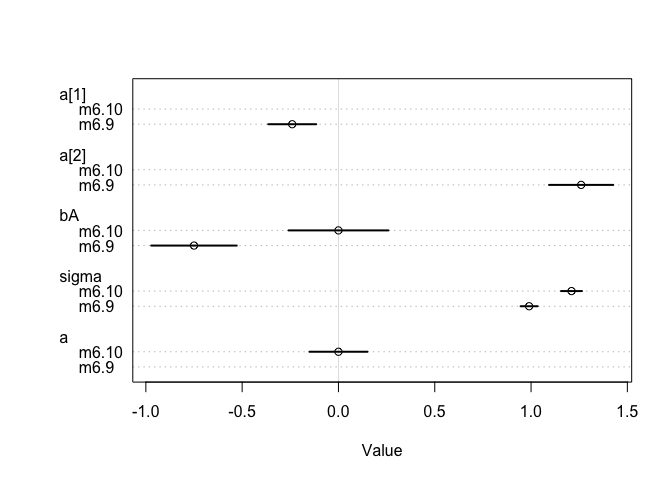
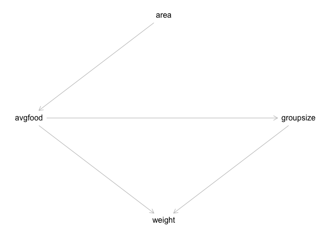
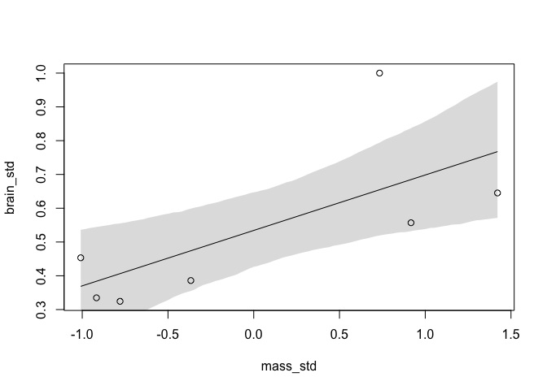
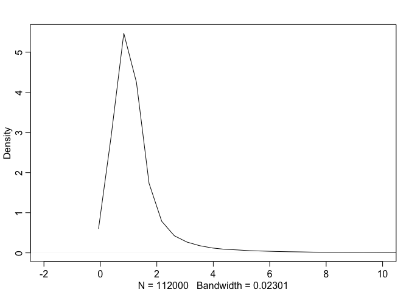
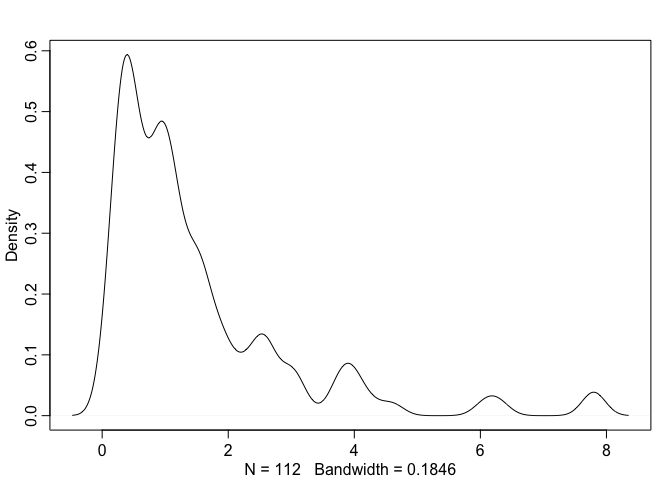
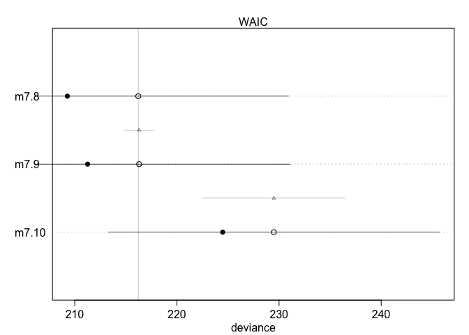
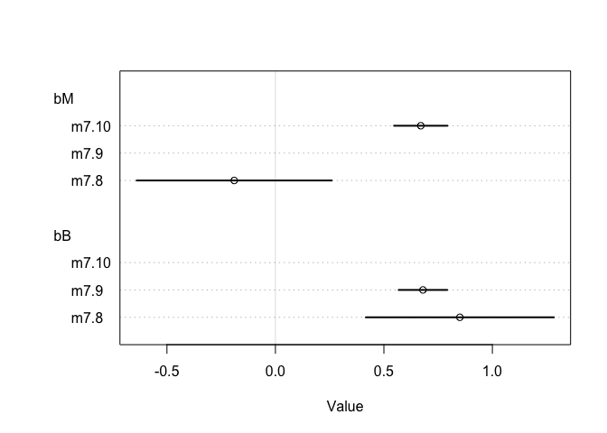
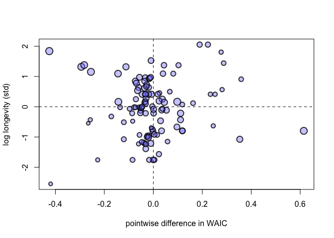

``` {.r}
library(tidyverse)
```

    ## ── Attaching packages ───────────────────────────────────── tidyverse 1.2.1 ──

    ## ✔ ggplot2 3.1.1       ✔ purrr   0.3.2  
    ## ✔ tibble  2.1.1       ✔ dplyr   0.8.0.1
    ## ✔ tidyr   0.8.3       ✔ stringr 1.4.0  
    ## ✔ readr   1.3.1       ✔ forcats 0.4.0

    ## ── Conflicts ──────────────────────────────────────── tidyverse_conflicts() ──
    ## ✖ dplyr::filter() masks stats::filter()
    ## ✖ dplyr::lag()    masks stats::lag()

``` {.r}
library(rethinking)
```

    ## Loading required package: rstan

    ## Loading required package: StanHeaders

    ## rstan (Version 2.18.2, GitRev: 2e1f913d3ca3)

    ## For execution on a local, multicore CPU with excess RAM we recommend calling
    ## options(mc.cores = parallel::detectCores()).
    ## To avoid recompilation of unchanged Stan programs, we recommend calling
    ## rstan_options(auto_write = TRUE)

    ## 
    ## Attaching package: 'rstan'

    ## The following object is masked from 'package:tidyr':
    ## 
    ##     extract

    ## Loading required package: parallel

    ## rethinking (Version 1.88)

    ## 
    ## Attaching package: 'rethinking'

    ## The following object is masked from 'package:purrr':
    ## 
    ##     map

Problems
--------

### 6E1.

*State the three motivating criteria that define information entropy.
Try to express each in your own words.*

Entropy is a measure of uncertainity. We want any measure of
uncertainity to be:

-   Continuous, so that changes in parameters or distributions do not
    cause unessecarily large changes in our measure.
-   Increase as the number of possible outcomes increases. If more
    things can happen, then there is less certainity about what will
    happen.
-   Need to be additive, so that we can combine multiple events.

### 6E2.

*Suppose a coin is weighted such that, when it is tossed and lands on a
table, it comes up heads 70% of the time. What is the entropy of this
coin?*

``` {.r}
p <- c(.7, .3)
-sum(p*log(p))
```

    ## [1] 0.6108643

### 6E3.

*Suppose a four-sided die is loaded such that, when tossed onto a table,
it shows "1" 20%, "2" 25%, "3" 25%, and "4" 30% of the time. What is the
entropy of this die?*

``` {.r}
p <- c(.2, .25, .25, .3)
sum(p)
```

    ## [1] 1

``` {.r}
-sum(p*log(p))
```

    ## [1] 1.376227

### 6E4.

*Suppose another four-sided die is loaded such that it never shows "4".
The other three sides show equally often. What is the entropy of this
die?*

``` {.r}
p <- c(1/3, 1/3, 1/3)
sum(p)
```

    ## [1] 1

``` {.r}
-sum(p*log(p))
```

    ## [1] 1.098612

### 6M1.

*Write down and compare the definitions of AIC, DIC, and WAIC. Which of
these criteria is most general? Which assumptions are required to
transform a more general criterion into a less general one?*

These are all ways of approximating out-of-sample deviance.\
**AIC**


 Assumes: \* Flat priors (or priors overwhelmed by observations) \*
Observations \>\> parameters \* Gaussian posterior

**DIC** DIC not really discussed in this version of the book, however:

Assumes: \* Observations \>\> parameters \* Gaussian posterior

**WAIC**


)
")

 Assumes: \* ?? Observations \>\> parameters ??

### 6M2.

*Explain the difference between model selection and model averaging.
What information is lost under model selection? What information is lost
under model averaging?*

model selection: pick the best model by some criteria. model averaging:
average across multiple models, weighted by some criteria.

in selection, we lose information from what is still a well-supported
model and thus are ignoring some uncertainity.

in averaging we may lose out ability to make the best possible
predictions?

### 6M3.

*When comparing models with an information criterion, why must all
models be fit to exactly the same observations? What would happen to the
information criterion values, if the models were fit to different
numbers of observations? Perform some experiments, if you are not sure.*

Because we are summing log probabilities across observations, more
observations (with the same model) will always lead to higher deviance /
lower lppd.

### 6M4.

*What happens to the effective number of parameters, as measured by DIC
or WAIC, as a prior becomes more concentrated? Why? Perform some
experiments, if you are not sure.*

The effective number of paramters will decrease

### 6M5.

*Provide an informal explanation of why informative priors reduce
overfitting.*

informative priors require more evidence to push a coefficient away from
zero.

### 6M6.

*Provide an information explanation of why overly informative priors
result in underfitting*

If too informative, the priors can overwhelm the evidence and force
coefficients to remain near 0

### 1: Birbs

``` {.r}
birbs <- tibble(
  Birb=LETTERS[1:5],
  Island1=rep(0.2,5),
  Island2=c(.8,.1,.05,.025,.025),
  Island3=c(0.05,0.15,0.7,0.05,0.05))
birbs
```

    ## # A tibble: 5 x 4
    ##   Birb  Island1 Island2 Island3
    ##   <chr>   <dbl>   <dbl>   <dbl>
    ## 1 A         0.2   0.8      0.05
    ## 2 B         0.2   0.1      0.15
    ## 3 C         0.2   0.05     0.7 
    ## 4 D         0.2   0.025    0.05
    ## 5 E         0.2   0.025    0.05

``` {.r}
entropy <- function(x) {
  -sum(x*log(x))
}
(island_entropies <- apply(birbs[,-1],2,entropy))
```

    ##   Island1   Island2   Island3 
    ## 1.6094379 0.7430039 0.9836003

There is the highest entropy, that is the highest uncertainity about
which birb you might see, on Island 1

``` {.r}
KLdivergence <- function(pname,qname, data=birbs) {
  print(cat("pname",pname))
  p=get(pname, data)
  q=get(qname, data)
  -sum(p*log(p/q))  # where p is the true distribution and q is what we are using to predict
}

Islands <- colnames(birbs)[-1]

results.frame <- expand.grid(predictor_q=Islands,
                             predictee_p=Islands,stringsAsFactors = FALSE) %>% as_tibble()

results.frame <- results.frame %>%
  mutate(KLdiv = map2_dbl(predictee_p, predictor_q, ~ KLdivergence(.x, .y)))
```

    ## pname Island1NULL
    ## pname Island1NULL
    ## pname Island1NULL
    ## pname Island2NULL
    ## pname Island2NULL
    ## pname Island2NULL
    ## pname Island3NULL
    ## pname Island3NULL
    ## pname Island3NULL

``` {.r}
results.frame %>% filter(KLdiv!=0) %>% arrange(predictee_p, desc(KLdiv))
```

    ## # A tibble: 6 x 3
    ##   predictor_q predictee_p  KLdiv
    ##   <chr>       <chr>        <dbl>
    ## 1 Island3     Island1     -0.639
    ## 2 Island2     Island1     -0.970
    ## 3 Island1     Island2     -0.866
    ## 4 Island3     Island2     -2.01 
    ## 5 Island1     Island3     -0.626
    ## 6 Island2     Island3     -1.84

For each case, the island with the higher entropy is the better
predictor, because it is less likely to be surprised

### 2

*Recall the marriage, age, and happiness collider bias example from
Chapter 6. Run models m6.9 and m6.10 again. Compare these two models
using WAIC (or LOO, they will produce identical results). Which model is
expected to make better predictions? Which model provides the correct
causal inference about the influence of age on happiness? Can you
explain why the answers to these two questions disagree?*

``` {.r}
## R code 6.22
library(rethinking)
d <- sim_happiness( seed=1977 , N_years=1000 )
precis(d)
```

    ##                    mean        sd      5.5%     94.5%     histogram
    ## age        3.300000e+01 18.768883  4.000000 62.000000 ▇▇▇▇▇▇▇▇▇▇▇▇▇
    ## married    3.007692e-01  0.458769  0.000000  1.000000    ▇▁▁▁▁▁▁▁▁▃
    ## happiness -1.000070e-16  1.214421 -1.789474  1.789474      ▇▅▇▅▅▇▅▇

``` {.r}
## R code 6.23
d2 <- d[ d$age>17 , ] # only adults
d2$A <- ( d2$age - 18 ) / ( 65 - 18 )
```

``` {.r}
## R code 6.24
d2$mid <- d2$married + 1
m6.9 <- quap(
    alist(
        happiness ~ dnorm( mu , sigma ),
        mu <- a[mid] + bA*A,
        a[mid] ~ dnorm( 0 , 1 ),
        bA ~ dnorm( 0 , 2 ),
        sigma ~ dexp(1)
    ) , data=d2 )
precis(m6.9,depth=2)
```

    ##             mean         sd       5.5%      94.5%
    ## a[1]  -0.2350877 0.06348986 -0.3365568 -0.1336186
    ## a[2]   1.2585517 0.08495989  1.1227694  1.3943340
    ## bA    -0.7490274 0.11320112 -0.9299447 -0.5681102
    ## sigma  0.9897080 0.02255800  0.9536559  1.0257600

``` {.r}
## R code 6.25
m6.10 <- quap(
    alist(
        happiness ~ dnorm( mu , sigma ),
        mu <- a + bA*A,
        a ~ dnorm( 0 , 1 ),
        bA ~ dnorm( 0 , 2 ),
        sigma ~ dexp(1)
    ) , data=d2 )
precis(m6.10)
```

    ##                mean         sd       5.5%     94.5%
    ## a      1.649248e-07 0.07675015 -0.1226614 0.1226617
    ## bA    -2.728620e-07 0.13225976 -0.2113769 0.2113764
    ## sigma  1.213188e+00 0.02766080  1.1689803 1.2573949

``` {.r}
plot(coeftab(m6.9, m6.10))
```

<!-- -->

``` {.r}
compare(m6.9, m6.10)
```

    ##           WAIC    pWAIC    dWAIC       weight       SE      dSE
    ## m6.9  2713.971 3.738532   0.0000 1.000000e+00 37.54465       NA
    ## m6.10 3101.906 2.340445 387.9347 5.768312e-85 27.74379 35.40032

model 6.9 is best by WAIC. This is because the generative model has
marriage as a collider, so marriage relates happiness to age.

### 3

*Reconsider the urban fox analysis from last week's homework. Use WAIC
or LOO based model comparison on five different models, each using
weight as the outcome, and containing these sets of predictor
variables:* (1) avgfood + groupsize + area (2) avgfood + groupsize (3)
groupsize + area (4) avgfood (5) area *Can you explain the relative
differences in WAIC scores, using the fox DAG from last week's homework?
Be sure to pay attention to the standard error of the score differences
(dSE).*

``` {.r}
library(dagitty)
foxdag <- dagitty("dag {
area -> avgfood
avgfood -> groupsize
avgfood -> weight
groupsize -> weight
}")

coordinates(foxdag) <- list(
  x=c(area=1, avgfood=0, groupsize=2, weight=1),
  y=c(area=0, avgfood=1, groupsize=1, weight=2))

plot(foxdag)
```

<!-- -->

``` {.r}
data("foxes")
head(foxes)
```

    ##   group avgfood groupsize area weight
    ## 1     1    0.37         2 1.09   5.02
    ## 2     1    0.37         2 1.09   2.84
    ## 3     2    0.53         2 2.05   5.33
    ## 4     2    0.53         2 2.05   6.07
    ## 5     3    0.49         2 2.12   5.85
    ## 6     3    0.49         2 2.12   3.25

``` {.r}
foxes2 <- foxes %>%
  mutate_at(vars(-group), scale)
head(foxes2)
```

    ##   group   avgfood groupsize      area     weight
    ## 1     1 -1.924829 -1.524089 -2.239596  0.4141347
    ## 2     1 -1.924829 -1.524089 -2.239596 -1.4270464
    ## 3     2 -1.118035 -1.524089 -1.205508  0.6759540
    ## 4     2 -1.118035 -1.524089 -1.205508  1.3009421
    ## 5     3 -1.319734 -1.524089 -1.130106  1.1151348
    ## 6     3 -1.319734 -1.524089 -1.130106 -1.0807692

models

``` {.r}
m1 <- quap(alist(
  weight ~ dnorm(mu, sigma),
  mu <- alpha + bF*avgfood + bG*groupsize + bA*area,
  alpha ~ dnorm(0,.2),
  bF ~ dnorm(0,.5),
  bG ~ dnorm(0,.5),
  bA ~ dnorm(0,.5),
  sigma ~ dexp(1)),
  data=foxes2)

m2 <- quap(alist(
  weight ~ dnorm(mu, sigma),
  mu <- alpha + bF*avgfood + bG*groupsize,
  alpha ~ dnorm(0,.2),
  bF ~ dnorm(0,.5),
  bG ~ dnorm(0,.5),
  sigma ~ dexp(1)),
  data=foxes2)

m3 <- quap(alist(
  weight ~ dnorm(mu, sigma),
  mu <- alpha + bG*groupsize + bA*area,
  alpha ~ dnorm(0,.2),
  bG ~ dnorm(0,.5),
  bA ~ dnorm(0,.5),
  sigma ~ dexp(1)),
  data=foxes2)

m4 <- quap(alist(
  weight ~ dnorm(mu, sigma),
  mu <- alpha + bF*avgfood,
  alpha ~ dnorm(0,.2),
  bF ~ dnorm(0,.5),
  sigma ~ dexp(1)),
  data=foxes2)

m5 <- quap(alist(
  weight ~ dnorm(mu, sigma),
  mu <- alpha + bA*area,
  alpha ~ dnorm(0,.2),
  bA ~ dnorm(0,.5),
  sigma ~ dexp(1)),
  data=foxes2)
```

``` {.r}
compare(m1, m2, m3, m4, m5)
```

    ##        WAIC    pWAIC     dWAIC      weight       SE      dSE
    ## m1 322.8847 4.656959  0.000000 0.465363694 16.27783       NA
    ## m3 323.8985 3.718565  1.013749 0.280323674 15.68240 2.899417
    ## m2 324.1284 3.859897  1.243666 0.249881396 16.13964 3.598475
    ## m4 333.4444 2.426279 10.559695 0.002370193 13.78855 7.193396
    ## m5 333.7239 2.650636 10.839215 0.002061043 13.79447 7.242069

m1,2,3 are equivalent by weight. Arguallably all the models are the
same.

I can't really explain this. I would have that that 2 would be better
than 1, for example since 2 is simple and area doesn't have a direct
impact on weight...

Code from Book
--------------

``` {.r}
## R code 7.1
sppnames <- c( "afarensis","africanus","habilis","boisei",
               "rudolfensis","ergaster","sapiens")
brainvolcc <- c( 438 , 452 , 612, 521, 752, 871, 1350 )
masskg <- c( 37.0 , 35.5 , 34.5 , 41.5 , 55.5 , 61.0 , 53.5 )
d <- data.frame( species=sppnames , brain=brainvolcc , mass=masskg )
```

``` {.r}
## R code 7.2
d$mass_std <- (d$mass - mean(d$mass))/sd(d$mass)
d$brain_std <- d$brain / max(d$brain)
```

``` {.r}
## R code 7.3
m7.1 <- quap(
  alist(
    brain_std ~ dnorm( mu , exp(log_sigma) ),
    mu <- a + b*mass_std,
    a ~ dnorm( 0.5 , 1 ),
    b ~ dnorm( 0 , 10 ),
    log_sigma ~ dnorm( 0 , 1 )
  ), data=d )

## R code 7.4
set.seed(12)
s <- sim( m7.1 )
r <- apply(s,2,mean) - d$brain_std
resid_var <- var2(r)
outcome_var <- var2( d$brain_std )
1 - resid_var/outcome_var
```

    ## [1] 0.4774589

``` {.r}
## R code 7.5
R2_is_bad <- function( quap_fit ) {
  s <- sim( quap_fit , refresh=0 )
  r <- apply(s,2,mean) - d$brain_std
  1 - var2(r)/var2(d$brain_std)
}

## R code 7.6
m7.2 <- quap(
  alist(
    brain_std ~ dnorm( mu , exp(log_sigma) ),
    mu <- a + b[1]*mass_std + b[2]*mass_std^2,
    a ~ dnorm( 0.5 , 1 ),
    b ~ dnorm( 0 , 10 ),
    log_sigma ~ dnorm( 0 , 1 )
  ), data=d , start=list(b=rep(0,2)) )

## R code 7.7
m7.3 <- quap(
  alist(
    brain_std ~ dnorm( mu , exp(log_sigma) ),
    mu <- a + b[1]*mass_std + b[2]*mass_std^2 +
      b[3]*mass_std^3,
    a ~ dnorm( 0.5 , 1 ),
    b ~ dnorm( 0 , 10 ),
    log_sigma ~ dnorm( 0 , 1 )
  ), data=d , start=list(b=rep(0,3)) )

m7.4 <- quap(
  alist(
    brain_std ~ dnorm( mu , exp(log_sigma) ),
    mu <- a + b[1]*mass_std + b[2]*mass_std^2 +
      b[3]*mass_std^3 + b[4]*mass_std^4,
    a ~ dnorm( 0.5 , 1 ),
    b ~ dnorm( 0 , 10 ),
    log_sigma ~ dnorm( 0 , 1 )
  ), data=d , start=list(b=rep(0,4)) )

m7.5 <- quap(
  alist(
    brain_std ~ dnorm( mu , exp(log_sigma) ),
    mu <- a + b[1]*mass_std + b[2]*mass_std^2 +
      b[3]*mass_std^3 + b[4]*mass_std^4 +
      b[5]*mass_std^5,
    a ~ dnorm( 0.5 , 1 ),
    b ~ dnorm( 0 , 10 ),
    log_sigma ~ dnorm( 0 , 1 )
  ), data=d , start=list(b=rep(0,5)) )

## R code 7.8
m7.6 <- quap(
  alist(
    brain_std ~ dnorm( mu , 0.001 ),
    mu <- a + b[1]*mass_std + b[2]*mass_std^2 +
      b[3]*mass_std^3 + b[4]*mass_std^4 +
      b[5]*mass_std^5 + b[6]*mass_std^6,
    a ~ dnorm( 0.5 , 1 ),
    b ~ dnorm( 0 , 10 )
  ), data=d , start=list(b=rep(0,6)) )
```

``` {.r}
## R code 7.9
post <- extract.samples(m7.1)
mass_seq <- seq( from=min(d$mass_std) , to=max(d$mass_std) , length.out=100 )
l <- link( m7.1 , data=list( mass_std=mass_seq ) )
mu <- apply( l , 2 , mean )
ci <- apply( l , 2 , PI )
plot( brain_std ~ mass_std , data=d )
lines( mass_seq , mu )
shade( ci , mass_seq )
```

<!-- -->

``` {.r}
## R code 7.10
m7.1_OLS <- lm( brain_std ~ mass_std , data=d )
post <- extract.samples( m7.1_OLS )
```

``` {.r}
## R code 7.11
m7.7 <- quap(
  alist(
    brain_std ~ dnorm( mu , exp(log_sigma) ),
    mu <- a,
    a ~ dnorm( 0.5 , 1 ),
    log_sigma ~ dnorm( 0 , 1 )
  ), data=d )

## R code 7.12
#d_minus_i <- d[ -i , ]

## R code 7.13
p <- c( 0.3 , 0.7 )
-sum( p*log(p) )
```

    ## [1] 0.6108643

``` {.r}
## R code 7.14
set.seed(1)
lppd( m7.1 , n=1e4 )
```

    ## [1]  0.6098662  0.6483431  0.5496084  0.6234929  0.4648139  0.4347599
    ## [7] -0.8444621

``` {.r}
## R code 7.15
set.seed(1)
logprob <- sim( m7.1 , ll=TRUE , n=1e4 )
head(logprob)
```

    ##           [,1]      [,2]      [,3]      [,4]      [,5]      [,6]
    ## [1,] 0.5633620 0.7001151 0.9653876 0.6593738 0.8085213 0.9116704
    ## [2,] 0.4205889 0.5069908 0.7337391 0.5147644 0.6675693 0.7243332
    ## [3,] 0.8334092 0.9220774 0.9443591 0.9265666 1.0305145 1.0078584
    ## [4,] 0.3185748 0.3183588 0.2070552 0.3170005 0.2727475 0.2083451
    ## [5,] 0.3130858 0.4259730 0.6880972 0.3463322 0.3634269 0.4484065
    ## [6,] 0.8519016 0.9494452 0.8960925 0.8858418 0.9091610 0.9761487
    ##            [,7]
    ## [1,] -2.1369468
    ## [2,] -1.3346455
    ## [3,] -3.9686313
    ## [4,] -1.4528380
    ## [5,] -0.4730215
    ## [6,] -2.8414672

``` {.r}
head(logprob) %>% exp()
```

    ##          [,1]     [,2]     [,3]     [,4]     [,5]     [,6]       [,7]
    ## [1,] 1.756568 2.013984 2.625805 1.933581 2.244587 2.488476 0.11801461
    ## [2,] 1.522858 1.660288 2.082854 1.673244 1.949493 2.063355 0.26325147
    ## [3,] 2.301150 2.514509 2.571165 2.525822 2.802507 2.739727 0.01889928
    ## [4,] 1.375166 1.374869 1.230050 1.373003 1.313569 1.231638 0.23390551
    ## [5,] 1.367639 1.531079 1.989926 1.413872 1.438250 1.565815 0.62311667
    ## [6,] 2.344100 2.584276 2.450011 2.425025 2.482239 2.654214 0.05834001

``` {.r}
dim(logprob)
```

    ## [1] 10000     7

``` {.r}
n <- ncol(logprob)
ns <- nrow(logprob)
f <- function( i ) log_sum_exp( logprob[,i] ) - log(ns)
( lppd <- sapply( 1:n , f ) )
```

    ## [1]  0.6098662  0.6483431  0.5496084  0.6234929  0.4648139  0.4347599
    ## [7] -0.8444621

``` {.r}
## R code 7.16
set.seed(1)
sapply( list(m7.1,m7.2,m7.3,m7.4,m7.5,m7.6) , function(m) sum(lppd(m)) )
```

    ## [1]  2.490387  2.566165  3.707343  5.333750 14.090061 39.445390

``` {.r}
## R code 7.17
N <- 20
kseq <- 1:5
dev <- sapply( kseq , function(k) {
  print(k);
  r <- replicate( 1e4 , sim_train_test( N=N, k=k ) );
  c( mean(r[1,]) , mean(r[2,]) , sd(r[1,]) , sd(r[2,]) )
} )
```

``` {.r}
## R code 7.18
r <- mcreplicate( 1e4 , sim_train_test( N=N, k=k ) , mc.cores=4 )
```

``` {.r}
## R code 7.19
plot( 1:5 , dev[1,] , ylim=c( min(dev[1:2,])-5 , max(dev[1:2,])+10 ) ,
      xlim=c(1,5.1) , xlab="number of parameters" , ylab="deviance" ,
      pch=16 , col=rangi2 )
mtext( concat( "N = ",N ) )
points( (1:5)+0.1 , dev[2,] )
for ( i in kseq ) {
  pts_in <- dev[1,i] + c(-1,+1)*dev[3,i]
  pts_out <- dev[2,i] + c(-1,+1)*dev[4,i]
  lines( c(i,i) , pts_in , col=rangi2 )
  lines( c(i,i)+0.1 , pts_out )
}
```

Generate a model with which to compute WAIC. Fit it and extract
posterior

``` {.r}
## R code 7.20
data(cars)
m <- quap(
  alist(
    dist ~ dnorm(mu,sigma),
    mu <- a + b*speed,
    a ~ dnorm(0,100),
    b ~ dnorm(0,10),
    sigma ~ dexp(1)
  ) , data=cars )
set.seed(94)
post <- extract.samples(m,n=1000)
head(post)
```

    ##           a        b    sigma
    ## 1 -10.70238 3.533277 14.74971
    ## 2 -15.42891 3.777044 14.03914
    ## 3 -26.28809 4.525730 11.73609
    ## 4 -10.09926 3.445379 13.57401
    ## 5 -24.64794 4.230611 12.72349
    ## 6 -18.25281 4.110063 13.19583

now we compute the log probability of each observation, across the
posterior

``` {.r}
## R code 7.21
n_samples <- 1000
logprob <- sapply( 1:n_samples ,
                   function(s) {
                     mu <- post$a[s] + post$b[s]*cars$speed
                     dnorm( cars$dist , mu , post$sigma[s] , log=TRUE )
                   } )
dim(cars)
```

    ## [1] 50  2

``` {.r}
dim(logprob)
```

    ## [1]   50 1000

``` {.r}
logprob[1:10,1:10]
```

    ##            [,1]      [,2]      [,3]      [,4]      [,5]      [,6]
    ##  [1,] -3.614866 -3.574450 -3.758189 -3.534775 -3.754522 -3.540577
    ##  [2,] -3.709345 -3.831003 -4.582095 -3.635408 -4.432797 -3.899507
    ##  [3,] -3.841397 -3.685461 -3.388641 -3.799460 -3.465273 -3.620816
    ##  [4,] -3.756130 -3.867162 -4.382890 -3.699971 -4.358524 -3.877421
    ##  [5,] -3.615782 -3.564518 -3.515900 -3.532910 -3.605333 -3.504247
    ##  [6,] -3.893186 -3.746864 -3.453282 -3.850046 -3.498673 -3.718068
    ##  [7,] -3.711199 -3.608604 -3.385017 -3.636673 -3.462749 -3.566322
    ##  [8,] -3.614473 -3.594741 -3.561052 -3.534443 -3.677311 -3.527371
    ##  [9,] -3.811927 -3.905591 -4.201745 -3.779560 -4.287209 -3.855961
    ## [10,] -3.896591 -3.771720 -3.534742 -3.843611 -3.536206 -3.783568
    ##            [,7]      [,8]      [,9]     [,10]
    ##  [1,] -3.606053 -3.367068 -3.609798 -4.164539
    ##  [2,] -4.020669 -3.602733 -3.706283 -5.131214
    ##  [3,] -3.585640 -3.682045 -3.829585 -3.466798
    ##  [4,] -4.002828 -3.657758 -3.760106 -4.772889
    ##  [5,] -3.551112 -3.370000 -3.609208 -3.738173
    ##  [6,] -3.654632 -3.786579 -3.875190 -3.453690
    ##  [7,] -3.548430 -3.515488 -3.696225 -3.458762
    ##  [8,] -3.592056 -3.377829 -3.612255 -3.754733
    ##  [9,] -3.985313 -3.718550 -3.825377 -4.457407
    ## [10,] -3.702290 -3.820037 -3.872845 -3.500169

This is 50 X 1000. 50 because there are 50 observations in the data set,
and 1000 becuase there are 1000 posterior samples. So each cell is the
log probability of that observation for that draw of the posterior

Now, for each sample, we want the average log probability. To this we
want to sum the probabilities across the posterior samples and then
average. For this, we exponentiate, sum, and then take the log again.
Finally we subtract by the log of the number of samples, which is the
same as dividing by the number of samples.

``` {.r}
## R code 7.22
n_cases <- nrow(cars)
lppd <- sapply( 1:n_cases , function(i) log_sum_exp(logprob[i,]) - log(n_samples) )
lppd
```

    ##  [1] -3.600189 -3.916966 -3.641180 -3.926332 -3.549904 -3.702826 -3.569165
    ##  [8] -3.578237 -3.938716 -3.736602 -3.540342 -4.199923 -3.782043 -3.611949
    ## [15] -3.530524 -3.681293 -3.521370 -3.521370 -3.953283 -3.889172 -3.525633
    ## [22] -4.919229 -8.275993 -4.785927 -4.181762 -3.963783 -4.016473 -3.598928
    ## [29] -4.347313 -3.760050 -3.521005 -3.870145 -3.543283 -4.954458 -6.092207
    ## [36] -4.744160 -3.866024 -3.853984 -5.786988 -3.994194 -3.751726 -3.596174
    ## [43] -3.550559 -3.556427 -4.481208 -3.665060 -4.163997 -4.247070 -8.273122
    ## [50] -3.600384

``` {.r}
sum(lppd)
```

    ## [1] -206.8787

now this is the average log probablility of each observation

``` {.r}
## R code 7.23
pWAIC <- sapply( 1:n_cases , function(i) var(logprob[i,]) )
pWAIC
```

    ##  [1] 0.021807469 0.102595906 0.021675045 0.065103316 0.010182235
    ##  [6] 0.022023642 0.010210238 0.011422418 0.038623418 0.017904889
    ## [11] 0.008809054 0.044313302 0.017392475 0.010415662 0.008028940
    ## [16] 0.011536682 0.007928842 0.007928842 0.023293655 0.017380105
    ## [21] 0.007853548 0.096148360 0.961578867 0.081381218 0.030637431
    ## [26] 0.019603600 0.021805683 0.008620565 0.044587659 0.012852288
    ## [31] 0.007902755 0.018953339 0.008483631 0.110013693 0.304047618
    ## [36] 0.101740258 0.021977821 0.022010782 0.311479474 0.035733682
    ## [41] 0.018915037 0.010697314 0.009223716 0.009718307 0.141402847
    ## [46] 0.024431421 0.106889888 0.122141297 1.612336788 0.018988397

``` {.r}
sum(pWAIC)
```

    ## [1] 4.780733

For each sample, the variance in its probability across the posterior
samples.

WAIC:

``` {.r}
## R code 7.24
-2*( sum(lppd) - sum(pWAIC) )
```

    ## [1] 423.3188

Compare to WAIC

``` {.r}
WAIC(m)
```

    ## [1] 422.1024
    ## attr(,"lppd")
    ## [1] -206.8781
    ## attr(,"pWAIC")
    ## [1] 4.173077
    ## attr(,"se")
    ## [1] 16.9881

``` {.r}
## R code 7.25
waic_vec <- -2*( lppd - pWAIC )
sqrt( n_cases*var(waic_vec) )
```

    ## [1] 17.81797

``` {.r}
## R code 7.33
data(Primates301)
d <- Primates301
```

``` {.r}
## R code 7.34
d$log_L <- scale( log(d$longevity) )
d$log_B <- scale( log(d$brain) )
d$log_M <- scale( log(d$body) )
```

``` {.r}
## R code 7.35
sapply( d[,c("log_L","log_B","log_M")] , function(x) sum(is.na(x)) )
```

    ## log_L log_B log_M 
    ##   181   117    63

``` {.r}
## R code 7.36
d2 <- d[ complete.cases( d$log_L , d$log_M , d$log_B ) , ]
nrow(d2)
```

    ## [1] 112

``` {.r}
## R code 7.37
m7.8 <- quap(
    alist(
        log_L ~ dnorm( mu , sigma ),
        mu <- a + bM*log_M + bB*log_B,
        a ~ dnorm(0,0.1),
        bM ~ dnorm(0,0.5),
        bB ~ dnorm(0,0.5),
        sigma ~ dexp(1)
    ) , data=d2 )
```

``` {.r}
prior <- extract.prior(m7.8)
mu.prior <- link(m7.8, post=prior)
dens(exp(mu.prior),xlim=c(-2,10))
```

<!-- -->

``` {.r}
dens(exp(d2$log_L))
```

<!-- -->

``` {.r}
## R code 7.38
m7.9 <- quap(
    alist(
        log_L ~ dnorm( mu , sigma ),
        mu <- a + bB*log_B,
        a ~ dnorm(0,0.1),
        bB ~ dnorm(0,0.5),
        sigma ~ dexp(1)
    ) , data=d2 )
m7.10 <- quap(
    alist(
        log_L ~ dnorm( mu , sigma ),
        mu <- a + bM*log_M,
        a ~ dnorm(0,0.1),
        bM ~ dnorm(0,0.5),
        sigma ~ dexp(1)
    ) , data=d2 )
```

``` {.r}
## R code 7.39
set.seed(301)
compare( m7.8 , m7.9 , m7.10 )
```

    ##           WAIC    pWAIC      dWAIC       weight       SE      dSE
    ## m7.8  216.2302 3.472769  0.0000000 0.5329982525 14.72038       NA
    ## m7.9  216.4977 2.603017  0.2675287 0.4662648452 14.83677 1.502882
    ## m7.10 229.3979 2.465381 13.1676363 0.0007369023 16.30284 7.001935

``` {.r}
## R code 7.40
plot( compare( m7.8 , m7.9 , m7.10 ) )
```

<!-- -->

``` {.r}
## R code 7.41
plot( coeftab( m7.8 , m7.9 , m7.10 ) , pars=c("bM","bB") )
```

<!-- -->

``` {.r}
## R code 7.42
cor( d2$log_B , d2$log_M )
```

    ##           [,1]
    ## [1,] 0.9796272

``` {.r}
## R code 7.43
waic_m7.8 <- WAIC( m7.8 , pointwise=TRUE )
waic_m7.9 <- WAIC( m7.9 , pointwise=TRUE )
```

``` {.r}
## R code 7.44
# compute point scaling
x <- d2$log_B - d2$log_M
x <- x - min(x)
x <- x / max(x)

# draw the plot
plot( waic_m7.8 - waic_m7.9 , d2$log_L ,
    xlab="pointwise difference in WAIC" , ylab="log longevity (std)" , pch=21 ,
    col=col.alpha("black",0.8) , cex=1+x , lwd=2 , bg=col.alpha(rangi2,0.4) )
abline( v=0 , lty=2 )
abline( h=0 , lty=2 )
```

<!-- -->

``` {.r}
## R code 7.45
m7.11 <- quap(
    alist(
        log_B ~ dnorm( mu , sigma ),
        mu <- a + bM*log_M + bL*log_L,
        a ~ dnorm(0,0.1),
        bM ~ dnorm(0,0.5),
        bL ~ dnorm(0,0.5),
        sigma ~ dexp(1)
    ) , data=d2 )
precis( m7.11 )
```

    ##              mean         sd        5.5%       94.5%
    ## a     -0.04506873 0.01795371 -0.07376224 -0.01637523
    ## bM     0.93842037 0.02602549  0.89682661  0.98001413
    ## bL     0.11549564 0.02723920  0.07196215  0.15902914
    ## sigma  0.18997589 0.01267748  0.16971483  0.21023695

``` {.r}
## R code 7.46
library(rethinking)
data(Howell1)
d <- Howell1
d$age <- (d$age - mean(d$age))/sd(d$age)
set.seed( 1000 )
i <- sample(1:nrow(d),size=nrow(d)/2)
d1 <- d[ i , ]
d2 <- d[ -i , ]
```

``` {.r}
## R code 7.47
sum( dnorm( d2$height , mu , sigma , log=TRUE ) )
```
