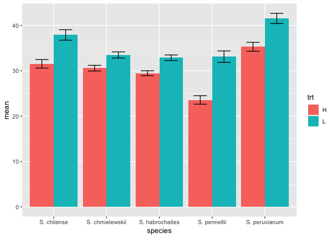
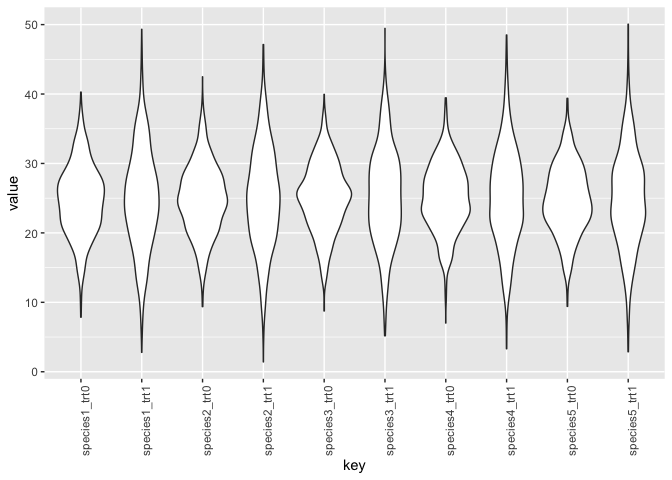

## 7E1
_For each of the causal relationships below, name a hypothetical third variable that would lead to an interaction effect._

_(1) Bread dough rises because of yeast_
Temperature

_(2) Education leads to higher income._
Job? Race? Gender?

_(3) Gasoline makes a car go._
Key? Spark?

## 7M3

_In parts of North America, ravens depend upon wolves for their food. This is because ravens are carnivorous but cannot usually kill or open carcasses of prey. Wolves however can and do kill and tear open animals, and they tolerate ravens co-feeding at their kills. This species relationship is generally described as a “species interaction.” Can you invent a hypothetical set of data on raven population size in which this relationship would manifest as a statistical interaction? Do you think the biological interaction could be linear? Why or why not?_

Ravens ~ Wolves + Prey + Wolves:Prey

## 7H3

_Use the tomato.csv (attached) data set and evaluate whether hypocotyl length ("hyp") is affected by shade ("trt"), species ("species") and their interaction._


```r
d <- read_csv("Tomato.csv") %>%
  select(hyp, trt, species) %>%
  na.omit()
```

```
## Parsed with column specification:
## cols(
##   .default = col_double(),
##   shelf = col_character(),
##   col = col_character(),
##   acs = col_character(),
##   trt = col_character(),
##   date = col_character(),
##   species = col_character(),
##   who = col_character()
## )
```

```
## See spec(...) for full column specifications.
```

```r
d
```

```
## # A tibble: 1,008 x 3
##      hyp trt   species        
##    <dbl> <chr> <chr>          
##  1  19.5 H     S. pennellii   
##  2  31.3 H     S. peruvianum  
##  3  56.6 H     S. peruvianum  
##  4  35.2 H     S. chilense    
##  5  35.3 H     S. chilense    
##  6  28.7 H     S. chmielewskii
##  7  33.1 H     S. habrochaites
##  8  42.1 H     S. pennellii   
##  9  32.7 H     S. peruvianum  
## 10  34.3 H     S. peruvianum  
## # … with 998 more rows
```

Make a plot

```r
d %>%
  group_by(species,trt) %>%
  summarize(mean=mean(hyp), 
            sem=sd(hyp)/sqrt(n()), 
            ymax=mean+sem,
            ymin=mean-sem) %>%
  ggplot(aes(x=species, y=mean, ymax=ymax, ymin=ymin, fill=trt)) +
  geom_col(position = "dodge") +
  geom_errorbar(position = position_dodge(width=.9), width=.5)
```

<!-- -->

make indices for the factors:

```r
d <- d %>%
  mutate(species_i = as.numeric(as.factor(species)),
         trt_i = as.numeric(as.factor(trt))-1)
```


fit non interaction model

```r
m1 <- quap(flist = alist(
  hyp ~ dnorm(mu, sigma),
  mu <- a[species_i] + b*trt_i, # one beta coefficient
  a[species_i] ~ dnorm(25, 5),
  b ~ dnorm(0, 5),
  sigma ~ dexp(1)),
  data=d, start=list(b=0, sigma=3))
```

check the priors

```r
prior <- extract.prior(m1)
str(prior)
```

```
## List of 3
##  $ b    : num [1:1000(1d)] 3.11 8.91 4.98 -7.2 -3.52 ...
##  $ sigma: num [1:1000(1d)] 0.0845 3.468 0.3797 0.8922 1.8651 ...
##  $ a    : num [1:1000, 1:5] 26.6 27.2 28.1 26.7 22 ...
##  - attr(*, "source")= chr "quap prior: 1000 samples from m1"
```

```r
d2 <- expand.grid(species_i=1:5, trt_i=0:1)
prior.pred <- link(m1, post=prior, data=d2)
colnames(prior.pred) <- str_c("species", d2$species_i, "_trt", d2$trt_i)
prior.pred %>% as_tibble() %>%
  gather() %>%
  ggplot(aes(x=key, y=value)) +
  geom_violin() +
  theme(axis.text.x = element_text(angle=90))
```

<!-- -->


```r
precis(m1, depth=2)
```

```
##            mean        sd      5.5%     94.5%
## b      5.416340 0.5581528  4.524304  6.308376
## sigma  8.979252 0.1986827  8.661719  9.296785
## a[1]  31.901338 0.6791801 30.815877 32.986799
## a[2]  29.215913 0.6579643 28.164359 30.267467
## a[3]  28.461596 0.6477897 27.426303 29.496889
## a[4]  25.801360 0.8273854 24.479038 27.123682
## a[5]  35.557471 0.6684040 34.489232 36.625709
```

now the interaction model:

```r
m2 <- quap(flist = alist(
  hyp ~ dnorm(mu, sigma),
  mu <- a[species_i] + b_int[species_i]*trt_i, # a beta coefficent for each species
  a[species_i] ~ dnorm(25, 5),
  b ~ dnorm(0, 5),
  b_int[species_i] ~ dnorm(0, 1),
  sigma ~ dexp(1)),
  data=d, start=list(b=0, sigma=3), control=list(maxit=500))
```


```r
precis(m2, depth=2)
```

```
##               mean        sd        5.5%     94.5%
## b         0.000000 4.9999980 -7.99096253  7.990963
## sigma     9.095052 0.2040278  8.76897587  9.421128
## a[1]     33.328677 0.7392192 32.14726204 34.510092
## a[2]     31.335267 0.7173947 30.18873166 32.481802
## a[3]     30.315716 0.6998225 29.19726463 31.434168
## a[4]     27.225024 0.9024509 25.78273301 28.667315
## a[5]     36.972894 0.7288612 35.80803325 38.137755
## b_int[1]  2.553293 0.7846543  1.29926430  3.807323
## b_int[2]  1.258152 0.7691908  0.02883611  2.487467
## b_int[3]  1.441720 0.7700699  0.21099901  2.672440
## b_int[4]  2.739894 0.8473343  1.38569026  4.094098
## b_int[5]  2.624147 0.7774843  1.38157649  3.866717
```


```r
compare(m1,m2)
```

```
##        WAIC    pWAIC   dWAIC       weight       SE     dSE
## m1 7309.139 7.669930  0.0000 9.999993e-01 58.50811      NA
## m2 7337.430 8.796268 28.2904 7.191463e-07 59.08923 10.8982
```


```r
m3 <- lm(hyp ~ species*trt, data=d)
summary(m3)
```

```
## 
## Call:
## lm(formula = hyp ~ species * trt, data = d)
## 
## Residuals:
##     Min      1Q  Median      3Q     Max 
## -29.113  -5.556  -0.733   4.749  36.706 
## 
## Coefficients:
##                             Estimate Std. Error t value Pr(>|t|)    
## (Intercept)                  31.5282     0.8907  35.395  < 2e-16 ***
## speciesS. chmielewskii       -0.9555     1.2393  -0.771  0.44090    
## speciesS. habrochaites       -2.0670     1.2139  -1.703  0.08892 .  
## speciesS. pennellii          -7.9579     1.4636  -5.437 6.81e-08 ***
## speciesS. peruvianum          3.7546     1.2507   3.002  0.00275 ** 
## trtL                          6.3654     1.2507   5.090 4.29e-07 ***
## speciesS. chmielewskii:trtL  -3.4551     1.7316  -1.995  0.04627 *  
## speciesS. habrochaites:trtL  -2.9548     1.7322  -1.706  0.08836 .  
## speciesS. pennellii:trtL      3.1772     2.0092   1.581  0.11413    
## speciesS. peruvianum:trtL    -0.1131     1.7486  -0.065  0.94846    
## ---
## Signif. codes:  0 '***' 0.001 '**' 0.01 '*' 0.05 '.' 0.1 ' ' 1
## 
## Residual standard error: 8.996 on 998 degrees of freedom
## Multiple R-squared:  0.1889,	Adjusted R-squared:  0.1816 
## F-statistic: 25.83 on 9 and 998 DF,  p-value: < 2.2e-16
```


## quick dummy variable creation


```r
dummy <- tibble(ID=1:100, trt=sample(LETTERS[1:4], size = 100, replace=TRUE))
dummy %>% spread(key=trt,value=trt) %>%
  mutate_at(.vars=vars(-ID), ~ ifelse(is.na(.), 0, 1))
```

```
## # A tibble: 100 x 5
##       ID     A     B     C     D
##    <int> <dbl> <dbl> <dbl> <dbl>
##  1     1     0     1     0     0
##  2     2     1     0     0     0
##  3     3     0     0     1     0
##  4     4     1     0     0     0
##  5     5     1     0     0     0
##  6     6     0     1     0     0
##  7     7     0     1     0     0
##  8     8     0     1     0     0
##  9     9     0     0     0     1
## 10    10     1     0     0     0
## # … with 90 more rows
```

