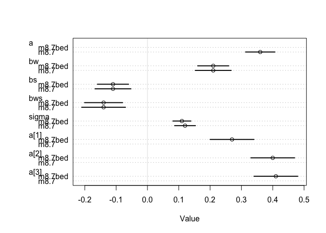
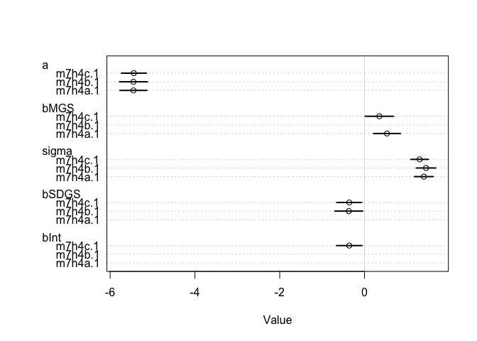

7E1
---

*For each of the causal relationships below, name a hypothetical third
variable that would lead to an interaction effect.*

*(1) Bread dough rises because of yeast* Temperature

*(2) Education leads to higher income.* Job? Race? Gender?

*(3) Gasoline makes a car go.* Key? Spark?

7M1
---

7M2
---

*Recall the tulips example from the chapter. Suppose another set of
treatments adjusted the temperature in the greenhouse over two levels:
cold and hot. The data in the chapter were collected at the cold
temperature. You find none of the plants grown under the hot temperature
developed any blooms at all, regardless of the water and shade levels.
Can you explain this result in terms of interactions between water,
shade, and temperature?*

I am thinking that the way I would do this would be to remove the main
effects of water and shade, and have W X temp, S X temp, and W X S X
temp terms

7M2
---

*7M2. Can you invent a regression equation that would make the bloom
size zero, whenever the temperature is hot?*

![
bloom \\sim \\alpha\_{\[T\]} + \\beta\_{WT} \* W \* T + \\beta\_{ST}\*S\*T + \\beta\_{WST}\*W\*S\*T
](https://latex.codecogs.com/png.latex?%0Abloom%20%5Csim%20%5Calpha_%7B%5BT%5D%7D%20%2B%20%5Cbeta_%7BWT%7D%20%2A%20W%20%2A%20T%20%2B%20%5Cbeta_%7BST%7D%2AS%2AT%20%2B%20%5Cbeta_%7BWST%7D%2AW%2AS%2AT%0A "
bloom \sim \alpha_{[T]} + \beta_{WT} * W * T + \beta_{ST}*S*T + \beta_{WST}*W*S*T
")

 And code  for
cold and  for
hot

7M3
---

*In parts of North America, ravens depend upon wolves for their food.
This is because ravens are carnivorous but cannot usually kill or open
carcasses of prey. Wolves however can and do kill and tear open animals,
and they tolerate ravens co-feeding at their kills. This species
relationship is generally described as a "species interaction." Can you
invent a hypothetical set of data on raven population size in which this
relationship would manifest as a statistical interaction? Do you think
the biological interaction could be linear? Why or why not?*

Ravens \~ Wolves + Prey + Wolves:Prey

7H1
---

*Return to the data(tulips) example in the chapter. Now include the bed
variable as a pre- dictor in the interaction model. Don't interact bed
with the other predictors; just include it as a main effect. Note that
bed is categorical. So to use it properly, you will need to either
construct dummy variables or rather an index variable, as explained in
Chapter ??.*

``` {.r}
library(tidyverse)
library(rethinking)
```

``` {.r}
data(tulips)
tulips
```

    ##    bed water shade blooms
    ## 1    a     1     1   0.00
    ## 2    a     1     2   0.00
    ## 3    a     1     3 111.04
    ## 4    a     2     1 183.47
    ## 5    a     2     2  59.16
    ## 6    a     2     3  76.75
    ## 7    a     3     1 224.97
    ## 8    a     3     2  83.77
    ## 9    a     3     3 134.95
    ## 10   b     1     1  80.10
    ## 11   b     1     2  85.95
    ## 12   b     1     3  19.87
    ## 13   b     2     1 213.13
    ## 14   b     2     2 124.99
    ## 15   b     2     3  65.48
    ## 16   b     3     1 361.66
    ## 17   b     3     2 197.13
    ## 18   b     3     3 134.93
    ## 19   c     1     1  10.02
    ## 20   c     1     2  47.69
    ## 21   c     1     3 106.75
    ## 22   c     2     1 246.00
    ## 23   c     2     2 135.92
    ## 24   c     2     3  90.66
    ## 25   c     3     1 304.52
    ## 26   c     3     2 249.33
    ## 27   c     3     3 134.59

``` {.r}
d <- tulips
```

Creat the index for bed

``` {.r}
d$bed_i <- as.numeric(d$bed)
d
```

    ##    bed water shade blooms bed_i
    ## 1    a     1     1   0.00     1
    ## 2    a     1     2   0.00     1
    ## 3    a     1     3 111.04     1
    ## 4    a     2     1 183.47     1
    ## 5    a     2     2  59.16     1
    ## 6    a     2     3  76.75     1
    ## 7    a     3     1 224.97     1
    ## 8    a     3     2  83.77     1
    ## 9    a     3     3 134.95     1
    ## 10   b     1     1  80.10     2
    ## 11   b     1     2  85.95     2
    ## 12   b     1     3  19.87     2
    ## 13   b     2     1 213.13     2
    ## 14   b     2     2 124.99     2
    ## 15   b     2     3  65.48     2
    ## 16   b     3     1 361.66     2
    ## 17   b     3     2 197.13     2
    ## 18   b     3     3 134.93     2
    ## 19   c     1     1  10.02     3
    ## 20   c     1     2  47.69     3
    ## 21   c     1     3 106.75     3
    ## 22   c     2     1 246.00     3
    ## 23   c     2     2 135.92     3
    ## 24   c     2     3  90.66     3
    ## 25   c     3     1 304.52     3
    ## 26   c     3     2 249.33     3
    ## 27   c     3     3 134.59     3

normalize and center

``` {.r}
## R code 8.20
d$blooms_std <- d$blooms / max(d$blooms)
d$water_cent <- d$water - mean(d$water)
d$shade_cent <- d$shade - mean(d$shade)
```

run original model

``` {.r}
## R code 8.24
m8.7 <- quap(
  alist(
    blooms_std ~ dnorm( mu , sigma ) ,
    mu <- a + bw*water_cent + bs*shade_cent + bws*water_cent*shade_cent ,
    a ~ dnorm( 0.5 , 0.25 ) ,
    bw ~ dnorm( 0 , 0.25 ) ,
    bs ~ dnorm( 0 , 0.25 ) ,
    bws ~ dnorm( 0 , 0.25 ) ,
    sigma ~ dexp( 1 )
  ) ,
  data=d )
```

modified model with bed

``` {.r}
m8.7bed <- quap(
  alist(
    blooms_std ~ dnorm( mu , sigma ) ,
    mu <- a[bed_i] + bw*water_cent + bs*shade_cent + bws*water_cent*shade_cent ,
    a[bed_i] ~ dnorm( 0.5 , 0.25 ) ,
    bw ~ dnorm( 0 , 0.25 ) ,
    bs ~ dnorm( 0 , 0.25 ) ,
    bws ~ dnorm( 0 , 0.25 ) ,
    sigma ~ dexp( 1 )
  ) ,
  data=d )
```

take a look

``` {.r}
precis(m8.7)
```

    ##             mean         sd        5.5%       94.5%
    ## a      0.3579782 0.02391890  0.31975114  0.39620517
    ## bw     0.2067319 0.02923463  0.16000929  0.25345447
    ## bs    -0.1134643 0.02922761 -0.16017567 -0.06675294
    ## bws   -0.1431625 0.03567978 -0.20018564 -0.08613928
    ## sigma  0.1248454 0.01694059  0.09777107  0.15191973

``` {.r}
precis(m8.7bed, depth = 2)
```

    ##             mean         sd        5.5%       94.5%
    ## a[1]   0.2732644 0.03571502  0.21618490  0.33034391
    ## a[2]   0.3963999 0.03569758  0.33934830  0.45345154
    ## a[3]   0.4091139 0.03569652  0.35206400  0.46616386
    ## bw     0.2074342 0.02537499  0.16688006  0.24798832
    ## bs    -0.1138493 0.02537034 -0.15439604 -0.07330264
    ## bws   -0.1438903 0.03099590 -0.19342772 -0.09435286
    ## sigma  0.1081872 0.01469439  0.08470272  0.13167168

``` {.r}
plot(coeftab(m8.7, m8.7bed))
```

<!-- -->

we see that the confidence intervals on the beta coefficients have
slightly shrunk, and that sigma is slightly smaller.

7H2
---

*Use WAIC to compare the model from 7H1 to a model that omits bed. What
do you infer from this comparison? Can you reconcile the WAIC results
with the posterior distribution of the bed coefficients?*

``` {.r}
compare(m8.7, m8.7bed)
```

    ##              WAIC     pWAIC    dWAIC    weight       SE      dSE
    ## m8.7bed -22.33758 10.291809 0.000000 0.5409887 10.37886       NA
    ## m8.7    -22.00894  6.673921 0.328647 0.4590113 10.83764 8.754758

The very small gains in parameter estimates are offset by the additional
parameters. Similar models, no reason to prefer the one including bed.

7H3
---

*Use the tomato.csv (attached) data set and evaluate whether hypocotyl
length ("hyp") is affected by shade ("trt"), species ("species") and
their interaction.*

``` {.r}
d <- read_csv("Tomato.csv") %>%
  select(hyp, trt, species) %>%
  na.omit()
```

    ## Parsed with column specification:
    ## cols(
    ##   .default = col_double(),
    ##   shelf = col_character(),
    ##   col = col_character(),
    ##   acs = col_character(),
    ##   trt = col_character(),
    ##   date = col_character(),
    ##   species = col_character(),
    ##   who = col_character()
    ## )

    ## See spec(...) for full column specifications.

``` {.r}
d
```

    ## # A tibble: 1,008 x 3
    ##      hyp trt   species        
    ##    <dbl> <chr> <chr>          
    ##  1  19.5 H     S. pennellii   
    ##  2  31.3 H     S. peruvianum  
    ##  3  56.6 H     S. peruvianum  
    ##  4  35.2 H     S. chilense    
    ##  5  35.3 H     S. chilense    
    ##  6  28.7 H     S. chmielewskii
    ##  7  33.1 H     S. habrochaites
    ##  8  42.1 H     S. pennellii   
    ##  9  32.7 H     S. peruvianum  
    ## 10  34.3 H     S. peruvianum  
    ## # … with 998 more rows

Make a plot

``` {.r}
d %>%
  group_by(species,trt) %>%
  summarize(mean=mean(hyp), 
            sem=sd(hyp)/sqrt(n()), 
            ymax=mean+sem,
            ymin=mean-sem) %>%
  ggplot(aes(x=species, y=mean, ymax=ymax, ymin=ymin, fill=trt)) +
  geom_col(position = "dodge") +
  geom_errorbar(position = position_dodge(width=.9), width=.5)
```

<!-- -->

make indices for the factors:

``` {.r}
d <- d %>%
  mutate(species_i = as.numeric(as.factor(species)),
         trt_i = as.numeric(as.factor(trt))-1)
```

fit non interaction model

``` {.r}
m1 <- quap(flist = alist(
  hyp ~ dnorm(mu, sigma),
  mu <- a[species_i] + b*trt_i, # one beta coefficient
  a[species_i] ~ dnorm(25, 5),
  b ~ dnorm(0, 5),
  sigma ~ dexp(1)),
  data=d, start=list(b=0, sigma=3))
```

check the priors

``` {.r}
prior <- extract.prior(m1)
str(prior)
```

    ## List of 3
    ##  $ b    : num [1:1000(1d)] -4.61 6.24 0.59 2.68 3.02 ...
    ##  $ sigma: num [1:1000(1d)] 2.628 0.5218 2.1406 0.6076 0.0427 ...
    ##  $ a    : num [1:1000, 1:5] 31.76 24.46 20.92 6.54 36.84 ...
    ##  - attr(*, "source")= chr "quap prior: 1000 samples from m1"

``` {.r}
d2 <- expand.grid(species_i=1:5, trt_i=0:1)
prior.pred <- link(m1, post=prior, data=d2)
colnames(prior.pred) <- str_c("species", d2$species_i, "_trt", d2$trt_i)
prior.pred %>% as_tibble() %>%
  gather() %>%
  ggplot(aes(x=key, y=value)) +
  geom_violin() +
  theme(axis.text.x = element_text(angle=90))
```

<!-- -->

``` {.r}
precis(m1, depth=2)
```

    ##           mean        sd      5.5%     94.5%
    ## b      5.41696 0.5581560  4.524919  6.309001
    ## sigma  8.97930 0.1986853  8.661762  9.296837
    ## a[1]  31.90150 0.6791837 30.816037 32.986970
    ## a[2]  29.21473 0.6579681 28.163165 30.266286
    ## a[3]  28.46208 0.6477930 27.426785 29.497382
    ## a[4]  25.80165 0.8273897 24.479326 27.123983
    ## a[5]  35.55730 0.6684076 34.489058 36.625547

now the interaction model:

``` {.r}
m2 <- quap(flist = alist(
  hyp ~ dnorm(mu, sigma),
  mu <- a[species_i] + b_int[species_i]*trt_i, # a beta coefficent for each species
  a[species_i] ~ dnorm(25, 5),
  b ~ dnorm(0, 5),
  b_int[species_i] ~ dnorm(0, 1),
  sigma ~ dexp(1)),
  data=d, start=list(b=0, sigma=3), control=list(maxit=500))
```

``` {.r}
precis(m2, depth=2)
```

    ##               mean        sd        5.5%     94.5%
    ## b         0.000000 4.9999980 -7.99096253  7.990963
    ## sigma     9.095109 0.2040305  8.76902858  9.421189
    ## a[1]     33.328307 0.7392224 32.14688672 34.509727
    ## a[2]     31.335671 0.7173986 30.18912930 32.482212
    ## a[3]     30.317051 0.6998268 29.19859272 31.435509
    ## a[4]     27.225593 0.9024565 25.78329270 28.667892
    ## a[5]     36.973128 0.7288650 35.80826046 38.137995
    ## b_int[1]  2.553328 0.7846562  1.29929634  3.807361
    ## b_int[2]  1.257846 0.7691929  0.02852763  2.487165
    ## b_int[3]  1.440083 0.7700732  0.20935704  2.670809
    ## b_int[4]  2.739888 0.8473358  1.38568187  4.094094
    ## b_int[5]  2.623690 0.7774869  1.38111598  3.866264

``` {.r}
compare(m1,m2)
```

    ##        WAIC    pWAIC    dWAIC       weight       SE      dSE
    ## m1 7309.118 7.687330  0.00000 9.999991e-01 58.64791       NA
    ## m2 7336.855 8.451341 27.73725 9.482710e-07 59.07825 10.85327

``` {.r}
m3 <- lm(hyp ~ species*trt, data=d)
summary(m3)
```

    ## 
    ## Call:
    ## lm(formula = hyp ~ species * trt, data = d)
    ## 
    ## Residuals:
    ##     Min      1Q  Median      3Q     Max 
    ## -29.113  -5.556  -0.733   4.749  36.706 
    ## 
    ## Coefficients:
    ##                             Estimate Std. Error t value Pr(>|t|)    
    ## (Intercept)                  31.5282     0.8907  35.395  < 2e-16 ***
    ## speciesS. chmielewskii       -0.9555     1.2393  -0.771  0.44090    
    ## speciesS. habrochaites       -2.0670     1.2139  -1.703  0.08892 .  
    ## speciesS. pennellii          -7.9579     1.4636  -5.437 6.81e-08 ***
    ## speciesS. peruvianum          3.7546     1.2507   3.002  0.00275 ** 
    ## trtL                          6.3654     1.2507   5.090 4.29e-07 ***
    ## speciesS. chmielewskii:trtL  -3.4551     1.7316  -1.995  0.04627 *  
    ## speciesS. habrochaites:trtL  -2.9548     1.7322  -1.706  0.08836 .  
    ## speciesS. pennellii:trtL      3.1772     2.0092   1.581  0.11413    
    ## speciesS. peruvianum:trtL    -0.1131     1.7486  -0.065  0.94846    
    ## ---
    ## Signif. codes:  0 '***' 0.001 '**' 0.01 '*' 0.05 '.' 0.1 ' ' 1
    ## 
    ## Residual standard error: 8.996 on 998 degrees of freedom
    ## Multiple R-squared:  0.1889, Adjusted R-squared:  0.1816 
    ## F-statistic: 25.83 on 9 and 998 DF,  p-value: < 2.2e-16

quick dummy variable creation
-----------------------------

``` {.r}
dummy <- tibble(ID=1:100, trt=sample(LETTERS[1:4], size = 100, replace=TRUE))
dummy %>% spread(key=trt,value=trt) %>%
  mutate_at(.vars=vars(-ID), ~ ifelse(is.na(.), 0, 1))
```

    ## # A tibble: 100 x 5
    ##       ID     A     B     C     D
    ##    <int> <dbl> <dbl> <dbl> <dbl>
    ##  1     1     0     0     0     1
    ##  2     2     0     1     0     0
    ##  3     3     1     0     0     0
    ##  4     4     0     0     0     1
    ##  5     5     0     0     0     1
    ##  6     6     0     0     0     1
    ##  7     7     0     1     0     0
    ##  8     8     0     0     1     0
    ##  9     9     0     1     0     0
    ## 10    10     0     0     1     0
    ## # … with 90 more rows

7H4
---

*The values in data(nettle) are data on language diversity in 74
nations. The meaning of each column is given below.* (1) country: Name
of the country\
(2) num.lang: Number of recognized languages spoken\
(3) area: Area in square kilometers\
(4) k.pop: Population, in thousands\
(5) num.stations: Number of weather stations that provided data for the
next two columns\
(6) mean.growing.season: Average length of growing season, in months\
(7) sd.growing.season: Standard deviation of length of growing season,
in months

*Use these data to evaluate the hypothesis that language diversity is
partly a product of food security. The notion is that, in productive
ecologies, people don't need large social networks to buffer them
against risk of food shortfalls. This means ethnic groups can be smaller
and more self-sufficient, leading to more languages per capita. In
contrast, in a poor ecology, there is more subsistence risk, and so
human societies have adapted by building larger networks of mutual
obligation to provide food insurance. This in turn creates social forces
that help prevent languages from diversifying.*

*Specifically, you will try to model the number of languages per capita
as the outcome variable:*

dnum.lang
/ d\$k.pop

*Use the logarithm of this new variable as your regression outcome. (A
count model would be better here, but you'll learn those later, in
Chapter 11.)*

*This problem is open ended, allowing you to decide how you address the
hypotheses and the uncertain advice the modeling provides. If you think
you need to use WAIC anyplace, please do. If you think you need certain
priors, argue for them. If you think you need to plot predictions in a
certain way, please do. Just try to honestly evaluate the main effects
of both mean.growing.season and sd.growing.season, as well as their
two-way interaction, as outlined in parts (a), (b), and (c) below. If
you are not sure which approach to use, try several.*

*(a) Evaluate the hypothesis that language diversity, as measured by
log(lang.per.cap), is pos- itively associated with the average length of
the growing season, mean.growing.season. Consider log(area) in your
regression(s) as a covariate (not an interaction). Interpret your
results.*

setup

``` {.r}
library(tidyverse)
library(rethinking)
data("nettle")
d <- nettle
d$lang.per.cap <- d$num.lang / d$k.pop
```

Standardize the predictors

``` {.r}
d$mean.growing.season.scale <- scale(d$mean.growing.season)
d$sd.growing.season.scale <- scale(d$sd.growing.season)
d$area.scale <- scale(d$area)
```

take a look at the relationships

``` {.r}
qplot(d$mean.growing.season.scale, log(d$lang.per.cap)) + geom_smooth()
```

    ## `geom_smooth()` using method = 'loess' and formula 'y ~ x'

<!-- -->

``` {.r}
qplot(d$sd.growing.season.scale, log(d$lang.per.cap)) + geom_smooth()
```

    ## `geom_smooth()` using method = 'loess' and formula 'y ~ x'

<!-- -->

``` {.r}
qplot(d$mean.growing.season.scale, d$sd.growing.season.scale) + geom_smooth()
```

    ## `geom_smooth()` using method = 'loess' and formula 'y ~ x'

<!-- -->

``` {.r}
m7h4a.1 <- quap(flist = alist(
  log(d$lang.per.cap) ~ dnorm(mu, sigma),
  mu <- a + bMGS*mean.growing.season.scale,
  a ~ dnorm(-3.8,2), # encompasses the range of the data
  bMGS ~ dnorm(0, 1), # allows up to a slope of 2, which would allow 8 units of change in log(lang.per.cap)
  sigma ~ dexp(1)),
  data=d)
```

check the priors

``` {.r}
prior <- extract.prior(m7h4a.1)
prior.pred <- link(m7h4a.1, 
                   post=prior,
                   n=100,
                   data=list(mean.growing.season.scale=range(d$mean.growing.season.scale)))

colnames(prior.pred) <- round(range(d$mean.growing.season.scale),2)

prior.pred %>%
  as_tibble() %>%
  mutate(id=1:nrow(.)) %>%
  gather(key="mean.growing.season", value="log.lang.per.cap", -id) %>%
  mutate(mean.growing.season = as.numeric(mean.growing.season)) %>%
  ggplot(aes(x=mean.growing.season, y=log.lang.per.cap, group=id)) +
  geom_line(alpha=.05)
```

<!-- -->

A little broad, but not ridiculous.

now include area

``` {.r}
m7h4a.2 <- quap(flist = alist(
  log(d$lang.per.cap) ~ dnorm(mu, sigma),
  mu <- a + bMGS*mean.growing.season.scale + bA*area.scale,
  a ~ dnorm(-3.8,2), # encompasses the range of the data
  bMGS ~ dnorm(0, 1), # allows up to a slope of 2, which would allow 8 units of change in log(lang.per.cap),
  bA ~ dnorm(0,1),
  sigma ~ dexp(1)),
  data=d)
```

``` {.r}
precis(m7h4a.1)
```

    ##             mean        sd      5.5%      94.5%
    ## a     -5.4456618 0.1617958 -5.704243 -5.1870809
    ## bMGS   0.5325703 0.1613024  0.274778  0.7903627
    ## sigma  1.3963134 0.1131955  1.215405  1.5772216

``` {.r}
precis(m7h4a.2)
```

    ##             mean        sd       5.5%      94.5%
    ## a     -5.4460275 0.1610296 -5.7033838 -5.1886712
    ## bMGS   0.5152101 0.1618347  0.2565669  0.7738532
    ## bA    -0.1389418 0.1618210 -0.3975630  0.1196793
    ## sigma  1.3896622 0.1126729  1.2095890  1.5697353

``` {.r}
plot(coeftab(m7h4a.1, m7h4a.2))
```

<!-- -->

``` {.r}
#compare(m7h4a.1, m7h4a.2) #getting an error
```

Although I can't get compare to work, it does not seem that including
Area improves model fit, I would stay with the simpler model. The model
supports the hypothesis that longer growing seasons are associated with
an increase in the number of languages per capita.

*(b) Now evaluate the hypothesis that language diversity is negatively
associated with the standard deviation of length of growing season,
sd.growing.season. This hypothesis follows from uncertainty in harvest
favoring social insurance through larger social networks and therefore
fewer languages. Again, consider log(area) as a covariate (not an
interaction). Interpret your results.*

``` {.r}
m7h4b.1 <- quap(flist = alist(
  log(d$lang.per.cap) ~ dnorm(mu, sigma),
  mu <- a + bSDGS*sd.growing.season.scale,
  a ~ dnorm(-3.8,2), # encompasses the range of the data
  bSDGS ~ dnorm(0, 1), # allows up to a slope of 2, which would allow 8 units of change in log(lang.per.cap)
  sigma ~ dexp(1)),
  data=d)
```

now include area

``` {.r}
m7h4b.2 <- quap(flist = alist(
  log(d$lang.per.cap) ~ dnorm(mu, sigma),
  mu <- a + bSDGS*sd.growing.season.scale + bA*area.scale,
  a ~ dnorm(-3.8,2), # encompasses the range of the data
  bSDGS ~ dnorm(0, 1), # allows up to a slope of 2, which would allow 8 units of change in log(lang.per.cap),
  bA ~ dnorm(0, 1),
  sigma ~ dexp(1)),
  data=d)
```

``` {.r}
precis(m7h4b.1)
```

    ##             mean        sd       5.5%      94.5%
    ## a     -5.4450806 0.1676133 -5.7129591 -5.1772021
    ## bSDGS -0.3746236 0.1669742 -0.6414807 -0.1077666
    ## sigma  1.4468657 0.1172041  1.2595509  1.6341805

``` {.r}
precis(m7h4b.2)
```

    ##              mean        sd       5.5%      94.5%
    ## a     -5.44497174 0.1676155 -5.7128537 -5.1770898
    ## bSDGS -0.38969183 0.2063798 -0.7195266 -0.0598571
    ## bA     0.02568492 0.2063683 -0.3041315  0.3555014
    ## sigma  1.44688284 0.1172443  1.2595038  1.6342619

``` {.r}
plot(coeftab(m7h4b.1, m7h4b.2))
```

<!-- -->

``` {.r}
#compare(m7h4b.1, m7h4b.2) #getting an error
```

Both models support that standard deviation in growing season is
negatively associated with the number of languages per capita. There
does not seem to be much area effect.

*(c) Finally, evaluate the hypothesis that mean.growing.season and
sd.growing.season interact to synergistically reduce language diversity.
The idea is that, in nations with longer average growing seasons, high
variance makes storage and redistribution even more important than it
would be otherwise. That way, people can cooperate to preserve and
protect windfalls to be used during the droughts. These forces in turn
may lead to greater social integration and fewer languages.*

``` {.r}
m7h4c.1 <- quap(flist = alist(
  log(d$lang.per.cap) ~ dnorm(mu, sigma),
  mu <- a + 
    bMGS*mean.growing.season.scale + 
    bSDGS*sd.growing.season.scale +
    bInt*mean.growing.season.scale*sd.growing.season.scale,
  a ~ dnorm(-3.8,2), # encompasses the range of the data
  bSDGS ~ dnorm(0, 1), # allows up to a slope of 2, which would allow 8 units of change in log(lang.per.cap)
  bMGS ~ dnorm(0, 1),
  bInt ~ dnorm(0, 1),
  sigma ~ dexp(1)),
  data=d)
```

now include area

``` {.r}
m7h4c.2 <- quap(flist = alist(
  log(d$lang.per.cap) ~ dnorm(mu, sigma),
  mu <- a + 
    bA*area.scale + 
    bMGS*mean.growing.season.scale + 
    bSDGS*sd.growing.season.scale +
    bInt*mean.growing.season.scale*sd.growing.season.scale,
  a ~ dnorm(-3.8,2), # encompasses the range of the data
  bSDGS ~ dnorm(0, 1), # allows up to a slope of 2, which would allow 8 units of change in log(lang.per.cap)
  bMGS ~ dnorm(0, 1),
  bInt ~ dnorm(0, 1),
  bA ~ dnorm(0,1),
  sigma ~ dexp(1)),
  data=d)
```

``` {.r}
precis(m7h4c.1)
```

    ##             mean        sd        5.5%      94.5%
    ## a     -5.4396906 0.1502102 -5.67975556 -5.1996256
    ## bSDGS -0.3589160 0.1504575 -0.59937606 -0.1184559
    ## bMGS   0.3539702 0.1701350  0.08206157  0.6258788
    ## bInt  -0.3615892 0.1540003 -0.60771146 -0.1154670
    ## sigma  1.2954524 0.1051280  1.12743762  1.4634672

``` {.r}
precis(m7h4c.2)
```

    ##             mean        sd        5.5%      94.5%
    ## a     -5.4393548 0.1488721 -5.67728122 -5.2014284
    ## bSDGS -0.4797715 0.1856014 -0.77639839 -0.1831446
    ## bMGS   0.3717147 0.1694347  0.10092522  0.6425041
    ## bInt  -0.3826053 0.1538529 -0.62849193 -0.1367188
    ## bA     0.2061552 0.1884984 -0.09510157  0.5074120
    ## sigma  1.2838436 0.1042051  1.11730377  1.4503835

``` {.r}
plot(coeftab(m7h4c.1, m7h4c.2))
```

<!-- -->

still no area effect. some evidence for negative interacton term.

negative interaction term means that if there is a long growing season
and high standard deviation, then there are fewer languages than you
would otherwise expect.

compare coeftab for the three no-area models.

``` {.r}
plot(coeftab(m7h4a.1, m7h4b.1, m7h4c.1))
```

<!-- -->

make some counterfactual plots

First I create a tibble of data frames, one for each level of
sd.growing.season.scale that I want to look at

``` {.r}
counterfact.data <-
  expand.grid(sd.growing.season.scale=c(-1.5, 0, 1.5),
              mean.growing.season.scale=c(-2,2)) %>%
  as_tibble() %>%
  mutate(key=sd.growing.season.scale) %>%
  group_by(key) %>%
  nest()

counterfact.data
```

    ## # A tibble: 3 x 2
    ##     key data            
    ##   <dbl> <list>          
    ## 1  -1.5 <tibble [2 × 2]>
    ## 2   0   <tibble [2 × 2]>
    ## 3   1.5 <tibble [2 × 2]>

``` {.r}
counterfact.data$data[[1]]
```

    ## # A tibble: 2 x 2
    ##   sd.growing.season.scale mean.growing.season.scale
    ##                     <dbl>                     <dbl>
    ## 1                    -1.5                        -2
    ## 2                    -1.5                         2

Now I run the link function on each of these data sets

``` {.r}
counterfact.predictions <- counterfact.data %>%
  mutate(pred = map(data, ~ as_tibble(link(m7h4c.1, n=20, data=.))))
```

    ## Warning: `as_tibble.matrix()` requires a matrix with column names or a `.name_repair` argument. Using compatibility `.name_repair`.
    ## This warning is displayed once per session.

``` {.r}
counterfact.predictions
```

    ## # A tibble: 3 x 3
    ##     key data             pred             
    ##   <dbl> <list>           <list>           
    ## 1  -1.5 <tibble [2 × 2]> <tibble [20 × 2]>
    ## 2   0   <tibble [2 × 2]> <tibble [20 × 2]>
    ## 3   1.5 <tibble [2 × 2]> <tibble [20 × 2]>

And finally, make a plot

``` {.r}
counterfact.predictions %>% unnest(pred) %>%
  rename(sd.growing.season.scale=key,
         `-2` = V1,
         `2` = V2) %>%
  mutate(id=1:nrow(.)) %>%
  gather(key="mean.growing.season.scale", 
         value="log.lang.per.cap", 
         -sd.growing.season.scale,-id) %>%
  mutate(mean.growing.season.scale=as.numeric(mean.growing.season.scale)) %>%
  
  ggplot(aes(x=mean.growing.season.scale, y=log.lang.per.cap, group=id)) +
  facet_wrap(~ sd.growing.season.scale) +
  geom_line(alpha=.2)
```

<!-- -->

So, the model predicts that at low SD of growing season there is a
strong positive relationship between growing season length and languages
per cap, and this relationshp diminishes with increased SD.
