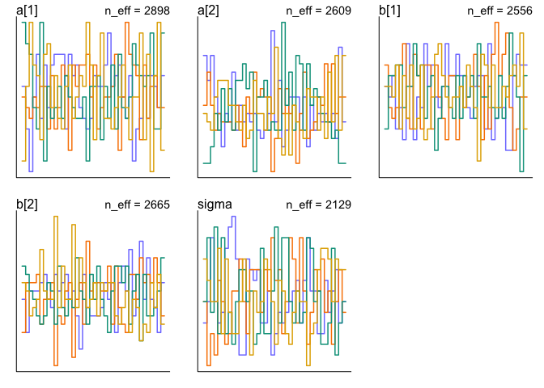
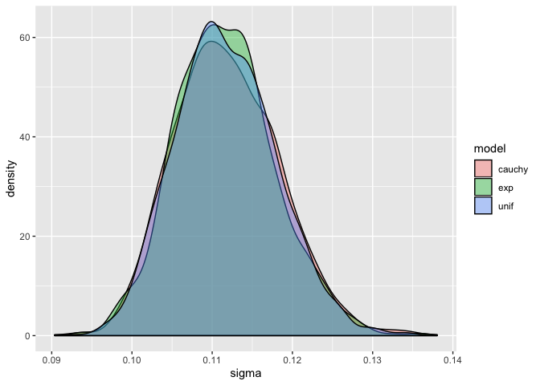
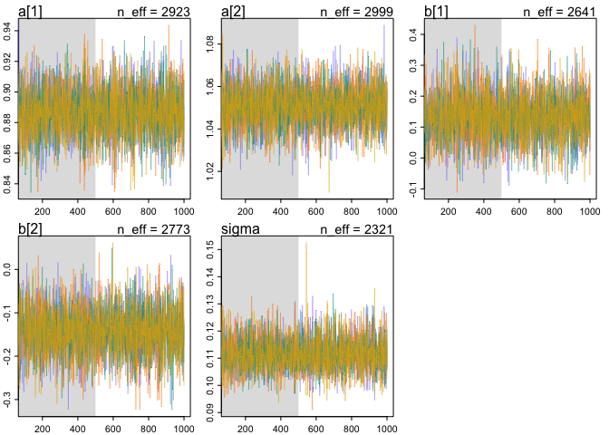
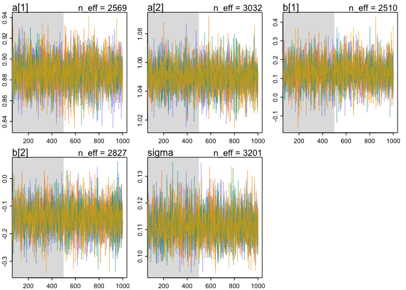
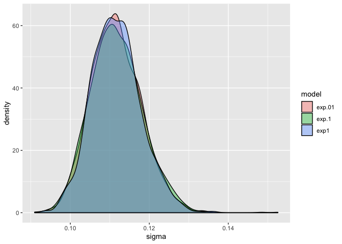
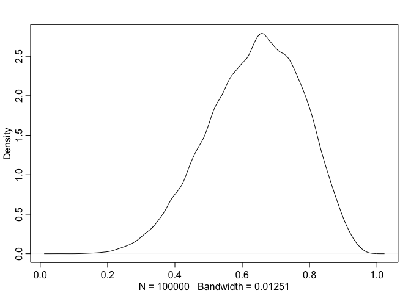

## Video Notes

* Bayesian is about the posterior but doesn't care how you get there.  It is not about MCMC, that is just one tool to get the posterior.
* King Markov
- Metropolois Archipelago
- Must visit each island in proportion to population density.
- Flip a coin to choose proposed island on left or right. "proposal"
- census population of proposal island and current island
- move to proposal with probability of prop  pop / current pop
- repeat.  this ensures visiting each island in proportion to its population in the long run.
- why would you do this?  useful if you don't know the distribution of population sizes.  Or in this case the distribution of posterior probabilities.  Allow sampling from unknown posterior distribution.
* Metropolis algorithm
- will converge in the long run
- as long as proposals are symmetric
- not very efficient
- Useful to draw samples from posterior distribution
- Island: parameter values
- Population size: proportional to posterior probability
- works for any numbers of dimensions (parameters); continuous or discrete
- Markov chain: history doesn't matter, probability only depends on where you are.
* Why MCMC?
- can't write integrated posterior, or can't use it
- multilevel models, networks, phylogenies, spatial models are are hard to get integrated
- optimization (e.g. quap) not a good strategy in high dimensions -- must have full distributions
- MCMC is not fancy.  It is old and essential.
* Many MCMC strategies
- Metropolis-Hastings (MH): More general
- Gibbs sampling (GS): Efficient version of MH
- Metropolis and Givvs are "guess and check" strategies.  so quality proposals are essential.  If making dumb proposals then you don't move, and don't visit potentially important parts of the distribution.
- Hamiltonian Monte Carlo (HMC) fundamentally different, does not guess and check.
* 

## Problems

### 8E1

8E1. Which of the following is a requirement of the simple Metropolis algorithm?
(1) The parameters must bed iscrete.
(2) The likelihood function must be Gaussian.
(3) The proposal distribution must be symmetric.

3

### 8E2

By using conjugate priors (Whatever those are), allowing more efficient proposals.

### 8E3
_Which sort of parameters can Hamiltonian Monte Carlo not handle? Can you explain why?_

Cannot handle discrete parameters because it glides across the surface.  (Need a continuous surface).

### 8M1
_Re-estimate the terrain ruggedness model from the chapter, but now using a uniform prior and an exponential prior for the standard deviation, sigma. The uniform prior should be dunif(0,10) and the exponential should be dexp(1). Do the different priors have any detectible influence on the posterior distribution?_

get the data and transform it

```r
## R code 9.9
library(rethinking)
```

```
## Loading required package: rstan
```

```
## Loading required package: StanHeaders
```

```
## Loading required package: ggplot2
```

```
## rstan (Version 2.19.2, GitRev: 2e1f913d3ca3)
```

```
## For execution on a local, multicore CPU with excess RAM we recommend calling
## options(mc.cores = parallel::detectCores()).
## To avoid recompilation of unchanged Stan programs, we recommend calling
## rstan_options(auto_write = TRUE)
```

```
## Loading required package: parallel
```

```
## Loading required package: dagitty
```

```
## rethinking (Version 1.90)
```

```r
library(tidyverse)
```

```
## ── Attaching packages ─────────────────────────────── tidyverse 1.2.1 ──
```

```
## ✔ tibble  2.1.3     ✔ purrr   0.3.2
## ✔ tidyr   1.0.0     ✔ dplyr   0.8.3
## ✔ readr   1.3.1     ✔ stringr 1.4.0
## ✔ tibble  2.1.3     ✔ forcats 0.4.0
```

```
## ── Conflicts ────────────────────────────────── tidyverse_conflicts() ──
## ✖ tidyr::extract() masks rstan::extract()
## ✖ dplyr::filter()  masks stats::filter()
## ✖ dplyr::lag()     masks stats::lag()
## ✖ purrr::map()     masks rethinking::map()
```

```r
options(mc.cores = parallel::detectCores())
data(rugged)
d <- rugged
d$log_gdp <- log(d$rgdppc_2000)
dd <- d[ complete.cases(d$rgdppc_2000) , ]
dd$log_gdp_std <- dd$log_gdp / mean(dd$log_gdp)
dd$rugged_std <- dd$rugged / max(dd$rugged)
dd$cid <- ifelse( dd$cont_africa==1 , 1 , 2 )

## R code 9.11
dat_slim <- list(
  log_gdp_std = dd$log_gdp_std,
  rugged_std = dd$rugged_std,
  cid = as.integer( dd$cid )
)
str(dat_slim)
```

```
## List of 3
##  $ log_gdp_std: num [1:170] 0.88 0.965 1.166 1.104 0.915 ...
##  $ rugged_std : num [1:170] 0.138 0.553 0.124 0.125 0.433 ...
##  $ cid        : int [1:170] 1 2 2 2 2 2 2 2 2 1 ...
```

from chapter

```r
m9.1 <- ulam(
  alist(
    log_gdp_std ~ dnorm( mu , sigma ) ,
    mu <- a[cid] + b[cid]*( rugged_std - 0.215 ) ,
    a[cid] ~ dnorm( 1 , 0.1 ) ,
    b[cid] ~ dnorm( 0 , 0.3 ) ,
    sigma ~ dexp( 1 )
  ) ,
  data=dat_slim , chains=4 , cores=4 , iter=1000 )
```


```r
precis(m9.1, depth = 2)
```

```
##             mean          sd        5.5%       94.5%    n_eff      Rhat
## a[1]   0.8869571 0.015768482  0.86119185  0.91173582 2898.357 0.9997149
## a[2]   1.0508778 0.009790507  1.03460430  1.06641382 2609.177 1.0000238
## b[1]   0.1315914 0.074671071  0.01018242  0.24934584 2556.011 1.0004251
## b[2]  -0.1414080 0.054067861 -0.22829394 -0.05610779 2665.419 1.0009726
## sigma  0.1116172 0.006187235  0.10253091  0.12204601 2129.297 0.9993663
```


```r
pairs(m9.1)
```

<!-- -->

```r
traceplot(m9.1)
trankplot(m9.1)
```

<!-- --><!-- -->


```r
m9.1.unif <- ulam(
  alist(
    log_gdp_std ~ dnorm( mu , sigma ) ,
    mu <- a[cid] + b[cid]*( rugged_std - 0.215 ) ,
    a[cid] ~ dnorm( 1 , 0.1 ) ,
    b[cid] ~ dnorm( 0 , 0.3 ) ,
    sigma ~ dunif( 0,10 )
  ) ,
  data=dat_slim , chains=4 , cores=4 , iter=1000 )
```


```r
m9.1.cauchy <- ulam(
  alist(
    log_gdp_std ~ dnorm( mu , sigma ) ,
    mu <- a[cid] + b[cid]*( rugged_std - 0.215 ) ,
    a[cid] ~ dnorm( 1 , 0.1 ) ,
    b[cid] ~ dnorm( 0 , 0.3 ) ,
    sigma ~ dcauchy( 0, 1 )
  ) ,
  data=dat_slim , chains=4 , cores=4 , iter=1000 )
```


```r
precis(m9.1, depth = 2)
```

```
##             mean          sd        5.5%       94.5%    n_eff      Rhat
## a[1]   0.8869571 0.015768482  0.86119185  0.91173582 2898.357 0.9997149
## a[2]   1.0508778 0.009790507  1.03460430  1.06641382 2609.177 1.0000238
## b[1]   0.1315914 0.074671071  0.01018242  0.24934584 2556.011 1.0004251
## b[2]  -0.1414080 0.054067861 -0.22829394 -0.05610779 2665.419 1.0009726
## sigma  0.1116172 0.006187235  0.10253091  0.12204601 2129.297 0.9993663
```


```r
precis(m9.1.unif, depth = 2)
```

```
##             mean         sd        5.5%       94.5%    n_eff      Rhat
## a[1]   0.8868698 0.01606111  0.86159823  0.91259503 2305.064 1.0000871
## a[2]   1.0505851 0.01024961  1.03456712  1.06703733 2894.604 0.9990174
## b[1]   0.1336664 0.07566543  0.01406569  0.25202079 2129.865 0.9984342
## b[2]  -0.1419883 0.05450561 -0.22706711 -0.05591895 2257.740 0.9996257
## sigma  0.1117176 0.00623641  0.10219588  0.12191571 2331.496 1.0000100
```


```r
precis(m9.1.cauchy, depth = 2)
```

```
##             mean          sd        5.5%       94.5%    n_eff      Rhat
## a[1]   0.8867715 0.015336877  0.86310232  0.91205835 1686.172 1.0005314
## a[2]   1.0504302 0.009927532  1.03443712  1.06622534 2899.128 0.9989637
## b[1]   0.1330444 0.074597991  0.01497772  0.25573851 1680.015 0.9998447
## b[2]  -0.1444409 0.057001218 -0.23002400 -0.05421874 2543.094 1.0004829
## sigma  0.1118479 0.006520290  0.10224178  0.12274217 2473.535 1.0014947
```


```r
pairs(m9.1.unif)
```

<!-- -->


```r
sigmapl <- tibble(exp = extract.samples(m9.1)$sigma,
                  unif = extract.samples(m9.1.unif)$sigma,
                  cauchy = extract.samples(m9.1.cauchy)$sigma) %>%
  gather(key=model, value=sigma)
sigmapl %>% 
  ggplot(aes(x=sigma, fill=model)) +
  geom_density(alpha=.4)
```

<!-- -->


No big difference.  Maybe sigma posterior from exp distribution is a bit more peaked

### 8M2

_The Cauchy and exponential priors from the terrain ruggedness model are very weak. They can be made more informative by reducing their scale. Compare the dcauchy and dexp priors for progressively smaller values of the scaling parameter. As these priors become stronger, how does each influence the posterior distribution?_


```r
m9.1.exp.1 <- ulam(
  alist(
    log_gdp_std ~ dnorm( mu , sigma ) ,
    mu <- a[cid] + b[cid]*( rugged_std - 0.215 ) ,
    a[cid] ~ dnorm( 1 , 0.1 ) ,
    b[cid] ~ dnorm( 0 , 0.3 ) ,
    sigma ~ dexp( .1 )
  ) ,
  data=dat_slim , chains=4 , cores=4 , iter=1000 )

m9.1.exp.01 <- ulam(
  alist(
    log_gdp_std ~ dnorm( mu , sigma ) ,
    mu <- a[cid] + b[cid]*( rugged_std - 0.215 ) ,
    a[cid] ~ dnorm( 1 , 0.1 ) ,
    b[cid] ~ dnorm( 0 , 0.3 ) ,
    sigma ~ dexp( .01 )
  ) ,
  data=dat_slim , chains=4 , cores=4 , iter=1000 )
```


```r
precis(m9.1, depth=2)
```

```
##             mean          sd        5.5%       94.5%    n_eff      Rhat
## a[1]   0.8869571 0.015768482  0.86119185  0.91173582 2898.357 0.9997149
## a[2]   1.0508778 0.009790507  1.03460430  1.06641382 2609.177 1.0000238
## b[1]   0.1315914 0.074671071  0.01018242  0.24934584 2556.011 1.0004251
## b[2]  -0.1414080 0.054067861 -0.22829394 -0.05610779 2665.419 1.0009726
## sigma  0.1116172 0.006187235  0.10253091  0.12204601 2129.297 0.9993663
```


```r
precis(m9.1.exp.1, depth=2)
```

```
##             mean          sd        5.5%       94.5%    n_eff      Rhat
## a[1]   0.8868494 0.016482443  0.86110943  0.91310396 2923.328 0.9987356
## a[2]   1.0506767 0.009694028  1.03550293  1.06644167 2998.958 0.9985816
## b[1]   0.1333238 0.074878392  0.01325472  0.25235959 2640.800 0.9999981
## b[2]  -0.1428536 0.055620110 -0.22977957 -0.05301736 2773.423 0.9991873
## sigma  0.1117015 0.006625145  0.10173203  0.12286290 2320.884 0.9983772
```


```r
precis(m9.1.exp.01, depth=2)
```

```
##             mean          sd        5.5%       94.5%    n_eff      Rhat
## a[1]   0.8864953 0.015878335  0.86072769  0.91188839 2569.450 1.0001045
## a[2]   1.0499863 0.010447412  1.03276843  1.06659353 3031.658 1.0004754
## b[1]   0.1317570 0.076550633  0.01303194  0.25272113 2509.637 0.9992833
## b[2]  -0.1428059 0.058708310 -0.23555985 -0.05307115 2826.941 0.9996295
## sigma  0.1115457 0.006294637  0.10173188  0.12191106 3200.834 0.9993541
```


```r
traceplot(m9.1.exp.1)
traceplot(m9.1.exp.01)
```

<!-- --><!-- -->


```r
sigmapl <- tibble(exp1 = extract.samples(m9.1)$sigma,
                  exp.1 = extract.samples(m9.1.exp.1)$sigma,
                  exp.01 = extract.samples(m9.1.exp.01)$sigma) %>%
  gather(key=model, value=sigma)
sigmapl %>% 
  ggplot(aes(x=sigma, fill=model)) +
  geom_density(alpha=.4)
```

<!-- -->


```r
m9.1.cauchy.1 <- ulam(
  alist(
    log_gdp_std ~ dnorm( mu , sigma ) ,
    mu <- a[cid] + b[cid]*( rugged_std - 0.215 ) ,
    a[cid] ~ dnorm( 1 , 0.1 ) ,
    b[cid] ~ dnorm( 0 , 0.3 ) ,
    sigma ~ dcauchy(0, .1 )
  ) ,
  data=dat_slim , chains=4 , cores=4 , iter=1000 )

m9.1.cauchy.01 <- ulam(
  alist(
    log_gdp_std ~ dnorm( mu , sigma ) ,
    mu <- a[cid] + b[cid]*( rugged_std - 0.215 ) ,
    a[cid] ~ dnorm( 1 , 0.1 ) ,
    b[cid] ~ dnorm( 0 , 0.3 ) ,
    sigma ~ dcauchy(0, .01 )
  ) ,
  data=dat_slim , chains=4 , cores=4 , iter=1000 )
```


```r
sigmapl <- tibble(cauchy = extract.samples(m9.1.cauchy)$sigma,
                  cauchy.1 = extract.samples(m9.1.cauchy.1)$sigma,
                  cauchy.01 = extract.samples(m9.1.cauchy.01)$sigma) %>%
  gather(key=model, value=sigma)
sigmapl %>% 
  ggplot(aes(x=sigma, fill=model)) +
  geom_density(alpha=.4)
```

<!-- -->


```r
precis(m9.1.cauchy, depth=2)
```

```
##             mean          sd        5.5%       94.5%    n_eff      Rhat
## a[1]   0.8867715 0.015336877  0.86310232  0.91205835 1686.172 1.0005314
## a[2]   1.0504302 0.009927532  1.03443712  1.06622534 2899.128 0.9989637
## b[1]   0.1330444 0.074597991  0.01497772  0.25573851 1680.015 0.9998447
## b[2]  -0.1444409 0.057001218 -0.23002400 -0.05421874 2543.094 1.0004829
## sigma  0.1118479 0.006520290  0.10224178  0.12274217 2473.535 1.0014947
```


```r
precis(m9.1.cauchy.1, depth=2)
```

```
##             mean          sd        5.5%       94.5%    n_eff      Rhat
## a[1]   0.8865214 0.016078503  0.86074641  0.91198107 2313.874 0.9988870
## a[2]   1.0504450 0.010193251  1.03381760  1.06650084 2776.873 0.9990398
## b[1]   0.1321505 0.072569944  0.01656551  0.24418111 2588.567 0.9997938
## b[2]  -0.1434394 0.054100133 -0.22802870 -0.05956909 2480.703 1.0011843
## sigma  0.1113332 0.006307875  0.10178709  0.12167287 3375.963 0.9997592
```


```r
precis(m9.1.cauchy.01, depth=2)
```

```
##             mean          sd         5.5%       94.5%    n_eff      Rhat
## a[1]   0.8865997 0.016237939  0.861320838  0.91268605 2237.205 0.9984686
## a[2]   1.0503971 0.010145937  1.034786601  1.06650832 2771.544 0.9991245
## b[1]   0.1342087 0.078687122  0.009833819  0.26112831 2216.863 0.9989716
## b[2]  -0.1401228 0.057589395 -0.229999808 -0.04863074 2316.621 0.9991264
## sigma  0.1109556 0.005950739  0.101785305  0.12088380 2943.193 0.9993269
```

No change

### 8H1

_Run the model below and then inspect the posterior distribution and explain what it is accom-
plishing_

```r
mp <- ulam(
  alist(
    a ~ dnorm(0,1),
    b ~ dcauchy(0,1)
  ),
  data=list(y=1),
  start=list(a=0,b=0),
  iter=1e4, warmup=100 , chains=4 )
```

```
## 
## SAMPLING FOR MODEL '3bd3f4d287e9cccab124308e5415245c' NOW (CHAIN 1).
## Chain 1: 
## Chain 1: Gradient evaluation took 9e-06 seconds
## Chain 1: 1000 transitions using 10 leapfrog steps per transition would take 0.09 seconds.
## Chain 1: Adjust your expectations accordingly!
## Chain 1: 
## Chain 1: 
## Chain 1: WARNING: There aren't enough warmup iterations to fit the
## Chain 1:          three stages of adaptation as currently configured.
## Chain 1:          Reducing each adaptation stage to 15%/75%/10% of
## Chain 1:          the given number of warmup iterations:
## Chain 1:            init_buffer = 15
## Chain 1:            adapt_window = 75
## Chain 1:            term_buffer = 10
## Chain 1: 
## Chain 1: Iteration:    1 / 10000 [  0%]  (Warmup)
## Chain 1: Iteration:  101 / 10000 [  1%]  (Sampling)
## Chain 1: Iteration: 1100 / 10000 [ 11%]  (Sampling)
## Chain 1: Iteration: 2100 / 10000 [ 21%]  (Sampling)
## Chain 1: Iteration: 3100 / 10000 [ 31%]  (Sampling)
## Chain 1: Iteration: 4100 / 10000 [ 41%]  (Sampling)
## Chain 1: Iteration: 5100 / 10000 [ 51%]  (Sampling)
## Chain 1: Iteration: 6100 / 10000 [ 61%]  (Sampling)
## Chain 1: Iteration: 7100 / 10000 [ 71%]  (Sampling)
## Chain 1: Iteration: 8100 / 10000 [ 81%]  (Sampling)
## Chain 1: Iteration: 9100 / 10000 [ 91%]  (Sampling)
## Chain 1: Iteration: 10000 / 10000 [100%]  (Sampling)
## Chain 1: 
## Chain 1:  Elapsed Time: 0.00263 seconds (Warm-up)
## Chain 1:                0.475809 seconds (Sampling)
## Chain 1:                0.478439 seconds (Total)
## Chain 1: 
## 
## SAMPLING FOR MODEL '3bd3f4d287e9cccab124308e5415245c' NOW (CHAIN 2).
## Chain 2: 
## Chain 2: Gradient evaluation took 1.1e-05 seconds
## Chain 2: 1000 transitions using 10 leapfrog steps per transition would take 0.11 seconds.
## Chain 2: Adjust your expectations accordingly!
## Chain 2: 
## Chain 2: 
## Chain 2: WARNING: There aren't enough warmup iterations to fit the
## Chain 2:          three stages of adaptation as currently configured.
## Chain 2:          Reducing each adaptation stage to 15%/75%/10% of
## Chain 2:          the given number of warmup iterations:
## Chain 2:            init_buffer = 15
## Chain 2:            adapt_window = 75
## Chain 2:            term_buffer = 10
## Chain 2: 
## Chain 2: Iteration:    1 / 10000 [  0%]  (Warmup)
## Chain 2: Iteration:  101 / 10000 [  1%]  (Sampling)
## Chain 2: Iteration: 1100 / 10000 [ 11%]  (Sampling)
## Chain 2: Iteration: 2100 / 10000 [ 21%]  (Sampling)
## Chain 2: Iteration: 3100 / 10000 [ 31%]  (Sampling)
## Chain 2: Iteration: 4100 / 10000 [ 41%]  (Sampling)
## Chain 2: Iteration: 5100 / 10000 [ 51%]  (Sampling)
## Chain 2: Iteration: 6100 / 10000 [ 61%]  (Sampling)
## Chain 2: Iteration: 7100 / 10000 [ 71%]  (Sampling)
## Chain 2: Iteration: 8100 / 10000 [ 81%]  (Sampling)
## Chain 2: Iteration: 9100 / 10000 [ 91%]  (Sampling)
## Chain 2: Iteration: 10000 / 10000 [100%]  (Sampling)
## Chain 2: 
## Chain 2:  Elapsed Time: 0.002819 seconds (Warm-up)
## Chain 2:                0.341551 seconds (Sampling)
## Chain 2:                0.34437 seconds (Total)
## Chain 2: 
## 
## SAMPLING FOR MODEL '3bd3f4d287e9cccab124308e5415245c' NOW (CHAIN 3).
## Chain 3: 
## Chain 3: Gradient evaluation took 4e-06 seconds
## Chain 3: 1000 transitions using 10 leapfrog steps per transition would take 0.04 seconds.
## Chain 3: Adjust your expectations accordingly!
## Chain 3: 
## Chain 3: 
## Chain 3: WARNING: There aren't enough warmup iterations to fit the
## Chain 3:          three stages of adaptation as currently configured.
## Chain 3:          Reducing each adaptation stage to 15%/75%/10% of
## Chain 3:          the given number of warmup iterations:
## Chain 3:            init_buffer = 15
## Chain 3:            adapt_window = 75
## Chain 3:            term_buffer = 10
## Chain 3: 
## Chain 3: Iteration:    1 / 10000 [  0%]  (Warmup)
## Chain 3: Iteration:  101 / 10000 [  1%]  (Sampling)
## Chain 3: Iteration: 1100 / 10000 [ 11%]  (Sampling)
## Chain 3: Iteration: 2100 / 10000 [ 21%]  (Sampling)
## Chain 3: Iteration: 3100 / 10000 [ 31%]  (Sampling)
## Chain 3: Iteration: 4100 / 10000 [ 41%]  (Sampling)
## Chain 3: Iteration: 5100 / 10000 [ 51%]  (Sampling)
## Chain 3: Iteration: 6100 / 10000 [ 61%]  (Sampling)
## Chain 3: Iteration: 7100 / 10000 [ 71%]  (Sampling)
## Chain 3: Iteration: 8100 / 10000 [ 81%]  (Sampling)
## Chain 3: Iteration: 9100 / 10000 [ 91%]  (Sampling)
## Chain 3: Iteration: 10000 / 10000 [100%]  (Sampling)
## Chain 3: 
## Chain 3:  Elapsed Time: 0.002751 seconds (Warm-up)
## Chain 3:                0.248201 seconds (Sampling)
## Chain 3:                0.250952 seconds (Total)
## Chain 3: 
## 
## SAMPLING FOR MODEL '3bd3f4d287e9cccab124308e5415245c' NOW (CHAIN 4).
## Chain 4: 
## Chain 4: Gradient evaluation took 3e-06 seconds
## Chain 4: 1000 transitions using 10 leapfrog steps per transition would take 0.03 seconds.
## Chain 4: Adjust your expectations accordingly!
## Chain 4: 
## Chain 4: 
## Chain 4: WARNING: There aren't enough warmup iterations to fit the
## Chain 4:          three stages of adaptation as currently configured.
## Chain 4:          Reducing each adaptation stage to 15%/75%/10% of
## Chain 4:          the given number of warmup iterations:
## Chain 4:            init_buffer = 15
## Chain 4:            adapt_window = 75
## Chain 4:            term_buffer = 10
## Chain 4: 
## Chain 4: Iteration:    1 / 10000 [  0%]  (Warmup)
## Chain 4: Iteration:  101 / 10000 [  1%]  (Sampling)
## Chain 4: Iteration: 1100 / 10000 [ 11%]  (Sampling)
## Chain 4: Iteration: 2100 / 10000 [ 21%]  (Sampling)
## Chain 4: Iteration: 3100 / 10000 [ 31%]  (Sampling)
## Chain 4: Iteration: 4100 / 10000 [ 41%]  (Sampling)
## Chain 4: Iteration: 5100 / 10000 [ 51%]  (Sampling)
## Chain 4: Iteration: 6100 / 10000 [ 61%]  (Sampling)
## Chain 4: Iteration: 7100 / 10000 [ 71%]  (Sampling)
## Chain 4: Iteration: 8100 / 10000 [ 81%]  (Sampling)
## Chain 4: Iteration: 9100 / 10000 [ 91%]  (Sampling)
## Chain 4: Iteration: 10000 / 10000 [100%]  (Sampling)
## Chain 4: 
## Chain 4:  Elapsed Time: 0.015565 seconds (Warm-up)
## Chain 4:                0.2277 seconds (Sampling)
## Chain 4:                0.243265 seconds (Total)
## Chain 4:
```

```
## Warning: There were 67 transitions after warmup that exceeded the maximum treedepth. Increase max_treedepth above 10. See
## http://mc-stan.org/misc/warnings.html#maximum-treedepth-exceeded
```

```
## Warning: Examine the pairs() plot to diagnose sampling problems
```

```r
traceplot(mp)
trankplot(mp)
```

<!-- -->

```r
precis(mp)
```

```
##           mean        sd      5.5%    94.5%      n_eff      Rhat
## a -0.003426064  1.001056 -1.606237 1.592931 27741.6805 0.9999938
## b  3.601048325 96.866544 -5.005022 5.262595   602.3438 1.0071223
```

<!-- -->


```r
extract.samples(mp)$a %>% dens()
```

<!-- -->


```r
extract.samples(mp)$b %>% dens()
```

<!-- -->


The model simply samples from the normal and cauchy distributions

### 8H2

_Recall the divorce rate example from Chapter 5. Repeat that analysis, using map2stan this time, fitting models m5.1, m5.2, and m5.3. Use compare to compare the models on the basis of WAIC. Explain the results._


```r
# load data and copy
library(rethinking)
data(WaffleDivorce)
d <- WaffleDivorce

# standardize variables
d$A <- scale( d$MedianAgeMarriage )
d$D <- scale( d$Divorce )

## R code 5.2
sd( d$MedianAgeMarriage )
```

```
## [1] 1.24363
```

```r
## R code 5.3
m5.1 <- quap(
  alist(
    D ~ dnorm( mu , sigma ) ,
    mu <- a + bA * A ,
    a ~ dnorm( 0 , 0.2 ) ,
    bA ~ dnorm( 0 , 0.5 ) ,
    sigma ~ dexp( 1 )
  ) , data = d )
```


```r
d$M <- scale( d$Marriage )
m5.2 <- quap(
  alist(
    D ~ dnorm( mu , sigma ) ,
    mu <- a + bM * M ,
    a ~ dnorm( 0 , 0.2 ) ,
    bM ~ dnorm( 0 , 0.5 ) ,
    sigma ~ dexp( 1 )
  ) , data = d )
```


```r
m5.3 <- quap(
  alist(
    D ~ dnorm( mu , sigma ) ,
    mu <- a + bM*M + bA*A ,
    a ~ dnorm( 0 , 0.2 ) ,
    bM ~ dnorm( 0 , 0.5 ) ,
    bA ~ dnorm( 0 , 0.5 ) ,
    sigma ~ dexp( 1 )
  ) , data = d )
precis( m5.3 )
```

```
##                mean         sd       5.5%      94.5%
## a      7.986580e-08 0.09707599 -0.1551461  0.1551463
## bM    -6.538087e-02 0.15077299 -0.3063452  0.1755835
## bA    -6.135134e-01 0.15098353 -0.8548142 -0.3722125
## sigma  7.851176e-01 0.07784330  0.6607090  0.9095262
```


```r
compare(m5.1,m5.2,m5.3)
```

```
##          WAIC    pWAIC     dWAIC       weight       SE       dSE
## m5.1 126.9431 4.416628  0.000000 0.8142903560 14.29582        NA
## m5.3 129.9094 6.238938  2.966294 0.1847807292 15.09765  1.310678
## m5.2 140.4952 3.689612 13.552111 0.0009289148 10.94950 10.545014
```


Now with stan


```r
dsmall <- list(D=d$D, A=d$A, M=d$M)
```


```r
m5.1.stan <- ulam(
  alist(
    D ~ dnorm( mu , sigma ) ,
    mu <- a + bA * A ,
    a ~ dnorm( 0 , 0.2 ) ,
    bA ~ dnorm( 0 , 0.5 ) ,
    sigma ~ dexp( 1 )
  ) , data = dsmall,
  chains=4,
  cores=4,
  log_lik = TRUE)
```


```r
m5.2.stan <- ulam(
  alist(
    D ~ dnorm( mu , sigma ) ,
    mu <- a + bM * M ,
    a ~ dnorm( 0 , 0.2 ) ,
    bM ~ dnorm( 0 , 0.5 ) ,
    sigma ~ dexp( 1 )
  ) , data = dsmall ,
  chains=4,
  cores=4,
  log_lik = TRUE)
```


```r
m5.3.stan <- ulam(
  alist(
    D ~ dnorm( mu , sigma ) ,
    mu <- a + bM*M + bA*A ,
    a ~ dnorm( 0 , 0.2 ) ,
    bM ~ dnorm( 0 , 0.5 ) ,
    bA ~ dnorm( 0 , 0.5 ) ,
    sigma ~ dexp( 1 )
  ) , data = dsmall ,
  chains=4,
  cores=4,
  log_lik = TRUE)
```


```r
precis(m5.1.stan)
```

```
##               mean         sd       5.5%      94.5%    n_eff      Rhat
## a     -0.001803817 0.09990719 -0.1633741  0.1568127 1971.885 1.0026121
## bA    -0.565328234 0.11432041 -0.7465682 -0.3752430 1805.295 1.0010170
## sigma  0.825610354 0.08739161  0.7002002  0.9708852 1735.175 0.9995741
```

```r
precis(m5.2.stan)
```

```
##                mean         sd       5.5%     94.5%    n_eff      Rhat
## a     -0.0007650213 0.11175250 -0.1766113 0.1750601 1747.722 1.0020854
## bM     0.3390257909 0.13187742  0.1207266 0.5525254 1947.979 1.0006457
## sigma  0.9500545309 0.09667439  0.8126131 1.1154667 1453.435 0.9994856
```

```r
precis(m5.3.stan)
```

```
##               mean         sd       5.5%      94.5%    n_eff     Rhat
## a      0.004132631 0.10324224 -0.1638092  0.1694264 1347.587 1.002612
## bM    -0.060996695 0.15611753 -0.3054485  0.1878100 1135.406 1.000988
## bA    -0.609838310 0.15743561 -0.8615204 -0.3620993 1222.866 1.000861
## sigma  0.827913237 0.08949699  0.6987833  0.9830307 1370.135 1.000812
```


```r
compare(m5.1.stan, m5.2.stan, m5.3.stan)
```

```
##               WAIC    pWAIC     dWAIC       weight        SE       dSE
## m5.1.stan 125.9416 3.774894  0.000000 0.6929425660 12.775942        NA
## m5.3.stan 127.5755 4.748091  1.633886 0.3061281842 12.708084 0.7696166
## m5.2.stan 139.1703 2.871921 13.228650 0.0009292497  9.713486 9.4236288
```

### optional: 8H6

_Modify the Metropolis algorithm code from the chapter to write your own simple MCMC estimator for globe tossing data and model from Chapter 2._


```r
iter <- 1e5
samples <- rep(0,iter)
current <- 0.5
for ( i in 1:iter ) {
  
  # record current position
  samples[i] <- current
  current_lik <- dbinom( 6 , size=9 , prob=current )
  
  # generate proposal
  proposal <- runif(1, min=0,max=1 )
  
  prop_lik <- dbinom(6, size=9, prob = proposal)
  
  # move?
  prob_move <- prop_lik/current_lik
  current <- ifelse( runif(1) < prob_move , proposal , current )
}
```


```r
dens(samples, adj=1)
```

<!-- -->

plot the chain

```r
plot(x=1:iter,y=samples, type="l")
```

<!-- -->


## third set of problems

### 8E4
_Explain the difference between the effective number of samples, n_eff as calculated by Stan,
and the actual number of samples._

n_eff takes autocorellation into account.

### 8M3

_Re-estimate one of the Stan models from the chapter, but at different numbers of warmup it- erations. Be sure to use the same number of sampling iterations in each case. Compare the n_eff values. How much warmup is enough?_

Using the marriage model


```r
m5.3.stan <- ulam(
  alist(
    D ~ dnorm( mu , sigma ) ,
    mu <- a + bM*M + bA*A ,
    a ~ dnorm( 0 , 0.2 ) ,
    bM ~ dnorm( 0 , 0.5 ) ,
    bA ~ dnorm( 0 , 0.5 ) ,
    sigma ~ dexp( 1 )
  ) , data = dsmall ,
  chains=4,
  cores=4,
  log_lik = TRUE)
```

```
## recompiling to avoid crashing R session
```

```r
precis(m5.3.stan)
```

```
##               mean         sd       5.5%      94.5%    n_eff     Rhat
## a      0.001462994 0.09997780 -0.1635138  0.1591872 1750.320 1.002547
## bM    -0.058299941 0.15372321 -0.3039905  0.1914069 1218.999 1.002000
## bA    -0.606264756 0.15705040 -0.8506660 -0.3595629 1079.610 1.002091
## sigma  0.826780879 0.09074692  0.6999426  0.9747908 1357.129 1.005723
```

0.12 seconds


```r
m5.3.stan.w100 <- ulam(
  alist(
    D ~ dnorm( mu , sigma ) ,
    mu <- a + bM*M + bA*A ,
    a ~ dnorm( 0 , 0.2 ) ,
    bM ~ dnorm( 0 , 0.5 ) ,
    bA ~ dnorm( 0 , 0.5 ) ,
    sigma ~ dexp( 1 )
  ) , data = dsmall ,
  chains=4,
  cores=4,
  iter=600,
  warmup=100,
  log_lik = TRUE)
```

```
## recompiling to avoid crashing R session
```

```r
precis(m5.3.stan.w100)
```

```
##                mean         sd       5.5%      94.5%     n_eff      Rhat
## a     -0.0006088896 0.09885542 -0.1611784  0.1558249 2744.8004 0.9985934
## bM    -0.0567459818 0.15708319 -0.2971323  0.1910349  803.7648 1.0008047
## bA    -0.6048310154 0.15860578 -0.8582940 -0.3528471  848.1634 0.9997029
## sigma  0.8248200045 0.08356879  0.7050027  0.9659273 1806.7428 0.9990346
```

100 seems non-optimal as the sampling is less even.
Total: 0.059


```r
m5.3.stan.w10 <- ulam(
  alist(
    D ~ dnorm( mu , sigma ) ,
    mu <- a + bM*M + bA*A ,
    a ~ dnorm( 0 , 0.2 ) ,
    bM ~ dnorm( 0 , 0.5 ) ,
    bA ~ dnorm( 0 , 0.5 ) ,
    sigma ~ dexp( 1 )
  ) , data = dsmall ,
  chains=4,
  cores=4,
  iter=600,
  warmup=10,
  log_lik = TRUE)
```

```
## recompiling to avoid crashing R session
```

```
## Warning: There were 1 chains where the estimated Bayesian Fraction of Missing Information was low. See
## http://mc-stan.org/misc/warnings.html#bfmi-low
```

```
## Warning: Examine the pairs() plot to diagnose sampling problems
```

```r
precis(m5.3.stan.w10)
```

```
##                mean         sd       5.5%      94.5%     n_eff      Rhat
## a     -0.0008713384 0.10553482 -0.1626623  0.1579082 1815.3912 1.0010334
## bM    -0.0630200870 0.16359579 -0.3201733  0.1864683  751.8907 1.0060447
## bA    -0.6059531217 0.15858208 -0.8610089 -0.3491785  853.6816 1.0018090
## sigma  0.8271227946 0.08664417  0.7017547  0.9726891 2057.9362 0.9994168
```

But 10 warmup samples is not that much worse.
Total time: 0.05 seconds


```r
m5.3.stan.w250 <- ulam(
  alist(
    D ~ dnorm( mu , sigma ) ,
    mu <- a + bM*M + bA*A ,
    a ~ dnorm( 0 , 0.2 ) ,
    bM ~ dnorm( 0 , 0.5 ) ,
    bA ~ dnorm( 0 , 0.5 ) ,
    sigma ~ dexp( 1 )
  ) , data = dsmall ,
  chains=4,
  cores=4,
  iter=600,
  warmup=250,
  log_lik = TRUE)
```

```
## recompiling to avoid crashing R session
```

```r
precis(m5.3.stan.w250)
```

```
##               mean         sd       5.5%      94.5%    n_eff     Rhat
## a     -0.002048045 0.10043948 -0.1561165  0.1641602 926.2354 1.002470
## bM    -0.058189457 0.15891783 -0.3142241  0.2025274 716.8762 1.001587
## bA    -0.605901788 0.16129774 -0.8592069 -0.3573547 692.7338 1.000525
## sigma  0.828548695 0.08246402  0.7047906  0.9720196 968.9433 1.002528
```

### 8H3

_Sometimes changing a prior for one parameter has unanticipated effects on other parameters. This is because when a parameter is highly correlated with another parameter in the posterior, the prior influences both parameters. Here’s an example to work and think through. Go back to the leg length example in Chapter 5. Here is the code again, which simulates height and leg lengths for 100 imagined individuals:_


```r
## R code 9.27
N <- 100                          # number of individuals
height <- rnorm(N,10,2)           # sim total height of each
leg_prop <- runif(N,0.4,0.5)      # leg as proportion of height
leg_left <- leg_prop*height +     # sim left leg as proportion + error
  rnorm( N , 0 , 0.02 )
leg_right <- leg_prop*height +    # sim right leg as proportion + error
  rnorm( N , 0 , 0.02 )
# combine into data frame
d <- data.frame(height,leg_left,leg_right)
```


```r
## R code 9.28
m5.8s <- map2stan(
  alist(
    height ~ dnorm( mu , sigma ) ,
    mu <- a + bl*leg_left + br*leg_right ,
    a ~ dnorm( 10 , 100 ) ,
    bl ~ dnorm( 2 , 10 ) ,
    br ~ dnorm( 2 , 10 ) ,
    sigma ~ dcauchy( 0 , 1 )
  ) ,
  data=d, chains=4,
  log_lik = TRUE,
  start=list(a=10,bl=0,br=0,sigma=1) )
```

```
## 
## SAMPLING FOR MODEL '2c15218a0319c6a677436b1aba138ce2' NOW (CHAIN 1).
## Chain 1: 
## Chain 1: Gradient evaluation took 3.4e-05 seconds
## Chain 1: 1000 transitions using 10 leapfrog steps per transition would take 0.34 seconds.
## Chain 1: Adjust your expectations accordingly!
## Chain 1: 
## Chain 1: 
## Chain 1: Iteration:    1 / 2000 [  0%]  (Warmup)
## Chain 1: Iteration:  200 / 2000 [ 10%]  (Warmup)
## Chain 1: Iteration:  400 / 2000 [ 20%]  (Warmup)
## Chain 1: Iteration:  600 / 2000 [ 30%]  (Warmup)
## Chain 1: Iteration:  800 / 2000 [ 40%]  (Warmup)
## Chain 1: Iteration: 1000 / 2000 [ 50%]  (Warmup)
## Chain 1: Iteration: 1001 / 2000 [ 50%]  (Sampling)
## Chain 1: Iteration: 1200 / 2000 [ 60%]  (Sampling)
## Chain 1: Iteration: 1400 / 2000 [ 70%]  (Sampling)
## Chain 1: Iteration: 1600 / 2000 [ 80%]  (Sampling)
## Chain 1: Iteration: 1800 / 2000 [ 90%]  (Sampling)
## Chain 1: Iteration: 2000 / 2000 [100%]  (Sampling)
## Chain 1: 
## Chain 1:  Elapsed Time: 6.60198 seconds (Warm-up)
## Chain 1:                6.83332 seconds (Sampling)
## Chain 1:                13.4353 seconds (Total)
## Chain 1: 
## 
## SAMPLING FOR MODEL '2c15218a0319c6a677436b1aba138ce2' NOW (CHAIN 2).
## Chain 2: 
## Chain 2: Gradient evaluation took 1.3e-05 seconds
## Chain 2: 1000 transitions using 10 leapfrog steps per transition would take 0.13 seconds.
## Chain 2: Adjust your expectations accordingly!
## Chain 2: 
## Chain 2: 
## Chain 2: Iteration:    1 / 2000 [  0%]  (Warmup)
## Chain 2: Iteration:  200 / 2000 [ 10%]  (Warmup)
## Chain 2: Iteration:  400 / 2000 [ 20%]  (Warmup)
## Chain 2: Iteration:  600 / 2000 [ 30%]  (Warmup)
## Chain 2: Iteration:  800 / 2000 [ 40%]  (Warmup)
## Chain 2: Iteration: 1000 / 2000 [ 50%]  (Warmup)
## Chain 2: Iteration: 1001 / 2000 [ 50%]  (Sampling)
## Chain 2: Iteration: 1200 / 2000 [ 60%]  (Sampling)
## Chain 2: Iteration: 1400 / 2000 [ 70%]  (Sampling)
## Chain 2: Iteration: 1600 / 2000 [ 80%]  (Sampling)
## Chain 2: Iteration: 1800 / 2000 [ 90%]  (Sampling)
## Chain 2: Iteration: 2000 / 2000 [100%]  (Sampling)
## Chain 2: 
## Chain 2:  Elapsed Time: 6.32307 seconds (Warm-up)
## Chain 2:                6.97724 seconds (Sampling)
## Chain 2:                13.3003 seconds (Total)
## Chain 2: 
## 
## SAMPLING FOR MODEL '2c15218a0319c6a677436b1aba138ce2' NOW (CHAIN 3).
## Chain 3: 
## Chain 3: Gradient evaluation took 1.4e-05 seconds
## Chain 3: 1000 transitions using 10 leapfrog steps per transition would take 0.14 seconds.
## Chain 3: Adjust your expectations accordingly!
## Chain 3: 
## Chain 3: 
## Chain 3: Iteration:    1 / 2000 [  0%]  (Warmup)
## Chain 3: Iteration:  200 / 2000 [ 10%]  (Warmup)
## Chain 3: Iteration:  400 / 2000 [ 20%]  (Warmup)
## Chain 3: Iteration:  600 / 2000 [ 30%]  (Warmup)
## Chain 3: Iteration:  800 / 2000 [ 40%]  (Warmup)
## Chain 3: Iteration: 1000 / 2000 [ 50%]  (Warmup)
## Chain 3: Iteration: 1001 / 2000 [ 50%]  (Sampling)
## Chain 3: Iteration: 1200 / 2000 [ 60%]  (Sampling)
## Chain 3: Iteration: 1400 / 2000 [ 70%]  (Sampling)
## Chain 3: Iteration: 1600 / 2000 [ 80%]  (Sampling)
## Chain 3: Iteration: 1800 / 2000 [ 90%]  (Sampling)
## Chain 3: Iteration: 2000 / 2000 [100%]  (Sampling)
## Chain 3: 
## Chain 3:  Elapsed Time: 6.95228 seconds (Warm-up)
## Chain 3:                6.82154 seconds (Sampling)
## Chain 3:                13.7738 seconds (Total)
## Chain 3: 
## 
## SAMPLING FOR MODEL '2c15218a0319c6a677436b1aba138ce2' NOW (CHAIN 4).
## Chain 4: 
## Chain 4: Gradient evaluation took 1.6e-05 seconds
## Chain 4: 1000 transitions using 10 leapfrog steps per transition would take 0.16 seconds.
## Chain 4: Adjust your expectations accordingly!
## Chain 4: 
## Chain 4: 
## Chain 4: Iteration:    1 / 2000 [  0%]  (Warmup)
## Chain 4: Iteration:  200 / 2000 [ 10%]  (Warmup)
## Chain 4: Iteration:  400 / 2000 [ 20%]  (Warmup)
## Chain 4: Iteration:  600 / 2000 [ 30%]  (Warmup)
## Chain 4: Iteration:  800 / 2000 [ 40%]  (Warmup)
## Chain 4: Iteration: 1000 / 2000 [ 50%]  (Warmup)
## Chain 4: Iteration: 1001 / 2000 [ 50%]  (Sampling)
## Chain 4: Iteration: 1200 / 2000 [ 60%]  (Sampling)
## Chain 4: Iteration: 1400 / 2000 [ 70%]  (Sampling)
## Chain 4: Iteration: 1600 / 2000 [ 80%]  (Sampling)
## Chain 4: Iteration: 1800 / 2000 [ 90%]  (Sampling)
## Chain 4: Iteration: 2000 / 2000 [100%]  (Sampling)
## Chain 4: 
## Chain 4:  Elapsed Time: 5.99413 seconds (Warm-up)
## Chain 4:                7.70861 seconds (Sampling)
## Chain 4:                13.7027 seconds (Total)
## Chain 4:
```

```
## Warning: There were 1967 transitions after warmup that exceeded the maximum treedepth. Increase max_treedepth above 10. See
## http://mc-stan.org/misc/warnings.html#maximum-treedepth-exceeded
```

```
## Warning: Examine the pairs() plot to diagnose sampling problems
```

```
## Computing WAIC
```


```r
trankplot(m5.8s)
plotchains(m5.8s)
```

```
## Warning: Ignoring unknown parameters: ask
```

```r
precis(m5.8s)
```

```
##            mean         sd       5.5%     94.5%    n_eff     Rhat
## a     0.8423910 0.26232121  0.4353636 1.2701461 2243.943 1.001103
## bl    1.4106379 2.09547365 -1.9584666 4.7622779 1482.327 1.002051
## br    0.6295204 2.09363753 -2.7119660 3.9851402 1486.525 1.001998
## sigma 0.6206573 0.04492982  0.5542515 0.6951326 1917.054 1.001043
```

```r
pairs(m5.8s)
```

<!-- --><!-- -->


_Compare the posterior distribution produced by the code above to the posterior distribution pro- duced when you change the prior for br so that it is strictly positive:_


```r
## R code 9.29
m5.8s2 <- map2stan(
  alist(
    height ~ dnorm( mu , sigma ) ,
    mu <- a + bl*leg_left + br*leg_right ,
    a ~ dnorm( 10 , 100 ) ,
    bl ~ dnorm( 2 , 10 ) ,
    br ~ dnorm( 2 , 10 ) & T[0,] ,
    sigma ~ dcauchy( 0 , 1 )
  ) ,
  data=d, chains=4,
  log_lik = TRUE,
  start=list(a=10,bl=0,br=0,sigma=1) )
```

```
## 
## SAMPLING FOR MODEL 'cd8bf782ae32917b721dfe8cff9aaf75' NOW (CHAIN 1).
## Chain 1: 
## Chain 1: Gradient evaluation took 2.4e-05 seconds
## Chain 1: 1000 transitions using 10 leapfrog steps per transition would take 0.24 seconds.
## Chain 1: Adjust your expectations accordingly!
## Chain 1: 
## Chain 1: 
## Chain 1: Iteration:    1 / 2000 [  0%]  (Warmup)
## Chain 1: Iteration:  200 / 2000 [ 10%]  (Warmup)
## Chain 1: Iteration:  400 / 2000 [ 20%]  (Warmup)
## Chain 1: Iteration:  600 / 2000 [ 30%]  (Warmup)
## Chain 1: Iteration:  800 / 2000 [ 40%]  (Warmup)
## Chain 1: Iteration: 1000 / 2000 [ 50%]  (Warmup)
## Chain 1: Iteration: 1001 / 2000 [ 50%]  (Sampling)
## Chain 1: Iteration: 1200 / 2000 [ 60%]  (Sampling)
## Chain 1: Iteration: 1400 / 2000 [ 70%]  (Sampling)
## Chain 1: Iteration: 1600 / 2000 [ 80%]  (Sampling)
## Chain 1: Iteration: 1800 / 2000 [ 90%]  (Sampling)
## Chain 1: Iteration: 2000 / 2000 [100%]  (Sampling)
## Chain 1: 
## Chain 1:  Elapsed Time: 3.32468 seconds (Warm-up)
## Chain 1:                3.41328 seconds (Sampling)
## Chain 1:                6.73795 seconds (Total)
## Chain 1: 
## 
## SAMPLING FOR MODEL 'cd8bf782ae32917b721dfe8cff9aaf75' NOW (CHAIN 2).
## Chain 2: 
## Chain 2: Gradient evaluation took 1.4e-05 seconds
## Chain 2: 1000 transitions using 10 leapfrog steps per transition would take 0.14 seconds.
## Chain 2: Adjust your expectations accordingly!
## Chain 2: 
## Chain 2: 
## Chain 2: Iteration:    1 / 2000 [  0%]  (Warmup)
## Chain 2: Iteration:  200 / 2000 [ 10%]  (Warmup)
## Chain 2: Iteration:  400 / 2000 [ 20%]  (Warmup)
## Chain 2: Iteration:  600 / 2000 [ 30%]  (Warmup)
## Chain 2: Iteration:  800 / 2000 [ 40%]  (Warmup)
## Chain 2: Iteration: 1000 / 2000 [ 50%]  (Warmup)
## Chain 2: Iteration: 1001 / 2000 [ 50%]  (Sampling)
## Chain 2: Iteration: 1200 / 2000 [ 60%]  (Sampling)
## Chain 2: Iteration: 1400 / 2000 [ 70%]  (Sampling)
## Chain 2: Iteration: 1600 / 2000 [ 80%]  (Sampling)
## Chain 2: Iteration: 1800 / 2000 [ 90%]  (Sampling)
## Chain 2: Iteration: 2000 / 2000 [100%]  (Sampling)
## Chain 2: 
## Chain 2:  Elapsed Time: 3.68514 seconds (Warm-up)
## Chain 2:                4.33283 seconds (Sampling)
## Chain 2:                8.01797 seconds (Total)
## Chain 2: 
## 
## SAMPLING FOR MODEL 'cd8bf782ae32917b721dfe8cff9aaf75' NOW (CHAIN 3).
## Chain 3: 
## Chain 3: Gradient evaluation took 1.3e-05 seconds
## Chain 3: 1000 transitions using 10 leapfrog steps per transition would take 0.13 seconds.
## Chain 3: Adjust your expectations accordingly!
## Chain 3: 
## Chain 3: 
## Chain 3: Iteration:    1 / 2000 [  0%]  (Warmup)
## Chain 3: Iteration:  200 / 2000 [ 10%]  (Warmup)
## Chain 3: Iteration:  400 / 2000 [ 20%]  (Warmup)
## Chain 3: Iteration:  600 / 2000 [ 30%]  (Warmup)
## Chain 3: Iteration:  800 / 2000 [ 40%]  (Warmup)
## Chain 3: Iteration: 1000 / 2000 [ 50%]  (Warmup)
## Chain 3: Iteration: 1001 / 2000 [ 50%]  (Sampling)
## Chain 3: Iteration: 1200 / 2000 [ 60%]  (Sampling)
## Chain 3: Iteration: 1400 / 2000 [ 70%]  (Sampling)
## Chain 3: Iteration: 1600 / 2000 [ 80%]  (Sampling)
## Chain 3: Iteration: 1800 / 2000 [ 90%]  (Sampling)
## Chain 3: Iteration: 2000 / 2000 [100%]  (Sampling)
## Chain 3: 
## Chain 3:  Elapsed Time: 3.57383 seconds (Warm-up)
## Chain 3:                4.18269 seconds (Sampling)
## Chain 3:                7.75652 seconds (Total)
## Chain 3: 
## 
## SAMPLING FOR MODEL 'cd8bf782ae32917b721dfe8cff9aaf75' NOW (CHAIN 4).
## Chain 4: 
## Chain 4: Gradient evaluation took 1.3e-05 seconds
## Chain 4: 1000 transitions using 10 leapfrog steps per transition would take 0.13 seconds.
## Chain 4: Adjust your expectations accordingly!
## Chain 4: 
## Chain 4: 
## Chain 4: Iteration:    1 / 2000 [  0%]  (Warmup)
## Chain 4: Iteration:  200 / 2000 [ 10%]  (Warmup)
## Chain 4: Iteration:  400 / 2000 [ 20%]  (Warmup)
## Chain 4: Iteration:  600 / 2000 [ 30%]  (Warmup)
## Chain 4: Iteration:  800 / 2000 [ 40%]  (Warmup)
## Chain 4: Iteration: 1000 / 2000 [ 50%]  (Warmup)
## Chain 4: Iteration: 1001 / 2000 [ 50%]  (Sampling)
## Chain 4: Iteration: 1200 / 2000 [ 60%]  (Sampling)
## Chain 4: Iteration: 1400 / 2000 [ 70%]  (Sampling)
## Chain 4: Iteration: 1600 / 2000 [ 80%]  (Sampling)
## Chain 4: Iteration: 1800 / 2000 [ 90%]  (Sampling)
## Chain 4: Iteration: 2000 / 2000 [100%]  (Sampling)
## Chain 4: 
## Chain 4:  Elapsed Time: 3.65443 seconds (Warm-up)
## Chain 4:                3.37611 seconds (Sampling)
## Chain 4:                7.03054 seconds (Total)
## Chain 4:
```

```
## Warning: There were 1671 divergent transitions after warmup. Increasing adapt_delta above 0.95 may help. See
## http://mc-stan.org/misc/warnings.html#divergent-transitions-after-warmup
```

```
## Warning: There were 140 transitions after warmup that exceeded the maximum treedepth. Increase max_treedepth above 10. See
## http://mc-stan.org/misc/warnings.html#maximum-treedepth-exceeded
```

```
## Warning: Examine the pairs() plot to diagnose sampling problems
```

```
## Warning: Bulk Effective Samples Size (ESS) is too low, indicating posterior means and medians may be unreliable.
## Running the chains for more iterations may help. See
## http://mc-stan.org/misc/warnings.html#bulk-ess
```

```
## Warning: Tail Effective Samples Size (ESS) is too low, indicating posterior variances and tail quantiles may be unreliable.
## Running the chains for more iterations may help. See
## http://mc-stan.org/misc/warnings.html#tail-ess
```

```
## Computing WAIC
```

```
## Warning in map2stan(alist(height ~ dnorm(mu, sigma), mu <- a + bl * leg_left + : There were 1671 divergent iterations during sampling.
## Check the chains (trace plots, n_eff, Rhat) carefully to ensure they are valid.
```


_Note that T[0,] on the right-hand side of the prior for br. What the T[0,] does is truncate the normal distribution so that it has positive probability only above zero. In other words, that prior ensures that the posterior distribution for br will have no probability mass below zero. Compare the two posterior distributions for m5.8s and m5.8s2. What has changed in the pos- terior distribution of both beta parameters? Can you explain the change induced by the change in_


```r
trankplot(m5.8s2)
plotchains(m5.8s2)
```

```
## Warning: Ignoring unknown parameters: ask
```

```r
precis(m5.8s2)
```

```
##            mean         sd       5.5%    94.5%     n_eff     Rhat
## a     0.8341600 0.26097352  0.4063769 1.259694 1089.9897 1.003956
## bl    0.1957507 1.36947435 -2.3002644 1.906447  386.6359 1.019031
## br    1.8473970 1.36956153  0.1362218 4.350267  390.1495 1.018447
## sigma 0.6191316 0.04419272  0.5512091 0.692775 1141.7822 1.000923
```

```r
pairs(m5.8s2)
```

<!-- --><!-- -->

So bR and bL are still inversely correlated, as expected, but now bR is always postive (of course) and bL is generally negative.  Interestingly the n_eff is lower.  Probably because in the previous modely that could flip between + and -

### 8H4

_For the two models fit in the previous problem, use DIC or WAIC to compare the effective numbers of parameters for each model. Which model has more effective parameters? Why?_


```r
compare(m5.8s, m5.8s2)
```

```
##            WAIC    pWAIC     dWAIC    weight       SE dSE
## m5.8s2 190.1263 2.909840 0.0000000 0.5721134 12.20098  NA
## m5.8s  190.7073 3.322477 0.5809582 0.4278866 12.47847  NA
```

m5.8s has more effective parameters.  But why?

## Book


  
  
  
  
  
  


