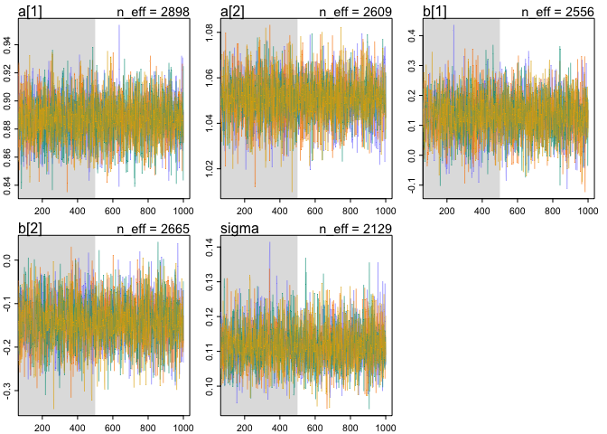
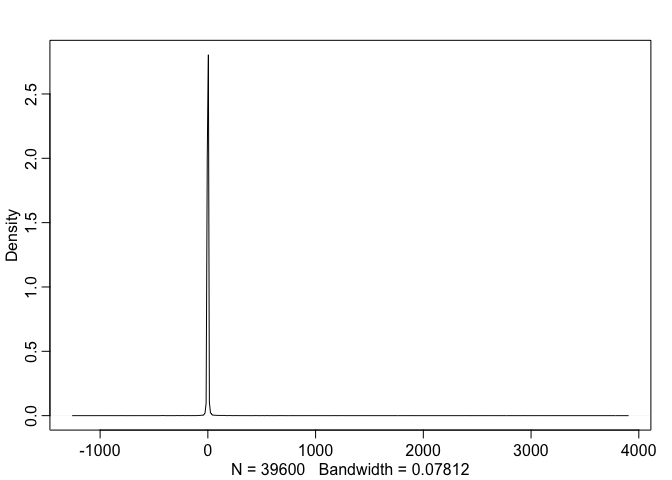

## Video Notes

* Bayesian is about the posterior but doesn't care how you get there.  It is not about MCMC, that is just one tool to get the posterior.
* King Markov
- Metropolois Archipelago
- Must visit each island in proportion to population density.
- Flip a coin to choose proposed island on left or right. "proposal"
- census population of proposal island and current island
- move to proposal with probability of prop  pop / current pop
- repeat.  this ensures visiting each island in proportion to its population in the long run.
- why would you do this?  useful if you don't know the distribution of population sizes.  Or in this case the distribution of posterior probabilities.  Allow sampling from unknown posterior distribution.
* Metropolis algorithm
- will converge in the long run
- as long as proposals are symmetric
- not very efficient
- Useful to draw samples from posterior distribution
- Island: parameter values
- Population size: proportional to posterior probability
- works for any numbers of dimensions (parameters); continuous or discrete
- Markov chain: history doesn't matter, probability only depends on where you are.
* Why MCMC?
- can't write integrated posterior, or can't use it
- multilevel models, networks, phylogenies, spatial models are are hard to get integrated
- optimization (e.g. quap) not a good strategy in high dimensions -- must have full distributions
- MCMC is not fancy.  It is old and essential.
* Many MCMC strategies
- Metropolis-Hastings (MH): More general
- Gibbs sampling (GS): Efficient version of MH
- Metropolis and Givvs are "guess and check" strategies.  so quality proposals are essential.  If making dumb proposals then you don't move, and don't visit potentially important parts of the distribution.
- Hamiltonian Monte Carlo (HMC) fundamentally different, does not guess and check.
* 

## Problems

### 8E1

8E1. Which of the following is a requirement of the simple Metropolis algorithm?
(1) The parameters must bed iscrete.
(2) The likelihood function must be Gaussian.
(3) The proposal distribution must be symmetric.

3

### 8E2

By using conjugate priors (Whatever those are), allowing more efficient proposals.

### 8E3
_Which sort of parameters can Hamiltonian Monte Carlo not handle? Can you explain why?_

Cannot handle discrete parameters because it glides across the surface.  (Need a continuous surface).

### 8M1
_Re-estimate the terrain ruggedness model from the chapter, but now using a uniform prior and an exponential prior for the standard deviation, sigma. The uniform prior should be dunif(0,10) and the exponential should be dexp(1). Do the different priors have any detectible influence on the posterior distribution?_

get the data and transform it

```r
## R code 9.9
library(rethinking)
```

```
## Loading required package: rstan
```

```
## Loading required package: StanHeaders
```

```
## Loading required package: ggplot2
```

```
## rstan (Version 2.19.2, GitRev: 2e1f913d3ca3)
```

```
## For execution on a local, multicore CPU with excess RAM we recommend calling
## options(mc.cores = parallel::detectCores()).
## To avoid recompilation of unchanged Stan programs, we recommend calling
## rstan_options(auto_write = TRUE)
```

```
## Loading required package: parallel
```

```
## Loading required package: dagitty
```

```
## rethinking (Version 1.90)
```

```r
library(tidyverse)
```

```
## ── Attaching packages ─────────── tidyverse 1.2.1 ──
```

```
## ✔ tibble  2.1.3     ✔ purrr   0.3.2
## ✔ tidyr   1.0.0     ✔ dplyr   0.8.3
## ✔ readr   1.3.1     ✔ stringr 1.4.0
## ✔ tibble  2.1.3     ✔ forcats 0.4.0
```

```
## ── Conflicts ────────────── tidyverse_conflicts() ──
## ✖ tidyr::extract() masks rstan::extract()
## ✖ dplyr::filter()  masks stats::filter()
## ✖ dplyr::lag()     masks stats::lag()
## ✖ purrr::map()     masks rethinking::map()
```

```r
options(mc.cores = parallel::detectCores())
data(rugged)
d <- rugged
d$log_gdp <- log(d$rgdppc_2000)
dd <- d[ complete.cases(d$rgdppc_2000) , ]
dd$log_gdp_std <- dd$log_gdp / mean(dd$log_gdp)
dd$rugged_std <- dd$rugged / max(dd$rugged)
dd$cid <- ifelse( dd$cont_africa==1 , 1 , 2 )

## R code 9.11
dat_slim <- list(
  log_gdp_std = dd$log_gdp_std,
  rugged_std = dd$rugged_std,
  cid = as.integer( dd$cid )
)
str(dat_slim)
```

```
## List of 3
##  $ log_gdp_std: num [1:170] 0.88 0.965 1.166 1.104 0.915 ...
##  $ rugged_std : num [1:170] 0.138 0.553 0.124 0.125 0.433 ...
##  $ cid        : int [1:170] 1 2 2 2 2 2 2 2 2 1 ...
```

from chapter

```r
m9.1 <- ulam(
  alist(
    log_gdp_std ~ dnorm( mu , sigma ) ,
    mu <- a[cid] + b[cid]*( rugged_std - 0.215 ) ,
    a[cid] ~ dnorm( 1 , 0.1 ) ,
    b[cid] ~ dnorm( 0 , 0.3 ) ,
    sigma ~ dexp( 1 )
  ) ,
  data=dat_slim , chains=4 , cores=4 , iter=1000 )
```


```r
precis(m9.1, depth = 2)
```

```
##             mean          sd        5.5%       94.5%    n_eff      Rhat
## a[1]   0.8865614 0.015961894  0.86173405  0.91193379 3211.690 0.9987035
## a[2]   1.0507785 0.010231320  1.03387416  1.06683177 2889.836 0.9985684
## b[1]   0.1313518 0.075363567  0.01114554  0.24848256 2502.973 0.9998468
## b[2]  -0.1424279 0.056785680 -0.23377178 -0.05194135 2712.956 0.9986548
## sigma  0.1115519 0.006138804  0.10238904  0.12174012 1646.632 1.0002615
```


```r
pairs(m9.1)
```

<!-- -->

```r
traceplot(m9.1)
trankplot(m9.1)
```

<!-- --><!-- -->


```r
m9.1.unif <- ulam(
  alist(
    log_gdp_std ~ dnorm( mu , sigma ) ,
    mu <- a[cid] + b[cid]*( rugged_std - 0.215 ) ,
    a[cid] ~ dnorm( 1 , 0.1 ) ,
    b[cid] ~ dnorm( 0 , 0.3 ) ,
    sigma ~ dunif( 0,10 )
  ) ,
  data=dat_slim , chains=4 , cores=4 , iter=1000 )
```


```r
m9.1.cauchy <- ulam(
  alist(
    log_gdp_std ~ dnorm( mu , sigma ) ,
    mu <- a[cid] + b[cid]*( rugged_std - 0.215 ) ,
    a[cid] ~ dnorm( 1 , 0.1 ) ,
    b[cid] ~ dnorm( 0 , 0.3 ) ,
    sigma ~ dcauchy( 0, 1 )
  ) ,
  data=dat_slim , chains=4 , cores=4 , iter=1000 )
```


```r
precis(m9.1, depth = 2)
```

```
##             mean          sd        5.5%       94.5%    n_eff      Rhat
## a[1]   0.8865614 0.015961894  0.86173405  0.91193379 3211.690 0.9987035
## a[2]   1.0507785 0.010231320  1.03387416  1.06683177 2889.836 0.9985684
## b[1]   0.1313518 0.075363567  0.01114554  0.24848256 2502.973 0.9998468
## b[2]  -0.1424279 0.056785680 -0.23377178 -0.05194135 2712.956 0.9986548
## sigma  0.1115519 0.006138804  0.10238904  0.12174012 1646.632 1.0002615
```


```r
precis(m9.1.unif, depth = 2)
```

```
##             mean          sd         5.5%       94.5%    n_eff      Rhat
## a[1]   0.8870744 0.016482241  0.861249450  0.91296332 3137.497 0.9992411
## a[2]   1.0504784 0.009882402  1.034476088  1.06629216 3572.190 0.9990330
## b[1]   0.1317273 0.076781363  0.007127374  0.25280341 2466.724 1.0004156
## b[2]  -0.1415626 0.055692982 -0.228662336 -0.05615267 2072.322 0.9991254
## sigma  0.1118633 0.005950158  0.102922762  0.12182238 2023.994 0.9994721
```


```r
precis(m9.1.cauchy, depth = 2)
```

```
##             mean          sd         5.5%       94.5%    n_eff      Rhat
## a[1]   0.8863529 0.015512746  0.860611669  0.91091568 2570.274 0.9984683
## a[2]   1.0508066 0.010544912  1.034035433  1.06783636 2497.159 0.9990885
## b[1]   0.1318385 0.075158298  0.009703194  0.25158600 2471.915 1.0003419
## b[2]  -0.1428341 0.056134014 -0.231929752 -0.05160507 2114.139 1.0000126
## sigma  0.1116036 0.006101169  0.102377421  0.12174782 2931.197 0.9989283
```


```r
pairs(m9.1.unif)
```

<!-- -->


```r
sigmapl <- tibble(exp = extract.samples(m9.1)$sigma,
                  unif = extract.samples(m9.1.unif)$sigma,
                  cauchy = extract.samples(m9.1.cauchy)$sigma) %>%
  gather(key=model, value=sigma)
sigmapl %>% 
  ggplot(aes(x=sigma, fill=model)) +
  geom_density(alpha=.4)
```

<!-- -->


No big difference.  Maybe sigma posterior from exp distribution is a bit more peaked

### 8M2

_The Cauchy and exponential priors from the terrain ruggedness model are very weak. They can be made more informative by reducing their scale. Compare the dcauchy and dexp priors for progressively smaller values of the scaling parameter. As these priors become stronger, how does each influence the posterior distribution?_


```r
m9.1.exp.1 <- ulam(
  alist(
    log_gdp_std ~ dnorm( mu , sigma ) ,
    mu <- a[cid] + b[cid]*( rugged_std - 0.215 ) ,
    a[cid] ~ dnorm( 1 , 0.1 ) ,
    b[cid] ~ dnorm( 0 , 0.3 ) ,
    sigma ~ dexp( .1 )
  ) ,
  data=dat_slim , chains=4 , cores=4 , iter=1000 )

m9.1.exp.01 <- ulam(
  alist(
    log_gdp_std ~ dnorm( mu , sigma ) ,
    mu <- a[cid] + b[cid]*( rugged_std - 0.215 ) ,
    a[cid] ~ dnorm( 1 , 0.1 ) ,
    b[cid] ~ dnorm( 0 , 0.3 ) ,
    sigma ~ dexp( .01 )
  ) ,
  data=dat_slim , chains=4 , cores=4 , iter=1000 )
```


```r
precis(m9.1, depth=2)
```

```
##             mean          sd        5.5%       94.5%    n_eff      Rhat
## a[1]   0.8865614 0.015961894  0.86173405  0.91193379 3211.690 0.9987035
## a[2]   1.0507785 0.010231320  1.03387416  1.06683177 2889.836 0.9985684
## b[1]   0.1313518 0.075363567  0.01114554  0.24848256 2502.973 0.9998468
## b[2]  -0.1424279 0.056785680 -0.23377178 -0.05194135 2712.956 0.9986548
## sigma  0.1115519 0.006138804  0.10238904  0.12174012 1646.632 1.0002615
```


```r
precis(m9.1.exp.1, depth=2)
```

```
##             mean          sd        5.5%       94.5%    n_eff      Rhat
## a[1]   0.8869676 0.016191900  0.86067312  0.91336429 3076.091 0.9985173
## a[2]   1.0506484 0.010626046  1.03385647  1.06744196 2820.248 0.9996451
## b[1]   0.1331709 0.074699658  0.01660947  0.25184849 2156.475 0.9996744
## b[2]  -0.1439530 0.054319035 -0.23122300 -0.05640542 1991.482 0.9992612
## sigma  0.1114328 0.006083371  0.10273092  0.12192296 2018.730 1.0001737
```


```r
precis(m9.1.exp.01, depth=2)
```

```
##             mean          sd         5.5%       94.5%    n_eff      Rhat
## a[1]   0.8864123 0.015861195  0.861276268  0.91157165 2907.795 0.9993715
## a[2]   1.0504102 0.010031734  1.033984630  1.06604623 2839.577 1.0001112
## b[1]   0.1323920 0.076867512  0.007205464  0.25670510 2972.081 0.9983807
## b[2]  -0.1446198 0.054587544 -0.235337253 -0.05784104 2998.927 0.9989521
## sigma  0.1117362 0.006326465  0.101988665  0.12251932 2489.303 0.9989006
```


```r
traceplot(m9.1.exp.1)
traceplot(m9.1.exp.01)
```

<!-- --><!-- -->


```r
sigmapl <- tibble(exp1 = extract.samples(m9.1)$sigma,
                  exp.1 = extract.samples(m9.1.exp.1)$sigma,
                  exp.01 = extract.samples(m9.1.exp.01)$sigma) %>%
  gather(key=model, value=sigma)
sigmapl %>% 
  ggplot(aes(x=sigma, fill=model)) +
  geom_density(alpha=.4)
```

<!-- -->


```r
m9.1.cauchy.1 <- ulam(
  alist(
    log_gdp_std ~ dnorm( mu , sigma ) ,
    mu <- a[cid] + b[cid]*( rugged_std - 0.215 ) ,
    a[cid] ~ dnorm( 1 , 0.1 ) ,
    b[cid] ~ dnorm( 0 , 0.3 ) ,
    sigma ~ dcauchy(0, .1 )
  ) ,
  data=dat_slim , chains=4 , cores=4 , iter=1000 )

m9.1.cauchy.01 <- ulam(
  alist(
    log_gdp_std ~ dnorm( mu , sigma ) ,
    mu <- a[cid] + b[cid]*( rugged_std - 0.215 ) ,
    a[cid] ~ dnorm( 1 , 0.1 ) ,
    b[cid] ~ dnorm( 0 , 0.3 ) ,
    sigma ~ dcauchy(0, .01 )
  ) ,
  data=dat_slim , chains=4 , cores=4 , iter=1000 )
```


```r
sigmapl <- tibble(cauchy = extract.samples(m9.1.cauchy)$sigma,
                  cauchy.1 = extract.samples(m9.1.cauchy.1)$sigma,
                  cauchy.01 = extract.samples(m9.1.cauchy.01)$sigma) %>%
  gather(key=model, value=sigma)
sigmapl %>% 
  ggplot(aes(x=sigma, fill=model)) +
  geom_density(alpha=.4)
```

<!-- -->


```r
precis(m9.1.cauchy, depth=2)
```

```
##             mean          sd         5.5%       94.5%    n_eff      Rhat
## a[1]   0.8863529 0.015512746  0.860611669  0.91091568 2570.274 0.9984683
## a[2]   1.0508066 0.010544912  1.034035433  1.06783636 2497.159 0.9990885
## b[1]   0.1318385 0.075158298  0.009703194  0.25158600 2471.915 1.0003419
## b[2]  -0.1428341 0.056134014 -0.231929752 -0.05160507 2114.139 1.0000126
## sigma  0.1116036 0.006101169  0.102377421  0.12174782 2931.197 0.9989283
```


```r
precis(m9.1.cauchy.1, depth=2)
```

```
##             mean          sd        5.5%       94.5%    n_eff      Rhat
## a[1]   0.8863457 0.015386527  0.86263901  0.91054367 2699.189 0.9992251
## a[2]   1.0503379 0.010241544  1.03394264  1.06624304 3183.291 0.9991196
## b[1]   0.1330554 0.073504513  0.01167791  0.24799601 1884.177 0.9995469
## b[2]  -0.1406215 0.054636923 -0.23165819 -0.05547155 2140.579 1.0005717
## sigma  0.1112423 0.006125551  0.10162819  0.12139747 3667.164 0.9985089
```


```r
precis(m9.1.cauchy.01, depth=2)
```

```
##             mean          sd         5.5%       94.5%    n_eff      Rhat
## a[1]   0.8869026 0.016182510  0.860686189  0.91225601 2357.932 0.9993123
## a[2]   1.0506485 0.009819624  1.035100766  1.06632105 2739.528 0.9990784
## b[1]   0.1326627 0.075622275  0.009883852  0.25117730 2440.825 0.9988622
## b[2]  -0.1389518 0.056183389 -0.224773711 -0.04901706 2111.099 0.9991431
## sigma  0.1109269 0.006094910  0.101835149  0.12107852 2500.477 0.9994463
```

No change

### 8H1

_Run the model below and then inspect the posterior distribution and explain what it is accom-
plishing_

```r
mp <- ulam(
  alist(
    a ~ dnorm(0,1),
    b ~ dcauchy(0,1)
  ),
  data=list(y=1),
  start=list(a=0,b=0),
  iter=1e4, warmup=100 , chains=4 )
```

```
## 
## SAMPLING FOR MODEL '3bd3f4d287e9cccab124308e5415245c' NOW (CHAIN 1).
## Chain 1: 
## Chain 1: Gradient evaluation took 1.1e-05 seconds
## Chain 1: 1000 transitions using 10 leapfrog steps per transition would take 0.11 seconds.
## Chain 1: Adjust your expectations accordingly!
## Chain 1: 
## Chain 1: 
## Chain 1: WARNING: There aren't enough warmup iterations to fit the
## Chain 1:          three stages of adaptation as currently configured.
## Chain 1:          Reducing each adaptation stage to 15%/75%/10% of
## Chain 1:          the given number of warmup iterations:
## Chain 1:            init_buffer = 15
## Chain 1:            adapt_window = 75
## Chain 1:            term_buffer = 10
## Chain 1: 
## Chain 1: Iteration:    1 / 10000 [  0%]  (Warmup)
## Chain 1: Iteration:  101 / 10000 [  1%]  (Sampling)
## Chain 1: Iteration: 1100 / 10000 [ 11%]  (Sampling)
## Chain 1: Iteration: 2100 / 10000 [ 21%]  (Sampling)
## Chain 1: Iteration: 3100 / 10000 [ 31%]  (Sampling)
## Chain 1: Iteration: 4100 / 10000 [ 41%]  (Sampling)
## Chain 1: Iteration: 5100 / 10000 [ 51%]  (Sampling)
## Chain 1: Iteration: 6100 / 10000 [ 61%]  (Sampling)
## Chain 1: Iteration: 7100 / 10000 [ 71%]  (Sampling)
## Chain 1: Iteration: 8100 / 10000 [ 81%]  (Sampling)
## Chain 1: Iteration: 9100 / 10000 [ 91%]  (Sampling)
## Chain 1: Iteration: 10000 / 10000 [100%]  (Sampling)
## Chain 1: 
## Chain 1:  Elapsed Time: 0.003429 seconds (Warm-up)
## Chain 1:                0.254119 seconds (Sampling)
## Chain 1:                0.257548 seconds (Total)
## Chain 1: 
## 
## SAMPLING FOR MODEL '3bd3f4d287e9cccab124308e5415245c' NOW (CHAIN 2).
## Chain 2: 
## Chain 2: Gradient evaluation took 1.2e-05 seconds
## Chain 2: 1000 transitions using 10 leapfrog steps per transition would take 0.12 seconds.
## Chain 2: Adjust your expectations accordingly!
## Chain 2: 
## Chain 2: 
## Chain 2: WARNING: There aren't enough warmup iterations to fit the
## Chain 2:          three stages of adaptation as currently configured.
## Chain 2:          Reducing each adaptation stage to 15%/75%/10% of
## Chain 2:          the given number of warmup iterations:
## Chain 2:            init_buffer = 15
## Chain 2:            adapt_window = 75
## Chain 2:            term_buffer = 10
## Chain 2: 
## Chain 2: Iteration:    1 / 10000 [  0%]  (Warmup)
## Chain 2: Iteration:  101 / 10000 [  1%]  (Sampling)
## Chain 2: Iteration: 1100 / 10000 [ 11%]  (Sampling)
## Chain 2: Iteration: 2100 / 10000 [ 21%]  (Sampling)
## Chain 2: Iteration: 3100 / 10000 [ 31%]  (Sampling)
## Chain 2: Iteration: 4100 / 10000 [ 41%]  (Sampling)
## Chain 2: Iteration: 5100 / 10000 [ 51%]  (Sampling)
## Chain 2: Iteration: 6100 / 10000 [ 61%]  (Sampling)
## Chain 2: Iteration: 7100 / 10000 [ 71%]  (Sampling)
## Chain 2: Iteration: 8100 / 10000 [ 81%]  (Sampling)
## Chain 2: Iteration: 9100 / 10000 [ 91%]  (Sampling)
## Chain 2: Iteration: 10000 / 10000 [100%]  (Sampling)
## Chain 2: 
## Chain 2:  Elapsed Time: 0.005315 seconds (Warm-up)
## Chain 2:                0.291299 seconds (Sampling)
## Chain 2:                0.296614 seconds (Total)
## Chain 2: 
## 
## SAMPLING FOR MODEL '3bd3f4d287e9cccab124308e5415245c' NOW (CHAIN 3).
## Chain 3: 
## Chain 3: Gradient evaluation took 8e-06 seconds
## Chain 3: 1000 transitions using 10 leapfrog steps per transition would take 0.08 seconds.
## Chain 3: Adjust your expectations accordingly!
## Chain 3: 
## Chain 3: 
## Chain 3: WARNING: There aren't enough warmup iterations to fit the
## Chain 3:          three stages of adaptation as currently configured.
## Chain 3:          Reducing each adaptation stage to 15%/75%/10% of
## Chain 3:          the given number of warmup iterations:
## Chain 3:            init_buffer = 15
## Chain 3:            adapt_window = 75
## Chain 3:            term_buffer = 10
## Chain 3: 
## Chain 3: Iteration:    1 / 10000 [  0%]  (Warmup)
## Chain 3: Iteration:  101 / 10000 [  1%]  (Sampling)
## Chain 3: Iteration: 1100 / 10000 [ 11%]  (Sampling)
## Chain 3: Iteration: 2100 / 10000 [ 21%]  (Sampling)
## Chain 3: Iteration: 3100 / 10000 [ 31%]  (Sampling)
## Chain 3: Iteration: 4100 / 10000 [ 41%]  (Sampling)
## Chain 3: Iteration: 5100 / 10000 [ 51%]  (Sampling)
## Chain 3: Iteration: 6100 / 10000 [ 61%]  (Sampling)
## Chain 3: Iteration: 7100 / 10000 [ 71%]  (Sampling)
## Chain 3: Iteration: 8100 / 10000 [ 81%]  (Sampling)
## Chain 3: Iteration: 9100 / 10000 [ 91%]  (Sampling)
## Chain 3: Iteration: 10000 / 10000 [100%]  (Sampling)
## Chain 3: 
## Chain 3:  Elapsed Time: 0.003301 seconds (Warm-up)
## Chain 3:                0.257347 seconds (Sampling)
## Chain 3:                0.260648 seconds (Total)
## Chain 3: 
## 
## SAMPLING FOR MODEL '3bd3f4d287e9cccab124308e5415245c' NOW (CHAIN 4).
## Chain 4: 
## Chain 4: Gradient evaluation took 4e-06 seconds
## Chain 4: 1000 transitions using 10 leapfrog steps per transition would take 0.04 seconds.
## Chain 4: Adjust your expectations accordingly!
## Chain 4: 
## Chain 4: 
## Chain 4: WARNING: There aren't enough warmup iterations to fit the
## Chain 4:          three stages of adaptation as currently configured.
## Chain 4:          Reducing each adaptation stage to 15%/75%/10% of
## Chain 4:          the given number of warmup iterations:
## Chain 4:            init_buffer = 15
## Chain 4:            adapt_window = 75
## Chain 4:            term_buffer = 10
## Chain 4: 
## Chain 4: Iteration:    1 / 10000 [  0%]  (Warmup)
## Chain 4: Iteration:  101 / 10000 [  1%]  (Sampling)
## Chain 4: Iteration: 1100 / 10000 [ 11%]  (Sampling)
## Chain 4: Iteration: 2100 / 10000 [ 21%]  (Sampling)
## Chain 4: Iteration: 3100 / 10000 [ 31%]  (Sampling)
## Chain 4: Iteration: 4100 / 10000 [ 41%]  (Sampling)
## Chain 4: Iteration: 5100 / 10000 [ 51%]  (Sampling)
## Chain 4: Iteration: 6100 / 10000 [ 61%]  (Sampling)
## Chain 4: Iteration: 7100 / 10000 [ 71%]  (Sampling)
## Chain 4: Iteration: 8100 / 10000 [ 81%]  (Sampling)
## Chain 4: Iteration: 9100 / 10000 [ 91%]  (Sampling)
## Chain 4: Iteration: 10000 / 10000 [100%]  (Sampling)
## Chain 4: 
## Chain 4:  Elapsed Time: 0.002846 seconds (Warm-up)
## Chain 4:                0.261434 seconds (Sampling)
## Chain 4:                0.26428 seconds (Total)
## Chain 4:
```

```
## Warning: There were 5 transitions after warmup that exceeded the maximum treedepth. Increase max_treedepth above 10. See
## http://mc-stan.org/misc/warnings.html#maximum-treedepth-exceeded
```

```
## Warning: Examine the pairs() plot to diagnose sampling problems
```

```r
traceplot(mp)
trankplot(mp)
```

<!-- -->

```r
precis(mp)
```

```
##           mean         sd      5.5%    94.5%     n_eff     Rhat
## a -0.003688554  0.9990779 -1.601143 1.589793 25255.056 1.000079
## b -0.134144938 14.5019863 -5.535103 5.336559  5858.191 1.000672
```

<!-- -->


```r
extract.samples(mp)$a %>% dens()
```

<!-- -->


```r
extract.samples(mp)$b %>% dens()
```

<!-- -->


The model simply samples from the normal and cauchy distributions

### 8H2

_Recall the divorce rate example from Chapter 5. Repeat that analysis, using map2stan this time, fitting models m5.1, m5.2, and m5.3. Use compare to compare the models on the basis of WAIC. Explain the results._


```r
# load data and copy
library(rethinking)
data(WaffleDivorce)
d <- WaffleDivorce

# standardize variables
d$A <- scale( d$MedianAgeMarriage )
d$D <- scale( d$Divorce )

## R code 5.2
sd( d$MedianAgeMarriage )
```

```
## [1] 1.24363
```

```r
## R code 5.3
m5.1 <- quap(
  alist(
    D ~ dnorm( mu , sigma ) ,
    mu <- a + bA * A ,
    a ~ dnorm( 0 , 0.2 ) ,
    bA ~ dnorm( 0 , 0.5 ) ,
    sigma ~ dexp( 1 )
  ) , data = d )
```


```r
d$M <- scale( d$Marriage )
m5.2 <- quap(
  alist(
    D ~ dnorm( mu , sigma ) ,
    mu <- a + bM * M ,
    a ~ dnorm( 0 , 0.2 ) ,
    bM ~ dnorm( 0 , 0.5 ) ,
    sigma ~ dexp( 1 )
  ) , data = d )
```


```r
m5.3 <- quap(
  alist(
    D ~ dnorm( mu , sigma ) ,
    mu <- a + bM*M + bA*A ,
    a ~ dnorm( 0 , 0.2 ) ,
    bM ~ dnorm( 0 , 0.5 ) ,
    bA ~ dnorm( 0 , 0.5 ) ,
    sigma ~ dexp( 1 )
  ) , data = d )
precis( m5.3 )
```

```
##                mean         sd       5.5%      94.5%
## a     -2.685385e-08 0.09707600 -0.1551462  0.1551462
## bM    -6.538082e-02 0.15077300 -0.3063452  0.1755836
## bA    -6.135134e-01 0.15098354 -0.8548143 -0.3722125
## sigma  7.851177e-01 0.07784331  0.6607090  0.9095263
```


```r
compare(m5.1,m5.2,m5.3)
```

```
##          WAIC    pWAIC     dWAIC       weight       SE       dSE
## m5.1 127.3194 4.620969  0.000000 0.6597286767 14.60037        NA
## m5.3 128.6484 5.506387  1.329072 0.3394384528 14.32276  1.111953
## m5.2 140.6688 3.791336 13.349411 0.0008328705 11.26054 10.978885
```


Now with stan


```r
dsmall <- list(D=d$D, A=d$A, M=d$M)
dsmall
```

```
## $D
##              [,1]
##  [1,]  1.65420530
##  [2,]  1.54436431
##  [3,]  0.61071590
##  [4,]  2.09356925
##  [5,] -0.92705795
##  [6,]  1.05007986
##  [7,] -1.64102438
##  [8,] -0.43277350
##  [9,] -1.86070636
## [10,] -0.65245548
## [11,]  0.99515936
## [12,] -0.76229646
## [13,] -1.09181943
## [14,] -0.92705795
## [15,]  0.72055689
## [16,]  0.28119293
## [17,]  0.50087491
## [18,]  1.59928480
## [19,]  0.72055689
## [20,]  1.81896678
## [21,] -0.48769399
## [22,] -1.03689894
## [23,] -0.26801201
## [24,] -1.25658092
## [25,]  0.77547738
## [26,] -0.10325053
## [27,] -0.32293251
## [28,] -0.48769399
## [29,]  0.22627244
## [30,] -1.97054734
## [31,]  0.28119293
## [32,] -1.69594487
## [33,]  0.11643145
## [34,] -0.92705795
## [35,] -0.10325053
## [36,]  1.70912579
## [37,]  0.39103392
## [38,] -1.09181943
## [39,] -0.15817102
## [40,] -0.87213745
## [41,]  0.66563639
## [42,]  0.94023887
## [43,]  0.17135194
## [44,]  0.28119293
## [45,] -0.04833004
## [46,] -0.43277350
## [47,]  0.17135194
## [48,]  0.66563639
## [49,] -0.76229646
## [50,]  0.33611343
## attr(,"scaled:center")
## [1] 9.688
## attr(,"scaled:scale")
## [1] 1.820814
## 
## $A
##              [,1]
##  [1,] -0.60628951
##  [2,] -0.68669925
##  [3,] -0.20424076
##  [4,] -1.41038699
##  [5,]  0.59985673
##  [6,] -0.28465051
##  [7,]  1.24313471
##  [8,]  0.43903723
##  [9,]  2.93173944
## [10,]  0.27821773
## [11,] -0.12383101
## [12,]  0.68026647
## [13,] -2.29489423
## [14,]  0.76067622
## [15,] -0.28465051
## [16,] -0.52587976
## [17,] -0.84751875
## [18,] -1.00833825
## [19,] -0.12383101
## [20,]  0.27821773
## [21,]  1.00190547
## [22,]  1.96682245
## [23,]  0.27821773
## [24,]  0.19780798
## [25,] -0.20424076
## [26,] -0.36506026
## [27,] -0.28465051
## [28,] -0.52587976
## [29,]  0.59985673
## [30,]  1.32354446
## [31,] -0.20424076
## [32,]  1.88641270
## [33,] -0.28465051
## [34,] -0.60628951
## [35,]  0.19780798
## [36,] -1.32997724
## [37,] -0.04342126
## [38,]  0.84108597
## [39,]  1.72559321
## [40,]  0.27821773
## [41,] -0.36506026
## [42,] -0.68669925
## [43,] -0.68669925
## [44,] -2.21448448
## [45,]  0.68026647
## [46,]  0.27821773
## [47,] -0.12383101
## [48,] -0.84751875
## [49,]  0.19780798
## [50,] -1.49079674
## attr(,"scaled:center")
## [1] 26.054
## attr(,"scaled:scale")
## [1] 1.24363
## 
## $M
##               [,1]
##  [1,]  0.022644060
##  [2,]  1.549801620
##  [3,]  0.048974363
##  [4,]  1.655122831
##  [5,] -0.266989270
##  [6,]  0.891544051
##  [7,] -0.793595325
##  [8,]  0.786222840
##  [9,] -0.635613508
## [10,] -0.819925628
## [11,]  0.522919813
## [12,]  1.260168290
## [13,]  1.497141014
## [14,] -0.582952903
## [15,] -0.082677151
## [16,]  0.364937996
## [17,]  0.522919813
## [18,]  0.549250115
## [19,]  0.127965271
## [20,] -1.741486224
## [21,] -0.477631692
## [22,] -1.135889261
## [23,] -0.951577141
## [24,] -1.267540774
## [25,] -0.214328664
## [26,] -0.398640784
## [27,] -0.424971086
## [28,] -0.135337756
## [29,] -0.898916536
## [30,] -1.399192288
## [31,]  0.075304666
## [32,] -0.872586233
## [33,]  0.075304666
## [34,]  1.734113739
## [35,] -0.846255930
## [36,]  0.970534959
## [37,] -0.319649875
## [38,] -1.214880169
## [39,] -1.346531683
## [40,] -0.530292297
## [41,] -0.003686242
## [42,] -0.187998362
## [43,]  0.364937996
## [44,]  2.497692519
## [45,] -0.977907444
## [46,]  0.101634969
## [47,]  0.338607693
## [48,]  0.549250115
## [49,] -0.767265022
## [50,]  2.787325849
## attr(,"scaled:center")
## [1] 20.114
## attr(,"scaled:scale")
## [1] 3.797905
```


```r
m5.1.stan <- ulam(
  alist(
    D ~ dnorm( mu , sigma ) ,
    mu <- a + bA * A ,
    a ~ dnorm( 0 , 0.2 ) ,
    bA ~ dnorm( 0 , 0.5 ) ,
    sigma ~ dexp( 1 )
  ) , data = dsmall,
  chains=4,
  cores=4,
  log_lik = TRUE)
```


```r
m5.2.stan <- ulam(
  alist(
    D ~ dnorm( mu , sigma ) ,
    mu <- a + bM * M ,
    a ~ dnorm( 0 , 0.2 ) ,
    bM ~ dnorm( 0 , 0.5 ) ,
    sigma ~ dexp( 1 )
  ) , data = dsmall ,
  chains=4,
  cores=4,
  log_lik = TRUE)
```


```r
m5.3.stan <- ulam(
  alist(
    D ~ dnorm( mu , sigma ) ,
    mu <- a + bM*M + bA*A ,
    a ~ dnorm( 0 , 0.2 ) ,
    bM ~ dnorm( 0 , 0.5 ) ,
    bA ~ dnorm( 0 , 0.5 ) ,
    sigma ~ dexp( 1 )
  ) , data = dsmall ,
  chains=4,
  cores=4,
  log_lik = TRUE)
```


```r
precis(m5.1.stan)
```

```
##               mean         sd       5.5%      94.5%    n_eff      Rhat
## a     -0.002106126 0.09753746 -0.1583501  0.1614812 1930.021 0.9995252
## bA    -0.563427771 0.11721500 -0.7461291 -0.3741682 1896.920 0.9984895
## sigma  0.823212413 0.08417185  0.7029683  0.9701105 1548.370 0.9989642
```

```r
precis(m5.2.stan)
```

```
##              mean        sd       5.5%     94.5%    n_eff      Rhat
## a     0.006359259 0.1104542 -0.1662349 0.1806543 2178.306 0.9983581
## bM    0.347400310 0.1317446  0.1353191 0.5557056 2023.223 1.0016288
## sigma 0.948443904 0.1013049  0.8003461 1.1233898 1755.380 1.0013093
```

```r
precis(m5.3.stan)
```

```
##               mean         sd       5.5%      94.5%    n_eff     Rhat
## a     -0.002203118 0.10249914 -0.1610017  0.1594379 1612.289 1.003259
## bM    -0.061696623 0.16091155 -0.3152865  0.2042833 1117.878 1.000566
## bA    -0.608263043 0.16253351 -0.8662154 -0.3486922 1118.757 1.000216
## sigma  0.827556085 0.08498327  0.7032138  0.9664908 1137.008 1.003837
```


```r
compare(m5.1.stan, m5.2.stan, m5.3.stan)
```

```
##               WAIC    pWAIC     dWAIC       weight        SE       dSE
## m5.1.stan 125.5471 3.535312  0.000000 0.7360970654 12.499545        NA
## m5.3.stan 127.6040 4.761346  2.056868 0.2632036195 12.663314 0.7189692
## m5.2.stan 139.4652 3.032690 13.918031 0.0006993152  9.865301 9.0824470
```

### optional: 8H6

_Modify the Metropolis algorithm code from the chapter to write your own simple MCMC estimator for globe tossing data and model from Chapter 2._


```r
iter <- 1e5
samples <- rep(0,iter)
current <- 0.5
for ( i in 1:iter ) {
  
  # record current position
  samples[i] <- current
  current_lik <- dbinom( 6 , size=9 , prob=current )
  
  # generate proposal
  proposal <- runif(1, min=0,max=1 )
  
  prop_lik <- dbinom(6, size=9, prob = proposal)
  
  # move?
  prob_move <- prop_lik/current_lik
  current <- ifelse( runif(1) < prob_move , proposal , current )
}
```


```r
dens(samples, adj=1)
```

<!-- -->

## Book


  
  
  
  
  
  


