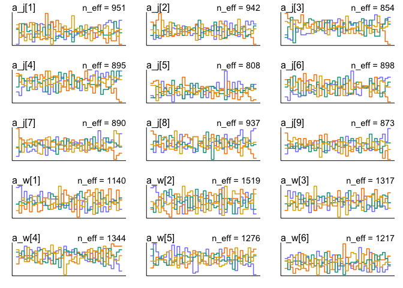
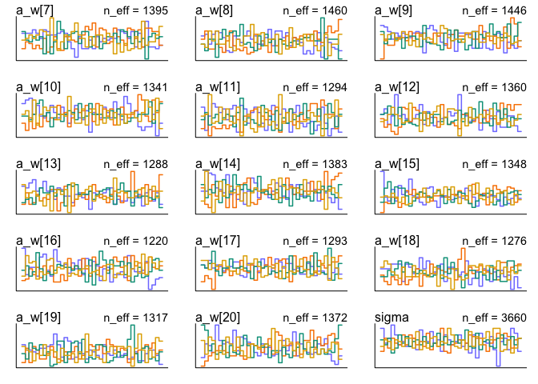
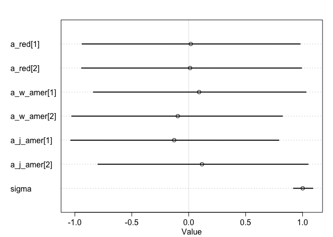
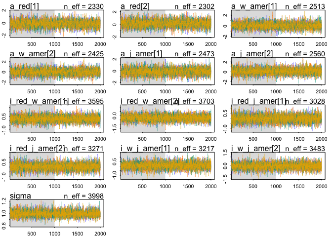

## 1. 
Consider the data(Wines2012) data table. These data are expert ratings
of 20 different French and American wines by 9 different French and American judges. Your goal is to model score, the subjective rating assigned by
each judge to each wine. I recommend standardizing it.
In this first problem, consider only variation among judges and wines.
Construct index variables of judge and wine and then use these index variables to construct a linear regression model. Justify your priors. You should
end up with 9 judge parameters and 20 wine parameters. Use ulam instead of
quap to build this model, and be sure to check the chains for convergence. If
you’d rather build the model directly in Stan or PyMC3, go ahead. I just want
you to use Hamiltonian Monte Carlo instead of quadratic approximation.
How do you interpret the variation among individual judges and individual wines? Do you notice any patterns, just by plotting the differences?
Which judges gave the highest/lowest ratings? Which wines were rated worst/
best on average?


```r
library(rethinking)
```

```
## Loading required package: rstan
```

```
## Loading required package: StanHeaders
```

```
## Loading required package: ggplot2
```

```
## rstan (Version 2.19.2, GitRev: 2e1f913d3ca3)
```

```
## For execution on a local, multicore CPU with excess RAM we recommend calling
## options(mc.cores = parallel::detectCores()).
## To avoid recompilation of unchanged Stan programs, we recommend calling
## rstan_options(auto_write = TRUE)
```

```
## Loading required package: parallel
```

```
## Loading required package: dagitty
```

```
## rethinking (Version 1.90)
```

```r
library(tidyverse)
```

```
## ── Attaching packages ──────────────────
```

```
## ✔ tibble  2.1.3     ✔ purrr   0.3.2
## ✔ tidyr   1.0.0     ✔ dplyr   0.8.3
## ✔ readr   1.3.1     ✔ stringr 1.4.0
## ✔ tibble  2.1.3     ✔ forcats 0.4.0
```

```
## ── Conflicts ── tidyverse_conflicts() ──
## ✖ tidyr::extract() masks rstan::extract()
## ✖ dplyr::filter()  masks stats::filter()
## ✖ dplyr::lag()     masks stats::lag()
## ✖ purrr::map()     masks rethinking::map()
```

```r
data("Wines2012")
head(Wines2012)
```

```
##             judge flight wine score wine.amer judge.amer
## 1 Jean-M Cardebat  white   A1    10         1          0
## 2 Jean-M Cardebat  white   B1    13         1          0
## 3 Jean-M Cardebat  white   C1    14         0          0
## 4 Jean-M Cardebat  white   D1    15         0          0
## 5 Jean-M Cardebat  white   E1     8         1          0
## 6 Jean-M Cardebat  white   F1    13         1          0
```


```r
Wines2012$score_std <- scale(Wines2012$score)
wlist <- with(Wines2012,
              list(judge=as.numeric(judge),
                   wine=as.numeric(wine),
                   score = score_std))
```


```r
m1 <- ulam(alist(
  score ~ dnorm(mu, sigma),
  mu <- a_j[judge] + a_w[wine],
  a_j[judge] ~ dnorm(0,1),
  a_w[wine] ~ dnorm(0,1),
  sigma ~ dexp(1)),
  data = wlist,
  chains = 4,
  cores = 4,
  iter=2000)
```

are the priors reasonable?

```r
priors <- extract.prior(m1)
```

```
## 
## SAMPLING FOR MODEL 'cf1f3dd733966f44a73175906cfe0fc6' NOW (CHAIN 1).
## Chain 1: 
## Chain 1: Gradient evaluation took 2.1e-05 seconds
## Chain 1: 1000 transitions using 10 leapfrog steps per transition would take 0.21 seconds.
## Chain 1: Adjust your expectations accordingly!
## Chain 1: 
## Chain 1: 
## Chain 1: Iteration:    1 / 2000 [  0%]  (Warmup)
## Chain 1: Iteration:  200 / 2000 [ 10%]  (Warmup)
## Chain 1: Iteration:  400 / 2000 [ 20%]  (Warmup)
## Chain 1: Iteration:  600 / 2000 [ 30%]  (Warmup)
## Chain 1: Iteration:  800 / 2000 [ 40%]  (Warmup)
## Chain 1: Iteration: 1000 / 2000 [ 50%]  (Warmup)
## Chain 1: Iteration: 1001 / 2000 [ 50%]  (Sampling)
## Chain 1: Iteration: 1200 / 2000 [ 60%]  (Sampling)
## Chain 1: Iteration: 1400 / 2000 [ 70%]  (Sampling)
## Chain 1: Iteration: 1600 / 2000 [ 80%]  (Sampling)
## Chain 1: Iteration: 1800 / 2000 [ 90%]  (Sampling)
## Chain 1: Iteration: 2000 / 2000 [100%]  (Sampling)
## Chain 1: 
## Chain 1:  Elapsed Time: 0.217857 seconds (Warm-up)
## Chain 1:                0.170036 seconds (Sampling)
## Chain 1:                0.387893 seconds (Total)
## Chain 1:
```

```r
str(priors)
```

```
## List of 3
##  $ a_j  : num [1:1000, 1:9] 0.13 -1.049 -1.242 0.821 -0.48 ...
##  $ a_w  : num [1:1000, 1:20] 0.936 -0.224 -0.436 -0.463 -0.559 ...
##  $ sigma: num [1:1000(1d)] 0.36599 0.146 0.00344 0.49652 0.16861 ...
##  - attr(*, "source")= chr "ulam prior: 1000 samples from fit"
```

each "score" would be the sum of a wine and a judge, so we could just run through some of these

```r
data <- data.frame(judge=sample(1:9, 1000, replace = TRUE), 
                   wine=sample(1:20, 1000, replace = TRUE))
prior.score <- link(m1,data,post=priors)
dens(prior.score)
```

<!-- -->

```r
dens(wlist$score)
```

<!-- -->

Reasonable...


```r
precis(m1, depth=2)
```

```
##                 mean         sd        5.5%      94.5%     n_eff     Rhat
## a_j[1]  -0.304818539 0.25996688 -0.71756013  0.1151783  951.0889 1.004499
## a_j[2]   0.235466358 0.26126394 -0.19284990  0.6566619  941.6457 1.005845
## a_j[3]   0.230447690 0.25851120 -0.17501608  0.6453544  853.9389 1.006263
## a_j[4]  -0.594699279 0.25937317 -1.01362137 -0.1676860  895.0594 1.006297
## a_j[5]   0.879413703 0.26081589  0.46025024  1.2890939  808.4797 1.006561
## a_j[6]   0.530654585 0.25909232  0.11773643  0.9442181  897.7386 1.004966
## a_j[7]   0.150053721 0.25918152 -0.26289930  0.5559866  890.4291 1.006489
## a_j[8]  -0.722027287 0.26204426 -1.13513046 -0.3039003  937.1197 1.006037
## a_j[9]  -0.378203507 0.26161885 -0.80310120  0.0450095  873.0771 1.005645
## a_w[1]   0.136252682 0.31900272 -0.37480613  0.6367108 1140.2055 1.005989
## a_w[2]   0.096683531 0.32258370 -0.42243984  0.5995530 1519.2974 1.002144
## a_w[3]   0.272945734 0.32845766 -0.25283120  0.7970970 1317.4365 1.002775
## a_w[4]   0.567213422 0.32192652  0.05281599  1.0881348 1344.0408 1.003190
## a_w[5]  -0.139251818 0.32633478 -0.67711454  0.3736481 1275.6838 1.003561
## a_w[6]  -0.379678716 0.32220105 -0.89469173  0.1415643 1216.5828 1.002350
## a_w[7]   0.293503450 0.32503035 -0.21230267  0.8106927 1395.1541 1.001838
## a_w[8]   0.277185735 0.32108592 -0.23013842  0.7926880 1459.8291 1.002245
## a_w[9]   0.078921658 0.33404209 -0.45985430  0.6084122 1445.8571 1.002502
## a_w[10]  0.118897404 0.32891594 -0.40081190  0.6439707 1340.6259 1.003306
## a_w[11] -0.013455859 0.32300796 -0.52798537  0.5038989 1293.6274 1.003378
## a_w[12] -0.029513729 0.33095859 -0.55505670  0.5068774 1360.3112 1.002988
## a_w[13] -0.109696899 0.32593280 -0.62874305  0.4165760 1287.8031 1.002909
## a_w[14] -0.003058261 0.32558145 -0.52712257  0.5230088 1382.5478 1.003457
## a_w[15] -0.223984647 0.33031780 -0.74363028  0.3205982 1348.0870 1.002726
## a_w[16] -0.208094853 0.32464278 -0.73928918  0.3160952 1220.2039 1.003363
## a_w[17] -0.153168909 0.33075981 -0.67689065  0.3794759 1293.0145 1.002464
## a_w[18] -0.883751036 0.32414406 -1.39776558 -0.3477532 1275.7793 1.003534
## a_w[19] -0.173094003 0.32644604 -0.69613767  0.3536472 1317.3123 1.001056
## a_w[20]  0.391325628 0.32736340 -0.13537122  0.9140566 1371.9625 1.002757
## sigma    0.850122893 0.04850172  0.77597777  0.9322984 3660.4110 1.000968
```

```r
plot(precis(m1, depth=2))
```

<!-- -->

```r
traceplot(m1, ask=FALSE)
```

```
## Waiting to draw page 2 of 2
```

<!-- --><!-- -->

```r
trankplot(m1, ask=FALSE)
```

```
## Waiting to draw page 2 of 2
```

<!-- --><!-- -->

More varitaion in judges than in wines.  Only 2 wines seem to be different from mean, but maybe 4 judges.

## 2. Now consider three features of the wines and judges:
(1) flight: Whether the wine is red or white.
(2) wine.amer: Indicator variable for American wines.
(3) judge.amer: Indicator variable for American judges.
Use indicator or index variables to model the influence of these features on
the scores. Omit the individual judge and wine index variables from Problem
1. Do not include interaction effects yet. Again use ulam, justify your priors,
and be sure to check the chains. What do you conclude about the differences
among the wines and judges? Try to relate the results to the inferences in
Problem 1.


```r
wlist2 <- with(Wines2012,
              list(score = score_std,
                   red=ifelse(flight=="red",2,1),
                   wine_amer=wine.amer+1,
                   judge_amer=judge.amer+1
              ))

m2 <- ulam(alist(
  score ~ dnorm(mu, sigma),
  mu <- a_red[red] + a_w_amer[wine_amer] + a_j_amer[judge_amer],
  a_red[red] ~ dnorm(0,1),
  a_w_amer[wine_amer] ~ dnorm(0,1),
  a_j_amer[judge_amer] ~ dnorm(0,1),
  sigma ~ dexp(1)),
  data = wlist2,
  chains = 4,
  cores = 4,
  iter=2000)
```


```r
precis(m2, depth=2)
```

```
##                    mean         sd       5.5%     94.5%    n_eff     Rhat
## a_red[1]     0.01822905 0.59667292 -0.9363402 0.9784638 1416.762 1.003011
## a_red[2]     0.01207788 0.59835076 -0.9406330 0.9915373 1419.467 1.003471
## a_w_amer[1]  0.09145735 0.58544590 -0.8370512 1.0301876 1630.518 1.000970
## a_w_amer[2] -0.09580041 0.58171548 -1.0270909 0.8229393 1614.431 1.000732
## a_j_amer[1] -0.12742174 0.57732083 -1.0359961 0.7916651 1424.296 1.002238
## a_j_amer[2]  0.11684623 0.57646907 -0.7970343 1.0485812 1371.285 1.002194
## sigma        1.00126577 0.05278519  0.9203237 1.0902166 2558.584 1.000942
```

```r
plot(precis(m2, depth=2))
```

<!-- -->

```r
traceplot(m2, ask=FALSE)
trankplot(m2, ask=FALSE)
```

<!-- --><!-- -->

No effect of flight, or country of origin for wine or judge.

## 3. Now consider two-way interactions among the three features. 
You should end up with three different interaction terms in your model. These will be
easier to build, if you use indicator variables. Again use ulam, justify your
priors, and be sure to check the chains. Explain what each interaction means.
Be sure to interpret the model’s predictions on the outcome scale (mu, the
expected score), not on the scale of individual parameters. You can use link
to help with this, or just use your knowledge of the linear model instead.
What do you conclude about the features and the scores? Can you relate
the results of your model(s) to the individual judge and wine inferences from
Problem 1?


```r
m3 <- ulam(alist(
  score ~ dnorm(mu, sigma),
  mu <- a_red[red] + 
    a_w_amer[wine_amer] + 
    a_j_amer[judge_amer] + 
    i_red_w_amer[red]*(wine_amer-1) + # 0 for french wines, 1 for american wines
    i_red_j_amer[red]*(judge_amer-1) + # 0 for french wines, 1 for american wines
    i_w_j_amer[wine_amer]*(judge_amer-1), # 0 for french judges, 1 for american judges
  a_red[red] ~ dnorm(0,1),
  a_w_amer[wine_amer] ~ dnorm(0,1),
  a_j_amer[judge_amer] ~ dnorm(0,1),
  i_red_w_amer[red] ~ dnorm(0,.5),
  i_red_j_amer[red] ~ dnorm(0,.5),
  i_w_j_amer[wine_amer] ~ dnorm(0,.5),
  sigma ~ dexp(1)),
  data = wlist2,
  chains = 4,
  cores = 4,
  iter=2000)
```


```r
precis(m3, depth=2)
```

```
##                         mean        sd       5.5%     94.5%    n_eff
## a_red[1]        -0.135602057 0.5901367 -1.0735775 0.7937244 2329.868
## a_red[2]         0.126372306 0.5875158 -0.7780171 1.0692051 2302.318
## a_w_amer[1]      0.064245742 0.6172255 -0.9103073 1.0489357 2513.212
## a_w_amer[2]     -0.056186663 0.6454717 -1.0708207 0.9864068 2425.290
## a_j_amer[1]     -0.117260495 0.5934551 -1.0758216 0.8115117 2473.424
## a_j_amer[2]      0.107776020 0.6585943 -0.9408387 1.1705844 2559.519
## i_red_w_amer[1]  0.232726721 0.3725374 -0.3651115 0.8216385 3594.850
## i_red_w_amer[2] -0.260053179 0.3694693 -0.8616099 0.3304266 3703.170
## i_red_j_amer[1] -0.008951034 0.3666718 -0.6121739 0.5695130 3027.531
## i_red_j_amer[2]  0.032661781 0.3682914 -0.5612455 0.6106336 3270.775
## i_w_j_amer[1]    0.072276693 0.3787028 -0.5284761 0.6889728 3216.512
## i_w_j_amer[2]   -0.029928259 0.3824482 -0.6479370 0.5830183 3482.567
## sigma            0.995861569 0.0515115  0.9173822 1.0808504 3998.384
##                      Rhat
## a_red[1]        1.0017457
## a_red[2]        1.0014581
## a_w_amer[1]     1.0005714
## a_w_amer[2]     1.0002528
## a_j_amer[1]     0.9998003
## a_j_amer[2]     1.0005109
## i_red_w_amer[1] 0.9992355
## i_red_w_amer[2] 0.9994350
## i_red_j_amer[1] 1.0004345
## i_red_j_amer[2] 1.0005718
## i_w_j_amer[1]   1.0004057
## i_w_j_amer[2]   1.0006550
## sigma           0.9997613
```

```r
plot(precis(m3, depth=2))
```

<!-- -->

```r
traceplot(m3, ask=FALSE)
trankplot(m3, ask=FALSE)
```

<!-- --><!-- -->

I don't see anything inersting here:

* a_red: score of white or red wines
* a_w_amer: score of french or american wines
* a_j_amer: score of french or american judges
* i_red_w_amer: interaction effect of red on french vs american wines (the amount that a white or red score shifts when a  wine is from America 
* i_red_j_amer: interaction effect of red on french vs american wines (the amount that a white or red score shifts when a  judge is from America )
* i_w_j_amer: interaction effect of wine and judge country.  The amount that the score shifts when an american or french wine is judged by an american.

Try with indices:


```r
map(wlist2, summary)
```

```
## $score
##        V1         
##  Min.   :-2.7027  
##  1st Qu.:-0.8258  
##  Median : 0.1126  
##  Mean   : 0.0000  
##  3rd Qu.: 0.6757  
##  Max.   : 1.9895  
## 
## $red
##    Min. 1st Qu.  Median    Mean 3rd Qu.    Max. 
##     1.0     1.0     1.5     1.5     2.0     2.0 
## 
## $wine_amer
##    Min. 1st Qu.  Median    Mean 3rd Qu.    Max. 
##     1.0     1.0     2.0     1.6     2.0     2.0 
## 
## $judge_amer
##    Min. 1st Qu.  Median    Mean 3rd Qu.    Max. 
##   1.000   1.000   2.000   1.556   2.000   2.000
```

```r
wlist2i <- wlist2
wlist2i$red <- wlist2i$red-1
wlist2i$wine_amer <- wlist2i$wine_amer-1
wlist2i$judge_amer <- wlist2i$judge_amer-1
map(wlist2i, summary)
```

```
## $score
##        V1         
##  Min.   :-2.7027  
##  1st Qu.:-0.8258  
##  Median : 0.1126  
##  Mean   : 0.0000  
##  3rd Qu.: 0.6757  
##  Max.   : 1.9895  
## 
## $red
##    Min. 1st Qu.  Median    Mean 3rd Qu.    Max. 
##     0.0     0.0     0.5     0.5     1.0     1.0 
## 
## $wine_amer
##    Min. 1st Qu.  Median    Mean 3rd Qu.    Max. 
##     0.0     0.0     1.0     0.6     1.0     1.0 
## 
## $judge_amer
##    Min. 1st Qu.  Median    Mean 3rd Qu.    Max. 
##  0.0000  0.0000  1.0000  0.5556  1.0000  1.0000
```

now the base is a white wine from france judged by a french judge

```r
m3i <- ulam(alist(
  score ~ dnorm(mu, sigma),
  mu <- a +
    b_red*red + 
    b_w_amer*wine_amer + 
    b_j_amer*judge_amer + 
    b_red_w_amer*red*wine_amer + # 0 for french wines, 1 for american wines
    b_red_j_amer*red*judge_amer + # 0 for french wines, 1 for american wines
    b_w_j_amer*wine_amer*judge_amer, # 0 for french judges, 1 for american judges
  a ~ dnorm(0,1),
  b_red ~ dnorm(0,1),
  b_w_amer ~ dnorm(0,1),
  b_j_amer ~ dnorm(0,1),
  b_red_w_amer ~ dnorm(0,.5),
  b_red_j_amer ~ dnorm(0,.5),
  b_w_j_amer ~ dnorm(0,.5),
  sigma ~ dexp(1)),
  data = wlist2i,
  chains = 4,
  cores = 4,
  iter=2000)
```


```r
precis(m3i, depth=2)
```

```
##                     mean         sd       5.5%       94.5%    n_eff
## a            -0.15038050 0.19815089 -0.4671431  0.16663880 1761.764
## b_red         0.21782744 0.24067307 -0.1768002  0.59585014 2127.052
## b_w_amer      0.05741739 0.23403031 -0.3165098  0.42950484 2066.290
## b_j_amer      0.26399668 0.24325873 -0.1347892  0.64451358 1409.008
## b_red_w_amer -0.42218770 0.25425332 -0.8265538 -0.02652433 2481.624
## b_red_j_amer  0.04567933 0.25307947 -0.3535404  0.44838008 2327.638
## b_w_j_amer   -0.07559412 0.25825601 -0.5029778  0.32855454 1956.581
## sigma         0.99672275 0.05374252  0.9156146  1.08530872 2813.963
##                  Rhat
## a            1.001250
## b_red        1.001253
## b_w_amer     1.001445
## b_j_amer     1.002724
## b_red_w_amer 1.000434
## b_red_j_amer 1.002648
## b_w_j_amer   1.001153
## sigma        1.000065
```

```r
plot(precis(m3i, depth=2))
```

<!-- -->

```r
traceplot(m3i, ask=FALSE)
trankplot(m3i, ask=FALSE)
```

<!-- --><!-- -->

